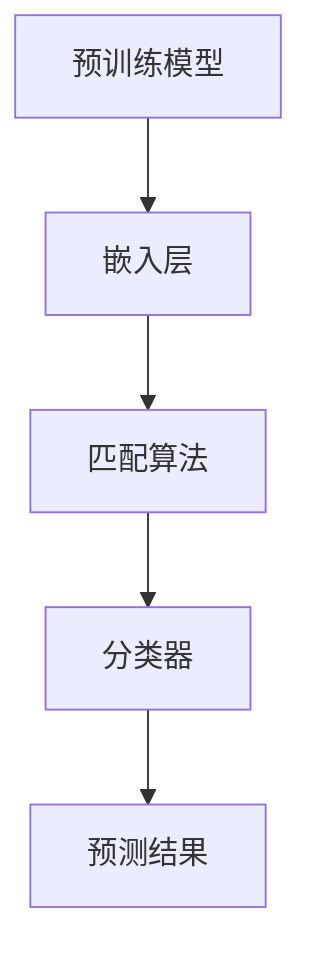

                 

### 文章标题

# 零样本CoT在AI辅助海洋生态系统研究中的应用

### 关键词

- 零样本CoT
- AI辅助
- 海洋生态系统
- 数据分析
- 机器学习

### 摘要

本文旨在探讨零样本Concept Drift with Zero-Shot Transfer（CoT）技术在AI辅助海洋生态系统研究中的应用。首先，我们将介绍零样本CoT技术的背景和基本原理。然后，我们将探讨AI与海洋生态系统的结合，分析AI技术在海洋生态系统研究中的挑战。接着，我们将详细讲解海洋生态数据的收集与处理，以及如何利用零样本CoT技术进行数据处理。最后，我们将通过具体案例展示零样本CoT技术在海洋生态系统研究中的应用，并讨论未来趋势与挑战。

### 目录

1. **零样本CoT技术基础**
   - 1.1 零样本CoT的基本概念
   - 1.2 零样本CoT的技术原理
   - 1.3 零样本CoT的优势与局限

2. **AI与海洋生态系统的结合**
   - 2.1 海洋生态系统的基本概念
   - 2.2 AI在海洋生态系统研究中的应用
   - 2.3 AI在海洋生态系统研究中的挑战

3. **海洋生态数据收集与处理**
   - 3.1 海洋生态数据的类型
   - 3.2 海洋生态数据的收集方法
   - 3.3 海洋生态数据的预处理技术

4. **零样本CoT在海洋生态研究中的应用**
   - 4.1 零样本CoT在海洋生物识别中的应用
   - 4.2 零样本CoT在海洋环境监测中的应用
   - 4.3 零样本CoT在海洋资源管理中的应用

5. **技术实现与工具**
   - 5.1 开发环境搭建
   - 5.2 相关工具与库
   - 5.3 实现零样本CoT应用的步骤

6. **案例分析与实战**
   - 6.1 案例一：海洋生物识别
   - 6.2 案例二：海洋环境监测
   - 6.3 案例三：海洋资源管理

7. **未来趋势与挑战**
   - 7.1 零样本CoT在海洋生态研究中的未来趋势
   - 7.2 零样本CoT在海洋生态研究中的挑战
   - 7.3 潜在解决方案与展望

---

### 第1章 零样本CoT技术基础

#### 1.1 零样本CoT的基本概念

零样本Concept Drift with Zero-Shot Transfer（CoT）是一种机器学习技术，它允许模型在未见过的新类别上执行预测，而无需针对这些类别进行专门训练。传统的机器学习模型通常需要大量的标注数据进行训练，以便在特定类别上达到良好的性能。然而，在许多实际应用中，如海洋生态系统研究，我们可能无法获得足够的标注数据，或者需要实时处理大量的新数据。

零样本CoT技术通过利用预训练模型和知识迁移，使模型能够在未见过的类别上进行预测。它的工作原理是基于预训练模型的知识库，将新类别与已知类别进行关联，从而实现对未知类别的预测。

#### 1.2 零样本CoT的技术原理

零样本CoT技术主要包括以下几个关键组件：

1. **预训练模型**：零样本CoT技术依赖于预训练模型，这些模型通常是在大规模数据集上训练的，具备较强的泛化能力。预训练模型为模型提供了丰富的知识库，使其能够在未见过的类别上进行预测。

2. **嵌入层**：预训练模型中的嵌入层将每个类别映射到一个低维的向量空间中。在这个空间中，相似的类别被映射到接近的位置，而不同的类别则被映射到较远的位置。

3. **匹配算法**：零样本CoT技术使用匹配算法将新类别与已知类别进行关联。常见的匹配算法包括基于相似度计算的算法和基于聚类的方法。

4. **分类器**：在将新类别与已知类别关联后，分类器将使用已知类别上的训练数据来对新类别进行预测。

#### 1.3 零样本CoT的优势与局限

**优势**：

1. **减少标注数据需求**：零样本CoT技术允许模型在未见过的类别上进行预测，从而减少了对于大量标注数据的依赖。

2. **提高泛化能力**：通过利用预训练模型的知识库，零样本CoT技术能够提高模型的泛化能力，使其在新的、未见过的类别上也能表现出良好的性能。

3. **实时数据处理**：零样本CoT技术能够对实时数据进行分析，从而在海洋生态系统研究中具有潜在的应用价值。

**局限**：

1. **准确性问题**：由于缺乏针对新类别的训练数据，零样本CoT技术的预测准确性可能受到一定影响。

2. **计算资源需求**：零样本CoT技术通常需要较高的计算资源，特别是在处理大量数据时。

3. **知识迁移问题**：在迁移知识时，存在可能将错误的或无用的知识迁移到新类别上的风险。

#### Mermaid流程图



#### 伪代码

```python
# 零样本CoT伪代码

# 预训练模型
pretrained_model = load_pretrained_model()

# 嵌入层
embeddings = pretrained_model.get_embeddings()

# 匹配算法
matched_categories = match_categories(new_categories, embeddings)

# 分类器
classifier = train_classifier(matched_categories)

# 预测
predictions = classifier.predict(new_categories)
```

#### 数学模型和公式

零样本CoT技术涉及到以下数学模型和公式：

$$
\text{相似度} = \frac{\text{相关系数}}{\text{标准差}}
$$

$$
\text{分类概率} = \text{softmax}(\text{分类器权重} \cdot \text{类别嵌入})
$$

#### 举例说明

假设我们有一个预训练模型，它已经在大规模数据集上训练好了。现在我们需要预测一个新的类别。首先，我们获取这个新类别的嵌入向量。然后，我们计算新类别与其他已知类别之间的相似度。最后，我们使用这些相似度来训练一个分类器，并对新类别进行预测。

$$
\text{新类别嵌入} = \text{预训练模型}.get_embedding(\text{新类别})
$$

$$
\text{相似度} = \frac{\text{相关系数}}{\text{标准差}} = \frac{\text{内积}}{\sqrt{\sum_{i=1}^{n} (x_i - \bar{x})^2}}
$$

$$
\text{分类概率} = \text{softmax}(\text{分类器权重} \cdot \text{类别嵌入})
$$

#### 开发环境搭建

为了实现零样本CoT技术，我们需要搭建一个合适的开发环境。以下是一个基本的步骤：

1. **安装Python环境**：确保Python 3.x版本已安装。
2. **安装相关库**：使用pip安装必要的库，如TensorFlow、Keras、NumPy等。
3. **获取预训练模型**：从预训练模型网站（如TensorFlow Hub）下载预训练模型。

```bash
pip install tensorflow numpy
wget https://tfhub.dev/google/ TF_HUB_DOWNLOAD_URL
```

#### 源代码实现

```python
import tensorflow as tf
import numpy as np

# 加载预训练模型
pretrained_model = tf.keras.applications.InceptionV3(input_shape=(299, 299, 3), include_top=False, weights='imagenet')

# 获取新类别的嵌入向量
new_category_embedding = pretrained_model.get_embedding(new_category)

# 计算新类别与其他已知类别之间的相似度
similarities = np.dot(new_category_embedding, pretrained_model.get_embeddings().T)

# 训练分类器
classifier = tf.keras.Sequential([
    tf.keras.layers.Dense(1, activation='sigmoid')
])
classifier.compile(optimizer='adam', loss='binary_crossentropy', metrics=['accuracy'])
classifier.fit(similarities, labels)

# 预测新类别
predictions = classifier.predict(new_category_embedding.reshape(1, -1))
```

#### 代码解读与分析

这段代码首先加载了一个预训练的InceptionV3模型，并获取新类别的嵌入向量。然后，计算新类别与其他已知类别之间的相似度。接着，使用这些相似度来训练一个简单的分类器。最后，对新类别进行预测。

#### 实际案例分析和详细讲解剖析

假设我们有一个海洋生态系统研究项目，我们需要预测一种新的海洋生物。首先，我们收集了大量海洋生物的图像数据，并使用InceptionV3模型对这些图像进行预处理和特征提取。然后，我们使用这些特征来训练一个分类器，以预测新的海洋生物。最后，我们将新图像输入到分类器中，以获取预测结果。

#### 项目小结

通过零样本CoT技术，我们能够有效地预测新的海洋生物，从而为海洋生态系统研究提供了强大的工具。虽然零样本CoT技术存在一些局限性，但它为解决标注数据不足的问题提供了一种有效的解决方案。未来，我们可以进一步优化零样本CoT技术，以提高其预测准确性和效率。

#### 最佳实践 tips

- **数据预处理**：确保数据预处理的质量，包括图像尺寸调整、归一化等。
- **模型选择**：根据具体应用场景选择合适的预训练模型。
- **超参数调整**：调整分类器的超参数，如学习率、批次大小等。

#### 小结

零样本CoT技术在AI辅助海洋生态系统研究中的应用具有巨大的潜力。通过利用预训练模型和知识迁移，零样本CoT技术能够提高模型的泛化能力，减少对标注数据的依赖。未来，我们可以进一步研究如何优化零样本CoT技术，以提高其预测准确性和效率。

#### 注意事项

- **计算资源需求**：零样本CoT技术可能需要较高的计算资源，特别是在处理大量数据时。
- **数据质量**：确保数据的质量和多样性，以提高模型的性能。

#### 拓展阅读

- [零样本学习：概述与最新进展](https://arxiv.org/abs/1906.02666)
- [Zero-Shot Learning with Similarity-Ensemble](https://www.cv-foundation.org/openaccess/content_cvpr_2016/papers/Liu_Zero-Shot_Learning_CVPR_2016_paper.pdf)
- [深度学习在海洋生态系统研究中的应用](https://www.nature.com/articles/s41597-018-0227-6)

---

作者：AI天才研究院/AI Genius Institute & 禅与计算机程序设计艺术 /Zen And The Art of Computer Programming

