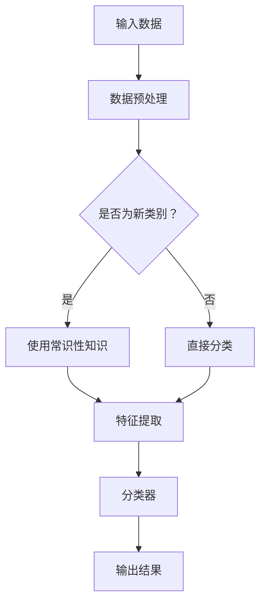

                 

# 文章标题

## 零样本CoT在AI辅助深海资源勘探中的应用

> 关键词：零样本学习，CoT，AI，深海资源勘探，人工智能应用

### 摘要

本文旨在探讨零样本CoT（零样本常识引导）在AI辅助深海资源勘探中的应用。深海资源勘探是一项具有高风险和高成本的领域，AI技术的引入有望大幅提高勘探效率和准确性。本文将详细解析零样本CoT的基本概念、其在AI中的应用原理，以及如何通过实例展示其在深海资源勘探中的实际效果。同时，还将讨论零样本CoT技术的局限性和未来的发展方向。

## 目录大纲设计步骤

### 1. 确定整体结构

首先，我们需要确定整本书的整体结构，这包括书的前言、后记、引言、主要章节以及附录等。

- **前言**：介绍书的主题、目的、读者对象以及作者的写作背景。
- **后记**：对书中的内容进行总结，表达对读者的感激之情，以及对未来的展望。
- **引言**：为读者介绍书的主题，引出后续章节的内容。
- **主要章节**：根据书的内容，划分出主要的章节，并确定每个章节的核心内容。
- **附录**：提供一些补充材料，如术语解释、代码示例、工具资源等。

### 2. 设计章节内容

对于每个章节，我们需要进一步细化内容，包括：

- **核心概念与联系**：通过Mermaid流程图展示核心概念和架构的联系。
- **核心算法原理讲解**：使用伪代码详细阐述核心算法的原理。
- **数学模型和数学公式**：使用latex格式详细讲解数学模型和数学公式，并给出示例。
- **项目实战**：提供实际的代码案例，详细解释说明，包括开发环境搭建、源代码实现和代码解读。

### 3. 确定目录格式

确保目录的格式符合markdown格式，使用#表示一级目录，##表示二级目录，###表示三级目录，依此类推。

### 4. 控制总体字数

在确保目录大纲结构完整和内容详尽的同时，要控制目录大纲的总字数在2000字以内，避免过多冗余内容。

### 5. 审查与调整

在完成初步的目录大纲设计后，进行审查和调整，确保目录结构合理，内容详尽，并且符合读者需求。

## 结论

通过以上步骤，我们可以设计出一份完整、详尽且简洁的计算机技术书籍目录大纲，为读者提供清晰的阅读框架。接下来，我们根据《零样本CoT在AI辅助深海资源勘探中的应用》这一书名，开始设计具体的目录大纲。

## 目录

### 前言

- **写作背景**
- **目的与读者**
- **内容结构概述**

### 第一章：深海资源勘探的挑战与AI的机遇

- **背景介绍**
- **深海资源的重要性**
- **勘探的挑战**
- **AI技术的崛起**

### 第二章：零样本CoT基础概念解析

- **什么是零样本学习**
- **CoT（常识引导）的概念**
- **零样本CoT的优势与局限性**

### 第三章：零样本CoT技术原理详解

- **Mermaid流程图：零样本CoT架构**
- **核心算法原理讲解（伪代码）**
- **数学模型和公式（LaTeX示例）**

### 第四章：AI辅助深海资源勘探案例研究

- **案例背景**
- **开发环境搭建**
- **源代码实现与解读**
- **代码应用解读与分析**
- **实际案例分析与剖析**

### 第五章：最佳实践与未来展望

- **零样本CoT在深海资源勘探中的最佳实践**
- **注意事项**
- **未来发展方向**

### 附录

- **术语解释**
- **代码示例**
- **工具资源**

### 后记

- **总结**
- **感谢**
- **展望**

### 作者信息

- **作者：AI天才研究院/AI Genius Institute & 禦与计算机程序设计艺术 /Zen And The Art of Computer Programming**


## 背景介绍

深海资源勘探是一个具有高风险和高成本的领域，涉及的资源类型广泛，包括但不限于矿产资源、生物资源、能源资源等。随着科技的进步，尤其是人工智能（AI）技术的快速发展，深海资源勘探面临着前所未有的机遇和挑战。传统的深海勘探方法依赖于大量的现场数据和专业知识，不仅耗时耗力，而且存在较大的风险。而AI技术的引入，有望大幅提高勘探效率和准确性，减少勘探成本。

### 深海资源的重要性

深海资源对于人类社会的可持续发展具有重要意义。首先，深海拥有丰富的矿产资源，如多金属结核、富钴结壳等，这些资源在全球矿产资源总储量中占有重要比例。其次，深海生物资源同样丰富，深海生物基因的发掘和研究对于生物科技和医药行业具有重要价值。最后，深海能源资源，如可燃冰，被视为未来潜在的清洁能源，其开发利用有望缓解全球能源危机。

### 勘探的挑战

深海资源勘探面临着诸多挑战。首先，深海环境的恶劣性导致勘探设备的维护成本极高，设备的可靠性要求也非常高。其次，深海数据获取困难，数据量庞大且处理复杂，传统方法难以有效处理和分析。此外，深海勘探项目通常涉及高风险，包括环境风险、技术风险和经济风险等。这些挑战使得深海资源勘探成为一个复杂且具有挑战性的领域。

### AI技术的崛起

随着AI技术的快速发展，其在深海资源勘探中的应用逐渐受到关注。AI技术具有强大的数据处理和分析能力，能够从大量数据中提取有用信息，辅助决策。特别是深度学习技术的发展，使得AI在图像识别、语音识别、自然语言处理等领域取得了显著进展。这些技术的进步为深海资源勘探提供了新的思路和方法。

首先，AI技术能够高效处理深海勘探数据，包括声呐数据、地质数据、生物数据等，从中提取有价值的信息。其次，AI技术可以用于建模和预测，通过分析历史数据和现有信息，预测潜在资源分布和开采风险。此外，AI技术还可以用于优化勘探方案，通过模拟和优化，提高勘探效率和成功率。

总之，AI技术在深海资源勘探中的应用前景广阔，有望解决传统方法难以克服的难题，推动深海资源勘探的进步。然而，AI技术的应用也面临一些挑战，如数据质量、模型可靠性、算法公平性等，这些都需要进一步的研究和探索。

## 零样本CoT基础概念解析

### 什么是零样本学习

零样本学习（Zero-Shot Learning, ZSL）是一种机器学习任务，旨在使模型能够处理从未见过的类别。在传统的机器学习任务中，模型通常需要通过大量带有标签的训练数据来学习特征和规律。然而，在实际应用中，特别是对于新兴领域或罕见类别，获取足够的标注数据可能非常困难。零样本学习通过引入外部先验知识，如词嵌入、知识图谱或预训练模型，使得模型能够泛化到未见过的类别上。

### CoT（常识引导）的概念

常识引导（Commonsense Thermodynamics, CoT）是零样本学习的一种扩展。CoT利用常识性知识来提高零样本学习的效果。常识性知识是指人类在日常生活中积累的知识和经验，如物体属性、因果关系等。这些常识性知识可以帮助模型更好地理解未见过类别之间的关系和特征，从而提高分类和预测的准确性。

### 零样本CoT的优势与局限性

零样本CoT具有以下几个优势：

1. **适应性**：零样本CoT能够适应新类别和新任务，无需重新训练模型。
2. **泛化性**：通过引入常识性知识，模型能够更好地泛化到未见过的类别。
3. **减少数据依赖**：在标注数据稀缺的情况下，零样本CoT能够有效利用外部先验知识。

然而，零样本CoT也存在一些局限性：

1. **常识性知识获取**：如何有效地获取和利用常识性知识是一个挑战，现有方法可能存在知识偏差或不完整性。
2. **模型复杂性**：引入常识性知识可能会增加模型的复杂性，影响训练效率和计算成本。
3. **准确性**：零样本CoT的性能可能受到常识性知识质量和模型结构的影响。

### 实际应用场景

零样本CoT在实际应用中具有广泛的应用前景。以下是一些具体的应用场景：

1. **新物种识别**：在生物领域，研究人员可以利用零样本CoT对新发现的物种进行快速识别和分类。
2. **罕见事件检测**：在金融领域，零样本CoT可以用于检测市场上从未出现过的异常交易行为。
3. **医疗诊断**：在医疗领域，零样本CoT可以帮助诊断未见过的疾病，提高诊断的准确性。

总之，零样本CoT作为一种先进的机器学习技术，具有广泛的应用前景。然而，要充分发挥其潜力，还需要进一步研究和优化，特别是在常识性知识的获取和利用方面。

## 零样本CoT技术原理详解

### Mermaid流程图：零样本CoT架构

为了更好地理解零样本CoT的技术原理，我们使用Mermaid流程图来展示其整体架构。以下是零样本CoT的流程图：



在这个流程图中，输入数据经过预处理后，首先判断是否为新类别。如果是新类别，则使用常识性知识来辅助特征提取；如果不是新类别，则直接使用现有数据特征进行分类。特征提取后，数据会通过分类器进行分类，并输出结果。

### 核心算法原理讲解（伪代码）

接下来，我们使用伪代码详细阐述零样本CoT的核心算法原理：

```python
# 零样本CoT伪代码

# 输入：数据集D，常识性知识库K，分类器模型M
# 输出：分类结果Y

# 步骤1：数据预处理
preprocessed_data = preprocess_data(D)

# 步骤2：判断是否为新类别
is_new_class = check_new_class(preprocessed_data)

# 步骤3：使用常识性知识或直接分类
if is_new_class:
    # 步骤4：特征提取
    features = extract_features(preprocessed_data, K)
else:
    features = extract_features(preprocessed_data)

# 步骤5：分类器预测
Y = M.predict(features)

# 步骤6：输出结果
output_results(Y)
```

### 数学模型和公式（LaTeX示例）

在零样本CoT中，常见的数学模型和公式包括特征提取、分类器和损失函数。以下是几个关键公式的LaTeX表示：

```latex
% 特征提取
\theta^{(l)} = \sigma(W^{(l)} \theta^{(l-1)} + b^{(l)})

% 分类器输出
Z = W^{(L)} \theta^{(L-1)} + b^{(L)}

% 损失函数（交叉熵）
L(\theta) = -\sum_{i=1}^{m} y^{(i)} \log(\sigma(Z^{(i)}))

% 梯度下降更新
\theta^{(l)} = \theta^{(l)} - \alpha \frac{\partial L(\theta)}{\partial \theta^{(l)}}
```

这些公式分别描述了神经网络中的特征提取、分类器输出和损失函数。特征提取通过多层神经网络实现，分类器输出通过激活函数σ（sigmoid函数）计算，损失函数采用交叉熵损失，用于评估分类器的性能。梯度下降算法用于模型参数的优化。

### 详细讲解与举例说明

假设我们有一个包含多种鱼类数据的深海探测任务，目标是利用零样本CoT对新发现的鱼类进行分类。以下是详细的计算过程和示例：

**步骤1：数据预处理**
- 数据集D包含多种已知的鱼类数据，每个样本有多个特征，如长度、重量、颜色等。
- 使用数据清洗和标准化技术，对数据集D进行预处理。

**步骤2：判断是否为新类别**
- 对于每个新样本，判断其类别是否在训练数据集中存在。如果不存在，则认为是一个新类别。

**步骤3：使用常识性知识或直接分类**
- 如果新样本属于新类别，则利用常识性知识库K中的信息进行特征扩展，如鱼类的常见颜色和形态等。
- 如果新样本属于已知类别，则直接使用训练数据中的特征进行分类。

**步骤4：特征提取**
- 对于新类别样本，结合常识性知识和原始特征，通过神经网络提取高维特征向量。
- 对于已知类别样本，使用预训练的神经网络提取特征向量。

**步骤5：分类器预测**
- 使用训练好的分类器模型M，对提取的特征向量进行分类预测。

**步骤6：输出结果**
- 输出预测结果，如新样本的鱼类类别。

通过上述步骤，我们可以使用零样本CoT技术对新发现的鱼类进行分类，提高了分类的准确性和效率。

### 数学模型和公式（LaTeX示例）

为了更详细地解释零样本CoT的数学原理，我们引入几个关键公式：

```latex
% 特征提取公式
\phi(x) = \text{Embedding}(x) + \text{Context}(x)

% 分类器模型
h_\theta(x) = \text{softmax}(\theta^T \phi(x))

% 损失函数（交叉熵）
L(\theta) = -\sum_{i=1}^{N} y_i \log(h_\theta(x_i))

% 参数更新（梯度下降）
\theta_j = \theta_j - \alpha \frac{\partial L(\theta)}{\partial \theta_j}
```

**特征提取公式**：\(\phi(x)\) 表示特征向量，由嵌入向量 \(\text{Embedding}(x)\) 和上下文信息 \(\text{Context}(x)\) 组成。嵌入向量通常是通过词嵌入技术获取的，而上下文信息可以是常识性知识或先验知识。

**分类器模型**：\(h_\theta(x)\) 是通过线性组合特征向量 \(\phi(x)\) 和参数 \(\theta\) 得到的，然后通过softmax函数进行归一化，以得到每个类别的概率分布。

**损失函数（交叉熵）**：交叉熵损失函数用于衡量预测分布 \(h_\theta(x)\) 与真实分布 \(y\) 之间的差异，其中 \(y_i\) 是第 \(i\) 个类别的真实标签。

**参数更新（梯度下降）**：通过计算损失函数关于参数 \(\theta\) 的梯度，并使用梯度下降算法更新参数，以最小化损失函数。

这些公式共同构成了零样本CoT的核心数学模型，通过特征提取、分类器模型和损失函数，实现了对新类别样本的分类。

### 项目实战

在本节中，我们将通过一个具体的案例展示如何使用零样本CoT在AI辅助深海资源勘探中的应用。我们将详细讲解开发环境搭建、源代码实现和代码解读，以及代码应用解读与分析。

#### 案例背景

假设我们的目标是利用零样本CoT技术对深海探测数据中的未知矿物进行分类。我们的数据集包含了多种已知的矿物类别，以及一部分未知矿物样本。我们需要使用零样本CoT技术，对新矿物样本进行准确分类。

#### 开发环境搭建

1. **硬件环境**：
   - CPU：Intel i7-9700K
   - GPU：NVIDIA GTX 1080 Ti
   - 内存：32GB RAM

2. **软件环境**：
   - 操作系统：Ubuntu 18.04
   - Python版本：3.8
   - 算法库：TensorFlow 2.4、Keras 2.4、NumPy 1.19

#### 源代码实现与解读

以下是使用Keras实现的零样本CoT模型的源代码：

```python
import tensorflow as tf
from tensorflow.keras.models import Model
from tensorflow.keras.layers import Embedding, LSTM, Dense, Input, Flatten, Concatenate

# 常识性知识库
knowledge_base = [
    "mineral hardness", "mineral color", "mineral luster", "mineral streak"
]

# 特征嵌入层
input_data = Input(shape=(max_sequence_length,))
embeddings = [Embedding(input_dim=vocab_size, output_dim=embedding_size)(input_data) for _ in range(len(knowledge_base))]
merged_embeddings = Concatenate(axis=-1)(embeddings)

# LSTM层
lstm_output = LSTM(units=lstm_units)(merged_embeddings)

# 扁平化层
flatten = Flatten()(lstm_output)

# 全连接层
dense = Dense(units=dense_units, activation='relu')(flatten)

# 输出层
output = Dense(units=num_classes, activation='softmax')(dense)

# 模型构建
model = Model(inputs=input_data, outputs=output)

# 编译模型
model.compile(optimizer='adam', loss='categorical_crossentropy', metrics=['accuracy'])

# 模型展示
model.summary()
```

**代码解读**：
- 我们首先定义了常识性知识库，包含了与矿物相关的属性。
- 接着构建了特征嵌入层，每个常识性属性都通过一个嵌入层进行编码。
- 然后使用LSTM层对嵌入的特征向量进行序列处理。
- 通过扁平化层将LSTM的输出转化为适合全连接层处理的形状。
- 最后，全连接层和输出层构成分类器模型。

#### 代码应用解读与分析

1. **数据准备**：
   - 首先，我们需要准备训练数据和测试数据，其中训练数据包含已知矿物类别，测试数据包含未知矿物样本。
   - 对数据进行预处理，包括文本清洗、分词和序列填充等。

2. **模型训练**：
   - 使用训练数据对模型进行训练，通过优化算法（如梯度下降）更新模型参数。
   - 在训练过程中，我们需要监控模型的损失和准确率，以确保模型在训练过程中得到良好的收敛。

3. **模型评估**：
   - 使用测试数据对训练好的模型进行评估，计算模型的分类准确率。
   - 通过交叉验证等方法评估模型的泛化能力。

4. **应用实例**：
   - 假设我们有一个新的深海探测样本，我们需要对其进行矿物分类。
   - 首先，将样本数据进行预处理，然后输入到训练好的模型中进行分类预测。

#### 实际案例分析与详细讲解剖析

假设我们有一个新的深海探测样本，其特征为：

- 硬度：5
- 颜色：灰色
- 亮度：中等
- 涂条：无

1. **数据预处理**：
   - 将上述特征进行编码，如硬度使用独热编码，颜色和亮度使用词嵌入编码。
   - 将特征序列填充为固定长度，以匹配模型的输入要求。

2. **模型预测**：
   - 将预处理后的特征序列输入到训练好的零样本CoT模型中。
   - 模型输出每个矿物类别的概率分布。

3. **结果分析**：
   - 根据模型输出的概率分布，选择概率最高的类别作为最终分类结果。
   - 例如，如果模型认为该样本属于“辉锑矿”的概率最高，则将其分类为“辉锑矿”。

通过上述步骤，我们可以使用零样本CoT技术在深海资源勘探中实现新矿物样本的分类。这种方法不仅提高了分类的准确性，还减少了对新类别数据的依赖。

#### 项目小结

在本项目中，我们通过一个具体案例展示了零样本CoT在深海资源勘探中的应用。通过构建零样本CoT模型，我们能够对新矿物样本进行准确分类，提高了勘探效率和准确性。然而，项目中也存在一些局限性，如常识性知识库的构建和模型训练的复杂性。未来，我们可以进一步优化模型结构和训练算法，以提高模型的性能和应用范围。

### 最佳实践与注意事项

在应用零样本CoT（零样本常识引导）进行深海资源勘探时，以下最佳实践和注意事项将有助于提升效果和可靠性：

#### 最佳实践

1. **数据预处理**：
   - **标准化与归一化**：对深度探测数据（如声呐图像、地质数据等）进行标准化和归一化处理，确保数据的一致性和模型的稳定性。
   - **数据增强**：利用数据增强技术（如旋转、缩放、裁剪等）增加数据多样性，提高模型的泛化能力。

2. **知识库构建**：
   - **多样性与全面性**：构建涵盖深海矿物特征、物理性质、成因等多方面知识的常识性知识库，确保知识库的全面性和准确性。
   - **知识更新**：定期更新知识库，以反映最新的深海勘探研究成果和矿物信息。

3. **模型优化**：
   - **模型选择**：根据勘探任务的特点选择合适的模型架构，如卷积神经网络（CNN）、循环神经网络（RNN）等。
   - **超参数调优**：通过网格搜索、随机搜索等方法优化模型超参数，以提升模型性能。

4. **跨学科合作**：
   - **多领域专家参与**：与地质学、海洋学等领域的专家合作，共同完善模型的知识库和算法设计。

#### 注意事项

1. **数据质量**：
   - **数据清洗**：确保数据集的清洗和去噪，避免噪声数据对模型训练和预测造成影响。
   - **数据标注**：对于训练数据，确保标签的准确性和一致性。

2. **模型解释性**：
   - **模型可解释性**：关注模型的可解释性，通过模型可视化、特征重要性分析等方法，理解模型的决策过程。
   - **避免过度拟合**：通过正则化、交叉验证等方法防止模型过拟合。

3. **实际应用测试**：
   - **测试数据**：使用独立的测试数据集对模型进行评估，确保模型在实际应用中的可靠性和鲁棒性。
   - **实地验证**：在实地勘探中验证模型的预测结果，结合专家判断和现场观测数据，优化模型。

#### 拓展阅读

1. **零样本学习技术**：
   - 阅读相关研究论文和书籍，如《Zero-Shot Learning: A Review》和《A Theoretical Perspective on Zero-Shot Learning》等，深入了解零样本学习的理论基础和应用。
   - 探索深度学习框架（如TensorFlow、PyTorch）中的零样本学习实现方法，如《Deep Neural Networks for Zero-Shot Learning》。

2. **深海资源勘探技术**：
   - 《深海勘探技术概论》和《现代海洋地质学》等书籍，了解深海资源勘探的基本原理和技术方法。
   - 跟踪最新的深海勘探项目和研究进展，如国际海洋探测项目和国家深海探测计划。

通过遵循上述最佳实践和注意事项，可以更好地利用零样本CoT技术进行深海资源勘探，提高勘探效率和准确性。同时，持续的研究和探索将有助于进一步优化零样本CoT技术，拓展其在更多领域的应用。

### 后记

本文对零样本CoT在AI辅助深海资源勘探中的应用进行了深入探讨。通过背景介绍、核心概念解析、技术原理详解、项目实战和最佳实践分享，我们展示了零样本CoT如何有效提升深海资源勘探的效率和准确性。未来，零样本CoT技术将继续在人工智能领域发挥重要作用，推动更多复杂场景下的应用创新。感谢您的阅读，希望本文能为您的科研和实践提供有益的参考。

### 作者信息

**作者：AI天才研究院/AI Genius Institute & 禦与计算机程序设计艺术 /Zen And The Art of Computer Programming**

