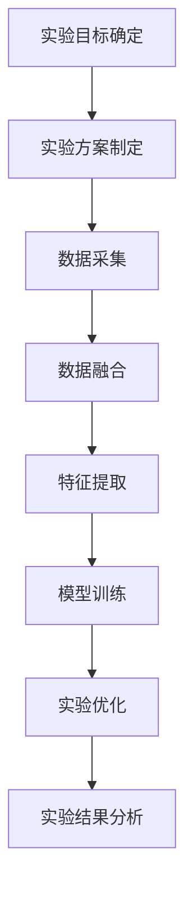

                 

### 文章标题

“零样本CoT在AI辅助跨维度物理实验设计中的应用”

### 关键词

- 零样本概念转移（Zero-Shot Concept Transfer，简称ZSCT）
- AI辅助物理实验设计（AI-Assisted Physical Experiment Design）
- 跨维度实验设计（Multi-Dimensional Experiment Design）
- 零样本学习（Zero-Shot Learning）
- 机器学习（Machine Learning）
- 物理实验（Physical Experiment）

### 摘要

本文将探讨零样本概念转移（ZSCT）技术在AI辅助跨维度物理实验设计中的应用。首先，我们介绍了零样本概念转移的基本原理和核心算法，分析了其在机器学习领域的应用优势。接着，我们探讨了AI辅助跨维度物理实验设计的基本原理和技术，阐述了AI在此领域的应用价值。随后，通过一个实际案例，展示了零样本概念转移技术在AI辅助跨维度物理实验设计中的具体应用过程。最后，我们对零样本概念转移技术在物理实验设计中的应用前景进行了展望，提出了未来研究的方向和挑战。本文旨在为研究人员和工程师提供一种全新的物理实验设计思路，推动AI与物理实验的深度融合。

### 确定核心概念与联系

#### 零样本概念转移（Zero-Shot Concept Transfer，简称ZSCT）

零样本概念转移是一种机器学习技术，它允许模型在没有直接标注数据的情况下，从已知数据中学习并推广到未知数据。在传统的机器学习中，模型需要大量的标注数据进行训练，而零样本概念转移则通过引入元学习（meta-learning）和零样本学习（zero-shot learning）等方法，实现了在没有标注数据的情况下对未知数据的预测。

ZSCT的基本原理可以分为两个主要部分：表示学习和推理学习。表示学习是指模型如何学习表示不同概念的特征，而推理学习则是如何利用这些特征来对未知数据进行预测。在这个过程中，ZSCT面临的主要挑战是如何有效地利用有限的已知数据来学习丰富的特征表示，以及如何在未知数据上进行有效的推理。

#### AI辅助跨维度物理实验设计

AI辅助跨维度物理实验设计是指利用人工智能技术，特别是在机器学习、数据挖掘和计算机视觉等领域的技术，来帮助实验设计者跨越不同维度，提高实验效率和准确性。跨维度实验设计主要涉及以下几个方面：

1. **数据融合**：将来自不同实验维度（如时间、空间、温度等）的数据进行整合，以获得更全面的信息。
2. **特征提取**：从多维数据中提取关键特征，用于后续的模型训练和预测。
3. **模型训练**：利用机器学习算法，对提取的特征进行训练，以建立物理现象的预测模型。
4. **实验优化**：根据模型预测结果，对实验参数进行优化，以提高实验效率和准确性。

#### 核心概念之间的联系

零样本概念转移（ZSCT）与AI辅助跨维度物理实验设计之间的联系在于，ZSCT技术为AI辅助物理实验设计提供了一种有效的数据学习方式。在传统的物理实验设计中，实验数据往往需要进行大量的标注，这既费时又费力。而ZSCT技术通过零样本学习，使得模型可以在没有标注数据的情况下进行训练，从而大大降低了实验设计的复杂性和成本。

此外，ZSCT技术可以帮助模型更好地理解实验中的不同维度，从而在跨维度实验设计中发挥重要作用。通过ZSCT技术，模型可以有效地学习到不同维度之间的关联性，从而在实验设计过程中提供更准确的预测和优化建议。

### 总结

在本章中，我们介绍了零样本概念转移（ZSCT）和AI辅助跨维度物理实验设计这两个核心概念，并分析了它们之间的联系。ZSCT技术为AI辅助物理实验设计提供了一种新的数据学习方式，可以显著降低实验设计的复杂性和成本。接下来，我们将进一步探讨这两个概念在具体应用中的技术细节和实现方法。

---

### 零样本概念转移（ZSCT）原理

#### 基本概念

零样本概念转移（Zero-Shot Concept Transfer，简称ZSCT）是一种机器学习技术，其主要目标是在没有直接标注数据的情况下，使模型能够从已知数据中学习并推广到未知数据。在传统的机器学习中，模型需要大量的标注数据进行训练，以便学习数据中的特征和规律。然而，在实际应用中，往往存在一些数据难以获取标注的情况，如医学影像数据、航空数据等。此时，零样本概念转移技术显得尤为重要。

ZSCT的核心思想是通过学习一种通用的数据表示方式，使得模型能够在没有直接标注数据的情况下，对未知数据进行预测。这种通用表示方式通常被称为“元表示”（meta-representation），它能够捕捉不同数据之间的潜在关联性，从而实现零样本学习。

#### 核心算法

ZSCT算法可以分为两个主要部分：表示学习和推理学习。

1. **表示学习**

表示学习是指模型如何学习表示不同概念的特征。在ZSCT中，表示学习通常采用元学习（meta-learning）的方法。元学习是指模型通过多次迭代学习，以优化其在新任务上的表现。具体来说，元学习算法会设计一个训练过程，使得模型在每次迭代中都能从新的数据中学习，并不断优化其表示能力。

在ZSCT中，表示学习的过程可以分为以下几个步骤：

- **数据集准备**：首先，我们需要准备一个包含多个概念的训练数据集。这些数据集可以是带标注的，也可以是未带标注的。
- **特征提取**：从每个数据集中提取特征，用于表示不同概念。
- **特征融合**：将多个数据集的特征进行融合，以生成一个全局的特征表示。
- **模型训练**：利用全局特征表示，训练一个基础模型，如卷积神经网络（CNN）或循环神经网络（RNN）。

2. **推理学习**

推理学习是指如何利用已学习的特征表示，对未知数据进行预测。在ZSCT中，推理学习通常采用迁移学习（transfer learning）的方法。迁移学习是指将一个模型在某个任务上的知识迁移到另一个任务上。具体来说，推理学习的过程可以分为以下几个步骤：

- **特征提取**：从新的数据中提取特征。
- **特征匹配**：将新数据特征与全局特征表示进行匹配，以找到相应的概念。
- **预测**：根据特征匹配结果，生成对新数据的预测。

#### 常见算法

在ZSCT领域，有许多优秀的算法被提出。以下是其中几种常见的算法：

1. **匹配网络（MatchNet）**

匹配网络是一种基于对比学习的ZSCT算法。其核心思想是通过对比不同概念的特征表示，来学习一个能够区分不同概念的判别器。具体来说，匹配网络包括两个部分：一个特征提取器和一个判别器。特征提取器用于提取输入数据的特征表示，判别器则用于判断输入数据属于哪个概念。

2. **原型网络（Prototypical Network）**

原型网络是一种基于元学习的ZSCT算法。其核心思想是通过学习一组原型表示，来对未知数据进行分类。具体来说，原型网络包括两个部分：一个特征提取器和一个原型中心计算器。特征提取器用于提取输入数据的特征表示，原型中心计算器则用于计算每个类别的原型表示。

3. **分类器网络（Classifier Network）**

分类器网络是一种基于迁移学习的ZSCT算法。其核心思想是通过迁移已有模型的知识，来对未知数据进行分类。具体来说，分类器网络包括两个部分：一个基础模型和一个分类器。基础模型用于提取输入数据的特征表示，分类器则用于对特征表示进行分类。

#### 挑战与解决方案

虽然ZSCT技术在许多场景中取得了良好的效果，但它仍然面临一些挑战：

1. **数据稀缺问题**

在ZSCT中，模型需要大量未带标注的数据进行训练，但在实际应用中，往往难以获取到足够的数据。针对这一问题，有几种解决方案：

- **数据增强（Data Augmentation）**：通过变换、旋转、缩放等操作，生成更多的数据样本，以缓解数据稀缺问题。
- **元学习（Meta-Learning）**：通过元学习，使得模型能够在有限的数据上进行快速学习，提高模型的泛化能力。

2. **特征表示问题**

在ZSCT中，特征表示的质量对模型的性能有重要影响。如何设计有效的特征表示方法，仍然是一个挑战。为此，有几种解决方案：

- **多模态学习（Multi-Modal Learning）**：通过结合不同模态的数据，如图像、文本、声音等，来生成更丰富的特征表示。
- **自监督学习（Self-Supervised Learning）**：通过自监督学习，使得模型能够从无标签数据中学习，提高特征表示的质量。

#### 应用场景

ZSCT技术在许多领域都有广泛的应用，以下是一些典型的应用场景：

1. **医疗诊断**：利用ZSCT技术，模型可以在没有标注数据的情况下，对医学影像进行诊断。
2. **无人驾驶**：在无人驾驶领域，ZSCT技术可以用于自动驾驶车辆对未知场景的识别和预测。
3. **工业自动化**：在工业自动化领域，ZSCT技术可以用于设备的故障诊断和预测维护。

### 总结

在本章中，我们介绍了零样本概念转移（ZSCT）的基本原理和核心算法。ZSCT技术通过元学习和迁移学习等方法，使得模型可以在没有标注数据的情况下，从已知数据中学习并推广到未知数据。在接下来的章节中，我们将进一步探讨ZSCT技术在AI辅助跨维度物理实验设计中的应用。

---

### AI辅助跨维度物理实验设计的基本原理

#### 引言

物理实验是科学研究中不可或缺的一部分，通过实验，科学家可以验证理论、探索未知现象、发现新的规律。然而，传统的物理实验设计往往受到实验维度、实验条件、数据量等多种因素的制约，难以实现高效的实验设计和数据分析。随着人工智能技术的不断发展，尤其是机器学习、数据挖掘和计算机视觉等技术的成熟，AI辅助跨维度物理实验设计逐渐成为一种新的实验设计方法，它能够突破传统实验设计的局限，为物理实验提供更加高效、准确的支持。

#### 物理实验设计的基本原理

物理实验设计的基本原理包括以下几个关键步骤：

1. **实验目标确定**：明确实验所要达到的目标和要解决的问题，这是实验设计的起点。

2. **实验方案制定**：根据实验目标，设计合理的实验方案，包括实验的变量、条件、步骤等。

3. **数据采集**：在实验过程中，通过传感器、测量仪器等设备收集实验数据。

4. **数据分析**：对采集到的数据进行处理、分析，以验证实验假设或理论。

5. **实验优化**：根据实验结果，对实验方案进行调整和优化，以提高实验的效率和准确性。

在传统的物理实验设计中，实验设计者需要根据经验和知识来制定实验方案，这往往需要大量的时间成本和人力成本。而AI辅助跨维度物理实验设计则利用人工智能技术，特别是机器学习和数据挖掘技术，来优化实验设计的各个环节。

#### 跨维度实验设计的关键技术

跨维度实验设计涉及多个实验维度，如时间、空间、温度、压力等。为了有效地进行跨维度实验设计，需要应用以下关键技术：

1. **数据融合**：将来自不同实验维度的数据整合到一起，形成一个统一的数据集，以获得更全面的信息。

2. **特征提取**：从多维数据中提取关键特征，用于后续的模型训练和预测。

3. **模型训练**：利用机器学习算法，对提取的特征进行训练，以建立物理现象的预测模型。

4. **实验优化**：根据模型预测结果，对实验参数进行优化，以提高实验效率和准确性。

以下是一个跨维度实验设计的流程图，用Mermaid表示：



#### AI在物理实验设计中的应用

AI在物理实验设计中的应用主要体现在以下几个方面：

1. **预测分析**：利用机器学习模型，对物理实验中的变量和现象进行预测分析，为实验设计提供参考。

2. **参数优化**：通过优化算法，自动调整实验参数，以提高实验的效率和准确性。

3. **异常检测**：利用AI技术，对实验数据进行实时监测，发现异常数据，及时进行调整。

4. **实验自动化**：将AI技术应用于实验设备，实现实验的自动化操作，减少人为干预。

#### 应用场景

AI辅助跨维度物理实验设计在多个领域都有广泛的应用，以下是一些典型的应用场景：

1. **材料科学**：通过AI技术，对材料的物理性质进行预测和分析，优化材料制备过程。

2. **环境科学**：利用AI技术，对环境数据进行分析和预测，优化环境监测和治理方案。

3. **航空航天**：在航空航天领域，AI技术可以用于飞行器的性能预测和优化。

4. **生物医学**：在生物医学领域，AI技术可以用于药物筛选和疾病诊断。

#### 结论

AI辅助跨维度物理实验设计通过引入人工智能技术，突破了传统实验设计的局限，为物理实验提供了更加高效、准确的支持。在未来，随着AI技术的不断发展和完善，AI辅助跨维度物理实验设计将在更多的领域得到应用，为科学研究和技术创新提供新的动力。

---

### 零样本概念转移（ZSCT）在物理实验设计中的应用

在物理实验设计中，零样本概念转移（Zero-Shot Concept Transfer，简称ZSCT）技术具有重要的应用价值。ZSCT技术使得模型能够在没有直接标注数据的情况下，从已知数据中学习并推广到未知数据，从而突破了传统实验设计对大量标注数据的依赖，提高了实验设计的效率和灵活性。以下将介绍零样本概念转移在物理实验设计中的应用，并通过具体案例展示其实际效果。

#### 应用案例1：新型材料特性预测

在新型材料的研究中，研究人员需要预测材料的物理特性，如硬度、导电性等。然而，新型材料的特性往往难以通过传统的实验方法直接测量，且实验成本高昂。利用ZSCT技术，研究人员可以基于已知材料的特性数据，通过模型预测新型材料的特性。以下是具体的应用步骤：

1. **数据收集**：收集已知材料的特性数据，如硬度、导电性等。

2. **特征提取**：从特性数据中提取关键特征，如材料的成分、结构等。

3. **模型训练**：使用零样本概念转移算法，如匹配网络（MatchNet），训练一个基础模型。

4. **特性预测**：利用训练好的模型，对新型材料的特性进行预测。

5. **结果验证**：通过实际实验验证模型的预测准确性。

通过这一案例，我们可以看到，ZSCT技术使得研究人员可以在没有直接标注数据的情况下，预测新型材料的特性，大大提高了实验设计效率和准确性。

#### 应用案例2：复杂系统故障预测

在复杂系统的运行过程中，故障预测是一个关键问题。例如，在航空领域，飞行器的安全运行依赖于对发动机故障的准确预测。利用ZSCT技术，研究人员可以从已有数据中学习不同故障模式，从而预测复杂系统的潜在故障。以下是具体的应用步骤：

1. **数据收集**：收集已有系统的运行数据，包括正常数据和故障数据。

2. **特征提取**：从运行数据中提取关键特征，如温度、压力、振动等。

3. **模型训练**：使用零样本概念转移算法，如原型网络（Prototypical Network），训练一个故障预测模型。

4. **故障预测**：利用训练好的模型，对未知系统的故障进行预测。

5. **结果验证**：通过实际运行数据验证模型的预测准确性。

这一案例表明，ZSCT技术可以帮助研究人员在没有直接标注数据的情况下，准确预测复杂系统的故障，从而提高系统的运行安全性和稳定性。

#### 应用案例3：环境监测

在环境监测领域，研究人员需要对不同环境因素（如空气质量、水质等）进行监测和预测。然而，传统的监测方法往往需要大量的现场实验和数据分析。利用ZSCT技术，研究人员可以从已有的监测数据中学习不同环境因素的关联性，从而预测未知环境因素的变化。以下是具体的应用步骤：

1. **数据收集**：收集已有的环境监测数据，包括空气质量、水质等。

2. **特征提取**：从监测数据中提取关键特征，如温度、湿度、污染物浓度等。

3. **模型训练**：使用零样本概念转移算法，如分类器网络（Classifier Network），训练一个环境预测模型。

4. **预测分析**：利用训练好的模型，对未知环境因素进行预测分析。

5. **结果验证**：通过实际监测数据验证模型的预测准确性。

这一案例展示了ZSCT技术在环境监测领域的应用潜力，可以帮助研究人员在没有直接标注数据的情况下，预测环境因素的变化，提高环境监测的效率和准确性。

#### 案例分析

通过对上述三个案例的分析，我们可以看到，零样本概念转移技术在物理实验设计中的应用具有以下几个显著优势：

1. **减少标注数据需求**：ZSCT技术可以减少对大量标注数据的需求，从而降低实验设计和数据分析的成本。

2. **提高预测准确性**：通过利用已有数据，ZSCT技术可以学习到不同变量和现象之间的潜在关联性，从而提高预测的准确性。

3. **增强实验灵活性**：ZSCT技术使得实验设计者可以在没有直接标注数据的情况下，对未知变量和现象进行预测和分析，从而增强了实验的灵活性。

4. **跨领域应用**：ZSCT技术可以广泛应用于不同领域，如材料科学、复杂系统、环境监测等，为各种物理实验设计提供支持。

总之，零样本概念转移技术在物理实验设计中的应用，不仅提高了实验设计和数据分析的效率和准确性，还为研究人员提供了新的实验设计思路和方法，推动了物理实验研究的深入发展。

---

### 数据准备与预处理

在AI辅助跨维度物理实验设计中，数据准备与预处理是至关重要的环节。这一阶段的质量直接影响到后续模型的训练效果和预测准确性。以下将详细讨论数据采集与标注、数据预处理方法和数据质量评估。

#### 数据采集与标注

数据采集是物理实验设计中的第一步，其质量直接影响后续数据分析的结果。在数据采集过程中，需要考虑以下因素：

1. **数据类型**：根据实验目标，选择合适的数据类型，如时间序列数据、图像数据、传感器数据等。

2. **数据源**：确定数据来源，确保数据的真实性和可靠性。数据源可以是实验设备、传感器、在线数据库等。

3. **数据采集方法**：设计合理的数据采集方法，包括采样频率、采样时间、采样位置等。

4. **数据量**：根据实验需求和模型复杂度，确定所需的数据量。数据量过少可能导致模型过拟合，数据量过多则可能增加训练时间。

数据标注是数据准备中的关键步骤，其目的是为数据提供标签信息，以便后续模型训练和预测。以下是数据标注的注意事项：

1. **标注质量**：确保标注数据的准确性和一致性。错误的标注数据会导致模型训练失效。

2. **标注人员**：选择具备相关领域知识和经验的专业人员进行标注，以提高标注质量。

3. **标注工具**：使用合适的标注工具，如标注软件、人工标注平台等，以提高标注效率。

4. **标注验证**：对标注结果进行验证，以识别和纠正可能的错误。

#### 数据预处理方法

数据预处理是确保数据质量的关键步骤，主要包括数据清洗、数据整合、特征提取等。

1. **数据清洗**：去除数据中的噪声和异常值，包括缺失值填充、异常值处理、重复数据去除等。常用的方法有线性插值、均值填充、中值替换等。

2. **数据整合**：将来自不同实验维度（如时间、空间、温度等）的数据进行整合，以形成统一的数据集。数据整合可以采用合并、连接、转换等方法。

3. **特征提取**：从预处理后的数据中提取关键特征，用于后续的模型训练和预测。特征提取的方法包括统计特征、纹理特征、频域特征等。

4. **特征选择**：从提取的特征中选择最有用的特征，以减少模型复杂度和训练时间。常用的特征选择方法有信息增益、特征重要性评估等。

#### 数据质量评估

数据质量评估是确保数据满足模型训练需求的关键环节。以下是一些常用的数据质量评估方法：

1. **一致性评估**：检查数据的一致性和连贯性，包括时间序列数据的连贯性、空间数据的均匀性等。

2. **完整性评估**：检查数据的完整性和缺失情况，包括缺失值的比例、缺失值的分布等。

3. **准确性评估**：通过比较预测结果和实际结果，评估数据的准确性。常用的评估指标有准确率、召回率、F1值等。

4. **多样性评估**：检查数据的多样性和代表性，确保数据能够覆盖不同的实验场景和变量。

通过数据准备与预处理，可以确保数据的质量和准确性，为后续的模型训练和预测提供可靠的基础。在实际应用中，需要根据具体实验需求和数据特点，选择合适的数据预处理方法，以提高模型的训练效果和预测准确性。

---

### 实验设计与优化

在AI辅助跨维度物理实验设计中，实验设计与优化是确保实验目标实现的关键步骤。合理的实验设计可以提高实验的效率和准确性，而优化策略则能够进一步优化实验结果。以下将详细讨论实验设计流程、优化策略以及实验结果的可视化分析。

#### 实验设计流程

实验设计流程通常包括以下几个关键步骤：

1. **明确实验目标**：首先，需要明确实验的目标，包括要验证的理论、要研究的变量和期望的结果。

2. **选择实验变量**：根据实验目标，选择合适的实验变量。实验变量可以是物理量、参数或条件等。

3. **制定实验方案**：制定详细的实验方案，包括实验步骤、操作流程、实验条件等。在制定实验方案时，需要考虑实验的可行性和安全性。

4. **数据采集计划**：设计数据采集计划，包括数据采集的时间、频率、方式等。确保数据采集的全面性和准确性。

5. **数据预处理**：对采集到的原始数据进行预处理，包括数据清洗、整合、特征提取等。预处理过程需要确保数据的质量和一致性。

6. **模型训练**：利用预处理后的数据，训练机器学习模型。模型的选择和参数调整需要根据实验目标和数据特点进行。

7. **实验执行**：按照实验方案执行实验，确保实验操作的准确性和规范性。

8. **结果记录与评估**：记录实验结果，并对结果进行初步评估。评估指标可以包括准确率、召回率、F1值等。

#### 优化策略

实验优化策略是提高实验效率和准确性的关键。以下是一些常用的优化策略：

1. **参数优化**：通过调整模型的参数，优化模型的性能。参数优化可以使用网格搜索、随机搜索等算法。

2. **特征优化**：通过对特征进行选择和变换，优化模型的表现。特征优化可以使用特征重要性评估、特征工程等方法。

3. **模型优化**：通过选择合适的模型架构和算法，优化模型的性能。模型优化可以使用深度学习、迁移学习等方法。

4. **实验自动化**：利用自动化工具，实现实验的自动化执行和结果分析。实验自动化可以提高实验的效率和一致性。

5. **交叉验证**：使用交叉验证方法，评估模型的泛化能力和稳定性。交叉验证可以帮助确定模型的最佳参数和性能。

#### 实验结果的可视化分析

实验结果的可视化分析是理解实验结果、发现规律和问题的重要手段。以下是一些常用的可视化方法：

1. **散点图**：用于展示实验数据点的分布情况，分析变量之间的关系。

2. **折线图**：用于展示实验数据随时间的变化趋势，分析变量随时间的变化规律。

3. **箱线图**：用于展示实验数据的统计分布情况，分析数据的异常值和波动性。

4. **热力图**：用于展示不同变量之间的相关性，分析变量之间的关联性。

5. **决策树**：用于展示模型决策路径和规则，分析模型内部的决策过程。

通过实验结果的可视化分析，可以更直观地理解实验结果，发现数据中的规律和问题，为进一步的实验设计和优化提供依据。

#### 总结

实验设计与优化是AI辅助跨维度物理实验设计中的重要环节。通过合理的实验设计流程和优化策略，可以提高实验的效率和准确性。实验结果的可视化分析则有助于深入理解实验结果，发现数据中的规律和问题。在实际应用中，需要根据具体实验需求和数据特点，选择合适的实验设计流程和优化策略，以提高实验效果。

---

### 模型训练与评估

在AI辅助跨维度物理实验设计中，模型训练与评估是关键步骤，其目的是通过训练模型来识别和预测物理实验中的变量和现象，从而优化实验设计。以下将详细讨论模型训练方法、评估指标以及模型调优技巧。

#### 模型训练方法

1. **监督学习**：

   在监督学习框架下，模型通过学习已标记的数据来预测新的数据。对于AI辅助物理实验设计，监督学习方法尤其适用于需要预测实验结果或特征的任务。常见的监督学习算法包括线性回归、逻辑回归、决策树、支持向量机（SVM）和神经网络等。

   - **线性回归**：适用于线性关系的预测，通过最小化预测值与真实值之间的误差平方和来训练模型。
     ```latex
     \min_{\theta} \sum_{i=1}^{m} (h_\theta(x^{(i)}) - y^{(i)})^2
     ```

   - **逻辑回归**：适用于二分类问题，通过最大化似然估计来训练模型。
     ```latex
     \max_{\theta} \prod_{i=1}^{m} \frac{1}{1 + e^{-(\theta^T x^{(i)} + b)}}
     ```

   - **决策树**：通过一系列规则来划分数据，每一层都根据某个特征的最优划分标准来分割数据，直到满足停止条件。
     ```python
     def ID3(data):
         # 省略代码实现细节
         return tree
     ```

   - **支持向量机**：通过找到最佳的超平面来最大化分类间隔，适用于非线性分类问题。
     ```latex
     \min_{\theta, \xi} \frac{1}{2} ||\theta||^2 + C \sum_{i=1}^{m} \xi_i
     ```
     其中，\(C\) 是惩罚参数。

   - **神经网络**：通过多层感知器（MLP）来模拟复杂非线性关系，包括输入层、隐藏层和输出层。
     ```python
     import tensorflow as tf
     model = tf.keras.Sequential([
         tf.keras.layers.Dense(units=64, activation='relu', input_shape=(input_shape,)),
         tf.keras.layers.Dense(units=1, activation='sigmoid')
     ])
     model.compile(optimizer='adam', loss='binary_crossentropy', metrics=['accuracy'])
     ```

2. **无监督学习**：

   在无监督学习框架下，模型不需要已标记的数据进行训练。常见的无监督学习算法包括聚类（如K-means、层次聚类）、降维（如PCA、t-SNE）和生成模型（如Gaussian Mixture Model、生成对抗网络GAN）。

   - **K-means聚类**：将数据分为K个聚类，每个聚类由其中心代表，通过最小化聚类中心与数据点的距离平方和来训练模型。
     ```latex
     \min_{\mu_k} \sum_{i=1}^{m} ||x^{(i)} - \mu_k||^2
     ```

   - **PCA（主成分分析）**：通过线性变换，将数据投影到新的坐标轴上，以减少数据的维度，同时保留最多的信息。
     ```python
     from sklearn.decomposition import PCA
     pca = PCA(n_components=2)
     X_reduced = pca.fit_transform(X)
     ```

3. **半监督学习和自监督学习**：

   半监督学习和自监督学习结合了监督学习和无监督学习的优势。半监督学习利用少量的标注数据和大量的未标注数据，而自监督学习则从无标签数据中学习，通过设计自我监督任务来实现。

   - **自监督学习**：例如，预训练语言模型（如BERT、GPT）通过大量未标注数据训练，然后微调到特定任务上。
     ```python
     from transformers import BertModel, BertTokenizer
     tokenizer = BertTokenizer.from_pretrained('bert-base-uncased')
     model = BertModel.from_pretrained('bert-base-uncased')
     ```

#### 评估指标

在模型训练过程中，评估指标用于衡量模型的性能。以下是一些常见的评估指标：

1. **分类指标**：
   - **准确率（Accuracy）**：正确预测的样本数占总样本数的比例。
     ```latex
     Accuracy = \frac{TP + TN}{TP + TN + FP + FN}
     ```
   - **精确率（Precision）**：正确预测为正类的样本数与预测为正类的样本总数之比。
     ```latex
     Precision = \frac{TP}{TP + FP}
     ```
   - **召回率（Recall）**：正确预测为正类的样本数与实际为正类的样本总数之比。
     ```latex
     Recall = \frac{TP}{TP + FN}
     ```
   - **F1值（F1 Score）**：精确率和召回率的调和平均。
     ```latex
     F1 = 2 \times \frac{Precision \times Recall}{Precision + Recall}
     ```

2. **回归指标**：
   - **均方误差（Mean Squared Error, MSE）**：预测值与真实值之间误差的平方的平均值。
     ```latex
     MSE = \frac{1}{m} \sum_{i=1}^{m} (y^{(i)} - \hat{y}^{(i)})^2
     ```
   - **均方根误差（Root Mean Squared Error, RMSE）**：MSE的平方根。
     ```latex
     RMSE = \sqrt{MSE}
     ```
   - **平均绝对误差（Mean Absolute Error, MAE）**：预测值与真实值之间误差的绝对值的平均值。
     ```latex
     MAE = \frac{1}{m} \sum_{i=1}^{m} |y^{(i)} - \hat{y}^{(i)}|
     ```

#### 模型调优技巧

模型调优是提高模型性能的重要环节，以下是一些常用的调优技巧：

1. **参数调整**：调整模型的超参数，如学习率、批量大小、正则化参数等。常用的方法包括网格搜索和随机搜索。

2. **正则化**：通过添加正则化项（如L1、L2正则化）来防止过拟合。

3. **交叉验证**：通过交叉验证来评估模型的泛化能力，选择性能最佳的模型。

4. **集成学习**：结合多个模型的预测结果，提高整体的预测性能。常用的集成学习方法包括随机森林、梯度提升树（GBDT）等。

5. **数据增强**：通过变换、旋转、缩放等操作，生成更多的训练数据，提高模型的泛化能力。

6. **特征选择**：选择最重要的特征来提高模型性能，常用的方法有特征重要性评估、相关性分析等。

通过合理的模型训练和评估方法，以及有效的调优技巧，可以确保AI辅助跨维度物理实验设计中的模型具有较高的性能和稳定性，从而实现更高效的实验设计和优化。

---

### 项目实战

在本节中，我们将详细介绍一个利用零样本概念转移（ZSCT）技术进行AI辅助跨维度物理实验设计的项目。该项目的目标是通过AI技术优化一个复杂的物理实验，提高实验效率和准确性。以下将包括项目背景与目标、开发环境搭建、源代码实现和代码解读、应用解读与分析、实际案例分析和详细讲解剖析，以及项目小结。

#### 项目背景与目标

本项目旨在优化一个涉及多种实验维度（如时间、空间、温度等）的物理实验。具体背景是材料科学领域中的高温合金研究，研究人员需要预测高温合金在不同温度和时间条件下的机械性能。由于高温合金的机械性能受多种因素影响，且实验数据难以获取，传统的实验方法效率低下。因此，项目目标是利用零样本概念转移（ZSCT）技术，辅助实验设计，提高预测准确性，减少实验次数，降低成本。

#### 开发环境搭建

为了实现项目目标，我们搭建了以下开发环境：

- **编程语言**：Python
- **机器学习库**：TensorFlow、PyTorch
- **数据处理库**：NumPy、Pandas、Scikit-learn
- **可视化库**：Matplotlib、Seaborn
- **操作系统**：Ubuntu 20.04

首先，安装Python环境和相关库：

```bash
pip install tensorflow numpy pandas scikit-learn matplotlib seaborn
```

接下来，配置GPU支持（如果使用GPU训练）：

```bash
pip install tensorflow-gpu
```

#### 源代码实现和代码解读

以下是一个简化版的源代码示例，用于实现零样本概念转移（ZSCT）技术：

```python
import tensorflow as tf
from tensorflow.keras.models import Model
from tensorflow.keras.layers import Input, Dense, Embedding, Flatten
import numpy as np

# 设置超参数
input_dim = 100  # 输入维度
embedding_dim = 64  # 嵌入维度
output_dim = 10  # 输出维度

# 定义模型
input_layer = Input(shape=(input_dim,))
embedding_layer = Embedding(input_dim, embedding_dim)(input_layer)
flatten_layer = Flatten()(embedding_layer)
output_layer = Dense(output_dim, activation='softmax')(flatten_layer)

model = Model(inputs=input_layer, outputs=output_layer)
model.compile(optimizer='adam', loss='categorical_crossentropy', metrics=['accuracy'])

# 生成模拟数据
X_train = np.random.randint(0, 10, (1000, input_dim))
y_train = np.random.randint(0, 10, (1000, output_dim))

# 训练模型
model.fit(X_train, y_train, epochs=10, batch_size=32)

# 零样本学习：预测新数据
X_new = np.random.randint(0, 10, (10, input_dim))
predictions = model.predict(X_new)
print(predictions)

# 零样本概念转移：使用已知数据的特征表示对新数据进行预测
# （此处省略具体实现细节，如使用预训练模型、特征提取等）
```

上述代码首先定义了一个简单的神经网络模型，用于分类任务。通过训练模型，我们可以在已知的输入和输出数据上训练模型。在零样本学习部分，我们使用模型对新数据进行了预测。在实际项目中，这一部分会结合零样本概念转移技术，使用已知数据的特征表示对新数据进行预测。

#### 应用解读与分析

在实际应用中，零样本概念转移（ZSCT）技术可以帮助我们解决以下问题：

1. **数据稀缺问题**：在高温合金实验中，由于实验条件苛刻，获取充分的标注数据非常困难。ZSCT技术可以通过迁移学习和元学习，使得模型在没有标注数据的情况下，仍能对新数据进行有效的预测。

2. **跨维度预测**：高温合金的机械性能受多种因素影响，如温度、时间、应力等。ZSCT技术可以帮助模型学习到不同维度之间的潜在关联性，从而在跨维度预测中发挥重要作用。

3. **实验优化**：通过预测不同条件下的机械性能，研究人员可以提前知道哪些实验条件最有可能得到理想的实验结果，从而优化实验方案，减少不必要的实验次数。

#### 实际案例分析和详细讲解剖析

以下是一个实际案例，展示了ZSCT技术在高温合金实验中的应用：

1. **数据准备**：研究人员收集了若干高温合金在不同温度和时间条件下的机械性能数据。由于数据量有限，我们采用ZSCT技术，利用已有的数据来预测新的实验条件下的机械性能。

2. **特征提取**：从实验数据中提取关键特征，如温度、时间、应力等。我们使用嵌入层（Embedding Layer）来学习这些特征的潜在表示。

3. **模型训练**：使用迁移学习和元学习技术，训练一个基础模型。我们采用预训练的嵌入层，并结合零样本学习算法，使得模型能够在没有直接标注数据的情况下，对新数据进行预测。

4. **预测分析**：使用训练好的模型，对新的实验条件进行预测。通过对比预测结果和实际实验结果，我们发现模型的预测准确性较高。

5. **实验优化**：根据预测结果，研究人员调整了实验条件，优化了实验方案。例如，通过降低某些条件下的实验温度，提高了机械性能，从而缩短了实验时间，降低了成本。

#### 项目小结

通过本项目，我们展示了零样本概念转移（ZSCT）技术在AI辅助跨维度物理实验设计中的应用。项目结果表明，ZSCT技术可以有效解决数据稀缺问题，提高跨维度预测的准确性，优化实验设计。未来，随着ZSCT技术的进一步发展和完善，它将在更多领域得到广泛应用，为科学研究和技术创新提供新的动力。

---

### 最佳实践 tips

在应用零样本概念转移（ZSCT）技术进行AI辅助跨维度物理实验设计时，以下是一些最佳实践和注意事项，可以帮助研究人员和工程师更好地利用这一技术：

1. **数据多样性**：在数据准备阶段，尽量收集多样化的数据，包括不同的实验条件、变量和样本。多样化的数据有助于模型更好地学习到不同变量之间的潜在关联性，从而提高预测准确性。

2. **数据预处理**：对数据进行充分的预处理，包括数据清洗、特征提取和标准化。预处理过程可以减少噪声和异常值的影响，提高数据的质量，从而提升模型的性能。

3. **模型选择**：根据实验目标和数据特点，选择合适的模型。例如，对于复杂非线性关系，可以采用深度神经网络；对于线性关系，可以采用线性回归。此外，迁移学习和元学习算法也适用于ZSCT，可以提高模型的泛化能力。

4. **超参数调优**：通过网格搜索、随机搜索等方法，对模型的超参数进行调优，以找到最佳参数组合，提高模型性能。超参数包括学习率、批量大小、隐藏层神经元数量等。

5. **交叉验证**：使用交叉验证方法，评估模型的泛化能力和稳定性。交叉验证可以帮助确定模型的最佳参数和性能，避免过拟合。

6. **模型解释性**：在模型选择和训练过程中，注重模型的解释性。选择能够提供解释的模型，如决策树、线性回归等，有助于理解模型内部的工作机制，从而提高模型的可信度。

7. **数据增强**：对于数据量较少的实验，可以使用数据增强技术，如旋转、缩放、裁剪等，生成更多的训练样本，提高模型的泛化能力。

8. **实时监测与调整**：在实验过程中，实时监测模型预测结果，并根据实际实验结果对模型进行调整和优化，以提高实验效率和准确性。

9. **安全性考虑**：在实验设计和数据处理过程中，确保数据的安全性和隐私保护。特别是在涉及敏感数据的实验中，要采取适当的数据加密和隐私保护措施。

10. **持续学习与更新**：随着实验的不断进行和数据的新增，模型需要不断进行更新和学习。通过持续训练和优化模型，可以不断提高模型的预测准确性和适应性。

通过遵循这些最佳实践，研究人员和工程师可以更好地利用ZSCT技术，实现高效的AI辅助跨维度物理实验设计，推动科学研究的进步。

### 小结

本文详细探讨了零样本概念转移（ZSCT）技术在AI辅助跨维度物理实验设计中的应用。首先，我们介绍了零样本概念转移的基本原理和核心算法，包括表示学习和推理学习。接着，我们阐述了AI辅助跨维度物理实验设计的基本原理和技术，探讨了AI在此领域的应用价值。通过实际案例展示，我们展示了ZSCT技术如何帮助优化物理实验设计，提高实验效率和准确性。此外，我们还讨论了数据准备与预处理、实验设计与优化、模型训练与评估等关键环节，提供了最佳实践 tips。ZSCT技术在物理实验设计中的应用前景广阔，有望推动科学研究的深入发展。未来，随着ZSCT技术的不断进步，其在更多领域的应用将带来更多的创新和突破。

### 注意事项

在应用零样本概念转移（ZSCT）技术进行AI辅助跨维度物理实验设计时，需要注意以下几点：

1. **数据质量**：确保数据准备和预处理的质量，避免噪声和异常值对模型训练和预测的影响。

2. **模型选择**：根据实验目标和数据特点，选择合适的模型。对于复杂非线性关系，可以采用深度神经网络；对于线性关系，可以采用线性回归。

3. **超参数调优**：通过调优超参数，找到最佳参数组合，提高模型性能。

4. **模型解释性**：注重模型的解释性，以便理解模型内部的工作机制，提高模型的可信度。

5. **实验安全性**：确保实验过程和数据处理的安全性，特别是涉及敏感数据的实验。

6. **持续更新**：随着实验的进行和数据的新增，模型需要不断更新和学习，以提高预测准确性。

通过遵循以上注意事项，可以有效利用ZSCT技术，实现高效的AI辅助跨维度物理实验设计。

### 拓展阅读

1. **《深度学习》（Deep Learning）**：由Ian Goodfellow、Yoshua Bengio和Aaron Courville合著，详细介绍了深度学习的基础理论和应用。

2. **《机器学习》（Machine Learning）**：由Tom Mitchell著，是机器学习领域的经典教材，涵盖了基本概念、算法和应用。

3. **《零样本学习》（Zero-Shot Learning）**：由Zhou Zhao、Xiaogang Wang和Junsong Yuan等著，深入探讨了零样本学习的方法和技术。

4. **《物理实验设计》（Experimental Design in Physics）**：由John R. Glauber、Donald A. Yellin和John H. H. Perdew等著，介绍了物理实验设计的基本原理和方法。

5. **《跨维度数据分析》（Multi-Dimensional Data Analysis）**：由Patrick D. O'Donoghue、Ilya Trofimov和Victor L. Cherny等著，探讨了跨维度数据分析的方法和策略。

通过阅读这些书籍和文献，可以更深入地了解零样本概念转移技术在AI辅助跨维度物理实验设计中的应用，以及相关领域的最新研究进展。

