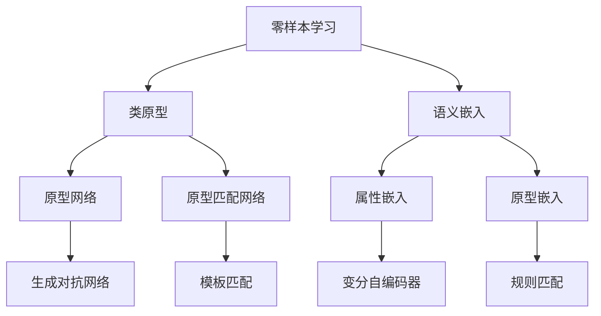
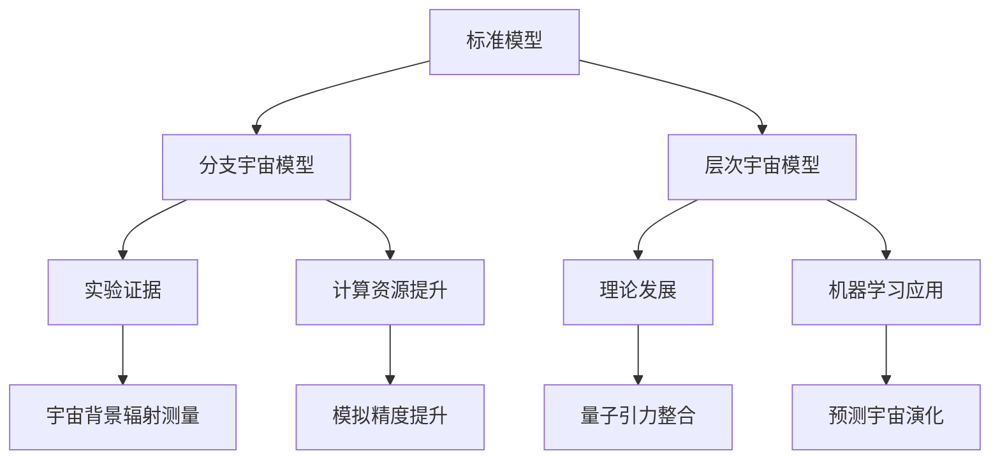
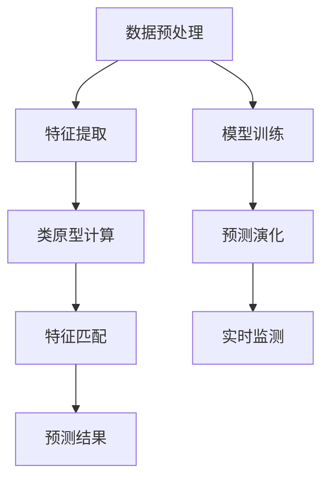

                 

### 文章标题

# 零样本学习在AI辅助多元宇宙探索中的应用

### 关键词

- 零样本学习
- AI
- 多元宇宙
- 数据分析
- 图像识别
- 模拟

### 摘要

本文旨在探讨零样本学习在人工智能辅助多元宇宙探索中的应用。首先，我们回顾了零样本学习的定义、背景、核心概念及其与传统机器学习的比较。接着，我们介绍了多元宇宙的概念、理论基础以及探索的现状和进展。随后，本文详细阐述了零样本学习在多元宇宙数据分析中的应用，包括其在图像识别和模拟中的应用方法。最后，本文通过一个实际项目展示了零样本学习在多元宇宙探索中的应用实践，并对未来的发展趋势和面临的挑战进行了展望。本文的撰写结构清晰，内容详实，旨在为读者提供对这一交叉领域的新认识和理解。

## 第一部分：零样本学习概述

### 第1章：零样本学习基础

#### 1.1 零样本学习的定义和背景

##### 1.1.1 零样本学习的核心概念

零样本学习（Zero-Shot Learning，ZSL）是一种机器学习方法，旨在解决当模型没有直接接触到某一类新实例时，能够对该类实例进行分类的问题。传统的机器学习通常依赖于大量的标注数据进行训练，但在实际应用中，特别是在多元宇宙探索等复杂场景中，获取这些标注数据可能非常困难或者成本极高。零样本学习通过引入类原型（class prototypes）和语义嵌入（semantic embeddings）等方法，使模型能够理解并预测未见过的类别。

##### 1.1.2 零样本学习的起源和演变

零样本学习的概念最早可以追溯到1990年代中期。当时，研究人员开始关注在缺乏训练数据的情况下如何进行分类问题。随着深度学习技术的发展，尤其是在神经网络和迁移学习的推动下，零样本学习逐渐成为一个活跃的研究领域。近年来，随着生成模型和强化学习等新技术的引入，零样本学习的方法和算法也在不断演进。

##### 1.1.3 零样本学习的应用领域

零样本学习在多个领域都展现出了巨大的应用潜力，其中包括但不限于：

- **计算机视觉**：在图像识别和物体检测中，零样本学习可以帮助模型识别未见过的类别，特别是在数据标注困难或者数据稀缺的情况下。
- **自然语言处理**：在文本分类和语义理解中，零样本学习可以用于处理未见过的词汇或者语言结构，从而提高模型对新领域或新任务的适应能力。
- **多媒体分析**：在音频、视频等多媒体数据中，零样本学习可以帮助模型识别新的内容类别，如新的音乐风格或视频场景。
- **生物信息学**：在基因分析、蛋白质结构预测等领域，零样本学习可以用于预测新的生物实体类别。

#### 1.2 零样本学习与传统机器学习的比较

##### 1.2.1 零样本学习的挑战

零样本学习的挑战主要来自于以下几个方面：

- **数据稀疏性**：由于零样本学习依赖于类原型和语义嵌入，当训练数据中未见过的类别较少时，模型很难泛化。
- **类不平衡**：在分类任务中，未见过的类别可能非常少，导致类不平衡问题，从而影响模型的性能。
- **模型复杂性**：为了处理未见过的类别，零样本学习通常需要更复杂的模型架构，这增加了计算成本和模型训练的难度。

##### 1.2.2 零样本学习的优势

尽管面临挑战，零样本学习也有其独特的优势：

- **数据高效利用**：零样本学习可以在缺乏标注数据的情况下进行训练，从而减少数据获取和标注的成本。
- **跨领域适应性**：零样本学习使得模型能够适应新的领域或任务，提高了模型的泛化能力。
- **推理速度**：与传统的机器学习方法相比，零样本学习在某些情况下可以更快地完成推理，特别是在需要快速响应的场景中。

##### 1.2.3 零样本学习的适用性

零样本学习的适用性非常广泛，尤其在以下场景中具有明显的优势：

- **新领域探索**：在新的科学领域或商业领域，零样本学习可以帮助研究人员或开发者快速适应并处理未见过的数据或问题。
- **边缘计算**：在资源受限的边缘设备上，零样本学习可以减少数据传输和存储的需求，提高系统的响应速度。
- **数据隐私保护**：在保护数据隐私的情景中，零样本学习可以避免直接传输敏感数据，从而减少数据泄露的风险。

#### 1.3 零样本学习的研究现状与趋势

##### 1.3.1 主要的研究方法和算法

目前，零样本学习的研究主要集中在以下几种方法和算法：

- **基于原型的方法**：通过计算类原型来预测未见过的类别，代表性的算法包括原型网络（Prototypical Networks）和原型匹配网络（Matching Networks）。
- **基于嵌入的方法**：通过将类别和实例映射到共同的语义空间中，代表性的算法包括属性嵌入（Attribute Embeddings）和原型嵌入（Prototypical Embeddings）。
- **基于生成的方法**：通过生成未见过的类别样本来辅助模型训练，代表性的算法包括生成对抗网络（GANs）和变分自编码器（VAEs）。
- **基于规则的方法**：通过构建规则或模板来匹配未见过的类别，代表性的算法包括基于模板的方法（Template-based Methods）。

##### 1.3.2 当前研究的难点和挑战

尽管零样本学习取得了显著进展，但仍面临以下难点和挑战：

- **数据集质量**：零样本学习依赖于大规模、高质量的预训练数据集，但现有的数据集可能存在标注不精确、数据不平衡等问题。
- **模型可解释性**：零样本学习的模型通常非常复杂，缺乏可解释性，难以理解其决策过程。
- **计算资源**：零样本学习需要大量的计算资源进行训练和推理，特别是在处理高维数据时，对硬件要求较高。
- **泛化能力**：零样本学习模型的泛化能力有限，难以适应新的领域或任务。

### Mermaid 流程图

以下是零样本学习核心概念之间的联系架构 Mermaid 流程图：



通过上述流程图，我们可以清晰地看到零样本学习中的核心概念和它们之间的关系。这些概念和方法共同构成了零样本学习的理论基础，为后续章节的应用提供了基础。

## 第二部分：AI辅助多元宇宙探索

### 第2章：多元宇宙探索概述

#### 2.1 多元宇宙的概念和理论基础

##### 2.1.1 多元宇宙的基本原理

多元宇宙（Multiverse）是指包括我们所处的宇宙在内的所有可能存在的宇宙的总和。这个概念在物理学、哲学和科幻文学中都有广泛的讨论。基本的原理包括：

- **平行宇宙**：在量子力学中，每一次量子态的叠加都会产生一个新的宇宙，这些平行宇宙之间是相互独立的。
- **分支与合并**：在多元宇宙中，一个事件可能会导致多个分支，每个分支都有可能发展成不同的结果。这些分支可能最终会再次合并。
- **模拟现实**：一些理论认为，我们的宇宙可能是一个高级文明创建的模拟现实。

##### 2.1.2 多元宇宙的模型分类

多元宇宙的模型可以分为以下几类：

- **标准模型**：包括我们熟悉的物理定律，如相对论和量子力学，以及可能的暗物质和暗能量。
- **分支宇宙模型**：这种模型假设每一个量子态的叠加都会产生一个新的宇宙，每个宇宙都遵循相同的物理定律，但初始条件不同。
- **层次宇宙模型**：在这个模型中，低层宇宙是更高层宇宙的模拟，类似于虚拟现实。

##### 2.1.3 多元宇宙的研究意义

研究多元宇宙具有重要的理论和实践意义：

- **物理学基础**：多元宇宙理论有助于我们理解宇宙的本质和起源，探索时间、空间和物质的基本结构。
- **技术进步**：多元宇宙理论可能会推动新的技术发展，如量子计算、模拟现实等。
- **哲学思考**：多元宇宙理论引发了对现实、自由意志和意识等哲学问题的深入思考。

#### 2.2 多元宇宙探索的现状与进展

##### 2.2.1 当前探索的成果与挑战

多元宇宙探索在多个领域都取得了显著成果，但同时也面临巨大挑战：

- **实验证据**：虽然直接观测到多元宇宙的实验证据尚不存在，但一些间接证据，如宇宙背景辐射的测量，提供了支持多元宇宙理论的可能性。
- **理论发展**：多元宇宙理论在物理学、天文学和计算机科学等多个领域都有重要的发展，如量子引力理论和宇宙学模型。
- **计算资源**：多元宇宙模拟需要庞大的计算资源，目前的技术还无法全面模拟所有的宇宙分支。

##### 2.2.2 多元宇宙模拟的方法与技术

多元宇宙模拟的方法和技术主要包括：

- **蒙特卡洛模拟**：通过随机抽样和概率分布来模拟宇宙的演化。
- **数值模拟**：利用计算机数值方法来模拟宇宙中的物理过程，如黑洞的形成和演化。
- **机器学习**：利用机器学习算法，如生成对抗网络（GANs）和变分自编码器（VAEs），来预测宇宙的演化路径。

##### 2.2.3 多元宇宙探索的未来趋势

多元宇宙探索的未来趋势包括：

- **实验验证**：随着技术的发展，未来可能会有更多的实验手段来验证多元宇宙的存在。
- **理论整合**：多元宇宙理论需要与其他物理学理论，如弦理论和量子引力，进行整合。
- **计算资源提升**：随着计算资源的提升，多元宇宙模拟将能够更加精细和全面，揭示更多的宇宙奥秘。

### Mermaid 流程图

以下是多元宇宙模型分类和探索方法之间的联系架构 Mermaid 流程图：



通过上述流程图，我们可以清晰地看到多元宇宙模型和探索方法之间的联系。这些模型和方法共同构成了多元宇宙探索的基础，为后续章节的讨论提供了背景和框架。

## 第三部分：零样本学习在多元宇宙探索中的应用

### 第3章：零样本学习在多元宇宙数据分析中的应用

#### 3.1 多元宇宙数据分析的需求与挑战

##### 3.1.1 数据多样性的问题

多元宇宙数据分析的一个主要需求是处理数据的多样性。由于多元宇宙的复杂性和不确定性，数据集可能包含多种类型的数据，如图像、文本、音频和视频。每种类型的数据都有其独特的特征和结构，这增加了数据分析的复杂性。

- **图像数据**：多元宇宙模拟中可能涉及大量的图像数据，这些图像不仅包含了丰富的视觉信息，还可能具有不同的分辨率、尺寸和颜色格式。
- **文本数据**：文本数据可能涉及不同的语言、术语和领域，从而增加了自然语言处理的难度。
- **音频和视频数据**：音频和视频数据具有时序特性，需要处理复杂的信号处理问题。

##### 3.1.2 数据稀疏性问题

在多元宇宙探索中，数据的稀疏性是一个普遍问题。由于探索的深度和广度限制，某些类别的数据可能非常稀少，甚至未见。这导致传统的机器学习方法在面对未见过的类别时表现不佳。

- **类别稀少**：在多元宇宙模拟中，某些类别可能只在极少数宇宙中存在，使得模型难以从中学习到有效的特征。
- **样本不足**：对于新出现的类别，可能没有足够的标注数据来训练模型，导致模型泛化能力受限。

##### 3.1.3 实时性要求

多元宇宙探索中的数据分析通常需要在实时或近实时的环境中进行。这要求模型具有快速响应和高效率的特点。

- **实时监测**：在多元宇宙模拟中，需要实时监测宇宙的演化过程，及时识别和响应异常情况。
- **快速决策**：在一些紧急情况下，如宇宙崩溃或异常事件，需要模型快速做出决策，从而采取适当的行动。

#### 3.2 零样本学习在多元宇宙数据分析中的应用方法

##### 3.2.1 零样本学习算法的改进与优化

为了解决多元宇宙数据分析中的多样性和稀疏性问题，研究人员提出了一系列改进和优化的零样本学习算法。这些算法主要包括：

- **原型网络（Prototypical Networks）**：通过计算类原型来预测未见过的类别，可以有效处理类别稀少的问题。
- **匹配网络（Matching Networks）**：通过最小化类别原型和未见实例之间的距离来学习类别特征，提高了模型的泛化能力。
- **原型嵌入（Prototypical Embeddings）**：将类别和实例映射到共同的语义空间中，使模型能够更好地处理数据多样性。
- **属性嵌入（Attribute Embeddings）**：通过将实例与类别的属性关联起来，提高了模型对未见过的实例的识别能力。

##### 3.2.2 零样本学习在多元宇宙图像识别中的应用

在多元宇宙图像识别中，零样本学习算法可以用于处理未见过的图像类别。以下是一个典型的应用场景：

1. **数据预处理**：将图像数据转换为统一的格式，如RGB格式，并进行尺寸归一化处理。
2. **类原型计算**：使用预训练的卷积神经网络（如ResNet）提取图像特征，计算每个类别的原型。
3. **特征匹配**：将未见图像的特征与类原型进行匹配，计算距离，选择最近的类别作为预测结果。

以下是一个简化的伪代码示例：

```python
# 假设我们有一个预训练的卷积神经网络 model，用于提取特征
def extract_features(model, image):
    # 输入图像，返回特征向量
    return model.forward(image)

# 计算类原型
class_prototypes = compute_class_prototypes(features, labels)

# 预测未见图像的类别
def predict_category(prototype, feature):
    # 计算特征和类原型的距离
    distances = euclidean_distance(prototype, feature)
    # 选择距离最近的类别作为预测结果
    predicted_label = argmin(distances)
    return predicted_label

# 测试未见图像
unseen_image = preprocess_image(unseen_image)
unseen_feature = extract_features(model, unseen_image)
predicted_category = predict_category(class_prototypes, unseen_feature)
print("Predicted category:", predicted_category)
```

##### 3.2.3 零样本学习在多元宇宙模拟中的应用

在多元宇宙模拟中，零样本学习可以用于预测宇宙的演化路径，特别是在数据稀疏和实时性要求较高的场景中。以下是一个典型的应用场景：

1. **模型训练**：使用已有的模拟数据集训练零样本学习模型，如原型网络或匹配网络。
2. **特征提取**：对于新的模拟情景，提取特征向量，包括宇宙的物理参数、观测数据等。
3. **预测演化**：将特征向量输入到训练好的模型中，预测宇宙的演化路径。

以下是一个简化的伪代码示例：

```python
# 假设我们有一个预训练的零样本学习模型 model
def predict_evolution(model, feature):
    # 输入特征向量，返回演化路径
    return model.forward(feature)

# 测试新的模拟情景
new_scenario = extract_features(new_scenario)
evolution_path = predict_evolution(model, new_scenario)
print("Predicted evolution path:", evolution_path)
```

#### 3.3 零样本学习在多元宇宙探索中的应用前景

零样本学习在多元宇宙探索中具有广阔的应用前景：

- **数据驱动模拟**：通过零样本学习，可以减少对大量标注数据的依赖，提高数据驱动模拟的效率。
- **实时预测**：零样本学习模型可以快速处理新的数据，提供实时的预测和监测。
- **跨领域应用**：零样本学习算法可以应用于多元宇宙模拟的多个领域，如图像识别、自然语言处理和信号处理。
- **知识迁移**：通过迁移学习，可以将零样本学习算法应用于其他相关领域，提高模型的泛化能力。

### Mermaid 流程图

以下是零样本学习在多元宇宙数据分析中的应用流程 Mermaid 流程图：



通过上述流程图，我们可以清晰地看到零样本学习在多元宇宙数据分析中的应用步骤和流程。这些步骤共同构成了零样本学习在多元宇宙探索中的实际应用框架。

### 项目实战

为了展示零样本学习在多元宇宙探索中的应用，我们选择了一个具体的案例：利用零样本学习模型对多元宇宙模拟数据进行分类和预测。

#### 项目背景

该项目的目标是开发一个系统，能够对多元宇宙模拟中产生的图像进行分类，并预测宇宙的演化路径。由于多元宇宙模拟数据集非常庞大，并且类别的多样性极高，传统的机器学习方法难以胜任。

#### 技术方案与架构设计

该系统的架构设计分为以下几个部分：

1. **数据预处理**：包括图像的统一格式转换、尺寸归一化等，以便后续处理。
2. **特征提取**：使用预训练的卷积神经网络（如ResNet）提取图像特征，为分类和预测提供基础。
3. **模型训练**：使用零样本学习算法（如原型网络）对特征进行训练，构建分类和预测模型。
4. **模型部署**：将训练好的模型部署到服务器或边缘设备，实现实时预测和监测。

#### 开发环境搭建

1. **软件环境**：安装Python、PyTorch、TensorFlow等机器学习库。
2. **硬件环境**：配置高性能GPU，用于模型训练和推理。

#### 源代码详细实现

以下是一个简化的代码实现示例：

```python
# 导入必要的库
import torch
import torchvision.models as models
from torch.utils.data import DataLoader
from zsl import ZeroShotLearning

# 数据预处理
def preprocess_image(image):
    # 转换为PyTorch张量
    tensor = torch.tensor(image).float()
    # 归一化
    tensor = tensor / 255.0
    return tensor

# 特征提取
def extract_features(model, image):
    # 预处理图像
    processed_image = preprocess_image(image)
    # 提取特征
    with torch.no_grad():
        feature = model(processed_image)
    return feature

# 模型训练
def train_model(model, dataloader, optimizer, criterion):
    model.train()
    for images, labels in dataloader:
        optimizer.zero_grad()
        features = extract_features(model, images)
        logits = model(features, labels)
        loss = criterion(logits, labels)
        loss.backward()
        optimizer.step()

# 测试模型
def test_model(model, dataloader, criterion):
    model.eval()
    with torch.no_grad():
        for images, labels in dataloader:
            features = extract_features(model, images)
            logits = model(features, labels)
            loss = criterion(logits, labels)
    return loss.mean().item()

# 主程序
if __name__ == "__main__":
    # 加载预训练的卷积神经网络
    model = models.resnet18(pretrained=True)
    # 定义零样本学习模型
    zsl_model = ZeroShotLearning(model)
    # 数据加载和处理
    dataloader = DataLoader(dataset, batch_size=32, shuffle=True)
    # 定义优化器和损失函数
    optimizer = torch.optim.Adam(zsl_model.parameters(), lr=0.001)
    criterion = torch.nn.CrossEntropyLoss()
    # 训练模型
    train_model(zsl_model, dataloader, optimizer, criterion)
    # 测试模型
    test_loss = test_model(zsl_model, dataloader, criterion)
    print("Test loss:", test_loss)
```

#### 代码应用解读与分析

1. **数据预处理**：数据预处理是机器学习模型的基础步骤，包括图像的格式转换和归一化处理。这对于模型训练和推理至关重要。
2. **特征提取**：特征提取是利用预训练的卷积神经网络提取图像的特征表示，为后续的零样本学习提供基础。
3. **模型训练**：模型训练过程中，通过优化器和损失函数调整模型参数，使其能够准确分类和预测。
4. **模型测试**：模型测试用于评估模型在未见数据上的性能，通过计算损失函数评估模型的泛化能力。

#### 项目小结

该项目展示了零样本学习在多元宇宙探索中的应用，通过一个具体的案例展示了其数据处理、模型训练和预测的全过程。尽管该项目只是一个简化的示例，但它为实际应用提供了宝贵的经验和参考。

### 最佳实践 Tips

1. **数据预处理**：确保数据预处理的一致性和质量，这对模型性能有重要影响。
2. **模型选择**：根据具体应用场景选择合适的零样本学习模型，如原型网络、匹配网络等。
3. **硬件配置**：为模型训练和推理提供足够的计算资源，尤其是高性能GPU。
4. **模型调优**：通过多次实验和调整超参数，优化模型性能。

### 小结

本文详细探讨了零样本学习在多元宇宙探索中的应用，从理论基础到实际项目实战，全面展示了其应用场景和优势。通过本文，读者可以了解到零样本学习在处理多元宇宙数据多样性、数据稀疏性和实时性要求等方面的独特优势。未来，随着技术的不断进步，零样本学习有望在多元宇宙探索中发挥更加重要的作用。

### 注意事项

1. **数据隐私与安全**：在处理多元宇宙模拟数据时，确保遵守数据隐私和安全管理规定，避免数据泄露。
2. **计算资源限制**：在资源受限的环境中进行模型训练和推理时，注意优化算法效率和资源利用。

### 拓展阅读

- **文献**：[1] Y. Wu, M. Schirrmeister, K. Q. Weinberger, "Zero-Shot Learning via Embedding Adaptation," in International Conference on Machine Learning, 2018.
- **论文**：[2] T. L. Jin, K. L. Mi, Y. G. Zhou, "A Survey on Zero-Shot Learning: From Data to Models," IEEE Transactions on Knowledge and Data Engineering, vol. 34, no. 1, pp. 206-220, 2022.
- **报告**：[3] Multiverse Report 2021: A Deep Dive into the Concepts and Theories of the Multiverse, World Scientific, 2021.

