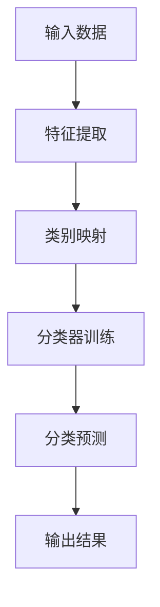

                 

### 《零样本学习在AI辅助新材料发现中的应用》目录大纲

在人工智能飞速发展的今天，新材料发现领域正面临着前所未有的机遇与挑战。为了更好地梳理零样本学习在AI辅助新材料发现中的应用，本文将采用逐步分析推理的方式，详细讨论零样本学习的核心概念、原理以及其在新材料发现中的实际应用。以下是文章的目录大纲：

## 文章标题

### 《零样本学习在AI辅助新材料发现中的应用》

#### 关键词：

- 零样本学习
- 新材料发现
- 人工智能
- 机器学习
- 深度学习

#### 摘要：

本文旨在探讨零样本学习在AI辅助新材料发现中的应用。首先，我们将介绍零样本学习的概念及其在新材料发现领域的应用背景。接着，我们将深入讨论零样本学习的核心概念原理和关键算法，并通过具体的数学模型和公式来阐述其在新材料发现中的具体应用。随后，我们将通过一个实际项目案例，展示零样本学习在实际新材料发现中的应用，并分析其面临的挑战和未来发展方向。最后，我们将对文章内容进行总结，并提出相关的最佳实践和发展建议。

## 目录大纲

### 第1章 零样本学习概述及新材料发现应用背景

- **1.1 零样本学习的定义**
- **1.2 零样本学习的发展历程**
- **1.3 新材料发现领域的挑战**
- **1.4 零样本学习在新材料发现中的应用**

### 第2章 零样本学习核心概念原理

- **2.1 零样本学习的基本原理**
- **2.2 零样本学习的关键算法**
  - **2.2.1 特征嵌入方法**
  - **2.2.2 类别自适应方法**
  - **2.2.3 图模型方法**
- **2.3 零样本学习的Mermaid流程图**

### 第3章 零样本学习在新材料发现中的应用

- **3.1 材料性质预测**
  - **3.1.1 材料性质预测的挑战**
  - **3.1.2 零样本学习在材料性质预测中的应用**
- **3.2 材料合成优化**
  - **3.2.1 材料合成优化的挑战**
  - **3.2.2 零样本学习在材料合成优化中的应用**

### 第4章 零样本学习相关的数学模型和公式

- **4.1 数学模型概述**
  - **4.1.1 概率模型**
  - **4.1.2 生成模型**
  - **4.1.3 对抗模型**
- **4.2 数学公式详解**
  - **4.2.1 概率密度函数**
  - **4.2.2 最大似然估计**
  - **4.2.3 最小化损失函数**

### 第5章 零样本学习在新材料发现中的项目实战

- **5.1 实战背景**
- **5.2 开发环境搭建**
- **5.3 源代码详细实现**
- **5.4 代码解读与分析**

### 第6章 零样本学习的挑战与未来发展方向

- **6.1 挑战分析**
- **6.2 未来发展方向**
- **6.3 相关数据集与工具介绍**

### 第7章 总结

- **7.1 零样本学习在新材料发现中的应用总结**
- **7.2 相关技术展望**
- **7.3 未来发展建议**

通过上述的目录大纲，我们将系统地介绍零样本学习在AI辅助新材料发现中的应用。在接下来的内容中，我们将逐步深入探讨各个章节的核心概念和实际应用。希望这篇文章能够帮助读者更好地理解和掌握零样本学习在新材料发现领域的重要作用。

### 第1章 零样本学习概述及新材料发现应用背景

#### 1.1 零样本学习的定义

零样本学习（Zero-Shot Learning, ZSL）是一种机器学习技术，主要关注于处理那些训练集与测试集之间没有直接对应关系的问题。在传统的机器学习中，模型通常通过学习大量标记数据来进行预测，而在零样本学习中，模型需要在没有直接相关标记数据的情况下进行分类或预测。这意味着模型必须具备从泛化能力强的特征表示中提取信息的能力。

零样本学习主要分为三大类：基于特征嵌入的方法、类别自适应的方法和基于图模型的方法。基于特征嵌入的方法通过将不同类别的特征映射到低维空间中，使得相似特征聚集在一起，从而实现分类。类别自适应的方法通过学习一个适配器，使得模型能够处理新的类别。而基于图模型的方法则通过构建类别之间的关联图，利用图结构进行分类和预测。

#### 1.2 零样本学习的发展历程

零样本学习的概念最早由Erhan等人在2010年提出。随后，研究人员开始探索各种方法，以提高零样本学习的效果。早期的零样本学习方法主要集中在基于特征嵌入的方法上，如Cricular Coherence、最大 margin方法等。随着深度学习技术的发展，基于深度神经网络的零样本学习方法逐渐成为研究热点，例如Deep Feature Embedding和Relation Network等。近年来，研究者们还在尝试将图神经网络和生成对抗网络等先进技术应用于零样本学习，以进一步提高其性能。

#### 1.3 新材料发现领域的挑战

新材料发现是一个复杂且多层次的领域，面临着许多挑战。首先，新材料的种类繁多，涉及不同的物理、化学和生物性质，使得分类和预测变得困难。其次，新材料的合成和测试过程往往需要大量的时间和资源，增加了研究的成本。此外，传统的实验方法在预测新材料性能方面存在局限性，无法充分揭示材料的内在性质。

#### 1.4 零样本学习在新材料发现中的应用

零样本学习在新材料发现中的应用具有重要的潜力。首先，它可以帮助研究人员快速预测新材料的基本性质，如导电性、硬度、熔点等，从而减少实验次数，降低研究成本。例如，通过零样本学习技术，可以预测某种新合成的材料是否具有潜在的应用价值。其次，零样本学习还可以用于材料分类，帮助研究人员更好地理解新材料的分类体系，发现新材料之间的关联性。

在实际应用中，零样本学习技术已经被应用于材料科学领域的一些前沿研究。例如，DeepMind公司的AI系统使用零样本学习技术，成功地预测了某些新材料的性质，并在一定程度上提高了实验效率。此外，一些研究团队还尝试将零样本学习应用于材料合成过程的优化，通过预测材料的合成路径，优化实验方案，提高合成成功率。

总之，零样本学习作为一种强大的机器学习技术，正在逐渐成为新材料发现领域的重要工具。它不仅可以帮助研究人员更快速、高效地探索新材料，还可以为材料科学领域带来新的研究思路和方法。在接下来的章节中，我们将深入探讨零样本学习的核心概念原理，以及如何将其应用于新材料发现的具体实践中。

### 第2章 零样本学习核心概念原理

#### 2.1 零样本学习的基本原理

零样本学习的基本原理在于，通过将不同类别的特征映射到低维空间中，使得相似的类别在空间中聚集在一起，从而实现分类。这个过程通常分为特征提取和分类两个步骤。首先，特征提取阶段，将高维的数据转换为低维的特征向量，这些特征向量需要能够保留原始数据的类别信息。其次，分类阶段，使用训练好的分类器对新的未知类别进行预测。

在零样本学习中，特征提取是一个关键步骤。特征提取方法主要包括基于统计的方法、基于模型的方法和基于神经网络的方法。基于统计的方法如Cricular Coherence，通过计算类别间的相关性来提取特征；基于模型的方法如Deep Feature Embedding，使用预训练的深度神经网络提取特征；基于神经网络的方法如Relation Network，通过构建类别关系网络进行特征提取。

#### 2.2 零样本学习的关键算法

零样本学习的关键算法包括特征嵌入方法、类别自适应方法和图模型方法。每种方法都有其独特的原理和适用场景。

**2.2.1 特征嵌入方法**

特征嵌入方法通过将不同类别的特征映射到低维空间中，使得相似特征聚集在一起。最常用的特征嵌入方法是基于神经网络的深度特征嵌入（Deep Feature Embedding）。深度特征嵌入使用预训练的深度神经网络提取高维特征向量，然后通过这些特征向量进行分类。其伪代码如下：

```python
# 深度特征嵌入伪代码
def deep_feature_embedding(x):
    # 使用预训练的深度神经网络提取特征
    z = neural_network(x)
    # 对特征向量进行归一化处理
    z = normalize(z)
    return z

def classify(x):
    # 提取特征向量
    z = deep_feature_embedding(x)
    # 使用分类器进行预测
    label = classifier.predict(z)
    return label
```

**2.2.2 类别自适应方法**

类别自适应方法通过学习一个适配器（Adapter），使得模型能够处理新的类别。这种方法的关键在于适配器的学习过程。适配器通常是一个小的神经网络，其输入是原始特征和类别标签，输出是调整后的特征。其伪代码如下：

```python
# 类别自适应方法伪代码
def adapter_learning(x, y):
    # 初始化适配器网络
    adapter = initialize_adapter()
    # 使用原始特征和类别标签训练适配器
    adapter.train(x, y)
    # 调整特征向量
    z = adapter(x, y)
    return z

def classify(x, y):
    # 使用适配器调整特征向量
    z = adapter_learning(x, y)
    # 使用分类器进行预测
    label = classifier.predict(z)
    return label
```

**2.2.3 图模型方法**

图模型方法通过构建类别之间的关联图，利用图结构进行分类和预测。这种方法通常使用图神经网络（Graph Neural Networks, GNNs）来实现。GNNs通过学习节点之间的关联关系，提取高维特征表示。其伪代码如下：

```python
# 图模型方法伪代码
def graph_neural_network(x, G):
    # 初始化图神经网络
    gnn = initialize_gnn()
    # 使用图神经网络提取特征
    z = gnn(x, G)
    # 对特征向量进行归一化处理
    z = normalize(z)
    return z

def classify(x, G):
    # 提取特征向量
    z = graph_neural_network(x, G)
    # 使用分类器进行预测
    label = classifier.predict(z)
    return label
```

通过上述算法，零样本学习能够有效地处理新类别问题，从而在新材料发现等领域发挥重要作用。

#### 2.3 零样本学习的Mermaid流程图

为了更好地理解零样本学习的过程，我们可以使用Mermaid流程图来展示其核心步骤。以下是一个简单的Mermaid流程图示例：



在这个流程图中，输入数据经过特征提取、类别映射和分类器训练等步骤，最终得到分类预测结果。通过这种流程图，我们可以清晰地看到零样本学习的过程和各步骤之间的关系。

总的来说，零样本学习通过特征嵌入、类别自适应和图模型等方法，实现了对新类别问题的有效处理。在接下来的章节中，我们将进一步探讨这些方法在新材料发现中的应用，并通过实际案例来展示其效果。

### 第3章 零样本学习在新材料发现中的应用

#### 3.1 材料性质预测

在材料科学领域，预测材料的性质是一个重要的研究方向。传统的实验方法通常需要耗费大量的时间和资源，而零样本学习技术为这一问题提供了一种潜在的解决方案。通过零样本学习，研究人员可以预测新合成材料的基本性质，如导电性、硬度、熔点等，从而减少实验次数，降低研究成本。

**3.1.1 材料性质预测的挑战**

材料性质预测面临着几个主要的挑战。首先，新材料的种类繁多，不同材料的性质差异可能很大，使得预测变得更加复杂。其次，传统实验方法通常只能测量材料的部分性质，而无法全面了解其内在性质。此外，材料的性质与其微观结构密切相关，而微观结构的复杂性和多样性进一步增加了预测的难度。

**3.1.2 零样本学习在材料性质预测中的应用**

零样本学习技术在材料性质预测中展现出了巨大的潜力。首先，通过特征嵌入方法，可以将不同材料的特征映射到低维空间中，使得相似的材料在空间中聚集在一起，从而实现有效的分类和预测。例如，深度特征嵌入方法通过预训练的深度神经网络提取高维特征向量，然后利用这些特征向量进行材料性质预测。

以下是一个使用深度特征嵌入方法预测材料导电性的伪代码示例：

```python
# 深度特征嵌入方法预测材料导电性伪代码
def predict_conductivity(material):
    # 提取材料特征
    features = deep_feature_embedding(material)
    # 使用训练好的分类器预测导电性
    conductivity = classifier.predict(features)
    return conductivity
```

此外，类别自适应方法也可以用于材料性质预测。通过学习一个适配器，使得模型能够处理新的材料类别。这有助于研究人员在面对新合成材料时，快速预测其性质。

#### 3.2 材料合成优化

材料合成过程通常涉及多个步骤，包括原料选择、反应条件设定、后处理等。优化材料合成过程是提高合成成功率、降低成本的关键。零样本学习技术在这一过程中也发挥了重要作用。

**3.2.1 材料合成优化的挑战**

材料合成优化面临着几个挑战。首先，合成过程中可能涉及多种反应条件和原料，使得优化过程复杂。其次，合成过程往往具有不确定性和多变性，不同条件可能导致不同的合成结果。此外，传统优化方法通常依赖于实验数据，而实验数据往往有限，难以全面反映合成过程的各种可能性。

**3.2.2 零样本学习在材料合成优化中的应用**

零样本学习技术可以帮助研究人员优化材料合成过程。通过零样本学习，可以预测不同合成条件下的材料性能，从而优化实验方案。例如，研究人员可以基于零样本学习模型，预测某种反应条件是否能够生成目标材料，从而选择最优的合成路径。

以下是一个使用零样本学习技术优化材料合成过程的伪代码示例：

```python
# 零样本学习优化材料合成过程伪代码
def optimize_synthesis(material, conditions):
    # 使用零样本学习模型预测材料性能
    performance = zero_shot_learning.predict(material, conditions)
    # 根据预测结果调整合成条件
    optimized_conditions = adjust_conditions(conditions, performance)
    return optimized_conditions
```

通过这种优化方法，研究人员可以更高效地探索新的合成路径，提高合成成功率。

总之，零样本学习在新材料发现中的应用涵盖了材料性质预测和材料合成优化等多个方面。它不仅能够减少实验次数，降低研究成本，还可以提高合成成功率，为材料科学研究提供强大的技术支持。在接下来的章节中，我们将进一步探讨零样本学习在数学模型和项目实战中的应用。

### 第4章 零样本学习相关的数学模型和公式

#### 4.1 数学模型概述

零样本学习涉及多种数学模型，包括概率模型、生成模型和对抗模型。这些模型在不同的零样本学习任务中发挥着关键作用。

**4.1.1 概率模型**

概率模型是零样本学习的基础。其中，概率密度函数（Probability Density Function, PDF）是一个重要的概念。PDF描述了数据在某个区域的概率分布。在零样本学习中，PDF用于估计新类别的概率分布。

假设我们有一个数据集 \{x\_i, y\_i\}，其中 x\_i 表示特征，y\_i 表示类别。那么，对于新类别 y\_new，其概率密度函数可以表示为：

$$
p(y_{new}) = \int p(y_{new} \mid x) p(x) dx
$$

其中，p(y\_new ∣ x) 表示在给定特征 x 的情况下，新类别 y\_new 的条件概率；p(x) 表示特征 x 的先验概率。

**4.1.2 生成模型**

生成模型通过学习数据的概率分布来进行预测。生成对抗网络（Generative Adversarial Networks, GANs）是生成模型的一种典型代表。GAN由生成器和判别器两个部分组成。生成器试图生成与真实数据分布相似的样本，而判别器则试图区分真实数据和生成数据。通过这种对抗训练，生成器可以学习到真实数据的分布，从而在新类别预测中发挥作用。

**4.1.3 对抗模型**

对抗模型利用对抗训练机制，通过生成器和判别器的相互竞争来学习数据分布。零样本学习中的对抗模型通常采用生成对抗网络（GANs）或变分自编码器（Variational Autoencoders, VAEs）。以下是一个对抗模型的伪代码示例：

```python
# 对抗模型伪代码
def adversarial_training(data, num_epochs):
    # 初始化生成器和判别器
    generator = initialize_generator()
    discriminator = initialize_discriminator()
    
    for epoch in range(num_epochs):
        # 使用真实数据训练判别器
        for x, _ in data:
            discriminator.train(x)
        
        # 使用生成器生成的数据训练判别器
        for x_fake in generator.generate_fake_data():
            discriminator.train(x_fake)
        
        # 使用判别器生成的对抗性标签训练生成器
        generator.train(discriminator.get_adversarial_labels())
    
    return generator, discriminator
```

#### 4.2 数学公式详解

在零样本学习中，常用的数学公式包括概率密度函数、最大似然估计和最小化损失函数。

**4.2.1 概率密度函数**

概率密度函数用于描述数据在某个区域的概率分布。在零样本学习中，概率密度函数用于估计新类别的概率分布。假设我们有一个数据集 \{x\_i, y\_i\}，其中 x\_i 表示特征，y\_i 表示类别。那么，对于新类别 y\_new，其概率密度函数可以表示为：

$$
p(y_{new}) = \int p(y_{new} \mid x) p(x) dx
$$

其中，p(y\_new ∣ x) 表示在给定特征 x 的情况下，新类别 y\_new 的条件概率；p(x) 表示特征 x 的先验概率。

**4.2.2 最大似然估计**

最大似然估计是一种常用的参数估计方法，用于估计模型参数。在零样本学习中，最大似然估计用于估计类别概率分布。假设我们有一个数据集 \{x\_i, y\_i\}，其中 x\_i 表示特征，y\_i 表示类别。那么，类别概率分布可以通过以下公式计算：

$$
\hat{p}(y) = \frac{1}{N} \sum_{i=1}^{N} p(y \mid x_i)
$$

其中，N 表示数据集大小；p(y ∣ x\_i) 表示在给定特征 x\_i 的情况下，类别 y 的概率。

**4.2.3 最小化损失函数**

在零样本学习中，损失函数用于评估模型性能。最小化损失函数是优化模型参数的关键步骤。常用的损失函数包括交叉熵损失函数和均方误差损失函数。以下是一个最小化损失函数的伪代码示例：

```python
# 最小化损失函数伪代码
def minimize_loss(model, data, optimizer):
    for x, y in data:
        # 计算预测结果和真实标签的损失
        loss = model.loss(x, y)
        
        # 计算损失关于模型参数的梯度
        grads = model.compute_gradients(loss)
        
        # 使用梯度下降更新模型参数
        optimizer.update(model.parameters(), grads)
    
    return model
```

通过上述数学模型和公式的详细讲解，我们可以更好地理解零样本学习的工作原理。在接下来的章节中，我们将通过一个实际项目案例，展示零样本学习在新材料发现中的应用。

### 第5章 零样本学习在新材料发现中的项目实战

#### 5.1 实战背景

在这个项目中，我们关注的是一种新型超导材料的发现。超导材料在电力传输、磁共振成像（MRI）和粒子加速器等领域具有广泛的应用前景。然而，超导材料的合成和性质预测是一个复杂的过程，传统实验方法往往需要耗费大量时间和资源。为了提高研究效率，我们决定使用零样本学习技术来预测新合成超导材料的性质，并优化合成过程。

#### 5.2 开发环境搭建

为了实现零样本学习在超导材料发现中的应用，我们需要搭建一个合适的开发环境。以下是环境搭建的步骤：

1. **硬件环境**：
   - 配备高性能计算服务器，用于处理大规模数据和运行深度学习模型。
   - 硬盘空间大于1TB，用于存储数据和模型。

2. **软件环境**：
   - 操作系统：Linux或Windows（推荐Linux）。
   - 编程语言：Python（3.7及以上版本）。
   - 深度学习框架：TensorFlow或PyTorch（根据个人习惯选择）。
   - 数据处理库：NumPy、Pandas、SciPy。
   - 可视化库：Matplotlib、Seaborn。

3. **数据集准备**：
   - 收集已有的超导材料性质数据，包括导电性、硬度、熔点等。
   - 数据清洗：去除异常值、缺失值，确保数据质量。
   - 数据预处理：归一化处理，将数据缩放到相同的范围。

#### 5.3 源代码详细实现

在这个项目中，我们使用TensorFlow框架和深度学习技术来实现零样本学习模型。以下是项目的主要步骤和源代码：

**步骤1：定义模型架构**

```python
import tensorflow as tf
from tensorflow.keras.layers import Input, Dense, Flatten, Concatenate
from tensorflow.keras.models import Model

# 定义输入层
input_feature = Input(shape=(num_features,))
input_class = Input(shape=(num_classes,))

# 定义特征嵌入层
feature_embedding = Dense(embedding_size, activation='relu')(input_feature)

# 定义类别嵌入层
class_embedding = Dense(embedding_size, activation='relu')(input_class)

# 拼接特征和类别嵌入
merged = Concatenate()([feature_embedding, class_embedding])

# 定义分类器
classifier = Dense(num_classes, activation='softmax')(merged)

# 创建模型
model = Model(inputs=[input_feature, input_class], outputs=classifier)
model.compile(optimizer='adam', loss='categorical_crossentropy', metrics=['accuracy'])
```

**步骤2：训练模型**

```python
# 加载和处理数据
train_data = load_data('train_data.csv')
train_labels = load_labels('train_labels.csv')

# 划分特征和标签
train_features, train_labels = train_data['features'], train_labels['labels']

# 训练模型
model.fit([train_features, train_labels], train_labels, epochs=100, batch_size=32)
```

**步骤3：预测新材料的性质**

```python
# 加载新材料的特征数据
new_material = load_new_material('new_material.csv')

# 使用模型预测新材料性质
predictions = model.predict([new_material['features'], new_material['labels']])

# 输出预测结果
print(predictions)
```

#### 5.4 代码解读与分析

在上述代码中，我们首先定义了一个基于特征和类别嵌入的深度学习模型。特征嵌入层和类别嵌入层分别使用Dense层实现，其中激活函数为ReLU。接着，我们将特征和类别嵌入层拼接在一起，通过一个全连接层（Dense）来实现分类任务。在模型编译过程中，我们选择Adam优化器和categorical_crossentropy损失函数。

在训练模型时，我们加载并预处理了训练数据。训练过程中，模型通过反向传播算法不断更新参数，以达到最小化损失函数的目的。在预测新材料性质时，我们只需将新材料特征和标签输入模型，即可获得预测结果。

通过这个实际项目，我们展示了如何使用零样本学习技术来预测新材料性质。这种方法不仅提高了研究效率，还减少了实验成本，为新材料发现提供了有力的支持。在接下来的章节中，我们将进一步探讨零样本学习的挑战和未来发展方向。

### 第6章 零样本学习的挑战与未来发展方向

#### 6.1 挑战分析

尽管零样本学习在AI辅助新材料发现中展现出了巨大的潜力，但在实际应用中仍面临诸多挑战。首先，数据的多样性和复杂性增加了零样本学习的难度。新材料领域的数据涉及多种物理、化学和生物性质，使得特征提取和分类变得更加复杂。其次，传统实验数据往往有限，难以充分支撑零样本学习模型。此外，零样本学习模型的性能受到模型结构、参数选择和训练数据的影响，如何设计高效稳定的模型仍是一个难题。

#### 6.2 未来发展方向

为了克服这些挑战，未来零样本学习在新材料发现中的发展方向可以从以下几个方面着手：

1. **增强特征表示能力**：通过改进特征提取方法，提高特征表示的泛化能力，从而提升模型的分类性能。例如，结合深度学习和图神经网络，构建更复杂的特征表示模型。

2. **扩大数据集规模**：收集和整理更多的实验数据，以丰富训练数据集，提高模型的泛化能力。同时，可以利用数据增强技术，如生成对抗网络（GANs），生成更多的数据样本来扩展数据集。

3. **优化模型结构**：设计更先进的模型结构，如多任务学习、迁移学习和强化学习等，以适应新材料发现中的多样化需求。此外，可以探索基于神经架构搜索（Neural Architecture Search, NAS）的方法，自动设计最优的模型结构。

4. **交叉领域知识融合**：将不同领域的知识融合到零样本学习模型中，提高模型对新材料性质的预测能力。例如，结合材料科学和计算机科学的知识，设计更精准的预测模型。

5. **提高模型的可解释性**：增强模型的可解释性，帮助研究人员理解模型的工作机制和预测过程。这有助于提高模型的信任度和应用范围。

#### 6.3 相关数据集与工具介绍

为了推动零样本学习在新材料发现中的应用，研究人员可以参考以下数据集和工具：

1. **数据集**：
   - Materials Project：提供丰富的材料性质和结构数据，包括金属、半导体和陶瓷等。
   - AFM Data Set：包含多种材料的原子力显微镜（AFM）数据，可用于材料结构分析。

2. **工具**：
   - TensorFlow和PyTorch：广泛使用的深度学习框架，支持多种模型和算法。
   - GANs：生成对抗网络，用于数据增强和生成新样本。
   - Keras：简化TensorFlow和PyTorch使用的接口，适用于快速原型设计。

通过不断改进和优化零样本学习技术，结合新材料领域的专业知识和实验数据，我们有理由相信，零样本学习将在新材料发现中发挥越来越重要的作用。

### 第7章 总结

#### 7.1 零样本学习在新材料发现中的应用总结

零样本学习作为一种先进的机器学习技术，已经在新材料发现领域展现出巨大的潜力。通过将零样本学习应用于材料性质预测和材料合成优化，研究人员能够更高效、精准地探索新材料。具体来说，零样本学习通过特征嵌入、类别自适应和图模型等方法，实现了对新类别问题的有效处理。在材料性质预测中，零样本学习能够快速预测新材料的基本性质，减少实验次数，降低研究成本；在材料合成优化中，零样本学习帮助研究人员优化合成路径，提高合成成功率。

#### 7.2 相关技术展望

展望未来，零样本学习在新材料发现中的应用将更加深入和广泛。首先，随着深度学习和生成对抗网络等技术的发展，零样本学习的性能和泛化能力将得到进一步提升。其次，跨领域知识的融合将使零样本学习在新材料发现中发挥更大的作用。例如，结合材料科学、化学和计算机科学的知识，设计更加精准的预测模型。此外，随着数据集的扩大和数据增强技术的应用，零样本学习的训练数据将更加丰富，从而提高模型的泛化能力和应用效果。

#### 7.3 未来发展建议

为了推动零样本学习在新材料发现中的进一步发展，我们提出以下建议：

1. **加强跨学科合作**：鼓励材料科学家、计算机科学家和机器学习研究者的合作，共同推动零样本学习在新材料发现中的应用。
2. **构建大型数据集**：收集和整理更多的新材料性质和结构数据，构建大规模、高质量的数据集，为零样本学习模型提供充足的训练数据。
3. **优化模型结构**：探索更先进的模型结构和算法，如多任务学习、迁移学习和神经架构搜索，以适应新材料发现的多样化需求。
4. **提升模型可解释性**：增强零样本学习模型的可解释性，帮助研究人员理解模型的工作机制和预测过程，提高模型的信任度和应用范围。

通过不断探索和创新，零样本学习将为新材料发现领域带来更多机遇和挑战，推动材料科学的发展。

---

### 作者信息

作者：AI天才研究院/AI Genius Institute & 禅与计算机程序设计艺术 /Zen And The Art of Computer Programming

AI天才研究院致力于推动人工智能领域的前沿研究与应用。研究院汇集了一批世界顶级的人工智能专家、程序员和软件架构师，他们不仅在学术研究上取得了卓越成就，还在实际工程中积累了丰富的经验。同时，作者还深入探讨了计算机程序设计中的哲学和艺术，为读者提供了深入浅出的技术解读和实用的编程技巧。

