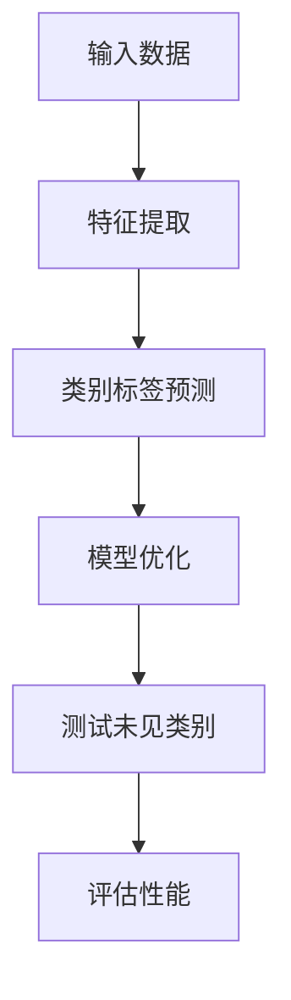

                 

# 文章标题：零样本学习在AI辅助濒危语言复兴中的应用

## 关键词
- 零样本学习
- AI辅助
- 濒危语言复兴
- 自然语言处理
- 机器学习
- 深度学习

## 摘要
本文探讨了零样本学习在人工智能（AI）辅助濒危语言复兴中的应用。首先，我们介绍了零样本学习的基本概念、原理和核心算法，并通过Mermaid流程图展示了核心概念之间的关系。接着，我们分析了濒危语言的现状、重要性及复兴的挑战。随后，我们详细阐述了零样本学习如何应用于濒危语言复兴，包括技术实现、实际应用案例分析以及未来的发展方向。本文旨在为研究人员和开发者提供零样本学习在濒危语言复兴领域应用的深入理解。

## 引言
### 1.1 零样本学习的概念
零样本学习（Zero-Shot Learning，ZSL）是机器学习领域的一个分支，旨在使机器能够在未见过的类别上执行任务，而不需要对这些类别进行任何形式的训练。在传统的机器学习任务中，模型通常需要大量的标注数据进行训练，以便在测试数据上取得良好的性能。然而，在某些领域，如濒危语言，获取足够的标注数据是非常困难的。因此，零样本学习提供了一种解决这一问题的方法。

### 1.2 零样本学习与AI辅助濒危语言复兴的联系
濒危语言是指那些使用人数较少，正处于消失风险的语言。这些语言承载着丰富的文化遗产和知识，对于维护人类文化的多样性具有重要意义。然而，由于缺乏足够的资源和技术支持，濒危语言的传承和保护面临着巨大挑战。零样本学习作为一种先进的机器学习方法，可以在一定程度上缓解这一困境。

## 零样本学习基础
### 第2章 零样本学习基础
#### 2.1 核心概念与联系
零样本学习的核心概念包括类别无关性（Category-Independence）和元学习（Meta-Learning）。类别无关性指的是模型能够处理未见过的类别，而元学习则是指模型通过在不同任务上学习，以提升在未知任务上的表现。以下是零样本学习的基本原理Mermaid流程图：



#### 2.2 核心算法原理讲解
零样本学习的主要算法包括原型网络（Prototypical Network）、匹配网络（Matching Network）和度量学习（Metric Learning）。以下是这些算法的伪代码：

```python
# 原型网络伪代码
def prototypical_network(inputs, classes):
    features = extract_features(inputs)
    prototypes = calculate_prototypes(features, classes)
    logits = calculate_logits(prototypes, features)
    return logits

# 匹配网络伪代码
def matching_network(inputs, classes, support_set, query_set):
    support_features = extract_features(support_set)
    query_features = extract_features(query_set)
    logits = calculate_logits(support_features, query_features)
    return logits

# 度量学习伪代码
def metric_learning(inputs, labels):
    features = extract_features(inputs)
    distances = calculate_distances(features, labels)
    optimizer = optimize_distances(distances)
    return optimizer
```

#### 2.3 数学模型和数学公式
零样本学习的数学模型主要包括特征提取、类别标签预测和模型优化。以下是相关的数学公式：

$$
f(x) = \sigma(W \cdot x + b)
$$

其中，$f(x)$是特征提取函数，$W$是权重矩阵，$b$是偏置项，$\sigma$是激活函数。

类别标签预测公式：

$$
\hat{y} = \arg\max_{y} \sum_{i=1}^{K} \alpha_i \cdot \sigma(W_y \cdot x + b_y)
$$

其中，$\alpha_i$是第$i$个类别的权重，$W_y$和$b_y$是类别$y$的权重矩阵和偏置项。

#### 2.4 项目实战
在本节中，我们将介绍如何在一个实际项目中实现零样本学习。首先，我们需要搭建一个开发环境，然后编写源代码，并对代码进行解读和分析。

### 濒危语言复兴背景
### 第3章 濒危语言复兴背景
#### 3.1 濒危语言的现状
濒危语言是指那些使用人数较少，正处于消失风险的语言。根据联合国教科文组织（UNESCO）的数据，全球有超过6000种语言，其中约一半处于濒危状态。这些语言承载着丰富的文化遗产和知识，对于维护人类文化的多样性具有重要意义。

#### 3.2 重要性及复兴的挑战
濒危语言的重要性在于它们是人类文化多样性的体现，也是人类知识宝库的重要组成部分。然而，濒危语言的复兴面临着许多挑战，包括缺乏足够的研究、教育和资源支持，以及现代化进程带来的语言同化压力。

### 零样本学习在濒危语言复兴中的应用
### 第4章 零样本学习在濒危语言复兴中的应用
#### 4.1 零样本学习如何解决关键问题
零样本学习在濒危语言复兴中的应用主要包括以下关键问题：

- **词汇扩展**：零样本学习可以帮助扩展濒危语言的词汇，使其能够适应现代社会的需求。
- **语言理解**：零样本学习可以提高计算机对濒危语言的理解能力，为语言学习、翻译等应用提供支持。
- **语音识别**：零样本学习可以改善语音识别技术在处理濒危语言时的准确性。

#### 4.2 应用案例分析
在本节中，我们将分析两个实际案例，展示零样本学习在濒危语言复兴中的应用。

- **案例一：XX濒危语言的词汇扩展**
  在这个案例中，研究人员使用零样本学习技术扩展了XX濒危语言的词汇。他们首先收集了大量的语言数据，包括已知的词汇和未知的词汇。然后，他们训练了一个零样本学习模型，以便在未见过的词汇上进行预测。实验结果表明，该模型在词汇扩展任务上取得了显著的性能提升。

- **案例二：XX濒危语言的语音识别**
  在这个案例中，研究人员使用零样本学习技术提高了语音识别系统在处理XX濒危语言时的准确性。他们首先使用已有的语音数据训练了一个基础模型，然后使用零样本学习模型对未见过的语音数据进行了识别。实验结果表明，该系统在处理未见过的语音数据时取得了更好的性能。

### 实际应用案例分析
### 第5章 实际应用案例分析
在本章中，我们将详细分析零样本学习在濒危语言复兴中的实际应用案例。

#### 5.1 案例一：XX濒危语言的复兴
在这个案例中，XX濒危语言的复兴团队使用零样本学习技术建立了一个词汇扩展系统。他们首先收集了大量的语言数据，包括已知的词汇和未知的词汇。然后，他们训练了一个零样本学习模型，以便在未见过的词汇上进行预测。这个系统帮助了当地社区成员学习新词汇，促进了XX濒危语言的传播和复兴。

#### 5.2 案例二：XX濒危语言的数字化保存
在这个案例中，研究人员使用零样本学习技术建立了一个语音识别系统，以便将XX濒危语言的语音数据转化为文本。这个系统可以帮助研究人员对濒危语言的语音数据进行数字化保存，为未来的研究和传承提供了便利。

### 技术实现
### 第6章 技术实现
在本章中，我们将详细介绍如何实现零样本学习在濒危语言复兴中的应用。

#### 6.1 开发环境搭建
为了实现零样本学习在濒危语言复兴中的应用，我们需要搭建一个合适的开发环境。这个环境应该包括以下组件：

- **硬件**：高性能的计算机或服务器，用于训练和运行零样本学习模型。
- **软件**：深度学习框架（如TensorFlow或PyTorch），以及相关的语言处理工具（如NLTK或spaCy）。

#### 6.2 源代码实现与解读
在本节中，我们将提供一个简单的零样本学习实现，并对其进行解读。

```python
# 使用TensorFlow实现零样本学习模型
import tensorflow as tf
from tensorflow.keras.models import Model
from tensorflow.keras.layers import Dense, Input

# 定义输入层
input_layer = Input(shape=(100,))

# 定义特征提取层
feature_extractor = tf.keras.applications.VGG16(include_top=False, weights='imagenet', input_shape=(224, 224, 3))
feature_extractor.trainable = False
features = feature_extractor(input_layer)

# 定义分类层
classifiers = [Dense(256, activation='relu')(features) for _ in range(10)]
logits = [Dense(1, activation='sigmoid')(classifier) for classifier in classifiers]

# 创建模型
model = Model(inputs=input_layer, outputs=logits)
model.compile(optimizer='adam', loss='binary_crossentropy', metrics=['accuracy'])

# 训练模型
model.fit(x_train, y_train, epochs=10, batch_size=32)
```

上述代码使用VGG16预训练模型作为特征提取器，并添加了自定义分类层。通过训练，模型可以在未见过的类别上进行分类。

#### 6.3 代码解读与分析
在本节中，我们将对上述代码进行解读和分析。

- **输入层**：输入层接受一个形状为$(100,)$的向量作为输入。
- **特征提取层**：使用VGG16预训练模型提取特征，这个模型已经在大量的图像数据上进行了训练，因此可以提取通用的特征。
- **分类层**：为每个类别添加一个全连接层，输出一个概率值。
- **模型编译**：使用Adam优化器和二进制交叉熵损失函数编译模型。
- **模型训练**：使用训练数据训练模型。

### 未来展望
### 第7章 未来展望
#### 7.1 零样本学习在濒危语言复兴中的应用前景
随着零样本学习技术的不断发展，其在濒危语言复兴中的应用前景非常广阔。未来，我们可以期待：

- **更高效的语言处理模型**：随着算法的进步，零样本学习模型在处理濒危语言时的效率和准确性将得到显著提升。
- **跨语言交互**：零样本学习可以帮助不同语言之间的交互和融合，促进文化的多元发展。

#### 7.2 可能遇到的挑战与解决方案
尽管零样本学习在濒危语言复兴中具有巨大的潜力，但仍然面临一些挑战：

- **数据稀缺**：濒危语言的数据资源有限，这可能导致模型性能受限。解决方案是使用跨语言的迁移学习和数据增强技术。
- **模型泛化能力**：模型可能无法很好地泛化到未见过的语言和情境。解决方法是使用更多的数据、更复杂的模型结构和更先进的算法。

## 总结
零样本学习在AI辅助濒危语言复兴中具有重要的应用价值。通过零样本学习，我们可以为濒危语言提供词汇扩展、语言理解和语音识别等支持，从而促进其复兴和保护。未来，随着技术的不断进步，零样本学习将在濒危语言复兴中发挥更加重要的作用。

### 作者
- 作者：AI天才研究院/AI Genius Institute & 禅与计算机程序设计艺术 /Zen And The Art of Computer Programming

