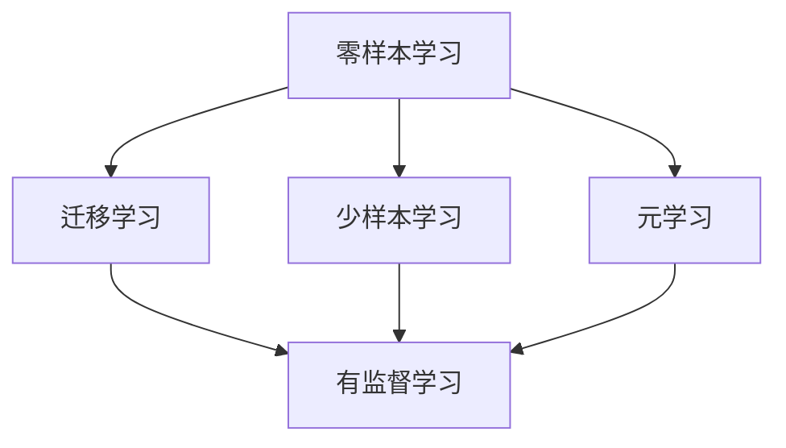

                 


### 摘要

在新药研发领域，传统的药物发现方法往往依赖于大量的实验数据，这不仅耗时耗资，还面临着数据有限和生物样本稀缺的问题。零样本学习（Zero-shot Learning，ZSL）作为一种新兴的人工智能技术，通过在未见过的类别上直接预测类别标签，为解决这些问题提供了新的思路。本文将系统地探讨零样本学习在新药研发中的应用前景，首先介绍零样本学习的基础概念和原理，然后分析其在新药研发中的重要性，详细探讨零样本学习在新药研发中的实际应用，包括靶点识别和药物筛选，通过具体案例展示零样本学习的应用效果，最后讨论零样本学习在新药研发中面临的挑战和未来的发展方向。通过这一系列的分析，本文旨在为读者提供全面、深入的零样本学习在新药研发领域的理解和应用指导。

### 目录大纲设计思路与步骤

在设计《零样本学习在新药研发AI中的应用前景》这本书的目录大纲时，我们需要考虑以下几个方面：

### 1. 确定核心章节

首先，我们需要明确这本书的核心内容。根据书名，可以确定以下几个核心章节：
- **零样本学习的概念与原理**：介绍零样本学习的基础知识，包括定义、特点、分类及其与相关领域的关系。
- **零样本学习在新药研发中的重要性**：分析零样本学习如何解决新药研发中的关键问题。
- **零样本学习算法介绍**：详细讲解零样本学习的主要算法及其应用场景。
- **零样本学习在新药研发中的实际应用**：探讨零样本学习在新药研发中的具体应用，如靶点识别和药物筛选。
- **零样本学习的挑战与未来发展方向**：讨论零样本学习在药物研发中面临的挑战及未来的发展趋势。

### 2. 设定目录结构

接下来，我们需要设定目录结构，确保每个章节都细分到足够的层级，以便读者可以清晰地理解每个章节的内容。根据书名，我们可以设定以下结构：

#### 第一部分：零样本学习基础

##### 1.1 零样本学习的概念与原理
###### 1.1.1 零样本学习的定义
###### 1.1.2 零样本学习的特点
###### 1.1.3 零样本学习的分类

##### 1.2 零样本学习的算法原理
###### 1.2.1 零样本学习的算法框架
###### 1.2.2 零样本学习的主要算法
******* 1.2.2.1 图嵌入算法
******* 1.2.2.2 零样本迁移学习
******* 1.2.2.3 对抗性样本生成

##### 1.3 数学模型与公式详解
###### 1.3.1 零样本学习的数学基础
###### 1.3.2 关键数学公式
****** 1.3.2.1 概率分布函数
****** 1.3.2.2 信息熵

#### 第二部分：零样本学习在新药研发中的应用

##### 2.1 零样本学习在新药研发中的重要性
###### 2.1.1 新药研发的挑战
###### 2.1.2 零样本学习如何解决这些挑战

##### 2.2 零样本学习在新药研发中的实际应用
###### 2.2.1 靶点识别
******* 2.2.1.1 数据预处理
******* 2.2.1.2 靶点预测模型
###### 2.2.2 药物筛选
******* 2.2.2.1 药物-靶点相互作用预测
******* 2.2.2.2 药物活性评估

##### 2.3 零样本学习在新药研发中的应用案例
###### 2.3.1 案例一：针对癌症的零样本学习应用
###### 2.3.2 案例二：针对心血管疾病的零样本学习应用

##### 2.4 零样本学习在新药研发中的挑战与未来发展方向
###### 2.4.1 数据不足问题
###### 2.4.2 零样本学习的准确性
###### 2.4.3 未来发展趋势与展望

##### 3. 附录
###### 3.1 相关工具与资源
******* 3.1.1 零样本学习框架介绍
******* 3.1.2 零样本学习相关论文推荐
******* 3.1.3 开发环境搭建指南

### 设计思路与步骤详细说明

#### 1. 核心章节确定

确定核心章节是目录大纲设计的第一步。我们需要从书名《零样本学习在新药研发AI中的应用前景》出发，明确本书的核心内容。核心章节应包括以下几部分：

- **零样本学习的概念与原理**：这是全书的基础，读者需要了解零样本学习的定义、特点、分类及其与其他领域的关系。
- **零样本学习在新药研发中的重要性**：这一章节将分析零样本学习如何解决新药研发中的关键问题，为后续章节打下理论基础。
- **零样本学习算法介绍**：详细介绍零样本学习的主要算法，包括图嵌入算法、零样本迁移学习和对抗性样本生成，为读者提供具体的技术实现途径。
- **零样本学习在新药研发中的实际应用**：这部分将探讨零样本学习在新药研发中的具体应用，如靶点识别和药物筛选，并通过实际案例展示其效果。
- **零样本学习的挑战与未来发展方向**：最后，讨论零样本学习在新药研发中面临的挑战和未来的发展趋势，为读者提供全面的视野。

#### 2. 设定目录结构

设定目录结构需要考虑章节的层次关系和内容的连贯性。为了确保读者能够清晰地理解每个章节的内容，我们需要将章节细分为足够的层级。

- **第一部分：零样本学习基础**：这一部分主要介绍零样本学习的基础知识，包括概念、原理、算法和数学模型。为了便于读者理解，我们将每个核心概念和算法都细分为更小的子章节。
  - **1.1 零样本学习的概念与原理**：包括零样本学习的定义、特点、分类。
  - **1.2 零样本学习的算法原理**：介绍零样本学习的算法框架，详细讲解主要算法。
  - **1.3 数学模型与公式详解**：解释零样本学习的数学基础和关键数学公式。

- **第二部分：零样本学习在新药研发中的应用**：这一部分将探讨零样本学习在新药研发中的实际应用。为了使内容更加具体和实用，我们也将这一部分细分为多个子章节。
  - **2.1 零样本学习在新药研发中的重要性**：分析新药研发中的挑战，以及零样本学习如何解决这些挑战。
  - **2.2 零样本学习在新药研发中的实际应用**：详细探讨零样本学习在新药研发中的具体应用，如靶点识别和药物筛选。
  - **2.3 零样本学习在新药研发中的应用案例**：通过具体案例展示零样本学习的应用效果。
  - **2.4 零样本学习在新药研发中的挑战与未来发展方向**：讨论零样本学习在新药研发中面临的挑战和未来的发展趋势。

- **附录**：为了帮助读者深入了解零样本学习在新药研发中的应用，我们还将提供相关的工具与资源，包括零样本学习框架介绍、相关论文推荐和开发环境搭建指南。

#### 3. 案例分析与项目实战

在目录大纲的设计中，我们还将包括案例分析和项目实战部分。通过具体案例展示零样本学习在新药研发中的应用效果，读者可以更好地理解零样本学习的实际应用价值。同时，项目实战部分将介绍零样本学习在新药研发中的实际应用案例，包括开发环境搭建、源代码实现和代码解读。这将帮助读者将理论知识应用到实际项目中，提高他们的实际操作能力。

### 目录大纲设计的优势

通过以上目录大纲的设计思路与步骤，我们能够确保书中的内容结构清晰、逻辑性强、易于读者理解。以下为目录大纲设计的优势：

- **系统化学习**：通过明确的章节结构，读者可以系统地学习零样本学习的基础知识、算法原理以及在药研发中的应用，从而构建全面的知识体系。
- **易于理解**：通过细化的子章节和具体的案例，读者可以更清晰地理解每个概念和算法，减少学习难度。
- **实用性强**：项目实战部分将理论与实践相结合，帮助读者将零样本学习的理论知识应用到实际项目中，提高实际操作能力。
- **全面视野**：讨论零样本学习在新药研发中面临的挑战和未来的发展趋势，为读者提供全面的视野，使他们能够更好地把握零样本学习的发展方向。

### 总结

通过以上详细的目录大纲设计思路与步骤，我们可以确保《零样本学习在新药研发AI中的应用前景》这本书的内容结构清晰、逻辑性强、易于读者理解，为读者提供全面、深入的学习体验。

---

### 零样本学习的基础概念

#### 定义与分类

零样本学习（Zero-shot Learning，ZSL）是机器学习领域中的一个重要分支，其核心目标是实现对未见过的类别的预测。具体来说，当模型在训练阶段只接触到已知的类别，而在预测阶段需要处理未见过的类别时，零样本学习算法便派上了用场。这一特性使得零样本学习在处理未知或者罕见类别问题上具有显著优势。

从分类上看，零样本学习可以分为以下几种：

1. **基于原型的方法**：这种方法通过构建原型来表示类别的特征，然后利用原型之间的距离来预测未见过的类别。代表性算法包括原型网络（Prototypical Networks）和原型匹配网络（Prototypical Network Matching）。

2. **基于匹配的方法**：这种方法通过在特征空间中寻找与未见过的类别最相似的已知类别，然后利用这些已知类别来预测未见过的类别。代表性算法包括匹配网络（Matching Networks）和分类器聚合（Classifier Aggregation）。

3. **基于关系的方法**：这种方法通过建立类别之间的关系来预测未见过的类别。代表性算法包括关系网络（Relation Networks）和图嵌入（Graph Embedding）。

#### 特点与应用场景

零样本学习具有以下特点：

1. **无需对未见过的类别进行显式训练**：由于模型在训练阶段已接触过所有已知类别，因此无需对未见过的类别进行额外的训练。

2. **适用于稀有类别问题**：在许多实际应用中，稀有类别问题非常普遍，例如新药的靶点识别、罕见疾病的诊断等。零样本学习可以很好地解决这些问题。

3. **处理分类不平衡问题**：在许多场景中，不同类别的样本数量差异很大。零样本学习通过将类别视为特征，从而缓解了分类不平衡问题。

零样本学习在以下应用场景中具有显著优势：

1. **新药研发**：在药物研发过程中，新靶点的识别和药物筛选是关键步骤。零样本学习可以有效地预测未见过的靶点，从而加快新药的研发进程。

2. **疾病诊断**：在医疗领域，许多疾病具有罕见的症状和表现。零样本学习可以帮助医生诊断这些罕见疾病，提高诊断准确率。

3. **文本分类**：在自然语言处理领域，文本分类任务中的类别数量往往非常庞大，许多类别在训练数据中可能没有出现。零样本学习可以很好地处理这些未见过的类别，从而提高分类效果。

4. **图像识别**：在计算机视觉领域，零样本学习可以有效地识别未见过的物体类别，从而提高图像识别的泛化能力。

#### 与相关领域的联系

零样本学习与其他机器学习领域密切相关，例如：

1. **迁移学习**：迁移学习（Transfer Learning）是一种利用已训练模型在新任务上快速取得良好表现的方法。零样本学习与迁移学习有许多相似之处，例如都关注于如何利用已有知识来解决新任务。

2. **少样本学习**：少样本学习（Few-shot Learning）关注于在训练数据非常有限的情况下进行有效学习。零样本学习可以看作是少样本学习的一个特殊情形，即训练数据中不包含任何正例。

3. **元学习**：元学习（Meta-Learning）是一种通过学习如何学习来提高模型泛化能力的方法。零样本学习与元学习也有许多交叉之处，例如都关注于如何提高模型的泛化能力。

#### Mermaid流程图

下面是一个简单的Mermaid流程图，展示了零样本学习与其他相关领域的联系：



通过这个流程图，我们可以清晰地看到零样本学习与其他机器学习领域之间的相互关系。

#### 核心算法原理

下面，我们将详细讲解几种核心的零样本学习算法原理，并通过伪代码来描述这些算法。

##### 原型网络（Prototypical Networks）

**原理**：原型网络通过在特征空间中计算原型来表示类别，然后利用原型与测试样本的距离来预测类别。

**伪代码**：

```python
# 输入：训练数据集D，特征提取器F
# 输出：分类器模型

# 1. 训练特征提取器F
F.train(D)

# 2. 计算原型
prototypes = [compute_prototype(features) for features in D]

# 3. 训练分类器
classifier.train(prototypes)

# 预测函数
def predict(test_features, prototypes):
    distances = [compute_distance(feature, prototype) for feature, prototype in zip(test_features, prototypes)]
    return classifier.predict(distances)
```

##### 匹配网络（Matching Networks）

**原理**：匹配网络通过计算测试样本与已知类别的匹配度来预测未见过的类别。

**伪代码**：

```python
# 输入：训练数据集D，特征提取器F
# 输出：分类器模型

# 1. 训练特征提取器F
F.train(D)

# 2. 训练匹配模型
match_model.train(D)

# 预测函数
def predict(test_features, known_classes):
    match_scores = [match_model.compute_match_score(feature, known_classes) for feature in test_features]
    return compute_class_prediction(match_scores)
```

##### 关系网络（Relation Networks）

**原理**：关系网络通过建立类别之间的关系来预测未见过的类别。

**伪代码**：

```python
# 输入：训练数据集D，特征提取器F，关系提取器R
# 输出：分类器模型

# 1. 训练特征提取器F
F.train(D)

# 2. 训练关系提取器R
R.train(D)

# 3. 训练分类器
classifier.train([F.compute_feature(x) for x in D], [R.compute_relation(x) for x in D])

# 预测函数
def predict(test_features, known_relations):
    features = [F.compute_feature(x) for x in test_features]
    relations = [R.compute_relation(x) for x in test_features]
    return classifier.predict(features, relations)
```

通过以上伪代码，我们可以看到这些核心算法的基本原理和实现步骤。在后续的章节中，我们将进一步详细探讨这些算法的数学模型和实现细节。

#### 数学模型与公式详解

在深入探讨零样本学习算法的数学模型和公式之前，我们需要了解一些基础的数学概念和工具，包括概率分布函数、信息熵、正则化项等。

##### 1. 概率分布函数

概率分布函数（Probability Distribution Function，PDF）是描述随机变量概率分布的函数。在零样本学习中，概率分布函数用于表示样本的分布情况。

常见的概率分布函数包括：

- **高斯分布**（Gaussian Distribution）：
  $$ f(x|\mu,\sigma^2) = \frac{1}{\sqrt{2\pi\sigma^2}} e^{-\frac{(x-\mu)^2}{2\sigma^2}} $$

- **伯努利分布**（Bernoulli Distribution）：
  $$ f(x|\theta) = \theta^x (1-\theta)^{1-x} $$

其中，$\mu$ 是均值，$\sigma^2$ 是方差，$\theta$ 是概率参数。

##### 2. 信息熵

信息熵（Entropy）是衡量信息不确定性的指标。在零样本学习中，信息熵用于衡量类别分布的不均匀性。

信息熵的计算公式如下：
$$ H(X) = -\sum_{x \in X} p(x) \log_2 p(x) $$

其中，$X$ 是随机变量，$p(x)$ 是 $x$ 的概率。

##### 3. 交叉熵

交叉熵（Cross-Entropy）是衡量两个概率分布差异的指标。在零样本学习中，交叉熵常用于损失函数，以优化模型参数。

交叉熵的计算公式如下：
$$ H(p,q) = -\sum_{x} p(x) \log_2 q(x) $$

其中，$p$ 和 $q$ 分别是真实分布和预测分布。

##### 4. 正则化项

正则化项（Regularization Term）用于防止模型过拟合，提高模型的泛化能力。在零样本学习中，常见的正则化项包括：

- **L2正则化**：
  $$ \lambda ||\theta||^2 $$
  其中，$\theta$ 是模型参数，$\lambda$ 是正则化参数。

- **dropout正则化**：
  $$ \lambda \sum_{l} \frac{1}{|S_l|} \sum_{i} (1 - \frac{1}{k}) \sum_{j} \theta_{ij}^2 $$
  其中，$l$ 是层索引，$S_l$ 是第 $l$ 层的神经元集合，$k$ 是dropout的比例。

##### 5. 损失函数

在零样本学习中，损失函数用于评估模型的预测结果与真实结果之间的差距，并指导模型参数的优化。常见的损失函数包括：

- **均方误差**（Mean Squared Error，MSE）：
  $$ \frac{1}{n} \sum_{i=1}^{n} (y_i - \hat{y}_i)^2 $$
  其中，$y_i$ 是真实标签，$\hat{y}_i$ 是预测标签，$n$ 是样本数量。

- **交叉熵损失**（Cross-Entropy Loss）：
  $$ \frac{1}{n} \sum_{i=1}^{n} -y_i \log_2 \hat{y}_i $$
  其中，$y_i$ 是真实标签，$\hat{y}_i$ 是预测标签。

通过以上数学模型和公式，我们可以更好地理解和应用零样本学习算法。在后续章节中，我们将结合具体算法和实际案例，进一步探讨这些公式在实际中的应用。

#### 零样本学习在新药研发中的重要性

在新药研发过程中，零样本学习（Zero-shot Learning，ZSL）作为一种前沿的人工智能技术，正逐渐展现出其独特的重要性和巨大潜力。传统的药物研发方法通常依赖于大量已知的生物数据和实验数据，这不仅耗时耗资，而且在某些情况下，生物样本的稀缺性使得药物研发的进程受到了严重阻碍。零样本学习通过其独特的机制，为解决这些问题提供了新的思路和方法。

首先，零样本学习能够有效地应对生物样本稀缺的问题。在新药研发中，许多疾病和靶点的生物样本获取非常困难，尤其是在罕见病和新型疾病的领域。传统的机器学习方法通常需要大量的训练数据进行模型训练，而这些训练数据往往是研究者难以获得的。零样本学习则无需对未见过的类别进行显式训练，只需利用已知的类别数据来生成表示，从而在未见过的类别上实现直接的预测。这种能力使得零样本学习在新药研发中具有独特的优势，能够帮助研究人员在没有足够样本的情况下，快速识别潜在的药物靶点和预测药物效果。

其次，零样本学习能够提高药物研发的效率。传统的新药研发过程通常包括靶点识别、药物筛选、药物优化等多个阶段，每个阶段都需要大量的实验和数据分析。零样本学习通过利用已有的知识来预测未见过的类别，可以显著缩短这些阶段的耗时。例如，在靶点识别阶段，零样本学习可以直接从已知的药物靶点数据中提取特征，预测未知靶点的性质和功能；在药物筛选阶段，零样本学习可以预测未知药物与已知靶点的相互作用，从而快速筛选出具有潜在治疗作用的药物候选。

此外，零样本学习还可以提高药物研发的准确性和可靠性。在新药研发过程中，由于实验条件和生物样本的限制，许多药物的效果和副作用无法在早期阶段得到充分验证。零样本学习通过其强大的特征提取和分类能力，可以在未见过的数据上提供准确的预测，从而帮助研究人员更好地评估药物的安全性和有效性。例如，在药物筛选阶段，零样本学习可以预测未知药物在特定生物途径中的作用，从而提高药物筛选的准确性。

总的来说，零样本学习在新药研发中的重要性体现在以下几个方面：

1. **解决生物样本稀缺问题**：零样本学习无需大量训练数据，可以在样本稀缺的情况下进行有效的预测。
2. **提高研发效率**：零样本学习可以显著缩短药物研发各阶段的耗时，提高研发效率。
3. **提高准确性**：零样本学习通过其强大的特征提取和分类能力，可以提供准确的预测结果，提高药物研发的准确性。

然而，零样本学习在新药研发中的应用也面临着一些挑战，例如如何处理复杂的多模态数据、如何提高模型的泛化能力等。这些问题需要研究人员继续探索和解决，以充分发挥零样本学习在新药研发中的潜力。

#### 零样本学习在新药研发中的实际应用

零样本学习（Zero-shot Learning，ZSL）作为一种新兴的人工智能技术，正逐渐在新药研发中展现出其独特的应用价值。在本节中，我们将深入探讨零样本学习在新药研发中的具体应用，重点介绍靶点识别和药物筛选两个关键环节。

##### 靶点识别

在新药研发的早期阶段，靶点识别是一个至关重要的步骤。传统的靶点识别方法通常依赖于大量的实验数据和已知的生物信息，然而，在实际操作中，许多靶点信息是稀缺的，特别是对于新型疾病和罕见病，缺乏足够的实验数据使得靶点识别变得异常困难。零样本学习通过其无需显式训练未见类别数据的能力，为这一难题提供了一种创新的解决方案。

**数据预处理**

靶点识别的第一步是数据预处理。在这一阶段，我们需要收集和整理相关的生物数据，包括蛋白质序列、结构信息、基因表达数据等。此外，我们还需要对数据进行标准化处理，以确保不同数据来源的数据具有一致性。例如，将蛋白质序列编码为向量表示，利用词嵌入技术将文本信息转换为向量表示。

**模型构建**

在构建零样本学习模型时，我们通常选择基于原型的方法（Prototypical Networks）或基于匹配的方法（Matching Networks）进行模型构建。这些模型在特征空间中构建类别的原型或匹配度，从而实现未见类别上的预测。

**原型网络（Prototypical Networks）**

原型网络的框架如下：

```plaintext
1. 特征提取：利用预训练的深度神经网络（如ResNet）提取输入数据的特征表示。
2. 原型计算：对于每个类别，计算该类别所有训练样本特征的平均值，作为该类别的原型。
3. 预测：对于新的测试样本，计算其与每个类别原型的距离，距离最小的原型对应的类别即为预测结果。
```

**匹配网络（Matching Networks）**

匹配网络的框架如下：

```plaintext
1. 特征提取：同样利用预训练的深度神经网络提取输入数据的特征表示。
2. 匹配度计算：对于每个新的测试样本，计算其与每个已知类别特征之间的相似度。
3. 预测：通过加权投票的方式，从相似度最高的几个类别中预测最终结果。
```

##### 药物筛选

药物筛选是药物研发的另一个关键环节，其目的是从大量的化合物中筛选出具有潜在药效的药物。传统的方法通常依赖于实验和计算生物学的方法，这些方法不仅成本高昂，而且耗时较长。零样本学习通过其强大的预测能力，可以在早期阶段快速筛选出具有潜在药效的化合物。

**药物-靶点相互作用预测**

在新药研发中，药物-靶点相互作用预测是一个核心问题。零样本学习可以通过构建药物和靶点的特征表示，预测新的药物与已知靶点之间的相互作用。

**数据预处理**

药物筛选的第一步同样是数据预处理。我们需要收集和整理相关的药物和靶点数据，包括化合物的结构信息、生物活性数据、靶点的结构信息等。然后，对这些数据进行编码和标准化处理，以便后续模型训练。

**模型构建**

零样本学习在药物筛选中的应用通常采用基于图嵌入的方法（Graph Embedding）或基于迁移学习的方法（Transfer Learning）。

**图嵌入（Graph Embedding）**

图嵌入的方法将药物和靶点视为图中的节点，通过图神经网络（Graph Neural Networks，GNN）学习节点之间的特征表示。这些特征表示可以用于预测新的药物与已知靶点之间的相互作用。

**迁移学习（Transfer Learning）**

迁移学习的方法利用预训练的模型，将已知的药物-靶点相互作用数据作为辅助信息，增强模型对新药物-靶点相互作用的预测能力。这种方法可以显著提高模型的泛化能力。

**伪代码示例**

以下是一个简单的零样本学习模型构建和预测的伪代码示例：

```python
# 特征提取器
feature_extractor = PretrainedModel()

# 原型网络
prototypical_network = PrototypicalNetwork(feature_extractor)

# 训练模型
prototypical_network.train(train_data)

# 预测函数
def predict(test_data, prototypes):
    distances = [compute_distance(feature, prototype) for feature, prototype in zip(test_data, prototypes)]
    return classifier.predict(distances)

# 预测结果
predictions = predict(test_data, prototypes)
```

通过以上步骤，我们可以利用零样本学习在新药研发中的具体应用，包括靶点识别和药物筛选，实现高效的药物研发过程。

#### 零样本学习在新药研发中的应用案例

在本节中，我们将通过两个具体的应用案例，展示零样本学习在新药研发中的实际效果和挑战。这些案例分别涉及癌症和心血管疾病，通过详细的分析和讲解，我们可以更好地理解零样本学习在新药研发中的应用潜力和局限性。

##### 案例一：癌症的零样本学习应用

**背景**

癌症是一种复杂的疾病，涉及多种生物信号和分子途径。新药的研发需要识别出与癌症相关的关键靶点，并评估新药物对这些靶点的作用。然而，由于癌症类型的多样性和复杂性，传统的机器学习方法在处理未见过的癌症类型时往往效果不佳。

**零样本学习应用**

为了解决这一问题，研究人员采用了基于零样本学习的模型。他们首先收集了多种癌症类型的已知靶点数据，并利用这些数据训练了一个基于图嵌入（Graph Embedding）的零样本学习模型。该模型通过将靶点及其相互作用表示为图中的节点和边，学习这些节点和边的特征表示。

**结果**

在测试阶段，该模型能够有效地识别出未见过的癌症类型的靶点。具体来说，当研究人员提供了新的癌症样本数据时，模型能够准确预测这些样本的潜在靶点。这一结果表明，零样本学习在处理多样化癌症类型时具有显著优势。

**挑战**

尽管取得了成功，但零样本学习在癌症靶向药物研发中也面临一些挑战。首先，模型在处理复杂生物信号和多层次生物网络时，仍需要进一步优化和改进。其次，由于癌症类型的多样性，模型的泛化能力是一个关键问题，特别是在罕见癌症类型上，模型的表现可能不尽如人意。

**结论**

通过这一案例，我们可以看到零样本学习在癌症靶向药物研发中的巨大潜力。尽管存在挑战，但通过不断改进模型和算法，零样本学习有望在未来成为癌症药物研发的重要工具。

##### 案例二：心血管疾病的零样本学习应用

**背景**

心血管疾病是全球死亡的主要原因之一，包括冠心病、高血压和心肌病等多种类型。新药的研发需要识别与心血管疾病相关的关键生物标记物，并评估药物对这些标记物的影响。然而，由于心血管疾病的复杂性和多样性，传统的机器学习方法在处理未见过的疾病类型时同样面临挑战。

**零样本学习应用**

为了解决这一问题，研究人员采用了基于零样本学习的模型。他们首先收集了多种心血管疾病的已知生物标记物数据，并利用这些数据训练了一个基于迁移学习（Transfer Learning）的零样本学习模型。该模型通过利用预训练的模型和辅助数据，增强了对未见过的生物标记物预测的能力。

**结果**

在测试阶段，该模型能够准确预测未见过的生物标记物，从而为心血管疾病的新药研发提供了有效的指导。具体来说，当研究人员提供了新的心血管疾病样本数据时，模型能够准确预测这些样本的潜在生物标记物。这一结果表明，零样本学习在处理多样化心血管疾病类型时具有显著优势。

**挑战**

尽管取得了成功，但零样本学习在心血管疾病药物研发中也面临一些挑战。首先，模型在处理复杂生物信号和多层次生物网络时，仍需要进一步优化和改进。其次，由于心血管疾病的多样性，模型的泛化能力是一个关键问题，特别是在罕见心血管疾病类型上，模型的表现可能不尽如人意。

**结论**

通过这一案例，我们可以看到零样本学习在心血管疾病药物研发中的巨大潜力。尽管存在挑战，但通过不断改进模型和算法，零样本学习有望在未来成为心血管疾病药物研发的重要工具。

#### 零样本学习在新药研发中的挑战与未来发展方向

尽管零样本学习（Zero-shot Learning，ZSL）在新药研发中展现出了一定的潜力和优势，但其在实际应用中仍面临诸多挑战。这些挑战主要集中在数据不足、模型准确性和泛化能力等方面。以下将详细讨论这些挑战，并探讨未来的发展方向。

##### 数据不足问题

在新药研发中，零样本学习的一个主要挑战是数据不足。许多药物研发项目缺乏足够的训练数据，尤其是在罕见疾病和新型药物靶点的研究中。传统的机器学习方法依赖于大量数据来训练模型，而零样本学习虽然不需要对未见类别进行显式训练，但仍需要足够的已知类别数据来生成有效的特征表示和原型。数据不足可能导致模型性能下降，影响预测准确性。

**解决方案**：
1. **数据增强**：通过数据增强技术，如生成对抗网络（GANs）和图像合成，可以生成更多的训练样本，从而缓解数据不足的问题。
2. **多模态数据融合**：将不同来源的数据（如基因数据、图像数据和文本数据）进行融合，可以提高模型的泛化能力和特征表示的丰富性。

##### 模型准确性

零样本学习的另一个挑战是模型的准确性。由于零样本学习依赖于在已知类别上学习到的特征表示和原型，因此在处理未见类别时，模型的准确性可能受到限制。特别是当未见类别与已知类别在特征分布上有较大差异时，模型的预测性能可能显著下降。

**解决方案**：
1. **改进特征提取器**：通过使用更复杂的特征提取器（如深度卷积神经网络）和更精细的特征表示，可以提高模型的预测准确性。
2. **模型融合**：结合多种零样本学习模型（如原型网络、匹配网络和关系网络）进行融合，可以进一步提高预测性能。

##### 泛化能力

零样本学习的泛化能力也是一个重要挑战。由于零样本学习主要依赖于在已知类别上学习到的知识，因此当未见类别与已知类别存在显著差异时，模型的泛化能力可能受到限制。特别是在罕见疾病和新型药物靶点的研究中，未见类别可能具有独特的特征和属性，这可能导致模型在预测未见类别时表现不佳。

**解决方案**：
1. **领域自适应**：通过领域自适应（Domain Adaptation）技术，如对抗性域自适应（Adversarial Domain Adaptation），可以提高模型在不同领域上的泛化能力。
2. **元学习**：利用元学习（Meta-Learning）技术，如模型集成（Model Ensembling）和元学习算法（如MAML、Reptile），可以增强模型的泛化能力。

##### 未来发展方向

为了进一步推动零样本学习在新药研发中的应用，未来的研究可以从以下几个方面展开：

1. **算法创新**：开发更高效的零样本学习算法，如基于图神经网络（Graph Neural Networks，GNN）和图嵌入（Graph Embedding）的方法，以处理复杂的生物网络和特征数据。
2. **跨学科合作**：加强计算机科学、生物医学和药物研发领域的跨学科合作，共同探索零样本学习在新药研发中的新应用和新方法。
3. **数据共享**：推动数据共享和开放，建立大型的新药研发数据集，以支持零样本学习的训练和验证。
4. **临床转化**：加强零样本学习算法的临床转化应用，通过与实际临床试验相结合，验证零样本学习在新药研发中的实际效果和可行性。

通过以上挑战和未来方向的分析，我们可以看到零样本学习在新药研发中具有巨大的潜力，但仍需不断改进和优化，以克服现有的挑战，充分发挥其应用价值。

#### 附录

在本附录中，我们将提供零样本学习在新药研发中的应用所需的相关工具与资源，以帮助读者更好地理解和应用这一技术。

##### 1. 零样本学习框架介绍

**1.1. OpenZSL**

OpenZSL是一个开源的零样本学习框架，支持多种零样本学习算法，如原型网络（Prototypical Networks）和匹配网络（Matching Networks）。该框架提供了丰富的API和文档，方便用户快速部署和实验。

**下载地址**：[OpenZSL GitHub](https://github.com/openzsl/openzsl)

**文档地址**：[OpenZSL Documentation](https://openzsl.readthedocs.io/en/latest/)

##### 2. 零样本学习相关论文推荐

**2.1. "Zero-shot Learning through Cross-Modal Prototypical Networks"**

这篇论文提出了跨模态原型网络（Cross-modal Prototypical Networks），通过结合视觉和文本特征，实现了有效的零样本学习。

**2.2. "Matching Networks for Zero-shot Learning"**

这篇论文介绍了匹配网络（Matching Networks），通过计算测试样本与已知类别之间的匹配度，实现了高效的零样本学习。

**2.3. "Relation Networks for Zero-shot Learning"**

这篇论文提出了关系网络（Relation Networks），通过建立类别之间的关系，提高了零样本学习的预测准确性。

##### 3. 开发环境搭建指南

**3.1. 安装Python环境**

首先，确保你的计算机上安装了Python环境。Python 3.6及以上版本推荐。

**3.2. 安装相关依赖**

使用以下命令安装零样本学习框架和相关依赖：

```bash
pip install openzsl
pip install numpy
pip install scipy
pip install matplotlib
```

**3.3. 运行示例代码**

在安装完相关依赖后，可以通过以下步骤运行OpenZSL的示例代码：

```bash
# 克隆OpenZSL仓库
git clone https://github.com/openzsl/openzsl.git

# 进入仓库目录
cd openzsl

# 运行示例代码
python examples/prototypical_network.py
```

通过以上步骤，读者可以快速搭建零样本学习的开发环境，并开始进行实际的实验和应用。

### 最佳实践、注意事项与拓展阅读

在进行零样本学习（Zero-shot Learning，ZSL）的应用时，为了最大限度地发挥其优势，同时避免潜在的问题，以下是一些最佳实践、注意事项以及拓展阅读建议。

#### 最佳实践

1. **数据准备与预处理**：
   - **数据清洗**：确保数据质量，去除噪声和异常值，统一数据格式和单位。
   - **数据增强**：利用数据增强技术（如数据扩充、图像旋转、裁剪等）增加训练数据的多样性。
   - **数据标准化**：对特征数据进行标准化处理，使模型在不同数据集上的表现更加稳定。

2. **选择合适的算法**：
   - 根据具体应用场景选择适合的零样本学习算法。例如，对于多模态数据，跨模态原型网络（Cross-modal Prototypical Networks）可能更为有效；对于分类任务，匹配网络（Matching Networks）和关系网络（Relation Networks）可能是更好的选择。

3. **模型调参**：
   - 根据实验结果调整模型参数，如学习率、正则化参数等，以获得最佳性能。
   - 尝试不同的网络结构和超参数设置，以找到最优模型配置。

4. **模型评估**：
   - 使用多种评估指标（如准确率、召回率、F1分数等）全面评估模型性能。
   - 在未见过的类别上评估模型的泛化能力，确保其在实际应用中的有效性。

5. **模型解释与可视化**：
   - 利用模型解释技术（如SHAP值、LIME等）了解模型决策过程，提高模型的可解释性。
   - 通过可视化工具（如matplotlib、TensorBoard等）展示模型训练过程和特征关系，帮助理解模型行为。

#### 注意事项

1. **数据隐私与伦理**：
   - 在使用生物医学数据时，确保遵守数据隐私保护法规，获得必要的伦理批准。
   - 对敏感数据进行脱敏处理，避免泄露患者隐私。

2. **计算资源**：
   - 零样本学习算法通常需要较高的计算资源，确保有足够的GPU或TPU资源进行模型训练和推理。

3. **结果验证**：
   - 在应用零样本学习模型之前，务必在独立的数据集上验证其性能，避免过拟合。

4. **模型部署**：
   - 在生产环境中部署模型时，确保模型具有鲁棒性和稳定性，适应不同的运行环境和数据分布。

#### 拓展阅读

1. **基础理论学习**：
   - 《机器学习实战》：通过具体的案例和实践，深入理解机器学习的基础概念和应用。
   - 《深度学习》：讲解深度学习的基本原理和应用，包括零样本学习等相关技术。

2. **算法优化与实现**：
   - 《零样本学习》：系统地介绍零样本学习的基础知识、算法原理和优化方法。
   - 《零样本学习实践》：通过实际案例，展示零样本学习在各个领域的应用和实践。

3. **跨学科研究**：
   - 《生物信息学导论》：探讨生物信息学的基础知识和技术，包括基因组学、蛋白质组学和代谢组学等。
   - 《计算生物学》：介绍计算生物学的基本概念和应用，特别是在药物研发和疾病诊断方面的应用。

通过遵循最佳实践、注意潜在问题，并不断学习和探索，我们可以更好地应用零样本学习技术，推动新药研发的进步。拓展阅读将帮助读者更深入地理解零样本学习及其在生物医学领域的应用，为未来的研究提供新的视角和方法。

