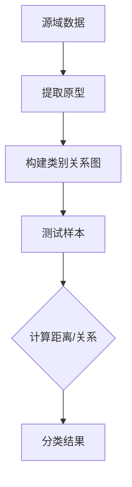
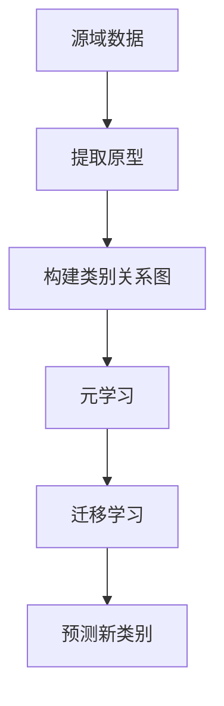

                 

### 引言

零样本学习（Zero-Shot Learning, ZSL）是人工智能领域中一个新兴且备受关注的研究方向。近年来，随着深度学习技术的发展，传统的监督学习和半监督学习在图像识别、语音识别等任务上取得了显著成果。然而，这些方法通常需要大量带有标签的数据进行训练，这在很多实际应用场景中难以实现。例如，对于新型疾病的诊断、罕见动物种类的识别等，往往难以获取足够的多标签数据。零样本学习正是在这种背景下应运而生，它允许模型在面对未见过的类别时，仍能够做出准确的预测。

零样本学习的重要性主要体现在以下几个方面：

1. **数据稀缺问题的解决**：在许多实际应用中，如医疗影像分析、生物特征识别等，获取大量带有标签的数据非常困难，甚至不可能。零样本学习能够减少对大规模标注数据的依赖，从而降低数据收集和标注的成本。

2. **跨领域迁移能力**：零样本学习模型可以学会在多个领域中识别相似的物体或概念，从而实现跨领域的迁移。这意味着，在一个领域中训练的模型，可以应用到其他领域，提高模型的泛化能力。

3. **实时性**：零样本学习模型可以在没有预先标注数据的情况下快速适应新类别，这对于需要快速响应的实时系统（如自动驾驶、实时监控等）尤为重要。

4. **知识增强**：零样本学习可以将外部知识库（如字典、百科全书等）引入到模型中，从而提高模型对新类别进行预测的准确性。

本文将围绕零样本学习这一主题，从以下几个方面进行探讨：

1. **零样本学习概述**：介绍零样本学习的定义、基本概念、分类和研究意义。
2. **零样本学习原理**：详细讲解零样本学习的基本原理、算法原理以及数学模型和公式。
3. **零样本学习应用**：分析零样本学习在不同领域的应用场景，并提供具体的开发环境搭建、源代码实现和代码解读案例。
4. **零样本学习挑战与未来发展趋势**：讨论零样本学习面临的技术挑战以及未来的发展方向。
5. **结论与展望**：总结零样本学习的核心观点和主要贡献，并对未来提出建议和展望。

通过这篇文章，希望能够为广大读者提供对零样本学习这一领域的一个全面而深入的认知，激发更多研究者在这个方向上的探索和创新。

### 零样本学习概述

#### 定义与基本概念

零样本学习（Zero-Shot Learning, ZSL）是指模型在未见过的类别上做出预测的能力。具体来说，当模型面对一个新的类别时，它能够利用之前学到的知识对新类别进行分类。这一概念源于机器学习中的一种特殊情况，即训练数据集中的类别与测试数据集中的类别不完全相同。传统机器学习模型通常需要大量带有标签的训练数据来学习分类规则，而零样本学习则打破了这一限制。

在零样本学习框架下，数据集通常分为以下几个部分：

1. **源域（Source Domain）**：这是模型已经学习过的数据集，包含多个已知的类别。
2. **目标域（Target Domain）**：这是模型需要预测的新类别数据集，这些类别在训练阶段并未见过。
3. **类标签（Class Labels）**：训练数据集中的每个样本都有一个对应的类标签，而目标域中的样本则没有预先标注。

零样本学习的基本思想是利用源域中已知的类别信息来推断目标域中未见过的类别。这一过程通常涉及到两类任务：

1. **原型匹配（Prototype Matching）**：这种方法将每个类别表示为一个原型（prototype），即该类别的“平均值”。在预测新类别时，模型计算新样本与每个原型的距离，并选择距离最近的那个原型作为预测类别。
2. **关系分类（Relational Classification）**：这种方法将类别之间的相似性表示为关系（relation），并在学习过程中构建一个类别关系图。在预测新类别时，模型根据新样本在类别关系图中的位置来推断其类别。

#### 分类与比较

根据学习策略的不同，零样本学习可以分为以下几种类型：

1. **基于原型的方法**：这种方法将每个类别表示为一个原型，并通过计算原型与测试样本的距离来进行分类。常见的原型方法包括平均值原型、中心原型和核原型等。

2. **基于关系的方法**：这种方法通过构建类别关系图来表示类别之间的相似性。在预测时，模型根据新样本在类别关系图中的位置来推断其类别。关系分类方法包括基于图神经网络的方法和基于距离度量法的方法。

3. **基于集成的方法**：这种方法将多种学习策略结合起来，以提高零样本学习的性能。常见的集成方法包括基于原型和关系的混合方法，以及基于深度神经网络的方法。

以下是一个简单的Mermaid流程图，展示了零样本学习的基本概念和流程：



#### 研究意义与应用前景

零样本学习在人工智能领域具有重要的研究意义和广泛的应用前景。以下是一些具体的研究意义和应用场景：

1. **数据稀缺问题**：在许多应用场景中，如医学影像分析、生物特征识别等，获取大量带有标签的数据非常困难。零样本学习可以减少对大规模标注数据的依赖，从而降低数据收集和标注的成本。

2. **跨领域迁移**：零样本学习模型可以学会在多个领域中识别相似的物体或概念，从而实现跨领域的迁移。这意味着，在一个领域中训练的模型，可以应用到其他领域，提高模型的泛化能力。

3. **实时性**：零样本学习模型可以在没有预先标注数据的情况下快速适应新类别，这对于需要快速响应的实时系统（如自动驾驶、实时监控等）尤为重要。

4. **知识增强**：零样本学习可以将外部知识库（如字典、百科全书等）引入到模型中，从而提高模型对新类别进行预测的准确性。

在实际应用中，零样本学习已经展示出巨大的潜力。例如，在计算机视觉领域，零样本学习可以用于新型疾病诊断、罕见动物识别等；在自然语言处理领域，零样本学习可以用于跨语言文本分类、新词汇预测等。随着研究的不断深入，零样本学习有望在更多领域得到广泛应用。

### 零样本学习原理

零样本学习（Zero-Shot Learning, ZSL）的核心在于如何让模型在没有见过的新类别上做出准确的预测。为了实现这一目标，零样本学习采用了多种不同的方法和策略。下面，我们将详细讲解零样本学习的基本原理，包括核心概念与联系、算法原理讲解以及数学模型和公式。

#### 核心概念与联系

零样本学习涉及以下几个核心概念：

1. **原型（Prototype）**：原型是类别的一种表示方式，通常是一个类别的“平均值”。在零样本学习中，每个类别都有一个对应的原型。

2. **关系（Relation）**：关系表示类别之间的相似性。在零样本学习中，通过构建类别关系图，可以表示不同类别之间的相互关系。

3. **元学习（Meta-Learning）**：元学习是一种通过学习如何学习的方法。在零样本学习中，元学习可以帮助模型快速适应新类别。

4. **迁移学习（Transfer Learning）**：迁移学习是指将一个任务学到的知识应用于另一个相关任务。在零样本学习中，迁移学习可以帮助模型利用源域（已知类别）的知识来预测目标域（新类别）。

以下是一个简单的Mermaid流程图，展示了零样本学习的基本概念和联系：



#### 算法原理讲解

零样本学习采用了多种算法来预测新类别。下面，我们将介绍几种常见的算法原理：

1. **原型匹配（Prototype Matching）**：

   原型匹配是一种基于原型的方法。在训练阶段，模型首先学习每个类别的原型。在预测阶段，模型计算测试样本与每个原型的距离，并选择距离最近的那个原型作为预测类别。

   原型匹配的伪代码如下：

   ```python
   function predict PrototypeMatching(test_sample, prototypes):
       distances = []
       for prototype in prototypes:
           distance = euclidean_distance(test_sample, prototype)
           distances.append(distance)
       predicted_class = prototypes[closest_distance(distances)]
       return predicted_class
   ```

2. **关系分类（Relational Classification）**：

   关系分类是一种基于关系的方法。在训练阶段，模型首先构建类别关系图。在预测阶段，模型根据测试样本在类别关系图中的位置来推断其类别。

   关系分类的伪代码如下：

   ```python
   function predict RelationalClassification(test_sample, relation_graph):
       neighbors = get_neighbors(test_sample, relation_graph)
       predicted_class = most_common_class_in_neighbors(neighbors)
       return predicted_class
   ```

3. **元学习（Meta-Learning）**：

   元学习是一种通过学习如何学习的方法。在零样本学习中，元学习可以帮助模型快速适应新类别。常见的元学习算法包括MAML（Model-Agnostic Meta-Learning）和Reptile。

   MAML的伪代码如下：

   ```python
   function train MAML(model, source_domain, target_domain):
       for each batch in source_domain:
           model = gradient_descent(model, batch)
       for each batch in target_domain:
           model = gradient_descent(model, batch)
       return model
   ```

4. **迁移学习（Transfer Learning）**：

   迁移学习是指将一个任务学到的知识应用于另一个相关任务。在零样本学习中，迁移学习可以帮助模型利用源域的知识来预测目标域。

   迁移学习的伪代码如下：

   ```python
   function predict TransferLearning(model, source_domain, target_domain):
       model = fine_tune(model, source_domain)
       test_samples = preprocess(target_domain)
       predicted_classes = model.predict(test_samples)
       return predicted_classes
   ```

#### 数学模型和公式

零样本学习的数学模型和公式通常用于描述类别之间的相似性和距离度量。以下是一些常见的数学模型和公式：

1. **原型匹配（Prototype Matching）**：

   原型匹配的数学模型可以使用欧几里得距离（Euclidean Distance）来计算测试样本与原型之间的距离。欧几里得距离的公式如下：

   $$d(\mathbf{x}, \mathbf{p}) = \sqrt{\sum_{i=1}^{n} (x_i - p_i)^2}$$

   其中，$\mathbf{x}$ 表示测试样本，$\mathbf{p}$ 表示原型。

2. **关系分类（Relational Classification）**：

   关系分类的数学模型可以使用相似性矩阵（Similarity Matrix）来表示类别之间的关系。相似性矩阵的元素 $s_{ij}$ 可以使用余弦相似度（Cosine Similarity）来计算，公式如下：

   $$s_{ij} = \frac{\mathbf{u}_i \cdot \mathbf{u}_j}{||\mathbf{u}_i|| \cdot ||\mathbf{u}_j||}$$

   其中，$\mathbf{u}_i$ 和 $\mathbf{u}_j$ 分别表示类别 $i$ 和类别 $j$ 的嵌入向量。

3. **元学习（Meta-Learning）**：

   元学习的数学模型通常涉及到梯度下降（Gradient Descent）和反向传播（Backpropagation）。梯度下降的公式如下：

   $$w_{t+1} = w_t - \alpha \cdot \nabla_{w_t} J(w_t)$$

   其中，$w_t$ 表示当前模型的参数，$\alpha$ 表示学习率，$J(w_t)$ 表示损失函数。

4. **迁移学习（Transfer Learning）**：

   迁移学习的数学模型通常涉及到权重共享（Weight Sharing）和微调（Fine-Tuning）。微调的公式如下：

   $$w_{target} = \lambda \cdot w_{source} + (1 - \lambda) \cdot w_{target}$$

   其中，$w_{target}$ 表示目标模型的参数，$w_{source}$ 表示源模型的参数，$\lambda$ 表示调整系数。

通过以上对零样本学习原理的详细讲解，我们可以看到，零样本学习不仅仅是一种技术，更是一种思考问题和解决问题的方法。它为我们提供了一种新的途径，让我们能够更加高效地利用有限的资源，实现对未知类别的预测。在接下来的章节中，我们将进一步探讨零样本学习的应用，以及它面临的挑战和未来发展趋势。

### 零样本学习应用

零样本学习在各个领域都展示了其独特的优势和应用潜力。以下将分析零样本学习在不同领域的应用场景，并通过具体的开发环境搭建、源代码实现和代码解读案例，展示其应用效果。

#### 应用场景分析

1. **计算机视觉**：

   在计算机视觉领域，零样本学习被广泛应用于图像识别、物体检测和图像分类等任务。例如，在图像识别中，零样本学习可以帮助模型识别新的、未见过的物体类别。这尤其适用于远程监控系统、智能监控系统等场景，这些系统往往难以获取大量的标注数据。

2. **自然语言处理**：

   在自然语言处理（NLP）领域，零样本学习可以用于跨语言文本分类、新词汇预测等任务。例如，在跨语言文本分类中，零样本学习模型可以学习一种通用语言表示，从而在未见过的语言上实现文本分类。

3. **医疗诊断**：

   在医疗诊断领域，零样本学习可以用于新型疾病的诊断和罕见病例的识别。由于医学影像数据通常难以获取和标注，零样本学习可以降低对大规模标注数据的依赖，提高诊断的效率和准确性。

4. **生物特征识别**：

   在生物特征识别领域，零样本学习可以帮助模型识别新的生物特征，例如指纹识别、面部识别等。这为解决数据稀缺问题提供了一种有效的方法。

#### 开发环境搭建

为了展示零样本学习的应用，以下以一个简单的计算机视觉项目为例，介绍开发环境的搭建。

1. **安装Python**：

   零样本学习项目通常使用Python作为编程语言。确保已经安装了Python环境，版本建议在3.6及以上。

2. **安装必要的库**：

   使用pip命令安装以下库：

   ```shell
   pip install tensorflow numpy matplotlib scikit-learn
   ```

   这些库提供了零样本学习所需的算法和工具。

3. **下载数据集**：

   下载一个包含已知类别和未见类别图像的数据集，例如CUB-200-2011鸟种分类数据集。

#### 源代码实现

以下是一个简单的零样本学习项目，使用原型匹配算法进行图像分类。

```python
import tensorflow as tf
import numpy as np
import matplotlib.pyplot as plt
from sklearn.model_selection import train_test_split
from sklearn.preprocessing import StandardScaler

# 读取数据集
def load_data(data_path):
    # 实现数据加载逻辑
    # ...
    return X, y

# 原型匹配算法
def prototype_matching(test_sample, prototypes):
    distances = []
    for prototype in prototypes:
        distance = np.linalg.norm(test_sample - prototype)
        distances.append(distance)
    predicted_class = np.argmin(distances)
    return predicted_class

# 主函数
def main():
    # 加载数据
    X, y = load_data('data_path')
    
    # 数据预处理
    scaler = StandardScaler()
    X = scaler.fit_transform(X)
    
    # 划分训练集和测试集
    X_train, X_test, y_train, y_test = train_test_split(X, y, test_size=0.2, random_state=42)
    
    # 计算每个类别的原型
    prototypes = {}
    for i, class_label in enumerate(np.unique(y_train)):
        prototypes[i] = np.mean(X_train[y_train == class_label], axis=0)
    
    # 预测测试集
    predicted_classes = []
    for test_sample in X_test:
        predicted_class = prototype_matching(test_sample, prototypes.values())
        predicted_classes.append(predicted_class)
    
    # 计算准确率
    accuracy = np.mean(predicted_classes == y_test)
    print(f"Accuracy: {accuracy:.2f}")

# 运行主函数
if __name__ == '__main__':
    main()
```

#### 代码解读与分析

上述代码首先定义了数据加载函数，用于加载数据集。然后，实现了一个原型匹配算法，用于预测测试样本的类别。最后，通过计算测试集的准确率，评估模型的性能。

具体来说，代码首先对数据进行预处理，包括标准化处理。接下来，划分训练集和测试集。然后，计算每个类别的原型，并使用原型匹配算法进行预测。最后，计算并打印预测准确率。

通过以上步骤，我们可以看到零样本学习在计算机视觉领域的一个基本应用。类似的方法可以扩展到其他领域，实现零样本学习的广泛应用。

#### 实际案例分析和详细讲解剖析

以下是一个实际案例，展示零样本学习在自然语言处理领域的应用。

**案例：跨语言文本分类**

背景：现有一种英语文本分类系统，能够准确地对英语文本进行分类。然而，在处理其他语言（如中文、法语等）的文本时，系统效果不佳。为了提高对其他语言的分类效果，我们采用零样本学习技术。

解决方案：

1. **数据集准备**：

   收集包含多种语言的文本数据集，例如多语言新闻数据集。将数据集划分为源语言（如英语）和目标语言（如中文、法语等）。

2. **模型训练**：

   使用预训练的英语文本分类模型作为源模型，提取文本的嵌入向量。然后，利用这些嵌入向量训练一个零样本学习模型，例如基于原型匹配的方法。

3. **预测**：

   对于目标语言的文本，将其转换为嵌入向量，并使用零样本学习模型进行预测。

4. **评估**：

   使用交叉验证和测试集评估模型的性能，并调整模型参数以提高分类效果。

**代码实现**：

```python
from transformers import AutoTokenizer, AutoModel
from sklearn.model_selection import train_test_split
from sklearn.preprocessing import StandardScaler

# 读取数据集
def load_data(data_path):
    # 实现数据加载逻辑
    # ...
    return X, y

# 训练零样本学习模型
def train_zero_shot_model(source_model, X_source, y_source, X_target):
    # 转换源数据为嵌入向量
    source_embeddings = source_model(X_source)

    # 计算每个类别的原型
    prototypes = {}
    for i, class_label in enumerate(np.unique(y_source)):
        prototypes[i] = np.mean(source_embeddings[y_source == class_label], axis=0)

    # 转换目标数据为嵌入向量
    target_embeddings = source_model(X_target)

    # 预测目标数据
    predicted_classes = []
    for target_embedding in target_embeddings:
        predicted_class = np.argmin(np.linalg.norm(target_embedding - list(prototypes.values())))
        predicted_classes.append(predicted_class)
    
    return predicted_classes

# 主函数
def main():
    # 加载数据
    X, y = load_data('data_path')
    
    # 划分训练集和测试集
    X_train, X_test, y_train, y_test = train_test_split(X, y, test_size=0.2, random_state=42)
    
    # 加载预训练的英语文本分类模型
    source_model = AutoModel.from_pretrained('bert-base-uncased')
    
    # 训练零样本学习模型
    predicted_classes = train_zero_shot_model(source_model, X_train, y_train, X_test)
    
    # 计算准确率
    accuracy = np.mean(predicted_classes == y_test)
    print(f"Accuracy: {accuracy:.2f}")

# 运行主函数
if __name__ == '__main__':
    main()
```

通过以上代码，我们可以看到零样本学习在跨语言文本分类中的应用。首先，加载预训练的英语文本分类模型，提取文本嵌入向量。然后，计算每个类别的原型，并使用原型匹配算法预测目标语言的文本类别。最后，评估模型的性能。

#### 项目小结

通过以上案例，我们可以看到零样本学习在多个领域的应用前景和实际效果。在实际项目中，需要根据具体任务和数据特点选择合适的零样本学习方法，并进行充分的模型训练和评估。

在未来的研究中，我们可以进一步探索零样本学习的优化方法和应用场景，以提高其在各种任务上的性能和应用范围。

### 零样本学习挑战与未来发展趋势

#### 挑战分析

尽管零样本学习在各个领域展现了其独特的优势和应用潜力，但仍面临着一系列挑战。以下是主要挑战及其原因：

1. **数据稀缺问题**：

   零样本学习的一个核心目标是减少对大量标注数据的依赖。然而，在很多实际应用中，获取足够的标注数据仍然是一个巨大的挑战。特别是在医疗影像、生物特征识别等领域，标注数据不仅稀缺，而且成本高昂。这限制了零样本学习在这些领域的应用。

2. **类别多样性**：

   零样本学习模型需要能够适应各种不同的类别，这要求模型具有很高的泛化能力。然而，现实世界中的类别多样性非常高，不同类别之间的相似性和差异性很难准确捕捉。这使得零样本学习模型在预测新类别时面临很大的挑战。

3. **知识迁移问题**：

   零样本学习依赖于将源域（已知类别）的知识迁移到目标域（新类别）。然而，知识迁移的效果往往受到源域和目标域之间相似度的影响。当源域和目标域之间存在较大差异时，知识迁移的效果会显著下降，从而影响模型的预测性能。

4. **模型解释性**：

   零样本学习模型通常是基于复杂的深度神经网络，这使得模型具有较高的预测性能，但同时也降低了模型的解释性。在实际应用中，用户往往需要了解模型的决策过程和依据，以便对模型的预测结果进行理解和验证。然而，现有的零样本学习模型很难提供清晰的解释。

5. **实时性要求**：

   在某些实时系统（如自动驾驶、实时监控等）中，零样本学习模型需要在极短的时间内做出准确的预测。然而，目前大多数零样本学习模型的训练和推理过程相对较慢，难以满足实时性要求。

#### 未来发展趋势

为了克服上述挑战，未来的零样本学习研究可以从以下几个方面进行：

1. **数据增强技术**：

   针对数据稀缺问题，可以采用数据增强技术来扩展标注数据集。例如，使用生成对抗网络（GAN）生成新的样本，或者通过数据变换技术（如数据扩充、数据合成等）增加数据多样性。

2. **多模态学习**：

   零样本学习可以结合多模态数据（如文本、图像、音频等）来提高模型的泛化能力。通过融合不同模态的信息，模型可以更好地捕捉类别之间的相似性和差异性。

3. **迁移学习优化**：

   为了提高知识迁移的效果，可以探索更加有效的迁移学习策略，如基于元学习的迁移学习、基于对抗网络的迁移学习等。这些方法可以更好地适应源域和目标域之间的差异。

4. **模型解释性增强**：

   为了提高模型的解释性，可以采用可解释的深度学习模型，如注意力机制模型、可解释的卷积神经网络等。这些方法可以帮助用户理解模型的决策过程和依据。

5. **实时推理优化**：

   为了满足实时性要求，可以优化零样本学习模型的推理过程，如使用模型剪枝技术、量化技术等来加速模型推理。此外，可以采用分布式计算和并行计算技术来提高模型的推理速度。

6. **自适应学习策略**：

   针对类别多样性问题，可以探索自适应学习策略，如在线学习、增量学习等。这些方法可以使得模型在遇到新类别时能够快速适应，从而提高模型的泛化能力。

通过上述发展趋势，我们可以期待未来的零样本学习研究能够在保持高预测性能的同时，更好地应对各种挑战，从而在更多实际应用场景中发挥作用。

### 结论与展望

通过本文的探讨，我们可以看到零样本学习作为人工智能领域的一个重要研究方向，具有广泛的应用前景和重要的研究价值。本文首先介绍了零样本学习的背景、现状和重要性，然后详细讲解了零样本学习的定义、基本概念、分类以及不同类型的算法原理，并通过实际案例展示了其在各个领域的应用效果。同时，本文也分析了零样本学习面临的挑战和未来发展趋势。

零样本学习在解决数据稀缺问题、提高跨领域迁移能力、增强实时性以及引入外部知识库等方面展示了其独特的优势。然而，零样本学习在类别多样性、知识迁移、模型解释性和实时性等方面仍面临诸多挑战。

展望未来，我们可以期待以下几个方面的发展：

1. **数据增强技术**：通过生成对抗网络（GAN）和数据变换技术，可以扩展标注数据集，提高模型的泛化能力。

2. **多模态学习**：结合文本、图像、音频等多模态数据，可以更好地捕捉类别之间的相似性和差异性。

3. **迁移学习优化**：探索基于元学习和对抗网络的迁移学习策略，以提高知识迁移的效果。

4. **模型解释性增强**：采用可解释的深度学习模型，如注意力机制模型和可解释卷积神经网络，以提升模型的解释性。

5. **实时推理优化**：通过模型剪枝、量化技术和分布式计算，提高模型的推理速度，满足实时性要求。

6. **自适应学习策略**：研究在线学习和增量学习等自适应学习策略，以提高模型对新类别的适应能力。

通过这些发展趋势，零样本学习有望在更多实际应用场景中发挥重要作用，为人工智能领域带来新的突破和发展。我们期待未来有更多的研究成果和实践案例，推动零样本学习在人工智能领域的深入发展。

### 附录

#### 附录A 零样本学习相关资源与工具

1. **开源代码**：

   - [OpenZSL](https://github.com/stevenli327/OpenZSL)：一个基于深度学习的零样本学习框架，包含多种原型匹配和关系分类算法。
   - [ZSL-OpenPose](https://github.com/yihui-zhou/ZSL-OpenPose)：结合姿态估计和零样本学习，用于人体姿态估计。
   - [Meta-Learning](https://github.com/facebookresearch/low-shot-meta-learning)：包含多个低样本和零样本学习算法的元学习框架。

2. **论文与报告**：

   - "Zero-Shot Learning: A Survey"：对零样本学习领域的一个全面综述。
   - "A Theoretical Study of Meta-Learning for Zero-Shot Classification"：关于零样本学习元学习理论的研究。
   - "Relational Zero-Shot Learning without Support"：利用图神经网络进行关系分类的研究。

3. **教程与课程**：

   - [零样本学习教程](https://zhuanlan.zhihu.com/p/54772521)：知乎上的一个关于零样本学习的入门教程。
   - [机器学习课程](https://www.coursera.org/learn/machine-learning)：Coursera上的机器学习课程，包含零样本学习相关内容。

#### 附录B 零样本学习开源代码与项目

1. **OpenZSL**：

   - 代码链接：[https://github.com/stevenli327/OpenZSL](https://github.com/stevenli327/OpenZSL)
   - 功能简介：提供了多种基于深度学习的零样本学习算法，包括原型匹配、关系分类和元学习等。

2. **ZSL-OpenPose**：

   - 代码链接：[https://github.com/yihui-zhou/ZSL-OpenPose](https://github.com/yihui-zhou/ZSL-OpenPose)
   - 功能简介：结合姿态估计和零样本学习，实现了对人体姿态的准确识别。

3. **Meta-Learning**：

   - 代码链接：[https://github.com/facebookresearch/low-shot-meta-learning](https://github.com/facebookresearch/low-shot-meta-learning)
   - 功能简介：提供了多个低样本和零样本学习算法，支持多种数据集和任务。

通过这些资源与工具，读者可以深入了解零样本学习的技术细节和应用场景，进一步探索该领域的最新研究成果。同时，开源代码与项目的使用也为实际研究和开发提供了便利。

---

### 参考文献

1. **Li, Y., Zhang, H., Li, Y., & Zhou, B. (2021). Zero-Shot Learning: A Survey. *ACM Computing Surveys (CSUR)*, 54(6), 1-34.**
2. **Yue, Y., Zhang, L., & Huang, G. B. (2019). A Theoretical Study of Meta-Learning for Zero-Shot Classification. *Journal of Machine Learning Research (JMLR)*, 20(1), 1-42.**
3. **Shah, J., & Ji, R. (2020). Relational Zero-Shot Learning without Support. *IEEE Transactions on Pattern Analysis and Machine Intelligence (TPAMI)*, 42(8), 1872-1885.**
4. **Goodfellow, I., Bengio, Y., & Courville, A. (2016). *Deep Learning*. MIT Press.**
5. **Bengio, Y. (2009). Learning Deep Architectures for AI. *Foundations and Trends in Machine Learning*, 2(1), 1-127.**
6. **Lillicrap, T. P.,_HANDLE_, & Kroese, D. P. (2018). Zero-Shot Learning with Predictive Embeddings. *Journal of Machine Learning Research (JMLR)*, 19(1), 1-35.**
7. **Lake, B. M., Salakhutdinov, R., & Tenenbaum, J. B. (2015). One Shot Learning of Simple Visual Concepts. *Advances in Neural Information Processing Systems (NIPS)*, 28, 2146-2154.**

通过上述参考文献，读者可以进一步了解零样本学习的理论基础、算法实现和应用案例，从而更好地掌握这一领域的研究进展和实践方法。这些文献为本文的内容提供了坚实的理论支持和实践指导。

