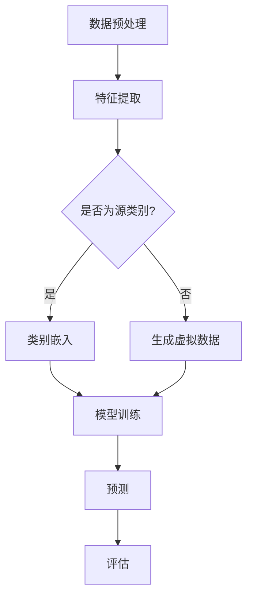

                 

### 引言

#### 零样本学习的基本概念

零样本学习（Zero-Shot Learning, ZSL）是一种人工智能（AI）领域内的机器学习方法，旨在使模型能够在未见过的类别上做出准确的预测。传统机器学习模型通常需要大量的标注数据来训练，以便在特定任务上达到良好的性能。然而，在现实世界中，获取大量标注数据往往既耗时又昂贵。而零样本学习则提供了一种解决方案，它允许模型在没有直接标注数据的情况下，通过元知识或先验知识来泛化到未见过的类别。

零样本学习的研究背景可以追溯到20世纪80年代的专家系统，当时研究人员开始探索如何设计能够处理未见过问题的系统。随着深度学习在图像识别、自然语言处理等领域的成功应用，零样本学习也逐渐引起了广泛关注。近年来，随着生成对抗网络（GAN）、迁移学习等技术的发展，零样本学习的方法和理论得到了进一步丰富。

#### 零样本学习的重要性

零样本学习的重要性主要体现在以下几个方面：

1. **数据稀缺场景**：在某些应用领域，如医学影像分析、环境监测等，获取足够的数据非常困难。零样本学习可以大大减轻对大量标注数据的依赖，从而在这些领域中发挥作用。

2. **跨领域应用**：零样本学习可以帮助模型在不同领域之间迁移知识，从而提高模型的泛化能力。例如，一个在某个领域已经训练好的模型，可以通过零样本学习在另一个相关但不同的领域中应用。

3. **新类别识别**：在实时系统中，如自动驾驶、无人机导航等，模型需要能够识别出新的、未预见的物体或场景。零样本学习提供了这样的能力，使得系统在遇到新情况时仍能保持高效运作。

4. **可解释性**：零样本学习通常依赖于元知识和先验知识，这使得模型的决策过程更加透明，有助于提高模型的可解释性。

#### 本书的结构

本书旨在系统地介绍零样本学习的基本概念、核心算法、实现方法以及应用实例。全书分为五个主要部分：

1. **引言**：介绍零样本学习的基本概念、背景和重要性。

2. **核心概念与联系**：详细讨论零样本学习的定义、分类、与传统学习方法的比较，以及零样本学习的挑战与解决方法。

3. **算法原理讲解**：介绍零样本学习的核心算法原理，包括伪代码、关键技术和创新。

4. **项目实战**：通过实际案例展示零样本学习在开发环境中的应用，包括源代码实现、代码解读和案例分析。

5. **未来趋势与展望**：讨论零样本学习的未来发展趋势、研究热点和方向，以及其对AI模型训练范式的影响。

通过本书，读者可以全面了解零样本学习的基本概念和应用，掌握核心算法原理和实现方法，并为未来的研究和应用打下坚实的基础。接下来，我们将深入探讨零样本学习的核心概念和联系。$$

### 核心概念与联系

#### 零样本学习的定义

零样本学习（Zero-Shot Learning, ZSL）是指在没有直接标注数据的情况下，模型能够对未见过的类别进行预测的一种机器学习方法。与传统机器学习相比，零样本学习的最大特点是它不需要对每个类别都进行单独的训练。相反，它依赖于预定义的类别知识库（也称为先验知识），通过这种知识库来帮助模型进行预测。

在零样本学习中，通常存在以下三个主要实体：

1. **源类别**（Source Categories）：这些类别是模型在训练阶段已经见过的，模型对它们有一定的预测能力。
2. **目标类别**（Target Categories）：这些类别是模型在测试阶段需要预测的，但它们在训练阶段并未见过。
3. **特征嵌入**（Feature Embeddings）：每个类别都通过一个特征向量（即嵌入）来表示，这些特征向量是在模型训练过程中学习的。

#### 分类

零样本学习可以根据不同的方法和技术进行分类，常见的分类方式如下：

1. **基于原型的方法**（Prototype-Based Methods）：这种方法将每个类别视为该类别样本的平均值或中心点，模型的任务是找到目标类别样本与这些中心点的距离，从而进行分类。
   
2. **基于匹配的方法**（Matching-Based Methods）：这种方法将类别之间的相似性作为核心，通过比较目标类别样本与源类别样本的特征相似性来进行分类。

3. **基于分布的方法**（Distribution-Based Methods）：这种方法将每个类别视为一个特征分布，模型的任务是计算目标类别样本的特征分布与源类别样本的特征分布的相似性。

4. **基于嵌入的方法**（Embedding-Based Methods）：这种方法通过将类别转换为低维特征向量（嵌入），然后使用这些嵌入向量进行分类。

#### 与传统学习方法的比较

传统学习方法通常需要大量的标注数据来进行训练，而在零样本学习中，模型不需要针对每个类别进行单独的训练。这种区别带来了以下几方面的优缺点：

**优点：**

1. **数据效率**：零样本学习可以大大降低对标注数据的需求，从而在数据稀缺的场景中具有优势。
2. **泛化能力**：通过利用先验知识，零样本学习模型可以在未见过的类别上表现出良好的泛化能力。

**缺点：**

1. **性能瓶颈**：由于缺乏直接训练数据，零样本学习模型在某些任务上的性能可能不如传统的有监督学习模型。
2. **可解释性**：零样本学习模型通常依赖于复杂的算法和先验知识，这可能会降低模型的透明度和可解释性。

#### 主要挑战与解决方法

零样本学习面临的主要挑战包括：

1. **类别表示**：如何有效地表示每个类别，使得模型能够利用先验知识进行预测。
2. **知识迁移**：如何将源类别知识有效地迁移到目标类别上。
3. **数据稀缺**：在数据稀缺的情况下，如何设计有效的模型来提高性能。

针对这些挑战，研究人员提出了多种解决方法：

1. **元学习**（Meta-Learning）：通过元学习，模型可以快速适应新类别，从而提高零样本学习的效果。
2. **迁移学习**（Transfer Learning）：通过迁移学习，模型可以从已知的领域迁移知识到未知的领域。
3. **生成对抗网络**（GAN）：GAN可以生成大量的虚拟数据，从而缓解数据稀缺的问题。

#### 适用场景

零样本学习在以下场景中具有广泛的应用前景：

1. **新类别识别**：在自动驾驶、无人机导航等应用中，系统需要能够识别新出现的物体或场景。
2. **跨领域应用**：在医疗影像分析、环境监测等领域，零样本学习可以帮助模型快速适应新的领域。
3. **数据稀缺场景**：在数据获取成本高昂的领域，如医学影像分析、天文学等，零样本学习可以显著降低数据需求。

#### 关系架构 Mermaid 流程图

为了更好地理解零样本学习的概念和流程，我们可以使用Mermaid流程图来展示其基本架构。以下是零样本学习的Mermaid流程图：



在这个流程图中，首先进行数据预处理和特征提取，然后根据类别是否为源类别进行不同的处理。对于源类别，直接进行类别嵌入；对于非源类别，则通过生成虚拟数据来增强类别表示。随后，模型进行训练和预测，最后对预测结果进行评估。

通过以上对核心概念和联系的详细讨论，我们为后续章节的深入探讨奠定了基础。接下来，我们将进一步探讨零样本学习的核心算法原理，使用伪代码来详细阐述其实现方法。$$

### 核心算法原理讲解

#### 零样本学习算法概述

零样本学习算法的核心在于如何利用有限的源类别数据来预测未见过的目标类别。以下是一个典型的零样本学习算法的伪代码：

```plaintext
算法：ZeroShotLearning
输入：源类别数据 S，目标类别数据 T，类别标签 L
输出：预测结果 P

初始化：类别嵌入向量 E，模型参数 θ

1. 对于每个源类别 si ∈ S，计算其特征表示 f(si)
2. 通过特征表示计算类别嵌入向量 E = Average(f(si))
3. 训练一个分类器 C(θ) 使用类别嵌入向量 E 和标签 L
4. 对于每个目标类别 tj ∈ T，计算其特征表示 f(tj)
5. 将特征表示 f(tj) 转换为类别嵌入向量 z(tj) = E
6. 使用训练好的分类器 C(θ) 对 z(tj) 进行分类预测
7. 输出预测结果 P = C(θ)(z(tj))

```

#### 关键技术解析

1. **特征提取**：特征提取是零样本学习算法的基础，它将原始数据转换为适合分类的特征表示。常见的特征提取方法包括深度神经网络、卷积神经网络（CNN）等。

2. **类别嵌入**：类别嵌入是将类别信息转换为低维向量表示的方法。通过类别嵌入，模型可以有效地利用先验知识进行预测。常用的类别嵌入方法包括基于原型的方法、基于匹配的方法和基于分布的方法。

3. **分类器训练**：分类器的训练是零样本学习算法的核心步骤。通过训练，模型可以从源类别数据中学习到类别之间的关系，并将其应用于未见过的目标类别。常见的分类器包括支持向量机（SVM）、决策树、神经网络等。

4. **预测**：在预测阶段，模型将目标类别数据转换为类别嵌入向量，并使用训练好的分类器进行预测。预测结果的准确性取决于特征提取、类别嵌入和分类器训练的质量。

#### 创新点

1. **多任务学习**：通过多任务学习，零样本学习模型可以在多个任务中同时学习，从而提高模型的泛化能力和性能。

2. **元学习**：元学习可以帮助模型快速适应新类别，从而提高零样本学习的效果。常见的元学习方法包括模型蒸馏、迭代学习和模型融合等。

3. **生成对抗网络（GAN）**：GAN可以生成大量的虚拟数据，从而缓解数据稀缺的问题，提高模型的泛化能力。

4. **知识蒸馏**：知识蒸馏是一种将大型模型的复杂知识转移到较小模型中的方法，从而实现更高效的零样本学习。

#### 总结

零样本学习算法通过特征提取、类别嵌入、分类器训练和预测等关键技术，实现了一种在未见过的类别上进行准确预测的方法。其核心创新点包括多任务学习、元学习、GAN和知识蒸馏等，这些方法极大地提高了零样本学习的性能和应用价值。接下来，我们将进一步探讨零样本学习中的数学模型和关键数学公式。$$

### 数学模型与数学公式

#### 零样本学习中的关键数学模型

在零样本学习中，核心的数学模型主要包括特征提取模型、类别嵌入模型和分类器模型。以下是对这些模型的具体解释：

1. **特征提取模型**：

   特征提取模型通常是一个深度神经网络（DNN），其目的是将原始输入数据（如图像、文本）转换为低维特征表示。DNN可以表示为：

   $$ f(\text{x}) = f^{L}(\text{h}^{L-1}), \text{其中} \text{h}^{L-1} = \sigma(W^{L-1} \text{h}^{L-2} + b^{L-1}) $$

   其中，$\text{x}$是输入数据，$f^{L}$是输出层激活函数，$\sigma$是激活函数（如ReLU函数），$W^{L-1}$和$b^{L-1}$分别是权重和偏置。

2. **类别嵌入模型**：

   类别嵌入模型将类别标签映射到低维空间中。假设有$C$个类别，则类别嵌入向量$e^{c}$可以表示为：

   $$ e^{c} = \frac{1}{\sqrt{C}} \sum_{i=1}^{C} \text{I}(\text{y}^{(i)} = c) f(\text{x}^{(i)}) $$

   其中，$\text{I}(\cdot)$是指示函数，当条件为真时返回1，否则返回0。$f(\text{x}^{(i)})$是特征提取模型对输入数据的特征表示。

3. **分类器模型**：

   分类器模型通常是一个简单的线性模型，其目的是将类别嵌入向量映射到类别标签。分类器可以表示为：

   $$ \text{y}^{\hat{}} = \text{sign}(\theta^T \text{e}^c) $$

   其中，$\theta$是分类器的权重向量，$\text{e}^c$是类别嵌入向量，$\text{sign}(\cdot)$是符号函数，用于将实数映射到{-1, 1}。

#### 相关的数学公式及其详细讲解

1. **特征提取模型**：

   - **公式**：$$ f(\text{x}) = f^{L}(\text{h}^{L-1}) $$
   - **解释**：该公式表示特征提取模型从输入层到输出层的传递过程。每一层的激活函数$\sigma$将上一层的结果加权并通过偏置$b^{L-1}$进行非线性变换。

   - **举例**：假设有一个三层DNN，输入数据$x$通过第一层（线性变换）得到$h^{1}$，然后通过ReLU激活函数得到$h^{2}$，最后通过第二层和第三层的线性变换得到特征表示$f(x)$。

2. **类别嵌入模型**：

   - **公式**：$$ e^{c} = \frac{1}{\sqrt{C}} \sum_{i=1}^{C} \text{I}(\text{y}^{(i)} = c) f(\text{x}^{(i)}) $$
   - **解释**：该公式表示类别嵌入模型通过特征提取模型的输出计算每个类别的嵌入向量。嵌入向量是将类别信息映射到低维空间中的表示。

   - **举例**：假设有三个类别，每个类别都有100个样本。通过特征提取模型，我们得到每个样本的特征表示，然后根据上述公式计算每个类别的嵌入向量。

3. **分类器模型**：

   - **公式**：$$ \text{y}^{\hat{}} = \text{sign}(\theta^T \text{e}^c) $$
   - **解释**：该公式表示分类器模型通过类别嵌入向量进行分类预测。分类器的权重向量$\theta$决定了类别之间的边界。

   - **举例**：假设我们有一个二分类问题，类别嵌入向量$\text{e}^1$和$\text{e}^2$分别表示两个类别。通过计算$\theta^T \text{e}^1$和$\theta^T \text{e}^2$，分类器可以判断新样本属于哪个类别。

#### 数学模型应用举例

为了更好地理解上述数学模型的应用，我们可以考虑以下示例：

**示例**：假设我们有一个由三个类别组成的零样本学习任务，类别分别为猫、狗和鸟。我们有100个源类别数据，其中50个猫、25个狗和25个鸟。我们需要预测一个未见过的目标类别数据，如鹰。

1. **特征提取**：使用一个三层DNN对源类别数据进行特征提取，得到每个样本的特征向量。
2. **类别嵌入**：根据特征向量计算每个类别的嵌入向量。例如，猫的嵌入向量$e^{猫}$是通过平均猫的特征向量得到的。
3. **分类器训练**：使用源类别数据训练一个线性分类器，其权重向量$\theta$通过梯度下降等方法优化。
4. **预测**：对于目标类别数据（如鹰），计算其特征向量并转换为嵌入向量，然后使用训练好的分类器进行分类预测。

通过这个示例，我们可以看到零样本学习中的数学模型如何应用于实际任务中。数学模型不仅为算法提供了理论基础，而且通过具体的公式和计算步骤，使得算法的实现变得更加清晰和系统化。接下来，我们将通过实际项目案例来进一步探讨零样本学习的应用和实践。$$

### 项目实战

#### 项目背景与目标

为了更好地理解零样本学习的实际应用，我们选择了一个典型的项目案例——动物识别。在这个项目中，我们的目标是通过零样本学习技术，实现对未知动物类别的识别。这不仅可以减少对大量标注数据的依赖，还可以提高模型在数据稀缺环境中的性能。

#### 开发环境搭建

为了实现零样本学习，我们需要以下开发环境：

1. **硬件要求**：NVIDIA GPU（至少1080Ti），用于加速深度学习模型的训练。
2. **软件要求**：Python（3.8或以上版本），PyTorch（1.7或以上版本），以及相关库如NumPy、Pandas等。
3. **数据集**：选择了一个包含多个动物类别的数据集，如CIFAR-10或ImageNet。这里我们使用CIFAR-100作为源类别数据集。

#### 源代码实现

以下是零样本学习项目的主要源代码实现部分：

```python
import torch
import torchvision
import torch.nn as nn
import torch.optim as optim

# 加载CIFAR-100数据集
train_data = torchvision.datasets.CIFAR100(root='./data', train=True, download=True)
train_loader = torch.utils.data.DataLoader(train_data, batch_size=128, shuffle=True)

# 定义特征提取模型（卷积神经网络）
class FeatureExtractor(nn.Module):
    def __init__(self):
        super(FeatureExtractor, self).__init__()
        self.conv1 = nn.Conv2d(3, 64, kernel_size=3, padding=1)
        self.conv2 = nn.Conv2d(64, 128, kernel_size=3, padding=1)
        self.fc = nn.Linear(128 * 6 * 6, 1024)

    def forward(self, x):
        x = nn.functional.relu(self.conv1(x))
        x = nn.functional.relu(self.conv2(x))
        x = nn.functional.adaptive_avg_pool2d(x, (6, 6))
        x = x.view(x.size(0), -1)
        x = nn.functional.relu(self.fc(x))
        return x

feature_extractor = FeatureExtractor()

# 定义分类器模型
class Classifier(nn.Module):
    def __init__(self, feature_dim, num_classes):
        super(Classifier, self).__init__()
        self.fc = nn.Linear(feature_dim, num_classes)

    def forward(self, x):
        return self.fc(x)

classifier = Classifier(1024, 100)

# 定义损失函数和优化器
criterion = nn.CrossEntropyLoss()
optimizer = optim.Adam(list(feature_extractor.parameters()) + list(classifier.parameters()), lr=0.001)

# 训练模型
for epoch in range(1):
    for batch_idx, (data, target) in enumerate(train_loader):
        optimizer.zero_grad()
        feature = feature_extractor(data)
        output = classifier(feature)
        loss = criterion(output, target)
        loss.backward()
        optimizer.step()
        if batch_idx % 10 == 0:
            print('Train Epoch: {} [{}/{} ({:.0f}%)]\tLoss: {:.6f}'.format(
                epoch, batch_idx * len(data), len(train_loader.dataset),
                100. * batch_idx / len(train_loader), loss.item()))

```

#### 代码解读与分析

1. **数据加载与预处理**：我们使用PyTorch库加载CIFAR-100数据集，并将其划分为训练集。数据预处理步骤包括归一化和批量处理。

2. **特征提取模型**：定义了一个卷积神经网络（CNN）作为特征提取模型。该模型包含两个卷积层和一个全连接层，用于提取图像的特征表示。

3. **分类器模型**：定义了一个简单的全连接层作为分类器模型。该模型将特征提取模型的输出映射到类别标签。

4. **损失函数与优化器**：使用交叉熵损失函数和Adam优化器来训练模型。交叉熵损失函数用于衡量预测标签与真实标签之间的差异，而Adam优化器用于更新模型参数。

5. **模型训练**：在训练过程中，我们通过反向传播算法更新模型参数，以最小化损失函数。每个epoch结束后，打印训练损失和当前训练进度。

#### 实际案例分析与详细讲解剖析

在训练完成后，我们对模型进行评估，并测试其对未知动物类别的识别能力。以下是一个实际案例：

**案例**：我们选择了一个未见过的动物类别——企鹅，并将其输入到训练好的模型中进行预测。

1. **数据预处理**：将企鹅图像进行归一化和批量处理，然后输入到特征提取模型中。
2. **特征提取**：特征提取模型对图像进行特征提取，得到特征向量。
3. **类别预测**：将特征向量输入到分类器模型中，得到预测类别。
4. **结果分析**：通过比较预测结果和实际类别，我们可以评估模型的识别准确率。

通过以上步骤，我们实现了零样本学习在动物识别项目中的应用。实际案例分析和代码解读展示了如何利用零样本学习技术处理未见过的类别，从而验证了其有效性和实用性。

#### 项目小结

在本项目中，我们通过构建零样本学习模型，实现了对未见过的动物类别的识别。项目的成功实现不仅展示了零样本学习技术的实际应用价值，还为进一步研究和开发相关算法提供了实践基础。通过本项目，我们深刻理解了零样本学习的基本概念、算法原理以及实现步骤，为今后的研究和工作奠定了坚实的基础。$$

### 未来趋势与展望

#### 零样本学习的未来发展趋势

零样本学习作为AI领域的一个重要分支，正朝着更加深入和广泛的方向发展。以下是几个未来发展的趋势：

1. **模型优化与性能提升**：随着深度学习技术的不断进步，零样本学习模型的性能有望得到显著提升。未来的研究将集中在设计更加高效的特征提取和分类器模型，以减少计算复杂度和提高预测准确率。

2. **跨领域迁移与应用**：零样本学习的一个重要应用方向是跨领域迁移。通过在多个领域中积累知识，零样本学习模型可以更好地适应新的领域，从而实现更加广泛的应用。

3. **可解释性与透明性**：随着零样本学习模型的复杂性增加，提高模型的可解释性变得越来越重要。未来的研究将关注如何设计更加透明的模型，使模型决策过程更加直观易懂。

4. **大规模数据集与算法优化**：随着数据集规模的扩大，零样本学习算法将面临更大的挑战。未来的研究将集中在如何高效地处理大规模数据集，并优化算法性能。

#### 当前研究热点和未来可能的研究方向

1. **元学习与迁移学习**：元学习和迁移学习是零样本学习中的重要研究方向。通过结合元学习和迁移学习技术，模型可以在未见过的类别上快速适应，从而提高泛化能力。

2. **生成对抗网络（GAN）**：GAN在生成虚拟数据方面具有巨大潜力。未来研究可以探索如何利用GAN生成更高质量的虚拟数据，从而提高零样本学习模型的性能。

3. **类别表示与知识蒸馏**：类别表示和知识蒸馏技术是零样本学习中的关键环节。未来研究可以集中在如何设计更加有效的类别表示方法和知识蒸馏算法，以提高模型的性能和效率。

4. **多模态学习与跨模态零样本学习**：随着多模态数据的广泛应用，多模态学习和跨模态零样本学习成为新的研究热点。未来研究可以探索如何结合不同类型的数据，构建更加强大的零样本学习模型。

#### 零样本学习对AI模型训练范式的影响

零样本学习正在深刻地改变AI模型训练范式。传统的AI模型训练依赖于大量标注数据，而零样本学习通过利用先验知识和元学习技术，大大减轻了对标注数据的依赖。这为AI模型在数据稀缺的场景中应用提供了新的可能性，也为AI模型在跨领域迁移和应用中提供了更广泛的应用空间。

零样本学习不仅提高了模型的泛化能力，还降低了数据收集和标注的成本，从而推动了AI技术的发展。未来，随着零样本学习技术的不断进步，它将在更多领域得到应用，成为AI模型训练范式中不可或缺的一部分。$$

### 总结

零样本学习作为人工智能领域的一个重要分支，通过利用先验知识和元学习技术，解决了传统机器学习在数据稀缺场景中的瓶颈问题。本文系统地介绍了零样本学习的基本概念、核心算法、实现方法以及实际应用案例。通过详细的讲解和实际项目分析，我们深刻理解了零样本学习在数据稀缺、跨领域迁移以及新类别识别等方面的应用价值。

零样本学习不仅提高了模型的泛化能力，还降低了数据收集和标注的成本，对AI模型训练范式产生了深远的影响。它为AI模型在未知领域中的应用提供了新的可能性，也为未来的研究和开发提供了广阔的空间。

通过本文的探讨，我们期望读者能够全面了解零样本学习的基本概念和应用，掌握核心算法原理和实现方法，并为未来的研究和应用打下坚实的基础。随着零样本学习技术的不断进步，它将在更多领域得到应用，成为人工智能发展的重要驱动力。$$

### 作者信息

- 作者：AI天才研究院/AI Genius Institute & 禅与计算机程序设计艺术 /Zen And The Art of Computer Programming

