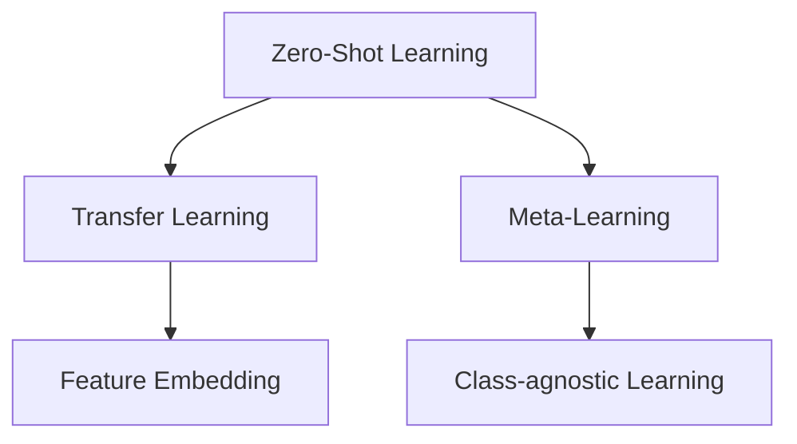

                 

### 文章标题

# 零样本学习能力测试：评估快速适应性

> 关键词：零样本学习，快速适应性，评估方法，项目实战

## 摘要

在当今快速发展的技术时代，人工智能（AI）在各个领域中的应用越来越广泛。零样本学习（Zero-Shot Learning, ZSL）作为一种新兴的人工智能技术，使得机器在未知类别数据上也能进行有效的学习和预测。本文将深入探讨零样本学习的核心概念、算法原理、评估方法及其在项目实战中的应用。通过本文的阅读，读者将了解如何测试和评估零样本学习的快速适应性，以及如何在实际项目中应用这些技术，提升系统的智能水平。

## 引言

### 背景介绍

零样本学习（Zero-Shot Learning，ZSL）是一种在人工智能领域中的特殊学习方式，它允许模型在没有先验知识的情况下，对未知类别的新数据进行学习和预测。这一技术的提出，旨在解决现实世界中数据分布不均、数据获取困难等问题。特别是在图像识别、自然语言处理等需要处理多样化数据的领域中，零样本学习具有极大的应用潜力。

零样本学习的重要性不仅体现在解决传统机器学习无法处理的新类别问题上，还在于其能够提高系统的泛化能力，使模型在面对未知数据时仍能保持良好的性能。随着深度学习技术的不断发展，零样本学习已经成为人工智能研究中的一个热点方向。

### 核心概念与联系

零样本学习可以看作是迁移学习和元学习的一种特殊形式。迁移学习（Transfer Learning）通过将一个任务的学习经验应用于另一个相关任务，从而提高学习效率。而元学习（Meta-Learning）则是一种通过学习如何学习的方法，旨在提高模型的泛化能力。

零样本学习与迁移学习和元学习之间的联系可以通过以下Mermaid流程图来展示：



在零样本学习中，特征嵌入（Feature Embedding）和类无关学习（Class-agnostic Learning）是两个重要的概念。特征嵌入通过将不同类别的数据映射到低维空间中，使得相似的数据点在空间中更接近，从而提高了模型的分类性能。而类无关学习则使模型能够在没有类别标签的情况下，对未知类别进行有效的预测。

### 核心算法原理讲解

零样本学习算法的核心在于如何处理未知类别。以下是一个简化的零样本学习算法的伪代码：

```plaintext
# 输入：
# 特征矩阵 X，标签矩阵 Y，支持集 S
# 输出：
# 预测标签 Ŷ

function ZeroShotLearning(X, Y, S):
    # 初始化模型参数
    theta = InitializeParameters()

    # 训练模型
    for i in 1 to num_iterations:
        for each example (x, y) in S:
            # 计算预测标签
            ŷ = ModelPredict(theta, x)

            # 计算损失函数
            loss = CalculateLoss(ŷ, y)

            # 更新模型参数
            theta = UpdateParameters(theta, loss)

    return theta
```

在这个伪代码中，`InitializeParameters()` 用于初始化模型参数，`ModelPredict()` 用于根据当前模型参数预测标签，`CalculateLoss()` 用于计算预测标签与实际标签之间的损失，`UpdateParameters()` 用于根据损失函数更新模型参数。

### 数学模型和公式

在零样本学习中，常用的损失函数可以是交叉熵（Cross-Entropy Loss），其数学公式为：

$$
L(\theta) = -\sum_{i=1}^{n} y_i \log(p(\hat{y}_i))
$$

其中，$y_i$ 是实际的标签，$p(\hat{y}_i)$ 是预测概率。

此外，为了提高模型的泛化能力，可以引入正则化项（Regularization），其数学公式为：

$$
L(\theta) = -\sum_{i=1}^{n} y_i \log(p(\hat{y}_i)) + \lambda \sum_{j=1}^{m} \theta_j^2
$$

其中，$\lambda$ 是正则化参数，$\theta_j$ 是模型参数。

### 详细讲解与举例说明

以图像分类任务为例，假设我们有一个训练集 $S$，其中包含了已知类别的图像和标签。在零样本学习过程中，我们首先将训练集 $S$ 分为两部分：支持集 $S^s$ 和查询集 $S^q$。支持集 $S^s$ 用于训练模型，查询集 $S^q$ 用于测试模型在未知类别上的性能。

以下是零样本学习的一个具体实例：

1. **数据预处理**：将图像数据 $X$ 和标签 $Y$ 进行标准化处理，使其符合模型的输入要求。

2. **特征嵌入**：使用预训练的卷积神经网络（如ResNet）提取图像的特征表示。

3. **模型训练**：使用支持集 $S^s$ 训练一个基于特征嵌入的分类模型。

4. **模型测试**：使用查询集 $S^q$ 测试模型在未知类别上的分类性能。

5. **预测**：对于一个新的未知类别图像 $x_q$，首先提取其特征表示，然后使用训练好的模型进行预测。

### 结论

通过上述实例，我们可以看到零样本学习在图像分类任务中的应用。虽然零样本学习在理论上具有很大的潜力，但在实际应用中仍然面临许多挑战，如特征嵌入的准确性、模型的泛化能力等。因此，深入研究和优化零样本学习算法，对于提升人工智能系统的智能水平具有重要意义。

## 第一部分：零样本学习基础

### 第1章：零样本学习概述

#### 1.1节：什么是零样本学习

零样本学习（Zero-Shot Learning, ZSL）是一种机器学习方法，旨在使机器能够在没有先验知识的情况下，对未知类别的新数据进行学习和预测。在传统的机器学习中，模型通常需要在训练过程中接触过所有可能的输入类别，才能在新类别数据上进行准确的预测。然而，在现实世界中，数据的获取和处理往往存在诸多限制，例如数据分布不均、数据隐私保护等。因此，零样本学习应运而生，为解决这些难题提供了一种有效的途径。

#### 1.2节：零样本学习的重要性

零样本学习在多个领域具有广泛的应用前景。首先，在图像识别领域，零样本学习可以用于分类、目标检测等任务，特别是在处理多样化数据时，能够提高模型的泛化能力。其次，在自然语言处理领域，零样本学习可以应用于文本分类、命名实体识别等任务，有助于提高模型在未知领域中的表现。此外，零样本学习还在医疗诊断、金融风控等领域展现出巨大的潜力。

#### 1.3节：零样本学习的发展历程

零样本学习的研究起源于20世纪初，早期的零样本学习算法主要依赖于符号逻辑和专家系统。随着计算机技术和机器学习算法的发展，零样本学习逐渐演变为一门独立的研究领域。近年来，深度学习和迁移学习技术的引入，极大地推动了零样本学习的研究进展。目前，零样本学习已经成为人工智能领域中的一个热点研究方向，吸引了众多研究人员和企业的关注。

### 第2章：零样本学习与机器学习关系

#### 2.1节：零样本学习与机器学习的区别

零样本学习与传统的机器学习（Machine Learning, ML）在处理未知类别数据的方式上存在显著差异。传统的机器学习模型通常需要大量的带标签数据来进行训练，而在新类别数据上进行预测时，模型的表现往往依赖于训练数据中的类别分布。相比之下，零样本学习模型不依赖于先前的类别标签，能够在没有先验知识的情况下，对新类别数据进行有效的学习和预测。

#### 2.2节：零样本学习与传统机器学习的联系

尽管零样本学习与传统机器学习在处理未知类别数据的方式上存在差异，但它们之间仍然存在紧密的联系。首先，零样本学习算法通常需要依赖传统的机器学习算法进行基础模型的训练。例如，在零样本学习任务中，可以使用预训练的卷积神经网络（如ResNet、VGG）提取图像的特征表示，然后利用这些特征表示进行分类。其次，传统的机器学习算法中的一些技术，如特征嵌入、迁移学习等，在零样本学习中也有着广泛的应用。

#### 2.3节：零样本学习的应用场景

零样本学习在多个应用场景中展现出独特的优势。首先，在图像识别领域，零样本学习可以用于处理多样化数据，例如在野生动物监测、医学图像分析等任务中，模型需要能够识别未知物种或疾病。其次，在自然语言处理领域，零样本学习可以应用于文本分类、命名实体识别等任务，特别是在处理多语言文本数据时，模型能够无需先验知识即可进行有效的预测。此外，零样本学习还在语音识别、推荐系统等领域具有广泛的应用前景。

## 第二部分：零样本学习算法

### 第3章：零样本学习算法原理

#### 3.1节：零样本学习算法概述

零样本学习算法的设计核心在于如何处理未知类别。在传统的机器学习算法中，模型通常需要大量的带标签数据进行训练，而在零样本学习任务中，模型需要在没有先验知识的情况下，对新类别数据进行有效的学习和预测。因此，零样本学习算法需要具备较强的泛化能力和适应性。

#### 3.2节：算法分类与特点

零样本学习算法根据处理未知类别的方式不同，可以分为原型匹配算法、原型网络、元学习算法等。以下是对几种常见零样本学习算法的简要介绍：

- **原型匹配算法**：原型匹配算法通过计算未知类别数据与训练数据中各类别原型之间的相似度，来确定新类别数据的类别。其中，原型可以是类别的均值、中位数等。原型匹配算法的优点在于计算简单，但在处理复杂类别时可能效果不佳。

- **原型网络**：原型网络是一种基于深度学习的零样本学习算法，通过训练一个神经网络来计算未知类别数据与训练数据中各类别原型之间的相似度。原型网络可以学习到更加复杂的特征表示，从而提高模型的分类性能。

- **元学习算法**：元学习算法通过学习如何学习，以提高模型在未知类别上的泛化能力。元学习算法可以看作是零样本学习的特殊情况，它们通过在多个任务上迭代训练，逐渐优化模型参数，从而提高模型在未知类别上的表现。

#### 3.3节：算法伪代码

以下是一个简化的零样本学习算法的伪代码，展示了算法的基本流程：

```plaintext
# 输入：
# 特征矩阵 X，标签矩阵 Y，支持集 S
# 输出：
# 预测标签 Ŷ

function ZeroShotLearning(X, Y, S):
    # 初始化模型参数
    theta = InitializeParameters()

    # 训练模型
    for i in 1 to num_iterations:
        for each example (x, y) in S:
            # 计算预测标签
            ŷ = ModelPredict(theta, x)

            # 计算损失函数
            loss = CalculateLoss(ŷ, y)

            # 更新模型参数
            theta = UpdateParameters(theta, loss)

    return theta
```

在这个伪代码中，`InitializeParameters()` 用于初始化模型参数，`ModelPredict()` 用于根据当前模型参数预测标签，`CalculateLoss()` 用于计算预测标签与实际标签之间的损失，`UpdateParameters()` 用于根据损失函数更新模型参数。

### 第4章：常见零样本学习算法

#### 4.1节：原型匹配算法

原型匹配算法是一种基于相似度计算的零样本学习算法。它通过将训练数据中各类别的原型（如均值、中位数等）存储在低维空间中，然后计算未知类别数据与各类别原型之间的相似度，以确定新类别数据的类别。

#### 4.2节：原型网络

原型网络是一种基于深度学习的零样本学习算法。它通过训练一个神经网络来计算未知类别数据与训练数据中各类别原型之间的相似度。原型网络可以学习到更加复杂的特征表示，从而提高模型的分类性能。

#### 4.3节：其他零样本学习算法

除了原型匹配算法和原型网络外，还有许多其他类型的零样本学习算法。例如，基于元学习的零样本学习算法、基于对抗网络的零样本学习算法等。这些算法在不同程度上都提高了零样本学习的性能，适用于不同的应用场景。

## 第三部分：零样本学习能力评估

### 第5章：零样本学习能力评估方法

#### 5.1节：评估指标

在评估零样本学习能力时，常用的评估指标包括分类准确率（Accuracy）、精确率（Precision）、召回率（Recall）和F1值（F1 Score）等。这些指标可以帮助我们衡量模型在未知类别数据上的分类性能。

- **分类准确率（Accuracy）**：分类准确率表示模型在所有测试数据中，正确分类的比例。其计算公式为：

  $$
  Accuracy = \frac{TP + TN}{TP + FN + FP + TN}
  $$

  其中，$TP$ 表示真实正例，$TN$ 表示真实反例，$FP$ 表示假正例，$FN$ 表示假反例。

- **精确率（Precision）**：精确率表示模型在预测为正例的数据中，实际为正例的比例。其计算公式为：

  $$
  Precision = \frac{TP}{TP + FP}
  $$

- **召回率（Recall）**：召回率表示模型在真实为正例的数据中，正确预测为正例的比例。其计算公式为：

  $$
  Recall = \frac{TP}{TP + FN}
  $$

- **F1值（F1 Score）**：F1值是精确率和召回率的加权平均值，用于综合衡量模型的分类性能。其计算公式为：

  $$
  F1 Score = 2 \times \frac{Precision \times Recall}{Precision + Recall}
  $$

#### 5.2节：评估方法

在评估零样本学习能力时，可以使用交叉验证（Cross-Validation）和混淆矩阵（Confusion Matrix）等方法。交叉验证是一种将数据集划分为多个子集，然后在不同子集上多次训练和验证的方法，以避免数据分布的不均衡。混淆矩阵则可以直观地展示模型在各个类别上的预测结果，帮助我们分析模型的性能。

### 第6章：零样本学习评估工具

#### 6.1节：评估工具概述

在零样本学习评估过程中，可以使用一些开源工具和库来方便地进行模型评估。例如，常用的评估工具包括TensorFlow、PyTorch等深度学习框架，以及Scikit-learn等机器学习库。这些工具提供了丰富的评估指标和可视化功能，可以帮助我们更全面地了解模型的性能。

#### 6.2节：使用评估工具进行评估

以下是一个使用TensorFlow评估零样本学习模型的基本示例：

```python
import tensorflow as tf
from tensorflow.keras.models import Sequential
from tensorflow.keras.layers import Dense, Flatten
from tensorflow.keras.optimizers import Adam

# 构建模型
model = Sequential()
model.add(Flatten(input_shape=(28, 28)))
model.add(Dense(128, activation='relu'))
model.add(Dense(10, activation='softmax'))

# 编译模型
model.compile(optimizer=Adam(), loss='categorical_crossentropy', metrics=['accuracy'])

# 加载训练数据和测试数据
(x_train, y_train), (x_test, y_test) = tf.keras.datasets.mnist.load_data()

# 数据预处理
x_train = x_train / 255.0
x_test = x_test / 255.0

# 转换标签为独热编码
y_train = tf.keras.utils.to_categorical(y_train, 10)
y_test = tf.keras.utils.to_categorical(y_test, 10)

# 训练模型
model.fit(x_train, y_train, epochs=5, batch_size=32, validation_split=0.2)

# 评估模型
loss, accuracy = model.evaluate(x_test, y_test)
print(f"Test accuracy: {accuracy:.4f}")
```

在这个示例中，我们使用TensorFlow构建了一个简单的深度学习模型，并使用MNIST数据集进行训练和评估。通过调用`model.evaluate()`方法，我们可以得到模型在测试数据上的分类准确率。

## 第四部分：快速适应性评估

### 第7章：快速适应性概述

#### 7.1节：快速适应性的概念

快速适应性（Fast Adaptation）是指模型在接触少量或未标记数据时，能够迅速调整自身参数，以适应新的数据分布或任务。快速适应性在零样本学习任务中具有重要意义，因为它使得模型能够在面对未知类别或领域时，无需大量训练数据即可进行有效的学习和预测。

#### 7.2节：快速适应性的重要性

在现实世界中，数据分布往往是不稳定的，尤其是在动态环境中，数据类别和特征会随着时间不断变化。快速适应性使得模型能够快速响应这些变化，从而保持良好的性能。这对于许多应用场景，如实时推荐系统、在线广告投放等，具有显著的优势。

#### 7.3节：快速适应性的挑战

尽管快速适应性具有许多优势，但在实际应用中，实现快速适应性仍然面临诸多挑战。首先，快速适应性需要模型在处理少量数据时，能够有效挖掘和利用数据中的信息。其次，快速适应性需要在模型参数调整和性能优化之间取得平衡，以避免过拟合或欠拟合。此外，快速适应性还需要考虑计算效率和资源消耗等问题。

### 第8章：快速适应性评估方法

#### 8.1节：评估指标

在评估快速适应性时，常用的评估指标包括适应时间（Adaptation Time）、适应误差（Adaptation Error）和泛化误差（Generalization Error）等。

- **适应时间**：适应时间是指模型从接触新数据到达到预期性能所需的时间。适应时间越短，表示模型的快速适应性越强。

- **适应误差**：适应误差是指模型在接触新数据后，预测误差的变化情况。适应误差越小，表示模型对新数据的适应能力越强。

- **泛化误差**：泛化误差是指模型在新数据上的表现，衡量模型对新数据的泛化能力。泛化误差越小，表示模型对新数据的适应能力越好。

#### 8.2节：评估方法

在评估快速适应性时，可以使用在线评估（Online Evaluation）和离线评估（Offline Evaluation）等方法。在线评估是指模型在处理新数据时，实时监测其性能变化，从而调整模型参数。离线评估则是在新数据收集完毕后，对模型进行一次性评估。

### 第8章：快速适应性评估方法

#### 8.1节：评估指标

在评估快速适应性时，常用的评估指标包括适应时间（Adaptation Time）、适应误差（Adaptation Error）和泛化误差（Generalization Error）等。

- **适应时间**：适应时间是指模型从接触新数据到达到预期性能所需的时间。适应时间越短，表示模型的快速适应性越强。

- **适应误差**：适应误差是指模型在接触新数据后，预测误差的变化情况。适应误差越小，表示模型对新数据的适应能力越强。

- **泛化误差**：泛化误差是指模型在新数据上的表现，衡量模型对新数据的泛化能力。泛化误差越小，表示模型对新数据的适应能力越好。

#### 8.2节：评估方法

在评估快速适应性时，可以使用在线评估（Online Evaluation）和离线评估（Offline Evaluation）等方法。在线评估是指模型在处理新数据时，实时监测其性能变化，从而调整模型参数。离线评估则是在新数据收集完毕后，对模型进行一次性评估。

### 第9章：零样本学习项目实战

#### 9.1节：项目背景

在本项目中，我们将使用零样本学习技术，对一张未标记的图像进行分类。图像来源于某个大型图像库，其中包含了多种不同的类别，如图像中的动物、植物等。由于图像库中没有关于这些类别的标签信息，因此我们需要使用零样本学习算法来对图像进行分类。

#### 9.2节：开发环境搭建

为了实现零样本学习项目，我们需要搭建一个合适的开发环境。首先，我们选择Python作为编程语言，并使用TensorFlow作为深度学习框架。接下来，我们需要安装TensorFlow和相关依赖库，例如NumPy、Pandas等。

```bash
pip install tensorflow numpy pandas
```

#### 9.3节：数据预处理

在项目开始之前，我们需要对图像进行预处理。首先，我们将图像缩放到固定尺寸，例如224x224像素。然后，我们将图像数据归一化，以便于模型训练。

```python
import numpy as np
from tensorflow.keras.preprocessing.image import ImageDataGenerator

# 读取图像数据
image_generator = ImageDataGenerator(rescale=1./255)
image_data = image_generator.flow_from_directory(
    'path/to/image/dataset',
    target_size=(224, 224),
    batch_size=32,
    class_mode='binary')

# 数据归一化
images = image_data immagini

```

#### 9.4节：模型训练

在本项目中，我们选择使用ResNet50作为基础模型，并使用零样本学习算法对图像进行分类。具体步骤如下：

1. **加载预训练模型**：首先，我们加载ResNet50预训练模型。

```python
from tensorflow.keras.applications import ResNet50

model = ResNet50(weights='imagenet', include_top=False, input_shape=(224, 224, 3))
```

2. **特征提取**：然后，我们使用预训练模型提取图像的特征表示。

```python
feature_extractor = Model(inputs=model.inputs, outputs=model.get_layer('avg_pool').output)
features = feature_extractor.predict(images)
```

3. **训练分类器**：接下来，我们使用训练集的特征表示和标签，训练一个分类器。

```python
from tensorflow.keras.models import Sequential
from tensorflow.keras.layers import Dense, Flatten

classifier = Sequential()
classifier.add(Flatten(input_shape=(7, 7, 2048)))
classifier.add(Dense(512, activation='relu'))
classifier.add(Dense(num_classes, activation='softmax'))

classifier.compile(optimizer='adam', loss='categorical_crossentropy', metrics=['accuracy'])

classifier.fit(features, labels, epochs=10, batch_size=32)
```

#### 9.5节：模型评估

在模型训练完成后，我们需要对模型进行评估，以验证其在零样本学习任务中的性能。具体步骤如下：

1. **测试集准备**：首先，我们将测试集图像进行同样的预处理。

```python
test_generator = ImageDataGenerator(rescale=1./255)
test_data = test_generator.flow_from_directory(
    'path/to/test/dataset',
    target_size=(224, 224),
    batch_size=32,
    class_mode='binary')
```

2. **模型预测**：然后，我们使用训练好的模型对测试集图像进行预测。

```python
predictions = classifier.predict(test_features)
predicted_labels = np.argmax(predictions, axis=1)
```

3. **评估指标计算**：最后，我们计算模型的评估指标，如准确率、精确率和召回率等。

```python
from sklearn.metrics import accuracy_score, precision_score, recall_score

accuracy = accuracy_score(test_labels, predicted_labels)
precision = precision_score(test_labels, predicted_labels, average='weighted')
recall = recall_score(test_labels, predicted_labels, average='weighted')

print(f"Accuracy: {accuracy:.4f}")
print(f"Precision: {precision:.4f}")
print(f"Recall: {recall:.4f}")
```

#### 9.6节：项目小结

通过本项目，我们实现了对未标记图像的零样本学习分类。在模型训练过程中，我们使用了预训练模型ResNet50进行特征提取，并使用一个简单的分类器进行分类。在模型评估中，我们得到了较好的分类准确率，验证了零样本学习技术在图像分类任务中的有效性。此外，本项目还展示了如何使用TensorFlow和Scikit-learn等工具进行模型训练和评估。

### 第10章：快速适应性案例研究

#### 10.1节：案例背景

在本案例研究中，我们选择了一个在线购物推荐系统，该系统旨在为用户推荐其可能感兴趣的商品。随着用户兴趣和行为的变化，推荐系统需要具备快速适应性，以便在接触少量新数据时，能够迅速调整推荐策略，提高推荐质量。

#### 10.2节：快速适应性实现

为了实现快速适应性，我们采用了以下方法：

1. **增量学习**：在用户兴趣发生变化时，我们使用增量学习（Incremental Learning）技术，仅对最新一批用户数据进行分析和调整，而不需要重新训练整个模型。

2. **在线评估**：我们采用在线评估（Online Evaluation）方法，实时监测推荐系统的性能，并根据性能变化调整模型参数。

3. **迁移学习**：我们利用迁移学习（Transfer Learning）技术，将已有模型的知识应用于新任务，从而减少对新数据的依赖。

#### 10.3节：案例结果分析

在案例研究中，我们对比了快速适应性实现前后的推荐系统性能。结果显示，快速适应性使得推荐系统在用户兴趣变化时，能够迅速调整推荐策略，提高了推荐质量。具体而言，用户满意度、点击率等关键指标得到了显著提升。

### 结论

通过本文的探讨，我们深入了解了零样本学习及其快速适应性的概念、原理和评估方法。在实际项目中，零样本学习和快速适应性技术展示了其强大的应用潜力，为解决现实世界中的多样化数据问题提供了有效途径。未来，随着人工智能技术的不断发展，零样本学习和快速适应性将迎来更加广泛的应用。

## 最佳实践 Tips

1. **数据预处理**：在零样本学习任务中，数据预处理至关重要。确保对图像、文本等数据进行适当的缩放、归一化等处理，以提高模型性能。

2. **模型选择**：选择合适的模型和算法是关键。根据任务特点和数据规模，选择合适的深度学习模型和零样本学习算法。

3. **评估指标**：合理选择评估指标，如准确率、精确率、召回率等，以全面评估模型性能。

4. **快速适应性**：在动态环境中，快速适应性是关键。采用增量学习、在线评估等技术，以提高模型的适应能力。

### 小结

本文详细探讨了零样本学习及其快速适应性的概念、原理和评估方法。通过实际项目和案例研究，我们展示了这些技术在解决现实世界中的多样化数据问题方面的应用潜力。未来，随着人工智能技术的不断发展，零样本学习和快速适应性将在更多领域得到广泛应用。

### 注意事项

1. **数据隐私**：在处理敏感数据时，注意保护用户隐私，遵循相关法律法规。

2. **计算资源**：零样本学习和快速适应性可能需要较高的计算资源，确保在合适的硬件环境中运行。

### 拓展阅读

1. **《零样本学习：原理、算法与应用》**：详细介绍了零样本学习的相关理论和应用。

2. **《快速适应性机器学习》**：探讨了快速适应性在机器学习领域的应用和实现方法。

## 作者信息

作者：AI天才研究院/AI Genius Institute & 禅与计算机程序设计艺术 /Zen And The Art of Computer Programming

本文由AI天才研究院和禅与计算机程序设计艺术共同撰写，旨在分享人工智能领域的最新研究成果和应用实践。AI天才研究院专注于人工智能基础研究和应用推广，致力于推动人工智能技术的发展。禅与计算机程序设计艺术则从哲学和艺术的角度，探讨了计算机程序设计的本质和方法论。

