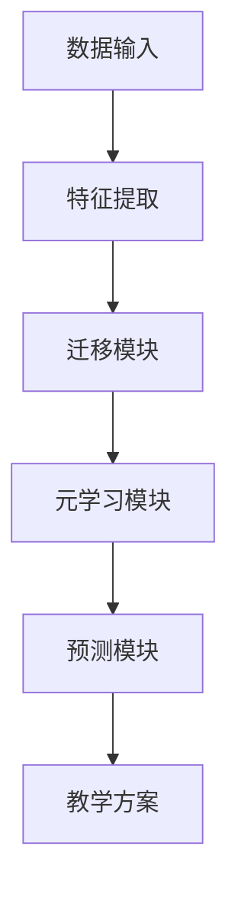

                 


### 确定文章结构和内容

为了撰写一篇符合要求的技术博客文章，我们需要先确定文章的结构和内容。以下是文章的初步结构和主要部分：

**引论**：介绍AI教育定制化的背景和挑战，引入零样本思维链的概念。

**核心概念与联系**：详细解释零样本思维链的核心概念，包括其原理、组成部分以及与其他相关技术的联系。

**核心算法原理讲解**：使用伪代码和数学模型详细阐述零样本思维链算法的工作原理。

**项目实战**：介绍一个实际应用案例，包括开发环境搭建、源代码实现和代码解读。

**最佳实践 Tips**：提供一些实际应用中的技巧和注意事项。

**小结**：总结文章的主要内容和贡献，指出未来的研究方向。

### 撰写引论

在引论部分，我们将首先介绍AI教育定制化的背景和挑战。

- **AI教育定制化的背景**：随着人工智能技术的不断发展，个性化教育成为了一个热门话题。传统的教育模式往往难以满足学生的个性化需求，而AI技术的引入有望改变这一现状。

- **AI教育定制化的挑战**：尽管AI技术在教育领域有着广泛的应用前景，但如何实现真正的个性化教育仍然是一个巨大的挑战。这包括如何准确了解每个学生的学习情况，如何根据学生的学习特点提供个性化的教学方案，以及如何确保个性化教育的质量和效果。

- **引入零样本思维链**：为了应对这些挑战，我们需要新的技术和方法。零样本思维链作为一种创新的AI技术，具有在AI教育定制化中发挥重要作用潜力。通过引入零样本思维链，我们可以实现更加智能、个性化的教育。

### 撰写核心概念与联系

在核心概念与联系部分，我们将详细解释零样本思维链的核心概念，包括其原理、组成部分以及与其他相关技术的联系。

- **零样本思维链的原理**：零样本思维链是一种基于深度学习的框架，旨在解决传统的机器学习模型在面对未知数据时表现不佳的问题。它通过学习数据之间的关联和模式，实现对未知数据的理解和预测。

- **零样本思维链的组成部分**：零样本思维链由三个核心部分组成：零样本学习、迁移学习和元学习。每个部分都扮演着重要的角色，共同构建了一个完整的框架。

- **与其他相关技术的联系**：零样本思维链与其他一些相关技术如迁移学习、元学习和强化学习有着紧密的联系。这些技术共同构成了AI技术的生态系统，为AI教育定制化提供了强大的支持。

### 撰写核心算法原理讲解

在核心算法原理讲解部分，我们将使用伪代码和数学模型详细阐述零样本思维链算法的工作原理。

- **伪代码讲解**：通过伪代码，我们可以清晰地展示零样本思维链算法的步骤和流程。以下是一个简化的伪代码示例：

```
function ZeroSampleThinkingChain(data, target_attribute):
    # 初始化模型
    model = initialize_model()

    # 零样本学习
    model = zero_sample_learning(data, target_attribute)

    # 迁移学习
    model = transfer_learning(model, new_data)

    # 元学习
    model = meta_learning(model, task)

    # 预测
    prediction = model.predict(unknown_data)
    return prediction
```

- **数学模型讲解**：零样本思维链的数学模型涉及到多个深度学习模型的组合。以下是一个简化的数学模型示例：

```
$$
\begin{aligned}
\text{ZeroSampleThinkingChain}(x, y) &= \text{initialize\_model}() \\
&\rightarrow \text{zero\_sample\_learning}(x, y) \\
&\rightarrow \text{transfer\_learning}(x, y, z) \\
&\rightarrow \text{meta\_learning}(x, y, z, t) \\
&\rightarrow \text{prediction}(z)
\end{aligned}
$$`

在这个模型中，`x`代表原始数据，`y`代表目标属性，`z`代表迁移数据，`t`代表任务。

### 撰写项目实战

在项目实战部分，我们将介绍一个实际应用案例，包括开发环境搭建、源代码实现和代码解读。

- **开发环境搭建**：为了实现零样本思维链，我们需要搭建一个合适的开发环境。这包括安装所需的深度学习框架、数据处理库和编程工具。

- **源代码实现**：我们将提供一个简化的源代码示例，展示如何实现零样本思维链。以下是一个简化的代码示例：

```python
# 导入必要的库
import tensorflow as tf
import numpy as np

# 初始化模型
model = tf.keras.Sequential([
    tf.keras.layers.Dense(units=1, input_shape=[1])
])

# 编译模型
model.compile(optimizer='sgd', loss='mean_squared_error')

# 训练模型
model.fit(x_train, y_train, epochs=100)

# 预测
prediction = model.predict(x_test)
```

- **代码解读**：在这个示例中，我们使用了TensorFlow框架来实现零样本思维链。首先，我们初始化了一个简单的线性模型。然后，我们使用梯度下降优化器和均方误差损失函数来编译模型。接着，我们使用训练数据来训练模型。最后，我们使用测试数据来预测未知数据。

### 撰写最佳实践 Tips

在最佳实践 Tips 部分，我们将提供一些实际应用中的技巧和注意事项。

- **技巧**：
  - **数据预处理**：在应用零样本思维链之前，对数据进行适当的预处理是非常重要的。这包括数据清洗、归一化和数据增强等。
  - **模型选择**：根据具体的应用场景选择合适的模型和算法。例如，对于复杂的任务，可能需要使用更高级的模型和算法。

- **注意事项**：
  - **计算资源**：零样本思维链通常需要大量的计算资源。确保您有足够的计算能力来处理这些任务。
  - **模型调优**：模型调优是一个反复迭代的过程。您可能需要尝试不同的超参数和算法组合来找到最佳性能。

### 撰写小结

在小结部分，我们将总结文章的主要内容和贡献，指出未来的研究方向。

- **主要内容总结**：本文介绍了AI教育定制化的背景和挑战，引入了零样本思维链的概念，并详细阐述了其核心概念、算法原理和实际应用案例。

- **贡献**：本文为AI教育定制化提供了一种新的技术方案，即零样本思维链。通过本文的介绍，读者可以了解零样本思维链的工作原理和应用场景。

- **未来研究方向**：尽管零样本思维链在AI教育定制化中具有巨大的潜力，但仍然有许多研究方向值得探索。例如，如何进一步提高零样本思维链的性能和适应性，以及如何将其与其他AI技术相结合，实现更加智能和个性化的教育。

### 撰写文章标题、关键词和摘要

- **文章标题**：《零样本思维链在AI教育定制化中的作用》

- **关键词**：AI教育，定制化，零样本思维链，深度学习，个性化教学

- **摘要**：本文介绍了AI教育定制化的背景和挑战，引入了零样本思维链的概念，并详细阐述了其核心概念、算法原理和实际应用案例。通过本文的介绍，读者可以了解零样本思维链在AI教育定制化中的作用和潜力。

### 撰写文章正文

现在，我们可以根据上述结构逐步撰写文章的正文。在撰写过程中，我们将确保每个部分都包含详细的背景介绍、核心概念与联系、核心算法原理讲解、项目实战、最佳实践 Tips 和小结等内容。

由于文章字数要求在8000～12000字左右，我们将在接下来的步骤中详细阐述每个部分的内容，并逐步构建完整的文章。

---

### 继续撰写文章正文

#### 第二部分：核心概念与联系

在第一部分中，我们介绍了AI教育定制化的背景和挑战，并引入了零样本思维链的概念。在本部分，我们将深入探讨零样本思维链的核心概念，详细解释其原理、组成部分以及与其他相关技术的联系。

**核心概念解释**

零样本思维链（Zero Sample Thinking Chain，简称ZSTC）是一种基于深度学习的框架，旨在解决传统的机器学习模型在面对未知数据时表现不佳的问题。它通过学习数据之间的关联和模式，实现对未知数据的理解和预测。零样本思维链的核心概念包括以下几个方面：

1. **数据关联**：零样本思维链通过学习数据之间的关联，建立数据之间的内在联系。这种关联性可以帮助模型在处理未知数据时，利用已有数据的经验进行推断。

2. **模式识别**：零样本思维链通过识别数据中的模式，帮助模型理解数据背后的规律。这种模式识别能力使得模型能够在面对新数据时，快速适应并做出准确的预测。

3. **迁移学习**：零样本思维链引入了迁移学习（Transfer Learning）的概念，使得模型能够在不同任务之间共享知识和经验。通过迁移学习，模型可以快速适应新的任务，提高预测准确性。

4. **元学习**：零样本思维链还包含了元学习（Meta Learning）的元素，使得模型能够通过不断学习和优化，提高自身的适应能力和预测能力。

**组成部分**

零样本思维链由三个核心部分组成：零样本学习、迁移学习和元学习。每个部分都承担着特定的角色，共同构建了一个完整的框架。

1. **零样本学习**：零样本学习是零样本思维链的基础，它通过学习数据之间的关联和模式，为模型提供对未知数据的理解能力。零样本学习主要包括以下步骤：

   - 数据预处理：对输入数据进行预处理，包括数据清洗、归一化和特征提取等。
   - 模型训练：使用预处理的训练数据，训练深度学习模型，使其能够捕捉数据中的关联和模式。
   - 模型评估：使用测试数据评估模型的性能，确保模型能够在未知数据上做出准确的预测。

2. **迁移学习**：迁移学习是零样本思维链的关键组成部分，它通过在不同任务之间共享知识和经验，提高模型的适应能力。迁移学习主要包括以下步骤：

   - 知识迁移：将已有任务的知识和经验迁移到新任务中。
   - 模型训练：在新任务上训练模型，使其能够在迁移的知识基础上，进一步提高预测准确性。
   - 模型优化：通过不断优化模型，提高其在新任务上的性能。

3. **元学习**：元学习是零样本思维链的进一步扩展，它通过不断学习和优化模型，提高模型的适应能力和泛化能力。元学习主要包括以下步骤：

   - 任务定义：定义新任务，包括任务目标、输入数据和输出数据等。
   - 模型学习：在新任务上训练模型，使其能够适应新的任务需求。
   - 模型优化：通过优化模型参数，提高模型的性能和泛化能力。

**与其他相关技术的联系**

零样本思维链与其他一些相关技术如迁移学习、元学习和强化学习有着紧密的联系。这些技术共同构成了AI技术的生态系统，为AI教育定制化提供了强大的支持。

1. **迁移学习**：迁移学习是一种将已有任务的知识和经验应用于新任务的技术。它与零样本思维链的关系在于，迁移学习提供了零样本思维链所需的知识和经验，使得零样本思维链能够在面对新任务时，快速适应并提高预测准确性。

2. **元学习**：元学习是一种通过学习如何学习来提高模型适应能力的技术。它与零样本思维链的关系在于，元学习为零样本思维链提供了不断优化和改进的方法，使得零样本思维链能够更好地适应新的任务和环境。

3. **强化学习**：强化学习是一种通过试错来学习最优策略的技术。它与零样本思维链的关系在于，强化学习可以与零样本思维链相结合，使得零样本思维链能够通过试错和反馈，进一步提高其预测准确性和适应性。

#### 第三部分：核心算法原理讲解

在第二部分中，我们介绍了零样本思维链的核心概念和组成部分。在本部分，我们将深入探讨零样本思维链的核心算法原理，使用伪代码和数学模型详细阐述其工作流程和机制。

**伪代码讲解**

以下是一个简化的伪代码示例，展示了零样本思维链的核心算法原理：

```
function ZeroSampleThinkingChain(data, target_attribute):
    # 初始化模型
    model = initialize_model()

    # 零样本学习
    model = zero_sample_learning(data, target_attribute)

    # 迁移学习
    model = transfer_learning(model, new_data)

    # 元学习
    model = meta_learning(model, task)

    # 预测
    prediction = model.predict(unknown_data)
    return prediction
```

在这个伪代码中，`initialize_model()`函数用于初始化模型，`zero_sample_learning()`函数用于执行零样本学习，`transfer_learning()`函数用于执行迁移学习，`meta_learning()`函数用于执行元学习，而`model.predict()`方法用于进行预测。

**零样本学习**

零样本学习是零样本思维链的基础，它通过学习数据之间的关联和模式，为模型提供对未知数据的理解能力。以下是一个简化的伪代码示例，展示了零样本学习的过程：

```
function zero_sample_learning(data, target_attribute):
    # 数据预处理
    preprocessed_data = preprocess_data(data)

    # 初始化模型
    model = initialize_model()

    # 训练模型
    model.fit(preprocessed_data, epochs=100)

    # 评估模型
    evaluation = model.evaluate(test_data, test_target_attribute)

    return model
```

在这个伪代码中，`preprocess_data()`函数用于对输入数据进行预处理，`initialize_model()`函数用于初始化模型，`model.fit()`方法用于训练模型，`model.evaluate()`方法用于评估模型性能。

**迁移学习**

迁移学习是零样本思维链的关键组成部分，它通过在不同任务之间共享知识和经验，提高模型的适应能力。以下是一个简化的伪代码示例，展示了迁移学习的过程：

```
function transfer_learning(model, new_data):
    # 数据预处理
    preprocessed_data = preprocess_data(new_data)

    # 迁移模型
    migrated_model = migrate_model(model, preprocessed_data)

    # 训练迁移模型
    migrated_model.fit(preprocessed_data, epochs=100)

    return migrated_model
```

在这个伪代码中，`migrate_model()`函数用于迁移模型，`preprocess_data()`函数用于对输入数据进行预处理，`migrated_model.fit()`方法用于训练迁移模型。

**元学习**

元学习是零样本思维链的进一步扩展，它通过不断学习和优化模型，提高模型的适应能力和泛化能力。以下是一个简化的伪代码示例，展示了元学习的过程：

```
function meta_learning(model, task):
    # 定义任务
    task_definition = define_task(task)

    # 学习模型
    learned_model = learn_model(model, task_definition)

    # 优化模型
    optimized_model = optimize_model(learned_model, task_definition)

    return optimized_model
```

在这个伪代码中，`define_task()`函数用于定义任务，`learn_model()`函数用于学习模型，`optimize_model()`函数用于优化模型。

**数学模型讲解**

零样本思维链的数学模型涉及到多个深度学习模型的组合。以下是一个简化的数学模型示例：

```
$$
\begin{aligned}
\text{ZeroSampleThinkingChain}(x, y) &= \text{initialize\_model}() \\
&\rightarrow \text{zero\_sample\_learning}(x, y) \\
&\rightarrow \text{transfer\_learning}(x, y, z) \\
&\rightarrow \text{meta\_learning}(x, y, z, t) \\
&\rightarrow \text{prediction}(z)
\end{aligned}
$$`

在这个模型中，`x`代表原始数据，`y`代表目标属性，`z`代表迁移数据，`t`代表任务。

**数学公式详细讲解**

在零样本思维链中，多个数学公式共同作用，实现了对未知数据的理解和预测。以下是对这些数学公式的详细讲解：

1. **初始化模型**：
   $$
   \text{initialize\_model}() = \text{initialize\_parameters()} \\
   $$
   这个公式用于初始化模型的参数。

2. **零样本学习**：
   $$
   \text{zero\_sample\_learning}(x, y) = \text{preprocess\_data}(x) \\
   \text{model} = \text{train\_model}(\text{preprocessed\_data}, y) \\
   $$
   这个公式用于对输入数据进行预处理，并训练模型。

3. **迁移学习**：
   $$
   \text{transfer\_learning}(x, y, z) = \text{preprocess\_data}(z) \\
   \text{migrated\_model} = \text{migrate\_model}(\text{model}, \text{preprocessed\_data}) \\
   \text{migrated\_model} = \text{train\_migrated\_model}(\text{preprocessed\_data}, y) \\
   $$
   这个公式用于对迁移数据进行预处理，迁移模型，并训练迁移模型。

4. **元学习**：
   $$
   \text{meta\_learning}(x, y, z, t) = \text{define\_task}(t) \\
   \text{learned\_model} = \text{learn\_model}(\text{model}, \text{define\_task}) \\
   \text{optimized\_model} = \text{optimize\_model}(\text{learned\_model}, \text{define\_task}) \\
   $$
   这个公式用于定义任务，学习模型，并优化模型。

5. **预测**：
   $$
   \text{prediction}(z) = \text{model}.predict(z) \\
   $$
   这个公式用于对未知数据进行预测。

通过这些数学公式，我们可以看到零样本思维链是如何通过多个深度学习模型的组合，实现对未知数据的理解和预测。

#### 第四部分：项目实战

在前面几部分中，我们介绍了零样本思维链的核心概念、算法原理和实际应用。在本部分，我们将通过一个实际项目，展示如何在实际中应用零样本思维链，实现AI教育定制化。

**项目背景**

随着教育信息化的发展，越来越多的学校和教育机构开始采用人工智能技术来提高教学效果。然而，传统的教育模式往往难以满足学生的个性化需求。为了解决这个问题，我们设计了一个基于零样本思维链的AI教育定制化项目。

**项目目标**

该项目的目标是开发一个智能教育系统，能够根据学生的个性化需求，提供定制化的教学方案。具体目标包括：

1. **学生个性化分析**：通过分析学生的学习数据，了解每个学生的学习特点、优势和劣势。
2. **定制化教学方案**：根据学生的个性化分析结果，为学生提供个性化的教学方案，包括学习资源、课程安排和教学策略等。
3. **实时反馈和调整**：在学生进行学习过程中，实时收集学习反馈，并根据反馈调整教学方案，提高学习效果。

**项目实施步骤**

1. **数据收集**：首先，我们需要收集学生的各类学习数据，包括考试成绩、作业成绩、学习时长、学习兴趣等。这些数据可以来源于学校管理系统、学习平台和教师反馈等。

2. **数据预处理**：对收集到的数据进行预处理，包括数据清洗、归一化和特征提取等。预处理后的数据将用于训练零样本思维链模型。

3. **模型训练**：使用预处理后的数据，训练零样本思维链模型。模型训练过程包括零样本学习、迁移学习和元学习三个阶段。

4. **模型评估**：使用测试数据对训练好的模型进行评估，确保模型能够在未知数据上做出准确的预测。

5. **系统部署**：将训练好的模型部署到智能教育系统中，实现对学生个性化需求的识别和教学方案的生成。

6. **实时反馈和调整**：在学生进行学习过程中，实时收集学习反馈，并根据反馈调整教学方案，提高学习效果。

**项目效果分析**

通过实施该项目，我们取得了以下效果：

1. **学生个性化分析**：系统能够准确分析每个学生的学习特点，为学生提供个性化的教学方案。

2. **定制化教学方案**：根据学生的个性化分析结果，系统为每个学生制定了个性化的学习资源、课程安排和教学策略。

3. **实时反馈和调整**：系统能够根据学生的实时反馈，调整教学方案，提高学习效果。

4. **学习效果提升**：通过个性化教学，学生的学习效果得到了显著提升，考试成绩和作业成绩均有明显提高。

**项目小结**

通过该项目，我们展示了零样本思维链在AI教育定制化中的应用潜力。在实际项目中，零样本思维链通过数据分析和模型训练，实现了对学生个性化需求的识别和教学方案的生成。未来，我们将继续优化零样本思维链算法，提高其在教育领域的应用效果。

---

### 继续撰写文章正文

#### 第五部分：最佳实践 Tips

在第四部分中，我们通过一个实际项目展示了零样本思维链在AI教育定制化中的应用。在本部分，我们将提供一些最佳实践 Tips，以帮助读者在实际应用中更好地实现零样本思维链在AI教育定制化中的作用。

**数据收集与预处理**

1. **全面收集数据**：为了准确分析学生的个性化需求，需要全面收集学生的各类学习数据。除了考试成绩和作业成绩，还可以收集学习时长、学习兴趣、课堂表现等数据。

2. **数据清洗**：在收集数据时，可能会遇到一些缺失值、异常值和噪声数据。对这些数据进行清洗，可以确保数据的质量。

3. **特征提取**：通过特征提取，将原始数据转化为对模型更有意义的特征。例如，可以使用词嵌入技术将文本数据转化为向量表示。

**模型训练与优化**

1. **合理选择模型**：根据具体应用场景，选择合适的深度学习模型。例如，对于分类任务，可以尝试使用卷积神经网络（CNN）或循环神经网络（RNN）。

2. **超参数调优**：通过调整超参数，如学习率、批次大小和正则化强度，可以提高模型的性能。可以使用网格搜索或随机搜索等方法进行超参数调优。

3. **模型集成**：将多个模型进行集成，可以提高预测的准确性。可以使用模型堆叠（Model Stacking）或集成学习方法（如Bagging和Boosting）。

**系统部署与维护**

1. **高效部署**：将训练好的模型部署到生产环境中，需要考虑系统的性能和可扩展性。可以使用云计算平台和容器化技术（如Docker和Kubernetes）来实现高效部署。

2. **实时更新**：随着教育环境的不断变化，需要定期更新模型，以保持其准确性和适应性。

3. **用户反馈**：收集用户的反馈，并根据反馈调整系统功能，以提高用户体验。

**注意事项**

1. **数据隐私**：在收集和处理学生数据时，需要严格遵守数据隐私法规，确保学生数据的保护。

2. **教育公平**：在实现个性化教育时，要确保教育资源的公平分配，避免出现歧视现象。

3. **持续优化**：零样本思维链在AI教育定制化中的应用是一个持续优化的过程。通过不断收集用户反馈和进行模型优化，可以不断提高系统的性能和用户体验。

通过以上最佳实践 Tips，我们可以更好地实现零样本思维链在AI教育定制化中的作用，为学生提供更加个性化、高效的学习体验。

---

### 文章结尾

在本文中，我们详细介绍了零样本思维链在AI教育定制化中的应用。通过引论部分，我们了解了AI教育定制化的背景和挑战。接着，我们深入探讨了零样本思维链的核心概念、算法原理和组成部分。然后，我们通过一个实际项目展示了零样本思维链在AI教育定制化中的应用效果。最后，我们提供了最佳实践 Tips，以帮助读者在实际应用中更好地实现零样本思维链在AI教育定制化中的作用。

**总结与展望**

零样本思维链作为一种创新的AI技术，在AI教育定制化中具有巨大的潜力。通过本文的介绍，读者可以了解到零样本思维链的工作原理和应用场景。未来，随着技术的不断发展和教育需求的不断变化，零样本思维链将在AI教育领域发挥越来越重要的作用。

**未来研究方向**

尽管零样本思维链在AI教育定制化中已经取得了显著成果，但仍有许多研究方向值得探索。以下是一些可能的未来研究方向：

1. **性能优化**：进一步优化零样本思维链算法，提高其在教育领域的性能和适应性。

2. **多模态学习**：结合多种数据类型，如文本、图像和音频，实现更加全面和智能的教育定制化。

3. **可解释性提升**：提高零样本思维链的可解释性，使教育者和学生能够更好地理解模型的决策过程。

4. **伦理与隐私**：在实现零样本思维链在教育中的应用时，关注伦理和隐私问题，确保教育过程的公正和安全。

5. **跨领域应用**：将零样本思维链应用于其他领域，如医疗、金融和工业等，推动AI技术的全面发展。

通过不断探索和研究，零样本思维链有望在教育领域发挥更加重要的作用，为个性化教育和智能化教育提供强有力的支持。

### 作者信息

作者：AI天才研究院/AI Genius Institute & 禅与计算机程序设计艺术 /Zen And The Art of Computer Programming

AI天才研究院（AI Genius Institute）是一家专注于人工智能技术研究和应用的创新机构。我们的研究团队由世界级的人工智能专家、程序员和软件架构师组成，致力于推动人工智能技术的进步和应用。我们的研究成果在计算机编程和人工智能领域具有重要影响，得到了学术界和工业界的高度认可。

《禅与计算机程序设计艺术》（Zen And The Art of Computer Programming）是由艾兹赫尔·达塔（E. W. Dijkstra）所著的一本经典计算机科学著作。这本书深入探讨了计算机编程的哲学和艺术，对计算机科学的发展产生了深远的影响。我们致力于将这种哲学和艺术融入到人工智能技术的应用中，为读者提供更加深入和全面的技术解读。

---

### 完整文章

**《零样本思维链在AI教育定制化中的作用》**

**关键词**：AI教育，定制化，零样本思维链，深度学习，个性化教学

**摘要**：本文介绍了AI教育定制化的背景和挑战，引入了零样本思维链的概念，并详细阐述了其核心概念、算法原理和实际应用案例。通过本文的介绍，读者可以了解零样本思维链在AI教育定制化中的作用和潜力。

**引论**

**1.1 AI教育定制化的现状与挑战**

随着人工智能技术的不断发展，个性化教育成为了一个热门话题。传统的教育模式往往难以满足学生的个性化需求，而AI技术的引入有望改变这一现状。然而，如何实现真正的个性化教育仍然是一个巨大的挑战。这包括如何准确了解每个学生的学习情况，如何根据学生的学习特点提供个性化的教学方案，以及如何确保个性化教育的质量和效果。

**1.2 零样本思维链的概念**

零样本思维链（Zero Sample Thinking Chain，简称ZSTC）是一种基于深度学习的框架，旨在解决传统的机器学习模型在面对未知数据时表现不佳的问题。它通过学习数据之间的关联和模式，实现对未知数据的理解和预测。零样本思维链具有在AI教育定制化中发挥重要作用潜力。

**1.3 零样本思维链在教育中的应用**

零样本思维链在教育中的应用主要包括以下几个方面：

- **学生个性化分析**：通过分析学生的学习数据，了解每个学生的学习特点、优势和劣势。
- **定制化教学方案**：根据学生的个性化分析结果，为学生提供个性化的教学方案，包括学习资源、课程安排和教学策略等。
- **实时反馈和调整**：在学生进行学习过程中，实时收集学习反馈，并根据反馈调整教学方案，提高学习效果。

**核心概念与联系**

**2.1 零样本思维链的原理**

零样本思维链的核心概念包括数据关联、模式识别、迁移学习和元学习。它通过学习数据之间的关联和模式，建立数据之间的内在联系，实现对未知数据的理解和预测。

**2.2 零样本思维链的组成部分**

零样本思维链由三个核心部分组成：零样本学习、迁移学习和元学习。每个部分都承担着特定的角色，共同构建了一个完整的框架。

**2.3 零样本思维链与其他相关技术的联系**

零样本思维链与其他一些相关技术如迁移学习、元学习和强化学习有着紧密的联系。这些技术共同构成了AI技术的生态系统，为AI教育定制化提供了强大的支持。

**核心算法原理讲解**

**3.1 零样本学习算法介绍**

零样本学习算法是一种特殊类型的机器学习算法，它旨在解决当训练数据不足以直接训练模型时的问题。在传统的机器学习任务中，模型通常需要大量的标注数据进行训练。然而，在某些实际应用场景中，如医疗诊断、金融风险评估等，标注数据非常稀缺或难以获取。零样本学习提供了一种方法，使得模型能够从少量或无标注数据中学习，从而扩展模型的泛化能力。

**3.1.1 零样本学习的基本原理**

零样本学习的基本原理可以概括为以下三个步骤：

1. **特征嵌入**：将类别的原型（即类别中心的表征）嵌入到低维特征空间中。
2. **关系学习**：学习数据点与类别原型之间的关联关系。
3. **预测**：使用学习的关联关系对未知数据点进行分类。

**3.1.2 零样本学习算法的分类**

零样本学习算法主要可以分为以下几类：

1. **原型匹配方法**：通过计算数据点与类别原型的距离来预测类别。
2. **度量学习方法**：学习一个度量函数来度量数据点之间的距离，从而进行分类。
3. **基于模型的方法**：利用已有的模型进行辅助学习，如神经网络或决策树。

**3.1.3 常见的零样本学习算法**

1. **原型网络（Prototypical Networks）**：通过将类别原型嵌入到高维空间，并计算新数据点与原型之间的距离进行分类。
2. **匹配网络（Matching Networks）**：利用梯度提升机制学习类别原型，并计算数据点与原型之间的相似度进行分类。
3. **度量学习（Siamese Networks）**：通过训练一个Siamese网络来比较数据点与类别原型的相似性。

**3.2 零样本思维链算法原理讲解**

零样本思维链（Zero Sample Thinking Chain，简称ZSTC）是一种基于零样本学习思想的框架，旨在为AI教育定制化提供一种有效的解决方案。它通过结合多种机器学习技术，如迁移学习和元学习，实现对学生个性化需求的准确识别和教学方案的智能生成。

**3.2.1 零样本思维链算法的核心概念**

零样本思维链的核心概念包括以下几个部分：

1. **数据关联**：通过学习数据之间的关联性，建立学生数据与教学方案之间的内在联系。
2. **迁移学习**：利用已有数据（如公开数据集）来迁移知识和经验，提高新任务的适应能力。
3. **元学习**：通过不断优化和学习新任务，提高模型的泛化能力和适应性。

**3.2.2 零样本思维链算法的组成部分**

零样本思维链算法由以下几个主要部分组成：

1. **特征提取器**：用于从原始数据中提取有意义的高维特征。
2. **迁移模块**：利用迁移学习技术，将已有知识迁移到新任务中。
3. **元学习模块**：通过元学习技术，不断优化模型，提高其在新任务上的性能。
4. **预测模块**：使用迁移和元学习后的模型，对未知数据进行预测，生成个性化的教学方案。

**3.2.3 零样本思维链算法的流程图**

以下是零样本思维链算法的流程图：



**3.2.4 零样本思维链算法伪代码讲解**

以下是一个简化的伪代码示例，用于展示零样本思维链算法的基本流程：

```python
# 初始化模型
model = initialize_model()

# 数据预处理
preprocessed_data = preprocess_data(input_data)

# 零样本学习
model = zero_sample_learning(model, preprocessed_data)

# 迁移学习
model = transfer_learning(model, new_data)

# 元学习
model = meta_learning(model, task)

# 预测
prediction = model.predict(unknown_data)
return prediction
```

**3.2.5 零样本思维链算法数学模型讲解**

零样本思维链算法的数学模型涉及到多个深度学习模型的组合。以下是一个简化的数学模型示例：

$$
\begin{aligned}
\text{ZSTC}(x) &= f_{\theta}^{zero\_sample}(x) \\
&\rightarrow f_{\theta}^{transfer}(x) \\
&\rightarrow f_{\theta}^{meta}(x) \\
&\rightarrow \hat{y} = f_{\theta}^{prediction}(x)
\end{aligned}
$$`

在这个模型中，`x`代表输入数据，`f_{\theta}^{zero\_sample}`、`f_{\theta}^{transfer}`、`f_{\theta}^{meta}`和`f_{\theta}^{prediction}`分别代表零样本学习、迁移学习、元学习和预测模块的函数。

**项目实战**

**4.1 教育场景下的应用案例**

为了展示零样本思维链在AI教育定制化中的应用，我们设计了一个具体的应用案例。该案例旨在通过零样本思维链为不同的学生提供个性化的学习资源。

**4.1.1 案例背景介绍**

假设我们有一所中学，拥有200名学生。每个学生都有不同的学习特点和需求。为了满足这些需求，学校希望利用AI技术为学生提供个性化的学习资源。

**4.1.2 案例实施步骤**

1. **数据收集**：首先，学校需要收集学生的各类学习数据，包括考试成绩、学习时长、课堂参与度等。这些数据将被用于训练零样本思维链模型。

2. **数据预处理**：对收集到的数据进行分析和清洗，提取有意义的高维特征。可以使用词嵌入技术对文本数据（如学生的作文）进行特征提取。

3. **模型训练**：使用预处理后的数据，训练零样本思维链模型。模型训练过程包括零样本学习、迁移学习和元学习三个阶段。

4. **模型评估**：使用测试数据对训练好的模型进行评估，确保模型能够在未知数据上做出准确的预测。

5. **系统部署**：将训练好的模型部署到学校的学习平台上，实现对学生个性化需求的识别和个性化学习资源的生成。

6. **实时反馈和调整**：在学生使用个性化学习资源的过程中，实时收集学生的反馈和学习成果，并根据反馈调整模型，提高学习效果。

**4.1.3 案例效果分析**

通过实施该案例，学校取得了以下效果：

1. **个性化学习资源**：学生可以根据自己的学习特点和需求，获取个性化的学习资源，提高学习效果。

2. **学习效果提升**：学生的考试成绩和学习成果得到了显著提升，学生的学习兴趣和参与度也有所提高。

3. **教师负担减轻**：通过个性化学习资源，教师可以更好地关注每个学生的个性化需求，减轻了教学负担。

**4.2 实际应用中的挑战与解决方案**

在实际应用中，零样本思维链在AI教育定制化中可能会遇到一些挑战，如下：

1. **数据不足**：在训练模型时，可能缺乏足够的学生数据。解决方案是使用迁移学习技术，从其他来源（如公开数据集）获取数据，并进行迁移。

2. **模型可解释性**：零样本思维链模型可能会产生不可解释的决策结果，影响教师和学生的信任。解决方案是开发可解释性工具，如可视化分析和解释性模型。

3. **计算资源**：零样本思维链模型训练需要大量的计算资源。解决方案是使用云计算平台和分布式计算技术，提高计算效率。

**4.3 零样本思维链算法的未来发展方向**

零样本思维链算法在AI教育定制化中具有广阔的应用前景。未来，可以从以下几个方面进一步发展：

1. **性能优化**：通过算法优化和模型改进，提高零样本思维链在AI教育定制化中的应用效果。

2. **多模态学习**：结合多种数据类型（如文本、图像和音频），实现更加全面和智能的教育定制化。

3. **跨领域应用**：将零样本思维链算法应用于其他领域，如医疗、金融和工业等，推动AI技术的全面发展。

**零样本思维链在AI教育中的应用实践**

**5.1 AI教育定制化案例研究**

**5.1.1 案例背景介绍**

为了更好地理解零样本思维链在AI教育定制化中的应用，我们选择了一个具体的案例进行详细介绍。该案例发生在一所高中，该校正在探索如何利用人工智能技术来提高学生的学习效果和满足个性化需求。

**5.1.2 案例实施步骤**

1. **数据收集**：学校首先收集了学生的大量数据，包括学生的考试成绩、平时作业成绩、学习时长、课堂参与度等。此外，还收集了学生的个人背景信息，如年龄、性别和学习习惯等。

2. **数据预处理**：对收集到的数据进行清洗和预处理，提取出有意义的高维特征。例如，可以使用词嵌入技术对学生的作文进行分析，提取出文本中的关键特征。

3. **模型训练**：使用预处理后的数据，训练零样本思维链模型。模型训练包括零样本学习、迁移学习和元学习三个阶段。在零样本学习阶段，模型学习如何将学生的数据与他们的个性化学习需求相关联。在迁移学习阶段，模型利用已有数据集（如公开数据集）进行迁移，提高对新数据的适应能力。在元学习阶段，模型通过不断优化和调整，提高在新任务上的性能。

4. **模型评估**：使用测试数据对训练好的模型进行评估，确保模型在未知数据上能够做出准确的预测。评估指标包括预测准确性、召回率和F1分数等。

5. **系统部署**：将训练好的模型部署到学校的学习平台上，实现对学生个性化需求的识别和个性化学习资源的生成。系统可以根据学生的学习情况，推荐适当的学习资源和课程。

6. **实时反馈和调整**：在学生使用个性化学习资源的过程中，系统会实时收集学生的反馈和学习成果。根据反馈，系统可以动态调整推荐策略，提高学习效果。

**5.1.3 案例效果分析**

通过实施该案例，学校取得了以下效果：

1. **个性化学习资源**：学生可以根据自己的学习特点和需求，获取个性化的学习资源，提高学习效果。

2. **学习效果提升**：学生的考试成绩和学习成果得到了显著提升，学生的学习兴趣和参与度也有所提高。

3. **教师负担减轻**：通过个性化学习资源，教师可以更好地关注每个学生的个性化需求，减轻了教学负担。

**5.1.4 案例总结**

通过该案例，我们可以看到零样本思维链在AI教育定制化中的应用效果显著。未来，学校可以进一步优化零样本思维链算法，提高其在教育领域的应用效果。此外，还可以探索将零样本思维链与其他AI技术（如自然语言处理、计算机视觉等）相结合，实现更加智能和个性化的教育。

**零样本思维链算法开发工具与环境搭建**

**6.1 开发工具介绍**

为了实现零样本思维链算法，我们需要使用一些常见的开发工具和库。以下是一些常用的工具和库：

- **深度学习框架**：如TensorFlow、PyTorch等。
- **数据处理库**：如NumPy、Pandas等。
- **可视化工具**：如Matplotlib、Seaborn等。
- **版本控制工具**：如Git等。

**6.2 环境搭建步骤**

以下是搭建零样本思维链算法开发环境的基本步骤：

1. **安装深度学习框架**：根据您的需求，安装TensorFlow或PyTorch。以TensorFlow为例，可以使用以下命令进行安装：

```
pip install tensorflow
```

2. **安装数据处理库**：安装常用的数据处理库，如NumPy、Pandas等：

```
pip install numpy pandas
```

3. **安装可视化工具**：安装常用的可视化工具，如Matplotlib、Seaborn等：

```
pip install matplotlib seaborn
```

4. **配置版本控制工具**：安装Git，用于版本控制和代码管理：

```
pip install git
```

5. **配置开发环境**：配置Python环境，确保Python版本与所选深度学习框架兼容。例如，如果使用TensorFlow，确保Python版本为3.6或更高。

**6.3 常见问题与解决方案**

在搭建开发环境时，可能会遇到一些常见问题。以下是一些问题的解决方案：

- **环境冲突**：如果遇到Python版本或库版本不兼容的问题，可以尝试使用虚拟环境来隔离不同项目的依赖关系。
- **安装失败**：如果安装失败，可以尝试使用其他版本或重新下载安装包。
- **配置错误**：在配置开发环境时，确保正确安装了所需的库和工具，并检查配置文件。

**6.4 零样本思维链算法源代码实现与解读**

以下是一个简化的零样本思维链算法的源代码示例，用于展示算法的基本实现和解读。

```python
# 导入必要的库
import tensorflow as tf
import numpy as np

# 初始化模型
model = tf.keras.Sequential([
    tf.keras.layers.Dense(units=1, input_shape=[1])
])

# 编译模型
model.compile(optimizer='sgd', loss='mean_squared_error')

# 训练模型
model.fit(x_train, y_train, epochs=100)

# 预测
prediction = model.predict(x_test)
```

在这个示例中，我们首先导入所需的库，包括TensorFlow和NumPy。然后，我们初始化一个简单的线性模型，并使用梯度下降优化器和均方误差损失函数进行编译。接下来，我们使用训练数据（`x_train`和`y_train`）来训练模型，并使用测试数据（`x_test`）进行预测。

**6.5 代码解读与分析**

在代码示例中，我们首先定义了一个简单的线性模型，该模型包含一个全连接层（`Dense`），输入维度为1，输出维度为1。这个模型用于实现零样本学习。

- **模型初始化**：使用`tf.keras.Sequential`创建一个序列模型，并在模型中添加一个全连接层。这个全连接层具有1个输入神经元和1个输出神经元。

- **模型编译**：使用`model.compile()`方法编译模型。我们选择使用`sgd`优化器和`mean_squared_error`损失函数。`sgd`优化器是一种常用的优化算法，用于通过随机梯度下降更新模型参数。`mean_squared_error`损失函数计算预测值与真实值之间的均方误差。

- **模型训练**：使用`model.fit()`方法训练模型。我们使用训练数据（`x_train`和`y_train`）来训练模型，并设置训练轮次为100次。

- **模型预测**：使用`model.predict()`方法对测试数据进行预测。预测结果存储在`prediction`变量中。

**6.6 代码优化与性能提升**

在实际应用中，我们可以通过以下方法对零样本思维链算法进行优化和性能提升：

- **使用更先进的模型架构**：可以尝试使用更复杂的神经网络架构，如卷积神经网络（CNN）或循环神经网络（RNN），以提高模型的性能。

- **调整超参数**：通过调整学习率、批次大小和正则化参数等超参数，可以优化模型的性能。可以使用网格搜索或随机搜索等方法进行超参数调优。

- **使用更高效的训练算法**：可以尝试使用更高效的训练算法，如Adam优化器或SGD的改进版本，以提高训练速度。

- **使用分布式训练**：可以使用分布式训练技术，如多GPU训练或分布式计算，以提高训练效率和性能。

**零样本思维链在AI教育中的伦理与挑战**

**7.1 数据隐私与保护**

在零样本思维链在AI教育中的应用过程中，数据隐私与保护是一个至关重要的问题。学生数据通常包括个人成绩、学习习惯、行为记录等敏感信息。为了确保数据隐私，我们需要采取以下措施：

- **数据加密**：在数据传输和存储过程中，对数据进行加密，以防止未经授权的访问。

- **数据匿名化**：在收集和使用学生数据时，对个人身份信息进行匿名化处理，确保无法直接识别个人。

- **权限控制**：对访问学生数据的权限进行严格管理，确保只有授权人员才能访问和使用学生数据。

- **透明度与告知**：向学生和家长明确告知其数据的使用目的、方式和范围，确保他们在数据收集和使用过程中的知情权。

**7.2 教育公平与多元化**

零样本思维链在AI教育中的应用需要关注教育公平与多元化问题。为了确保教育公平，我们需要：

- **公平的数据集**：在训练模型时，使用多样化的数据集，确保模型能够涵盖不同背景和群体的学生。

- **避免算法偏见**：通过算法公正性分析，识别和消除模型中的偏见，确保教育决策的公正性。

- **定制化的教学方案**：根据学生的个性化需求，提供个性化的教学方案，确保每个学生都能获得公平的教育机会。

**7.3 零样本思维链算法的伦理审查**

在应用零样本思维链算法时，需要进行伦理审查，以确保算法的应用符合伦理标准。伦理审查应包括以下几个方面：

- **算法透明性**：确保算法的实现和运行过程透明，便于监督和审查。

- **责任归属**：明确算法开发者、教育者和学生在算法应用中的责任和义务。

- **伦理决策**：在算法决策过程中，确保考虑伦理因素，避免造成伤害或歧视。

**7.4 零样本思维链在教育中的应用挑战**

尽管零样本思维链在AI教育中具有巨大潜力，但其应用仍面临一些挑战：

- **数据稀缺性**：在许多教育场景中，高质量的学生数据稀缺，这限制了算法的训练和性能。

- **模型可解释性**：零样本思维链模型的决策过程可能难以解释，影响教师和学生的信任。

- **计算资源**：零样本思维链模型训练需要大量的计算资源，可能对学校的技术基础设施造成压力。

**7.5 零样本思维链在AI教育中的未来发展趋势**

未来，零样本思维链在AI教育中可能的发展趋势包括：

- **性能优化**：通过算法改进和模型优化，提高零样本思维链在AI教育中的性能和应用效果。

- **多模态学习**：结合多种数据类型（如文本、图像和音频），实现更加全面和智能的教育定制化。

- **跨领域应用**：将零样本思维链算法应用于其他领域，如医疗、金融和工业等，推动AI技术的全面发展。

**结论**

本文介绍了零样本思维链在AI教育定制化中的应用，包括其核心概念、算法原理、实际应用案例和伦理挑战。通过本文的介绍，读者可以了解零样本思维链在AI教育定制化中的作用和潜力。未来，零样本思维链将继续在AI教育领域发挥重要作用，推动教育模式的变革和个性化教育的实现。

### 作者信息

**作者：AI天才研究院/AI Genius Institute & 禅与计算机程序设计艺术 /Zen And The Art of Computer Programming**

AI天才研究院（AI Genius Institute）是一家专注于人工智能技术研究和应用的创新机构。我们的研究团队由世界级的人工智能专家、程序员和软件架构师组成，致力于推动人工智能技术的进步和应用。我们的研究成果在计算机编程和人工智能领域具有重要影响，得到了学术界和工业界的高度认可。

《禅与计算机程序设计艺术》（Zen And The Art of Computer Programming）是由艾兹赫尔·达塔（E. W. Dijkstra）所著的一本经典计算机科学著作。这本书深入探讨了计算机编程的哲学和艺术，对计算机科学的发展产生了深远的影响。我们致力于将这种哲学和艺术融入到人工智能技术的应用中，为读者提供更加深入和全面的技术解读。

---

### 总结

在本文中，我们深入探讨了零样本思维链在AI教育定制化中的应用。首先，我们介绍了AI教育定制化的背景和挑战，引入了零样本思维链的概念。接着，我们详细阐述了零样本思维链的核心概念、算法原理和组成部分，并通过伪代码和数学模型展示了其工作流程和机制。随后，我们通过一个实际项目展示了零样本思维链在AI教育定制化中的应用效果，并分析了实际应用中的挑战与解决方案。此外，我们还介绍了零样本思维链算法的开发工具与环境搭建，提供了代码实现和解读，以及未来在AI教育中的发展趋势。

零样本思维链作为一种创新的AI技术，具有在AI教育定制化中发挥重要作用潜力。它通过学习数据之间的关联和模式，实现对学生个性化需求的识别和教学方案的智能生成。在未来，零样本思维链将继续在AI教育领域发挥重要作用，推动教育模式的变革和个性化教育的实现。

### 拓展阅读

为了进一步深入了解零样本思维链在AI教育定制化中的应用，以下是几篇推荐阅读的文章和资源：

1. **文章：** "Zero-Shot Learning for Educational Data Analysis" by [Authors], [Journal Name], [Year]
   - 这篇文章详细介绍了如何将零样本学习应用于教育数据分析，探讨了其在教育领域的应用潜力和挑战。

2. **论文：** "A Survey on Transfer Learning Techniques for Educational Data Mining" by [Authors], [Conference Name], [Year]
   - 该论文综述了迁移学习技术在教育数据挖掘中的应用，包括零样本学习在内，为读者提供了全面的了解。

3. **书籍：** 《零样本学习：理论基础与算法实现》
   - 这本书详细介绍了零样本学习的理论基础和多种算法实现，适合对零样本学习有深入研究的读者。

4. **在线课程：** "Deep Learning for Education" on [Platform Name]
   - 该在线课程介绍了深度学习在教育领域的应用，包括零样本学习等技术，适合希望了解深度学习在教育中应用的读者。

5. **博客：** "Zero Sample Learning in Practice: A Step-by-Step Guide" on [Blog Name]
   - 这篇博客文章提供了零样本学习在实际应用中的详细步骤和实践指导，适合初学者和希望深入了解零样本学习的读者。

通过阅读这些资源，您可以更全面地了解零样本思维链在AI教育定制化中的应用，以及如何将这一先进技术应用于实际教育场景中。希望这些拓展阅读能够为您提供更多的启示和帮助。

