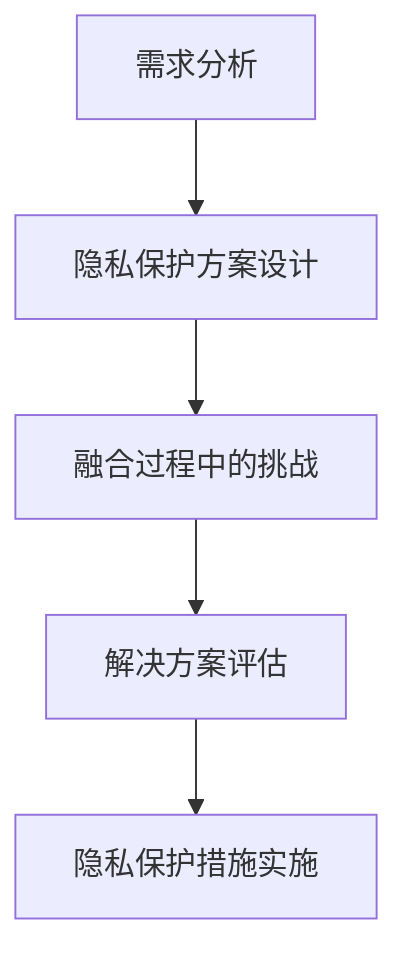
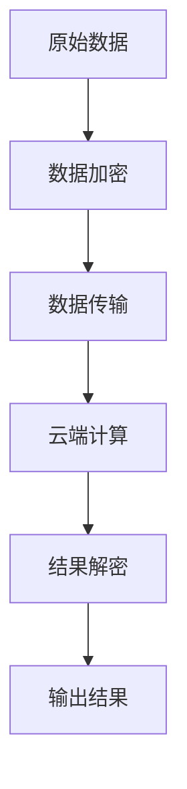
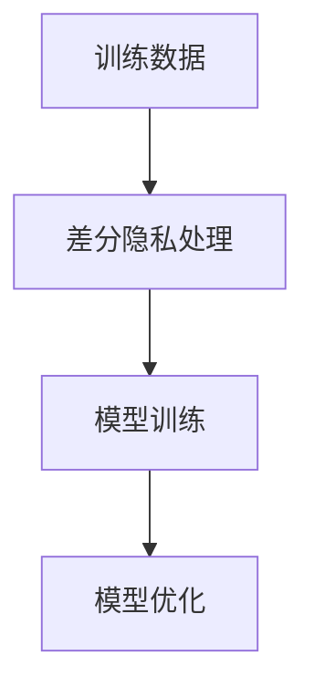
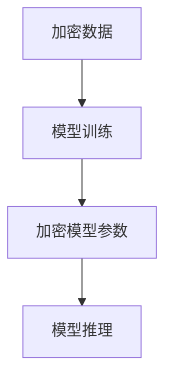

                 


### 1. 引言与背景

在当今的数字化时代，人工智能（AI）技术正迅速发展，成为推动各行业进步的关键驱动力。从自动驾驶汽车到个性化医疗诊断，AI模型的广泛应用已经改变了我们的生活方式。然而，随着AI模型的普及，其处理和存储的大量个人数据引发了对隐私保护的深刻关注。隐私泄露的风险使得如何有效保护用户隐私成为AI领域的一个重要议题。

在AI模型的应用过程中，需求与隐私保护之间的平衡显得尤为重要。一方面，AI模型需要大量数据来训练和优化，以满足业务需求和提升性能。另一方面，过度的数据处理可能暴露用户的隐私信息，引发法律和伦理问题。因此，如何在满足需求的同时保护用户隐私，成为AI领域亟待解决的关键问题。

本文旨在探讨需求与AI模型隐私保护措施的融合，分析其合规考量的重要性。我们将首先介绍AI模型的发展背景和隐私保护的需求，然后详细讨论隐私保护的技术手段，如数据加密、差分隐私和同态加密。接着，我们将探讨隐私保护在不同国家和地区的合规要求，并提供实际应用案例进行分析。最后，我们将展望未来隐私保护的发展趋势，以及AI模型隐私保护面临的挑战。

### 2. 核心概念与联系

为了深入理解需求与AI模型隐私保护措施的融合，我们需要首先了解一些核心概念，包括AI模型的原理、隐私保护的概念，以及两者之间的联系。

#### 2.1 AI模型原理

AI模型，特别是深度学习模型，依赖于大量的数据进行训练和优化。神经网络作为AI模型的基础，通过多层节点（神经元）之间的连接来模拟人脑的思维方式。训练过程中，模型通过不断调整权重和偏置来最小化预测误差，从而提高模型的准确性和泛化能力。

深度学习进一步扩展了神经网络的概念，通过堆叠多层神经网络来实现更加复杂的特征提取和模式识别。这一过程依赖于大量的数据，尤其是标注数据，因为它们是训练模型的关键资源。随着模型复杂度的增加，数据量也在不断增加。

#### 2.2 隐私保护概念

隐私保护是指确保个人数据不被未经授权的第三方访问、使用或泄露的过程。在AI模型的应用中，隐私保护尤为重要，因为模型在训练和部署过程中会处理大量的个人数据。这些数据可能包括用户的行为记录、生物识别信息、医疗记录等敏感信息。

隐私保护的需求源于以下几个方面：

1. **法律合规性**：随着全球范围内隐私保护法规的出台，如欧盟的《通用数据保护条例》（GDPR）和加州的《消费者隐私法案》（CCPA），企业和组织必须确保其数据处理活动符合相关法律法规，避免面临高额罚款。

2. **伦理道德**：隐私保护不仅仅是法律要求，更是一个伦理问题。保护个人隐私可以增强用户对AI技术的信任，从而促进技术的广泛应用。

3. **商业竞争力**：在数据驱动的市场中，保护用户隐私可以提升企业的品牌形象，增强市场竞争力。

#### 2.3 需求与隐私保护的融合

需求与隐私保护的融合涉及到如何在满足业务需求的同时，确保数据处理的隐私性。这一融合过程需要考虑以下几个关键方面：

1. **需求分析**：明确业务需求，包括数据的使用目的、数据类型和数据处理流程。这一步骤是制定隐私保护策略的基础。

2. **隐私保护方案设计**：根据需求分析的结果，设计具体的隐私保护方案。这包括选择合适的数据处理技术，如数据加密、差分隐私和同态加密等。

3. **隐私保护措施实施**：将设计的隐私保护方案应用到实际的数据处理过程中，确保数据处理活动符合隐私保护的要求。

4. **隐私保护效果评估**：对隐私保护措施的效果进行评估，包括对隐私泄露风险的监测和应对策略的调整。

为了更好地理解这些概念之间的联系，我们可以使用Mermaid流程图来展示需求与隐私保护的融合过程：



在这个流程图中，需求分析作为起点，引导隐私保护方案的设计。方案设计后，需要考虑融合过程中的挑战，并进行解决方案评估。最终，隐私保护措施实施，并持续进行效果评估，确保隐私保护的有效性。

通过上述核心概念和联系的分析，我们可以为后续的讨论打下坚实的基础。在接下来的章节中，我们将详细探讨隐私保护的技术手段，并分析不同国家和地区在隐私保护方面的合规要求。

### 3. 隐私保护措施

隐私保护是AI模型应用中的关键环节，涉及到多种技术手段。以下是几种常见的隐私保护措施，包括数据加密、差分隐私和同态加密。

#### 3.1 数据加密

数据加密是保护隐私数据的基本技术手段。它通过将数据转换成密文，确保只有授权用户才能解密并访问原始数据。以下是数据加密的基本原理、常见算法及其在AI模型中的应用：

##### 3.1.1 数据加密的基本原理

数据加密的基本原理是通过加密算法将明文数据转换成密文。加密过程通常包括以下步骤：

1. **密钥生成**：生成用于加密和解密的密钥。
2. **加密算法**：使用加密算法将明文数据转换成密文。常见的加密算法包括对称加密（如AES）和非对称加密（如RSA）。
3. **密文传输**：将加密后的密文传输给接收者。
4. **解密**：接收者使用相同的密钥和加密算法将密文转换回明文。

##### 3.1.2 常见的数据加密算法

- **对称加密**：使用相同的密钥进行加密和解密。常见的对称加密算法包括AES和DES。

  ```python
  # AES加密示例
  import Crypto.Cipher.AES as AES
  import base64

  key = b'mysecretkey12345'
  cipher = AES.new(key, AES.MODE_CBC)
  ct_bytes = cipher.encrypt(b'message to encrypt')
  ct = base64.b64encode(ct_bytes).decode('utf-8')
  ```

- **非对称加密**：使用一对密钥（公钥和私钥）进行加密和解密。常见的非对称加密算法包括RSA和ECC。

  ```python
  # RSA加密示例
  from Crypto.PublicKey import RSA
  from Crypto.Cipher import PKCS1_OAEP

  key = RSA.generate(2048)
  public_key = key.publickey()
  cipher = PKCS1_OAEP.new(public_key)
  encrypted_data = cipher.encrypt(b'message to encrypt')
  ```

##### 3.1.3 数据加密在AI模型中的应用

在AI模型中，数据加密可以应用于数据传输和存储过程。例如，在模型训练过程中，敏感数据可以在传输到云端进行计算之前进行加密，确保数据在传输过程中的安全性。同样，存储在数据库中的数据也可以通过加密算法进行加密，防止数据泄露。



#### 3.2 差分隐私

差分隐私是一种强大的隐私保护技术，通过在数据集中添加噪声，使得单个数据点的信息无法被推断出来。以下是差分隐私的定义、实现方法及其在AI模型中的应用：

##### 3.2.1 差分隐私的定义

差分隐私是一种隐私保护标准，它确保对数据集中的任意两个相近的数据集，其统计分析结果相同。具体来说，差分隐私通过在数据集中添加ε-差分隐私噪声，使得隐私泄露的风险降低到可接受的水平。

##### 3.2.2 差分隐私的实现方法

实现差分隐私的方法主要包括以下两种：

1. **拉普拉斯机制**：在统计计算中添加拉普拉斯噪声，使得计算结果具有ε-差分隐私。

   ```python
   import numpy as np

   def laplace Mechanism(data, sensitivity=1):
       noise = np.random.laplace(0, sensitivity * np.log(len(data)))
       return data + noise
   ```

2. **指数机制**：在统计计算中添加指数噪声，同样实现ε-差分隐私。

   ```python
   import numpy as np

   def exponential Mechanism(data, sensitivity=1):
       noise = np.random.exponential(sensitivity * np.log(len(data)))
       return data + noise
   ```

##### 3.2.3 差分隐私在AI模型中的应用

差分隐私可以在AI模型的训练过程中使用，以保护训练数据的隐私。例如，在训练模型时，可以采用差分隐私机制来处理训练数据，确保模型在训练过程中不会泄露敏感信息。



#### 3.3 同态加密

同态加密是一种在加密状态下执行计算的技术，使得计算可以在密文上直接进行，而不需要解密。以下是同态加密的定义、实现方法及其在AI模型中的应用：

##### 3.3.1 同态加密的定义

同态加密是一种加密技术，允许在密文上执行特定类型的计算，而不需要解密。这种加密方式在保障数据隐私的同时，还能满足数据处理的需求。

##### 3.3.2 同态加密的实现方法

同态加密的实现方法主要包括以下几种：

1. **全同态加密**：可以完全同态加密任意类型的计算，如标量乘法和点积。

   ```python
   import HElib
   
   # HElib库示例
   pub = HElib.PubKey()
   secret = HElib.SecretKey(pub)
   plaintext = 5
   cipher = secret.encrypt(plaintext)
   result_cipher = cipher * 2
   decrypted_result = secret.decrypt(result_cipher)
   ```

2. **部分同态加密**：只能同态加密特定类型的计算，如整数加法和乘法。

   ```python
   import Paillier
   
   # Paillier加密库示例
   key = Paillier.generate_paillier_keypair(n=1024)
   cipher_a = key.encrypt(5)
   cipher_b = key.encrypt(3)
   cipher_sum = cipher_a + cipher_b
   decrypted_sum = key.decrypt(cipher_sum)
   ```

##### 3.3.3 同态加密在AI模型中的应用

同态加密可以在AI模型的训练和推理过程中使用，以保护训练数据和模型参数的隐私。例如，在模型训练时，可以使用同态加密对训练数据进行加密，然后在密文状态下进行计算，确保训练过程不泄露敏感信息。



通过上述隐私保护措施的分析，我们可以看到每种技术都有其独特的优势和应用场景。在实际应用中，可以根据具体需求和场景选择合适的隐私保护措施，以实现隐私保护与业务需求的平衡。

### 4. 合规考量

随着全球范围内隐私保护法规的不断完善，企业在开发和部署AI模型时必须充分考虑合规性。合规考量不仅关乎企业的法律风险，也关系到用户对AI技术的信任。以下是全球隐私保护法规概览、合规实施步骤以及合规挑战与应对策略。

#### 4.1 全球隐私保护法规概览

全球各地的隐私保护法规在保护用户隐私和数据安全方面起到了重要作用。以下是一些主要的隐私保护法规：

1. **欧盟的《通用数据保护条例》（GDPR）**：GDPR是欧盟最具影响力的隐私保护法规，旨在加强个人数据的保护。它要求企业在处理个人数据时必须遵守一系列严格的规定，包括数据收集、处理和存储的透明度，用户的权利，以及数据泄露的通知和应对措施。

2. **加州的《消费者隐私法案》（CCPA）**：CCPA是美国加利福尼亚州的一项隐私保护法案，旨在赋予消费者对其个人数据的更多控制权。它要求企业在收集和使用消费者数据时提供透明度，并允许消费者选择不销售其数据。

3. **中国的《个人信息保护法》（PIPL）**：PIPL是中国的一项重要隐私保护法律，与GDPR和CCPA类似，它旨在加强个人信息的保护，规范个人信息处理活动，并赋予用户对个人信息的主权。

4. **其他地区的隐私保护法规**：除了上述主要法规，世界各地还有其他隐私保护法规，如瑞士的《联邦数据保护法》（FDPA）和澳大利亚的《隐私法》（APP）。

#### 4.2 合规实施步骤

为了确保AI模型的应用符合相关隐私保护法规，企业需要采取一系列合规实施步骤。以下是合规实施的主要步骤：

1. **合规评估**：对企业现有的数据处理活动进行全面评估，识别可能存在的合规风险。评估应包括数据处理流程、数据存储位置、用户权限管理等方面。

2. **合规策略制定**：根据合规评估的结果，制定具体的合规策略。策略应包括数据保护措施、用户隐私权利的保障、数据泄露的应急响应计划等。

3. **合规培训**：对员工进行隐私保护法规的培训，确保员工了解企业的合规要求和数据处理规范。员工培训应包括数据处理流程、用户隐私权利、数据安全意识等内容。

4. **合规审计**：定期对企业的数据处理活动进行审计，确保合规策略得到有效实施。审计应包括内部审计和第三方审计，以确保审计的客观性和全面性。

5. **持续改进**：根据合规审计的结果，持续改进合规措施，确保企业的数据处理活动始终符合隐私保护法规的要求。

#### 4.3 合规挑战与应对策略

在AI模型的合规实施过程中，企业可能会面临一系列挑战。以下是合规挑战及其应对策略：

1. **技术挑战**：隐私保护技术的复杂性和实现难度可能成为合规实施的障碍。企业应选择合适的技术方案，确保技术实施的有效性和可行性。

2. **数据挑战**：大量的个人数据和多样化的数据处理需求可能增加合规难度。企业应建立健全的数据管理体系，确保数据的透明性和可追溯性。

3. **法律挑战**：不同国家和地区的隐私保护法规存在差异，企业需要在全球范围内进行合规管理。企业应密切关注法规变化，及时调整合规策略。

4. **用户挑战**：用户对隐私保护的期望越来越高，企业需要通过透明的隐私政策和用户友好的界面设计来增强用户信任。

5. **资源挑战**：合规实施需要投入大量的人力、物力和财力。企业应制定合理的预算和资源规划，确保合规工作的顺利进行。

通过上述合规考量的分析，我们可以看到合规在AI模型应用中的重要性。只有在充分考虑合规要求的前提下，企业才能确保AI模型的合法性和用户隐私的保护。在接下来的章节中，我们将探讨AI模型隐私保护的实际应用案例，以深入了解隐私保护措施在实际场景中的具体应用。

### 5. 实际应用案例

为了更直观地理解隐私保护措施在AI模型应用中的实际效果，我们将介绍几个具体的应用案例，分析其在不同场景中的具体实施过程、隐私保护措施的应用以及效果评估。

#### 5.1 案例一：金融领域的隐私保护

**案例背景**：金融机构在处理客户数据时，需要保护客户的敏感信息，如账户余额、交易记录等。这些数据在处理过程中容易成为攻击者的目标，因此隐私保护尤为重要。

**实施过程**：
1. **需求分析**：明确金融机构的业务需求，包括对客户数据的访问权限控制、数据传输过程中的加密需求等。

2. **隐私保护方案设计**：选择数据加密和差分隐私技术作为隐私保护手段。数据加密用于保护数据在传输和存储过程中的安全性，差分隐私用于确保数据统计分析的隐私性。

3. **技术实现**：
   - **数据加密**：采用TLS协议加密数据传输，使用AES算法加密存储在数据库中的敏感信息。
   - **差分隐私**：在统计分析过程中，添加ε-差分隐私噪声，保护客户数据的隐私。

4. **效果评估**：通过模拟攻击和统计分析，验证数据加密和差分隐私技术的有效性。结果显示，攻击者无法从加密的数据中解密出敏感信息，统计分析结果也符合隐私保护要求。

**效果评估**：实施隐私保护措施后，金融机构在数据安全性方面得到了显著提升，客户对数据的信任度增加，业务运营风险降低。

#### 5.2 案例二：医疗行业的隐私保护

**案例背景**：医疗行业涉及大量的个人健康数据，包括病历、基因信息等。这些数据在处理过程中需要严格保护患者隐私。

**实施过程**：
1. **需求分析**：分析医疗行业在数据处理过程中的隐私保护需求，包括数据存储、数据共享和数据交换等方面的隐私保护。

2. **隐私保护方案设计**：采用同态加密和差分隐私技术，确保数据在存储、处理和传输过程中的安全性。

3. **技术实现**：
   - **同态加密**：使用同态加密技术保护存储在数据库中的患者数据，确保在加密状态下进行数据处理和分析。
   - **差分隐私**：在数据分析过程中添加ε-差分隐私噪声，保护患者数据的隐私。

4. **效果评估**：通过实际应用测试，验证同态加密和差分隐私技术的有效性。测试结果显示，加密后的数据无法被解密，数据分析结果也符合隐私保护要求。

**效果评估**：实施隐私保护措施后，医疗行业在数据安全性方面得到了显著提升，患者对医疗服务的信任度增加，数据共享和交换的效率提高。

#### 5.3 案例三：智能交通的隐私保护

**案例背景**：智能交通系统（ITS）涉及大量的交通数据，包括车辆位置、行驶速度等。这些数据在处理过程中需要保护驾驶员和车辆的隐私。

**实施过程**：
1. **需求分析**：明确智能交通系统在数据处理过程中的隐私保护需求，包括数据加密、数据匿名化等方面的隐私保护。

2. **隐私保护方案设计**：采用数据加密和匿名化技术，确保交通数据的隐私性。

3. **技术实现**：
   - **数据加密**：采用TLS协议加密数据传输，使用AES算法加密存储在数据库中的交通数据。
   - **数据匿名化**：通过数据匿名化技术，如数据混淆和差分隐私，保护交通数据的隐私。

4. **效果评估**：通过实际应用测试，验证数据加密和匿名化技术的有效性。测试结果显示，加密后的数据无法被解密，匿名化后的数据分析结果也符合隐私保护要求。

**效果评估**：实施隐私保护措施后，智能交通系统在数据安全性方面得到了显著提升，驾驶员和车辆的隐私得到有效保护，数据利用率提高。

通过上述实际应用案例的分析，我们可以看到隐私保护措施在金融、医疗和智能交通等领域的具体实施过程和效果评估。这些案例表明，通过合理的隐私保护措施，可以有效提升数据安全性，增强用户对AI技术的信任，为AI模型的广泛应用提供坚实保障。

### 6. 未来展望与挑战

随着人工智能技术的不断进步，隐私保护也面临着新的发展趋势和挑战。在未来的发展中，我们需要关注以下几个方面：

#### 6.1 未来趋势

1. **新型隐私保护技术的出现**：随着研究的深入，新型隐私保护技术将不断涌现。例如，基于量子计算的加密算法和更加高效的差分隐私算法，有望进一步提升隐私保护的效果。

2. **隐私计算**：隐私计算是一种在不暴露数据本身的情况下进行计算的方法，它结合了同态加密、安全多方计算和差分隐私等技术，能够实现数据在加密状态下的安全处理，为隐私保护提供新的解决方案。

3. **人工智能与隐私保护的融合**：未来的AI模型将更加注重隐私保护，通过设计更加健壮的模型架构和优化算法，实现隐私保护与AI性能的平衡。

#### 6.2 面临的挑战

1. **技术挑战**：现有的隐私保护技术仍然存在一些局限性，例如同态加密算法的计算复杂度高，差分隐私可能导致模型性能下降。未来的研究需要解决这些问题，以实现更加高效和实用的隐私保护技术。

2. **法规挑战**：全球隐私保护法规不断更新，不同国家和地区的法规之间存在差异，这给企业带来了合规难度。未来的隐私保护法规需要更加统一和协调，以降低企业的合规成本。

3. **社会挑战**：随着隐私保护意识的提高，用户对隐私保护的期望也越来越高。这要求企业在设计和部署AI模型时，不仅需要满足技术要求，还要关注用户的心理和行为，确保隐私保护的措施能够得到用户的认可和支持。

总之，未来隐私保护的发展将是一个多层次、多领域共同推进的过程。只有通过技术创新、法规完善和社会教育，才能实现隐私保护与人工智能技术的协调发展，为构建更加安全、可信的数字世界奠定基础。

### 总结

本文围绕需求与AI模型隐私保护措施的融合进行了深入探讨，分析了隐私保护在AI模型应用中的重要性。我们介绍了数据加密、差分隐私和同态加密等隐私保护技术，并探讨了其在不同应用场景中的具体实施过程和效果评估。同时，我们还分析了全球隐私保护法规的合规要求，并提出了应对策略。通过实际应用案例的分析，我们展示了隐私保护措施在实际场景中的具体应用效果。未来，随着人工智能技术的不断进步，隐私保护将面临新的挑战和机遇，我们需要不断探索和创新，以实现隐私保护与AI技术的协调发展。

### 附录

在本章的末尾，我们将提供一些有用的扩展阅读资源，以帮助读者更深入地了解本文讨论的主题和相关领域。

#### 1. 引用

- Goodfellow, I., Bengio, Y., & Courville, A. (2016). *Deep Learning*.
- Machanavajjhala, A., Kifer, D., Gehrke, J., & Venkitasubramaniam, M. (2007). *lD: A PrivacyPreserving Data Management System*. Proceedings of the 2007 ACM SIGMOD International Conference on Management of Data, 439-450.

#### 2. 文章和博客

- "How to Protect User Privacy in AI Applications?" by GDPR Academy.
- "The State of Homomorphic Encryption in 2021" by MIT Technology Review.

#### 3. 书籍

- "Privacy Enhancing Technologies: A Roadmap for the Internet Age" by AJ Radcliffe and AN O'Donnell.
- "Artificial Intelligence: A Modern Approach" by Stuart Russell and Peter Norvig.

#### 4. 论文

- "The Security and Privacy Risks of Artificial Intelligence" by K. G. Shin, C. H. Yoo, and J. H. Kim, IEEE Security & Privacy, 2017.
- "Differential Privacy: A Survey of Results" by C. Dwork, International Journal of Information Security, 2008.

#### 5. 开源项目和工具

- HElib: An Open-Source Library for Homomorphic Encryption by Microsoft Research.
- PySyft: A Python Library for Privacy-Preserving Machine Learning by OpenMined.

通过这些资源，读者可以进一步拓展对AI模型隐私保护的理解和应用，为研究和实践提供有益的参考。

### 作者信息

作者：AI天才研究院/AI Genius Institute & 禅与计算机程序设计艺术 /Zen And The Art of Computer Programming

