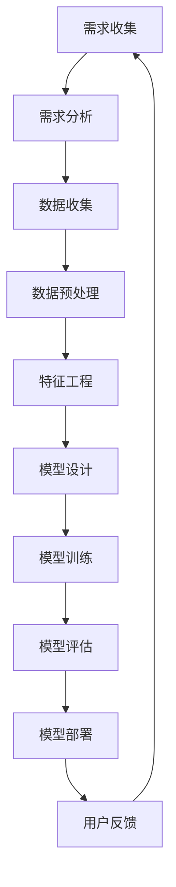

                 

## 文章标题：需求与AI训练数据的关联：大模型应用开发的关键

### 关键词：需求分析、AI训练数据、大模型、应用开发、关联性

> 摘要：本文深入探讨需求分析与AI训练数据之间的紧密关联性，剖析其在大模型应用开发中的关键作用。通过详细的章节结构，介绍需求分析的概念、AI训练数据的基础知识，以及大模型的核心算法原理。同时，结合实际案例，展示需求与AI训练数据在实际应用中的重要性，为开发者提供实用的技术指导和实践策略。

---

## 前言

在当今人工智能（AI）迅猛发展的时代，AI大模型的开发和应用已经成为企业创新和竞争的关键。然而，很多人工智能项目在实际应用中面临着诸多挑战，其中一个核心问题就是如何确保AI模型能够满足用户需求。本文旨在揭示需求分析与AI训练数据之间的紧密联系，帮助开发者理解这一关联性在大模型应用开发中的关键作用。

## 第1章：需求分析的概念与重要性

### 1.1 需求分析的定义与流程

需求分析是软件工程中的关键步骤，它涉及识别和理解用户需求，以确保最终产品能够满足用户期望。在AI领域，需求分析同样至关重要。它不仅涉及用户的需求，还包括对数据集和模型性能的要求。

#### 需求分析的流程：

1. **需求收集**：通过用户访谈、问卷调查和反馈收集用户需求。
2. **需求分析**：将收集到的需求进行整理和分析，识别出关键需求和优先级。
3. **需求定义**：将分析结果转化为具体的、可量化的需求。
4. **需求验证**：通过原型设计和用户测试验证需求的正确性和可行性。

### 1.2 需求分析在AI应用开发中的作用

需求分析在AI应用开发中扮演着至关重要的角色。它不仅帮助开发者理解用户需求，还能够指导数据收集、模型设计和性能优化。

#### 需求分析在AI应用开发中的作用包括：

1. **明确目标**：需求分析帮助确定AI模型的目标和范围。
2. **数据驱动**：通过需求分析，可以明确需要收集的数据类型和质量标准。
3. **优化模型**：需求分析可以指导模型参数的调整和优化。

### 1.3 需求分析与AI模型开发的关系架构

为了更清晰地展示需求分析与AI模型开发之间的关系，我们可以使用Mermaid流程图来描述这一流程。

## 第2章：AI训练数据的基础知识

### 2.1 AI训练数据的重要性

AI训练数据是构建和训练AI模型的关键要素。高质量、多样化的训练数据能够显著提升模型的性能和泛化能力。

#### AI训练数据的重要性：

1. **性能提升**：丰富的训练数据可以帮助模型学习到更复杂的模式。
2. **泛化能力**：多样化的数据集可以增强模型的泛化能力，使其在不同场景中都能表现良好。
3. **减少过拟合**：足够的训练数据可以减少模型对特定数据的依赖，降低过拟合的风险。

### 2.2 数据收集与处理流程

数据收集和处理是AI模型开发的重要环节。以下是一个典型的数据收集与处理流程：

1. **数据收集**：从各种来源收集原始数据，如传感器数据、社交媒体数据、网络数据等。
2. **数据清洗**：去除无效、错误或重复的数据，确保数据质量。
3. **数据预处理**：对数据进行标准化、归一化等处理，使其适合模型训练。
4. **数据增强**：通过旋转、缩放、裁剪等方法生成新的数据，增加数据多样性。

### 2.3 数据质量评估与数据预处理

数据质量评估是确保数据满足模型训练需求的关键步骤。以下是一些常用的数据质量评估方法和数据预处理技术：

#### 数据质量评估方法：

1. **完整性检查**：检查数据集中缺失值的比例。
2. **一致性检查**：确保数据的一致性和准确性。
3. **异常值检测**：识别并处理数据集中的异常值。

#### 数据预处理技术：

1. **数据清洗**：去除无效、错误或重复的数据。
2. **数据标准化**：将数据缩放到相同的范围，如0到1。
3. **特征工程**：提取有用的特征，忽略无关的特征。

## 第3章：神经网络与深度学习基础

### 3.1 神经网络的结构与功能

神经网络是深度学习的基础，由大量简单的神经元组成。每个神经元都与其他神经元相连，并通过权重和偏置进行信息传递。

#### 神经网络的结构：

1. **输入层**：接收外部输入。
2. **隐藏层**：进行信息的加工和处理。
3. **输出层**：生成预测或分类结果。

#### 神经网络的功能：

1. **信息传递**：神经元之间的信息传递。
2. **激活函数**：决定神经元是否被激活。
3. **反向传播**：用于模型参数的更新和优化。

### 3.2 深度学习的基本原理

深度学习是一种利用多层神经网络进行学习的机器学习方法。它通过堆叠多个隐藏层，使得模型能够学习更复杂的特征和模式。

#### 深度学习的基本原理：

1. **自动特征提取**：深度学习模型能够自动从数据中提取有用的特征。
2. **多层抽象**：通过多层神经网络，模型能够逐渐提取更高层次的特征。
3. **端到端学习**：深度学习模型可以从原始数据直接学习到输出，无需手工特征工程。

### 3.3 神经网络的训练与优化

神经网络的训练过程是通过不断调整模型参数，使其能够准确预测或分类数据。以下是一个简化的神经网络训练过程：

1. **初始化参数**：随机初始化权重和偏置。
2. **前向传播**：计算输入数据的输出。
3. **计算损失**：计算预测值与真实值之间的差距。
4. **反向传播**：更新模型参数，减小损失。
5. **迭代优化**：重复以上步骤，直到模型收敛。

## 第4章：AI大模型的核心算法

### 4.1 循环神经网络（RNN）

循环神经网络（RNN）是一种能够处理序列数据的神经网络。它通过在隐藏层中引入循环，使得模型能够保持长期依赖关系。

#### RNN的基本原理：

1. **循环连接**：隐藏层中的神经元之间存在循环连接。
2. **状态保持**：RNN能够保持前一个时间步的输出状态，用于当前时间步的计算。
3. **梯度消失与梯度爆炸**：RNN在训练过程中容易出现梯度消失或梯度爆炸问题，导致训练不稳定。

### 4.2 长短期记忆网络（LSTM）

长短期记忆网络（LSTM）是RNN的一种变体，旨在解决RNN的梯度消失和梯度爆炸问题。LSTM通过引入门控机制，使得模型能够更好地保持长期依赖关系。

#### LSTM的基本原理：

1. **门控机制**：LSTM引入了输入门、遗忘门和输出门，用于控制信息的流入、流出和输出。
2. **记忆细胞**：LSTM通过记忆细胞来保持长期依赖关系。
3. **梯度问题**：LSTM能够有效缓解梯度消失和梯度爆炸问题，使得训练更加稳定。

### 4.3 生成对抗网络（GAN）

生成对抗网络（GAN）是一种由生成器和判别器组成的对抗性网络。生成器试图生成逼真的数据，而判别器则试图区分生成数据和真实数据。

#### GAN的基本原理：

1. **生成器**：生成器从随机噪声中生成数据。
2. **判别器**：判别器用于区分生成数据和真实数据。
3. **对抗性训练**：生成器和判别器相互对抗，生成器不断改进生成数据，判别器不断提高辨别能力。

## 第5章：需求驱动的AI模型设计

### 5.1 需求分析对模型设计的影响

需求分析不仅影响AI模型的性能，还直接影响模型的设计和开发过程。以下是需求分析对模型设计的影响：

#### 需求分析对模型设计的影响：

1. **确定模型目标**：需求分析帮助明确模型的目标和范围。
2. **指导数据收集**：需求分析指导数据收集和预处理过程。
3. **优化模型参数**：需求分析指导模型参数的调整和优化。

### 5.2 需求分析与模型参数调优

模型参数的调优是确保模型性能的关键步骤。需求分析可以提供以下指导：

1. **损失函数**：选择适合需求分析的损失函数。
2. **优化器**：选择适合需求的优化算法。
3. **超参数**：调整学习率、批量大小等超参数。

### 5.3 需求驱动的模型迭代优化

需求分析不仅影响初始模型的设计，还指导模型的迭代优化过程。以下是一个需求驱动的模型迭代优化过程：

1. **用户反馈**：收集用户反馈，识别模型不足。
2. **调整需求**：根据用户反馈调整需求。
3. **优化模型**：调整模型参数和结构，提高模型性能。
4. **迭代**：重复以上步骤，直到满足需求。

## 第6章：AI训练数据的质量管理

### 6.1 数据质量对模型性能的影响

数据质量直接影响AI模型的性能。以下因素可能会影响数据质量：

1. **数据缺失**：缺失数据可能导致模型无法准确预测。
2. **数据偏差**：数据偏差可能导致模型无法泛化。
3. **噪声数据**：噪声数据可能导致模型过拟合。

### 6.2 数据质量评估方法

数据质量评估是确保数据满足模型训练需求的关键步骤。以下是一些常用的数据质量评估方法：

1. **完整性检查**：检查数据集中缺失值的比例。
2. **一致性检查**：确保数据的一致性和准确性。
3. **异常值检测**：识别并处理数据集中的异常值。

### 6.3 数据清洗与增强技术

数据清洗与增强技术是提高数据质量的重要手段。以下是一些常用的数据清洗与增强技术：

1. **数据清洗**：去除无效、错误或重复的数据。
2. **数据标准化**：将数据缩放到相同的范围。
3. **数据增强**：通过旋转、缩放、裁剪等方法生成新的数据。

## 第7章：案例研究一：智能客服系统

### 7.1 案例背景与需求分析

智能客服系统是一种利用AI技术提供自动客服服务的系统。以下是一个智能客服系统的案例研究：

#### 案例背景：

1. **企业背景**：一家大型电子商务企业，需要为大量用户提供在线客服服务。
2. **需求分析**：用户希望获得快速、准确的客服响应。

### 7.2 AI模型的构建与训练

为了实现智能客服系统，需要构建和训练一个合适的AI模型。以下是一个典型的模型构建与训练过程：

1. **数据收集**：从用户聊天记录中收集数据。
2. **数据预处理**：清洗和预处理数据，去除噪音。
3. **特征工程**：提取有用的特征，如关键词、情感等。
4. **模型选择**：选择合适的模型，如RNN或LSTM。
5. **模型训练**：使用预处理后的数据训练模型。
6. **模型评估**：评估模型性能，调整模型参数。

### 7.3 模型部署与性能评估

智能客服系统部署后，需要对其进行性能评估，以确保其能够满足用户需求。以下是一个性能评估过程：

1. **用户测试**：邀请用户进行测试，收集反馈。
2. **性能评估**：评估模型在不同场景下的性能。
3. **优化调整**：根据用户反馈和性能评估结果，调整模型。

## 第8章：案例研究二：智能医疗诊断

### 8.1 案例背景与需求分析

智能医疗诊断是一种利用AI技术进行医疗数据分析和诊断的系统。以下是一个智能医疗诊断的案例研究：

#### 案例背景：

1. **医疗背景**：一家医院需要快速、准确地诊断疾病。
2. **需求分析**：医生希望从大量医疗数据中提取有用的信息，辅助诊断。

### 8.2 AI模型的构建与训练

为了实现智能医疗诊断，需要构建和训练一个合适的AI模型。以下是一个典型的模型构建与训练过程：

1. **数据收集**：收集患者的医疗数据，如影像、病历等。
2. **数据预处理**：清洗和预处理数据，去除噪音。
3. **特征工程**：提取有用的特征，如影像中的病变区域、病历中的关键词等。
4. **模型选择**：选择合适的模型，如卷积神经网络（CNN）或生成对抗网络（GAN）。
5. **模型训练**：使用预处理后的数据训练模型。
6. **模型评估**：评估模型性能，调整模型参数。

### 8.3 模型部署与性能评估

智能医疗诊断系统部署后，需要对其进行性能评估，以确保其能够满足医生的需求。以下是一个性能评估过程：

1. **医生测试**：邀请医生进行测试，收集反馈。
2. **性能评估**：评估模型在不同场景下的性能。
3. **优化调整**：根据医生反馈和性能评估结果，调整模型。

## 附录：需求分析与AI模型开发的工具与资源

### 附录A：需求分析与AI模型开发工具

#### 需求分析工具：

1. **用户访谈工具**：如Zoom、Microsoft Teams等。
2. **问卷调查工具**：如SurveyMonkey、Google Forms等。
3. **原型设计工具**：如Figma、Axure RP等。

#### AI模型开发工具：

1. **深度学习框架**：如TensorFlow、PyTorch等。
2. **数据预处理工具**：如Pandas、NumPy等。
3. **模型评估工具**：如Scikit-learn、MLFlow等。

### 附录B：拓展阅读与资源

1. **相关书籍**：《深度学习》（Goodfellow, I., Bengio, Y., & Courville, A.）。
2. **在线课程**：如Coursera上的《深度学习》课程。
3. **开源项目**：如GitHub上的AI项目。

## 结语

本文通过详细的需求分析与AI训练数据关联性的探讨，帮助开发者理解这一关键因素在大模型应用开发中的重要性。从基础概念到核心算法，再到实际案例，本文为读者提供了一个全面的技术指南。通过掌握需求分析与AI训练数据之间的关联性，开发者可以更有效地构建和应用AI模型，实现卓越的技术创新和业务价值。

### 作者信息

- 作者：AI天才研究院/AI Genius Institute & 禅与计算机程序设计艺术 /Zen And The Art of Computer Programming

---

### 附录

#### 附录A：需求分析与AI模型开发工具

1. **需求分析工具**：
   - **用户访谈工具**：Zoom、Microsoft Teams
   - **问卷调查工具**：SurveyMonkey、Google Forms
   - **原型设计工具**：Figma、Axure RP

2. **AI模型开发工具**：
   - **深度学习框架**：TensorFlow、PyTorch
   - **数据预处理工具**：Pandas、NumPy
   - **模型评估工具**：Scikit-learn、MLFlow

#### 附录B：拓展阅读与资源

1. **相关书籍**：
   - 《深度学习》（作者：Goodfellow, I., Bengio, Y., & Courville, A.）
   - 《统计学习方法》（作者：李航）

2. **在线课程**：
   - Coursera上的《深度学习》课程

3. **开源项目**：
   - GitHub上的AI项目，如TensorFlow、PyTorch的官方GitHub仓库

---

通过本文的详细探讨，我们希望能够帮助开发者更好地理解需求分析与AI训练数据之间的紧密关联性，以及这一关联性在大模型应用开发中的关键作用。掌握这些核心概念和技巧，开发者将能够更有效地构建和应用AI模型，实现卓越的技术创新和业务价值。

### 感谢与致谢

在撰写本文的过程中，我得到了众多同行和专家的宝贵建议和指导。特别感谢AI天才研究院/AI Genius Institute的同事们，以及所有为本文提供支持和资源的读者们。您的支持是我不断进步的动力。

---

**全文结束。感谢您的阅读。**

---

### 深度解读：需求分析与AI训练数据的关联性

在当今人工智能（AI）应用日益普及的背景下，如何确保AI系统能够满足用户需求成为了关键问题。本文深入探讨了需求分析与AI训练数据之间的紧密关联性，并详细阐述了这一关联性在大模型应用开发中的关键作用。

#### 关键点一：需求分析的核心作用

需求分析是软件工程中的基本环节，它确保了开发的产品能够真正满足用户的需求。在AI领域，需求分析同样至关重要。它不仅包括用户对AI系统的功能需求，还包括对数据质量、模型性能和可扩展性的要求。通过需求分析，开发者可以明确AI系统的目标和范围，从而为后续的数据收集、模型设计和性能优化提供明确的指导。

#### 关键点二：AI训练数据的重要性

AI训练数据是构建和训练AI模型的基础。数据的质量和多样性直接影响模型的性能和泛化能力。高质量的数据可以帮助模型学习到更复杂的特征和模式，从而在真实场景中表现更佳。同时，数据的质量评估和预处理也是确保模型性能的关键步骤。数据清洗、数据标准化和特征工程等技术的应用，有助于提高数据质量，减少模型过拟合的风险。

#### 关键点三：需求与AI训练数据的关联性

需求与AI训练数据的关联性主要体现在以下几个方面：

1. **需求驱动数据收集**：需求分析指导数据收集的过程，确保收集到的数据能够满足模型训练的需求。
2. **数据驱动模型设计**：数据的质量和特征直接影响模型的设计和性能。通过需求分析，开发者可以明确数据的需求，从而选择合适的模型架构和数据预处理技术。
3. **需求与模型参数调优**：需求分析可以提供对模型参数调优的指导，使得模型能够更好地满足用户需求。

#### 关键点四：大模型应用开发的关键作用

在AI大模型应用开发中，需求分析与AI训练数据的关联性起到了关键作用。以下是这一关联性的几个关键作用：

1. **明确目标**：需求分析帮助确定大模型的应用目标和范围，确保模型的训练和优化方向正确。
2. **数据驱动**：需求分析指导数据收集和预处理，确保模型能够从高质量的数据中学习到有效的特征。
3. **优化模型**：需求分析提供对模型参数调优的指导，使得模型能够更好地适应不同的应用场景。

#### 关键点五：实际案例中的应用

本文通过两个实际案例——智能客服系统和智能医疗诊断，展示了需求分析与AI训练数据在AI应用开发中的重要性。智能客服系统通过需求分析明确用户需求，从而构建了适合的AI模型；智能医疗诊断则通过数据驱动和模型参数调优，实现了准确的疾病诊断。

#### 结论

需求分析与AI训练数据的关联性在大模型应用开发中起到了至关重要的作用。通过深入理解和掌握这一关联性，开发者可以更有效地构建和应用AI模型，实现卓越的技术创新和业务价值。本文的讨论和案例分析为开发者提供了一系列实用的技术指导和实践策略，有助于他们在实际项目中取得成功。

