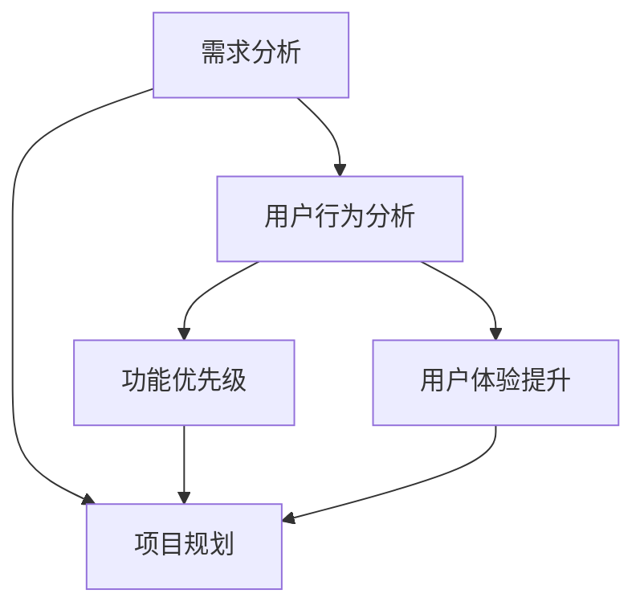

                 

### 文章标题《需求与用户行为分析的结合：指导功能优先级》

#### 关键词：需求分析，用户行为分析，功能优先级，数据分析，软件工程，用户体验

> 摘要：本文将探讨如何将需求分析与用户行为分析相结合，以指导软件功能优先级的制定。通过深入理解用户需求和行为模式，我们能够更有效地识别和实现用户真正关心的功能，从而提高软件项目的成功率。

### 引言

在现代软件工程领域，需求分析与用户行为分析正变得越来越重要。传统的需求分析主要关注用户的功能需求，而用户行为分析则关注用户如何与软件互动，他们的使用习惯和行为模式。将这两者结合起来，可以帮助我们在设计软件功能时更加贴合用户实际需求，从而提升用户体验和软件的成功率。

本文将详细探讨如何进行需求分析与用户行为分析，以及如何利用分析结果来指导功能优先级。我们将从以下几个方面展开讨论：

1. **需求分析的基本概念**：介绍需求收集、需求分析和需求验证的方法。
2. **用户行为分析的方法与技术**：讨论用户行为数据收集、分析技术，以及用户画像构建。
3. **案例分析**：通过具体案例展示需求分析与用户行为分析如何结合。
4. **功能优先级决策**：讨论如何利用需求与用户行为分析结果来制定功能优先级。
5. **工具与技术**：介绍支持需求与用户行为分析的工具和技术。
6. **实践指南**：提供实际操作的建议和最佳实践。

### 第一步：需求分析

需求分析是软件工程中至关重要的一环，它关乎项目能否满足用户的期望。以下是需求分析的基本步骤：

#### 1.1 需求收集

需求收集是需求分析的起点，主要方法包括：

- **用户访谈**：通过与用户面对面交流，深入了解用户的需求和痛点。
- **调查问卷**：设计问卷收集用户反馈，量化用户需求。
- **竞品分析**：研究竞争对手的产品功能，了解市场趋势和用户偏好。

#### 1.2 需求分析

需求分析的关键在于将收集到的需求转化为具体的功能要求。主要步骤包括：

- **需求分类**：将需求分为功能性需求和非功能性需求。
- **需求优先级排序**：根据用户需求的重要性和紧急性进行排序。
- **需求验证**：确保收集到的需求是准确和可行的。

#### 1.3 需求管理

需求管理是确保需求在整个项目生命周期中得以有效管理和跟踪的过程，主要方法包括：

- **需求变更管理**：当需求发生变化时，及时调整并通知相关方。
- **需求文档编写**：将需求详细记录下来，以便后续参考和验证。

### 第二步：用户行为分析

用户行为分析旨在通过分析用户的行为数据，了解他们的使用习惯和偏好，从而为功能设计提供依据。以下是用户行为分析的基本步骤：

#### 2.1 用户行为数据收集

用户行为数据的收集是用户行为分析的基础，主要方法包括：

- **用户行为日志**：记录用户在软件中的操作和行为。
- **交互跟踪**：跟踪用户与软件的交互过程，如点击、滑动等。
- **用户调查**：通过问卷调查了解用户对软件的满意度和使用习惯。

#### 2.2 用户行为分析技术

用户行为分析技术主要包括：

- **回归分析**：通过分析用户行为数据，找出影响用户满意度的关键因素。
- **分段线性回归**：将用户行为数据分为不同阶段，分析每个阶段的特征。
- **聚类分析**：将用户根据行为特征分为不同的群体，分析各群体的需求差异。

#### 2.3 用户画像构建

用户画像构建是将用户行为数据转化为具体用户描述的过程，主要方法包括：

- **用户属性提取**：提取用户的基本信息和特征。
- **用户行为特征提取**：分析用户在软件中的行为模式。
- **用户画像融合**：将不同来源的数据进行整合，构建完整的用户画像。

### 第三步：结合案例分析

#### 3.1 案例选择

为了更好地展示需求分析与用户行为分析的结合，我们选择了以下案例：

- **项目背景**：某企业希望开发一款在线教育平台，提供在线课程和学习管理功能。
- **案例目标**：通过需求分析与用户行为分析，确定平台的核心功能，提高用户满意度和留存率。

#### 3.2 需求分析过程

在需求分析阶段，我们采取了以下步骤：

- **需求收集**：通过用户访谈和调查问卷，收集用户对在线教育平台的需求。
- **需求分析**：将收集到的需求进行分类和优先级排序，确定平台的核心功能。
- **需求验证**：通过与用户沟通和测试，确保需求是准确和可行的。

#### 3.3 用户行为分析过程

在用户行为分析阶段，我们采取了以下步骤：

- **用户行为数据收集**：通过用户行为日志和交互跟踪，收集用户在平台上的行为数据。
- **用户行为分析**：通过回归分析和聚类分析，分析用户的行为模式和使用习惯。
- **用户画像构建**：将用户行为数据转化为用户画像，了解不同类型用户的需求和偏好。

#### 3.4 需求与用户行为分析结合

在需求与用户行为分析结合阶段，我们采取了以下步骤：

- **数据整合**：将需求分析和用户行为分析的结果进行整合，形成对用户需求的全景理解。
- **功能优先级决策**：根据用户需求和用户行为分析结果，制定平台的功能优先级。
- **实施效果评估**：通过用户反馈和平台数据，评估功能优先级的决策效果。

### 第四步：功能优先级决策

功能优先级决策是软件设计中的关键环节，直接影响到项目的成功。以下是功能优先级决策的基本原则和方法：

#### 4.1 功能优先级原则

功能优先级决策应遵循以下原则：

- **用户价值最大化**：优先实现用户最需要的功能。
- **资源优化配置**：合理分配资源，实现功能最大化。
- **风险评估**：考虑功能实现的成本和风险。

#### 4.2 决策模型与方法

功能优先级决策可以采用以下模型和方法：

- **多目标优化模型**：通过优化用户价值、资源利用和风险等因素，确定功能优先级。
- **决策树模型**：通过树状结构，将需求与用户行为分析结果转化为功能优先级。
- **数据驱动的功能优先级排序**：利用用户行为数据，自动确定功能优先级。

### 第五步：工具与技术

在需求与用户行为分析过程中，我们可以利用以下工具和技术：

#### 5.1 需求分析工具

- **用户访谈工具**：如Zoom、Skype等。
- **调查问卷工具**：如SurveyMonkey、Google表单等。
- **需求管理工具**：如Jira、Trello等。

#### 5.2 用户行为分析工具

- **数据收集工具**：如Google Analytics、Mixpanel等。
- **数据分析工具**：如Python、R等。
- **用户画像构建工具**：如机器学习平台、用户画像平台等。

#### 5.3 功能优先级决策工具

- **数据驱动的决策支持系统**：如决策树、回归分析等。
- **自动化功能优先级评估工具**：如自动化测试平台、AI评估工具等。

### 第六步：实践指南

在需求与用户行为分析的实际操作中，我们可以遵循以下实践指南：

#### 6.1 实践步骤

- **准备工作**：明确项目目标，组建需求分析与用户行为分析团队。
- **需求分析实践**：进行需求收集、分析和验证。
- **用户行为分析实践**：收集用户行为数据，进行用户行为分析和用户画像构建。
- **功能优先级决策实践**：结合用户需求和用户行为分析结果，制定功能优先级。
- **实施效果评估**：通过用户反馈和平台数据，评估功能优先级的决策效果。

#### 6.2 最佳实践

- **需求分析最佳实践**：定期与用户沟通，确保需求准确和可行。
- **用户行为分析最佳实践**：充分利用现有数据资源，避免重复收集。
- **功能优先级决策最佳实践**：综合考虑用户价值、资源利用和风险等因素。

#### 6.3 挑战与应对

- **需求分析挑战与应对**：用户需求变化频繁，应对策略包括需求变更管理、需求文档更新等。
- **用户行为分析挑战与应对**：数据质量参差不齐，应对策略包括数据清洗、数据验证等。
- **功能优先级决策挑战与应对**：功能优先级变动频繁，应对策略包括定期评估、动态调整等。

### 总结

需求与用户行为分析的结合是现代软件工程中不可或缺的一环。通过深入理解用户需求和行为模式，我们能够更有效地指导功能优先级，提高软件项目的成功率和用户满意度。本文介绍了需求分析与用户行为分析的基本概念、方法和技术，并通过具体案例展示了如何将二者结合起来。希望本文能为读者在需求分析与用户行为分析方面提供有益的参考。

### 作者信息

**作者：AI天才研究院/AI Genius Institute & 禅与计算机程序设计艺术 /Zen And The Art of Computer Programming**

感谢您的阅读，希望本文能为您在需求与用户行为分析领域带来新的启发和思考。如果您有任何问题或建议，欢迎随时与我们联系。我们将持续为您提供高质量的技术内容。再次感谢您的支持！### 第一部分：需求分析与用户行为分析概述

#### 背景介绍

在软件工程中，需求分析与用户行为分析是两个关键环节，它们对于项目的成功至关重要。需求分析旨在明确用户的需求和期望，而用户行为分析则关注用户如何实际使用软件。传统的需求分析往往侧重于功能性的需求，而忽略了用户在实际使用中的行为模式。然而，随着技术的进步和用户需求的多样化，仅仅满足功能需求已经不足以保证软件的成功。用户行为分析提供了更深入的洞察，帮助我们了解用户的真实需求和痛点，从而指导软件的设计和开发。

#### 核心概念与联系

需求分析（Requirements Analysis）：
- **概念**：需求分析是指通过系统的方法，收集、分析和验证用户需求，以形成项目的功能性和非功能性要求。
- **联系**：需求分析是用户行为分析的基础，它为后续的用户行为分析提供了明确的目标和框架。

用户行为分析（User Behavior Analysis）：
- **概念**：用户行为分析是通过收集和分析用户在软件中的行为数据，了解用户的使用习惯、偏好和痛点。
- **联系**：用户行为分析为需求分析提供了实际的反馈和验证，帮助确认需求是否满足用户的真实需求。

功能优先级（Feature Prioritization）：
- **概念**：功能优先级是指根据用户需求和用户行为分析结果，确定软件功能的优先级。
- **联系**：功能优先级是需求分析和用户行为分析的结果之一，它决定了软件设计和开发的方向。

#### Mermaid 流程图



#### 核心算法原理讲解与伪代码

**需求分析核心算法原理：**

- **用户访谈频次分布**：分析用户访谈的频次分布，以确定用户需求的重要性。

```python
def user_requirement_frequencies(interview_data):
    frequencies = {}
    for interview in interview_data:
        for requirement in interview['requirements']:
            if requirement in frequencies:
                frequencies[requirement] += 1
            else:
                frequencies[requirement] = 1
    return frequencies
```

**用户行为分析核心算法原理：**

- **点击流分析**：通过分析用户点击流数据，确定用户在软件中的主要操作路径。

```python
def click_stream_analysis(click_data):
    paths = {}
    current_path = []
    for click in click_data:
        if click['action'] == 'click':
            current_path.append(click['element'])
        elif click['action'] == 'exit':
            path_key = tuple(current_path)
            if path_key in paths:
                paths[path_key] += 1
            else:
                paths[path_key] = 1
            current_path = []
    return paths
```

**功能优先级决策核心算法原理：**

- **多目标优化模型**：通过优化用户价值、资源利用和风险等因素，确定功能优先级。

```python
def multi_objective_optimization(user_value, resource_utilization, risk):
    # 假设用户价值、资源利用和风险均为0到1的值
    objective_weights = [0.6, 0.3, 0.1]  # 用户价值、资源利用、风险的权重
    total_value = sum([weight * value for weight, value in zip(objective_weights, [user_value, resource_utilization, risk])])
    return total_value
```

#### 数学模型和公式与详细讲解与举例说明

**用户需求优先级排序模型：**

- **公式**：

$$
\text{优先级} = \frac{\text{需求重要性} \times \text{需求频率}}{\text{需求实现成本}}
$$

- **详细讲解**：优先级计算公式综合考虑了需求的重要性和实现成本，以确保高价值且低成本的需

