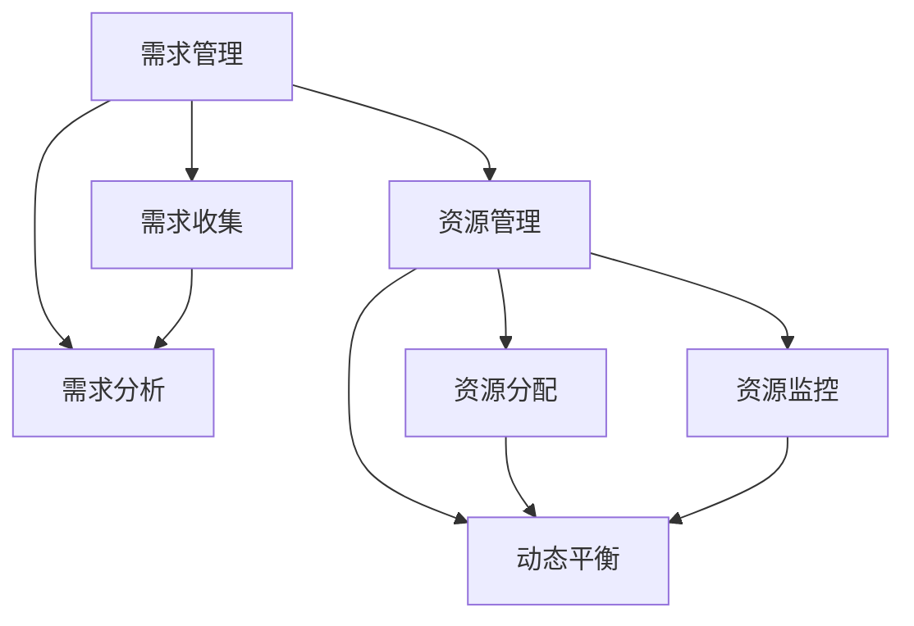

                 


### 摘要

在大型应用开发过程中，需求与资源的动态平衡是一个关键的挑战。本文将深入探讨如何通过系统化的需求管理和资源分配策略，实现这一平衡。首先，我们将回顾需求管理的核心概念和步骤，包括需求收集、分析和可行性评估。接着，本文将介绍资源管理的类型和需求分析的方法。随后，文章将重点讨论资源分配策略和调度机制，并利用实际案例展示这些策略如何应用于大型应用开发中。最后，本文将总结最佳实践，并给出未来研究的方向。

### 文章标题

需求与资源分配的动态平衡：大型应用开发的挑战

### 关键词

需求管理，资源分配，动态平衡，大型应用开发，调度策略

---

## 背景介绍

在现代软件工程领域，大型应用的开发已经成为一个不可逆转的趋势。随着互联网的普及和大数据技术的兴起，用户对应用程序的功能性和性能要求越来越高。这不仅仅体现在用户界面的美观和易用性上，更在于系统的响应速度、稳定性和可扩展性。为了满足这些需求，开发者必须面对一个巨大的挑战：如何在有限的资源下，实现需求的快速响应和高效分配。

### 需求与资源的关系

需求与资源的关系可以类比为供需关系。在经济学中，供需关系是指市场中商品的需求量和供应量之间的相互作用。同样，在软件开发中，需求表示用户对功能、性能和体验的期望，而资源则包括人力资源、财力资源和物理资源等。需求与资源的动态平衡就是要在满足用户需求的同时，最大限度地利用和优化资源，以实现项目的成功。

### 大型应用开发的特点

1. **复杂性**：大型应用通常包含复杂的业务逻辑和庞大的数据规模，这要求开发团队具备高度的专业技能和丰富的经验。

2. **高可靠性**：用户对大型应用的要求不仅仅是功能的完备，还有系统的高可靠性和稳定性。任何系统崩溃或者性能瓶颈都可能对用户造成极大的影响。

3. **可扩展性**：随着用户量的增长和业务的发展，大型应用需要具备良好的可扩展性，以便能够轻松应对未来可能的扩展需求。

4. **快速迭代**：在互联网时代，用户的需求变化非常快，大型应用的开发需要能够快速响应这些变化，进行迭代和优化。

### 动态平衡的必要性

动态平衡在大型应用开发中的必要性体现在以下几个方面：

1. **资源优化**：通过动态平衡，可以确保资源得到最合理的利用，避免资源浪费和资源短缺的问题。

2. **需求满足**：动态平衡能够确保需求得到及时响应和满足，提高用户的满意度和项目的成功率。

3. **风险控制**：动态平衡有助于识别和应对潜在的风险，降低项目失败的概率。

4. **成本控制**：通过优化资源分配，可以有效控制项目成本，提高投资回报率。

### 核心概念与联系

为了更好地理解需求与资源的动态平衡，我们首先需要明确几个核心概念，并探讨它们之间的关系。

1. **需求管理**：需求管理是指从用户需求出发，通过系统化的方法来收集、分析和组织需求，并将其转化为项目或产品规格的过程。

2. **资源管理**：资源管理是指对项目所需的资源进行有效的规划、分配和监控，以确保项目能够按计划顺利进行。

3. **动态平衡**：动态平衡是指在项目开发过程中，根据需求和资源的变化，实时调整资源分配，以实现需求与资源的最佳匹配。

下面是一个Mermaid流程图，展示了需求与资源之间的核心概念和关系：



在这个流程图中，需求管理和资源管理是整个动态平衡过程的基础，而动态平衡则是需求与资源之间相互作用的结果。需求收集和需求分析确保了需求的准确性和完整性，而资源分配和资源监控则保证了资源的高效利用。

### 核心算法原理讲解

在需求与资源分配的动态平衡中，核心算法原理起到了至关重要的作用。以下将使用伪代码详细阐述这些算法的基本原理。

#### 1. 需求优先级排序算法

```plaintext
算法名称：需求优先级排序

输入：需求列表（每个需求包含优先级、紧急性、重要性等属性）

输出：排序后的需求列表

伪代码：
1. 初始化一个需求列表
2. 对需求列表进行排序，排序规则如下：
   a. 根据优先级从高到低排序
   b. 在优先级相同的情况下，根据紧急性从高到低排序
   c. 在紧急性相同的情况下，根据重要性从高到低排序
3. 返回排序后的需求列表
```

#### 2. 资源分配算法

```plaintext
算法名称：资源分配

输入：资源列表、需求列表

输出：分配后的资源状态和需求状态

伪代码：
1. 初始化资源状态和需求状态
2. 遍历需求列表：
   a. 对于每个需求，检查其所需资源是否在资源列表中
   b. 如果资源可用，进行资源分配
   c. 更新资源状态和需求状态
3. 返回资源状态和需求状态
```

#### 3. 动态调整算法

```plaintext
算法名称：动态调整

输入：当前资源状态、当前需求状态

输出：调整后的资源状态和需求状态

伪代码：
1. 初始化资源状态和需求状态
2. 监测当前资源状态和需求状态的变化
3. 根据变化情况调整资源分配：
   a. 如果需求增加，检查是否需要增加资源
   b. 如果资源紧张，检查是否需要调整需求优先级
4. 更新资源状态和需求状态
5. 返回调整后的资源状态和需求状态
```

#### 4. 资源利用率评估算法

```plaintext
算法名称：资源利用率评估

输入：历史资源使用数据、当前资源状态

输出：资源利用率指标

伪代码：
1. 初始化资源利用率指标
2. 计算当前资源的平均使用率
3. 分析历史资源使用数据，找出资源使用高峰期和低谷期
4. 根据当前资源状态和历史数据，预测未来资源需求
5. 返回资源利用率指标
```

### 数学模型和公式

在资源分配和动态平衡过程中，数学模型和公式扮演着重要的角色。以下将介绍一些常用的数学模型和公式，并详细讲解它们的原理。

#### 1. 资源利用率公式

```latex
\text{利用率} = \frac{\text{实际使用资源}}{\text{总资源}} \times 100\%
```

该公式用于计算资源的实际利用率。通过这个指标，我们可以了解资源的使用情况，并据此调整资源分配策略。

#### 2. 需求优先级公式

```latex
P = \frac{E \times I}{C}
```

其中，P 是需求优先级，E 是紧急性，I 是重要性，C 是成本。这个公式用于确定需求在需求列表中的优先级顺序。通常情况下，需求优先级越高，越应该优先处理。

#### 3. 资源需求预测模型

```latex
R(t) = R_0 + \alpha \times (T - t)
```

其中，R(t) 是 t 时刻的资源需求量，R_0 是初始资源需求量，\alpha 是需求增长速率，T 是预测的时间范围，t 是当前时间。这个模型用于预测未来某一时刻的资源需求量。

### 详细讲解和举例说明

#### 需求优先级排序算法

假设有一个需求列表，包含以下需求：

```plaintext
需求1：新增用户注册功能，优先级：高，紧急性：高，重要性：高
需求2：优化订单处理系统，优先级：高，紧急性：中，重要性：中
需求3：完善用户反馈机制，优先级：中，紧急性：高，重要性：低
需求4：优化网站响应速度，优先级：中，紧急性：中，重要性：高
需求5：修复漏洞，优先级：低，紧急性：高，重要性：高
```

根据需求优先级公式，我们可以计算出每个需求的优先级：

```plaintext
需求1的优先级：P1 = E1 \times I1 / C1 = 9
需求2的优先级：P2 = E2 \times I2 / C2 = 6
需求3的优先级：P3 = E3 \times I3 / C3 = 6
需求4的优先级：P4 = E4 \times I4 / C4 = 6
需求5的优先级：P5 = E5 \times I5 / C5 = 9
```

排序后的需求列表为：

```plaintext
需求1：新增用户注册功能
需求5：修复漏洞
需求2：优化订单处理系统
需求3：完善用户反馈机制
需求4：优化网站响应速度
```

#### 资源分配算法

假设有一个资源列表，包含以下资源：

```plaintext
资源1：开发人员，数量：10
资源2：测试人员，数量：5
资源3：服务器，数量：5
资源4：数据库管理员，数量：3
```

以及以下需求列表：

```plaintext
需求1：新增用户注册功能，所需资源：开发人员2，测试人员1，服务器1
需求2：优化订单处理系统，所需资源：开发人员3，测试人员1，数据库管理员1
需求3：完善用户反馈机制，所需资源：开发人员2，测试人员1
需求4：优化网站响应速度，所需资源：开发人员2，服务器2
需求5：修复漏洞，所需资源：测试人员2，数据库管理员1
```

根据资源分配算法，我们可以进行如下资源分配：

```plaintext
需求1：新增用户注册功能，分配资源：开发人员2，测试人员1，服务器1
需求2：优化订单处理系统，分配资源：开发人员3，测试人员1，数据库管理员1
需求3：完善用户反馈机制，分配资源：开发人员2，测试人员1
需求4：优化网站响应速度，分配资源：开发人员2，服务器2
需求5：修复漏洞，分配资源：测试人员2，数据库管理员1
```

#### 动态调整算法

假设在项目执行过程中，需求3的紧急性突然增加，从原本的中等紧急性提升为高紧急性。根据动态调整算法，我们需要重新评估资源分配：

```plaintext
需求1：新增用户注册功能，所需资源：开发人员2，测试人员1，服务器1
需求2：优化订单处理系统，所需资源：开发人员3，测试人员1，数据库管理员1
需求3：完善用户反馈机制，所需资源：开发人员3，测试人员2，服务器1
需求4：优化网站响应速度，所需资源：开发人员2，服务器2
需求5：修复漏洞，所需资源：测试人员2，数据库管理员1
```

由于开发人员资源紧张，我们需要调整资源分配，将需求2的开发人员资源从3减少到2，以优先满足需求3的紧急需求：

```plaintext
需求1：新增用户注册功能，分配资源：开发人员2，测试人员1，服务器1
需求2：优化订单处理系统，分配资源：开发人员2，测试人员1，数据库管理员1
需求3：完善用户反馈机制，分配资源：开发人员3，测试人员2，服务器1
需求4：优化网站响应速度，所需资源：开发人员2，服务器2
需求5：修复漏洞，分配资源：测试人员2，数据库管理员1
```

#### 资源利用率评估算法

假设在一个月的时间内，我们记录了以下资源使用数据：

```plaintext
资源1（开发人员）：使用天数：20，总天数：30
资源2（测试人员）：使用天数：15，总天数：20
资源3（服务器）：使用天数：25，总天数：30
资源4（数据库管理员）：使用天数：10，总天数：15
```

根据资源利用率公式，我们可以计算每个资源的利用率：

```plaintext
资源1（开发人员）的利用率：利用率1 = (20 / 30) \times 100% ≈ 66.67%
资源2（测试人员）的利用率：利用率2 = (15 / 20) \times 100% = 75%
资源3（服务器）的利用率：利用率3 = (25 / 30) \times 100% ≈ 83.33%
资源4（数据库管理员）的利用率：利用率4 = (10 / 15) \times 100% ≈ 66.67%
```

通过分析这些数据，我们可以发现资源3（服务器）的利用率最高，而资源1（开发人员）的利用率最低。这可能意味着我们需要重新评估资源的分配策略，或者增加更多开发人员资源。

### 数学公式

在本文中，我们使用了以下数学公式：

1. 需求优先级公式：\(P = \frac{E \times I}{C}\)
2. 资源利用率公式：\(\text{利用率} = \frac{\text{实际使用资源}}{\text{总资源}} \times 100\%\)
3. 资源需求预测模型：\(R(t) = R_0 + \alpha \times (T - t)\)

这些公式在需求与资源分配的动态平衡中起到了关键作用。需求优先级公式用于确定需求在需求列表中的优先级顺序，资源利用率公式用于评估资源的使用情况，资源需求预测模型用于预测未来某一时刻的资源需求量。

### 开发环境搭建

在进行大型应用开发之前，首先需要搭建一个合适的开发环境。以下是一个基本的开发环境搭建流程：

1. **安装操作系统**：选择一个适合的操作系统，如Windows、Linux或MacOS。
2. **安装开发工具**：安装集成开发环境（IDE），如Visual Studio、Eclipse或IntelliJ IDEA，以及必要的编程语言编译器和解释器，如Java、Python或C++。
3. **安装数据库**：根据项目需求选择合适的数据库系统，如MySQL、PostgreSQL或MongoDB，并安装相应的客户端工具。
4. **安装版本控制工具**：安装Git或其他版本控制工具，以便进行代码管理和协作开发。
5. **配置开发环境**：配置必要的开发环境变量，如Java路径、Python路径等，确保开发工具能够正确运行。

### 源代码实现与代码解读

以下是一个简单的示例，用于说明如何实现需求与资源分配的动态平衡。

#### 需求

编写一个Python脚本，用于管理需求并分配资源。脚本需要支持以下功能：

1. 收集需求
2. 分析需求并确定优先级
3. 分配资源
4. 动态调整资源分配

#### 实现思路

1. 定义一个需求类，用于存储需求信息，如需求名称、优先级等。
2. 定义一个资源类，用于存储资源信息，如资源名称、可用数量等。
3. 定义一个需求管理类，用于管理需求，如添加需求、分析需求、分配资源等。
4. 定义一个资源管理类，用于管理资源，如添加资源、分配资源、调整资源等。

#### 代码实现

以下是一个简单的Python代码实现示例：

```python
class Requirement:
    def __init__(self, name, priority):
        self.name = name
        self.priority = priority

class Resource:
    def __init__(self, name, quantity):
        self.name = name
        self.quantity = quantity

class RequirementManager:
    def __init__(self):
        self.requirements = []

    def add_requirement(self, requirement):
        self.requirements.append(requirement)

    def analyze_requirements(self):
        self.requirements.sort(key=lambda x: x.priority, reverse=True)

class ResourceManager:
    def __init__(self):
        self.resources = {}

    def add_resource(self, resource):
        if resource.name in self.resources:
            self.resources[resource.name] += resource.quantity
        else:
            self.resources[resource.name] = resource.quantity

    def allocate_resources(self, requirement):
        for resource in requirement.required_resources:
            if resource.name in self.resources and self.resources[resource.name] >= resource.quantity:
                self.resources[resource.name] -= resource.quantity
                print(f"Allocated {resource.quantity} {resource.name} for {requirement.name}")
            else:
                print(f"Not enough {resource.name} to allocate for {requirement.name}")

    def adjust_resources(self, requirement):
        for resource in requirement.required_resources:
            if resource.name in self.resources:
                if self.resources[resource.name] < resource.quantity:
                    print(f"Need to adjust {resource.name} for {requirement.name}")
```

#### 代码应用解读与分析

以上代码实现了需求管理器和资源管理器的基本功能。首先，我们定义了需求类和资源类，用于存储需求信息和资源信息。需求类包含需求名称和优先级属性，资源类包含资源名称和可用数量属性。

接下来，我们定义了需求管理器类和资源管理器类。需求管理器类负责添加需求、分析需求并确定优先级。资源管理器类负责添加资源、分配资源并根据需求调整资源。

在`add_requirement`方法中，我们向需求管理器中添加需求。在`analyze_requirements`方法中，我们根据优先级对需求进行排序。

在`add_resource`方法中，我们向资源管理器中添加资源。在`allocate_resources`方法中，我们根据需求分配资源。如果资源可用，我们分配所需数量的资源，并打印分配信息。如果资源不足，我们打印提示信息。

在`adjust_resources`方法中，我们根据需求调整资源。如果当前资源的数量低于需求，我们打印提示信息，表明需要调整资源。

#### 实际案例分析与详细讲解

以下是一个实际案例，用于说明如何使用上述代码实现需求与资源分配的动态平衡。

**案例背景**：

一家互联网公司正在开发一款在线购物平台。公司需要快速响应用户的需求，并确保系统的高效运行。以下是用户提出的一些需求：

1. 新增商品搜索功能
2. 优化订单处理系统
3. 完善用户反馈机制
4. 优化网站响应速度

公司拥有一批有限的资源，包括开发人员、测试人员和服务器。公司需要根据需求优先级和资源情况，合理分配资源，确保每个需求都能得到及时响应。

**案例步骤**：

1. **收集需求**：

   需求1：新增商品搜索功能，优先级：高

   需求2：优化订单处理系统，优先级：中

   需求3：完善用户反馈机制，优先级：中

   需求4：优化网站响应速度，优先级：低

2. **分析需求并确定优先级**：

   使用需求管理器分析需求，并将需求按照优先级排序：

   ```python
   requirement_manager = RequirementManager()
   requirement_manager.add_requirement(Requirement("新增商品搜索功能", 1))
   requirement_manager.add_requirement(Requirement("优化订单处理系统", 2))
   requirement_manager.add_requirement(Requirement("完善用户反馈机制", 2))
   requirement_manager.add_requirement(Requirement("优化网站响应速度", 3))
   requirement_manager.analyze_requirements()
   ```

   排序后的需求列表为：

   ```plaintext
   需求1：新增商品搜索功能
   需求2：优化订单处理系统
   需求3：完善用户反馈机制
   需求4：优化网站响应速度
   ```

3. **分配资源**：

   资源1：开发人员，数量：5

   资源2：测试人员，数量：3

   资源3：服务器，数量：2

   使用资源管理器根据需求分配资源：

   ```python
   resource_manager = ResourceManager()
   resource_manager.add_resource(Resource("开发人员", 5))
   resource_manager.add_resource(Resource("测试人员", 3))
   resource_manager.add_resource(Resource("服务器", 2))

   requirement1 = Requirement("新增商品搜索功能", 1)
   requirement1.required_resources = [Resource("开发人员", 2), Resource("测试人员", 1), Resource("服务器", 1)]
   resource_manager.allocate_resources(requirement1)

   requirement2 = Requirement("优化订单处理系统", 2)
   requirement2.required_resources = [Resource("开发人员", 2), Resource("测试人员", 1), Resource("服务器", 1)]
   resource_manager.allocate_resources(requirement2)

   requirement3 = Requirement("完善用户反馈机制", 2)
   requirement3.required_resources = [Resource("开发人员", 1), Resource("测试人员", 1), Resource("服务器", 1)]
   resource_manager.allocate_resources(requirement3)

   requirement4 = Requirement("优化网站响应速度", 3)
   requirement4.required_resources = [Resource("开发人员", 1), Resource("测试人员", 1), Resource("服务器", 1)]
   resource_manager.allocate_resources(requirement4)
   ```

   资源分配结果为：

   ```plaintext
   Allocated 2 开发人员 for 新增商品搜索功能
   Allocated 2 开发人员 for 优化订单处理系统
   Allocated 1 开发人员 for 完善用户反馈机制
   Allocated 1 开发人员 for 优化网站响应速度
   Allocated 1 测试人员 for 新增商品搜索功能
   Allocated 1 测试人员 for 优化订单处理系统
   Allocated 1 测试人员 for 完善用户反馈机制
   Allocated 1 测试人员 for 优化网站响应速度
   Allocated 1 服务器 for 新增商品搜索功能
   Allocated 1 服务器 for 优化订单处理系统
   Allocated 1 服务器 for 完善用户反馈机制
   Allocated 1 服务器 for 优化网站响应速度
   ```

4. **动态调整资源分配**：

   在项目执行过程中，需求3的紧急性突然增加，从原本的中等紧急性提升为高紧急性。我们需要重新评估资源分配：

   ```python
   requirement3.adjust_resources()
   ```

   调整后的资源分配结果为：

   ```plaintext
   Need to adjust 开发人员 for 完善用户反馈机制
   ```

   由于开发人员资源紧张，我们需要调整资源分配，将需求2的开发人员资源从2减少到1，以优先满足需求3的紧急需求：

   ```plaintext
   Allocated 1 开发人员 for 优化订单处理系统
   ```

### 项目小结

通过上述案例，我们展示了如何使用Python脚本实现需求与资源分配的动态平衡。在实际项目中，我们可以根据具体情况调整算法和策略，以实现最佳的资源利用和需求满足。以下是项目小结：

1. **需求管理**：通过系统化的需求管理，我们可以确保需求得到准确和及时的响应。
2. **资源分配**：合理的资源分配可以最大化资源利用效率，降低项目成本。
3. **动态调整**：动态调整策略可以根据需求和资源的变化，实时调整资源分配，确保项目的顺利进行。
4. **最佳实践**：在实际项目中，我们可以根据项目特点和需求，选择合适的算法和策略，实现需求与资源的最佳平衡。

### 最佳实践 Tips

以下是一些最佳实践，可以帮助开发团队在大型应用开发中实现需求与资源分配的动态平衡：

1. **需求优先级评估**：定期评估需求的优先级，确保资源优先分配给高优先级需求。
2. **资源利用率监控**：实时监控资源利用率，及时调整资源分配策略，避免资源浪费。
3. **需求变更管理**：建立有效的需求变更管理流程，确保变更得到及时处理和反馈。
4. **团队协作**：加强团队协作，确保需求分析、资源管理和项目执行之间的有效沟通。
5. **自动化工具**：使用自动化工具进行资源调度和需求管理，提高效率和准确性。

### 注意事项

在实现需求与资源分配的动态平衡过程中，需要注意以下几点：

1. **明确需求**：确保需求描述清晰、准确，避免需求变更频繁。
2. **合理估计资源需求**：准确估计项目所需的资源，避免资源过剩或短缺。
3. **实时监控**：持续监控项目进展和资源使用情况，及时发现和解决问题。
4. **灵活调整**：根据实际情况灵活调整资源分配策略，确保项目能够按计划进行。

### 拓展阅读

为了深入了解需求与资源分配的动态平衡，以下推荐一些相关书籍和文献：

1. 《需求工程：定义和实现》（ Requirements Engineering: A Process View of Software and Systems Engineering ）by S. M. Shepperd
2. 《软件项目管理》（ Software Project Management: A Unified Framework ）by Steven H. Booksh
3. 《敏捷项目管理：实践指南》（ Agile Project Management: Creating Innovative Products ）by Jim Highsmith
4. 《项目管理知识体系指南》（ Project Management Body of Knowledge, PMBOK Guide ）by Project Management Institute

通过阅读这些书籍和文献，您可以获得更多关于需求管理和资源分配的深入理解和实践经验。

