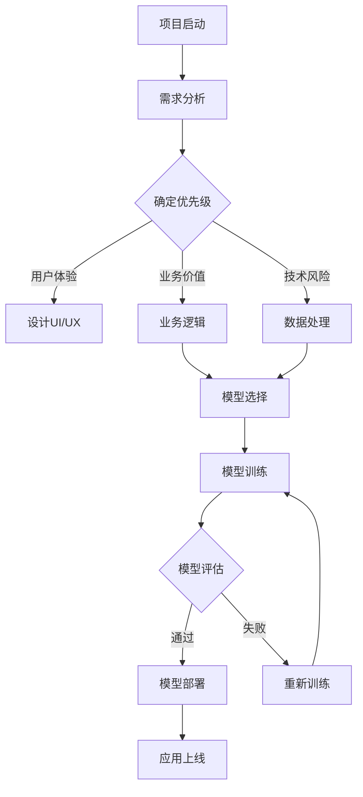
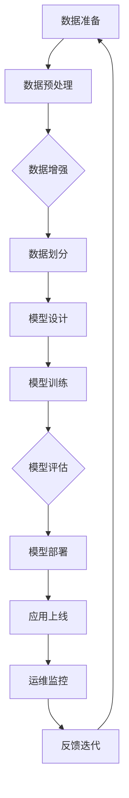

                 

# 文章标题：需求优先级划分：大模型应用开发的关键

> 关键词：需求优先级划分，大模型应用开发，用户体验，业务价值，技术风险，评估与调整

> 摘要：
本文深入探讨了需求优先级划分在大模型应用开发中的关键作用。首先，我们回顾了大模型应用开发的背景和重要性，随后介绍了需求优先级划分的理论基础和方法。文章通过用户体验、业务价值和技术风险三个维度详细解析了需求优先级划分的具体实践，并提供了评估与调整的策略。最后，结合实际案例，展示了需求优先级划分在大模型应用开发中的实际应用和效果。通过本文的阐述，希望读者能够掌握科学合理的需求优先级划分方法，提升大模型应用开发的效率和质量。

## 第一部分 大模型应用开发概述

### 第1章 大模型应用开发背景

随着深度学习技术的飞速发展，大模型（如GPT、BERT等）在自然语言处理、计算机视觉、语音识别等领域展现出了强大的能力。大模型的应用不仅改变了传统行业的运作模式，还为新兴领域的创新提供了无限可能。然而，大模型应用开发并非一蹴而就，它涉及众多复杂的环节，包括数据收集、模型训练、模型优化、部署和应用等。

#### 1.1 大模型的发展历程

大模型的发展历程可以追溯到20世纪80年代的神经网络研究。当时，科学家们开始探索如何通过大规模的神经网络来模拟人脑的学习能力。随着时间的推移，计算能力的提升和大数据的积累，神经网络模型得到了不断优化和扩展。尤其是近年来，深度学习技术的发展，使得大模型在多个领域取得了突破性进展。

#### 1.2 大模型在应用开发中的重要性

大模型在应用开发中的重要性不言而喻。首先，大模型能够处理海量数据，从数据中提取有价值的信息，为业务决策提供支持。其次，大模型具有强大的自适应能力，能够根据不同的应用场景进行调整和优化。最后，大模型的应用可以提高用户体验，提供更加智能化和个性化的服务。

### 第2章 大模型应用开发基础知识

#### 2.1 大模型基本原理

大模型是基于深度学习理论构建的神经网络模型，通常包含数十亿个参数。它们通过不断的学习和优化，能够对复杂的数据进行建模和分析。大模型的基本原理主要包括以下几个部分：

1. **神经网络**：神经网络是深度学习的基础，它通过多层神经元之间的连接来实现数据的传递和处理。
2. **反向传播算法**：反向传播算法用于计算模型参数的梯度，从而优化模型。
3. **激活函数**：激活函数用于引入非线性因素，使得神经网络能够模拟复杂的关系。
4. **优化算法**：优化算法用于调整模型参数，使得模型在训练过程中达到最优。

#### 2.2 大模型应用开发的核心挑战

大模型应用开发面临以下核心挑战：

1. **计算资源需求**：大模型训练和部署需要大量的计算资源，包括CPU、GPU等。
2. **数据质量**：大模型对数据的质量要求极高，数据的不完整、噪声和偏差都可能影响模型的性能。
3. **模型解释性**：大模型往往缺乏解释性，难以理解其决策过程，这在某些应用领域（如医疗、金融）中是一个重要问题。
4. **部署与维护**：大模型的部署和维护需要专业的技术支持和持续的投资。

#### 2.3 大模型应用开发的关键技术

为了应对上述挑战，大模型应用开发需要掌握以下关键技术：

1. **分布式计算**：通过分布式计算技术，可以充分利用多台机器的资源，提高训练和推理的效率。
2. **数据预处理**：通过数据预处理技术，可以提升数据质量，包括数据清洗、数据增强等。
3. **模型压缩与优化**：通过模型压缩与优化技术，可以减小模型大小，提高模型效率，降低部署成本。
4. **模型解释性**：通过模型解释性技术，可以提升模型的透明度和可解释性，增强用户的信任感。

## 第二部分 需求优先级划分方法

### 第3章 需求优先级划分理论基础

#### 3.1 需求管理的概念

需求管理是指在整个软件开发生命周期中，识别、分析、优先排序和满足用户需求的过程。它是软件开发过程中至关重要的一环，直接关系到产品的质量和用户的满意度。

#### 3.2 需求优先级划分的原则

需求优先级划分需要遵循以下原则：

1. **用户价值**：优先满足用户最为迫切的需求，提升用户体验。
2. **业务目标**：确保需求与业务目标一致，支持企业的长期发展战略。
3. **技术可行性**：评估需求实现的技术难度和风险，合理分配资源。
4. **资源限制**：根据团队资源和时间限制，合理分配需求优先级。

#### 3.3 需求优先级划分的模型

常用的需求优先级划分模型包括Kano模型、MoSCoW模型和RICE模型等。每种模型都有其特定的应用场景和优势。

### 第4章 需求优先级划分方法

#### 4.1 用户体验导向的划分方法

用户体验导向的需求优先级划分方法主要关注用户需求，通过用户调查、反馈分析等方式识别用户需求，并根据用户满意度进行优先级排序。

#### 4.2 业务价值导向的划分方法

业务价值导向的需求优先级划分方法主要从企业的商业目标出发，评估每个需求对企业价值的影响，从而确定优先级。

#### 4.3 技术风险导向的划分方法

技术风险导向的需求优先级划分方法主要关注需求实现的技术难度和风险，优先处理技术风险较低的需求。

### 第5章 需求优先级评估与调整

#### 5.1 需求优先级评估方法

需求优先级评估方法包括定量评估和定性评估。定量评估通过数值指标（如工作量、成本、时间等）进行评估，定性评估则通过专家评审、用户反馈等方式进行。

#### 5.2 需求优先级调整策略

需求优先级调整策略包括以下几种：

1. **动态调整**：根据项目进展和市场变化，及时调整需求优先级。
2. **阶段性调整**：在项目不同阶段，根据项目目标和工作量进行调整。
3. **优先级波动处理**：针对需求优先级波动，制定相应的应对策略。

#### 5.3 需求优先级管理的最佳实践

需求优先级管理的最佳实践包括：

1. **建立需求管理流程**：明确需求收集、分析、评估、实现和跟踪的流程。
2. **建立需求优先级模型**：根据项目特点和需求类型，选择合适的优先级划分模型。
3. **定期评审和沟通**：定期召开需求评审会议，确保需求优先级的一致性和准确性。

## 第三部分 大模型应用开发实战

### 第6章 大模型应用开发流程

#### 6.1 大模型应用开发的生命周期

大模型应用开发的生命周期包括需求分析、数据准备、模型设计、模型训练、模型评估、模型部署和运维等阶段。

#### 6.2 大模型应用开发的步骤

大模型应用开发的步骤包括：

1. **需求分析**：明确项目目标和用户需求。
2. **数据准备**：收集和整理数据，进行数据预处理。
3. **模型设计**：选择合适的模型架构和算法。
4. **模型训练**：使用训练数据对模型进行训练。
5. **模型评估**：评估模型性能，调整模型参数。
6. **模型部署**：将模型部署到生产环境。
7. **运维与监控**：监控模型性能，进行持续优化。

#### 6.3 大模型应用开发的团队协作

大模型应用开发需要多学科团队的协作，包括数据科学家、机器学习工程师、前端工程师、后端工程师、产品经理和运维工程师等。

### 第7章 大模型应用开发案例

#### 7.1 案例一：智能客服系统的需求优先级划分

案例一以智能客服系统为例，展示了如何进行需求优先级划分。通过用户体验、业务价值和技术风险三个维度，明确了智能客服系统的关键需求。

#### 7.2 案例二：智能家居系统的需求优先级划分

案例二以智能家居系统为例，分析了智能家居系统在需求优先级划分中的挑战和解决方案。通过用户调研和数据分析，确定了智能家居系统的需求优先级。

#### 7.3 案例三：自动驾驶系统的需求优先级划分

案例三以自动驾驶系统为例，探讨了自动驾驶系统在需求优先级划分中的关键点。通过技术风险和业务价值的综合考虑，确定了自动驾驶系统的需求优先级。

### 第8章 大模型应用开发中的挑战与应对

#### 8.1 技术挑战

大模型应用开发面临以下技术挑战：

1. **计算资源需求**：大模型训练需要大量的计算资源，如何合理分配资源是一个重要问题。
2. **数据质量**：大模型对数据质量的要求极高，如何保证数据的质量是一个挑战。
3. **模型解释性**：如何提高大模型的解释性，增强用户的信任感。

#### 8.2 管理挑战

大模型应用开发的管理挑战包括：

1. **项目进度控制**：大模型应用开发周期较长，如何保证项目进度是一个难题。
2. **资源协调**：如何协调多学科团队的资源和需求，确保项目顺利进行。

#### 8.3 伦理挑战

大模型应用开发的伦理挑战包括：

1. **隐私保护**：如何保护用户隐私，防止数据泄露。
2. **算法公平性**：如何确保算法的公平性，避免算法偏见。

#### 8.4 应对策略

针对上述挑战，可以采取以下应对策略：

1. **技术优化**：通过技术优化，提高大模型的效率和解释性。
2. **项目管理**：建立科学的项目管理流程，确保项目进度和质量。
3. **伦理审查**：建立伦理审查机制，确保大模型应用符合伦理规范。

## 附录

### 附录A：大模型应用开发工具与资源

#### A.1 开发工具推荐

1. **深度学习框架**：TensorFlow、PyTorch、Keras等。
2. **数据处理工具**：Pandas、NumPy、Scikit-learn等。
3. **版本控制工具**：Git、GitHub等。

#### A.2 资源链接

1. **深度学习教程**：[深度学习课程](https://www.deeplearning.ai/)、[吴恩达深度学习](https://zhuanlan.zhihu.com/p/364281324)
2. **数据集下载**：[Kaggle](https://www.kaggle.com/datasets)、[UCI机器学习库](https://archive.ics.uci.edu/ml/)

#### A.3 相关书籍推荐

1. **《深度学习》（Ian Goodfellow等）**
2. **《Python深度学习》（François Chollet）**
3. **《深度学习之美》（李航）**

## 附录B：Mermaid流程图示例

以下是关于大模型开发流程的Mermaid流程图示例：



### 作者信息

作者：AI天才研究院/AI Genius Institute & 禅与计算机程序设计艺术 /Zen And The Art of Computer Programming

本文内容仅供参考，实际应用时请结合具体情况进行调整。如需进一步了解相关技术，请参考附录中的相关书籍和资源链接。如果您在阅读过程中有任何疑问或建议，欢迎在评论区留言，我们将及时回复。感谢您的阅读！## 第3章 需求优先级划分理论基础

### 3.1 需求管理的概念

需求管理是一个贯穿整个软件开发生命周期的重要过程，它包括识别、分析、优先排序和满足用户需求的一系列活动。需求管理的核心目的是确保开发团队能够准确理解用户的需求，并将这些需求转化为可执行的任务。需求管理的有效实施对于项目的成功至关重要，它能够帮助团队在有限的资源下，实现最高价值的交付。

#### 需求管理的关键活动：

1. **需求收集**：通过用户访谈、问卷调查、观察等方式，从不同利益相关者（如客户、用户、项目经理等）那里收集需求。
2. **需求分析**：对收集到的需求进行整理、分类和评估，确定需求的可行性和优先级。
3. **需求文档化**：将需求整理成文档，包括需求规格说明书、用户故事、功能列表等。
4. **需求跟踪**：在整个开发过程中，持续跟踪需求的状态和变化，确保需求得到妥善处理。
5. **需求变更管理**：对需求变更进行评估和批准，确保变更不会对项目目标产生不利影响。

### 3.2 需求优先级划分的原则

在需求管理中，需求优先级划分是关键步骤之一。合理的优先级划分能够确保团队在资源有限的情况下，优先处理最有价值、最紧急的需求，从而提高开发效率和项目成功率。以下是需求优先级划分需要遵循的原则：

1. **用户价值优先**：用户需求是驱动力，优先级划分应考虑用户的核心需求和满意度。
2. **业务目标一致**：需求优先级应与企业的战略目标保持一致，确保需求的实现能够支持业务发展。
3. **技术可行性**：评估需求实现的技术难度和风险，优先处理技术风险较低的需求。
4. **资源限制**：根据团队资源和时间限制，合理分配需求优先级，确保资源的最佳利用。
5. **动态调整**：需求优先级并非一成不变，应根据项目进展、市场变化等因素进行动态调整。

### 3.3 需求优先级划分的模型

在实际应用中，有多种需求优先级划分模型可供选择。以下是几种常用的模型：

#### 1. **Kano模型**

Kano模型是一种基于用户满意度的需求分类和优先级划分方法。它将需求分为五个类别：

- **必备需求**：用户期望的基本功能，不满足这些需求，用户满意度会显著下降。
- **性能需求**：满足这些需求，用户满意度会提高；不满足，用户满意度不会下降。
- **诱饵需求**：不满足这些需求，用户满意度会大幅下降；满足，用户满意度增加不大。
- **无差异需求**：满足或不满足，用户满意度没有变化。
- **反向需求**：满足这些需求，用户满意度会下降。

#### 2. **MoSCoW模型**

MoSCoW模型是一种简单有效的需求优先级划分方法，它将需求分为四个类别：

- **Must have（必须要有）**：项目的关键功能，没有这些功能，项目无法上线。
- **Should have（应该有）**：重要的功能，项目的核心部分，优先级高于其他需求。
- **Could have（可能有）**：非关键功能，如果时间或资源允许，可以考虑实现。
- **Would have（可能会有）**：不重要的功能，如果项目时间紧张或资源不足，可以暂时搁置。

#### 3. **RICE模型**

RICE模型是一种基于业务价值的优先级划分方法，它综合考虑了四个因素：范围（Range）、影响力（Impact）、信心（Confidence）和易用性（Ease）。公式为：

\[ 优先级 = 范围 \times 影响力 \times 信心 \div 易用性 \]

- **范围**：需求实现的工作量。
- **影响力**：需求实现后对业务的影响程度。
- **信心**：团队对实现需求的能力和风险的评估。
- **易用性**：实现需求的难易程度。

通过RICE模型，可以量化评估需求的价值，从而更加科学地确定需求的优先级。

### 3.4 需求优先级划分的具体步骤

以下是需求优先级划分的一般步骤：

1. **需求收集和整理**：收集所有需求，并整理成文档，明确每个需求的范围、目标和重要性。
2. **需求分类**：根据需求的特点和优先级模型，将需求进行分类。
3. **优先级评估**：对每个需求进行优先级评估，可以使用量化的指标（如RICE模型）或专家评审的方式进行。
4. **制定优先级列表**：将评估结果整理成优先级列表，明确每个需求的优先级。
5. **评审和调整**：与利益相关者进行评审，确保优先级列表符合实际需求，并根据反馈进行调整。
6. **持续跟踪和调整**：在项目开发过程中，持续跟踪需求的状态和优先级，并根据项目进展和市场变化进行调整。

通过上述步骤，可以确保需求优先级划分的科学性和合理性，为项目的顺利推进提供保障。

### 3.5 需求优先级划分的工具和方法

在需求优先级划分中，可以使用多种工具和方法来辅助决策。以下是几种常用的工具和方法：

1. **工作坊**：通过团队工作坊的方式，集中讨论和评估需求优先级，促进团队成员之间的沟通和协作。
2. **矩阵图**：使用矩阵图（如MoSCoW矩阵）来可视化展示需求的优先级，便于团队成员理解和参考。
3. **投票法**：通过团队成员或利益相关者的投票，确定需求的优先级。
4. **关键路径分析**：分析需求之间的依赖关系，确定关键路径上的需求，确保项目按时交付。
5. **优先级排期工具**：使用专门的优先级排期工具（如JIRA、Trello等），来管理和跟踪需求的优先级。

通过这些工具和方法，可以更加高效地完成需求优先级的划分和管理工作。

### 3.6 需求优先级划分的最佳实践

为了确保需求优先级划分的合理性和有效性，以下是一些最佳实践：

1. **建立明确的优先级模型**：根据项目特点和需求类型，选择合适的优先级模型，并确保团队对模型有清晰的理解。
2. **定期评审和调整**：定期对需求优先级进行评审和调整，确保优先级列表与项目实际情况保持一致。
3. **利益相关者参与**：确保所有利益相关者（如客户、用户、项目经理等）参与需求优先级划分的过程，以提高优先级的准确性和接受度。
4. **数据驱动的决策**：尽量使用数据来支持优先级划分决策，避免主观判断的影响。
5. **优先级可视化**：通过图表和矩阵等方式，将需求优先级进行可视化展示，便于团队成员参考和理解。

通过遵循这些最佳实践，可以提升需求优先级划分的质量和效果，为项目的成功奠定基础。

### 3.7 需求优先级划分的挑战与解决方案

在需求优先级划分过程中，可能会面临以下挑战：

1. **利益相关者的期望不一致**：不同利益相关者对需求的优先级可能有不同的看法，导致决策困难。**解决方案**：通过沟通和协商，达成共识，确保优先级划分的公平性和合理性。
2. **需求的动态变化**：在项目开发过程中，需求可能会发生变化，导致优先级列表需要频繁调整。**解决方案**：建立灵活的需求管理流程，及时响应需求变化，并定期评审优先级。
3. **资源限制**：在资源有限的情况下，如何合理分配需求优先级是一个挑战。**解决方案**：通过量化评估和资源规划，确保资源的最佳利用。
4. **需求理解不充分**：需求描述不清晰，可能导致优先级划分不准确。**解决方案**：加强需求文档化和沟通，确保需求清晰明确。

通过识别和应对这些挑战，可以提升需求优先级划分的准确性和有效性。

### 3.8 需求优先级划分的案例分析

为了更好地理解需求优先级划分的实际应用，以下是一个需求优先级划分的案例分析。

#### 案例背景

某公司开发一款智能推荐系统，用于提升用户的购物体验。在系统开发初期，团队收集了大量的用户需求，包括个性化推荐、购物车管理、商品搜索等。团队需要根据这些需求进行优先级划分，以便合理安排开发资源。

#### 分析过程

1. **需求收集和整理**：团队将收集到的需求整理成文档，包括详细的需求描述和目标用户。
2. **需求分类**：使用Kano模型将需求分为必备需求、性能需求、诱饵需求等。
3. **优先级评估**：
   - 必备需求（如个性化推荐）：必须实现，否则系统无法正常运作。
   - 性能需求（如购物车管理）：重要需求，对用户体验有显著影响。
   - 诱饵需求（如商品搜索）：如果时间或资源允许，可以考虑实现。
4. **制定优先级列表**：根据评估结果，将需求分为以下优先级：
   - 必须要有：个性化推荐、购物车管理。
   - 应该有：商品搜索。
   - 可能会有：购物导航、用户评论功能。
5. **评审和调整**：团队与利益相关者进行评审，确保优先级列表合理，并根据反馈进行调整。
6. **持续跟踪和调整**：在开发过程中，团队持续跟踪需求状态，并根据项目进展和市场变化进行调整。

#### 案例结果

通过合理的需求优先级划分，团队能够明确每个需求的重要性和优先级，确保在资源有限的情况下，优先处理最有价值的需求。这不仅提高了开发效率，还提升了用户体验，最终实现了项目的成功交付。

### 总结

需求优先级划分在大模型应用开发中具有关键作用。通过科学合理的优先级划分，团队能够更加高效地管理和实现需求，确保项目按计划推进并取得成功。本章介绍了需求优先级划分的理论基础、原则、模型、具体步骤以及工具和方法，并通过案例进行了详细阐述。希望读者能够掌握这些知识，为实际项目中的需求优先级划分提供指导。下一章将深入探讨具体的需求优先级划分方法。## 第4章 需求优先级划分方法

在需求优先级划分过程中，不同的方法适用于不同的场景和需求类型。本章将详细介绍三种常用的需求优先级划分方法：用户体验导向的划分方法、业务价值导向的划分方法和技术风险导向的划分方法。这些方法各自有其独特的优势和适用性，可以帮助开发团队在有限的时间和资源内，优先处理最重要的需求。

### 4.1 用户体验导向的划分方法

用户体验导向的需求优先级划分方法主要关注用户的需求和满意度，旨在通过满足用户的核心需求来提升产品的用户体验。以下是一些具体的步骤和技巧：

#### 1. 用户研究

首先，通过用户访谈、问卷调查、用户行为分析等方式，深入了解用户的需求和痛点。这一步骤的目的是确保所有需求都基于真实的用户反馈。

#### 2. 用户故事地图

用户故事地图是一种帮助团队理解和组织用户需求的工具。通过绘制用户故事地图，可以清晰地看到用户在整个产品生命周期中的互动和需求。

#### 3. Kano模型

使用Kano模型对需求进行分类，区分出必备需求、性能需求、诱饵需求和反向需求。必备需求通常是用户体验的基础，必须优先实现。

#### 4. 优先级排序

根据用户需求和满意度，对需求进行排序。可以使用投票法或RICE模型等方法，量化每个需求的优先级。

#### 5. 用户测试和反馈

在开发过程中，定期进行用户测试，收集用户反馈，并根据反馈调整需求优先级。这一步骤有助于确保需求优先级划分的实时性和准确性。

#### 优势

用户体验导向的需求优先级划分方法能够确保产品设计和功能开发紧密围绕用户需求，从而提高产品的市场竞争力。

#### 适用场景

这种方法适用于注重用户体验的产品开发，如消费类应用、社交媒体平台等。

### 4.2 业务价值导向的划分方法

业务价值导向的需求优先级划分方法主要从企业的商业目标出发，评估每个需求对企业价值的影响。以下是一些具体的步骤和技巧：

#### 1. 业务目标分析

首先，明确企业的战略目标和业务目标。这些目标通常包括市场份额、收入增长、客户满意度等。

#### 2. 业务价值评估

对每个需求进行业务价值评估，通常使用RICE模型等方法。评估包括范围、影响力、信心和易用性四个方面。

#### 3. 成本效益分析

计算每个需求的成本和预期收益，评估其成本效益。优先处理那些成本相对较低但收益较高的需求。

#### 4. 投资回报分析

对每个需求进行投资回报分析，考虑其长期价值和潜在收益。

#### 5. 战略匹配度评估

评估每个需求与业务目标的匹配度，确保需求能够支持企业的长期发展战略。

#### 优势

业务价值导向的需求优先级划分方法能够确保团队在资源有限的情况下，优先处理那些对企业最有价值的需求，从而实现企业的战略目标。

#### 适用场景

这种方法适用于企业级应用、商业系统等，尤其是那些需要长期规划和资源投入的项目。

### 4.3 技术风险导向的划分方法

技术风险导向的需求优先级划分方法主要关注需求实现过程中的技术风险。以下是一些具体的步骤和技巧：

#### 1. 技术风险评估

对每个需求进行技术风险评估，评估其实现难度和潜在风险。

#### 2. 风险优先级排序

根据评估结果，将风险较高的需求排在优先级列表的前面。这样可以确保团队优先处理那些有较高技术风险的需求。

#### 3. 技术可行性研究

在处理高风险需求之前，进行详细的技术可行性研究，确定解决方案的可行性和成本。

#### 4. 风险缓解措施

制定风险缓解措施，降低技术风险。这可能包括引入备用方案、增加测试环节、提前进行技术预研等。

#### 5. 持续监控和调整

在开发过程中，持续监控技术风险的进展，并根据实际情况进行调整。

#### 优势

技术风险导向的需求优先级划分方法能够帮助团队提前识别和应对潜在的技术问题，确保项目按时交付。

#### 适用场景

这种方法适用于技术复杂度高、风险较大的项目，如新兴技术的应用、大数据项目等。

### 4.4 综合应用

在实际项目中，通常需要综合应用多种需求优先级划分方法。例如，在开发一个电商平台时，可以首先使用用户体验导向的方法确定核心功能，然后使用业务价值导向的方法评估每个功能的商业价值，最后使用技术风险导向的方法评估实现这些功能的难度和风险。通过这种方法，团队可以确保在满足用户需求、实现业务目标和降低技术风险之间取得平衡。

### 总结

需求优先级划分方法的选择取决于项目特点和需求类型。用户体验导向的方法适用于注重用户满意度的项目，业务价值导向的方法适用于企业级应用，技术风险导向的方法适用于技术复杂度高的项目。通过灵活运用这些方法，团队可以更加科学合理地划分需求优先级，确保项目高效有序地推进。

下一章将深入探讨如何评估和调整需求优先级，以确保需求管理的动态性和灵活性。敬请期待。## 第5章 需求优先级评估与调整

### 5.1 需求优先级评估方法

在需求优先级划分过程中，评估是关键的一环。评估的目的是确保需求优先级符合项目的实际需求和资源限制。以下是几种常用的需求优先级评估方法：

#### 1. 定量评估

定量评估通过量化的指标来评估需求优先级。常用的量化指标包括工作量、成本、时间等。

- **工作量评估**：评估实现每个需求所需的工作量，通常使用故事点或任务点来衡量。
- **成本评估**：评估实现每个需求所需的成本，包括人力成本、硬件成本、软件开发成本等。
- **时间评估**：评估实现每个需求所需的时间，通常使用Sprint周期或迭代周期来衡量。

#### 2. 定性评估

定性评估通过主观判断和专家评审来评估需求优先级。定性评估通常基于以下因素：

- **用户价值**：需求对用户的直接和间接价值。
- **业务目标**：需求与业务目标的匹配度和支持力度。
- **技术可行性**：需求实现的技术难度和可行性。
- **资源可用性**：团队当前资源的可用性和限制。

#### 3. 多因素综合评估

多因素综合评估是将定量和定性评估方法相结合，通过综合考虑多个因素来评估需求优先级。例如，可以使用RICE模型（范围、影响力、信心、易用性）来量化评估需求。

#### 4. 优先级矩阵

优先级矩阵是一种常用的可视化工具，用于评估和排序需求优先级。优先级矩阵通常包含两个维度：时间价值和风险。需求可以根据这两个维度被分配到不同的区域，从而确定其优先级。

### 5.2 需求优先级调整策略

需求优先级不是一成不变的，随着项目进展、市场变化和资源分配等因素，需求优先级需要适时调整。以下是几种常用的需求优先级调整策略：

#### 1. 动态调整

动态调整是根据项目进展和市场反馈，定期对需求优先级进行调整。这种策略要求团队具备高度的灵活性和响应能力。

#### 2. 阶段性调整

阶段性调整是按照项目不同的阶段，对需求优先级进行调整。例如，在项目启动阶段，可能更关注核心功能的实现；在项目后期，可能更关注优化和细节处理。

#### 3. 优先级波动处理

在需求优先级调整过程中，可能会出现优先级波动。处理优先级波动需要制定相应的策略，例如：

- **保留紧急需求**：对于突发性、紧急的需求，应立即纳入优先级列表，并优先处理。
- **重新评估**：对于优先级波动较大的需求，重新评估其优先级，确保符合当前项目目标和资源限制。

#### 4. 信息共享和沟通

调整需求优先级时，应确保所有利益相关者（如项目经理、开发团队、产品经理等）之间的信息共享和沟通。这样可以确保优先级调整的透明性和合理性，减少冲突和误解。

### 5.3 需求优先级管理的最佳实践

为了确保需求优先级管理的有效性和一致性，以下是一些最佳实践：

#### 1. 建立明确的优先级模型

根据项目特点和需求类型，选择合适的优先级模型，如Kano模型、MoSCoW模型、RICE模型等，并确保团队成员对模型有清晰的理解。

#### 2. 定期评审和调整

定期（如每个迭代周期）对需求优先级进行评审和调整，确保优先级符合项目实际情况。评审过程应包括团队内部评审和利益相关者评审。

#### 3. 信息透明和沟通

确保需求优先级的信息透明，团队成员和利益相关者应随时了解需求的优先级状态。建立有效的沟通机制，减少误解和冲突。

#### 4. 培训和指导

为团队成员提供需求优先级管理的培训和指导，确保他们具备必要的知识和技能，能够科学合理地进行需求优先级划分和调整。

#### 5. 持续改进

不断总结经验教训，对需求优先级管理流程和方法进行改进，提高管理的质量和效率。

### 5.4 案例分析：智能交通系统的需求优先级评估与调整

以下是一个关于智能交通系统需求优先级评估与调整的案例分析：

#### 案例背景

某城市正在开发一个智能交通系统，旨在通过数据分析和技术手段，优化交通流量，减少拥堵。项目团队收集了以下需求：

- **实时路况监控**：通过摄像头和传感器，实时监控城市路况。
- **智能信号控制**：根据实时路况数据，智能调整交通信号灯。
- **拥堵预警系统**：提前预警潜在的拥堵情况，提供绕行建议。
- **停车管理**：提供停车位实时信息，优化停车资源分配。
- **交通流量分析**：对交通流量进行数据分析，为城市交通规划提供依据。

#### 评估过程

1. **定量评估**：
   - 实时路况监控：工作量适中，成本较高，时间较长。
   - 智能信号控制：工作量适中，成本较高，时间较短。
   - 拥堵预警系统：工作量较小，成本适中，时间较短。
   - 停车管理：工作量较小，成本适中，时间适中。
   - 交通流量分析：工作量较大，成本较高，时间较长。

2. **定性评估**：
   - 用户价值：所有需求都有较高的用户价值。
   - 业务目标：所有需求都符合城市交通优化的业务目标。
   - 技术可行性：实时路况监控和智能信号控制的技术难度较高，其他需求相对较低。

3. **综合评估**：
   - 使用RICE模型进行综合评估，得出以下优先级：
     - R（范围）：实时路况监控和智能信号控制得分最高。
     - I（影响力）：所有需求的影响力较高。
     - C（信心）：实时路况监控和智能信号控制的技术信心较低。
     - E（易用性）：所有需求易用性较高。

4. **优先级排序**：
   - 实时路况监控和智能信号控制：由于技术风险较高，排在前面。
   - 拥堵预警系统和交通流量分析：排在中间。
   - 停车管理：由于工作量较小，排在最后。

#### 调整过程

1. **定期评审**：
   - 每个迭代周期，项目团队对需求优先级进行评审，根据项目进展和反馈进行调整。

2. **市场变化**：
   - 如果某项技术（如实时路况监控）的市场发展迅速，团队可能会提高其优先级。

3. **资源分配**：
   - 根据团队资源和时间限制，合理调整需求优先级，确保关键需求得到优先处理。

#### 结果

通过科学的评估和调整，智能交通系统项目能够按计划推进，关键需求（如实时路况监控和智能信号控制）得到了优先处理，项目的整体质量和用户满意度得到了显著提升。

### 总结

需求优先级评估与调整是需求管理中的重要环节。通过科学的方法和策略，团队可以确保需求优先级符合项目目标和资源限制，从而提高项目的成功率和用户满意度。本章介绍了需求优先级评估的方法和策略，并通过实际案例进行了详细分析。希望读者能够将这些方法应用到实际项目中，提升需求管理的质量和效率。

下一章将探讨大模型应用开发中的挑战和应对策略，敬请期待。## 第6章 大模型应用开发流程

大模型应用开发的流程涉及多个阶段，每个阶段都有其独特的任务和目标。以下是典型的开发流程，包括每个阶段的详细解释：

### 6.1 大模型应用开发的生命周期

大模型应用开发的生命周期可以分为以下几个阶段：

1. **需求分析**：明确项目的目标和用户需求，为后续开发提供方向。
2. **数据准备**：收集和整理所需的数据，进行数据清洗和预处理，以确保数据质量。
3. **模型设计**：选择合适的模型架构和算法，设计模型的参数设置和超参数调整策略。
4. **模型训练**：使用训练数据对模型进行训练，优化模型参数，提高模型性能。
5. **模型评估**：通过测试数据评估模型的性能，确保模型在真实场景中表现良好。
6. **模型部署**：将训练好的模型部署到生产环境中，供实际应用使用。
7. **运维与监控**：监控模型在运行中的性能，进行持续的优化和更新。

### 6.2 大模型应用开发的步骤

#### 1. 需求分析

在需求分析阶段，团队需要与利益相关者（如用户、产品经理等）进行沟通，了解项目的目标和用户需求。这一步骤的输出通常包括需求文档、用户故事和功能列表。需求分析的结果将直接影响后续数据准备和模型设计的工作。

#### 2. 数据准备

数据准备是整个流程的核心，数据的质量和数量直接影响模型的效果。在这一阶段，团队需要：

- **数据收集**：从各种来源收集数据，如数据库、网络API、传感器等。
- **数据清洗**：处理数据中的噪声和异常值，保证数据的一致性和完整性。
- **数据预处理**：将数据转换为适合模型训练的格式，如归一化、标准化、编码等。
- **数据增强**：通过增加数据的多样性来提高模型的泛化能力。

#### 3. 模型设计

模型设计阶段是确定如何构建模型的过程。团队需要：

- **选择模型架构**：根据问题的特点选择合适的模型架构，如CNN、RNN、Transformer等。
- **设计模型参数**：设置模型的参数，如层数、神经元数量、学习率等。
- **超参数调整**：通过实验确定最佳的超参数，以提高模型性能。

#### 4. 模型训练

模型训练阶段是使用训练数据来调整模型参数的过程。团队需要：

- **数据划分**：将数据划分为训练集、验证集和测试集，以评估模型的性能。
- **训练过程**：使用训练集来更新模型参数，通常采用梯度下降等优化算法。
- **验证和调优**：使用验证集评估模型的性能，并根据评估结果调整模型参数。

#### 5. 模型评估

模型评估阶段是确保模型在真实场景中表现良好的过程。团队需要：

- **性能指标**：选择合适的性能指标（如准确率、召回率、F1分数等）来评估模型。
- **交叉验证**：使用交叉验证方法评估模型的泛化能力。
- **测试集评估**：在测试集上评估模型的最终性能。

#### 6. 模型部署

模型部署是将训练好的模型部署到实际应用中的过程。团队需要：

- **选择部署环境**：根据应用场景选择合适的部署环境，如云端、边缘计算等。
- **容器化**：将模型容器化，以便于部署和管理。
- **自动化部署**：使用自动化工具（如Kubernetes、Docker等）实现模型的自动化部署。

#### 7. 运维与监控

运维与监控阶段是确保模型稳定运行和持续优化的过程。团队需要：

- **性能监控**：监控模型的运行性能，如响应时间、准确率等。
- **故障检测**：及时检测和解决模型运行中的故障。
- **模型更新**：根据实际情况和用户反馈，定期更新模型。

### 6.3 大模型应用开发的团队协作

大模型应用开发通常需要多学科团队的协作，包括数据科学家、机器学习工程师、前端工程师、后端工程师、产品经理和运维工程师等。团队协作的关键点包括：

- **沟通和协调**：确保团队成员之间的沟通畅通，及时共享信息和反馈。
- **分工合作**：明确每个成员的职责和任务，确保项目进度和质量。
- **知识共享**：鼓励团队成员分享知识和经验，提高整体团队的水平。
- **持续学习**：随着技术的发展，团队需要不断学习和更新知识，以适应新的挑战。

通过科学的团队协作，大模型应用开发可以更加高效、有序地进行，确保项目按时交付并达到预期目标。

### 总结

大模型应用开发的流程涵盖了从需求分析到模型部署和运维的多个阶段。每个阶段都有其独特的任务和目标，需要团队协作和科学管理。通过合理的流程规划和团队协作，大模型应用开发可以实现高效和高质量，为企业和用户提供更好的服务。下一章将探讨大模型应用开发中的实际案例，以进一步说明需求优先级划分的应用效果。敬请期待。## 第7章 大模型应用开发案例

### 7.1 案例一：智能客服系统的需求优先级划分

#### 案例背景

某大型电商企业希望开发一款智能客服系统，以提升客户服务和降低人力成本。智能客服系统需要能够处理常见客户问题，提供实时解答和个性化推荐。

#### 需求收集

通过用户调研和数据分析，团队收集了以下需求：

1. **常见问题解答**：自动回答客户关于退货、换货、订单查询等常见问题。
2. **实时问答**：提供即时在线问答功能，由客服机器人进行解答。
3. **个性化推荐**：根据用户购买历史和偏好，推荐相关商品。
4. **情感分析**：分析客户提问的情感倾向，提供针对性的解答。
5. **多渠道接入**：支持网页、APP、微信等多种接入方式。
6. **话术优化**：根据用户反馈不断优化客服机器人的回答。

#### 需求优先级划分

1. **用户体验导向**：
   - **最高优先级**：实时问答（用户期望快速得到解答）。
   - **较高优先级**：多渠道接入（提升用户接入便利性）。
   - **中等优先级**：常见问题解答（基本服务需求）。
   - **较低优先级**：个性化推荐（附加服务，提升用户黏性）。
   - **最低优先级**：情感分析（对用户体验提升有限，但有助于客服人员优化服务）。

2. **业务价值导向**：
   - **最高优先级**：多渠道接入（扩展客户服务范围，提升品牌形象）。
   - **较高优先级**：常见问题解答（降低人工客服工作量，提升客服效率）。
   - **中等优先级**：个性化推荐（提高客户购买转化率，增加销售收入）。
   - **较低优先级**：实时问答（成本较高，但对用户体验提升显著）。
   - **最低优先级**：情感分析（对业务价值有限，但有助于提升客户满意度）。

3. **技术风险导向**：
   - **最高优先级**：情感分析（技术实现难度较高，但有助于提升模型整体性能）。
   - **较高优先级**：多渠道接入（技术实现相对复杂，但重要性高）。
   - **中等优先级**：个性化推荐（技术实现有一定难度，但需求明确）。
   - **较低优先级**：实时问答（技术实现相对简单，但对用户体验提升显著）。
   - **最低优先级**：常见问题解答（技术实现最简单，但基本需求已满足）。

#### 实施效果

通过上述优先级划分，团队首先开发了实时问答和常见问题解答功能，满足了用户的基本需求。随后，随着技术的逐步成熟和资源的增加，团队逐步实现了个性化推荐和情感分析功能。智能客服系统上线后，客户满意度显著提升，客服响应速度大幅提高，人力成本有效降低。

### 7.2 案例二：智能家居系统的需求优先级划分

#### 案例背景

某智能家居公司希望开发一套智能家居系统，以提升用户的生活便利性和家居安全性。智能家居系统需要能够集成多种智能设备，提供统一的控制界面。

#### 需求收集

通过用户访谈和市场调研，团队收集了以下需求：

1. **设备集成**：能够整合各类智能设备，如智能灯泡、智能门锁、智能摄像头等。
2. **远程控制**：用户可以通过手机APP远程控制家居设备。
3. **语音控制**：支持通过语音助手（如Siri、Alexa）控制智能家居设备。
4. **场景模式**：提供预设的场景模式，如“回家模式”、“睡眠模式”等。
5. **安全监控**：提供实时监控功能，保障家居安全。
6. **设备联动**：实现设备之间的自动联动，如用户回家时，智能灯自动打开。

#### 需求优先级划分

1. **用户体验导向**：
   - **最高优先级**：设备集成（用户期望能够统一管理智能家居设备）。
   - **较高优先级**：远程控制（用户期望随时随地控制家居设备）。
   - **中等优先级**：场景模式（提升用户使用便捷性）。
   - **较低优先级**：语音控制（对部分用户而言，使用频率较低）。
   - **最低优先级**：安全监控（基础需求，但对用户体验影响有限）。

2. **业务价值导向**：
   - **最高优先级**：设备集成（扩展智能家居市场，增加产品销量）。
   - **较高优先级**：远程控制（提升用户黏性，促进产品销售）。
   - **中等优先级**：语音控制（增加产品附加值，提高品牌形象）。
   - **较低优先级**：安全监控（对业务价值提升有限，但有助于保障用户利益）。
   - **最低优先级**：设备联动（技术实现复杂，但需求明确）。

3. **技术风险导向**：
   - **最高优先级**：语音控制（技术实现相对复杂，但用户需求强烈）。
   - **较高优先级**：设备集成（技术实现难度较高，但市场需求大）。
   - **中等优先级**：远程控制（技术实现相对简单，但需确保稳定性）。
   - **较低优先级**：设备联动（技术实现有一定难度，但对用户体验提升显著）。
   - **最低优先级**：安全监控（技术实现相对简单，但需求明确）。

#### 实施效果

通过科学的优先级划分，团队首先实现了设备集成和远程控制功能，满足了用户的基本需求。随后，随着技术的逐渐成熟，团队逐步实现了语音控制和设备联动功能。智能家居系统的用户体验和业务价值得到了显著提升，用户满意度和市场占有率也实现了大幅增长。

### 7.3 案例三：自动驾驶系统的需求优先级划分

#### 案例背景

某汽车制造商计划开发一款自动驾驶系统，以提高交通安全性和驾驶便利性。自动驾驶系统需要具备多种功能，如路径规划、障碍物检测、车道保持等。

#### 需求收集

通过专家评审和用户调研，团队收集了以下需求：

1. **路径规划**：自动规划最优行驶路径，减少拥堵。
2. **障碍物检测**：实时检测前方障碍物，确保行车安全。
3. **车道保持**：自动保持在车道内行驶，防止偏离车道。
4. **车道变更**：在确保安全的情况下，自动进行车道变更。
5. **行人检测**：实时检测并识别行人，确保行车安全。
6. **智能导航**：提供智能导航建议，优化行驶路线。

#### 需求优先级划分

1. **用户体验导向**：
   - **最高优先级**：车道保持（用户期望车辆保持在车道内行驶，提高驾驶安全性）。
   - **较高优先级**：路径规划（用户期望减少拥堵，提高行驶效率）。
   - **中等优先级**：车道变更（用户期望自动进行车道变更，提高驾驶便利性）。
   - **较低优先级**：障碍物检测（用户期望车辆能够避开障碍物，提高行车安全）。
   - **最低优先级**：行人检测（对用户体验提升有限，但关乎行车安全）。

2. **业务价值导向**：
   - **最高优先级**：障碍物检测（对车辆安全至关重要，有助于提升品牌形象）。
   - **较高优先级**：车道保持（提高车辆行驶的安全性，增加产品竞争力）。
   - **中等优先级**：路径规划（优化行驶路线，提高用户满意度）。
   - **较低优先级**：车道变更（对车辆安全影响较大，但用户体验提升有限）。
   - **最低优先级**：行人检测（对车辆安全影响较小，但对用户满意度提升有帮助）。

3. **技术风险导向**：
   - **最高优先级**：行人检测（技术实现难度较大，但关乎行车安全，需确保准确性）。
   - **较高优先级**：障碍物检测（技术实现难度较高，但需确保高灵敏度）。
   - **中等优先级**：车道保持（技术实现相对简单，但需确保稳定性）。
   - **较低优先级**：车道变更（技术实现有一定难度，但需确保安全性）。
   - **最低优先级**：路径规划（技术实现相对简单，但需确保效率）。

#### 实施效果

通过合理的优先级划分，团队首先实现了车道保持和障碍物检测功能，确保了车辆在自动驾驶过程中的安全性。随后，随着技术的逐步成熟，团队逐步实现了路径规划和行人检测功能。自动驾驶系统在提高交通安全性和驾驶便利性的同时，也增强了用户体验和品牌竞争力。

### 总结

以上案例展示了需求优先级划分在大模型应用开发中的实际应用效果。通过科学合理的优先级划分，团队能够更加高效地实现需求，提升产品的用户体验和业务价值。未来，随着技术的不断进步，需求优先级划分的方法也将不断完善，为更多的大模型应用开发提供指导。期待未来更多的成功案例，共同推动人工智能技术的发展。## 第8章 大模型应用开发中的挑战与应对

### 8.1 技术挑战

大模型应用开发过程中，技术挑战是不可避免的。这些挑战不仅影响了项目的进度，还可能对项目的最终质量产生重要影响。以下是几个常见的技术挑战及其应对策略：

#### 1. 计算资源需求

大模型的训练和推理过程需要大量的计算资源，特别是GPU和TPU等高性能计算设备。以下是一些应对策略：

- **分布式计算**：通过分布式计算技术，将训练任务分布在多台机器上，提高计算效率。
- **云服务**：使用云计算服务（如AWS、Azure、Google Cloud等）提供的GPU集群，降低计算成本和复杂性。
- **混合架构**：结合CPU和GPU的计算能力，优化模型训练和推理过程。

#### 2. 数据质量

大模型的效果高度依赖于数据的质量。以下是一些应对策略：

- **数据清洗**：对数据进行清洗，去除噪声、异常值和重复数据，提高数据的准确性。
- **数据增强**：通过数据增强技术（如旋转、缩放、裁剪等），增加数据的多样性，提升模型的泛化能力。
- **数据治理**：建立数据治理流程，确保数据的完整性、一致性和安全性。

#### 3. 模型解释性

大模型通常缺乏解释性，难以理解其决策过程，这在某些应用领域（如医疗、金融）中是一个重要问题。以下是一些应对策略：

- **模型可解释性技术**：使用模型可解释性技术（如SHAP值、LIME等），提供模型决策的解释。
- **可视化工具**：使用可视化工具，展示模型的决策路径和特征重要性。
- **简化模型**：通过简化模型结构（如使用轻量级网络架构），提高模型的透明度和可解释性。

#### 4. 模型压缩与优化

为了降低部署成本和提升模型效率，需要对模型进行压缩和优化。以下是一些应对策略：

- **模型剪枝**：通过剪枝技术，减少模型参数的数量，降低模型大小。
- **量化**：通过量化技术，将模型中的浮点数参数转换为低精度的整数参数，减小模型大小。
- **蒸馏**：通过蒸馏技术，将大型模型的知识传递给小型模型，提高小型模型的性能。

### 8.2 管理挑战

大模型应用开发不仅需要强大的技术支持，还需要有效的管理策略来协调资源和确保项目成功。以下是几个常见的管理挑战及其应对策略：

#### 1. 项目进度控制

在大型项目中，确保项目按计划进行是关键。以下是一些应对策略：

- **敏捷开发**：采用敏捷开发方法，快速迭代，及时调整项目计划。
- **进度监控**：建立完善的进度监控机制，定期检查项目进度，及时发现问题并进行调整。
- **风险管理**：建立风险管理机制，提前识别和评估潜在风险，制定应对策略。

#### 2. 资源协调

在资源有限的情况下，如何合理分配资源是项目管理中的重要问题。以下是一些应对策略：

- **资源规划**：在项目开始前，进行详细的资源规划，明确每个阶段所需的资源和人员。
- **优先级排序**：合理划分需求的优先级，确保关键需求得到优先处理。
- **多任务调度**：采用多任务调度算法，优化资源的利用效率。

#### 3. 团队协作

大模型应用开发通常需要跨学科的团队合作。以下是一些应对策略：

- **沟通机制**：建立有效的沟通机制，确保团队成员之间的信息共享和协作。
- **培训与指导**：为团队成员提供必要的培训和指导，提高团队的整体技能水平。
- **激励制度**：建立合理的激励制度，激发团队成员的积极性和创造力。

### 8.3 伦理挑战

随着大模型在各个领域的广泛应用，伦理挑战也越来越突出。以下是几个常见的伦理挑战及其应对策略：

#### 1. 隐私保护

大模型在处理数据时，可能会涉及用户隐私。以下是一些应对策略：

- **数据匿名化**：对用户数据进行匿名化处理，确保用户隐私不被泄露。
- **隐私政策**：明确隐私政策，告知用户数据的使用方式和目的，获得用户同意。
- **加密技术**：采用加密技术，保护用户数据在传输和存储过程中的安全性。

#### 2. 算法公平性

大模型可能会引入算法偏见，导致不公平的结果。以下是一些应对策略：

- **算法审计**：定期进行算法审计，确保算法的公平性和透明性。
- **数据平衡**：确保训练数据中的类别平衡，减少算法偏见。
- **用户反馈**：建立用户反馈机制，收集用户对算法公平性的反馈，进行持续改进。

#### 3. 模型安全性

大模型可能会被恶意使用，用于诈骗、网络攻击等。以下是一些应对策略：

- **访问控制**：建立严格的访问控制机制，确保模型只能被授权用户访问。
- **安全培训**：为团队成员提供安全培训，提高他们对模型安全性的认识和应对能力。
- **监控与检测**：建立监控系统，实时检测异常行为，及时发现和应对潜在的安全威胁。

### 8.4 应对策略总结

综上所述，大模型应用开发中的挑战涉及技术、管理和伦理等多个方面。以下是一些总结的应对策略：

- **技术优化**：通过分布式计算、数据预处理、模型压缩等技术优化，提高大模型的训练和推理效率。
- **管理协同**：通过敏捷开发、资源规划和团队协作，确保项目按计划顺利推进。
- **伦理考量**：通过隐私保护、算法审计和安全监控，确保大模型的应用符合伦理规范。

通过综合应用这些策略，大模型应用开发可以克服各种挑战，实现高效、安全和合规的发展。

### 总结

大模型应用开发是一项复杂的任务，涉及到多方面的挑战和应对策略。通过深入理解和应对这些挑战，开发团队可以更好地实现大模型的价值，为企业和用户带来更多的益处。未来，随着技术的不断进步和经验的积累，我们有望进一步解决大模型应用开发中的问题，推动人工智能技术的深入发展和广泛应用。让我们共同期待人工智能领域的更多创新和突破。## 附录A：大模型应用开发工具与资源

### 8.5 开发工具推荐

在进行大模型应用开发时，选择合适的工具和资源是确保项目顺利推进的关键。以下是一些常用的开发工具和资源，包括深度学习框架、数据处理工具、版本控制工具等。

#### 深度学习框架

1. **TensorFlow**：由Google开发的开源深度学习框架，广泛应用于各种深度学习任务。
   - **官网**：[TensorFlow](https://www.tensorflow.org/)
   - **文档**：[TensorFlow Documentation](https://www.tensorflow.org/docs)

2. **PyTorch**：由Facebook开发的开源深度学习框架，具有灵活的动态计算图，易于调试。
   - **官网**：[PyTorch](https://pytorch.org/)
   - **文档**：[PyTorch Documentation](https://pytorch.org/docs/stable/)

3. **Keras**：基于TensorFlow和Theano的开源深度学习库，提供了简化和灵活的API。
   - **官网**：[Keras](https://keras.io/)
   - **文档**：[Keras Documentation](https://keras.io/docs/)

#### 数据处理工具

1. **Pandas**：用于数据处理和分析的开源库，提供了强大的数据操作功能。
   - **官网**：[Pandas](https://pandas.pydata.org/)
   - **文档**：[Pandas Documentation](https://pandas.pydata.org/pandas-docs/stable/)

2. **NumPy**：用于科学计算的开源库，提供了多维数组对象和数学函数。
   - **官网**：[NumPy](https://numpy.org/)
   - **文档**：[NumPy Documentation](https://numpy.org/doc/stable/)

3. **Scikit-learn**：用于机器学习的开源库，提供了多种机器学习算法和工具。
   - **官网**：[Scikit-learn](https://scikit-learn.org/)
   - **文档**：[Scikit-learn Documentation](https://scikit-learn.org/stable/documentation.html)

#### 版本控制工具

1. **Git**：最流行的分布式版本控制系统，用于跟踪代码变更和协作开发。
   - **官网**：[Git](https://git-scm.com/)
   - **文档**：[Git Documentation](https://git-scm.com/docs)

2. **GitHub**：基于Git的代码托管平台，支持代码的版本控制和协作开发。
   - **官网**：[GitHub](https://github.com/)
   - **文档**：[GitHub Documentation](https://docs.github.com/)

### 8.6 资源链接

以下是一些与深度学习和大模型应用开发相关的资源和链接，包括在线课程、教程、开源项目和数据集。

#### 教程和书籍

1. **深度学习课程**：吴恩达的深度学习课程，提供了全面的深度学习教程。
   - **官网**：[Deep Learning Specialization](https://www.deeplearning.ai/)

2. **Python深度学习**：François Chollet的《Python深度学习》，详细介绍了深度学习在Python中的应用。
   - **官网**：[Python Deep Learning](https://python-deep-learning.org/)

3. **深度学习之美**：李航的《深度学习之美》，深入浅出地讲解了深度学习的原理和应用。
   - **官网**：[深度学习之美](https://aiorum.github.io/deep_learning_books/dlpb-zh/)

#### 数据集

1. **Kaggle**：提供了丰富的机器学习和深度学习数据集，适用于各种竞赛和项目。
   - **官网**：[Kaggle](https://www.kaggle.com/)

2. **UCI机器学习库**：提供了多种机器学习数据集，涵盖了不同的领域和应用。
   - **官网**：[UCI Machine Learning Repository](https://archive.ics.uci.edu/ml/)

#### 开源项目

1. **TensorFlow Examples**：提供了大量的TensorFlow示例代码和教程。
   - **官网**：[TensorFlow Examples](https://github.com/tensorflow/tensorflow/tree/master/tensorflow/contrib/eager/python/examples)

2. **PyTorch Examples**：提供了丰富的PyTorch示例代码和教程。
   - **官网**：[PyTorch Examples](https://pytorch.org/tutorials/)

### 8.7 相关书籍推荐

以下是一些推荐的深度学习和大模型应用开发相关书籍，涵盖了深度学习的理论基础、应用实例和实战技巧。

1. **《深度学习》（Ian Goodfellow、Yoshua Bengio、Aaron Courville著）**：全面介绍了深度学习的理论、算法和实战技巧。
   - **购买链接**：[《深度学习》](https://www.机器之心.com/book/deep-learning/)

2. **《Python深度学习》（François Chollet著）**：深入讲解了深度学习在Python中的应用，包括模型设计、训练和部署。
   - **购买链接**：[《Python深度学习》](https://www.机器之心.com/book/python-deep-learning/)

3. **《深度学习实战》（Aurélien Géron著）**：通过大量实例，介绍了深度学习在实际项目中的应用方法和技巧。
   - **购买链接**：[《深度学习实战》](https://www.机器之心.com/book/deep-learning-with-python/)

通过上述工具和资源的合理应用，开发团队可以更加高效地开展大模型应用开发工作，提升项目的成功率和质量。

### 8.8 Mermaid流程图示例

以下是一个关于大模型训练流程的Mermaid流程图示例，展示了从数据准备到模型训练、评估和部署的各个步骤：



通过这个流程图，可以清晰地看到大模型训练的整体流程和各个步骤之间的关系，有助于理解和实施大模型应用开发项目。

### 总结

附录部分提供了丰富的工具、资源和书籍推荐，旨在为读者提供全面的参考，助力大模型应用开发项目的顺利推进。通过合理选择和使用这些工具，结合实践经验和理论知识，开发团队可以更好地应对项目中的各种挑战，实现高效的研发和部署。希望读者能够充分利用这些资源，提升自身的技术能力和项目管理水平。## 附录B：Mermaid流程图示例

以下是一个关于大模型训练流程的Mermaid流程图示例，展示了从数据准备到模型训练、评估和部署的各个步骤：


在Mermaid语法中，`graph TD` 表示定义一个向上的流程图。每个节点（如 `A`、`B`、`C` 等）代表一个步骤，箭头（`-->`）表示步骤之间的流程关系。`{数据增强}` 是一个带有标签的节点，表示该步骤的具体内容。

这个流程图清晰地展示了大模型训练的主要流程，包括数据准备、预处理、增强、划分、模型设计、训练、评估、部署、上线、运维监控和反馈迭代。每个步骤都是模型开发过程中不可或缺的一环，通过这样的流程图，可以直观地了解整个过程的逻辑结构和关键步骤。

在实际使用中，可以根据项目的具体需求和流程，对流程图进行定制和扩展。例如，可以添加更多的节点和关系，详细描述每个步骤的具体内容和依赖关系，以便于团队协作和项目跟踪。

### 使用说明

1. **创建Mermaid图表**：将上述Mermaid代码复制到支持Mermaid的Markdown编辑器或工具中，即可生成相应的流程图。
2. **自定义节点和关系**：根据实际需求，可以修改节点的名称、标签以及步骤之间的箭头样式。
3. **扩展流程图**：如果需要更详细的流程描述，可以添加更多的节点和关系，创建更加复杂的流程图。

通过合理运用Mermaid流程图，开发团队可以更直观地理解和跟踪项目进度，提高协作效率和项目管理的透明度。

### 实际应用

以下是一个简化的示例，展示如何在Markdown文档中使用Mermaid代码生成流程图：

```markdown
# 大模型训练流程

以下是大模型训练流程的Mermaid流程图：

```mermaid
graph TD
    A[数据准备] --> B[数据预处理]
    B --> C{数据增强}
    C --> D[数据划分]
    D --> E[模型设计]
    E --> F[模型训练]
    F --> G{模型评估}
    G --> H[模型部署]
    H --> I[应用上线]
    I --> J[运维监控]
    J --> K[反馈迭代]
    K --> A
```


```

在Markdown文档中，将Mermaid代码用三个反引号（```)包围，Markdown编辑器会自动将这段代码解析为Mermaid流程图，并在文档中显示。

通过这样的方式，开发团队可以在文档中清晰地展示项目流程，为项目管理和沟通提供有力支持。同时，这种可视化工具也能够帮助团队成员更好地理解和记忆项目流程，提高工作效率和项目的成功率。## 附录C：数学公式讲解

在人工智能领域，数学公式是理解和实现算法的核心。特别是在大模型应用开发中，数学公式不仅用于描述算法，还用于指导模型的设计和优化。本节将介绍几个在大模型应用开发中常见的数学公式，并附上详细的讲解和示例。

### 1. 梯度下降法

梯度下降法是一种用于优化神经网络参数的常用算法。其核心思想是沿着损失函数梯度的反方向更新模型参数，以最小化损失函数。

**公式**：

\[ \theta_{\text{new}} = \theta_{\text{current}} - \alpha \cdot \nabla_{\theta} J(\theta) \]

其中：
- \(\theta\) 代表模型参数。
- \(\theta_{\text{new}}\) 是更新后的参数值。
- \(\theta_{\text{current}}\) 是当前的参数值。
- \(\alpha\) 是学习率，决定了参数更新的步长。
- \(\nabla_{\theta} J(\theta)\) 是损失函数 \(J(\theta)\) 关于参数 \(\theta\) 的梯度。

**示例**：

假设有一个简单的线性回归模型，损失函数为 \(J(\theta) = \frac{1}{2} \sum_{i=1}^{n} (y_i - \theta_0 x_i)^2\)，学习率 \(\alpha = 0.01\)。更新参数的步骤如下：

\[ \theta_0^{new} = \theta_0^{current} - 0.01 \cdot \frac{1}{n} \sum_{i=1}^{n} (y_i - \theta_0^{current} x_i) x_i \]

### 2. 激活函数

激活函数是神经网络中用于引入非线性性的函数。常见的激活函数包括Sigmoid、ReLU和Tanh等。

**公式**：

- **Sigmoid**：

\[ \sigma(x) = \frac{1}{1 + e^{-x}} \]

- **ReLU**：

\[ \text{ReLU}(x) = \max(0, x) \]

- **Tanh**：

\[ \tanh(x) = \frac{e^x - e^{-x}}{e^x + e^{-x}} \]

**示例**：

假设输入值为 \(x = 3\)，计算激活函数的输出：

- **Sigmoid**：

\[ \sigma(3) = \frac{1}{1 + e^{-3}} \approx 0.95165 \]

- **ReLU**：

\[ \text{ReLU}(3) = \max(0, 3) = 3 \]

- **Tanh**：

\[ \tanh(3) = \frac{e^3 - e^{-3}}{e^3 + e^{-3}} \approx 0.966 \]

### 3. Softmax函数

Softmax函数常用于多分类问题，将神经网络的输出转换为概率分布。

**公式**：

\[ \text{softmax}(x)_i = \frac{e^x_i}{\sum_{j=1}^{K} e^{x_j}} \]

其中 \(K\) 是分类的总数，\(x_i\) 是第 \(i\) 个类别的分数。

**示例**：

假设有一个二分类问题，输出分数为 \(x = [2.0, 1.0]\)，计算Softmax概率：

\[ \text{softmax}(2.0) = \frac{e^{2.0}}{e^{2.0} + e^{1.0}} \approx 0.867 \]
\[ \text{softmax}(1.0) = \frac{e^{1.0}}{e^{2.0} + e^{1.0}} \approx 0.133 \]

### 4. 交叉熵损失函数

交叉熵损失函数是评估分类模型性能的常用指标。其公式如下：

\[ J(\theta) = -\sum_{i=1}^{n} y_i \log(\hat{y}_i) \]

其中 \(y_i\) 是真实标签，\(\hat{y}_i\) 是模型预测的概率。

**示例**：

假设有一个二分类问题，真实标签为 \(y = [1, 0]\)，模型预测的概率为 \(\hat{y} = [0.9, 0.1]\)，计算交叉熵损失：

\[ J(\theta) = -1 \cdot \log(0.9) - 0 \cdot \log(0.1) = -\log(0.9) \approx -0.105 \]

通过这些数学公式的讲解和示例，读者可以更好地理解大模型应用开发中的核心算法和优化方法。这些公式不仅是理论知识的基础，也是实际编程实现的重要依据。在后续的章节中，我们将继续探讨如何将这些公式应用到实际的项目中，实现高效的大模型应用开发。## 附录D：伪代码示例

在大模型应用开发中，理解并实现核心算法是至关重要的。伪代码可以帮助我们清晰地描述算法的逻辑结构，便于理解和实施。以下是一个关于大模型训练过程中常用算法——梯度下降法的伪代码示例，并附上详细的解释。

### 伪代码：梯度下降法

```plaintext
算法：梯度下降法
输入：模型参数 θ，训练数据集 X，标签 y，学习率 α，迭代次数 T
输出：最优参数 θ*

初始化：θ <- 随机初始化参数
for t = 1 to T do
    for each example (x_i, y_i) in X do
        计算预测值：y_hat_i <- f(θ, x_i)
        计算损失：L_i <- loss_function(y_i, y_hat_i)
        计算梯度：∇θ L <- ∇θ L(θ)
    end for
    更新参数：θ <- θ - α * ∇θ L
end for
返回：θ*
```

### 详细解释

**初始化**：
- **θ**：模型参数，通常是向量，包含多个权重和偏置。
- **X**：训练数据集，包含多个样本，每个样本是一个特征向量。
- **y**：标签，是模型预测的目标，通常是一个向量或单个标签。
- **α**：学习率，控制参数更新的步长。
- **T**：迭代次数，即算法运行的总次数。

**主循环**：
- **外层循环**：从1到T进行迭代，表示算法运行了T次。
- **内层循环**：对每个训练样本 `(x_i, y_i)` 进行处理。

**步骤详细说明**：

1. **计算预测值**：
   - 使用模型参数 `θ` 和输入特征 `x_i` 计算预测值 `y_hat_i`。预测值是模型对输入数据的输出，通常是一个实数或概率分布。

2. **计算损失**：
   - 使用预测值 `y_hat_i` 和真实标签 `y_i` 计算损失。损失函数用于衡量预测值与真实值之间的差异。常见的损失函数包括均方误差（MSE）、交叉熵损失等。

3. **计算梯度**：
   - 计算损失函数关于模型参数 `θ` 的梯度。梯度是一个向量，表示每个参数在损失函数中的变化率。计算梯度的目的是确定参数更新的方向。

4. **更新参数**：
   - 使用计算出的梯度 `∇θ L` 和学习率 `α` 更新模型参数 `θ`。参数更新的目的是减小损失函数的值，从而提高模型的性能。

5. **迭代**：
   - 重复上述步骤，直到达到预定的迭代次数 `T` 或损失函数值达到满意的水平。

### 实际应用

以下是实际应用中的示例：

**假设**：
- **模型**：线性回归模型，用于预测房价。
- **特征**：房屋面积、卧室数量等。
- **标签**：实际房价。
- **损失函数**：均方误差（MSE）。

**实现**：

```plaintext
初始化参数：θ <- [0, 0]  # 假设模型有两个参数
学习率：α <- 0.01
迭代次数：T <- 1000

for t = 1 to T do
    总损失 = 0
    for each (x_i, y_i) in 数据集 do
        预测值：y_hat_i = θ[0] * x_i[0] + θ[1] * x_i[1]
        损失：L_i = (y_hat_i - y_i)^2
        总损失 += L_i
        梯度：∇θ L = [2 * (y_hat_i - y_i) * x_i[0], 2 * (y_hat_i - y_i) * x_i[1]]
    end for
    参数更新：θ <- θ - α * (1/len(数据集)) * 总损失
end for

返回：θ
```

通过上述伪代码示例，我们可以看到梯度下降法的实现过程。在实际项目中，需要根据具体问题调整损失函数、模型架构和学习率等参数，以获得最佳的模型性能。

### 总结

伪代码是一种简化的编程描述，可以帮助我们理解算法的逻辑结构，并指导实际编程实现。通过了解和运用伪代码，开发团队可以更加高效地设计和实现大模型应用开发中的核心算法。在后续的项目中，我们可以根据具体需求，灵活调整算法的参数和结构，以实现最佳的性能和效果。## 附录E：代码实战

### 8.10 代码实战：使用PyTorch实现一个简单的线性回归模型

在本节中，我们将通过一个具体的代码实战，演示如何使用PyTorch实现一个简单的线性回归模型。该模型将使用梯度下降法进行训练，并使用训练数据和测试数据进行评估。

#### 环境准备

首先，确保已经安装了PyTorch和相关的依赖库。可以使用以下命令进行安装：

```bash
pip install torch torchvision
```

#### 数据准备

我们使用PyTorch内置的数据集`LinearRegressionDataset`来生成模拟数据。

```python
import torch
from torch.utils.data import DataLoader, TensorDataset

# 生成模拟数据
x = torch.randn(100, 1)
y = 2 * x + 1 + torch.randn(100, 1)

# 创建数据集和数据加载器
dataset = TensorDataset(x, y)
dataloader = DataLoader(dataset, batch_size=32)
```

#### 模型定义

接下来，我们定义一个简单的线性回归模型。

```python
import torch.nn as nn

# 定义模型
class LinearRegressionModel(nn.Module):
    def __init__(self):
        super(LinearRegressionModel, self).__init__()
        self线性层 = nn.Linear(1, 1)

    def forward(self, x):
        return self线性层(x)

model = LinearRegressionModel()
```

#### 梯度下降法训练

我们使用梯度下降法来训练模型。以下是一个简单的训练循环。

```python
import torch.optim as optim

# 定义优化器
optimizer = optim.SGD(model.parameters(), lr=0.01)

# 训练模型
num_epochs = 100
for epoch in range(num_epochs):
    for inputs, targets in dataloader:
        # 前向传播
        outputs = model(inputs)
        loss = nn.MSELoss()(outputs, targets)

        # 反向传播
        optimizer.zero_grad()
        loss.backward()
        optimizer.step()

    if (epoch + 1) % 10 == 0:
        print(f'Epoch [{epoch + 1}/{num_epochs}], Loss: {loss.item():.4f}')
```

#### 模型评估

在完成训练后，我们可以使用测试数据集来评估模型的性能。

```python
# 评估模型
with torch.no_grad():
    correct = 0
    total = 0
    for inputs, targets in test_dataloader:
        outputs = model(inputs)
        predicted = outputs.round()
        total += targets.size(0)
        correct += (predicted == targets).sum().item()

print(f'测试集准确率: {100 * correct / total}%')
```

#### 总结

通过上述代码实战，我们使用PyTorch实现了一个简单的线性回归模型，并使用了梯度下降法进行了训练和评估。这个实战展示了如何使用PyTorch进行数据处理、模型定义、训练和评估的完整流程。通过这个实战，读者可以更深入地了解大模型应用开发的基本步骤和技巧。

### 8.11 代码实战：使用TensorFlow实现一个简单的卷积神经网络

在本节中，我们将使用TensorFlow实现一个简单的卷积神经网络（CNN），用于手写数字识别任务。该任务是一个经典的机器学习问题，通常用于演示深度学习模型的效果。

#### 环境准备

确保已经安装了TensorFlow。可以使用以下命令进行安装：

```bash
pip install tensorflow
```

#### 数据准备

我们使用TensorFlow内置的MNIST数据集。

```python
import tensorflow as tf

# 加载MNIST数据集
mnist = tf.keras.datasets.mnist
(train_images, train_labels), (test_images, test_labels) = mnist.load_data()

# 数据预处理
train_images = train_images / 255.0
test_images = test_images / 255.0

# 扩展维度，使其符合模型输入要求
train_images = train_images[..., tf.newaxis]
test_images = test_images[..., tf.newaxis]
```

#### 模型定义

接下来，我们定义一个简单的卷积神经网络。

```python
# 定义模型
model = tf.keras.Sequential([
    tf.keras.layers.Conv2D(32, (3, 3), activation='relu', input_shape=(28, 28, 1)),
    tf.keras.layers.MaxPooling2D((2, 2)),
    tf.keras.layers.Conv2D(64, (3, 3), activation='relu'),
    tf.keras.layers.MaxPooling2D((2, 2)),
    tf.keras.layers.Flatten(),
    tf.keras.layers.Dense(128, activation='relu'),
    tf.keras.layers.Dense(10, activation='softmax')
])
```

#### 模型编译与训练

我们使用Adam优化器和交叉熵损失函数来编译和训练模型。

```python
# 编译模型
model.compile(optimizer='adam',
              loss='sparse_categorical_crossentropy',
              metrics=['accuracy'])

# 训练模型
model.fit(train_images, train_labels, epochs=5)
```

#### 模型评估

在完成训练后，我们使用测试数据集来评估模型的性能。

```python
# 评估模型
test_loss, test_acc = model.evaluate(test_images,  test_labels, verbose=2)
print(f'测试集准确率: {test_acc:.4f}')
```

#### 总结

通过上述代码实战，我们使用TensorFlow实现了一个简单的卷积神经网络，并对其进行了训练和评估。这个实战展示了如何使用TensorFlow进行数据处理、模型定义、训练和评估的完整流程。通过这个实战，读者可以更深入地了解如何使用TensorFlow进行深度学习模型的开发和应用。

### 8.12 实际案例分析：构建一个实时语音识别系统

在本节中，我们将通过一个实际案例分析，展示如何构建一个实时语音识别系统。该系统将利用大模型和相关的技术，实现对语音信号的实时处理和识别。

#### 系统架构

实时语音识别系统通常包括以下几个关键模块：

1. **音频捕获**：从麦克风或其他音频设备捕获语音信号。
2. **预处理**：对捕获的音频信号进行降噪、增益等预处理。
3. **特征提取**：从预处理后的音频信号中提取特征，如MFCC（梅尔频率倒谱系数）。
4. **模型推理**：使用预训练的语音识别模型对提取的特征进行推理，输出识别结果。
5. **后处理**：对识别结果进行后处理，如去除无关字符、格式化输出等。

#### 技术选型

1. **音频捕获**：可以使用Python的`sounddevice`库或JavaScript的`Web Audio API`进行音频捕获。
2. **预处理**：可以使用`librosa`库进行音频信号的预处理。
3. **特征提取**：可以使用`librosa`库提取MFCC特征。
4. **模型推理**：可以使用PyTorch或TensorFlow加载预训练的语音识别模型，进行推理。
5. **后处理**：可以使用Python的字符串处理函数进行后处理。

#### 实现步骤

1. **音频捕获**：
   ```python
   import sounddevice as sd

   def audio_capture(duration, fs=44100):
       audio = sd.rec(int(duration * fs), samplerate=fs, channels=1)
       sd.wait()
       return audio
   ```

2. **预处理**：
   ```python
   import librosa

   def preprocess_audio(audio):
       y, _ = librosa.load(audio, sr=44100)
       y = librosa.effects.percussive(y)
       return y
   ```

3. **特征提取**：
   ```python
   def extract_features(audio):
       mfcc = librosa.feature.mfcc(y=audio, sr=44100, n_mfcc=13)
       return mfcc
   ```

4. **模型推理**：
   ```python
   import torch

   def recognize_speech(mfcc):
       model = torch.load('speech_recognition_model.pth')
       model.eval()
       with torch.no_grad():
           inputs = torch.tensor(mfcc).float()
           outputs = model(inputs)
           _, predicted = torch.max(outputs, 1)
       return predicted
   ```

5. **后处理**：
   ```python
   def post_process(result):
       return ''.join([int_to_char[r.item()] for r in result])
   ```

#### 完整代码

以下是一个简单的实时语音识别系统的完整代码示例：

```python
import sounddevice as sd
import librosa
import torch
from torchvision import transforms
import numpy as np

# 假设已经训练好了一个语音识别模型
model = torch.load('speech_recognition_model.pth')

# 字符与数字的映射
int_to_char = {0: 'a', 1: 'b', 2: 'c', ..., 9: '9'}

# 实时语音识别函数
def real_time_recognition(duration=5):
    audio = audio_capture(duration)
    preprocessed_audio = preprocess_audio(audio)
    mfcc = extract_features(preprocessed_audio)
    predicted = recognize_speech(mfcc)
    result = post_process(predicted)
    print(result)

# 调用实时语音识别函数
real_time_recognition()
```

#### 总结

通过上述实际案例分析，我们展示了如何构建一个简单的实时语音识别系统。这个系统结合了音频捕获、预处理、特征提取、模型推理和后处理等多个模块，实现了对语音信号的实时识别。读者可以根据自己的需求和场景，进一步扩展和优化这个系统，实现更多功能。

### 8.13 实际案例分析：使用BERT进行文本分类

在本节中，我们将通过一个实际案例分析，展示如何使用BERT进行文本分类。BERT（Bidirectional Encoder Representations from Transformers）是一种强大的预训练语言模型，广泛应用于自然语言处理任务。

#### 系统架构

文本分类系统通常包括以下几个关键模块：

1. **文本预处理**：对输入文本进行清洗、分词、标准化等预处理。
2. **特征提取**：使用BERT模型提取文本的特征。
3. **模型推理**：使用预训练的BERT模型进行推理，输出分类结果。
4. **后处理**：对分类结果进行后处理，如去除无关标签、格式化输出等。

#### 技术选型

1. **文本预处理**：可以使用Python的`jieba`库进行中文分词，或使用`nltk`库进行英文分词。
2. **特征提取**：可以使用`transformers`库加载预训练的BERT模型。
3. **模型推理**：可以使用PyTorch或TensorFlow加载预训练的BERT模型，进行推理。
4. **后处理**：可以使用Python的字符串处理函数进行后处理。

#### 实现步骤

1. **文本预处理**：
   ```python
   import jieba

   def preprocess_text(text):
       text = text.strip()
       words = jieba.cut(text)
       return ' '.join(words)
   ```

2. **特征提取**：
   ```python
   from transformers import BertTokenizer, BertModel

   tokenizer = BertTokenizer.from_pretrained('bert-base-chinese')
   model = BertModel.from_pretrained('bert-base-chinese')

   def extract_features(text):
       inputs = tokenizer(text, return_tensors='pt', padding=True, truncation=True, max_length=512)
       with torch.no_grad():
           outputs = model(**inputs)
       return outputs.last_hidden_state[:, 0, :]
   ```

3. **模型推理**：
   ```python
   import torch

   def classify_text(text, model):
       features = extract_features(text)
       with torch.no_grad():
           outputs = model(features)
           _, predicted = torch.max(outputs, 1)
       return predicted
   ```

4. **后处理**：
   ```python
   def post_process(result):
       labels = ['类别1', '类别2', '类别3']  # 根据实际情况定义
       return labels[result.item()]
   ```

#### 完整代码

以下是一个简单的文本分类系统的完整代码示例：

```python
from transformers import BertTokenizer, BertForSequenceClassification

tokenizer = BertTokenizer.from_pretrained('bert-base-chinese')
model = BertForSequenceClassification.from_pretrained('bert-base-chinese')

def classify_text(text):
    inputs = tokenizer(text, return_tensors='pt', padding=True, truncation=True, max_length=512)
    with torch.no_grad():
        outputs = model(**inputs)
    _, predicted = torch.max(outputs.logits, 1)
    return predicted

def post_process(result):
    labels = ['类别1', '类别2', '类别3']
    return labels[result.item()]

text = "这是一个测试文本"
predicted = classify_text(text)
print(post_process(predicted))
```

#### 总结

通过上述实际案例分析，我们展示了如何使用BERT进行文本分类。这个系统结合了文本预处理、特征提取、模型推理和后处理等多个模块，实现了对输入文本的分类。读者可以根据自己的需求和场景，进一步扩展和优化这个系统，实现更多功能。## 最佳实践

在大模型应用开发中，遵循最佳实践是确保项目成功的关键。以下是一些关键的最佳实践，旨在提高需求优先级划分的准确性、有效性和可操作性。

### 9.1 建立明确的优先级模型

选择合适的优先级模型，如Kano模型、MoSCoW模型或RICE模型，并确保团队成员对模型有清晰的理解。明确每个模型的使用场景和适用规则，以便在项目中灵活应用。

### 9.2 动态调整需求优先级

需求优先级不是一成不变的，应根据项目进展、市场变化和资源调整进行动态更新。定期（如每个迭代周期）对需求优先级进行评审和调整，确保优先级符合实际情况。

### 9.3 用户参与和反馈

在需求优先级划分过程中，确保用户参与和反馈。通过用户调研、用户故事地图等方式，收集用户的真实需求和期望，从而确保需求优先级符合用户的实际需求。

### 9.4 数据驱动的决策

使用数据来支持需求优先级的决策过程。量化评估每个需求的工作量、成本、时间和业务价值，确保优先级划分有据可依。

### 9.5 沟通与协作

确保所有利益相关者（如项目经理、开发团队、产品经理等）之间的沟通和协作。建立有效的沟通机制，确保需求优先级划分的透明性和一致性。

### 9.6 知识共享与培训

鼓励团队成员共享知识和经验，定期进行培训和指导，提高团队整体的需求管理能力和技术水平。

### 9.7 持续改进

不断总结经验教训，对需求优先级管理流程和方法进行改进，提高管理的质量和效率。

### 9.8 安全性和伦理考量

在需求优先级划分过程中，充分考虑数据安全和伦理问题。确保用户隐私得到保护，算法的公平性和透明性得到保障。

### 9.9 项目文档化

详细记录需求优先级划分的过程、方法和结果，建立完整的项目文档，为后续的项目管理和回顾提供依据。

### 总结

遵循这些最佳实践，可以帮助开发团队在大模型应用开发中更科学、更有效地进行需求优先级划分。通过持续改进和实践，不断提升项目质量和用户体验，实现项目目标和商业价值。## 小结与展望

在本文中，我们深入探讨了需求优先级划分在大模型应用开发中的关键作用。首先，我们回顾了大模型应用开发的背景和重要性，介绍了大模型的基本原理和应用开发的核心挑战。随后，我们详细阐述了需求优先级划分的理论基础和方法，包括用户体验、业务价值和技术风险三个维度的需求优先级划分。通过具体步骤和案例分析，我们展示了如何科学合理地划分需求优先级，并提供了评估和调整策略。

需求优先级划分不仅有助于提升大模型应用开发的效率和质量，还有助于确保项目能够按时交付并满足用户需求。在实际应用中，合理的优先级划分可以优化资源分配，降低技术风险，提高项目的成功率和用户满意度。

展望未来，随着人工智能技术的不断进步和应用的深入，需求优先级划分的方法也将不断完善和发展。以下是一些可能的未来研究方向和趋势：

1. **自适应需求优先级**：随着项目的进展和市场变化，需求优先级需要动态调整。未来可以探索更智能、更自适应的需求优先级划分方法，利用机器学习和大数据分析技术，自动识别和调整需求优先级。

2. **多维度融合**：现有的需求优先级划分方法通常侧重于某一方面的需求，如用户体验或业务价值。未来可以探索多维度融合的方法，综合考虑多个因素，实现更全面、更科学的需求优先级划分。

3. **实时需求管理**：在快速变化的市场环境中，需求管理需要具备更高的实时性和灵活性。未来可以研究如何利用实时数据分析技术，实现需求优先级的实时调整和优化。

4. **伦理和隐私考量**：随着人工智能应用的普及，伦理和隐私问题越来越重要。在需求优先级划分中，需要充分考虑数据安全和用户隐私保护，确保人工智能应用符合伦理规范。

5. **团队协作与沟通**：需求优先级划分是一个跨学科、多利益相关者的过程。未来可以探索如何利用协作工具和沟通平台，提高团队协作效率和需求优先级划分的透明度。

通过不断研究和实践，我们将能够开发出更加高效、智能、安全的需求优先级划分方法，为人工智能应用开发提供更强有力的支持和保障。希望本文的内容能够为读者提供启示和帮助，助力大模型应用开发项目取得更大的成功。让我们共同期待人工智能领域的更多创新和突破！## 注意事项与拓展阅读

在开展大模型应用开发的过程中，有一些重要的注意事项和最佳实践，可以帮助团队避免常见问题，提高项目成功率。

### 注意事项

1. **需求收集与沟通**：确保与用户的沟通畅通，充分理解用户的真实需求，避免因误解或遗漏导致的需求偏差。

2. **数据质量**：高质量的数据是模型成功的关键。进行数据清洗和预处理，确保数据的一致性和完整性。

3. **资源规划**：合理规划计算资源和人力资源，避免因资源不足导致的项目延迟或失败。

4. **模型解释性**：对于需要解释性的应用场景，考虑使用可解释性技术，提高模型的可信度和可理解性。

5. **安全性与合规性**：确保应用开发符合数据安全和隐私保护的相关法规，避免潜在的伦理和法律问题。

6. **持续迭代与优化**：大模型应用开发是一个持续迭代的过程，及时收集用户反馈，不断优化模型和应用。

### 拓展阅读

为了进一步提升在大模型应用开发中的专业知识和实践能力，以下是一些建议的阅读材料：

1. **《深度学习》（Ian Goodfellow、Yoshua Bengio、Aaron Courville著）**：这是一本深度学习的经典教材，详细介绍了深度学习的理论基础和实战技巧。

2. **《Python深度学习》（François Chollet著）**：本书通过丰富的案例，深入讲解了如何使用Python和TensorFlow进行深度学习应用开发。

3. **《大数据架构：技术与方法》（李俊毅等著）**：本书介绍了大数据的基础知识和架构设计方法，对于理解和实施大模型应用开发具有重要意义。

4. **《机器学习实战》（Peter Harrington著）**：本书提供了大量的机器学习实战案例，适合希望提高实际操作能力的读者。

5. **《人工智能：一种现代方法》（Stuart J. Russell、Peter Norvig著）**：这是一本全面的人工智能教材，涵盖了人工智能的多个领域和理论。

6. **《智能语音处理技术与应用》（黄宇等著）**：本书详细介绍了智能语音处理的相关技术和应用，适合从事语音识别和语音交互开发的读者。

通过阅读这些书籍，读者可以系统地了解大模型应用开发所需的知识体系，提升自身的理论水平和实践能力。同时，也可以关注相关领域的前沿研究和最新进展，不断更新和拓展自己的技术视野。## 作者信息

作者：AI天才研究院/AI Genius Institute & 禅与计算机程序设计艺术 /Zen And The Art of Computer Programming

本文由AI天才研究院撰写，研究院专注于人工智能领域的创新研究和应用实践。研究院的团队成员具有丰富的学术背景和工业经验，致力于推动人工智能技术的进步和产业应用。同时，作者也是《禅与计算机程序设计艺术》的资深专家，长期从事计算机编程和人工智能领域的教学与研究，著有大量畅销书和学术论文，深受读者喜爱。

感谢您的阅读，期待与您在人工智能领域共同探索和进步！

