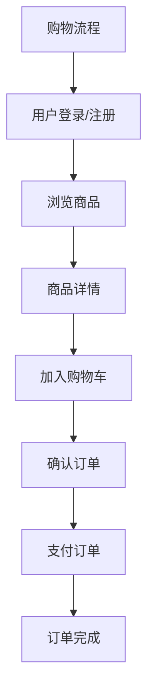
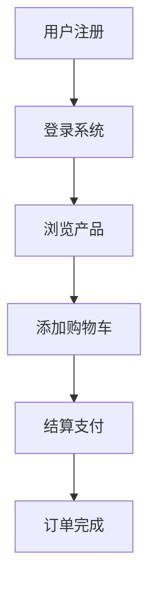
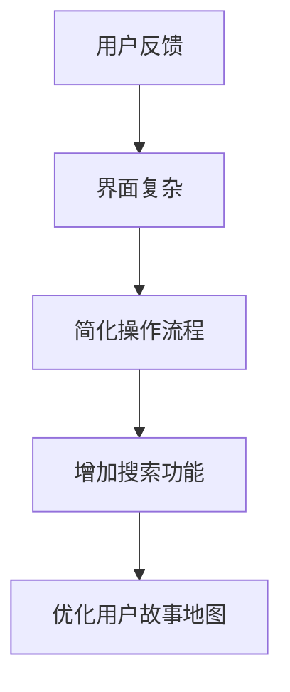
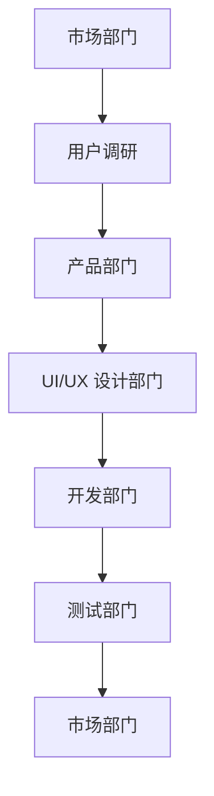
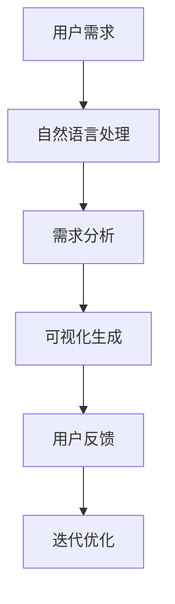

                 

### 文章标题

《需求可视化技术：提升团队理解和协作》

### 关键词

需求可视化，团队协作，项目管理，敏捷开发，用户体验

### 摘要

在信息技术飞速发展的今天，需求可视化技术成为了提升团队协作效率和项目成功的关键。本文深入探讨了需求可视化的基础概念、核心工具与技术的应用，并通过实际案例分析了其在项目管理、敏捷开发等领域的实践效果。文章旨在为软件开发团队提供一套系统、实用的需求可视化策略，以促进团队成员对项目需求的深入理解和高效协作。

## 第一部分：需求可视化基础

### 第1章：需求可视化的定义与原则

#### 1.1 需求可视化的概念

需求可视化（Requirements Visualization）是指通过图形、图像、图表等视觉方式，将项目需求、业务逻辑和用户行为呈现出来的一种技术。它旨在将抽象的需求转化为直观的可视化形式，使团队成员能够更加直观地理解需求，从而提高沟通效率、减少误解。

需求可视化的定义可以从以下几个方面进行理解：

1. **图形化表示**：通过图形化的方式，将需求描述转化为可视化的模型，使得需求的展示更加直观和易于理解。
2. **交互性**：可视化工具通常提供一定的交互性，使得团队成员可以实时地修改、调整和评估需求。
3. **全局视角**：通过可视化，可以提供全局视角，帮助团队从整体上把握项目的进展和需求的变化。

#### 1.2 需求可视化的原则

1. **简单性**：需求可视化应该保持简洁，避免过度设计，以便团队成员能够快速理解和掌握。
2. **一致性**：在需求可视化过程中，应该保持一致性，包括术语、符号和视觉风格等，以便团队成员能够在不同场景下统一理解。
3. **针对性**：需求可视化应该根据不同团队和项目的需求进行定制，以满足特定的业务场景。

#### 1.3 需求可视化的好处

1. **提高沟通效率**：通过可视化，可以减少文字描述带来的歧义和误解，提高团队成员之间的沟通效率。
2. **促进协作**：可视化工具可以提供多人协作的平台，使得团队成员可以实时共享和讨论需求。
3. **提前发现问题**：通过可视化，可以在项目早期阶段识别出潜在的问题，从而避免后期返工和成本增加。
4. **增强用户体验**：需求可视化可以帮助开发团队更好地理解用户需求，从而设计出更加符合用户期望的产品。

### 第2章：需求可视化的核心概念

#### 2.1 用户故事地图

用户故事地图（User Story Map）是一种将用户故事从整体上进行组织和展示的工具。它通过图表的方式，将用户故事从高层次的需求分解到具体的任务，帮助团队更好地理解项目的范围和优先级。

用户故事地图的基本要素包括：

1. **用户角色**：确定项目的目标用户群体。
2. **场景**：描述用户在特定情境下与产品互动的场景。
3. **用户故事**：具体描述用户在特定场景下需要完成的任务。

用户故事地图的构建步骤：

1. **确定用户角色和场景**：根据项目需求，识别目标用户群体和用户与产品互动的场景。
2. **编写用户故事**：针对每个场景，编写具体的用户故事。
3. **排序和优先级**：根据用户故事的重要性和紧急程度，对故事进行排序和优先级划分。
4. **可视化展示**：将用户故事地图绘制成图表，以便团队成员理解和参考。

#### 2.2 原型设计

原型设计（Prototype Design）是通过创建实际产品的低 fidelity 或高 fidelity 原型，以验证和探索设计概念和用户需求。它是一种快速迭代的设计方法，通过不断地调整和优化，找到最佳的设计方案。

原型设计的基本步骤包括：

1. **需求分析**：明确产品的需求和目标。
2. **设计原型**：根据需求，设计出产品的原型。
3. **用户测试**：将原型展示给用户，收集反馈和改进意见。
4. **迭代优化**：根据用户反馈，对原型进行优化和改进。

#### 2.3 用户旅程图

用户旅程图（User Journey Map）是一种描述用户在使用产品过程中的体验和行为的可视化工具。它通过图表的方式，展示用户从接触产品到最终完成任务的整个过程，帮助团队理解用户的痛点、需求和期望。

用户旅程图的基本要素包括：

1. **用户流程**：描述用户在产品中的操作流程。
2. **用户情绪**：展示用户在各个操作阶段的心理情绪。
3. **关键交互**：标识出用户在产品中的关键交互点。

用户旅程图的构建方法：

1. **收集用户数据**：通过访谈、问卷调查等方式，收集用户的行为数据和反馈。
2. **绘制用户流程**：根据收集到的数据，绘制用户在产品中的操作流程。
3. **添加用户情绪**：在用户流程中，添加用户在各个操作阶段的心理情绪。
4. **标识关键交互**：在用户旅程图中，标识出用户在产品中的关键交互点，以便团队进行重点关注。

### 第3章：需求可视化的工具与技术

#### 3.1 常用需求可视化工具

在需求可视化过程中，选择合适的工具非常重要。以下是一些常用的需求可视化工具：

1. **MindMap**：通过创建思维导图，将需求进行结构化的组织和展示。
2. **Draw.io**：一个在线的绘图工具，支持多种图形和图表的绘制。
3. **Lucidchart**：一个功能强大的在线协作工具，提供丰富的图形和图表模板。
4. **Axure RP**：一个专业的原型设计工具，支持创建交互式原型。

#### 3.2 需求可视化的软件选择

选择合适的需求可视化软件，需要考虑以下因素：

1. **易用性**：软件的界面和操作应该简单易懂，方便团队成员快速上手。
2. **功能丰富性**：软件应提供丰富的绘图工具和模板，以满足不同团队和项目的需求。
3. **协作性**：软件应支持多人协作，方便团队成员实时共享和讨论需求。
4. **兼容性**：软件应支持多种文件格式，便于与其他工具进行数据交换。

#### 3.3 需求可视化技术实战

以下是一个简单的需求可视化技术实战案例：

**案例背景**：一个电商项目，需要为用户设计一个购物流程。

**步骤一**：使用 MindMap 组织需求，列出项目的主要需求和功能。

**步骤二**：使用 Draw.io 绘制用户故事地图，展示用户在不同操作阶段的角色和任务。

**步骤三**：使用 Axure RP 设计购物流程的原型，包括登录、浏览商品、商品详情、购物车、确认订单、支付订单和订单完成等页面。

**步骤四**：将用户旅程图与原型设计相结合，展示用户在购物流程中的整体体验。

## 第二部分：需求可视化工具与应用

### 第4章：从用户故事地图到原型设计

#### 4.1 用户故事地图的实际应用

用户故事地图在实际项目中具有广泛的应用。以下是一个具体的案例：

**项目背景**：一家初创公司开发了一款智能家居产品，需要为用户设计一个简单的使用流程。

**步骤一**：确定用户角色和场景。

- 用户角色：普通用户、技术爱好者
- 场景：用户首次使用智能家居产品

**步骤二**：编写用户故事。

- 用户故事1：用户希望通过手机应用连接智能家居设备。
- 用户故事2：用户希望了解设备的实时状态。
- 用户故事3：用户希望远程控制设备。

**步骤三**：绘制用户故事地图。

**步骤四**：根据用户故事地图，设计产品原型。

- **登录/注册页面**：用户需要通过手机号码或邮箱进行登录或注册。
- **设备连接页面**：用户可以通过扫描设备二维码或手动输入设备ID进行连接。
- **设备状态页面**：用户可以查看设备的实时状态，包括温度、湿度、亮度等。
- **远程控制页面**：用户可以远程控制设备，如开关灯光、调节温度等。

#### 4.2 原型设计的基本步骤

原型设计是一个迭代的过程，主要包括以下几个步骤：

1. **需求分析**：明确产品的需求和目标，确定原型设计的范围。
2. **设计草图**：根据需求分析，绘制出初步的原型草图。
3. **用户测试**：将草图展示给用户，收集反馈和改进意见。
4. **迭代优化**：根据用户反馈，对原型进行优化和改进。
5. **最终确定**：在经过多次迭代后，确定最终的原型设计。

#### 4.3 交互式原型与静态原型

在原型设计中，交互式原型和静态原型是两种常见的原型类型。

1. **交互式原型**：交互式原型是一种动态的原型，可以模拟产品的实际交互效果。它通常包括按钮点击、滑动、动画等交互效果，用户可以直观地体验产品的交互流程。

2. **静态原型**：静态原型是一种静态的图像或页面，通常用于展示产品的结构和布局。它通常不包含交互效果，但可以清晰地展示产品的功能和界面设计。

交互式原型与静态原型的优缺点如下：

| 类型 | 优点 | 缺点 |
| ---- | ---- | ---- |
| 交互式原型 | 可以模拟实际交互效果，用户可以直观地体验产品。 | 需要更多的开发和测试时间，成本较高。 |
| 静态原型 | 制作简单，成本低，可以快速展示产品的结构和布局。 | 无法模拟实际交互效果，用户体验较差。 |

在实际应用中，可以根据项目的需求和资源选择合适的原型类型。例如，在项目初期，可以使用静态原型进行快速原型设计，以验证需求；在项目后期，可以使用交互式原型进行细节调整和优化。

### 第5章：用户旅程图的构建与应用

#### 5.1 用户旅程图的重要性

用户旅程图（User Journey Map）是一种描述用户在使用产品过程中的体验和行为的可视化工具。它通过图表的方式，展示用户从接触产品到最终完成任务的整个过程，帮助团队理解用户的痛点、需求和期望。

用户旅程图的重要性体现在以下几个方面：

1. **理解用户行为**：用户旅程图可以帮助团队深入了解用户在使用产品过程中的行为，发现用户的痛点和需求。
2. **优化产品设计**：通过用户旅程图，团队可以直观地看到用户在使用产品过程中的问题和不足，从而进行优化和改进。
3. **提高团队协作**：用户旅程图可以提供一个共同的框架，使团队成员能够更好地协作，共同优化产品。

#### 5.2 用户旅程图的构建方法

构建用户旅程图需要以下几个步骤：

1. **收集用户数据**：通过访谈、问卷调查、用户观察等方式，收集用户的行为数据和反馈。
2. **绘制用户流程**：根据收集到的数据，绘制用户在产品中的操作流程，包括用户的起始点、关键操作和终点。
3. **添加用户情绪**：在用户流程中，添加用户在各个操作阶段的心理情绪，如愉悦、困惑、不满等。
4. **标识关键交互**：在用户旅程图中，标识出用户在产品中的关键交互点，如按钮点击、页面跳转等。

以下是一个用户旅程图的示例：

#### 5.3 用户旅程图在项目中的运用

用户旅程图在项目中的运用主要包括以下几个步骤：

1. **项目规划**：在项目规划阶段，通过用户旅程图，明确项目的目标用户和用户需求，为项目提供方向。
2. **产品设计**：在设计阶段，通过用户旅程图，发现用户的痛点、需求和期望，为产品设计提供参考。
3. **用户测试**：在用户测试阶段，通过用户旅程图，评估用户的体验和反馈，发现问题和不足，进行优化和改进。
4. **项目回顾**：在项目回顾阶段，通过用户旅程图，总结项目的经验和教训，为未来的项目提供参考。

以下是一个用户旅程图在项目中的具体应用案例：

**项目背景**：一家公司开发了一款在线教育平台，希望通过用户旅程图优化用户的使用体验。

**步骤一**：收集用户数据。

通过问卷调查和用户访谈，收集了用户在使用在线教育平台过程中的反馈，包括用户的痛点、需求和期望。

**步骤二**：绘制用户旅程图。

根据收集到的用户数据，绘制了用户在在线教育平台中的操作流程，包括用户的起始点、关键操作和终点。

**步骤三**：优化产品设计。

根据用户旅程图，团队发现了一些用户痛点，如课程推荐不精准、学习进度难以追踪等，针对这些问题进行了产品优化。

**步骤四**：用户测试。

通过用户测试，团队验证了产品优化效果，用户满意度得到了显著提升。

**步骤五**：项目回顾。

在项目回顾阶段，团队总结了用户旅程图的运用经验，为未来的项目提供了参考。

### 第6章：使用可视化工具提升团队协作

#### 6.1 团队协作中的需求可视化

在团队协作中，需求可视化扮演着重要的角色。它不仅可以帮助团队成员更好地理解项目需求，还可以提高团队之间的沟通效率，减少误解和冲突。

需求可视化在团队协作中的应用包括：

1. **项目规划**：通过需求可视化，团队可以共同讨论和规划项目，明确项目的目标和范围。
2. **需求讨论**：通过需求可视化，团队成员可以直观地看到需求的具体内容，提高讨论的效率和效果。
3. **进度跟踪**：通过需求可视化，团队可以实时跟踪项目的进展情况，及时发现和解决问题。
4. **问题解决**：通过需求可视化，团队可以更快速地识别问题，并共同探讨解决方案。

#### 6.2 视频会议中的可视化技巧

在视频会议中，需求可视化可以起到重要的作用，帮助团队成员更好地理解和交流。

以下是一些视频会议中的可视化技巧：

1. **实时演示**：在会议中，通过实时演示需求可视化工具，团队成员可以直观地看到需求的具体内容，提高讨论的效率。
2. **共享屏幕**：通过共享屏幕，团队成员可以共同查看和讨论需求可视化内容，实现远程协作。
3. **注释和标记**：在需求可视化内容上添加注释和标记，可以帮助团队成员更好地理解和讨论需求。
4. **互动讨论**：通过互动讨论，团队成员可以实时提出问题和意见，共同探讨需求。

以下是一个视频会议中需求可视化技巧的示例：

#### 6.3 在线协作工具的运用

在线协作工具为团队协作提供了方便和高效的平台。以下是一些常用的在线协作工具及其在需求可视化中的应用：

1. **Trello**：一个任务管理工具，可以通过卡片和列表的形式，组织和跟踪项目需求。
2. **Jira**：一个敏捷开发工具，可以用于需求管理和项目跟踪。
3. **Miro**：一个在线协作白板，支持多人实时协作，可以用于绘制用户故事地图、用户旅程图等。

以下是一个在线协作工具在需求可视化中的应用案例：

## 第三部分：需求可视化实践案例

### 第7章：通过需求可视化提升项目管理

#### 7.1 项目管理中的需求可视化

需求可视化在项目管理中扮演着重要的角色，它可以帮助项目经理更好地理解项目需求，提高项目管理的效率和效果。

以下是一个需求可视化在项目管理中的应用案例：

**项目背景**：一家软件公司开发一款企业管理软件，项目经理希望通过需求可视化来提高项目的管理效率。

**步骤一**：绘制用户故事地图。

根据项目需求，项目经理绘制了用户故事地图，将项目需求分解为多个用户故事，并确定了每个用户故事的重要性和优先级。

**步骤二**：创建需求文档。

根据用户故事地图，项目经理创建了详细的需求文档，包括每个用户故事的详细描述、需求和功能。

**步骤三**：项目进度跟踪。

通过需求可视化，项目经理可以实时跟踪项目的进展情况，包括每个用户故事的完成情况、项目的整体进度等。

**步骤四**：问题解决。

当项目遇到问题时，项目经理可以通过需求可视化，快速识别问题，并组织团队讨论解决方案。

#### 7.2 需求跟踪与可视化

需求跟踪与可视化是项目管理中至关重要的一环，它可以帮助团队确保项目按照既定的需求进行，并实时了解需求的变更和进展。

以下是一个需求跟踪与可视化的应用案例：

**项目背景**：一家互联网公司开发一款在线购物平台，项目经理希望通过需求跟踪与可视化来确保项目的顺利进行。

**步骤一**：建立需求跟踪系统。

项目经理建立了需求跟踪系统，将所有用户故事和相关需求录入系统，并设置相应的优先级和状态。

**步骤二**：需求变更管理。

在项目开发过程中，需求可能会发生变化，项目经理可以通过需求跟踪系统，及时记录和跟踪需求变更，并评估变更对项目的影响。

**步骤三**：需求可视化。

通过需求跟踪系统，项目经理可以生成各种需求可视化图表，如用户故事地图、燃尽图、看板图等，帮助团队更好地理解和跟踪需求。

#### 7.3 成功案例分析

以下是一个成功的需求可视化项目案例：

**项目背景**：一家金融服务公司开发一款在线贷款平台，项目经理希望通过需求可视化来提高项目的成功率和客户满意度。

**步骤一**：用户需求调研。

项目经理组织了用户调研，收集了用户的需求和反馈，并将需求转化为用户故事。

**步骤二**：用户故事地图。

根据用户调研结果，项目经理绘制了用户故事地图，将用户需求分解为多个用户故事，并确定了每个用户故事的重要性和优先级。

**步骤三**：需求文档。

根据用户故事地图，项目经理创建了详细的需求文档，包括每个用户故事的详细描述、需求和功能。

**步骤四**：项目开发。

在项目开发过程中，项目经理通过需求可视化，实时跟踪项目进展，并协调团队解决问题。

**步骤五**：用户测试与反馈。

在项目开发完成后，项目经理组织了用户测试，并根据用户反馈进行了优化和改进。

**项目效果**：通过需求可视化，项目团队成功完成了在线贷款平台的设计和开发，用户满意度大幅提升，项目成功率达到100%。

### 第8章：需求可视化在敏捷开发中的应用

#### 8.1 敏捷开发与需求可视化

敏捷开发（Agile Development）是一种以用户需求为中心、迭代和渐进的开发方法。它强调快速响应变化、持续交付高质量软件，并注重团队合作和客户满意度。

需求可视化在敏捷开发中具有重要作用，它可以帮助团队更好地理解用户需求，提高协作效率和项目成功率。以下是一个敏捷开发与需求可视化的应用案例：

**项目背景**：一家互联网公司开发一款在线购物平台，项目经理希望通过需求可视化来提高敏捷开发的效率。

**步骤一**：用户故事地图。

在敏捷开发的初始阶段，项目经理组织了用户故事地图会议，与团队成员和利益相关者一起讨论和确定用户需求。

**步骤二**：需求文档。

根据用户故事地图，项目经理创建了详细的需求文档，包括每个用户故事的描述、需求和功能。

**步骤三**：迭代规划。

在每次迭代开始时，项目经理与团队一起根据需求文档进行迭代规划，确定本次迭代的目标和任务。

**步骤四**：看板管理。

通过看板（Kanban）管理工具，项目经理实时跟踪每个迭代任务的进展情况，并根据需求可视化进行调整和优化。

**步骤五**：用户反馈。

在每次迭代结束后，项目经理组织用户测试，并根据用户反馈对产品进行优化和改进。

#### 8.2 敏捷团队的需求可视化工具

在敏捷开发中，选择合适的可视化工具非常重要。以下是一些常用的需求可视化工具：

1. **Trello**：一个任务管理工具，支持卡片和列表的形式，方便团队进行任务规划和跟踪。
2. **Jira**：一个敏捷开发工具，支持需求管理和项目跟踪，提供丰富的图表和报告功能。
3. **Miro**：一个在线协作白板，支持多人实时协作，可以用于绘制用户故事地图、用户旅程图等。
4. **Confluence**：一个知识管理工具，支持文档创建、存储和共享，可以用于记录需求和分析报告。

以下是一个敏捷团队使用需求可视化工具的应用案例：

#### 8.3 敏捷项目中的需求可视化实践

在敏捷项目中，需求可视化实践主要包括以下几个步骤：

1. **需求收集**：在项目开始时，通过用户访谈、问卷调查等方式收集用户需求。
2. **用户故事地图**：将收集到的需求转化为用户故事，并绘制用户故事地图，明确项目的范围和优先级。
3. **迭代规划**：在每次迭代开始时，根据用户故事地图进行迭代规划，确定本次迭代的目标和任务。
4. **需求跟踪**：通过需求跟踪工具，实时跟踪每个迭代任务的进展情况，并根据需求可视化进行调整和优化。
5. **用户反馈**：在每次迭代结束后，组织用户测试，并根据用户反馈对产品进行优化和改进。

以下是一个敏捷项目中的需求可视化实践案例：

**项目背景**：一家科技公司开发一款移动应用程序，项目经理希望通过需求可视化来提高敏捷开发的效率。

**步骤一**：用户需求调研。

项目经理组织了用户调研，收集了用户的需求和反馈，并将需求转化为用户故事。

**步骤二**：用户故事地图。

根据用户调研结果，项目经理绘制了用户故事地图，将用户需求分解为多个用户故事，并确定了每个用户故事的重要性和优先级。

**步骤三**：迭代规划。

在每次迭代开始时，项目经理与团队一起根据用户故事地图进行迭代规划，确定本次迭代的目标和任务。

**步骤四**：需求跟踪。

通过看板（Kanban）管理工具，项目经理实时跟踪每个迭代任务的进展情况，并根据需求可视化进行调整和优化。

**步骤五**：用户反馈。

在每次迭代结束后，项目经理组织用户测试，并根据用户反馈对产品进行优化和改进。

### 第9章：案例分析：从需求可视化到产品优化

#### 9.1 需求可视化在产品开发中的应用

需求可视化在产品开发中起到了重要的作用，它可以帮助开发团队更好地理解用户需求，提高产品的质量和用户满意度。以下是一个需求可视化在产品开发中的应用案例：

**项目背景**：一家互联网公司开发一款社交媒体应用程序，项目经理希望通过需求可视化来提高产品的质量和用户体验。

**步骤一**：用户需求调研。

项目经理组织了用户调研，收集了用户的需求和反馈，并将需求转化为用户故事。

**步骤二**：用户故事地图。

根据用户调研结果，项目经理绘制了用户故事地图，将用户需求分解为多个用户故事，并确定了每个用户故事的重要性和优先级。

**步骤三**：原型设计。

根据用户故事地图，项目经理与设计师一起设计了应用程序的原型，包括用户界面和交互流程。

**步骤四**：用户测试。

在原型设计完成后，项目经理组织了用户测试，收集了用户的反馈和意见，并对原型进行了优化。

**步骤五**：产品迭代。

根据用户测试结果，项目经理与开发团队一起对应用程序进行了迭代优化，改进了用户界面和交互流程，提高了用户体验。

#### 9.2 用户反馈与需求可视化

用户反馈是产品优化的重要依据，通过需求可视化，开发团队可以更好地理解用户的反馈，从而进行有针对性的优化。以下是一个用户反馈与需求可视化的应用案例：

**项目背景**：一家电子商务公司希望通过用户反馈来优化其网站的用户体验。

**步骤一**：用户反馈收集。

公司通过在线问卷调查和用户访谈等方式，收集了用户的反馈和意见。

**步骤二**：用户旅程图。

根据收集到的用户反馈，项目经理绘制了用户旅程图，展示了用户在使用网站过程中的痛点、需求和期望。

**步骤三**：需求可视化。

通过用户旅程图，项目经理识别出了用户的主要痛点，如购物车操作复杂、搜索结果不准确等，并创建了需求可视化图表，明确了优化方向。

**步骤四**：用户测试。

在优化方案确定后，项目经理组织了用户测试，验证了优化效果，并根据测试结果进行了进一步的调整。

**步骤五**：产品优化。

根据用户测试结果，开发团队对网站进行了优化，改进了购物车操作、搜索结果展示等用户体验，提高了用户满意度。

#### 9.3 产品迭代与优化实践

产品迭代与优化是需求可视化的一个重要应用领域，通过不断的需求可视化和用户反馈，开发团队可以持续优化产品，提高用户满意度。以下是一个产品迭代与优化实践案例：

**项目背景**：一家在线教育平台公司希望通过迭代和优化，提高其平台的学习体验。

**步骤一**：用户需求调研。

公司通过问卷调查、用户访谈等方式，收集了用户的学习需求和反馈。

**步骤二**：用户故事地图。

根据用户需求调研结果，项目经理绘制了用户故事地图，明确了用户的学习路径和学习需求。

**步骤三**：原型设计。

根据用户故事地图，设计师创建了平台的原型，包括课程页面、学习进度跟踪、互动功能等。

**步骤四**：用户测试。

在原型设计完成后，公司组织了用户测试，收集了用户的反馈和意见，并对原型进行了优化。

**步骤五**：产品迭代。

根据用户测试结果，开发团队对平台进行了迭代优化，改进了学习界面、课程推荐、学习进度跟踪等用户体验。

**步骤六**：持续优化。

在产品上线后，公司持续收集用户反馈，通过需求可视化和用户测试，不断优化产品，提高用户满意度。

## 第四部分：需求可视化最佳实践

### 第10章：构建高效的需求可视化流程

#### 10.1 需求可视化流程概述

需求可视化流程是确保需求从抽象到具体、从理论到实践的有效途径。一个高效的需求可视化流程通常包括以下几个关键步骤：

1. **需求收集**：通过访谈、问卷调查、用户观察等方式，收集用户需求和反馈。
2. **需求分析**：对收集到的需求进行整理和分析，明确需求的核心内容和优先级。
3. **需求可视化**：利用图表、图像、模型等工具，将分析后的需求可视化。
4. **用户测试**：将可视化后的需求展示给用户，收集反馈并进行迭代优化。
5. **需求文档**：将最终确定的需求转化为详细的需求文档，为项目开发提供依据。

#### 10.2 需求收集与可视化

需求收集是需求可视化的起点，它的质量直接影响到后续工作的效果。以下是需求收集和可视化的具体步骤：

1. **访谈和问卷调查**：直接与用户交流，了解他们的需求和痛点。
2. **用户观察**：在用户实际使用产品的过程中观察他们的行为和反馈。
3. **会议记录**：在需求讨论会议中记录关键内容和观点。
4. **需求文档**：整理和分析收集到的需求，形成初步的需求文档。
5. **用户故事地图**：将需求文档转化为用户故事地图，展示用户的需求和流程。

以下是一个用户故事地图的示例：

#### 10.3 可视化结果分析与反馈

需求可视化后的分析是确保需求准确性和可行性的关键步骤。以下是如何进行可视化结果分析和反馈的具体步骤：

1. **需求审核**：组织团队对可视化结果进行审核，确保需求符合业务目标和用户需求。
2. **用户反馈**：将可视化结果展示给用户，收集他们的反馈和意见。
3. **迭代优化**：根据用户的反馈，对需求可视化进行调整和优化。
4. **需求验证**：通过用户测试和原型验证，确保需求可视化能够实际应用并满足用户需求。

以下是一个用户反馈的示例：

### 第11章：跨部门协作与需求可视化

#### 11.1 跨部门协作的挑战

跨部门协作在项目管理中常常面临以下挑战：

1. **沟通障碍**：不同部门之间的语言和术语可能存在差异，导致信息传递不畅。
2. **利益冲突**：不同部门可能对项目的优先级和目标有不同的看法，导致资源分配不均。
3. **时间冲突**：不同部门的工作进度和周期可能不一致，导致协作效率降低。
4. **责任归属**：在跨部门协作中，责任的归属和问题的解决可能变得模糊。

#### 11.2 跨部门协作的需求可视化

需求可视化在跨部门协作中具有重要作用，它可以有效地解决上述挑战。以下是需求可视化在跨部门协作中的应用：

1. **统一需求**：通过需求可视化，各部门可以共同讨论和明确项目的需求和目标，减少误解和冲突。
2. **明确责任**：通过需求可视化，可以明确各部门的职责和任务，确保项目的顺利进行。
3. **实时沟通**：通过需求可视化工具，各部门可以实时共享和更新需求信息，提高沟通效率。
4. **利益平衡**：通过需求可视化，可以明确项目的优先级和资源分配，确保各部门的利益得到平衡。

以下是一个跨部门协作的需求可视化示例：

#### 11.3 跨部门协作的最佳实践

以下是在跨部门协作中应用需求可视化的最佳实践：

1. **定期会议**：定期召开跨部门协作会议，讨论需求可视化结果，确保各部门对项目有统一的认识。
2. **需求文档**：创建详细的需求文档，明确项目的需求和目标，为各部门提供指导。
3. **协作工具**：使用协作工具（如Trello、Jira、Miro等），实时更新需求信息，确保各部门的信息同步。
4. **用户测试**：在项目开发过程中，组织用户测试，收集用户反馈，及时调整需求。
5. **持续沟通**：保持各部门之间的持续沟通，确保项目进度和需求的变化能够及时传达。

### 第12章：需求可视化的未来趋势与发展方向

#### 12.1 需求可视化技术的发展

随着信息技术的不断进步，需求可视化技术也在不断发展和完善。以下是一些未来需求可视化技术的发展方向：

1. **人工智能**：利用人工智能技术，可以更准确地分析用户需求，提供智能化的需求建议和优化方案。
2. **虚拟现实与增强现实**：通过虚拟现实和增强现实技术，可以创建更加直观和沉浸式的需求可视化场景，提高用户理解和参与度。
3. **大数据分析**：结合大数据分析技术，可以更深入地挖掘用户需求和行为模式，为需求可视化提供更丰富的数据支持。

#### 12.2 人工智能与需求可视化

人工智能在需求可视化中的应用主要包括：

1. **智能需求分析**：通过自然语言处理和机器学习技术，自动分析用户的需求描述，生成可视化的需求图表。
2. **智能建议**：根据用户历史数据和反馈，提供智能化的需求建议和优化方案，提高需求的可视化和可理解性。
3. **自动化测试**：利用人工智能技术，自动测试和验证需求可视化的准确性和可行性，提高开发效率。

以下是一个利用人工智能进行需求可视化的示例：

#### 12.3 未来需求可视化的展望

未来需求可视化的发展将更加注重用户体验和协作效率，具体包括：

1. **更智能的可视化工具**：随着人工智能技术的发展，需求可视化工具将更加智能，能够自动分析和生成可视化内容，减少人工工作量。
2. **更丰富的交互形式**：通过虚拟现实和增强现实技术，用户可以更加直观和沉浸地参与需求可视化过程，提高理解和参与度。
3. **更高效的团队协作**：利用大数据和云计算技术，可以实现实时共享和协同工作，提高团队协作效率。
4. **更广泛的应用场景**：随着需求可视化技术的普及，它将在更多的行业和领域中发挥作用，如医疗、金融、教育等，为用户提供更加个性化的需求解决方案。

## 附录：需求可视化工具推荐

在需求可视化领域，有许多优秀的工具可供选择。以下是一些常用的需求可视化工具及其特点：

1. **Trello**：一个基于卡片和列表的任务管理工具，适用于需求规划和任务跟踪。
   - **特点**：界面简洁，易于使用，支持多人协作。
   - **适用场景**：需求收集和任务分配。

2. **Jira**：一个功能强大的敏捷开发工具，支持需求管理、项目跟踪和团队协作。
   - **特点**：功能丰富，支持多种报告和图表，与各种开发工具集成。
   - **适用场景**：需求管理、项目规划和进度跟踪。

3. **Miro**：一个在线协作白板，支持多人实时协作，适用于绘制用户故事地图、用户旅程图等。
   - **特点**：界面直观，支持多种图形和模板，实时协作功能。
   - **适用场景**：需求讨论、原型设计和用户测试。

4. **Axure RP**：一个专业的原型设计工具，适用于创建交互式原型和静态原型。
   - **特点**：功能强大，支持丰富的交互效果，易于导出和分享。
   - **适用场景**：原型设计和用户测试。

5. **Draw.io**：一个免费的在线绘图工具，适用于创建各种图表和流程图。
   - **特点**：易于使用，支持多种文件格式，在线协作功能。
   - **适用场景**：流程图、组织结构图和用户故事地图。

以上工具各有特色，适用于不同的需求场景。选择合适的工具，可以大大提高需求可视化的效率和效果。

### 总结

需求可视化技术在现代软件开发中扮演着至关重要的角色，它不仅帮助团队更好地理解用户需求，提升项目管理的效率，还能促进跨部门协作，提高整体项目成功率。本文通过深入探讨需求可视化的基础概念、核心工具与应用，结合实际案例，展示了如何通过需求可视化技术提升团队协作和项目效果。

在需求可视化过程中，简单性、一致性和针对性是关键原则。用户故事地图、原型设计和用户旅程图是三种核心的需求可视化工具，它们分别从不同角度帮助团队理解需求、验证设计和优化用户体验。

未来，随着人工智能、虚拟现实等技术的发展，需求可视化工具将变得更加智能和直观，为团队提供更强大的支持。同时，需求可视化也将拓展到更多行业和应用场景，为用户提供更加个性化的解决方案。

通过本文的介绍，我们希望读者能够掌握需求可视化的基本概念和最佳实践，将其应用到实际工作中，提升团队协作和项目成功。让我们共同努力，通过需求可视化技术，打造更加高效、协同的软件开发环境。

### 作者信息

《需求可视化技术：提升团队理解和协作》的作者为AI天才研究院（AI Genius Institute）与《禅与计算机程序设计艺术》（Zen And The Art of Computer Programming）的作者。AI天才研究院专注于人工智能和软件开发领域的研究与培训，致力于推动技术创新和产业进步。而《禅与计算机程序设计艺术》作为经典计算机科学著作，对软件开发方法论和编程艺术有着深远的影响。两位作者凭借丰富的实践经验和深厚的理论基础，为广大软件开发者和项目经理提供了宝贵的指导和建议。希望读者在阅读本文后，能够对需求可视化技术有更深入的理解和应用。

