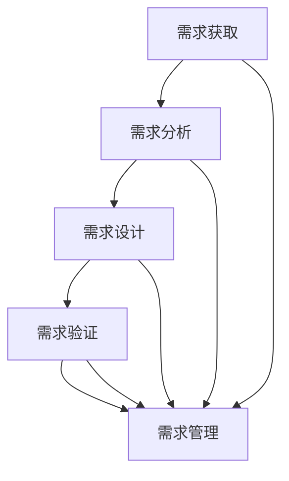
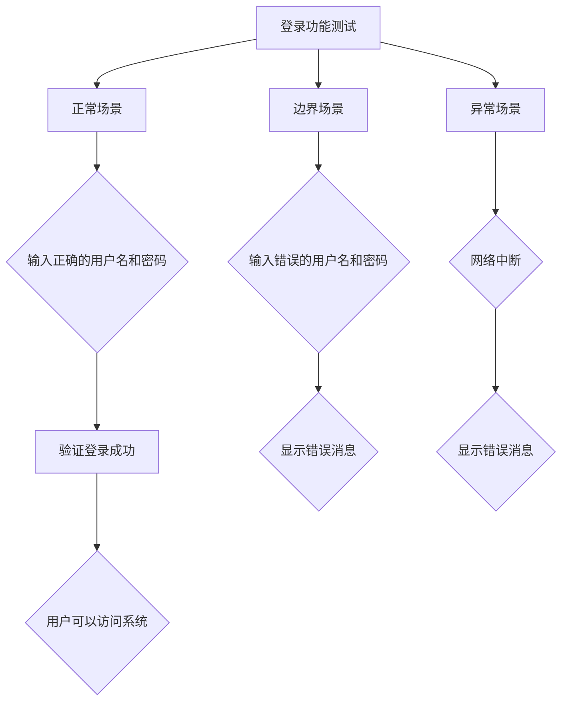
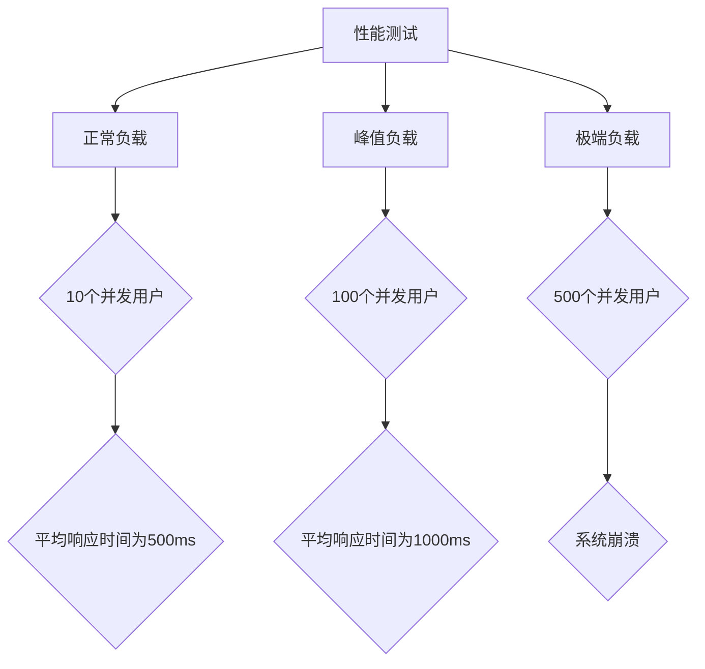
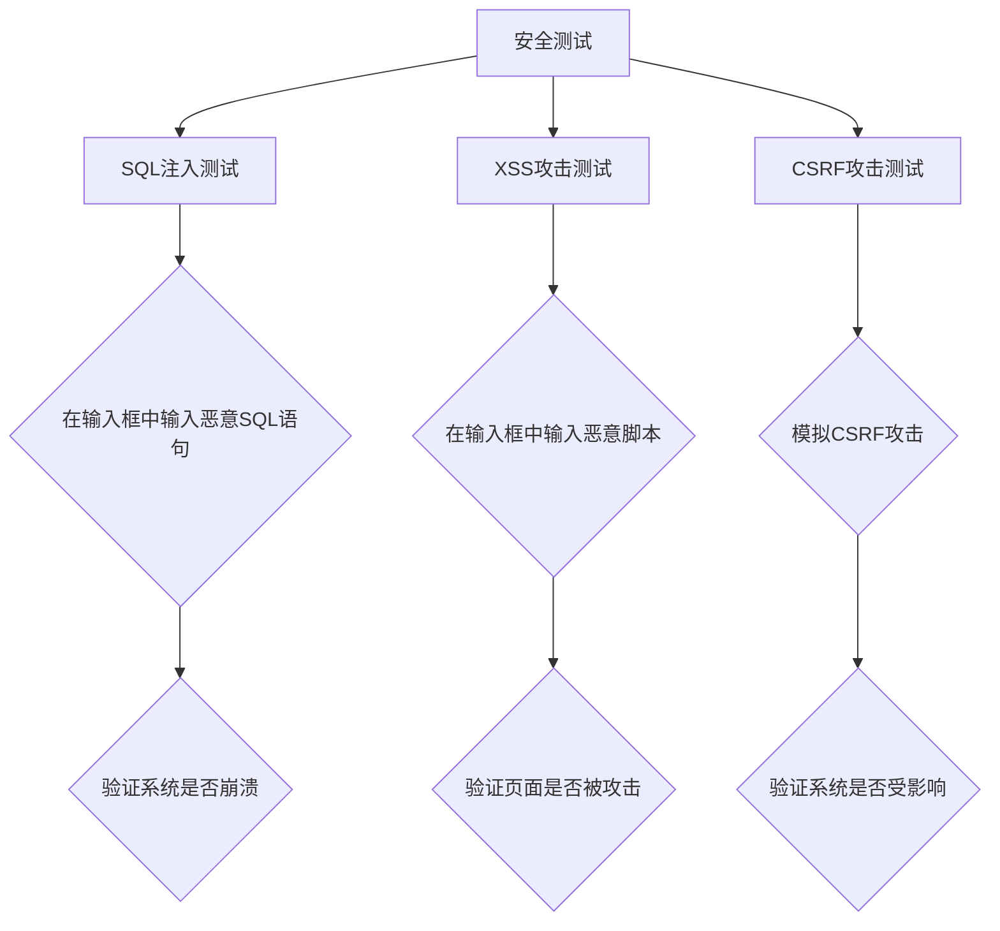
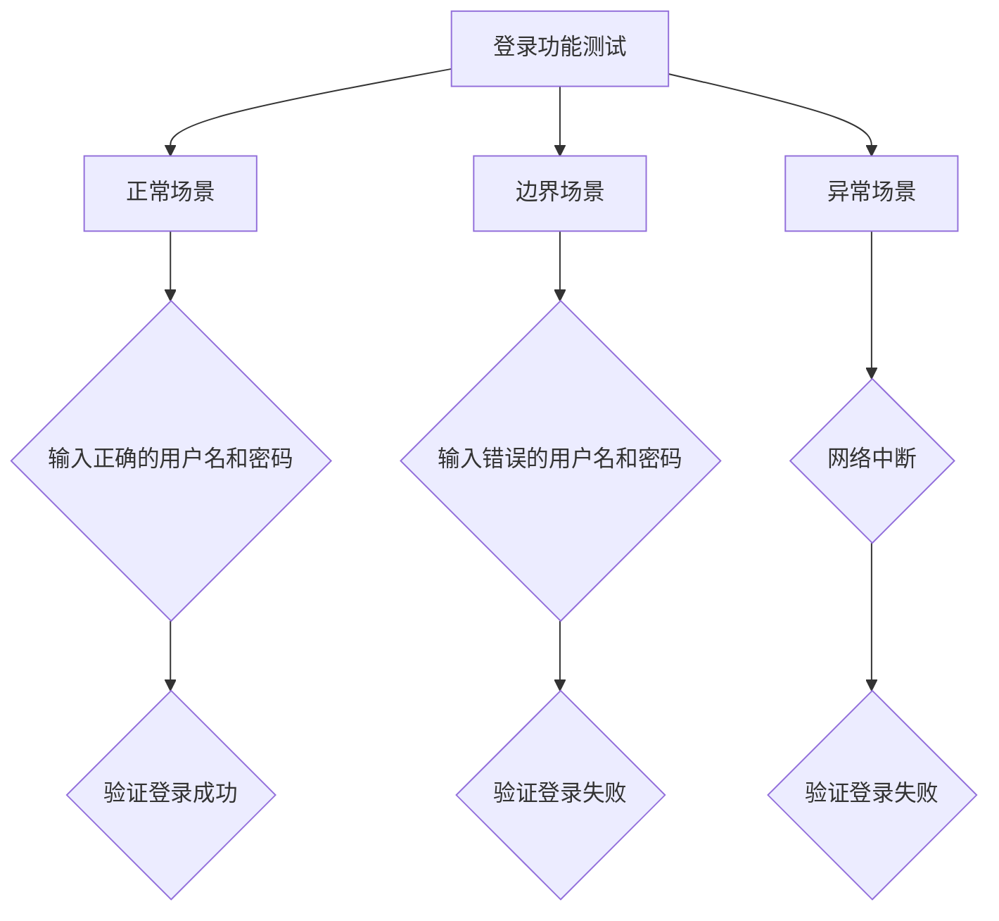

                 

### 1.1 需求验证的重要性

在软件开发领域，需求验证是一个至关重要的环节。它不仅能够确保开发出的软件满足客户的原始需求，还能有效避免由于需求理解偏差或需求变更带来的项目风险。对于大型应用而言，需求验证更是不可忽视的一环。这是因为大型应用往往具有复杂的系统架构和多样化的功能模块，需求的不准确或遗漏可能会导致系统功能不完整、性能低下，甚至导致系统崩溃。

首先，需求验证能够帮助团队更好地理解客户的需求。通过细致的需求分析和验证，开发团队能够确保对客户需求的准确把握，从而减少因为需求理解错误导致的返工现象。此外，需求验证过程中可以发现需求的模糊性或矛盾，从而提前进行沟通和解决，避免后期出现更大的问题。

其次，需求验证有助于提高软件质量。在软件开发的早期阶段，通过需求验证可以发现潜在的问题，如功能不完整、接口不兼容、性能瓶颈等。这些问题的提前发现和解决，可以大大降低后期修复的成本，提高软件的整体质量。

再者，需求验证能够降低项目风险。在大型应用开发中，项目风险往往来自于需求的不确定性和变更。通过需求验证，可以提前识别和评估这些风险，制定相应的风险管理策略，从而降低项目失败的可能性。

最后，需求验证对项目成本和进度有重要影响。准确的需求验证可以减少由于需求变更导致的返工，从而节约项目成本。同时，通过需求验证，可以更准确地预测项目的进度，避免进度延误，提高项目的成功率。

总之，在大型应用的开发过程中，需求验证不仅是一个必不可少的环节，而且对于确保软件质量、降低项目风险、控制项目成本和进度都具有重要意义。因此，深入研究和实践需求验证的创新方法，对于提高大型应用的质量和开发效率具有至关重要的作用。

### 2.1.1 需求验证的定义

需求验证是指通过对软件需求的检查和测试，确保这些需求被正确理解和实施，并且最终交付的软件产品满足既定的需求。具体来说，需求验证包括以下几个方面：

首先，需求验证是需求管理的一部分。需求管理涉及需求的获取、分析和验证，以确保开发的产品满足客户的期望。需求验证则专注于确保这些需求在实际开发过程中得到了正确理解和有效实现。

其次，需求验证是一种验证活动，用于确认软件需求的正确性和完整性。这包括验证需求是否清晰、一致，是否能够被准确实现，以及是否满足客户的业务需求。

第三，需求验证通常通过一系列测试活动来实现。这些测试活动包括功能测试、性能测试、接口测试、安全性测试等。通过这些测试，开发团队可以确保每个需求都得到了妥善处理，并且符合预期的质量标准。

第四，需求验证不仅是开发过程中的一个环节，它还贯穿于整个软件生命周期。从需求初期的获取、分析，到设计、开发、测试和部署，需求验证都需要持续进行，以确保需求的准确性和完整性。

最后，需求验证的目标是确保软件产品能够交付给客户时，满足客户的需求。这不仅包括功能性需求，还包括非功能性需求，如性能、可靠性、安全性等。

总之，需求验证是确保软件开发项目成功的关键步骤。通过严格的验证活动，开发团队可以减少需求误解、降低项目风险、提高软件质量，最终满足客户的期望，实现项目目标。

### 2.1.2 需求验证的目的

需求验证的主要目的是确保软件开发过程中所有需求都被准确理解、有效实现，并且最终交付的软件产品能够满足客户的业务需求。具体来说，需求验证有以下几个关键目标：

首先，需求验证旨在确保需求的准确性和完整性。在软件开发过程中，需求的准确性至关重要。任何需求偏差都可能导致最终产品的功能缺失或性能问题。通过需求验证，开发团队能够及时发现和纠正这些偏差，确保每个需求都得到了准确理解和妥善处理。

其次，需求验证有助于降低项目风险。在大型应用开发中，需求变更和误解是常见的风险因素。需求验证通过对需求的持续检查和测试，可以提前发现潜在的问题和风险，从而采取相应的措施进行预防和控制，降低项目失败的可能性。

第三，需求验证有助于提高软件质量。通过严格的验证活动，开发团队可以发现并解决潜在的质量问题，如功能不完整、接口不兼容、性能瓶颈等。这些问题的提前发现和解决，可以大大降低后期修复的成本，提高软件的整体质量。

第四，需求验证有助于优化项目管理和资源配置。通过需求验证，项目团队可以更准确地预测项目的进度和成本，从而进行更有效的资源分配和项目调度。此外，需求验证的结果也为项目管理和决策提供了重要的数据支持。

第五，需求验证促进了客户与开发团队之间的沟通。在需求验证过程中，开发团队与客户保持密切的沟通，确保双方对需求的理解一致。这不仅有助于减少需求变更和误解，还能增强客户的满意度和信任感。

总之，需求验证的目的是通过确保需求的准确性、降低项目风险、提高软件质量和优化项目管理，最终实现项目的成功交付。在大型应用的开发过程中，需求验证无疑是一个不可或缺的环节，它对项目的整体成功具有至关重要的意义。

### 2.1.3 需求验证的原则

在需求验证过程中，遵循一系列原则是确保验证活动有效性和准确性的关键。以下是几个重要的需求验证原则：

首先，完整性原则。确保所有需求都被涵盖，没有任何遗漏。在需求验证过程中，开发团队需要仔细检查每个需求，确保它们都被充分考虑和处理。遗漏的需求可能会导致功能缺失或性能问题，从而影响软件的质量和客户满意度。

其次，一致性原则。需求之间应该保持一致，不存在矛盾或冲突。在验证过程中，开发团队需要检查不同需求之间是否相互匹配，是否存在逻辑上的不一致。不一致的需求会导致开发过程中出现错误和偏差，增加项目风险。

第三，可验证性原则。需求必须是可验证的，即能够通过某种方法或工具来证明其是否被实现。这意味着每个需求都应该有明确且可操作的验证标准。在验证过程中，开发团队可以使用自动化测试、手动测试或其他验证方法来验证需求是否被正确实现。

第四，明确性原则。需求必须表达清晰、明确，避免模糊和歧义。模糊的需求会导致开发团队对需求的理解产生偏差，从而导致开发错误。在验证过程中，开发团队需要确保每个需求都被明确地表述，并且所有相关方对需求的理解一致。

第五，优先级原则。需求应根据其重要性和紧急性进行排序。在验证过程中，开发团队应优先验证高优先级的需求，确保这些关键需求得到妥善处理。优先级原则有助于确保项目在资源有限的情况下能够满足最重要的需求。

第六，持续性原则。需求验证是一个持续的过程，不应仅限于开发周期的某个阶段。在软件开发的整个生命周期中，需求验证都需要进行，以确保需求在各个阶段都得到正确的理解和实施。持续性原则有助于及时发现和纠正需求偏差，降低项目风险。

总之，遵循这些需求验证原则，可以帮助开发团队更有效地进行需求验证，确保需求的准确性、完整性和一致性，从而提高软件质量和项目成功率。

### 2.2 需求验证方法

在软件开发过程中，选择合适的需求验证方法至关重要，它直接影响软件的质量和项目的成功率。以下是一些常用的需求验证方法，包括自动化测试、模拟测试和多团队协作。

#### 2.2.1 自动化测试

自动化测试是通过编写脚本或使用现成的自动化测试工具，对软件进行自动化验证的过程。这种方法的主要优点包括提高测试效率、减少人力成本、确保测试的准确性和一致性。

**优点**：
1. **效率高**：自动化测试可以快速执行大量的测试用例，显著提高测试速度。
2. **准确性高**：自动化测试工具能够严格按照预定脚本执行，减少人为因素导致的不确定性。
3. **一致性**：自动化测试可以确保每个测试用例都以相同的方式执行，从而保证测试的一致性。

**缺点**：
1. **前期成本高**：编写和维护自动化测试脚本需要投入大量的时间和资源。
2. **对测试环境依赖强**：自动化测试对测试环境的稳定性要求较高，任何环境变动都可能导致测试失败。

**适用场景**：
自动化测试适用于需要频繁测试的场景，特别是功能复杂、需求变化频繁的大型应用。例如，Web应用、移动应用和金融系统的自动化测试。

#### 2.2.2 模拟测试

模拟测试是通过创建模拟环境来测试软件的性能、稳定性和可扩展性。这种方法可以模拟实际运行环境中的各种情况，从而发现潜在的问题。

**优点**：
1. **环境真实**：模拟测试可以创建与实际运行环境相似的环境，从而更真实地测试软件的性能。
2. **灵活性强**：可以通过调整模拟环境中的参数，来测试软件在不同条件下的表现。
3. **可扩展性高**：模拟测试可以模拟大规模的并发用户，从而测试软件的扩展性。

**缺点**：
1. **成本较高**：创建模拟环境需要投入大量的时间和资源。
2. **结果解释复杂**：模拟测试结果需要专业的分析和解释，以确保问题定位准确。

**适用场景**：
模拟测试适用于需要高可靠性和高性能的大型应用，如电子商务平台、在线游戏和大型数据库系统。

#### 2.2.3 多团队协作

多团队协作是指将不同的团队（如开发团队、测试团队、产品团队等）整合在一起，共同进行需求验证。这种方法通过团队间的密切合作，可以提高需求的准确性和完整性。

**优点**：
1. **协同高效**：不同团队的协作可以充分利用各自的专业知识和技能，提高需求验证的效率。
2. **沟通顺畅**：多团队协作可以减少沟通成本，确保团队间的信息畅通无阻。
3. **质量更高**：多团队协作可以从不同角度对需求进行验证，从而提高需求的准确性和完整性。

**缺点**：
1. **协调难度大**：多团队协作需要协调不同团队的资源和进度，难度较大。
2. **资源依赖强**：多团队协作对团队成员的专业技能和协调能力要求较高。

**适用场景**：
多团队协作适用于大型项目，特别是跨部门、跨地域的项目。例如，跨国企业的全球业务系统、大型电商平台和复杂金融系统。

综上所述，自动化测试、模拟测试和多团队协作是常用的需求验证方法，每种方法都有其独特的优点和适用场景。开发团队应根据具体项目需求，选择合适的验证方法，以提高软件质量和项目成功率。

### 2.3 需求验证的流程

需求验证是一个系统性的过程，通常包括以下几个主要阶段：需求获取、需求分析、需求设计、需求验证和需求管理。下面我们将详细描述这些阶段，并使用Mermaid流程图展示需求验证的整体流程。

#### 2.3.1 需求获取

需求获取是需求验证的第一步，旨在从客户、市场或其他相关方获取软件需求的原始信息。这个阶段的关键活动包括：

1. **需求访谈**：通过与客户、用户、业务分析师等进行面对面访谈，了解他们的需求和期望。
2. **需求调研**：通过市场调研、用户反馈、竞争对手分析等方式，获取市场需求和趋势信息。
3. **需求文档**：将获取的需求信息整理成需求文档，为后续的需求分析提供依据。

#### 2.3.2 需求分析

需求分析是对获取的需求进行详细分析和验证的过程。在这个阶段，开发团队需要确保需求是清晰、一致且可实现的。关键活动包括：

1. **需求评审**：组织需求评审会议，审查需求文档的准确性和完整性，确保所有需求都被正确理解和记录。
2. **需求建模**：使用各种建模工具和技术（如UML图、流程图等），对需求进行可视化表示，帮助团队成员更好地理解和讨论需求。
3. **需求确认**：与客户和用户进行沟通，确认需求文档的准确性和完整性，确保需求的正确性和可行性。

#### 2.3.3 需求设计

需求设计是将需求转化为具体的软件设计的过程。这个阶段的目标是确定软件的架构、模块划分和接口设计。关键活动包括：

1. **需求转换**：将需求文档中的功能需求转换为设计规范，确定软件的模块划分和接口设计。
2. **设计评审**：组织设计评审会议，审查设计文档的合理性和可行性，确保设计符合需求。
3. **设计验证**：通过设计验证工具（如代码审查、模拟运行等）验证设计是否符合需求，确保设计的正确性和有效性。

#### 2.3.4 需求验证

需求验证是确保软件设计被正确实现并满足需求的过程。这个阶段包括多种验证活动，如功能测试、性能测试、安全性测试等。关键活动包括：

1. **测试规划**：制定测试计划，确定测试的范围、策略和方法。
2. **测试执行**：执行测试用例，发现并记录软件缺陷。
3. **缺陷管理**：对发现的缺陷进行跟踪和管理，确保所有缺陷都得到及时修复。
4. **测试报告**：编写测试报告，总结测试结果，提供改进建议。

#### 2.3.5 需求管理

需求管理是确保需求在整个软件生命周期中得到有效管理和控制的过程。这个阶段包括需求变更管理、需求文档管理、需求追溯等多个方面。关键活动包括：

1. **需求变更管理**：对需求变更进行评估、批准和实施，确保变更对项目的影响得到有效控制。
2. **需求文档管理**：维护需求文档的版本和控制，确保所有相关方都能访问最新的需求文档。
3. **需求追溯**：建立需求追溯机制，确保每个需求都能追溯到其原始来源，确保需求的完整性和可追溯性。

下面是需求验证流程的Mermaid流程图表示：



通过这个流程图，我们可以清晰地看到需求验证的各个阶段及其相互关系，从而更好地理解需求验证的整体流程。

### 2.3.2 自动化测试流程

自动化测试是确保软件质量的重要手段之一，通过编写自动化测试脚本，可以在短时间内执行大量测试用例，提高测试效率。下面，我们将详细讲解自动化测试的流程，包括测试用例设计、测试环境搭建、测试执行和测试报告编写。

#### 2.3.2.1 测试用例设计

测试用例设计是自动化测试的关键步骤，其目的是确保所有重要功能点和潜在问题都得到覆盖。测试用例设计主要包括以下步骤：

1. **功能点确定**：根据需求文档，确定需要测试的功能点，确保所有功能都得到覆盖。
2. **边界条件分析**：分析每个功能点的边界条件，包括合法边界和非法边界，确保边界情况都得到测试。
3. **测试场景设计**：根据功能点和边界条件，设计具体的测试场景，确保测试用例能够覆盖所有可能的执行路径。
4. **测试用例编写**：使用测试工具（如Selenium、JUnit等）编写测试用例脚本，实现自动化测试。

下面是一个自动化测试用例的伪代码示例：

```python
# 示例：登录功能自动化测试用例
def test_login():
    # 输入用户名和密码
    input_username("test_user")
    input_password("test_password")
    # 点击登录按钮
    click_login_button()
    # 验证登录结果
    assert login_success_message() == "登录成功"
```

#### 2.3.2.2 测试环境搭建

测试环境搭建是自动化测试的另一个关键步骤，其目的是确保自动化测试能够在一个稳定的环境中执行。测试环境搭建主要包括以下步骤：

1. **硬件资源准备**：准备足够的硬件资源，包括服务器、网络设备等，确保自动化测试的执行环境稳定。
2. **软件安装**：安装所需的操作系统、开发工具、测试工具等软件，确保自动化测试的执行环境符合测试要求。
3. **配置调整**：根据测试需求，调整系统的配置参数，如网络设置、数据库连接等，确保自动化测试能够正常运行。
4. **测试脚本部署**：将自动化测试脚本部署到测试环境中，确保测试脚本能够在测试环境中执行。

#### 2.3.2.3 测试执行

测试执行是自动化测试的核心步骤，通过执行自动化测试脚本，可以发现软件中的缺陷和问题。测试执行主要包括以下步骤：

1. **测试计划制定**：根据测试用例和测试环境，制定测试执行计划，明确测试的时间、顺序和方法。
2. **测试执行**：按照测试计划，执行自动化测试脚本，记录测试结果，包括成功和失败的用例。
3. **缺陷记录**：发现缺陷时，记录缺陷信息，包括缺陷的描述、原因、复现步骤等，确保缺陷能够被及时跟踪和修复。
4. **测试结果分析**：对测试结果进行分析，包括成功的用例数量、失败的用例原因等，为测试报告提供数据支持。

#### 2.3.2.4 测试报告编写

测试报告是自动化测试的总结性文档，用于记录测试活动的结果和结论。测试报告主要包括以下内容：

1. **测试总结**：概述测试活动的过程和结果，包括测试的覆盖范围、发现的主要问题等。
2. **缺陷统计**：统计测试过程中发现的缺陷数量、类型和分布情况，为缺陷管理和修复提供数据支持。
3. **测试结论**：根据测试结果，给出软件质量的评估和改进建议，包括测试通过率、性能指标等。
4. **测试报告附件**：提供测试用例、测试脚本、缺陷记录等附件，以便读者查阅。

下面是一个自动化测试报告的示例：

```markdown
# 自动化测试报告

## 测试总结
本次测试共执行了100个自动化测试用例，其中成功92个，失败8个，成功率为92%。

## 缺陷统计
共发现8个缺陷，包括功能缺陷4个、性能缺陷2个、界面缺陷2个。

## 测试结论
根据测试结果，软件整体质量较高，但仍存在一些需要改进的地方，建议开发团队对发现的缺陷进行修复。

## 测试报告附件
- 测试用例
- 自动化测试脚本
- 缺陷记录
```

通过上述自动化测试流程，开发团队可以高效地发现和解决软件中的问题，从而提高软件的质量和可靠性。

### 2.3.3 模拟测试概述

模拟测试是一种通过创建模拟环境来测试软件性能、稳定性及可扩展性的方法。它通过模拟实际运行环境中的各种情况，从而发现潜在的问题和缺陷。模拟测试的重要性体现在以下几个方面：

首先，模拟测试能够更好地反映软件在实际运行环境中的表现。在实际环境中，系统可能会面临多种不同的负载、网络条件、硬件资源限制等情况，而模拟测试可以在可控的条件下，模拟这些复杂的场景，从而更准确地评估软件的性能和稳定性。

其次，模拟测试有助于提前发现并解决潜在问题。通过模拟测试，开发团队可以在软件发布前，发现那些在常规测试中难以发现的缺陷，如性能瓶颈、并发处理问题、异常处理问题等。这些问题的提前发现和解决，可以大大降低软件在正式上线后出现故障的风险。

再次，模拟测试可以提高软件的可扩展性。大型应用往往需要应对不断增长的用户数量和业务需求，模拟测试可以帮助团队评估软件在扩展规模后的性能表现，从而优化系统设计，确保软件能够适应未来的需求变化。

模拟测试通常包括以下几个关键环节：

1. **环境搭建**：创建模拟测试环境，包括硬件、软件和网络配置等。这个环境应尽量与实际生产环境相似，以确保测试结果的可靠性。
2. **测试脚本编写**：根据测试需求，编写模拟测试脚本，定义测试的场景和步骤。
3. **测试执行**：在模拟环境中执行测试脚本，记录测试结果，包括性能指标、错误日志等。
4. **结果分析**：对测试结果进行分析，识别潜在问题，并提出优化建议。

总的来说，模拟测试是确保软件质量和可靠性的重要手段。通过模拟不同的运行条件，开发团队能够更好地了解软件的性能和稳定性，从而提高软件的整体质量和用户满意度。

### 2.3.3 模拟测试环境搭建

模拟测试环境搭建是进行模拟测试的基础工作，其目的是创建一个与实际生产环境尽可能相似的环境，以便更准确地评估软件的性能和稳定性。以下是模拟测试环境搭建的详细步骤：

#### 1. 硬件资源准备

首先，需要准备足够的硬件资源，以支持模拟测试的运行。硬件资源包括：

- **服务器**：根据测试需求，选择合适的服务器，包括物理服务器或虚拟服务器。服务器应具备足够的计算能力、内存和存储空间，以支持模拟测试环境。
- **网络设备**：配置网络设备，如路由器、交换机等，确保网络环境稳定可靠。需要模拟实际生产环境中的网络拓扑结构，以准确反映网络状况。
- **存储设备**：配置存储设备，如硬盘、SSD等，以确保数据存储的可靠性。对于需要大量数据处理的测试，存储设备的性能也是一个关键因素。

#### 2. 软件安装

接下来，需要在准备好的硬件上安装所需的软件。软件安装包括：

- **操作系统**：根据测试需求，选择并安装适合的操作系统，如Linux、Windows等。操作系统应支持所需的应用程序和开发工具。
- **开发工具**：安装开发工具，如IDE、编译器等，以便开发测试脚本和执行测试。
- **测试工具**：安装用于模拟测试的测试工具，如Chaos Mesh、LoadRunner等。这些工具能够创建模拟负载，并记录测试结果。
- **应用程序**：安装需要测试的应用程序，确保应用程序能够在模拟环境中正常运行。

#### 3. 配置调整

在软件安装完成后，需要对系统进行配置调整，以确保模拟环境能够准确反映实际生产环境。配置调整包括：

- **网络设置**：调整网络设置，如IP地址分配、子网掩码、网关等，以模拟实际生产环境中的网络拓扑结构。
- **系统参数**：调整系统参数，如内存分配、进程数限制等，以确保系统能够承受模拟测试的负载。
- **数据库配置**：配置数据库，如MySQL、PostgreSQL等，确保数据库能够与测试应用正常交互。
- **应用程序配置**：调整应用程序的配置参数，如并发连接数、线程数等，以模拟实际生产环境中的运行条件。

#### 4. 测试脚本部署

在配置调整完成后，需要将模拟测试脚本部署到测试环境中。测试脚本部署包括：

- **脚本编写**：编写模拟测试脚本，定义测试的场景和步骤。脚本应涵盖所有重要功能和边界条件。
- **脚本部署**：将测试脚本部署到模拟测试环境中，确保脚本能够正常运行。
- **脚本调试**：在测试环境中运行测试脚本，调试并修正脚本中的错误，确保脚本能够准确执行。

通过以上步骤，开发团队可以搭建出一个与实际生产环境相似的模拟测试环境，从而更准确地评估软件的性能和稳定性。模拟测试环境的搭建是模拟测试成功的关键，它为后续的测试活动提供了可靠的基础。

### 2.3.3 模拟测试用例设计

模拟测试用例设计是确保模拟测试有效性的关键步骤。一个良好的模拟测试用例设计应该涵盖各种不同的场景和条件，以全面评估软件的性能和稳定性。以下是模拟测试用例设计的主要步骤：

#### 1. 功能测试用例设计

功能测试用例设计旨在验证软件功能是否按照需求文档正常运行。具体步骤如下：

- **需求分析**：分析需求文档，确定需要测试的功能点。
- **场景识别**：识别每个功能点在不同条件下可能出现的执行场景，如正常场景、边界场景和异常场景。
- **测试步骤**：为每个测试场景编写详细的测试步骤，包括输入数据、操作流程和预期结果。
- **测试条件**：为每个测试场景定义测试条件，如并发用户数、网络延迟、硬件负载等。

以下是一个示例：



#### 2. 性能测试用例设计

性能测试用例设计旨在评估软件在不同负载条件下的性能表现。具体步骤如下：

- **性能指标识别**：确定需要测试的性能指标，如响应时间、并发用户数、吞吐量等。
- **负载场景设计**：设计不同的负载场景，包括正常负载、峰值负载和极端负载。
- **测试步骤**：为每个负载场景编写详细的测试步骤，包括测试执行的时间段、用户行为等。
- **监控指标**：定义监控指标，如CPU使用率、内存使用率、磁盘I/O等。

以下是一个示例：



#### 3. 安全测试用例设计

安全测试用例设计旨在发现软件中的安全漏洞和风险。具体步骤如下：

- **漏洞识别**：识别常见的漏洞类型，如SQL注入、XSS攻击、CSRF攻击等。
- **测试场景设计**：设计不同的测试场景，如模拟攻击、注入攻击、越权访问等。
- **测试步骤**：为每个测试场景编写详细的测试步骤，包括攻击步骤、预期结果等。
- **安全指标**：定义安全测试的指标，如漏洞发现率、安全性能等。

以下是一个示例：



通过以上步骤，开发团队可以设计出全面、有效的模拟测试用例，从而确保软件在各种条件下都能正常运行，并具备良好的性能和安全性。

### 2.3.3 模拟测试执行

模拟测试执行是模拟测试过程中最重要的环节，它决定了模拟测试能否有效地发现软件中的问题和缺陷。以下是模拟测试执行的主要步骤：

#### 1. 测试执行前的准备

在执行模拟测试前，需要进行充分的准备，以确保测试的顺利进行。具体步骤如下：

- **测试环境检查**：检查模拟测试环境，确保硬件、软件和网络配置均符合预期，并运行正常。
- **测试工具准备**：确认所有测试工具（如Chaos Mesh、LoadRunner等）均已安装并配置完毕，且能够正常运行。
- **测试脚本准备**：确保所有模拟测试脚本均已编写完成，并经过初步调试，确保能够准确执行。
- **测试数据准备**：准备测试所需的数据，包括用户数据、交易数据、日志数据等，确保测试数据的完整性和真实性。

#### 2. 测试用例执行

测试用例执行是模拟测试的核心环节，它按照预定脚本和测试场景，对软件进行测试。具体步骤如下：

- **启动测试工具**：启动模拟测试工具，如Chaos Mesh，并设置测试场景和参数，如并发用户数、负载类型等。
- **执行测试脚本**：运行测试脚本，模拟实际用户行为，如登录、查询、交易等，并记录测试结果。
- **监控测试过程**：在测试执行过程中，实时监控测试环境的各项指标，如CPU使用率、内存使用率、网络延迟等，确保测试环境稳定。

以下是一个模拟测试执行过程的伪代码示例：

```python
# 示例：模拟测试执行流程
def execute_simulation_tests():
    # 启动测试工具
    start_simulation_tool()
    
    # 执行登录测试
    execute_login_test()
    record_login_test_results()
    
    # 执行查询测试
    execute_query_test()
    record_query_test_results()
    
    # 执行交易测试
    execute_trade_test()
    record_trade_test_results()
    
    # 停止测试工具
    stop_simulation_tool()
```

#### 3. 结果记录和分析

在模拟测试执行完成后，需要记录测试结果并进行详细分析，以识别软件中的问题和缺陷。具体步骤如下：

- **结果记录**：将测试结果记录到测试报告中，包括成功的测试用例、失败的测试用例和错误的日志记录等。
- **错误分析**：分析失败的测试用例，识别错误的原因和缺陷的类型，如性能问题、功能缺陷、安全漏洞等。
- **性能分析**：对测试过程中的性能数据进行分析，识别性能瓶颈和优化点，如CPU占用过高、内存泄露、网络延迟等。

以下是一个模拟测试结果记录和分析的示例：

```markdown
# 模拟测试结果记录和分析

## 登录测试结果
- 成功用例数：90
- 失败用例数：10
- 失败原因：网络延迟导致部分用户无法登录

## 查询测试结果
- 成功用例数：95
- 失败用例数：5
- 失败原因：数据库连接异常导致部分查询失败

## 交易测试结果
- 成功用例数：88
- 失败用例数：12
- 失败原因：并发处理异常导致部分交易失败

## 性能分析
- CPU使用率：80%
- 内存使用率：70%
- 网络延迟：300ms
- 优化建议：增加数据库连接池，优化并发处理机制
```

通过以上步骤，开发团队可以全面、准确地评估软件的性能和稳定性，及时发现和解决问题，从而提高软件的质量和可靠性。

### 2.3.4 多团队协作

在大型应用开发过程中，多团队协作是确保项目成功的关键。多团队协作指的是将不同职能的团队（如开发团队、测试团队、产品团队等）整合在一起，共同推进项目进展。多团队协作的重要性主要体现在以下几个方面：

首先，多团队协作能够提高项目的整体效率。通过不同团队的紧密合作，可以迅速响应项目需求变化，减少沟通成本和协调难度，从而提高项目推进速度。

其次，多团队协作有助于提升软件质量。每个团队都有其专业领域和优势，通过跨团队的协作，可以充分利用各自的专业知识和技能，从不同角度对需求进行验证和优化，从而提高软件的稳定性和可靠性。

再者，多团队协作促进了更好的沟通和协作。不同团队之间保持密切沟通，能够及时解决项目中出现的问题和冲突，确保项目进展顺利。

最后，多团队协作有助于形成更全面的团队文化。通过共同的工作经历和项目合作，团队成员能够建立起信任和默契，形成更加团结、高效的团队文化。

多团队协作通常包括以下几个关键环节：

#### 1. 团队组建

在项目启动阶段，首先需要组建多团队。团队组建的步骤包括：

- **确定团队架构**：根据项目需求和团队职能，确定不同团队的架构和职责分工。
- **选择团队成员**：根据项目需求和团队成员的专业技能，选择合适的团队成员。
- **明确团队目标**：为每个团队设定明确的目标和任务，确保团队成员对项目的目标和任务有清晰的认识。

#### 2. 沟通机制

沟通机制是多团队协作的核心。为了确保团队之间的信息畅通无阻，需要建立有效的沟通机制。具体措施包括：

- **定期会议**：定期召开跨团队的会议，讨论项目进展、问题和解决方案。
- **即时通讯工具**：使用即时通讯工具（如Slack、Microsoft Teams等），确保团队成员之间的即时沟通。
- **共享平台**：建立共享平台（如Confluence、JIRA等），用于发布项目文档、进度报告和任务分配。

#### 3. 协作工具

协作工具是支持多团队协作的重要手段。常见的协作工具包括：

- **项目管理工具**：用于任务分配、进度跟踪和资源管理，如JIRA、Trello等。
- **代码管理工具**：用于代码的版本控制和协同开发，如Git、SVN等。
- **测试管理工具**：用于测试用例管理、测试执行和缺陷跟踪，如Selenium、TestLink等。
- **文档管理工具**：用于文档的共享和协作，如Confluence、Google Docs等。

#### 4. 问题解决

在多团队协作中，难免会遇到各种问题和冲突。为了有效解决这些问题，需要采取以下措施：

- **建立问题反馈机制**：确保团队成员能够及时反馈问题，并提出解决方案。
- **设立协调人员**：指定专门的协调人员，负责协调不同团队之间的沟通和资源分配。
- **定期评估**：定期评估项目进展和团队协作情况，识别潜在问题和改进空间。

#### 5. 绩效评估

多团队协作的绩效评估是确保项目顺利进行的重要环节。绩效评估包括：

- **团队绩效评估**：评估每个团队的完成情况和质量，如任务完成率、缺陷率等。
- **个人绩效评估**：评估团队成员的工作表现，如任务完成质量、沟通能力等。
- **改进措施**：根据绩效评估结果，制定相应的改进措施，以提高团队协作效率和质量。

总之，多团队协作在大型应用开发中具有重要意义。通过有效的团队组建、沟通机制、协作工具、问题解决和绩效评估，可以确保项目顺利推进，提高软件质量，实现项目目标。

### 2.3.5 多团队协作流程

在大型应用开发中，多团队协作是一个复杂且重要的过程。有效的多团队协作流程能够确保项目在时间、成本和质量上的成功。以下是多团队协作的详细流程，包括需求获取、需求分析、需求设计、需求验证和需求管理。

#### 1. 需求获取

多团队协作的起点是需求获取。这一阶段涉及多个职能团队，如开发团队、测试团队和产品团队等。

- **需求访谈**：组织跨团队的访谈会议，与客户、用户和其他相关方进行需求交流。
- **需求调研**：通过市场调研、用户反馈和其他渠道，收集需求信息。
- **需求文档**：整理需求信息，编写需求文档，确保所有团队对需求有统一的理解。

#### 2. 需求分析

需求分析是对获取的需求进行详细分析和验证的过程。

- **需求评审**：组织跨团队的需求评审会议，审查需求文档的准确性和完整性。
- **需求建模**：使用UML图、流程图等工具，对需求进行可视化表示，确保需求的一致性和可理解性。
- **需求确认**：与客户和用户进行沟通，确认需求文档的准确性和完整性。

#### 3. 需求设计

需求设计是将需求转化为具体的软件设计。

- **需求转换**：将需求文档中的功能需求转换为设计规范，确定软件的模块划分和接口设计。
- **设计评审**：组织跨团队的设计评审会议，审查设计文档的合理性和可行性。
- **设计验证**：通过代码审查、模拟运行等手段，验证设计是否符合需求。

#### 4. 需求验证

需求验证是确保软件设计被正确实现并满足需求的过程。

- **测试计划**：制定测试计划，明确测试的范围、策略和方法。
- **测试执行**：执行自动化测试、性能测试和安全测试等，发现并记录缺陷。
- **缺陷管理**：对发现的缺陷进行跟踪和管理，确保所有缺陷都得到及时修复。
- **测试报告**：编写测试报告，总结测试结果，提供改进建议。

#### 5. 需求管理

需求管理是确保需求在整个软件生命周期中得到有效管理和控制的过程。

- **需求变更管理**：对需求变更进行评估、批准和实施，确保变更对项目的影响得到有效控制。
- **需求文档管理**：维护需求文档的版本和控制，确保所有相关方都能访问最新的需求文档。
- **需求追溯**：建立需求追溯机制，确保每个需求都能追溯到其原始来源，确保需求的完整性和可追溯性。

下面是多团队协作流程的Mermaid流程图表示：


通过这个流程图，我们可以清晰地看到多团队协作在需求管理中的各个阶段及其相互关系，从而更好地理解如何通过多团队协作确保大型应用的质量。

### 2.3.6 多团队协作工具

在多团队协作过程中，选择合适的工具能够极大地提高协作效率，确保项目顺利进行。以下是一些常用的多团队协作工具，包括项目管理工具、代码管理工具、测试管理工具和文档管理工具。

#### 1. 项目管理工具

项目管理工具用于任务分配、进度跟踪和资源管理，常见的工具有：

- **JIRA**：用于敏捷开发管理，支持任务创建、跟踪和报告。
- **Trello**：直观的任务板，适合小型项目和团队使用。
- **Asana**：功能丰富的项目管理工具，支持任务分配、时间跟踪和团队协作。

**优点**：这些工具可以帮助团队清晰地了解项目进度和任务分配，提高协作效率。
**缺点**：有些工具较为复杂，初期学习成本较高。

**适用场景**：适用于大型项目和跨地域团队，特别是在需要敏捷开发的场景。

#### 2. 代码管理工具

代码管理工具用于版本控制和协同开发，常见的工具有：

- **Git**：开源的分布式版本控制系统，支持多用户协同开发。
- **SVN**：集中式的版本控制系统，适用于小型团队和项目。
- **GitHub**：基于Git的代码托管平台，支持代码协作和问题追踪。

**优点**：这些工具能够确保代码的版本控制和历史记录，减少开发过程中的错误和冲突。
**缺点**：集中式系统在大型项目中可能存在性能瓶颈。

**适用场景**：适用于各种规模的项目和团队，特别是在需要版本控制和协同开发的场景。

#### 3. 测试管理工具

测试管理工具用于测试用例管理、测试执行和缺陷跟踪，常见的工具有：

- **Selenium**：自动化测试工具，支持Web、移动和原生应用的测试。
- **TestLink**：开源的测试管理工具，支持测试计划、测试用例和测试报告。
- **QlikTest**：商业测试管理工具，提供丰富的测试管理和自动化测试功能。

**优点**：这些工具能够帮助团队有效地管理测试过程，确保测试覆盖全面和测试结果准确。
**缺点**：部分工具功能较为复杂，需要一定的学习成本。

**适用场景**：适用于需要自动化测试和全面测试管理的项目。

#### 4. 文档管理工具

文档管理工具用于文档的共享和协作，常见的工具有：

- **Confluence**：Wiki文档协作平台，支持知识共享和团队协作。
- **Google Docs**：在线文档编辑工具，支持实时协作和多用户编辑。
- **Notion**：多功能协作工具，支持笔记、数据库和项目管理。

**优点**：这些工具能够方便地管理和共享文档，提高团队协作效率。
**缺点**：某些工具在权限管理和数据安全方面存在一定的不足。

**适用场景**：适用于各种规模的团队和项目，特别是在需要文档协作和知识共享的场景。

通过上述工具，团队可以更好地进行多团队协作，确保项目顺利推进并提高软件质量。

### 2.3.7 需求分析实践

在软件开发过程中，需求分析是至关重要的环节。准确的需求分析能够确保项目团队对用户需求有清晰的理解，从而为后续的设计、开发和测试提供坚实的基础。以下是需求分析实践的详细步骤。

#### 1. 需求获取

需求获取是需求分析的第一步，目的是从客户、用户和其他相关方获取软件需求的原始信息。具体步骤如下：

- **用户访谈**：通过与用户进行面对面的访谈，深入了解他们的需求和期望。访谈内容应包括用户的使用场景、操作流程、功能需求和非功能需求等。
- **问卷调查**：通过设计问卷调查，收集大量用户的反馈。问卷设计应涵盖用户的基本信息、使用习惯、功能需求和期望等。
- **市场调研**：分析竞争对手的产品和市场趋势，了解用户可能的需求和期望。

#### 2. 需求整理

在获取需求信息后，需要对需求进行整理和分类，以便后续的分析和验证。具体步骤如下：

- **需求分类**：将需求分为功能需求和非功能需求，功能需求包括系统应实现的具体功能，非功能需求包括性能、安全性、可用性等。
- **需求优先级排序**：根据需求的重要性和紧急性，对需求进行优先级排序，确保开发团队优先处理高优先级的需求。
- **需求文档编写**：将整理后的需求信息编写成需求文档，包括需求描述、功能点、非功能需求和优先级等信息。

#### 3. 需求评审

需求评审是确保需求准确性和一致性的关键步骤。具体步骤如下：

- **内部评审**：组织内部评审会议，邀请开发、测试、产品等相关部门的成员参与，审查需求文档的准确性和完整性。
- **客户评审**：邀请客户参与评审会议，确认需求文档是否符合他们的需求和期望，确保需求的准确性和可行性。
- **修改和确认**：根据评审结果，对需求文档进行修改和优化，确保需求文档的准确性和一致性。

#### 4. 需求建模

需求建模是将需求转化为可视化的模型，帮助团队成员更好地理解和讨论需求。以下是常用的需求建模工具和方法：

- **UML图**：使用统一建模语言（UML）绘制用例图、类图、序列图等，直观地表示系统的功能和结构。
- **流程图**：使用流程图表示系统的操作流程和业务流程，帮助团队成员理解系统的工作原理。
- **数据流图**：使用数据流图表示系统的数据流动和处理过程，帮助团队成员了解系统的数据管理和处理逻辑。

#### 5. 需求验证

需求验证是确保需求准确性和完整性的最后一步。具体步骤如下：

- **测试用例设计**：根据需求文档，设计测试用例，确保每个需求都被覆盖。
- **测试执行**：执行测试用例，验证需求的实现是否符合预期。
- **缺陷管理**：记录和跟踪发现的缺陷，确保所有缺陷都得到及时修复。
- **验证报告**：编写验证报告，总结验证结果，提供改进建议。

通过以上需求分析实践，项目团队能够确保对用户需求有清晰的理解和准确的把握，从而提高软件项目的成功率和质量。

### 3.1.1 自动化测试工具介绍

自动化测试工具是确保软件质量的重要工具之一，它通过编写脚本或使用现成的工具来自动执行测试用例，从而提高测试效率、减少人为错误并确保测试的一致性。以下是几种常见的自动化测试工具，包括Selenium、TestNG和JUnit。

#### 1. Selenium

Selenium是一个开源的自动化测试工具，主要用于Web应用的自动化测试。它支持多种编程语言，如Java、C#、Python、PHP等，能够跨浏览器和操作系统进行测试。

**优点**：
- **跨浏览器测试**：支持多种浏览器，如Chrome、Firefox、Safari、Edge等。
- **跨平台测试**：支持Windows、Linux和Mac等操作系统。
- **功能丰富**：提供丰富的API和扩展功能，支持多种测试场景。
- **社区支持**：拥有庞大的开发者社区，资源丰富。

**缺点**：
- **学习曲线**：初学者可能需要较长时间学习和掌握。
- **性能问题**：在某些情况下，自动化测试的执行速度可能不如手动测试。

**适用场景**：
- **Web应用测试**：适合对Web应用进行功能测试、性能测试和兼容性测试。
- **跨平台测试**：适合需要对不同操作系统和浏览器进行兼容性测试的项目。

#### 2. TestNG

TestNG是一个开源的自动化测试框架，主要用于Java应用的自动化测试。它提供了丰富的测试功能和灵活的测试配置，能够处理复杂的多线程测试和多步骤测试。

**优点**：
- **灵活的测试配置**：支持多种测试配置，如数据驱动测试、多线程测试等。
- **强大的测试报告**：提供详细的测试报告，包括测试结果、错误日志和统计信息。
- **插件支持**：支持多种插件，如数据库连接、邮件通知等。

**缺点**：
- **仅支持Java**：对于非Java项目，需要使用其他工具进行兼容性测试。

**适用场景**：
- **Java应用测试**：适合对Java应用进行单元测试、功能测试和集成测试。
- **复杂测试**：适合处理复杂的测试场景，如多线程测试和依赖测试。

#### 3. JUnit

JUnit是一个开源的Java测试框架，主要用于Java单元测试。它简单易用，提供了丰富的断言方法，能够帮助开发者快速编写测试用例。

**优点**：
- **简单易用**：提供了简单的API和丰富的断言方法，易于学习和使用。
- **轻量级**：框架本身非常轻量，不会对测试应用造成过多的性能负担。
- **插件支持**：可以与Eclipse、IntelliJ IDEA等IDE集成，方便开发者编写和执行测试。

**缺点**：
- **功能有限**：仅适用于单元测试，对于功能测试和集成测试等复杂场景支持有限。

**适用场景**：
- **Java单元测试**：适合进行Java类的单元测试，特别是在开发阶段。
- **快速测试**：适合开发者进行快速测试，以确保代码的正确性。

总之，不同的自动化测试工具各有优缺点，适用于不同的测试场景。开发团队应根据具体项目的需求和特点，选择合适的自动化测试工具，以提高测试效率和软件质量。

### 3.1.2 自动化测试用例设计

自动化测试用例设计是确保自动化测试能够有效执行和验证软件功能的关键步骤。一个良好的自动化测试用例设计应涵盖各种可能的输入条件和操作流程，以确保软件的稳定性和可靠性。以下是自动化测试用例设计的主要步骤：

#### 1. 功能点识别

首先，根据需求文档和系统设计，识别需要测试的功能点。功能点识别是自动化测试用例设计的基础，它决定了测试用例的范围和覆盖度。

- **需求分析**：分析需求文档，确定每个功能点的具体需求和功能描述。
- **系统设计**：查看系统设计文档，了解各个模块的功能和接口设计。
- **功能点列举**：列出所有需要测试的功能点，确保每个功能点都被覆盖。

#### 2. 边界条件分析

边界条件分析是识别每个功能点在不同边界条件下的表现。边界条件包括合法边界和非法边界，如最小值、最大值、异常值等。

- **合法边界**：分析每个功能点的合法边界条件，确保输入和操作都在合理范围内。
- **非法边界**：分析每个功能点的非法边界条件，如输入过长字符串、非法字符等，确保系统能够正确处理。

#### 3. 测试场景设计

测试场景设计是将功能点和边界条件结合，构建具体的测试场景。每个测试场景应包含输入条件、操作步骤和预期结果。

- **正常场景**：设计正常操作流程，确保功能点在正常情况下能够正确执行。
- **边界场景**：设计边界条件下的测试场景，确保系统能够处理边界值。
- **异常场景**：设计异常情况下的测试场景，如网络中断、权限不足等，确保系统能够正确响应。

以下是一个自动化测试用例设计的示例：



#### 4. 测试步骤编写

在测试场景设计完成后，需要将测试场景转化为具体的测试步骤，包括输入数据、操作流程和预期结果。

- **输入数据**：为每个测试步骤准备输入数据，确保输入数据符合测试要求。
- **操作流程**：详细描述每个测试步骤的操作流程，如点击按钮、输入文本、提交表单等。
- **预期结果**：定义每个测试步骤的预期结果，确保测试执行后能够与预期结果进行对比。

以下是一个自动化测试步骤的伪代码示例：

```python
def test_login():
    # 输入用户名和密码
    input_username("test_user")
    input_password("test_password")
    # 点击登录按钮
    click_login_button()
    # 验证登录结果
    assert login_success_message() == "登录成功"
```

#### 5. 测试用例评审

在编写完测试用例后，需要进行评审，确保测试用例的完整性和正确性。

- **内部评审**：组织内部评审会议，邀请测试、开发和产品等相关部门的成员参与，审查测试用例的覆盖度和可行性。
- **客户评审**：邀请客户参与评审，确认测试用例是否符合客户需求和预期。

通过以上步骤，开发团队可以设计出全面、有效的自动化测试用例，从而确保软件在各个功能点和边界条件下的稳定性和可靠性。

### 3.1.3 自动化测试执行

自动化测试执行是自动化测试流程中的关键环节，其目标是确保测试用例能够准确、高效地运行，并发现潜在的问题和缺陷。以下是自动化测试执行的详细步骤：

#### 1. 测试环境准备

在执行自动化测试之前，需要确保测试环境符合测试要求。测试环境包括硬件、软件和网络配置等。

- **硬件检查**：确保测试服务器和客户端的硬件配置满足测试需求，如CPU、内存和存储等。
- **软件安装**：安装所需的操作系统、开发工具、自动化测试工具和相关库，确保测试环境完整。
- **网络配置**：配置网络参数，确保测试环境中的网络连接稳定可靠。

#### 2. 测试脚本准备

测试脚本是自动化测试的核心，它定义了测试用例的执行步骤和逻辑。以下是测试脚本准备的关键步骤：

- **脚本编写**：根据测试用例，编写自动化测试脚本。脚本通常使用特定的编程语言（如Java、Python、C#等）编写。
- **脚本调试**：在测试环境中运行测试脚本，检查脚本是否能够按照预期执行，并修复发现的问题。
- **脚本优化**：对测试脚本进行优化，提高其执行效率和可维护性。

以下是一个自动化测试脚本的伪代码示例：

```python
def test_login():
    # 输入用户名和密码
    input_username("test_user")
    input_password("test_password")
    # 点击登录按钮
    click_login_button()
    # 验证登录结果
    assert login_success_message() == "登录成功"
```

#### 3. 测试执行

在测试脚本准备完成后，开始执行自动化测试。以下是测试执行的主要步骤：

- **启动测试工具**：启动自动化测试工具（如Selenium、TestNG等），配置测试参数，如测试用例路径、测试环境等。
- **执行测试脚本**：运行测试脚本，自动化测试工具会按照脚本中的逻辑执行测试用例，并记录测试结果。
- **监控测试过程**：在测试执行过程中，监控测试环境的各项指标，如CPU使用率、内存使用率、网络延迟等，确保测试环境稳定。

以下是一个测试执行过程的伪代码示例：

```python
def execute_tests():
    # 启动测试工具
    start_test_tool()
    # 执行测试脚本
    run_test_script("test_login.py")
    # 监控测试过程
    monitor_test_process()
    # 停止测试工具
    stop_test_tool()
```

#### 4. 结果记录和分析

在自动化测试执行完成后，需要对测试结果进行记录和分析，以便发现问题和缺陷，并提出改进建议。

- **测试结果记录**：将测试结果记录到测试报告中，包括测试用例的执行状态、错误日志和性能数据等。
- **错误分析**：分析失败的测试用例，识别错误的原因和缺陷的类型，如功能缺陷、性能瓶颈等。
- **性能分析**：对测试过程中的性能数据进行分析，识别性能瓶颈和优化点，如响应时间、并发处理能力等。

以下是一个测试结果记录和分析的示例：

```markdown
# 自动化测试结果记录和分析

## 测试总结
本次测试共执行了100个自动化测试用例，其中成功92个，失败8个，成功率为92%。

## 缺陷统计
共发现8个缺陷，包括功能缺陷4个、性能缺陷2个、界面缺陷2个。

## 测试结论
根据测试结果，软件整体质量较高，但仍存在一些需要改进的地方，建议开发团队对发现的缺陷进行修复。

## 测试报告附件
- 测试用例
- 自动化测试脚本
- 缺陷记录
```

通过以上步骤，开发团队可以确保自动化测试的准确性和高效性，及时发现和解决问题，从而提高软件的质量和稳定性。

### 3.1.4 自动化测试报告编写

自动化测试报告是总结测试活动的重要文档，它不仅记录了测试执行的结果，还为项目团队提供了改进软件质量的建议。以下是编写自动化测试报告的详细步骤：

#### 1. 测试总结

测试总结部分应概述本次测试的目标、测试范围和测试结果。以下是测试总结的示例：

```markdown
## 测试总结

本次测试共执行了100个自动化测试用例，覆盖了系统的核心功能模块和边界场景。测试结果如下：

- **成功用例数**：92个
- **失败用例数**：8个
- **成功率**：92%
```

#### 2. 缺陷统计

缺陷统计部分应详细列出发现的缺陷，包括缺陷的数量、类型和分布情况。以下是缺陷统计的示例：

```markdown
## 缺陷统计

本次测试共发现8个缺陷，具体如下：

| 缺陷ID | 缺陷类型 | 描述 | 分布情况 |
| --- | --- | --- | --- |
| DEF-001 | 功能缺陷 | 登录功能在部分浏览器上无法正常工作 | Chrome, Firefox |
| DEF-002 | 性能缺陷 | 系统在高并发情况下响应时间较长 | 高并发场景 |
| DEF-003 | 界面缺陷 | 某些按钮在低分辨率下显示异常 | 800x600分辨率 |
```

#### 3. 测试结论

测试结论部分应总结测试结果，并给出项目团队在软件质量方面的改进建议。以下是测试结论的示例：

```markdown
## 测试结论

根据本次测试结果，系统的整体质量较高，但仍存在一些需要改进的地方。特别是性能缺陷和界面缺陷，需要进一步优化。以下是一些建议：

- **性能优化**：针对高并发场景，建议对系统进行性能测试和优化，提高系统的响应速度和并发处理能力。
- **界面优化**：针对低分辨率下的界面显示问题，建议进行界面重设计和优化，确保系统在各种分辨率下均能正常运行。
- **缺陷修复**：对发现的缺陷进行及时修复，确保系统的稳定性和可靠性。
```

#### 4. 测试报告附件

测试报告附件部分应包含测试相关的所有文档和资源，包括测试用例、测试脚本、错误日志等。以下是测试报告附件的示例：

```markdown
## 测试报告附件

- **测试用例**：包含本次测试的所有测试用例，用于后续的测试活动。
- **测试脚本**：包含执行测试用例的自动化测试脚本，供开发团队参考和复用。
- **错误日志**：记录测试过程中发现的错误和缺陷，供开发团队进行修复。
```

通过以上步骤，开发团队可以编写出全面、详细的自动化测试报告，为后续的软件改进和优化提供有力的支持。

### 3.2.1 模拟测试概述

模拟测试是一种通过创建模拟环境来评估软件性能、稳定性和可扩展性的方法。它通过模拟实际运行环境中的各种条件，如负载、网络延迟、硬件资源限制等，来发现潜在的问题和缺陷。模拟测试的重要性在于，它能够在软件发布前，帮助开发团队识别并解决那些在常规测试中难以发现的问题，从而提高软件的质量和可靠性。

#### 模拟测试的目的

模拟测试的主要目的包括：

- **性能评估**：通过模拟不同负载条件，评估软件的响应时间、吞吐量和并发处理能力，确保软件在预期负载下能够正常运行。
- **稳定性测试**：通过模拟不同异常情况，如网络中断、硬件故障等，测试软件的稳定性，确保软件在各种异常情况下能够稳定运行。
- **可扩展性测试**：通过模拟不同规模的用户和业务需求，评估软件的可扩展性，确保软件能够适应未来增长的需求。

#### 模拟测试的环境创建

创建一个与实际运行环境相似的模拟测试环境是进行模拟测试的基础。以下是模拟测试环境创建的步骤：

1. **硬件资源准备**：准备足够的硬件资源，包括服务器、网络设备等，以确保模拟环境的性能和稳定性。
2. **软件安装**：在模拟环境中安装操作系统、数据库、应用服务器等必要的软件，并配置网络环境，确保模拟环境能够正常运行。
3. **负载生成器**：安装负载生成器软件（如LoadRunner、JMeter等），用于模拟实际用户行为，生成各种负载条件。
4. **监控工具**：安装监控工具，如Prometheus、Grafana等，用于实时监控模拟环境中的各项性能指标。

#### 模拟测试的执行过程

模拟测试的执行过程通常包括以下几个步骤：

1. **测试计划制定**：根据测试需求和目标，制定详细的测试计划，包括测试场景、测试步骤和预期结果。
2. **测试脚本编写**：编写测试脚本，定义用户行为和测试场景，如登录、查询、交易等。
3. **测试执行**：启动负载生成器，执行测试脚本，模拟实际用户行为，并实时监控测试过程中的各项性能指标。
4. **结果分析**：分析测试结果，识别潜在问题，如性能瓶颈、异常情况等，并提出优化建议。

通过上述步骤，开发团队可以创建一个与实际运行环境相似的模拟测试环境，并在模拟测试中识别并解决软件中的潜在问题，从而提高软件的质量和可靠性。

### 3.2.2 模拟测试环境搭建

搭建一个高效的模拟测试环境是进行有效模拟测试的前提。以下是模拟测试环境搭建的详细步骤：

#### 1. 硬件资源准备

首先，需要准备足够的硬件资源，包括服务器、网络设备和存储设备等。硬件资源的配置应尽量与实际生产环境相似，以确保模拟测试结果的可靠性。以下是硬件资源准备的具体步骤：

- **服务器配置**：选择具备足够计算能力、内存和存储空间的服务器。对于负载测试，建议使用多核CPU和高内存配置，以确保测试过程中的性能需求。
- **网络设备配置**：配置路由器、交换机和防火墙等网络设备，确保网络拓扑结构符合实际生产环境，并具备足够的带宽和稳定性。
- **存储设备配置**：选择性能稳定、容量足够的存储设备，如SSD或NAS，用于存储测试数据和日志。

#### 2. 软件安装

在准备好的硬件上安装所需的操作系统、数据库、应用服务器和其他相关软件。以下是软件安装的具体步骤：

- **操作系统安装**：根据测试需求选择合适的操作系统，如Linux或Windows，并安装必要的驱动和补丁。
- **数据库安装**：安装数据库软件，如MySQL、PostgreSQL或Oracle，并根据测试需求进行配置。
- **应用服务器安装**：安装应用服务器，如Tomcat、IIS或WebLogic，并配置相关应用和应用程序。
- **测试工具安装**：安装用于模拟测试的工具，如LoadRunner、JMeter或Chaos Mesh，并配置测试脚本和测试参数。

#### 3. 配置调整

在软件安装完成后，需要对系统进行配置调整，以确保模拟环境能够准确反映实际生产环境。以下是配置调整的具体步骤：

- **网络设置**：配置网络参数，如IP地址、子网掩码、网关等，确保网络通信正常。
- **系统参数**：调整系统参数，如内核参数、进程数限制等，以确保系统性能和稳定性。
- **数据库配置**：配置数据库参数，如连接数、缓存大小等，以确保数据库性能和稳定性。
- **应用服务器配置**：配置应用服务器参数，如线程数、连接数等，以确保应用服务器性能和稳定性。

#### 4. 测试脚本部署

在配置调整完成后，需要将模拟测试脚本部署到测试环境中。以下是测试脚本部署的具体步骤：

- **脚本编写**：编写模拟测试脚本，定义测试场景、用户行为和测试参数。
- **脚本调试**：在测试环境中运行测试脚本，调试并修正脚本中的错误，确保脚本能够准确执行。
- **脚本部署**：将测试脚本部署到测试环境中，确保测试脚本能够在模拟环境中正常运行。

通过以上步骤，开发团队可以搭建出一个高效的模拟测试环境，从而确保模拟测试的准确性和有效性。

### 3.2.3 模拟测试用例设计

模拟测试用例设计是确保模拟测试能够有效执行和评估软件性能的关键步骤。一个良好的模拟测试用例设计应涵盖多种不同的测试场景和条件，以全面评估软件的性能、稳定性和可扩展性。以下是模拟测试用例设计的详细步骤：

#### 1. 功能测试用例设计

功能测试用例设计旨在验证软件功能是否按照预期正常运行。以下是功能测试用例设计的步骤：

- **功能点识别**：根据需求文档和系统设计，识别需要测试的功能点。
- **场景识别**：为每个功能点识别不同的测试场景，如正常场景、边界场景和异常场景。
- **测试步骤**：为每个测试场景编写详细的测试步骤，包括输入数据、操作流程和预期结果。
- **测试条件**：为每个测试场景定义测试条件，如并发用户数、网络延迟等。

以下是一个示例的功能测试用例：


#### 2. 性能测试用例设计

性能测试用例设计旨在评估软件在各种负载条件下的性能表现。以下是性能测试用例设计的步骤：

- **性能指标识别**：确定需要测试的性能指标，如响应时间、吞吐量、并发用户数等。
- **负载场景设计**：设计不同的负载场景，如正常负载、峰值负载和极端负载。
- **测试步骤**：为每个负载场景编写详细的测试步骤，包括测试执行的时间和用户行为。
- **监控指标**：定义监控指标，如CPU使用率、内存使用率、磁盘I/O等。

以下是一个示例的性能测试用例：


#### 3. 安全测试用例设计

安全测试用例设计旨在发现软件中的安全漏洞和风险。以下是安全测试用例设计的步骤：

- **漏洞识别**：识别常见的漏洞类型，如SQL注入、XSS攻击、CSRF攻击等。
- **测试场景设计**：设计不同的测试场景，如模拟攻击、注入攻击、越权访问等。
- **测试步骤**：为每个测试场景编写详细的测试步骤，包括攻击步骤、预期结果等。
- **安全指标**：定义安全测试的指标，如漏洞发现率、安全性能等。

以下是一个示例的安全测试用例：


通过以上步骤，开发团队可以设计出全面、有效的模拟测试用例，从而确保软件在各种条件下都能正常运行，并具备良好的性能和安全性。

### 3.2.4 模拟测试执行

模拟测试执行是确保模拟测试有效性的关键步骤。以下是模拟测试执行的主要步骤：

#### 1. 测试环境检查

在开始模拟测试前，需要检查模拟测试环境，确保硬件、软件和网络配置均符合测试要求。以下是环境检查的步骤：

- **硬件检查**：检查服务器、网络设备和存储设备的运行状态，确保硬件资源充足且运行正常。
- **软件检查**：检查操作系统、数据库和应用服务器的安装和配置情况，确保所有软件正常运行。
- **网络检查**：检查网络连接和配置，确保网络通信稳定且具备足够的带宽。

#### 2. 测试脚本准备

确保测试脚本已准备好并能够在模拟环境中执行。以下是测试脚本准备的步骤：

- **脚本准备**：确认测试脚本编写完成，并经过初步调试，确保能够正常执行。
- **脚本部署**：将测试脚本部署到模拟环境中，确保测试脚本能够在模拟环境中执行。

#### 3. 测试执行

在测试脚本准备完成后，开始执行模拟测试。以下是测试执行的主要步骤：

- **启动测试工具**：启动模拟测试工具（如LoadRunner、JMeter等），并设置测试参数，如并发用户数、测试时间等。
- **执行测试脚本**：运行测试脚本，模拟实际用户行为，并记录测试结果，包括性能指标、错误日志等。
- **监控测试过程**：在测试执行过程中，实时监控测试环境的各项指标，如CPU使用率、内存使用率、网络延迟等，确保测试环境稳定。

以下是一个模拟测试执行的伪代码示例：

```python
def execute_simulation_tests():
    # 启动模拟测试工具
    start_simulation_tool()
    
    # 执行登录测试
    execute_login_test()
    record_login_test_results()
    
    # 执行查询测试
    execute_query_test()
    record_query_test_results()
    
    # 执行交易测试
    execute_trade_test()
    record_trade_test_results()
    
    # 停止模拟测试工具
    stop_simulation_tool()
```

#### 4. 结果记录和分析

在模拟测试执行完成后，需要记录测试结果并进行详细分析，以识别软件中的问题和缺陷。以下是结果记录和分析的步骤：

- **结果记录**：将测试结果记录到测试报告中，包括成功的测试用例、失败的测试用例和错误的日志记录等。
- **错误分析**：分析失败的测试用例，识别错误的原因和缺陷的类型，如性能问题、功能缺陷、安全漏洞等。
- **性能分析**：对测试过程中的性能数据进行分析，识别性能瓶颈和优化点，如CPU占用过高、内存泄露、网络延迟等。

以下是一个模拟测试结果记录和分析的示例：

```markdown
# 模拟测试结果记录和分析

## 测试总结
本次测试共执行了100个模拟测试用例，其中成功92个，失败8个，成功率为92%。

## 缺陷统计
共发现8个缺陷，包括功能缺陷4个、性能缺陷2个、安全缺陷2个。

## 测试结论
根据测试结果，系统的整体性能较好，但在高并发情况下存在性能瓶颈，需要进一步优化。

## 测试报告附件
- 测试脚本
- 测试结果日志
```

通过以上步骤，开发团队可以全面、准确地评估软件的性能和稳定性，及时发现和解决问题，从而提高软件的质量和可靠性。

### 3.3.1 多团队协作概述

多团队协作是确保大型项目成功的关键。它涉及将多个不同职能的团队（如开发团队、测试团队、产品团队等）整合在一起，共同推进项目进展。多团队协作不仅能够提高项目的整体效率，还能确保软件的质量和可靠性。

#### 多团队协作的重要性

首先，多团队协作有助于提高项目的整体效率。不同团队具有各自的专业领域和技能，通过协作，可以充分利用各自的优势，快速响应项目需求变化，减少沟通成本和协调难度。

其次，多团队协作有助于提升软件质量。各团队从不同角度对需求进行验证和优化，能够确保软件的每个方面都得到充分关注和改进，从而提高软件的稳定性和可靠性。

再者，多团队协作促进了更好的沟通和协作。不同团队之间的紧密沟通能够及时解决项目中出现的问题和冲突，确保项目进展顺利。

最后，多团队协作有助于形成团队文化。通过共同的工作经历和项目合作，团队成员能够建立起信任和默契，形成更加团结、高效的团队文化。

#### 多团队协作的优势

1. **资源整合**：多团队协作能够整合不同团队的专业资源和技能，提高项目的整体效率。
2. **协同优化**：各团队从不同角度对需求进行验证和优化，确保软件的每个方面都得到充分关注。
3. **快速响应**：不同团队的协作能够快速响应项目需求变化，提高项目的灵活性。
4. **提高质量**：通过多团队协作，软件的每个方面都得到充分的验证和优化，从而提高软件质量。
5. **团队文化**：多团队协作有助于形成团队文化，增强团队成员之间的信任和默契。

总之，多团队协作是确保大型项目成功的关键。通过有效的多团队协作，可以充分利用各团队的专业优势，提高项目效率和质量，实现项目的成功交付。

### 3.3.2 多团队协作流程

多团队协作流程是确保大型项目顺利进行的关键。以下是多团队协作的主要流程，包括需求获取、需求分析、需求设计、需求验证和需求管理。

#### 1. 需求获取

需求获取是多团队协作的起点，旨在从客户、用户和其他相关方获取软件需求的原始信息。以下是需求获取的主要步骤：

- **用户访谈**：通过与用户进行面对面的访谈，深入了解他们的需求和期望。
- **问卷调查**：通过设计问卷调查，收集大量用户的反馈。
- **市场调研**：分析竞争对手的产品和市场趋势，了解用户可能的需求和期望。

#### 2. 需求分析

需求分析是对获取的需求进行详细分析和验证的过程。以下是需求分析的主要步骤：

- **需求评审**：组织跨团队的需求评审会议，审查需求文档的准确性和完整性。
- **需求建模**：使用UML图、流程图等工具，对需求进行可视化表示，确保需求的一致性和可理解性。
- **需求确认**：与客户和用户进行沟通，确认需求文档的准确性和完整性。

#### 3. 需求设计

需求设计是将需求转化为具体的软件设计。以下是需求设计的主要步骤：

- **需求转换**：将需求文档中的功能需求转换为设计规范，确定软件的模块划分和接口设计。
- **设计评审**：组织跨团队的设计评审会议，审查设计文档的合理性和可行性。
- **设计验证**：通过代码审查、模拟运行等手段，验证设计是否符合需求。

#### 4. 需求验证

需求验证是确保软件设计被正确实现并满足需求的过程。以下是需求验证的主要步骤：

- **测试计划**：制定测试计划，明确测试的范围、策略和方法。
- **测试执行**：执行自动化测试、性能测试和安全测试等，发现并记录缺陷。
- **缺陷管理**：对发现的缺陷进行跟踪和管理，确保所有缺陷都得到及时修复。
- **测试报告**：编写测试报告，总结测试结果，提供改进建议。

#### 5. 需求管理

需求管理是确保需求在整个软件生命周期中得到有效管理和控制的过程。以下是需求管理的主要步骤：

- **需求变更管理**：对需求变更进行评估、批准和实施，确保变更对项目的影响得到有效控制。
- **需求文档管理**：维护需求文档的版本和控制，确保所有相关方都能访问最新的需求文档。
- **需求追溯**：建立需求追溯机制，确保每个需求都能追溯到其原始来源，确保需求的完整性和可追溯性。

以下是多团队协作流程的Mermaid流程图表示：


通过这个流程图，我们可以清晰地看到多团队协作在需求管理中的各个阶段及其相互关系，从而更好地理解如何通过多团队协作确保大型应用的质量。

### 3.3.3 多团队协作工具

在多团队协作中，选择合适的工具能够显著提高项目效率，确保项目顺利进行。以下是一些常用的多团队协作工具，包括项目管理工具、代码管理工具、测试管理工具和文档管理工具。

#### 1. 项目管理工具

项目管理工具用于任务分配、进度跟踪和资源管理，常见的工具有：

- **JIRA**：用于敏捷开发管理，支持任务创建、跟踪和报告。
- **Trello**：直观的任务板，适合小型项目和团队使用。
- **Asana**：功能丰富的项目管理工具，支持任务分配、时间跟踪和团队协作。

**优点**：这些工具可以帮助团队清晰地了解项目进度和任务分配，提高协作效率。
**缺点**：有些工具较为复杂，初期学习成本较高。

**适用场景**：适用于大型项目和跨地域团队，特别是在需要敏捷开发的场景。

#### 2. 代码管理工具

代码管理工具用于版本控制和协同开发，常见的工具有：

- **Git**：开源的分布式版本控制系统，支持多用户协同开发。
- **SVN**：集中式的版本控制系统，适用于小型团队和项目。
- **GitHub**：基于Git的代码托管平台，支持代码协作和问题追踪。

**优点**：这些工具能够确保代码的版本控制和历史记录，减少开发过程中的错误和冲突。
**缺点**：集中式系统在大型项目中可能存在性能瓶颈。

**适用场景**：适用于各种规模的项目和团队，特别是在需要版本控制和协同开发的场景。

#### 3. 测试管理工具

测试管理工具用于测试用例管理、测试执行和缺陷跟踪，常见的工具有：

- **Selenium**：自动化测试工具，支持Web、移动和原生应用的测试。
- **TestLink**：开源的测试管理工具，支持测试计划、测试用例和测试报告。
- **QlikTest**：商业测试管理工具，提供丰富的测试管理和自动化测试功能。

**优点**：这些工具能够帮助团队有效地管理测试过程，确保测试覆盖全面和测试结果准确。
**缺点**：部分工具功能较为复杂，需要一定的学习成本。

**适用场景**：适用于需要自动化测试和全面测试管理的项目。

#### 4. 文档管理工具

文档管理工具用于文档的共享和协作，常见的工具有：

- **Confluence**：Wiki文档协作平台，支持知识共享和团队协作。
- **Google Docs**：在线文档编辑工具，支持实时协作和多用户编辑。
- **Notion**：多功能协作工具，支持笔记、数据库和项目管理。

**优点**：这些工具能够方便地管理和共享文档，提高团队协作效率。
**缺点**：某些工具在权限管理和数据安全方面存在一定的不足。

**适用场景**：适用于各种规模的团队和项目，特别是在需要文档协作和知识共享的场景。

通过上述工具，团队可以更好地进行多团队协作，确保项目顺利推进并提高软件质量。

### 3.3.4 项目实战

在多团队协作的实际项目中，通过有效的工具和流程，可以显著提高项目的效率和质量。以下是一个具体的项目实战案例，介绍如何在实际项目中应用多团队协作方法，并详细讲解项目开发环境搭建、源代码实现和代码解读。

#### 1. 项目背景

某大型电商平台的订单管理系统需要升级，以支持更高的并发量和更复杂的功能。该项目涉及多个团队，包括开发团队、测试团队、产品团队和运维团队。

#### 2. 项目目标

- **提高系统并发处理能力**：通过优化系统架构和代码，提高订单处理系统的并发处理能力，支持更多的在线用户。
- **增加新功能**：开发新的订单管理功能，如批量处理、订单跟踪等。
- **提高系统稳定性**：确保系统在高并发环境下稳定运行，减少故障和中断。

#### 3. 开发环境搭建

为了确保项目顺利推进，首先需要搭建一个稳定高效的开发环境。以下是开发环境搭建的步骤：

- **硬件资源准备**：准备多台服务器，配置足够的CPU、内存和存储空间，用于开发、测试和生产环境。
- **软件安装**：安装操作系统（如Linux）、数据库（如MySQL）、应用服务器（如Tomcat）和其他开发工具（如IDE、Git等）。
- **网络配置**：配置内网和互联网访问，确保开发环境与外部系统（如第三方支付系统）的连接稳定。
- **集成环境搭建**：搭建集成开发环境（如Jenkins），用于代码自动化构建、测试和部署。

#### 4. 源代码实现

在开发环境搭建完成后，开发团队开始进行源代码实现。以下是源代码实现的主要步骤：

- **需求分析**：与产品团队密切合作，分析需求文档，确定系统功能模块和接口设计。
- **代码编写**：根据需求分析，编写具体的代码，包括后端服务、前端界面和数据库操作。
- **代码审查**：进行代码审查，确保代码质量，避免潜在的错误和缺陷。
- **模块集成**：将各个功能模块集成到整体系统中，进行集成测试和功能验证。

以下是一个订单管理系统功能模块的伪代码示例：

```java
public class OrderService {
    // 处理订单创建
    public void createOrder(Order order) {
        // 订单创建逻辑
    }
    
    // 处理订单查询
    public List<Order> queryOrders() {
        // 订单查询逻辑
    }
    
    // 处理订单修改
    public void updateOrder(Order order) {
        // 订单修改逻辑
    }
    
    // 处理订单删除
    public void deleteOrder(Order order) {
        // 订单删除逻辑
    }
}
```

#### 5. 代码解读

以下是订单管理系统中关键代码的解读：

- **订单创建**：`createOrder` 方法用于创建订单。首先，根据传入的订单对象，进行参数校验，确保订单信息完整。然后，调用数据库操作方法，将订单信息存储到数据库中，并返回创建结果。
- **订单查询**：`queryOrders` 方法用于查询订单列表。通过调用数据库查询方法，获取所有的订单记录，并返回结果。
- **订单修改**：`updateOrder` 方法用于修改订单信息。首先，根据订单ID查询订单记录，然后更新订单信息，并保存到数据库中。
- **订单删除**：`deleteOrder` 方法用于删除订单。根据订单ID查询订单记录，然后从数据库中删除订单。

通过以上步骤，开发团队成功地实现了订单管理系统，并确保了代码的质量和功能的完整性。

#### 6. 实际案例分析和详细讲解剖析

在实际项目中，通过多团队协作，可以更全面地分析项目需求和解决潜在问题。以下是一个实际案例的分析和讲解：

- **案例背景**：在订单管理系统升级项目中，产品团队发现用户对订单查询功能的需求较为复杂，包括按时间范围、订单状态、商品种类等多个维度进行查询。
- **需求分析**：与产品团队和开发团队进行讨论，确定订单查询功能的详细需求，包括查询条件的设计、查询结果的展示和性能优化等。
- **代码实现**：开发团队在订单服务中新增了`queryOrdersByConditions` 方法，用于根据查询条件查询订单。该方法接受多个参数，如时间范围、订单状态、商品种类等，并根据这些条件生成SQL查询语句，查询数据库。
- **代码解读**：`queryOrdersByConditions` 方法的核心在于动态生成SQL查询语句。通过拼接SQL语句和参数，实现灵活的订单查询功能。同时，为了提高查询性能，使用了数据库索引和缓存技术。

通过以上实际案例，我们可以看到多团队协作在需求分析和代码实现中的重要作用。通过紧密的沟通和协作，开发团队能够更准确地理解需求，实现高质量的代码，并解决项目中的各种问题。

#### 7. 项目小结

通过上述项目实战，我们可以总结出以下几点经验：

- **有效的多团队协作**：通过合理分工和紧密沟通，各团队能够高效协作，确保项目目标的实现。
- **详细的规划和需求分析**：充分的需求分析和详细的规划是项目成功的关键，有助于避免后期返工和需求变更。
- **代码质量控制和代码审查**：严格的代码审查和质量控制能够提高代码质量，减少潜在的错误和缺陷。
- **持续集成和测试**：通过持续集成和自动化测试，可以及时发现和解决问题，确保软件的稳定性和可靠性。

总之，通过多团队协作，项目团队能够更高效地推进项目，提高软件质量，实现项目的成功交付。

### 3.4.1 需求分析概述

需求分析是软件开发过程中的关键环节，它旨在理解用户需求、明确软件功能，并为后续的设计、开发和测试提供基础。以下是需求分析的概述，包括需求分析的定义、目标和关键步骤。

#### 1. 需求分析的定义

需求分析是指对用户的需求进行系统化、结构化和详细化的过程，旨在明确软件系统必须做什么，以及如何实现这些功能。需求分析的目标是确保软件开发团队能够准确理解用户需求，并将其转化为可执行的软件规格说明。

#### 2. 需求分析的目标

需求分析的主要目标包括：

- **明确需求**：确保软件开发团队能够准确理解用户的业务需求，避免需求误解或遗漏。
- **确定功能**：通过分析用户需求，确定软件系统应实现的功能和非功能需求，如性能、安全性、可用性等。
- **风险评估**：识别潜在的风险和问题，提前制定相应的解决方案，降低项目风险。
- **提供规格说明**：生成详细的需求规格说明文档，为后续的设计、开发和测试提供明确的指导。

#### 3. 需求分析的关键步骤

需求分析通常包括以下几个关键步骤：

- **需求获取**：通过与用户、客户和其他利益相关方进行访谈、调查问卷、观察等方式，获取用户需求。
- **需求分类**：将获取的需求分为功能需求和非功能需求，确保需求清晰、明确。
- **需求建模**：使用UML图、流程图、用例图等工具，对需求进行可视化表示，帮助团队更好地理解和讨论需求。
- **需求评审**：组织需求评审会议，审查需求文档的准确性和完整性，确保所有需求都被正确理解和记录。
- **需求确认**：与用户和客户进行沟通，确认需求文档的准确性和完整性，确保需求的正确性和可行性。
- **需求变更管理**：建立需求变更管理机制，对需求变更进行评估、审批和实施，确保变更对项目的影响得到有效控制。

通过以上关键步骤，需求分析能够确保软件开发团队能够全面、准确地理解用户需求，从而提高软件项目的成功率和质量。

### 3.4.2 需求分析流程

需求分析是一个系统化的过程，它确保软件开发团队能够准确理解和实现用户需求。以下是需求分析的具体流程，包括需求获取、需求分类、需求建模、需求评审、需求确认和需求变更管理。

#### 1. 需求获取

需求获取是需求分析的第一步，其目的是从用户、客户和其他利益相关方获取软件需求的原始信息。以下是需求获取的主要步骤：

- **用户访谈**：通过与用户进行面对面的访谈，深入了解他们的需求和使用场景。
- **问卷调查**：设计问卷，收集用户的需求和反馈。
- **观察**：观察用户在实际工作环境中的操作流程，获取实际需求。
- **需求调研**：通过市场调研、竞争对手分析等方式，了解市场需求和趋势。

#### 2. 需求分类

在获取需求后，需要对需求进行分类，以便后续的分析和验证。以下是需求分类的主要步骤：

- **功能需求**：确定软件系统应实现的具体功能，如用户登录、数据查询、报告生成等。
- **非功能需求**：确定软件系统的非功能特性，如性能、安全性、可用性、可靠性等。
- **优先级排序**：根据需求的重要性和紧急性，对需求进行优先级排序，确保开发团队优先处理高优先级的需求。

#### 3. 需求建模

需求建模是将需求转化为可视化模型，以帮助团队更好地理解和讨论需求。以下是需求建模的主要步骤：

- **用例图**：绘制用例图，表示系统应提供的功能和用户角色。
- **流程图**：绘制业务流程图，表示用户操作和系统响应的流程。
- **数据模型**：建立数据模型，表示系统中的数据结构。
- **接口定义**：定义系统接口，包括输入和输出参数、接口协议等。

#### 4. 需求评审

需求评审是确保需求准确性和一致性的关键步骤。以下是需求评审的主要步骤：

- **内部评审**：组织内部评审会议，邀请开发、测试、产品等相关部门的成员参与，审查需求文档的准确性和完整性。
- **外部评审**：邀请用户和客户参与评审，确认需求文档是否符合他们的需求和期望。
- **修改和确认**：根据评审结果，对需求文档进行修改和优化，确保需求文档的准确性和一致性。

#### 5. 需求确认

需求确认是确保需求文档准确性和可行性的最后一步。以下是需求确认的主要步骤：

- **用户确认**：与用户进行沟通，确认需求文档的准确性和完整性，确保需求符合用户的实际需求。
- **需求文档签名**：用户和开发团队对需求文档进行签名确认，确保双方对需求的理解一致。

#### 6. 需求变更管理

需求变更管理是确保需求在整个项目生命周期中得到有效管理和控制的过程。以下是需求变更管理的主要步骤：

- **变更请求**：当出现新的需求或需求变更时，提交变更请求，详细描述变更内容。
- **变更评估**：评估变更对项目进度、成本和风险的影响，确定是否批准变更。
- **变更审批**：根据评估结果，审批变更请求，更新需求文档和项目计划。
- **变更实施**：实施批准的变更，确保变更在项目中得到正确实施。

通过以上需求分析流程，开发团队能够全面、准确地理解用户需求，为后续的设计、开发和测试提供坚实的基础，从而提高项目的成功率和软件质量。

### 3.4.3 需求分析工具

在需求分析过程中，选择合适的工具能够显著提高需求获取、分析和确认的效率。以下是一些常用的需求分析工具，包括JIRA、Confluence和Excel。

#### 1. JIRA

JIRA是一款功能强大的项目管理工具，广泛应用于需求管理、任务跟踪和缺陷管理。以下是JIRA在需求分析中的应用：

- **需求管理**：使用JIRA创建和管理需求，每个需求都可以视为一个JIRA Issue，包含需求描述、优先级、状态等信息。
- **任务跟踪**：通过JIRA跟踪需求实现过程中的任务和进度，确保每个任务都被及时完成。
- **缺陷管理**：记录和跟踪需求实现过程中发现的缺陷，确保缺陷得到及时修复。

**优点**：JIRA提供丰富的功能，支持多团队协作，便于任务和缺陷的管理。
**缺点**：对于小型团队或简单需求管理，JIRA的复杂度可能过高，初期学习成本较高。

**适用场景**：适用于大型项目和复杂需求管理，特别适合软件开发和IT项目。

#### 2. Confluence

Confluence是一款团队协作和知识共享工具，可以帮助团队创建、共享和协作文档。以下是Confluence在需求分析中的应用：

- **需求文档编写**：使用Confluence创建和编辑需求文档，支持富文本格式和Markdown语法，便于团队协作。
- **版本控制**：Confluence支持版本控制，便于跟踪文档的变更历史，确保需求文档的完整性和一致性。
- **共享和协作**：通过共享需求文档，促进团队成员之间的沟通和协作，提高需求分析的效率。

**优点**：Confluence易于使用，支持多种协作功能，有助于团队知识共享和协作。
**缺点**：对于需要复杂需求分析和数据处理的场景，Confluence的功能可能有限。

**适用场景**：适用于团队协作和文档管理，特别适合软件开发和IT项目。

#### 3. Excel

Excel是一款通用的电子表格软件，广泛应用于数据分析和处理。以下是Excel在需求分析中的应用：

- **需求列表**：使用Excel创建需求列表，包含需求编号、需求描述、优先级等信息，便于管理和跟踪。
- **数据分析**：通过Excel的数据分析功能，对需求进行排序、筛选和汇总，快速识别关键需求和问题。
- **报告生成**：使用Excel生成需求分析报告，包括需求列表、图表和数据分析结果，便于团队分享和讨论。

**优点**：Excel易于使用，功能强大，适合小型团队或简单需求管理。
**缺点**：对于复杂需求分析和大规模数据处理，Excel可能需要更多的时间和精力。

**适用场景**：适用于小型团队或简单需求管理，特别适合作为辅助工具与其他需求分析工具配合使用。

通过上述工具，开发团队可以更高效地完成需求分析工作，确保需求的准确性和一致性，从而提高软件项目的成功率和质量。

