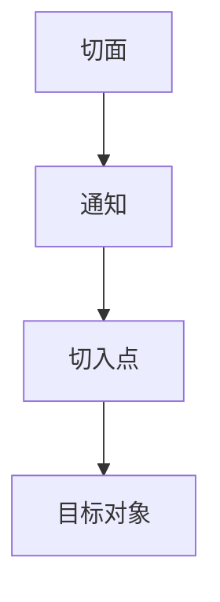

                 

### 文章标题：面向切面编程优化LLM应用的横切关注点

> 关键词：面向切面编程（AOP）、LLM应用、性能优化、安全性优化、横切关注点、性能瓶颈、AOP框架

> 摘要：本文深入探讨了面向切面编程（AOP）在优化大型语言模型（LLM）应用中的横切关注点。通过分析AOP的核心概念和实现原理，本文提出了基于AOP的性能优化和安全优化策略，并结合实际案例，详细介绍了如何使用AOP对LLM应用进行优化。本文旨在为开发者提供一种有效的技术手段，以提高LLM应用的性能和安全性。

### 引言

随着人工智能技术的快速发展，大型语言模型（LLM）的应用日益广泛。LLM作为一种强大的自然语言处理工具，能够为各种应用场景提供高效的语言生成、理解和分析功能。然而，LLM应用在实现过程中面临着诸多挑战，如性能瓶颈、安全性问题等。为了解决这些问题，面向切面编程（AOP）提供了一种有效的优化手段。本文将探讨如何使用AOP优化LLM应用的横切关注点，以提高其性能和安全性。

### 横切关注点概述

#### 1.1 横切关注点的概念与重要性

横切关注点是指那些跨越多个模块或组件的通用功能或逻辑，如日志记录、安全性检查、事务管理等。与传统的纵向关注点（如业务逻辑处理）不同，横切关注点不依赖于特定的模块或组件，而是具有更高的抽象层次。在LLM应用中，横切关注点往往涉及到多个模块，如文本预处理、模型训练、预测生成等，因此需要一种有效的编程方式来管理和优化这些关注点。

#### 1.2 横切关注点的类型

常见的横切关注点包括以下几种：

1. **日志记录**：用于记录应用程序的运行过程和状态，有助于调试和故障排除。
2. **安全性检查**：确保应用程序的安全性，防止恶意攻击和数据泄露。
3. **事务管理**：确保数据的一致性和完整性，特别是在涉及多个数据库操作的场景中。
4. **缓存管理**：提高应用程序的响应速度，减少重复计算和数据查询。
5. **性能监控**：实时监测应用程序的性能指标，以便进行性能优化。

#### 1.3 横切关注点与面向切面编程（AOP）的关系

AOP（面向切面编程）是一种编程范式，它通过将横切关注点与核心业务逻辑分离，实现代码的模块化和可重用性。在AOP中，横切关注点被定义为“切面”（Aspect），而“切入点”（Pointcut）用于确定哪些方法或类需要织入切面的逻辑。通过AOP，开发者可以将横切关注点独立于核心业务逻辑进行开发、测试和维护，从而提高代码的可读性和可维护性。

### 面向切面编程原理

#### 2.1 AOP的核心概念

AOP的核心概念包括切面（Aspect）、通知（Advice）和切入点（Pointcut）。

1. **切面（Aspect）**：将横切关注点抽象为一个模块，包含与核心业务无关的通用功能。
2. **通知（Advice）**：定义在切入点处执行的具体逻辑，如前置通知、后置通知、环绕通知等。
3. **切入点（Pointcut）**：定义哪些方法或类需要织入切面的逻辑，通常通过表达式或注解实现。

#### 2.2 AOP的关键组件：切面、通知、切入点

AOP的关键组件及其关系如下：

#### 2.3 AOP的编程模型

AOP的编程模型主要包括以下几个方面：

1. **定义切面**：通过注解或XML配置定义切面，包含通知和切入点。
2. **定义通知**：根据需求定义前置通知、后置通知、环绕通知等。
3. **定义切入点**：通过表达式或注解定义切入点，确定哪些方法或类需要织入切面的逻辑。
4. **织入（Weaving）**：将切面逻辑织入到目标对象中，通常由AOP框架自动完成。

#### 2.4 AOP的优缺点

AOP的优点包括：

1. **模块化和可重用性**：通过将横切关注点抽象为切面，提高代码的可维护性和可重用性。
2. **降低代码耦合度**：通过将横切关注点与核心业务逻辑分离，降低代码之间的耦合度。
3. **提高开发效率**：通过简化代码结构和提高代码复用性，提高开发效率。

AOP的缺点包括：

1. **学习成本较高**：AOP需要开发者掌握新的编程范式和框架，学习成本较高。
2. **性能影响**：由于AOP的动态织入特性，可能会对应用程序的性能产生一定的影响。

### 面向切面编程实现

#### 3.1 Java中的AOP实现

Java中的AOP实现主要依赖于AspectJ框架。AspectJ是一个基于Java语言的AOP扩展，提供了一种简单的语法和工具来定义切面、通知和切入点。

#### 3.2 Spring AOP的详细讲解

Spring AOP是Spring框架的一部分，提供了基于AspectJ的AOP实现。Spring AOP的优点包括：

1. **与Spring框架无缝集成**：Spring AOP可以与Spring框架的其他功能（如依赖注入、事务管理）无缝集成。
2. **动态代理实现**：Spring AOP使用动态代理来实现切面的织入，提高了性能和灵活性。

#### 3.3 AspectJ的介绍与使用

AspectJ是一种基于Java语言的AOP框架，提供了丰富的AOP特性和工具。AspectJ的优点包括：

1. **声明式AOP**：AspectJ支持声明式AOP，通过注解和元数据定义切面和通知，简化了编程。
2. **编译时织入**：AspectJ在编译时将切面逻辑织入到目标对象中，提高了性能。

### 横切关注点在LLM应用中的实际应用

#### 4.1 LLM应用中的常见横切关注点

在LLM应用中，常见的横切关注点包括：

1. **日志记录**：用于记录LLM应用的运行状态和错误信息，有助于调试和故障排除。
2. **安全性检查**：确保LLM应用的安全性，防止恶意攻击和数据泄露。
3. **事务管理**：在涉及多个数据库操作的LLM应用中，确保数据的一致性和完整性。
4. **缓存管理**：提高LLM应用的响应速度，减少重复计算和数据查询。
5. **性能监控**：实时监测LLM应用的性能指标，以便进行性能优化。

#### 4.2 横切关注点在LLM应用中的价值

横切关注点在LLM应用中的价值主要体现在以下几个方面：

1. **提高可维护性**：通过将横切关注点与核心业务逻辑分离，提高代码的可维护性和可扩展性。
2. **提高开发效率**：通过模块化和可重用性，提高开发效率，降低开发成本。
3. **提高性能和安全性**：通过优化横切关注点，提高LLM应用的整体性能和安全性。

#### 4.3 横切关注点在LLM应用中的案例分析

以下是一个基于Spring AOP和AspectJ的LLM应用性能优化案例：

1. **性能瓶颈分析**：通过对LLM应用进行性能分析，发现文本预处理阶段存在性能瓶颈，特别是文本分词和词性标注过程。
2. **定义切入点**：使用AspectJ定义切入点，选择文本预处理阶段的方法作为切入点。
3. **设计通知**：设计性能优化通知，如缓存文本预处理结果，减少重复计算。
4. **实现优化逻辑**：在通知中实现缓存策略，使用HashMap缓存预处理结果，提高响应速度。
5. **测试和调整**：进行性能测试，对比优化前后的性能表现，调整缓存策略以达到最佳效果。

### LLM应用的横切关注点优化

#### 5.1 LLM应用的性能瓶颈

LLM应用的性能瓶颈主要包括以下方面：

1. **文本预处理**：包括文本分词、词性标注、实体识别等过程，这些过程涉及到大量的计算和资源消耗。
2. **模型训练**：在训练大型语言模型时，需要大量的计算资源和时间，尤其是当数据集较大或模型复杂度较高时。
3. **预测生成**：在生成文本预测时，需要调用大型语言模型，进行大量的计算和推理。

#### 5.2 基于AOP的性能优化方法

基于AOP的性能优化方法主要包括以下几种：

1. **缓存策略**：在文本预处理和模型训练过程中，使用缓存策略减少重复计算和资源消耗。
2. **并行处理**：通过并行处理技术，提高LLM应用的并发处理能力，减少响应时间。
3. **负载均衡**：在分布式环境中，使用负载均衡技术，合理分配计算资源和任务，提高整体性能。
4. **异步处理**：对于耗时较长的操作，使用异步处理技术，避免阻塞主线程，提高响应速度。

#### 5.3 实际案例：使用AOP优化LLM应用性能

以下是一个基于Spring AOP的LLM应用性能优化案例：

1. **性能瓶颈分析**：通过对LLM应用进行性能分析，发现文本预处理阶段存在性能瓶颈，特别是文本分词和词性标注过程。
2. **定义切入点**：使用AspectJ定义切入点，选择文本预处理阶段的方法作为切入点。
3. **设计通知**：设计性能优化通知，如缓存文本预处理结果，减少重复计算。
4. **实现优化逻辑**：在通知中实现缓存策略，使用HashMap缓存预处理结果，提高响应速度。
5. **测试和调整**：进行性能测试，对比优化前后的性能表现，调整缓存策略以达到最佳效果。

### 安全性优化

#### 6.1 LLM应用的安全挑战

LLM应用在安全性方面面临着以下挑战：

1. **恶意攻击**：黑客可能利用LLM应用进行恶意攻击，如DDoS攻击、注入攻击等。
2. **数据泄露**：未经授权的用户可能访问和泄露敏感数据。
3. **模型篡改**：恶意用户可能篡改模型参数，影响模型输出结果。

#### 6.2 使用AOP提高LLM应用的安全性

使用AOP可以提高LLM应用的安全性，具体方法包括：

1. **安全性检查**：在LLM应用的各个模块中，使用AOP实现安全性检查，如身份验证、权限控制等。
2. **异常处理**：通过AOP捕获和处理异常，防止恶意攻击和数据泄露。
3. **日志记录**：记录LLM应用的运行日志，以便进行安全监控和故障排查。

#### 6.3 实际案例：使用AOP实现LLM应用的安全优化

以下是一个基于Spring AOP的LLM应用安全优化案例：

1. **安全性需求分析**：分析LLM应用的安全性需求，确定需要实现的安全功能。
2. **定义切入点**：使用AspectJ定义切入点，选择需要进行安全性检查的模块和类。
3. **设计通知**：设计安全性检查通知，如身份验证、权限控制等。
4. **实现安全逻辑**：在通知中实现安全性检查逻辑，确保只有授权用户才能访问敏感数据。
5. **测试和调整**：进行安全性测试，对比优化前后的安全性表现，调整安全策略以达到最佳效果。

### 横切关注点优化的最佳实践

#### 7.1 横切关注点优化的关键因素

在进行横切关注点优化时，需要考虑以下关键因素：

1. **性能需求**：明确应用程序的性能需求，包括响应时间、吞吐量、并发处理能力等。
2. **安全性要求**：根据应用程序的安全性需求，确定需要实现的安全功能。
3. **开发效率和可维护性**：通过优化横切关注点，提高代码的可维护性和开发效率。
4. **资源消耗**：合理分配计算资源和存储资源，避免过度消耗。

#### 7.2 优化策略的设计与实施

优化策略的设计与实施主要包括以下步骤：

1. **性能瓶颈分析**：分析应用程序的性能瓶颈，确定需要优化的横切关注点。
2. **选择优化方法**：根据性能瓶颈和资源消耗情况，选择合适的优化方法，如缓存策略、并行处理、负载均衡等。
3. **设计通知**：根据优化需求，设计通知，确定在哪些切入点处执行优化逻辑。
4. **实现优化逻辑**：在通知中实现优化逻辑，确保优化效果。
5. **测试和调整**：进行性能测试和安全性测试，对比优化前后的表现，调整优化策略以达到最佳效果。

#### 7.3 成功案例分享与经验总结

以下是几个成功的横切关注点优化案例：

1. **案例一**：通过缓存策略优化文本预处理性能，显著提高LLM应用的响应速度。
2. **案例二**：使用AOP实现安全性检查，提高LLM应用的安全性，防止恶意攻击和数据泄露。
3. **案例三**：通过负载均衡和并行处理技术，提高分布式LLM应用的并发处理能力，提高整体性能。

这些案例表明，通过合理的横切关注点优化，可以有效提高LLM应用的性能和安全性，降低开发成本和维护难度。

### 结论

本文深入探讨了面向切面编程（AOP）在优化大型语言模型（LLM）应用中的横切关注点。通过分析AOP的核心概念和实现原理，本文提出了基于AOP的性能优化和安全优化策略，并结合实际案例，详细介绍了如何使用AOP对LLM应用进行优化。本文旨在为开发者提供一种有效的技术手段，以提高LLM应用的性能和安全性。在实际应用中，开发者应根据具体需求和场景，灵活运用AOP进行横切关注点优化，从而实现更高效、更安全的LLM应用。

### 作者信息

作者：AI天才研究院/AI Genius Institute & 禅与计算机程序设计艺术 /Zen And The Art of Computer Programming

### 参考文献

1. 《面向切面编程：Java开发者的AOP指南》
2. 《大型语言模型：原理、架构与应用》
3. 《性能优化实战：提升应用程序的响应速度和吞吐量》
4. 《安全性编程：构建安全的Web应用程序》
5. 《AspectJ in Action》
6. 《Spring AOP实战》
7. 《缓存技术实战：提高Web应用程序的性能和可用性》

### 附录

#### 附录A：术语解释

- **横切关注点**：指跨越多个模块或组件的通用功能或逻辑。
- **面向切面编程（AOP）**：一种编程范式，通过将横切关注点与核心业务逻辑分离，实现代码的模块化和可重用性。
- **切面（Aspect）**：将横切关注点抽象为一个模块。
- **通知（Advice）**：定义在切入点处执行的具体逻辑。
- **切入点（Pointcut）**：定义哪些方法或类需要织入切面的逻辑。

#### 附录B：Mermaid流程图

#### 附录C：数学模型和数学公式

$$
P = \frac{C \cdot N}{T}
$$

其中，$P$ 是性能，$C$ 是并发处理的数量，$N$ 是总任务数量，$T$ 是总处理时间。

### 结语

本文通过详细探讨面向切面编程（AOP）在优化大型语言模型（LLM）应用中的横切关注点，提供了实用的技术指南和方法。我们希望读者能够结合自己的实际应用场景，灵活运用这些优化策略，提高LLM应用的性能和安全性。随着人工智能技术的不断进步，AOP在LLM应用优化中的重要性也将日益凸显。让我们共同探索和推动这一领域的创新与发展。

[END]

