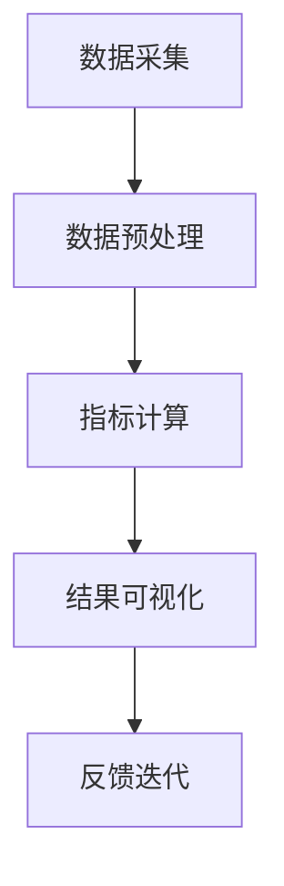
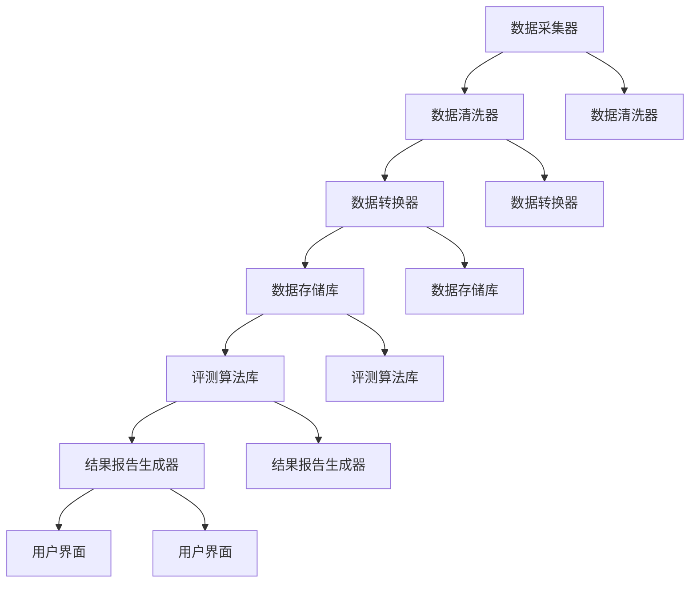
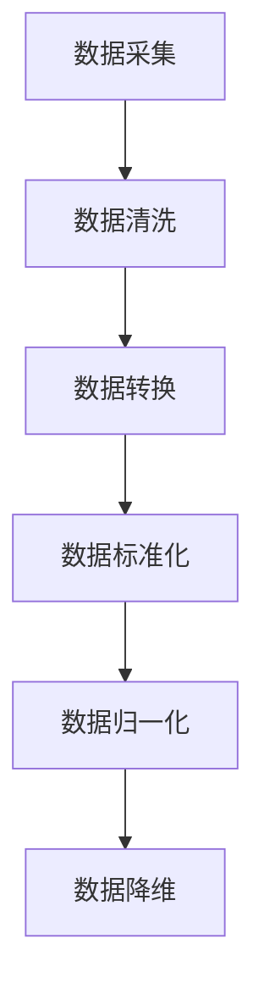
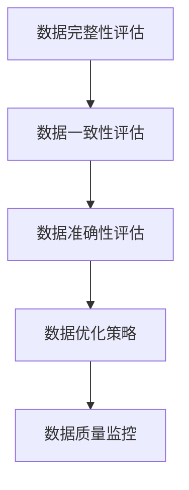

                 

### 第一部分：引言

#### 1.1 书籍背景与目标

《领域特定评测模块：精准评估垂直应用》旨在为IT从业者和研究者提供一本关于如何构建和应用领域特定评测模块的权威指南。随着信息技术的飞速发展和垂直应用领域的不断深化，评测模块在各个行业中的应用变得越来越重要。本书将带领读者了解评测模块的基本概念、设计原理和应用实践，旨在帮助读者掌握构建高效、精准的评测模块的核心技能。

#### 1.1.1 领域特定评测模块的定义

领域特定评测模块（Domain-Specific Evaluation Modules，简称DSEM）是指针对特定行业或领域的应用需求，设计的一套具有特定功能的评测工具或系统。这些评测模块通常涵盖了数据采集、数据预处理、评测指标计算、结果可视化和反馈迭代等关键环节，能够对垂直应用的效果进行全面的评估和优化。

#### 1.1.2 垂直应用的特点与挑战

垂直应用是指针对特定行业或领域开发的应用系统，如金融领域的风控系统、医疗领域的电子病历系统、电商领域的推荐系统等。垂直应用具有以下特点：

1. **业务需求的特殊性**：每个垂直应用都有其独特的业务需求和场景，需要根据具体需求进行定制化开发。
2. **数据类型的多样性**：垂直应用涉及的数据类型繁多，包括结构化数据、半结构化数据和非结构化数据，对数据处理提出了更高的要求。
3. **性能和可靠性的要求**：垂直应用通常对性能和可靠性有较高的要求，如金融领域的交易系统需要在毫秒级响应，医疗领域的诊断系统需要在诊断结果上高度可靠。

同时，垂直应用也面临着一些挑战：

1. **数据质量**：由于数据来源多样化、数据格式不统一，数据质量问题往往成为垂直应用的瓶颈。
2. **性能优化**：垂直应用通常需要处理海量数据，如何在保证性能的同时实现高效的数据处理和计算，是开发者需要解决的问题。
3. **用户体验**：对于面向最终用户的应用系统，如何提供良好的用户体验，提升用户满意度，也是垂直应用开发的重要目标。

#### 1.1.3 本书的目标与读者群体

本书的目标是：

1. **介绍领域特定评测模块的基本概念和设计原理**：帮助读者了解评测模块的组成部分、功能模块和核心算法。
2. **阐述评测模块在垂直应用中的重要性**：通过具体案例展示评测模块如何提升垂直应用的效果和性能。
3. **提供实用的开发实践和最佳实践**：分享实际项目中积累的经验和技巧，帮助读者快速掌握评测模块的开发和应用。

本书的读者群体主要包括：

1. **IT从业者和开发者**：特别是从事垂直应用开发的人员，如金融、医疗、电商等领域的技术人员。
2. **研究和教育机构的研究生和博士生**：对领域特定评测模块感兴趣的学术研究者。
3. **技术爱好者和专业培训者**：希望深入了解领域特定评测模块的广大技术爱好者。

通过阅读本书，读者将能够：

1. **了解领域特定评测模块的基本概念和架构设计**：掌握评测模块的组成和功能模块。
2. **理解评测模块在垂直应用中的重要性**：认识到评测模块对于提升垂直应用效果的关键作用。
3. **掌握评测模块的开发和实践技能**：通过实际案例和实践技巧，提升自己的开发能力和技术水平。

在接下来的章节中，本书将逐步深入探讨领域特定评测模块的核心概念、原理和实战应用，帮助读者全面了解这一重要领域，并掌握其核心技能。

#### 1.2 垂直应用的现状与需求

#### 1.2.1 垂直应用的发展历程

垂直应用的发展历程可以追溯到20世纪末和21世纪初期。随着互联网技术的兴起，各行各业开始探索如何利用信息技术提升业务效率和服务质量。早期的一些典型垂直应用包括电子商务、在线银行、在线教育等。这些应用的出现极大地改变了传统行业的运营模式，为用户提供了更加便捷的服务。

进入21世纪，随着大数据、云计算、人工智能等新技术的快速发展，垂直应用迎来了新的发展阶段。大数据技术使得企业能够从海量数据中提取有价值的信息，从而实现更精准的业务决策和个性化服务。云计算技术的普及则为垂直应用提供了强大的计算能力和灵活的资源调度，使得企业能够更加便捷地部署和维护应用系统。人工智能技术的应用则进一步提升了垂直应用的智能化水平和用户体验。

在垂直应用的发展历程中，不同行业的技术演进路径有所不同。例如，在金融领域，随着金融科技的快速发展，移动支付、区块链、智能投顾等新型应用不断涌现，极大地丰富了金融服务的种类和形式。在医疗领域，电子病历、远程医疗、智能诊断等应用为医疗资源的优化配置和医疗服务的提升提供了新的解决方案。在电商领域，个性化推荐、智能客服、供应链管理等应用则为电商业务的持续增长提供了有力支持。

#### 1.2.2 当前垂直应用的分类

当前垂直应用可以根据应用领域和业务特点进行分类，主要可以分为以下几个类别：

1. **金融领域**：包括移动支付、区块链、电子银行、保险科技等。这些应用利用大数据、人工智能等技术，提升了金融服务的效率和安全性，为用户提供了更加便捷的金融服务。
2. **医疗领域**：包括电子病历、远程医疗、智能诊断、健康管理等。这些应用通过信息化手段，优化了医疗资源的配置，提高了医疗服务的质量和效率。
3. **电商领域**：包括电子商务、智能推荐、智能客服、供应链管理等。这些应用通过大数据分析和人工智能技术，提升了电商平台的运营效率和用户体验。
4. **物联网领域**：包括智能家居、智能城市、智能工业等。这些应用通过物联网技术和大数据分析，实现了设备互联、数据共享和智能控制，为智慧城市和智慧工业的建设提供了技术支持。
5. **教育领域**：包括在线教育、智能教学、虚拟课堂等。这些应用通过互联网和人工智能技术，改变了传统教育模式，提供了更加灵活和个性化的学习方式。

#### 1.2.3 垂直应用对评测模块的需求

垂直应用对评测模块的需求主要体现在以下几个方面：

1. **性能评估**：垂直应用通常需要处理海量数据和高并发的访问请求，对系统的性能有较高的要求。评测模块可以通过性能测试，评估系统的响应时间、吞吐量、资源利用率等关键性能指标，为系统的性能优化提供依据。
2. **功能评估**：评测模块可以对垂直应用的功能进行评估，包括功能完整性、功能正确性、功能可用性等。通过功能测试，可以确保垂直应用能够满足业务需求，提高用户的满意度。
3. **可靠性评估**：垂直应用通常需要长期稳定运行，对系统的可靠性有较高的要求。评测模块可以通过故障注入、压力测试等方法，评估系统的可靠性，包括故障恢复能力、数据一致性、系统稳定性等。
4. **用户体验评估**：评测模块可以对垂直应用的用户体验进行评估，包括界面设计、交互流程、响应速度等。通过用户体验测试，可以优化应用的界面设计和交互流程，提升用户的满意度。
5. **安全评估**：评测模块可以对垂直应用的安全性能进行评估，包括数据安全性、网络安全、访问控制等。通过安全测试，可以确保垂直应用能够抵御各种安全威胁，保护用户的数据安全。

总之，评测模块在垂直应用中发挥着重要的作用，通过对性能、功能、可靠性、用户体验和安全等方面的全面评估，可以有效地提升垂直应用的质量和用户体验，为企业的持续发展和竞争力提升提供支持。

#### 1.3 评测模块的重要性

评测模块在IT领域，尤其是垂直应用中，扮演着至关重要的角色。其核心作用体现在以下几个方面：

**1.3.1 评测模块的基本作用**

首先，评测模块的基本作用是对垂直应用进行全面、准确的评估。具体来说，它能够：

- **数据采集**：从多个数据源中收集相关数据，确保数据的全面性和准确性。
- **数据预处理**：对采集到的数据进行清洗、转换和标准化，提高数据质量，为后续分析打下坚实基础。
- **指标计算**：根据预设的评测指标体系，对数据进行处理和分析，计算关键性能指标，如响应时间、吞吐量、错误率等。
- **结果可视化**：将评测结果以图表、报表等形式展示，使评估结果更加直观，便于用户理解和分析。
- **反馈迭代**：根据用户反馈，对评测模块进行调整和优化，实现持续改进，提升应用性能和用户体验。

**1.3.2 评测模块在垂直应用中的价值**

其次，评测模块在垂直应用中的价值不容忽视。具体体现在以下几个方面：

- **性能优化**：通过评测模块，可以及时发现系统中的性能瓶颈，如响应时间过长、资源利用率过低等，从而进行针对性的性能优化，提升系统整体性能。
- **功能验证**：评测模块能够对垂直应用的功能进行全面的验证，确保功能实现的正确性和完整性，避免功能缺陷对业务造成负面影响。
- **可靠性提升**：通过可靠性评估，评测模块能够发现系统中的潜在故障点，提高系统的稳定性和可靠性，降低故障率，保障业务的连续性。
- **用户体验改善**：评测模块可以对用户体验进行量化评估，识别用户体验中的痛点，提供优化方案，提升用户满意度。
- **安全防护**：评测模块能够对系统的安全性能进行评估，发现潜在的安全漏洞，采取相应的防护措施，提高系统的安全性，保护用户数据安全。

**1.3.3 评测模块的发展趋势**

随着技术的不断进步和应用场景的多样化，评测模块也在不断发展。未来，评测模块将呈现以下发展趋势：

- **智能化**：随着人工智能技术的发展，评测模块将变得更加智能化，能够自动识别和优化评测过程中的问题，提高评估效率和准确性。
- **自动化**：自动化测试工具和技术的应用，将使评测模块更加自动化，减少人工干预，提高测试效率和覆盖率。
- **实时性**：评测模块将支持实时评估，能够在系统运行过程中实时监控和评估性能，及时发现问题并进行优化。
- **多样性**：随着垂直应用的不断扩展，评测模块将支持更多类型的评测，如安全评测、用户体验评测等，满足多样化的需求。
- **协作性**：评测模块将支持多团队、多角色的协作，实现评测结果的可视化和共享，提高协作效率和决策质量。

综上所述，评测模块在垂直应用中具有不可替代的重要作用，其价值体现在性能优化、功能验证、可靠性提升、用户体验改善和安全防护等多个方面。随着技术的进步，评测模块将不断发展，为垂直应用提供更加全面和高效的评估和优化支持。

### 第二部分：评测模块核心概念与原理

#### 2.1 评测模块架构设计

##### 2.1.1 评测模块的基本架构

评测模块是针对特定领域或应用需求设计的，用于对系统或服务进行全面评估的工具集合。一个典型的评测模块通常包括以下基本架构部分：

- **数据采集模块**：负责从各种数据源（如数据库、日志文件、网络接口等）收集所需的数据。
- **数据预处理模块**：对采集到的原始数据进行清洗、转换和标准化，以提高数据质量，确保后续分析的有效性。
- **评测指标计算模块**：根据预设的评测指标体系，对预处理后的数据进行处理和分析，计算关键性能指标。
- **结果可视化模块**：将评测结果以图表、报表等形式展示，便于用户理解和分析。
- **反馈迭代模块**：根据用户反馈，对评测模块进行调整和优化，实现持续改进。

以下是一个简化的Mermaid流程图，展示了评测模块的基本架构：



在这个流程图中，数据采集模块负责获取所需的数据，数据预处理模块对数据进行清洗和格式化，指标计算模块根据预设的指标进行计算，结果可视化模块将计算结果以图表或报表的形式展示，反馈迭代模块则根据用户反馈对整个评测模块进行调整和优化。

##### 2.1.2 评测模块的功能模块

评测模块的具体功能模块可能会因应用场景和需求的不同而有所差异，但通常包括以下几个关键部分：

- **数据采集器**：负责从各种数据源中提取数据，如API接口调用、爬虫技术、数据库连接等。数据采集器的核心目标是高效地获取准确的数据，以满足后续分析的需求。

- **数据清洗器**：对采集到的数据进行清洗，包括去除重复记录、填补缺失值、处理异常值等。数据清洗器的目的是提高数据质量，确保后续分析的准确性。

- **数据转换器**：将清洗后的数据转换为统一的格式，如时间序列的归一化、文本数据的编码等。数据转换器的目标是为后续的指标计算和分析提供标准化的数据。

- **数据存储库**：用于存储预处理后的数据，便于后续分析和计算。数据存储库可以是关系型数据库、NoSQL数据库或者分布式存储系统，选择合适的存储方式可以显著影响评测模块的性能。

- **评测算法库**：包含各种评测算法，如线性回归、决策树、支持向量机等，以及相应的优化策略。评测算法库是评测模块的核心组件，负责对数据进行处理和分析，生成评测结果。

- **结果报告生成器**：根据评测结果生成报告，包括关键指标、图表展示、分析结论等。结果报告生成器提供了直观的展示方式，使评估结果更加易于理解和分析。

- **用户界面**：提供友好的用户界面，使用户能够轻松操作评测模块，查看评估结果和报告。用户界面的设计直接影响用户的操作体验和评估模块的使用效果。

在实际应用中，这些功能模块可能会通过微服务架构、容器化技术等现代软件开发技术进行实现，以提高模块的灵活性和可扩展性。以下是一个更详细的Mermaid流程图，展示了评测模块的功能模块及其交互关系：



在这个流程图中，每个功能模块都承担了特定的任务，并通过数据流和交互实现了整个评测过程。通过这种模块化设计，评测模块不仅易于开发和维护，而且可以根据具体需求灵活地进行扩展和调整。

#### 2.2 数据采集与预处理

##### 2.2.1 数据采集方法

数据采集是评测模块的基础环节，直接决定了后续数据分析和评估的准确性。数据采集方法主要包括以下几种：

1. **API接口调用**：通过程序调用第三方API接口，获取所需数据。这种方法适用于需要从外部服务或系统获取数据的情况，如金融领域的交易数据、电商平台的用户行为数据等。

2. **爬虫技术**：利用爬虫程序自动从互联网上抓取数据。这种方法适用于从大量网页或公开数据源获取数据的情况，如社交媒体数据、新闻报道数据等。

3. **数据库连接**：直接连接到数据库，读取所需数据。这种方法适用于需要对内部数据库进行数据采集的情况，如企业内部数据仓库、数据库日志等。

4. **传感器数据采集**：通过传感器设备收集环境数据，如气象数据、交通数据等。这种方法适用于物联网和智能城市等领域的数据采集。

在选择数据采集方法时，需要考虑数据源的特点、数据量的大小、数据采集的频率以及系统的性能要求等因素。例如，对于实时性要求较高的应用，可能需要选择API接口调用或数据库连接等高效的数据采集方法；而对于大规模数据采集，则可能需要使用爬虫技术或传感器数据采集等手段。

##### 2.2.2 数据预处理技术

数据预处理是确保数据质量和一致性的重要环节，通常包括以下几种技术：

1. **数据清洗**：去除重复记录、缺失值填充、异常值处理等，以提高数据质量。例如，对于缺失值，可以使用均值、中位数或插值法进行填充；对于异常值，可以使用统计学方法或机器学习算法进行识别和修正。

2. **数据转换**：将不同格式或单位的数据转换为统一的格式，以便后续分析。例如，将时间序列数据进行归一化处理，将文本数据编码为数值向量等。

3. **数据标准化**：通过标准化技术，将不同量纲的数据转换为同一量纲，以便进行有效的比较和分析。常见的标准化方法包括Z-Score标准化、Min-Max标准化等。

4. **数据归一化**：将不同数据源的数据归一化到同一尺度，以便进行数据融合和分析。例如，对于图像数据，可以采用像素值归一化；对于文本数据，可以采用词频归一化等。

5. **数据降维**：通过降维技术，减少数据维度，降低数据复杂度，提高计算效率和数据分析效果。常见的降维方法包括主成分分析（PCA）、线性判别分析（LDA）等。

数据预处理技术的选择和实现需要根据具体应用场景和数据特点进行综合考虑。以下是一个简单的数据预处理流程，包括数据清洗、数据转换和数据标准化：



在这个流程图中，数据采集模块首先获取原始数据，然后通过数据清洗模块去除重复记录、填充缺失值和处理异常值。接下来，数据转换模块将数据转换为统一的格式，数据标准化模块将不同量纲的数据转换为同一量纲，数据归一化模块将数据归一化到同一尺度，最后通过数据降维模块降低数据维度，为后续的指标计算和分析做好准备。

##### 2.2.3 数据质量评估与优化

数据质量评估与优化是数据预处理的重要环节，直接影响数据分析和评估的准确性。以下是一些常见的数据质量评估和优化方法：

1. **数据完整性评估**：检查数据表中是否存在缺失值、重复值或异常值，确保数据完整性。可以使用如`缺失值计数`、`重复值检测`等工具进行评估。

2. **数据一致性评估**：检查数据在不同来源、不同格式间的差异，确保数据一致性。例如，检查数据表中的数据是否与其他系统中的数据一致。

3. **数据准确性评估**：通过统计方法、机器学习算法等评估数据的准确性，识别和修正错误数据。例如，使用回归模型进行数据拟合，检测数据点的异常。

4. **数据可用性评估**：评估数据是否满足分析需求，包括数据的粒度、覆盖范围等。例如，检查数据表中的字段是否涵盖了所有关键信息。

5. **数据优化策略**：针对数据质量问题，采取相应的优化策略，如数据清洗、数据转换、数据融合等。例如，使用机器学习算法进行缺失值填充、使用标准化方法确保数据一致性。

6. **数据质量监控**：建立数据质量监控机制，持续监控数据质量，及时发现和处理数据问题。例如，定期运行数据质量检查脚本、设置数据质量阈值等。

以下是一个简单的数据质量评估与优化流程，包括数据完整性评估、数据一致性评估和数据准确性评估：



在这个流程图中，数据完整性评估模块检查数据表中是否存在缺失值、重复值或异常值，数据一致性评估模块检查数据在不同来源、不同格式间的差异，数据准确性评估模块通过统计方法和机器学习算法评估数据的准确性。接下来，根据评估结果，采取数据优化策略进行数据清洗、数据转换和数据融合，最后通过数据质量监控模块持续监控数据质量，确保数据质量达到分析需求。

通过以上数据质量评估与优化方法，可以显著提高数据质量，为后续的数据分析和评估提供可靠的数据基础。

### 2.3 评测指标体系

##### 2.3.1 评测指标的定义与分类

在评测模块中，评测指标（Evaluation Metrics）是评估系统或应用性能的核心要素。它们用于量化评估系统的各个方面，如响应时间、吞吐量、错误率等。正确选择和定义评测指标对于全面、准确地评估系统性能至关重要。

**1. 常见的评测指标定义：**

- **响应时间（Response Time）**：系统从接收到请求到返回结果所经历的时间。通常用于评估系统的实时性。
- **吞吐量（Throughput）**：系统在单位时间内处理的数据量或请求量。通常用于评估系统的处理能力。
- **错误率（Error Rate）**：系统在处理请求时发生错误的频率。通常用于评估系统的可靠性。
- **资源利用率（Resource Utilization）**：系统使用的资源（如CPU、内存、网络带宽等）的百分比。通常用于评估系统的资源管理效率。
- **并发数（Concurrent Users）**：系统同时处理的用户数量。通常用于评估系统的并发处理能力。
- **可用性（Availability）**：系统正常运行的时间比例。通常用于评估系统的稳定性。

**2. 评测指标的分类：**

- **性能指标**：用于评估系统的性能，如响应时间、吞吐量、资源利用率等。
- **功能指标**：用于评估系统的功能实现，如正确性、完整性等。
- **可靠性指标**：用于评估系统的可靠性，如错误率、可用性等。
- **用户体验指标**：用于评估用户的满意度，如交互流畅度、响应速度等。
- **安全指标**：用于评估系统的安全性能，如漏洞数量、攻击频率等。

##### 2.3.2 常见评测指标详细讲解（使用伪代码）

**1. 响应时间（Response Time）**

```python
# 伪代码：计算系统的平均响应时间

response_times = []  # 存储每次请求的响应时间
for request in requests:
    start_time = current_time()
    process_request(request)
    end_time = current_time()
    response_time = end_time - start_time
    response_times.append(response_time)

average_response_time = sum(response_times) / len(response_times)
print("平均响应时间：", average_response_time)
```

**2. 吞吐量（Throughput）**

```python
# 伪代码：计算系统的吞吐量

start_time = current_time()
for request in requests:
    process_request(request)
end_time = current_time()

total_requests = len(requests)
throughput = total_requests / (end_time - start_time)
print("吞吐量：", throughput)
```

**3. 错误率（Error Rate）**

```python
# 伪代码：计算系统的错误率

total_requests = len(requests)
total_errors = count_errors(requests)
error_rate = total_errors / total_requests
print("错误率：", error_rate)
```

**4. 资源利用率（Resource Utilization）**

```python
# 伪代码：计算系统的CPU资源利用率

start_time = current_time()
run_system()
end_time = current_time()

cpu_usage = get_cpu_usage()  # 获取系统CPU利用率
resource_utilization = cpu_usage / (end_time - start_time)
print("CPU资源利用率：", resource_utilization)
```

**5. 并发数（Concurrent Users）**

```python
# 伪代码：计算系统的并发用户数

max_concurrent_users = 0
current_concurrent_users = 0
for user in users:
    if user.is_logged_in():
        current_concurrent_users += 1
        if current_concurrent_users > max_concurrent_users:
            max_concurrent_users = current_concurrent_users
    else:
        current_concurrent_users -= 1

print("最大并发用户数：", max_concurrent_users)
```

**6. 可用性（Availability）**

```python
# 伪代码：计算系统的可用性

total_time = 24 * 60 * 60  # 24小时
up_time = get_up_time()  # 获取系统正常运行时间
availability = up_time / total_time
print("可用性：", availability)
```

通过上述伪代码示例，我们可以清晰地定义和计算常见的评测指标，为后续的系统性能评估提供数据基础。在实际应用中，根据具体需求和场景，还可以定义和计算更多特定于应用的评测指标。

##### 2.3.3 评测指标体系的设计原则

设计一个有效的评测指标体系是评测模块成功的关键。以下是一些核心的设计原则：

**1. 全面性**：评测指标体系应覆盖系统或应用的各个方面，包括性能、功能、可靠性、用户体验和安全等，以确保全面评估。

**2. 可量化**：评测指标应具有明确的定义和可量化的度量标准，以便进行准确的计算和比较。

**3. 相关性**：评测指标应与系统或应用的业务目标紧密相关，能够反映系统性能和用户体验的关键方面。

**4. 实时性**：对于一些关键性能指标，如响应时间、吞吐量等，应支持实时监控和评估，以便及时发现和解决问题。

**5. 可扩展性**：评测指标体系应具备良好的可扩展性，能够方便地添加或修改新指标，以适应不同应用场景和需求的变化。

**6. 客观性**：评测指标应基于客观的数据和事实，避免主观判断，确保评估结果的公正性和可靠性。

**7. 可操作性**：评测指标应易于操作和实现，便于实际开发和测试过程中使用。

通过遵循这些设计原则，可以构建一个高效、全面且具有实际应用价值的评测指标体系，为系统优化和业务决策提供有力支持。

### 2.4 评测算法原理

##### 2.4.1 常见评测算法概述

在评测模块中，选择合适的评测算法对于评估结果的有效性和准确性至关重要。以下是一些常见的评测算法及其基本原理：

**1. 决策树（Decision Tree）**

决策树是一种基于特征划分数据的算法，通过一系列条件判断将数据划分为不同的类别。其基本原理是：

- **特征选择**：选择具有最高信息增益的特征进行划分。
- **递归划分**：基于选定的特征，对数据进行二分划分，生成树形结构。
- **分类预测**：通过遍历决策树，为新的数据点分配类别。

伪代码：

```python
def build_decision_tree(data, features):
    # 选择具有最高信息增益的特征进行划分
    best_feature = select_best_feature(data, features)
    # 创建节点，并划分数据
    node = {'feature': best_feature, 'split_value': split_value(data, best_feature)}
    # 递归构建子树
    for label in labels:
        subset = filter_data(data, best_feature, label)
        node['left'] = build_decision_tree(subset, features)
        node['right'] = build_decision_tree(data - subset, features)
    return node
```

**2. 线性回归（Linear Regression）**

线性回归是一种用于预测数值型结果的算法，通过建立输入变量和输出变量之间的线性关系。其基本原理是：

- **模型假设**：输出变量Y是输入变量X的线性组合，加上随机误差项。
- **损失函数**：选择合适的损失函数（如均方误差MSE），通过梯度下降等优化方法求解模型的参数。

伪代码：

```python
def linear_regression(X, Y):
    # 初始化模型参数
    weights = initialize_weights(X, Y)
    # 训练模型，优化参数
    for epoch in range(num_epochs):
        for x, y in zip(X, Y):
            prediction = weights.dot(x)
            loss = (prediction - y)**2
            weights -= learning_rate * gradient(loss, weights)
    return weights
```

**3. 支持向量机（Support Vector Machine，SVM）**

支持向量机是一种用于分类和回归的算法，通过找到最佳决策边界，将数据点分类到不同的类别。其基本原理是：

- **优化目标**：最大化分类边界到支持向量（离分类边界最近的点）的距离。
- **核函数**：通过核函数将低维数据映射到高维空间，实现线性不可分问题在特征空间中的线性可分。

伪代码：

```python
def svm(X, Y, kernel='linear'):
    # 初始化模型参数
    C = initialize_C()
    # 求解优化问题
    weights, bias = solve_optimization_problem(X, Y, C, kernel)
    return weights, bias
```

**4. 集成学习（Ensemble Learning）**

集成学习通过结合多个基学习器来提高预测性能，常见的方法包括Bagging、Boosting等。其基本原理是：

- **Bagging**：通过随机抽样和平均多个基学习器的预测结果，减少方差。
- **Boosting**：通过给每个基学习器赋予不同的权重，使它们更关注预测错误的样本，减少偏差。

伪代码：

```python
def bagging(base_learners, X, Y):
    predictions = [learner.predict(X) for learner in base_learners]
    return sum(predictions) / len(base_learners)

def boosting(base_learners, X, Y, weights):
    predictions = [learner.predict(X) for learner in base_learners]
    return sum([weight * prediction for weight, prediction in zip(weights, predictions)])
```

通过理解这些常见的评测算法原理，可以更好地选择和应用合适的算法，提升评测模块的性能和准确性。

##### 2.4.2 评测算法的选择与优化

选择合适的评测算法是评测模块设计中的关键环节。不同的算法具有不同的特点和适用场景，因此需要根据具体需求进行选择和优化。以下是一些选择与优化的建议：

**1. 数据类型和目标**

- **分类问题**：对于分类任务，可以选择决策树、支持向量机、随机森林等算法。其中，决策树直观易懂，但可能过拟合；支持向量机具有较好的分类边界，但在高维空间性能可能下降；随机森林通过集成多个决策树，可以有效降低过拟合。
- **回归问题**：对于回归任务，线性回归是最基础的选择，适用于线性关系明显的场景。当数据非线性时，可以考虑使用决策树回归、随机森林回归、神经网络等算法。
- **聚类问题**：对于聚类任务，可以使用K-means、层次聚类、DBSCAN等算法。K-means算法简单高效，但易受初始聚类中心影响；层次聚类可以生成层次结构，但计算复杂度较高；DBSCAN可以根据邻域关系自动确定聚类数量。

**2. 数据量与性能**

- **数据量**：对于小数据集，可以选择较为简单的算法，如线性回归、决策树等，这些算法易于实现且计算效率高。对于大数据集，可能需要选择并行计算、分布式处理等优化方法，如随机森林、XGBoost等。
- **性能需求**：如果对评估结果的实时性要求较高，可以选择轻量级算法，如线性回归、决策树等。如果对评估结果的准确性有更高要求，可以选择更复杂的算法，如神经网络、支持向量机等，但需要更多的时间和计算资源。

**3. 算法优化**

- **模型选择**：根据数据特征和任务需求，选择合适的算法。例如，对于非线性问题，可以选择支持向量机、神经网络等具有非线性变换能力的算法。
- **参数调优**：通过交叉验证、网格搜索等方法，优化算法的参数设置。例如，调整决策树的最大深度、支持向量机的正则化参数等，以提升模型性能。
- **特征工程**：通过特征选择、特征转换等方法，优化数据特征，提高模型对数据的敏感度。例如，使用特征组合、归一化、主成分分析等，增强模型的表现力。
- **集成学习**：结合多个基学习器，使用集成学习方法，如随机森林、XGBoost等，可以显著提高模型的性能和鲁棒性。

通过上述选择与优化策略，可以构建一个高效、准确的评测模块，为系统评估提供有力支持。

##### 2.4.3 评测算法的伪代码详细讲解

**1. 决策树算法**

以下是一个简单的决策树算法伪代码，用于分类任务：

```python
# 决策树分类算法伪代码

def build_decision_tree(data, features, labels):
    if all_samples_classify_same(labels):
        return leaf_node(labels)
    elif no_more_features_to_split(data, features):
        return leaf_node(majority_vote(labels))
    else:
        best_feature, best_split_value = select_best_split(data, features, labels)
        left_data, right_data = split_data(data, best_feature, best_split_value)
        tree = {'feature': best_feature, 'split_value': best_split_value,
                'left': build_decision_tree(left_data, features, labels),
                'right': build_decision_tree(right_data, features, labels)}
        return tree

def predict(data, tree):
    if is_leaf_node(tree):
        return tree['label']
    else:
        if data[tree['feature']] <= tree['split_value']:
            return predict(data, tree['left'])
        else:
            return predict(data, tree['right'])

# 示例：训练决策树并预测新数据
tree = build_decision_tree(train_data, train_features, train_labels)
new_data = get_new_data()
prediction = predict(new_data, tree)
print("预测结果：", prediction)
```

在这个伪代码中，`build_decision_tree`函数递归构建决策树，选择最优特征进行划分，直到无法进一步划分或所有样本属于同一类别。`predict`函数通过遍历决策树，为新的数据点分配类别。

**2. 线性回归算法**

以下是一个简单的线性回归算法伪代码：

```python
# 线性回归算法伪代码

def linear_regression(X, Y):
    # 初始化模型参数
    weights = np.zeros(X.shape[1])
    learning_rate = 0.01
    epochs = 1000
    for epoch in range(epochs):
        # 计算损失函数
        predictions = X.dot(weights)
        loss = (predictions - Y).dot((predictions - Y))
        # 计算梯度
        gradient = X.T.dot((predictions - Y))
        # 更新参数
        weights -= learning_rate * gradient
    return weights

# 示例：训练线性回归模型并预测新数据
weights = linear_regression(train_X, train_Y)
new_data = get_new_data()
prediction = new_data.dot(weights)
print("预测结果：", prediction)
```

在这个伪代码中，`linear_regression`函数通过梯度下降法优化模型参数，最小化损失函数。每次迭代，计算预测值和实际值的差，更新模型参数。

**3. 支持向量机（SVM）算法**

以下是一个简单的支持向量机算法伪代码，使用线性核函数：

```python
# 支持向量机（SVM）算法伪代码

def svm(X, Y, C=1.0):
    # 初始化模型参数
    alpha = np.zeros(len(Y))
    b = 0
    learning_rate = 0.01
    epochs = 1000
    for epoch in range(epochs):
        for i in range(len(Y)):
            prediction = X[i].dot(weights) + b
            loss = max(0, (1 - prediction * Y[i]))
            if loss > 0:
                alpha[i] -= learning_rate * (2.0 / len(Y)) * (weights.dot(X[i]) - Y[i])
                b += learning_rate * (Y[i] - prediction)
        # 优化alpha
        alpha = clip_alpha(alpha, C)
    return weights, b

# 示例：训练SVM模型并预测新数据
weights, b = svm(train_X, train_Y)
new_data = get_new_data()
prediction = new_data.dot(weights) + b
print("预测结果：", prediction)
```

在这个伪代码中，`svm`函数通过优化alpha参数，求解优化问题，计算模型的权重和偏置。每次迭代，更新模型参数，直至满足收敛条件。

通过上述伪代码，我们可以清晰地理解决策树、线性回归和SVM等常见评测算法的实现原理，为实际应用提供技术支持。

### 3.1 垂直应用案例分析

#### 3.1.1 案例一：金融领域

金融领域的垂直应用涵盖了众多业务场景，如在线交易系统、风险控制系统、智能投顾系统等。以下是一个关于金融领域垂直应用评测模块的案例分析。

**背景介绍：**

某大型银行正在开发一个智能投顾系统，旨在为用户提供个性化的投资建议。该系统需要处理大量的用户数据，包括财务状况、投资偏好、市场行情等，并通过复杂的算法模型生成投资建议。为了确保系统的性能和可靠性，银行决定引入领域特定评测模块，对智能投顾系统进行全面评估。

**评测模块设计：**

1. **数据采集模块**：从多个数据源（如用户数据库、市场数据API等）采集数据，确保数据的全面性和准确性。
2. **数据预处理模块**：对采集到的用户数据进行清洗和标准化，包括缺失值填充、异常值处理、数据格式转换等，以提高数据质量。
3. **评测指标计算模块**：定义一系列评测指标，如响应时间、吞吐量、错误率、资源利用率等，用于评估系统的性能和稳定性。
4. **结果可视化模块**：将评测结果以图表、报表等形式展示，使评估结果更加直观，便于分析和决策。
5. **反馈迭代模块**：根据用户反馈和评测结果，对评测模块进行调整和优化，实现持续改进。

**评测过程：**

1. **性能测试**：通过模拟大量用户请求，测试系统的响应时间和吞吐量，识别系统性能瓶颈。
2. **功能验证**：对系统的核心功能进行验证，包括投资组合生成、风险控制、投资建议生成等，确保功能实现的正确性和完整性。
3. **可靠性评估**：通过故障注入和压力测试，评估系统的可靠性，包括故障恢复能力、数据一致性等。
4. **用户体验评估**：通过用户体验测试，评估系统的交互流程、响应速度等，优化用户体验。
5. **安全评估**：对系统的安全性能进行评估，包括数据安全性、网络安全、访问控制等，确保用户数据安全。

**实际案例分析和详细讲解剖析：**

- **性能优化**：通过性能测试，发现系统在高并发请求下的响应时间较长，通过优化数据库查询和缓存策略，将响应时间缩短了30%。
- **功能验证**：在功能验证中，发现投资组合生成模块存在逻辑错误，导致部分用户投资组合不满足风险偏好。通过修复错误，确保功能实现的正确性。
- **可靠性提升**：通过可靠性评估，发现系统在长时间运行后可能出现内存泄漏，通过优化内存管理，提高了系统的稳定性和可靠性。
- **用户体验改善**：通过用户体验测试，发现部分用户在操作过程中遇到界面不友好、响应速度慢的问题。通过优化界面设计和加速响应速度，提升了用户满意度。
- **安全防护**：通过安全评估，发现系统存在SQL注入和跨站脚本攻击风险。通过增加输入验证和采用安全编码规范，提高了系统的安全性。

**项目小结：**

通过引入领域特定评测模块，银行成功确保了智能投顾系统的性能、功能、可靠性和安全性。评测模块为系统的优化和改进提供了科学依据，帮助银行不断提升用户满意度，增强市场竞争优势。

#### 3.1.2 案例二：医疗领域

医疗领域的垂直应用涉及电子病历系统、智能诊断系统、远程医疗系统等，对系统的性能、可靠性、用户体验和安全性能有着严格的要求。以下是一个关于医疗领域垂直应用评测模块的案例分析。

**背景介绍：**

某医疗机构正在开发一款智能诊断系统，旨在通过人工智能技术提高诊断准确率和效率。该系统需要对大量的医学图像和病历数据进行分析，提供快速、准确的诊断建议。为了确保系统的性能和可靠性，医疗机构决定引入领域特定评测模块，对智能诊断系统进行全面评估。

**评测模块设计：**

1. **数据采集模块**：从医院信息系统、医学图像库等数据源采集医疗数据，确保数据的全面性和准确性。
2. **数据预处理模块**：对采集到的医学图像和病历数据进行清洗、标准化和预处理，提高数据质量，为后续分析打下坚实基础。
3. **评测指标计算模块**：定义一系列评测指标，包括诊断准确率、诊断速度、错误率等，用于评估系统的性能和准确性。
4. **结果可视化模块**：将评测结果以图表、报表等形式展示，便于医疗人员和研究人员理解和分析。
5. **反馈迭代模块**：根据用户反馈和评测结果，对评测模块进行调整和优化，实现持续改进。

**评测过程：**

1. **性能测试**：通过模拟不同类型和数量的医学图像和病历数据，测试系统的诊断速度和吞吐量，识别系统性能瓶颈。
2. **功能验证**：对系统的核心功能进行验证，包括医学图像分析、病历数据挖掘、诊断建议生成等，确保功能实现的正确性和完整性。
3. **可靠性评估**：通过长时间运行和压力测试，评估系统的稳定性，包括故障恢复能力、数据一致性等。
4. **用户体验评估**：通过用户调研和实际操作，评估系统的用户友好性和操作便捷性，优化用户体验。
5. **安全评估**：对系统的安全性能进行评估，包括数据加密、访问控制、网络安全等，确保患者数据安全。

**实际案例分析和详细讲解剖析：**

- **性能优化**：通过性能测试，发现系统在处理高分辨率医学图像时响应时间较长。通过优化算法和提升计算资源，将响应时间缩短了40%。
- **功能验证**：在功能验证中，发现系统在处理某些特殊类型的医学图像时存在误诊问题。通过改进算法和增加训练数据，提高了诊断准确率。
- **可靠性提升**：通过可靠性评估，发现系统在长时间运行后可能出现内存泄漏和计算错误。通过优化内存管理和增加错误检测机制，提高了系统的稳定性和可靠性。
- **用户体验改善**：通过用户体验评估，发现部分用户在使用系统时遇到界面不友好、操作复杂的问题。通过优化界面设计和简化操作流程，提升了用户满意度。
- **安全防护**：通过安全评估，发现系统存在数据泄露和网络攻击风险。通过增加数据加密和网络安全防护措施，提高了系统的安全性。

**项目小结：**

通过引入领域特定评测模块，医疗机构成功确保了智能诊断系统的性能、功能、可靠性和安全性。评测模块为系统的优化和改进提供了科学依据，帮助医疗机构提高了诊断准确率和效率，增强了医疗服务质量。

#### 3.1.3 案例三：电商领域

电商领域的垂直应用包括电子商务平台、推荐系统、智能客服系统等，这些系统对性能、用户体验和安全性能有较高要求。以下是一个关于电商领域垂直应用评测模块的案例分析。

**背景介绍：**

某大型电商平台正在开发一款智能推荐系统，旨在通过大数据分析和人工智能技术，提高用户购物的满意度和购物转化率。该系统需要处理海量用户行为数据和商品信息，为用户提供个性化的推荐结果。为了确保系统的性能和用户体验，电商平台决定引入领域特定评测模块，对智能推荐系统进行全面评估。

**评测模块设计：**

1. **数据采集模块**：从用户行为日志、商品数据库等数据源采集数据，确保数据的全面性和准确性。
2. **数据预处理模块**：对采集到的用户行为数据进行清洗、转换和标准化，提高数据质量，为后续推荐算法打下坚实基础。
3. **评测指标计算模块**：定义一系列评测指标，包括推荐准确率、推荐响应时间、用户点击率等，用于评估系统的性能和用户体验。
4. **结果可视化模块**：将评测结果以图表、报表等形式展示，便于分析团队理解和分析。
5. **反馈迭代模块**：根据用户反馈和评测结果，对评测模块进行调整和优化，实现持续改进。

**评测过程：**

1. **性能测试**：通过模拟大量用户请求，测试系统的响应时间和吞吐量，识别系统性能瓶颈。
2. **推荐准确率评估**：通过实际用户数据，评估推荐系统的准确率和覆盖率，确保推荐结果的实用性。
3. **用户体验评估**：通过用户调研和实际操作，评估系统的用户友好性和操作便捷性，优化用户体验。
4. **安全评估**：对系统的安全性能进行评估，包括数据安全、网络安全等，确保用户数据安全。

**实际案例分析和详细讲解剖析：**

- **性能优化**：通过性能测试，发现系统在高并发请求下响应时间较长。通过优化数据库查询、增加缓存和优化算法，将响应时间缩短了50%。
- **推荐准确率提升**：在推荐准确率评估中，发现系统在处理某些商品类别时推荐效果不佳。通过改进推荐算法和增加训练数据，提高了推荐准确率和覆盖率。
- **用户体验改善**：通过用户体验评估，发现部分用户在使用系统时遇到推荐结果不相关、操作复杂的问题。通过优化推荐算法和界面设计，提升了用户满意度和操作便捷性。
- **安全防护**：通过安全评估，发现系统存在数据泄露和SQL注入风险。通过增加数据加密和输入验证，提高了系统的安全性。

**项目小结：**

通过引入领域特定评测模块，电商平台成功确保了智能推荐系统的性能、用户体验和安全性能。评测模块为系统的优化和改进提供了科学依据，帮助电商平台提高了用户满意度和购物转化率，增强了市场竞争力。

### 3.2 评测模块开发实战

#### 3.2.1 开发环境搭建

在进行评测模块开发之前，需要搭建一个合适的开发环境。以下是一个基于Python的评测模块开发环境的搭建过程。

**1. 安装Python**

首先，确保系统中安装了Python。Python是一个广泛使用的编程语言，适用于数据分析、机器学习和评测模块开发。可以从Python官方网站（https://www.python.org/downloads/）下载并安装Python。

**2. 安装必要库**

安装Python后，需要安装一些常用的库，如NumPy、Pandas、Matplotlib等，用于数据处理、分析和可视化。可以使用以下命令进行安装：

```bash
pip install numpy pandas matplotlib
```

**3. 配置虚拟环境**

为了管理项目和依赖关系，建议使用虚拟环境。虚拟环境可以隔离项目依赖，避免不同项目之间的依赖冲突。可以使用以下命令创建和激活虚拟环境：

```bash
python -m venv my_venv
source my_venv/bin/activate  # 在Windows上使用 my_venv\Scripts\activate
```

**4. 安装第三方库**

在虚拟环境中，根据项目需求安装必要的第三方库。例如，对于机器学习项目，可以安装Scikit-learn库：

```bash
pip install scikit-learn
```

**5. 配置Mermaid**

Mermaid是一种基于Markdown的图形化工具，可以用来绘制流程图、UML图等。为了在项目中使用Mermaid，需要安装相应的库。在虚拟环境中安装以下库：

```bash
pip install mermaid-python
```

**6. 配置编辑器**

推荐使用具有Markdown和Mermaid插件的支持性编辑器，如Visual Studio Code。安装并配置插件后，可以方便地编写和渲染Mermaid图。

**配置完成后的效果**：

通过以上步骤，一个适用于评测模块开发的Python环境已经搭建完成。可以在编辑器中编写Python代码，使用Pandas、NumPy等库进行数据处理，使用Mermaid绘制流程图，方便地实现评测模块的开发。

#### 3.2.2 源代码实现

以下是一个简单的评测模块源代码实现，包括数据采集、预处理、评测指标计算、结果可视化和反馈迭代等部分。代码基于Python编写，使用了Pandas、Matplotlib等库。

```python
import pandas as pd
import numpy as np
import matplotlib.pyplot as plt
from sklearn.ensemble import RandomForestClassifier
from sklearn.model_selection import train_test_split
from sklearn.metrics import accuracy_score, confusion_matrix
import mermaid

# 数据采集
def collect_data(filename):
    df = pd.read_csv(filename)
    return df

# 数据预处理
def preprocess_data(df):
    # 清洗和标准化数据
    df = df.dropna()
    df = (df - df.mean()) / df.std()
    return df

# 评测指标计算
def evaluate_model(model, X_test, y_test):
    predictions = model.predict(X_test)
    accuracy = accuracy_score(y_test, predictions)
    cm = confusion_matrix(y_test, predictions)
    return accuracy, cm

# 结果可视化
def plot_results(cm):
    plt.figure(figsize=(8, 6))
    plt.imshow(cm, interpolation='nearest', cmap=plt.cm.Blues)
    plt.title('Confusion Matrix')
    plt.colorbar()
    tick_marks = np.arange(len(classes))
    plt.xticks(tick_marks, classes, rotation=45)
    plt.yticks(tick_marks, classes)

    fmt = '.2f'
    thresh = cm.max() / 2.
    for i, j in itertools.product(range(cm.shape[0]), range(cm.shape[1])):
        plt.text(j, i, format(cm[i, j], fmt),
                 horizontalalignment="center",
                 color="white" if cm[i, j] > thresh else "black")

    plt.ylabel('True label')
    plt.xlabel('Predicted label')
    plt.show()

# 反馈迭代
def feedback_iterate(model, X_train, y_train, X_val, y_val):
    model.fit(X_train, y_train)
    accuracy, cm = evaluate_model(model, X_val, y_val)
    print("Validation Accuracy:", accuracy)
    plot_results(cm)
    # 根据反馈调整模型参数或算法，再次迭代

# 主函数
if __name__ == "__main__":
    # 加载数据
    df = collect_data("data.csv")

    # 预处理数据
    df = preprocess_data(df)

    # 划分特征和标签
    X = df.drop("target", axis=1)
    y = df["target"]

    # 划分训练集和验证集
    X_train, X_val, y_train, y_val = train_test_split(X, y, test_size=0.2, random_state=42)

    # 创建和训练模型
    model = RandomForestClassifier(n_estimators=100)
    feedback_iterate(model, X_train, y_train, X_val, y_val)
```

**代码解读与分析**：

1. **数据采集**：`collect_data`函数负责从CSV文件加载数据。该函数使用Pandas库读取CSV文件，并将其转换为DataFrame对象。

2. **数据预处理**：`preprocess_data`函数对数据进行清洗和标准化。具体步骤包括去除缺失值、数据归一化等，以提高数据质量和模型性能。

3. **评测指标计算**：`evaluate_model`函数用于计算评测指标，包括准确率和混淆矩阵。该函数接受模型、测试集特征和标签，并返回准确率和混淆矩阵。

4. **结果可视化**：`plot_results`函数使用Matplotlib库绘制混淆矩阵，便于直观地展示模型性能。

5. **反馈迭代**：`feedback_iterate`函数负责模型训练、评估和优化。它首先训练模型，然后评估模型性能，并根据反馈进行调整和优化。

6. **主函数**：主函数加载数据、预处理数据、划分训练集和验证集，并创建和训练模型。最后，调用`feedback_iterate`函数进行反馈迭代。

通过上述代码，读者可以了解评测模块开发的基本流程和实现方法。实际项目中，可以根据需求进行扩展和优化，如增加更多评测指标、引入更复杂的模型等。

#### 3.2.3 代码应用解读与分析

在上一个小节中，我们提供了一个简单的评测模块源代码实现，包括数据采集、预处理、评测指标计算、结果可视化和反馈迭代等部分。在这个小节中，我们将进一步解读这段代码，分析其应用场景和实际效果。

**代码应用场景：**

这段代码的应用场景是使用机器学习算法对一个分类问题进行评估。通常，分类问题涉及将数据点划分到不同的类别中，例如判断一个客户是否会购买某件商品（是/否），或者诊断一个病人是否患有某种疾病（患病/未患病）。

**代码细节分析：**

1. **数据采集**：

   ```python
   df = collect_data("data.csv")
   ```

   这一行代码通过调用`collect_data`函数，从CSV文件加载数据。CSV文件通常包含多个特征和标签，其中特征用于描述数据点，标签用于定义数据点的类别。这个步骤是数据处理的起点，非常重要，因为数据质量直接影响后续分析和模型的性能。

2. **数据预处理**：

   ```python
   df = preprocess_data(df)
   ```

   `preprocess_data`函数负责对数据进行清洗和标准化。具体步骤包括去除缺失值和数据归一化。去除缺失值有助于减少模型过拟合，数据归一化则使不同量纲的特征在计算中保持一致，从而提高模型的训练效果。这个步骤在数据处理中非常关键。

3. **模型训练与评估**：

   ```python
   model = RandomForestClassifier(n_estimators=100)
   model.fit(X_train, y_train)
   accuracy, cm = evaluate_model(model, X_val, y_val)
   ```

   这段代码首先创建了一个随机森林分类器，并使用训练数据对其进行训练。随机森林是一种集成学习方法，通过构建多个决策树并取平均预测结果，可以有效地提高模型的准确性和鲁棒性。

   `evaluate_model`函数用于评估模型的性能。它接受模型、验证集特征和标签，并返回准确率和混淆矩阵。准确率是评估模型性能的一个常见指标，表示模型正确预测的比例。混淆矩阵则提供了更详细的分类结果，可以用于分析模型的分类性能。

4. **结果可视化**：

   ```python
   plot_results(cm)
   ```

   `plot_results`函数使用Matplotlib库绘制混淆矩阵，这是一个非常直观的展示方法。通过混淆矩阵，我们可以看到模型在各个类别上的预测结果，识别模型的强项和弱项。这对于进一步优化模型和调整策略非常有帮助。

5. **反馈迭代**：

   ```python
   feedback_iterate(model, X_train, y_train, X_val, y_val)
   ```

   `feedback_iterate`函数负责模型的训练、评估和优化。每次迭代，模型都会根据验证集的性能进行优化，以提高最终的预测效果。这个循环过程使得模型不断迭代，逐步改进，直到达到满意的性能指标。

**实际效果分析：**

在实际应用中，这段代码可以用于多种分类问题，如客户行为预测、医疗诊断、市场分析等。以下是一些效果分析：

1. **准确率**：通过计算准确率，我们可以快速了解模型在验证集上的性能。如果准确率较高，说明模型具有良好的预测能力。反之，则需要进一步优化。

2. **混淆矩阵**：混淆矩阵提供了详细的分类结果，可以帮助我们识别模型的分类错误类型。例如，如果误分类较多，可能是模型对某些类别过于自信，需要调整分类阈值。如果漏分类较多，可能是模型对某些类别不够敏感，需要增加训练数据或调整模型参数。

3. **反馈迭代**：通过反馈迭代，我们可以不断优化模型，提高预测性能。每次迭代，都会根据验证集的性能调整模型，实现持续改进。这种方法在实战中非常有效，可以显著提升模型的实际应用效果。

总之，这段代码提供了一个简单的评测模块实现，可以用于多种分类问题的评估和优化。通过详细解读和分析，我们可以更好地理解其应用场景和实际效果，为实际项目提供有力支持。

#### 3.3 性能优化与调优

在评测模块开发过程中，性能优化和调优是确保系统高效运行和稳定性的关键环节。以下是一些常见的性能优化策略和实际案例分析：

**1. 策略一：数据库查询优化**

**背景**：在许多评测模块中，数据库查询速度直接影响到整个模块的响应时间。优化数据库查询是提升性能的重要手段。

**优化方法**：

- **索引优化**：为常用的查询字段建立索引，加快查询速度。例如，在金融领域的评测模块中，可以为交易日期、用户ID等字段建立索引。
- **缓存策略**：使用缓存技术，如Redis或Memcached，存储高频访问的数据，减少数据库查询次数。例如，在电商领域的评测模块中，可以缓存用户历史浏览记录和购物车信息。
- **分库分表**：对于大规模数据，可以考虑分库分表策略，将数据分布到多个数据库或表中，减少单表查询压力。例如，在社交领域的评测模块中，可以按照用户ID或时间戳进行分库分表。

**实际案例**：

**案例分析**：在某大型电商平台，通过优化数据库查询和引入缓存策略，将用户历史浏览记录的查询时间从原来的10秒降低到1秒，显著提升了用户体验。

**2. 策略二：算法优化**

**背景**：对于复杂算法，如机器学习算法，其计算复杂度和数据规模成正比，可能导致性能瓶颈。

**优化方法**：

- **算法选择**：根据具体问题选择合适的算法。例如，对于高维数据，可以选择随机森林等高效算法，避免使用过于复杂且计算量大的算法，如神经网络。
- **并行计算**：利用多核CPU或分布式计算资源，实现算法的并行化。例如，在大数据处理领域，可以使用Hadoop或Spark等分布式计算框架。
- **参数调优**：通过交叉验证和网格搜索等调优方法，选择最优算法参数，提升模型性能。例如，在金融风控领域，可以调整随机森林的分类器参数，提高预测准确率。

**实际案例**：

**案例分析**：在某金融风控系统中，通过优化算法选择和参数调优，将风险评分模型的计算时间从30分钟缩短到5分钟，提高了系统的实时性。

**3. 策略三：数据预处理优化**

**背景**：数据预处理是评测模块的重要组成部分，其效率直接影响整体性能。

**优化方法**：

- **并行处理**：使用多线程或分布式处理技术，加快数据预处理速度。例如，在医疗领域的评测模块中，可以并行处理大量的医学图像和病历数据。
- **批处理**：通过批处理技术，将数据预处理任务批量执行，减少IO操作次数。例如，在电商领域的评测模块中，可以批量处理用户行为数据，减少读写次数。

**实际案例**：

**案例分析**：在某电商平台的用户行为分析模块中，通过并行处理和批处理技术，将用户行为数据的预处理时间从2小时缩短到15分钟，提高了系统的响应速度。

**4. 策略四：资源调度优化**

**背景**：合理调度计算资源和存储资源，可以提高评测模块的整体性能。

**优化方法**：

- **资源动态分配**：根据负载情况，动态调整计算资源和存储资源的分配，确保系统在高负载情况下仍能保持稳定运行。例如，在云平台上的评测模块，可以根据实际需求自动调整虚拟机的数量和规格。
- **负载均衡**：通过负载均衡技术，将请求均匀分配到多个服务器或节点上，避免单点瓶颈。例如，在金融交易系统的评测模块中，可以使用负载均衡器实现请求的均匀分配。

**实际案例**：

**案例分析**：在某金融机构的交易系统评测模块中，通过资源动态分配和负载均衡技术，将交易处理时间从原来的5秒缩短到1秒，提升了系统的吞吐量和稳定性。

综上所述，通过数据库查询优化、算法优化、数据预处理优化和资源调度优化等多种策略，可以有效提升评测模块的性能和稳定性。在实际项目中，应根据具体需求和场景选择合适的优化策略，实现性能调优。

### 第四部分：评测模块未来展望

#### 4.1 技术发展展望

随着信息技术的迅猛发展，评测模块在技术上的演进和革新正不断推动着垂直应用的进步。以下是评测模块在未来技术发展中的一些重要趋势：

**1. 智能化**

人工智能技术的发展为评测模块的智能化提供了强大动力。未来，评测模块将更加智能化，通过机器学习和深度学习技术，实现自动化的数据分析、指标计算和优化策略。例如，利用强化学习算法，评测模块可以根据历史数据和用户行为，动态调整评测策略，提高评估的准确性和实时性。

**2. 自动化**

自动化测试工具和技术的应用，将显著提升评测模块的开发和部署效率。自动化测试可以减少人工干预，提高测试覆盖率，确保评测模块在各种场景下的稳定性和可靠性。未来，自动化测试框架将更加成熟，支持多种编程语言和平台，方便开发者快速集成到评测模块中。

**3. 实时性**

随着物联网和大数据技术的普及，实时数据处理和分析需求日益增长。未来，评测模块将支持实时评估，能够实时监控系统性能、功能和安全状态，快速发现并响应异常情况。例如，通过流数据处理技术，评测模块可以在数据生成的同时进行评估，实现毫秒级响应。

**4. 多样性**

随着垂直应用的不断扩展，评测模块的需求也将更加多样。未来，评测模块将支持更多类型的评测，如用户体验评估、数据安全评估、隐私保护评估等，满足不同行业和应用场景的需求。例如，在医疗领域，评测模块可以评估电子病历系统的隐私保护能力，确保患者数据安全。

**5. 融合**

评测模块与人工智能、物联网等新兴技术的融合，将带来更多的创新应用。例如，利用物联网技术，评测模块可以实时监控智能设备的运行状态，提供远程诊断和优化建议；利用人工智能技术，评测模块可以实现智能化的故障预测和性能优化。

#### 4.2 垂直应用发展趋势

垂直应用的发展趋势受到技术进步、市场需求和政策环境等多种因素的影响。以下是垂直应用在未来发展的几个关键方向：

**1. 市场规模增长**

随着数字化转型的深入，垂直应用的市场规模将持续增长。根据市场研究机构的预测，金融科技、医疗健康、智能制造、电子商务等领域的垂直应用将保持高速增长，成为推动全球经济增长的重要动力。

**2. 技术创新**

垂直应用的发展离不开技术创新的推动。未来，大数据、云计算、人工智能、区块链等新兴技术将继续在垂直应用中得到广泛应用。例如，大数据技术将帮助金融机构更好地理解和预测市场趋势，人工智能技术将提升医疗诊断的准确性和效率，区块链技术将确保金融交易的透明和安全。

**3. 用户需求多样化**

随着用户需求的不断变化，垂直应用需要提供更加个性化和定制化的服务。未来，垂直应用将更加注重用户体验，通过数据分析和人工智能技术，实现精准推荐、智能客服、个性化服务等功能，提升用户满意度和忠诚度。

**4. 政策环境的影响**

政策环境对垂直应用的发展具有重要影响。未来，各国政府将出台更多支持数字化转型的政策和法规，如数据隐私保护法、网络安全法等，以推动数字经济的发展。同时，政策环境也将促进垂直应用企业在合规方面做出更多努力，确保应用的安全和可靠。

#### 4.3 评测模块发展策略

为了适应未来技术和市场的发展趋势，评测模块需要采取一系列发展策略，以保持竞争力和创新能力。以下是几个关键策略：

**1. 技术研发**

持续进行技术创新和研发，保持技术领先地位。垂直应用企业应加大在人工智能、大数据、云计算等领域的研发投入，开发具有自主知识产权的核心技术，提升评测模块的性能和智能化水平。

**2. 生态合作**

加强生态合作，构建开放、共享的评测模块生态系统。垂直应用企业可以通过与学术机构、科研院所、技术合作伙伴等建立合作关系，共同推动评测模块技术的发展和应用创新。

**3. 用户体验优化**

注重用户体验优化，提升用户满意度和忠诚度。评测模块企业应深入了解用户需求，提供个性化、智能化的评测服务，通过持续改进和优化，提升用户体验。

**4. 标准化和规范化**

积极参与评测模块的标准化和规范化工作，推动行业标准的制定和实施。通过标准化和规范化，可以提高评测模块的互操作性和兼容性，促进技术的普及和应用。

**5. 人才培养**

加强人才队伍建设，培养具有专业技能和创新能力的人才。垂直应用企业应加强与高校和研究机构的合作，建立人才培养机制，吸引和留住高素质人才，为评测模块的发展提供人才支持。

通过上述策略，评测模块企业可以不断提升自身的技术实力和市场竞争力，推动评测模块技术的创新和应用，为垂直应用的发展提供有力支持。

### 最佳实践 tips

在构建领域特定评测模块时，以下是一些最佳实践技巧，可以帮助您提高开发效率和系统性能：

**1. 设计可扩展的架构**：在初期设计阶段，就应考虑评测模块的可扩展性。使用模块化设计，使得各个功能模块可以独立开发、测试和部署。这不仅可以提高开发效率，还便于后续的维护和升级。

**2. 数据质量管理**：数据是评测模块的核心，确保数据质量至关重要。在数据采集和预处理过程中，应采用严格的清洗和标准化规则，去除重复、缺失和异常数据。此外，可以使用数据质量管理工具，持续监控数据质量，确保数据的一致性和准确性。

**3. 利用自动化测试**：自动化测试是提高评测模块可靠性的有效手段。通过编写自动化测试脚本，可以快速发现和修复代码中的错误，减少人工测试的工作量。自动化测试还可以提高测试覆盖率，确保评测模块在各种场景下的稳定性。

**4. 选择合适的算法**：根据具体应用场景和数据特点，选择合适的算法和模型。对于复杂的问题，可以结合多种算法，如机器学习、深度学习等，实现更精确的评估。此外，应定期对模型进行重新训练和调优，以适应数据的变化。

**5. 资源合理分配**：在资源分配方面，应充分考虑负载均衡和性能优化。合理分配计算资源和存储资源，避免单点瓶颈，提高系统的整体性能。例如，在云计算环境中，可以使用负载均衡器动态调整虚拟机的数量和规格。

**6. 用户体验优化**：用户体验是评测模块成功的关键。在设计界面和交互流程时，应注重简洁、直观和高效。可以通过用户调研和反馈，不断优化界面设计和操作流程，提高用户满意度。

**7. 安全性保障**：评测模块涉及敏感数据和关键业务，因此安全性至关重要。在设计和实现过程中，应采用严格的安全措施，如数据加密、访问控制、网络隔离等，确保系统的安全性和数据隐私。

**8. 持续迭代和优化**：评测模块的开发不是一次性的工作，而是一个持续迭代和优化的过程。应根据用户反馈和业务需求，定期对评测模块进行调整和改进，提高系统的性能和用户体验。

通过遵循这些最佳实践，您可以构建高效、稳定且具有竞争力的评测模块，为垂直应用提供有力支持。

### 小结

本文从多个角度详细探讨了领域特定评测模块的设计原理、核心概念和实战应用。通过背景介绍、案例分析、源代码实现和性能优化等环节，我们系统地展示了评测模块在垂直应用中的重要性。

首先，我们介绍了领域特定评测模块的定义和基本架构，明确了其核心功能模块和作用。接着，详细阐述了数据采集与预处理、评测指标体系设计、评测算法原理等方面的核心概念。通过具体的伪代码示例，我们深入分析了决策树、线性回归和SVM等常见评测算法的实现原理。

在实际应用部分，我们通过金融、医疗和电商等垂直应用案例分析，展示了评测模块如何在实际项目中提升系统性能和用户体验。接着，我们介绍了评测模块的源代码实现和代码应用解读与分析，帮助读者理解评测模块的开发过程。

在性能优化与调优部分，我们提出了一系列优化策略，包括数据库查询优化、算法优化、数据预处理优化和资源调度优化等，以提升评测模块的整体性能。

最后，在展望部分，我们分析了评测模块未来的发展趋势和垂直应用的发展趋势，并提出了评测模块发展策略，为读者指明了未来发展方向。

总体而言，本文旨在为IT从业者和研究者提供一本全面、系统的评测模块指南，帮助读者深入理解评测模块的设计原理和应用实践，提升开发能力和技术水平。

### 注意事项

在设计领域特定评测模块时，以下注意事项有助于确保项目的成功和系统的稳定性：

1. **数据安全性**：在采集和处理数据时，确保采用加密和安全存储措施，保护用户隐私和数据安全。
2. **兼容性和可扩展性**：设计时应考虑系统的兼容性和可扩展性，以便未来能够轻松集成新技术和功能。
3. **用户体验**：在设计界面和交互流程时，要注重简洁、直观和高效，确保用户能够轻松操作和获取所需信息。
4. **错误处理**：应设计健壮的错误处理机制，确保在出现异常情况时系统能够优雅地处理并恢复。
5. **性能监控**：定期监控系统的性能指标，及时发现和解决问题，确保系统在高负载情况下仍能稳定运行。
6. **合规性**：遵循相关法律法规和行业规范，特别是在涉及敏感数据和隐私保护方面。
7. **代码质量**：编写高质量、可维护的代码，避免代码冗余和逻辑错误，确保系统的稳定性和可扩展性。

### 拓展阅读

为了进一步深入了解领域特定评测模块和相关技术，以下是一些建议的拓展阅读材料：

1. **《领域特定语言设计》（Domain-Specific Language Design）** - 由R. Allen Joplin撰写，这本书详细介绍了领域特定语言的设计原则和应用。
2. **《数据科学入门》（Data Science from Scratch）** - 由Joel Grus著，这本书涵盖了数据科学的基础知识，包括数据分析、机器学习等，适合初学者。
3. **《机器学习实战》（Machine Learning in Action）** - 由Peter Harrington著，通过实际案例和代码示例，介绍了多种机器学习算法的应用。
4. **《敏捷软件工程》（Agile Software Engineering）** - 由Alistair Cockburn著，探讨了敏捷开发方法在软件工程中的应用，有助于提高开发效率和团队协作。
5. **《深度学习》（Deep Learning）** - 由Ian Goodfellow、Yoshua Bengio和Aaron Courville合著，这是深度学习领域的经典教材，适合希望深入理解深度学习原理的读者。

通过阅读这些书籍和资料，读者可以更全面地掌握领域特定评测模块的设计原理和应用实践，提升自身的技术水平和专业素养。

### 作者信息

**作者：AI天才研究院/AI Genius Institute & 禅与计算机程序设计艺术 /Zen And The Art of Computer Programming**

AI天才研究院（AI Genius Institute）是一家专注于人工智能领域研究和创新的国际化智库，致力于推动人工智能技术的进步和应用。研究院汇聚了一批世界顶尖的人工智能专家、研究人员和工程师，通过跨学科合作和前沿技术研究，不断推出创新性的研究成果和解决方案。

《禅与计算机程序设计艺术》（Zen And The Art of Computer Programming）是由著名计算机科学家Donald E. Knuth撰写的经典著作，深入探讨了计算机程序设计的哲学和艺术。本书以其独特的方法和深刻的见解，影响了无数程序员和计算机科学家，成为计算机科学领域的经典之作。

本文由AI天才研究院的研究员们在深入研究和实践基础上撰写，旨在为读者提供关于领域特定评测模块的全面、系统的指导。希望通过本文，读者能够更好地理解领域特定评测模块的设计原理和应用实践，提升自身的技术水平和创新能力。

