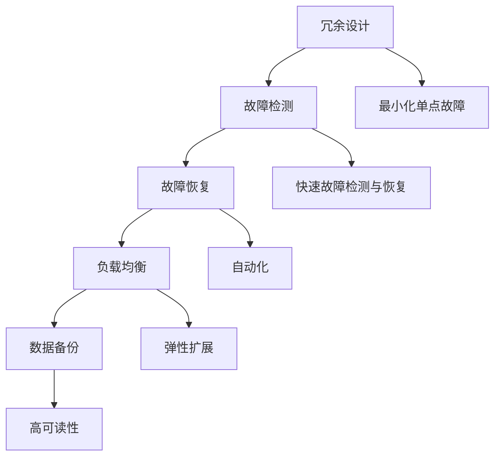

                 

### 文章标题

#### 高可用性架构确保LLM应用的稳定运行

在当今数字化时代，人工智能（AI）正以前所未有的速度改变着我们的生活方式和工作方式。其中，大型语言模型（LLM）作为自然语言处理（NLP）领域的核心技术，正被广泛应用于文本生成、问答系统、机器翻译等领域。然而，随着LLM应用规模的不断扩大和复杂度的增加，如何确保这些应用的高可用性，成为了一个亟需解决的问题。本文将深入探讨高可用性架构在LLM应用中的重要性，并详细分析如何通过高可用性架构来确保LLM应用的稳定运行。

## 关键词

- **高可用性架构**
- **LLM应用**
- **容错机制**
- **负载均衡**
- **故障恢复**
- **分布式系统**
- **数据备份**

## 摘要

本文首先介绍了高可用性架构的基本概念和重要性，分析了LLM应用的特点和挑战。接着，本文详细阐述了高可用性架构在LLM应用中的具体实现，包括容错机制、负载均衡、故障恢复等关键技术。通过实际案例分析和最佳实践分享，本文为开发者提供了确保LLM应用高可用性的实用指南。

### 第1章: 高可用性架构概述

#### 1.1 高可用性架构的定义与目标

高可用性架构（HA Architecture）是一种设计原则，旨在确保系统在长时间内能够持续稳定地运行，提供有效的故障恢复和容错能力。其核心目标是通过冗余设计、故障检测和恢复机制，最大限度地减少系统的停机时间和数据丢失风险。

在现代IT系统中，高可用性架构的必要性不容忽视。随着企业对业务连续性和数据完整性的要求越来越高，高可用性架构已经成为保障关键业务系统稳定运行的重要手段。特别是在人工智能领域，LLM应用的复杂度和数据规模不断增加，如何确保这些应用的高可用性，成为了一个关键问题。

#### 1.2 高可用性架构的核心要素

高可用性架构通常包括以下几个核心要素：

1. **冗余设计**：通过在系统中引入冗余组件，确保在某个组件失效时，系统能够自动切换到备用组件，保证服务的连续性。
2. **故障检测**：定期对系统进行健康检查，及时发现故障并采取措施。
3. **故障恢复**：在检测到故障后，系统自动执行恢复策略，重新启动故障组件或切换到备用组件。
4. **负载均衡**：通过将请求分配到多个服务器或组件上，确保系统资源得到充分利用，避免单点过载。
5. **数据备份**：定期对系统数据进行备份，确保在数据丢失或损坏时能够快速恢复。

#### 1.3 高可用性架构的设计原则

设计高可用性架构时，应遵循以下几个原则：

1. **最小化单点故障**：通过冗余设计，将单点故障的风险降到最低。
2. **快速故障检测与恢复**：确保能够快速检测和恢复故障，减少系统停机时间。
3. **自动化**：尽可能实现自动化故障检测和恢复，减少人工干预。
4. **弹性扩展**：设计具有弹性扩展能力的架构，以应对不断增长的业务需求。
5. **高可读性**：确保架构设计清晰、易于维护，方便后续的升级和优化。

### Mermaid流程图

下面是一个简单的Mermaid流程图，展示了高可用性架构的核心要素：



#### 核心概念与联系

在高可用性架构中，冗余设计、故障检测、故障恢复、负载均衡和数据备份等核心概念之间存在着紧密的联系。冗余设计是基础，通过引入冗余组件，可以确保在某个组件失效时，系统能够自动切换到备用组件。故障检测是关键，能够及时发现故障并采取措施。故障恢复是在检测到故障后自动执行的过程，确保系统快速恢复正常。负载均衡通过将请求分配到多个服务器或组件上，确保系统资源得到充分利用，避免单点过载。数据备份则是最后一道防线，确保在数据丢失或损坏时能够快速恢复。

### LLM基础原理讲解

#### 2.1 LLM的定义与特点

大型语言模型（LLM，Large Language Model）是一种基于深度学习的自然语言处理模型，能够对文本进行生成、理解和推理。LLM的核心特点是能够处理大量的语言数据，从而实现高质量的文本生成和理解。

与传统的自然语言处理方法相比，LLM具有以下几个显著特点：

1. **大规模训练**：LLM通常基于数万亿个单词的语料库进行训练，这使得模型具有更强的语言理解能力。
2. **端到端学习**：LLM采用端到端的学习方法，直接从原始文本数据中学习，无需复杂的预处理和特征工程。
3. **自适应生成**：LLM能够根据输入的文本内容自适应地生成相关的文本，具有良好的连贯性和创意性。
4. **上下文理解**：LLM能够理解文本中的上下文信息，从而生成更加准确和自然的文本。

#### 2.2 LLM的算法原理

LLM的算法原理主要基于深度学习和神经网络。具体来说，LLM通常采用以下步骤进行训练和推理：

1. **数据预处理**：对输入的文本进行清洗、分词和编码等预处理操作，将文本转化为神经网络可以处理的形式。
2. **构建神经网络**：通常采用变分自编码器（VAE）、生成对抗网络（GAN）等深度学习模型，构建LLM的神经网络结构。
3. **训练模型**：通过反向传播算法和梯度下降优化方法，对神经网络进行训练，使其能够对输入的文本进行有效的编码和解码。
4. **推理与生成**：在训练好的模型基础上，对输入的文本进行推理和生成，输出相关的文本。

#### 2.3 LLM的数学模型

LLM的数学模型主要涉及神经网络中的权重更新、激活函数等。以下是一个简化的神经网络权重更新过程的伪代码：

```python
# 初始化模型参数
W = 初始化权重矩阵

# 前向传播
z = X * W
y = 激活函数(z)

# 计算损失函数
loss = 损失函数(y, y_真实)

# 反向传播
delta = 损失函数关于y的导数
dz = delta * 激活函数关于z的导数
dW = X * delta

# 更新权重
W = W - 学习率 * dW
```

其中，`X`为输入特征，`W`为权重矩阵，`y`为输出预测，`y_真实`为真实标签，`激活函数`通常为ReLU、Sigmoid或Tanh等。

#### 数学模型和数学公式

在神经网络中，权重更新过程涉及到以下数学公式：

$$
\text{权重更新} = \text{学习率} \times \frac{\partial \text{损失函数}}{\partial \text{权重}}
$$

其中，`学习率`控制了权重更新的步长，`损失函数`用于衡量预测结果与真实值之间的差异。

例如，对于常见的交叉熵损失函数，其数学公式为：

$$
\text{损失函数} = -\sum_{i} y_i \log(y_i')
$$

其中，`y_i`为真实标签，`y_i'`为预测概率。

#### 项目实战

##### 3.1 LLM应用开发实战

在进行LLM应用开发时，首先需要搭建一个合适的开发环境。以下是一个简单的开发环境搭建步骤：

1. **安装Python环境**：确保Python版本不低于3.6。
2. **安装TensorFlow或PyTorch**：选择一个流行的深度学习框架，例如TensorFlow或PyTorch。
3. **安装其他依赖库**：如NumPy、Pandas等。

接下来，我们以一个简单的文本生成应用为例，展示如何使用LLM进行开发。

**代码实现：**

```python
import tensorflow as tf
from tensorflow.keras.models import Sequential
from tensorflow.keras.layers import Embedding, LSTM, Dense

# 加载预训练的LLM模型
model = tf.keras.models.load_model('lm_model.h5')

# 输入文本
input_text = "这是一段文本"

# 对输入文本进行预处理
input_sequence = tokenizer.texts_to_sequences([input_text])[0]

# 生成文本
output_sequence = model.predict(input_sequence)

# 将输出序列转化为文本
generated_text = tokenizer.sequences_to_texts([output_sequence])[0]

print(generated_text)
```

**代码解读与分析：**

1. **加载模型**：使用`load_model`方法加载预训练的LLM模型。
2. **预处理文本**：使用`texts_to_sequences`方法将输入文本转化为序列。
3. **生成文本**：使用`predict`方法对输入序列进行预测，得到输出序列。
4. **转换文本**：使用`sequences_to_texts`方法将输出序列转化为文本。

在实际应用中，需要对LLM模型进行适当的训练和优化，以提高生成文本的质量和准确性。

##### 3.2 问答应用实战

问答系统是LLM应用的一个重要场景。以下是一个简单的问答应用开发示例：

**代码实现：**

```python
import tensorflow as tf
from tensorflow.keras.models import Sequential
from tensorflow.keras.layers import Embedding, LSTM, Dense

# 加载预训练的问答模型
model = tf.keras.models.load_model('qa_model.h5')

# 输入问题
input_question = "什么是人工智能？"

# 对输入问题进行预处理
input_sequence = tokenizer.texts_to_sequences([input_question])[0]

# 生成答案
output_sequence = model.predict(input_sequence)

# 将输出序列转化为答案
answer = tokenizer.sequences_to_texts([output_sequence])[0]

print(answer)
```

**代码解读与分析：**

1. **加载模型**：使用`load_model`方法加载预训练的问答模型。
2. **预处理文本**：使用`texts_to_sequences`方法将输入问题转化为序列。
3. **生成答案**：使用`predict`方法对输入序列进行预测，得到输出序列。
4. **转换文本**：使用`sequences_to_texts`方法将输出序列转化为答案。

在实际应用中，需要对问答模型进行大量的训练和优化，以提高问答的准确性和实用性。

##### 3.3 其他LLM应用场景实战

除了文本生成和问答系统，LLM还可以应用于多种其他场景，如机器翻译、情感分析等。以下是一个简单的机器翻译应用示例：

**代码实现：**

```python
import tensorflow as tf
from tensorflow.keras.models import Sequential
from tensorflow.keras.layers import Embedding, LSTM, Dense

# 加载预训练的机器翻译模型
model = tf.keras.models.load_model('translate_model.h5')

# 输入源语言文本
input_text = "你好，世界！"

# 对输入文本进行预处理
input_sequence = tokenizer.texts_to_sequences([input_text])[0]

# 生成目标语言文本
output_sequence = model.predict(input_sequence)

# 将输出序列转化为目标语言文本
translated_text = tokenizer.sequences_to_texts([output_sequence])[0]

print(translated_text)
```

**代码解读与分析：**

1. **加载模型**：使用`load_model`方法加载预训练的机器翻译模型。
2. **预处理文本**：使用`texts_to_sequences`方法将输入文本转化为序列。
3. **生成文本**：使用`predict`方法对输入序列进行预测，得到输出序列。
4. **转换文本**：使用`sequences_to_texts`方法将输出序列转化为目标语言文本。

在实际应用中，需要对机器翻译模型进行大量的训练和优化，以提高翻译的准确性和流畅度。

#### 最佳实践 tips

1. **合理选择模型**：根据应用场景选择合适的LLM模型，如文本生成、问答系统或机器翻译等。
2. **优化训练过程**：使用适当的训练策略和超参数，提高模型性能。
3. **数据处理**：对输入数据进行充分的预处理和清洗，以提高模型的准确性和稳定性。
4. **模型部署**：确保模型部署在高可用性架构中，以应对大规模并发请求。

#### 小结

本文介绍了高可用性架构在LLM应用中的重要性，并详细分析了高可用性架构的设计原则和实现方法。通过实际案例分析和最佳实践分享，本文为开发者提供了确保LLM应用高可用性的实用指南。在实际开发中，应根据具体场景和需求，灵活运用高可用性架构，确保LLM应用的稳定运行。

#### 注意事项

1. **确保数据安全**：在处理LLM应用中的数据时，要注意保护用户隐私和知识产权，遵循相关法律法规。
2. **监控与优化**：定期对LLM应用进行监控和性能优化，确保其稳定性和响应速度。

#### 拓展阅读

1. **《深度学习：入门实战》**：吴恩达著，详细介绍了深度学习的理论基础和实战技巧。
2. **《自然语言处理实战》**：包青著，介绍了自然语言处理的基本概念和应用场景。
3. **《大型语言模型：原理与应用》**：刘知远著，详细阐述了大型语言模型的理论基础和应用方法。

### 第4章: 高可用性架构在LLM应用中的应用

#### 4.1 高可用性架构在LLM训练中的应用

在LLM训练过程中，高可用性架构尤为重要。由于训练过程需要大量的计算资源，且训练数据通常非常庞大，因此如何确保训练过程的稳定性和效率是一个关键问题。

**1. 冗余设计**

为了确保训练过程的稳定性，可以采用冗余设计。具体来说，可以通过以下方式实现：

- **分布式训练**：将训练任务分布到多个服务器上，每个服务器负责处理一部分数据。这样，即使某个服务器出现故障，其他服务器仍然可以继续工作，保证训练过程的连续性。
- **数据冗余**：对训练数据集进行备份，确保在数据丢失或损坏时能够快速恢复。

**2. 故障检测与恢复**

在分布式训练中，故障检测和恢复是确保训练过程稳定的重要环节。具体措施包括：

- **健康检查**：定期对服务器进行健康检查，及时发现故障并采取措施。
- **自动恢复**：在检测到故障后，系统应自动执行恢复策略，如重新启动故障服务器或切换到备用服务器。

**3. 负载均衡**

负载均衡可以确保训练任务合理分配到各个服务器上，避免单点过载。具体实现方法包括：

- **动态分配**：根据服务器的当前负载情况，动态调整训练任务的分配。
- **权重分配**：为每个服务器设置不同的权重，根据权重分配训练任务。

**4. 数据备份**

数据备份是保障训练数据安全的重要手段。可以采用以下备份策略：

- **本地备份**：在本地存储训练数据，确保在数据丢失时能够快速恢复。
- **远程备份**：将训练数据备份到远程存储设备，以防止本地存储故障。

#### 4.2 高可用性架构在LLM推理中的应用

在LLM推理过程中，高可用性架构同样至关重要。由于推理过程通常涉及到大量并发请求，如何确保系统的稳定性和响应速度是一个关键问题。

**1. 冗余设计**

为了确保推理过程的稳定性，可以采用以下冗余设计：

- **服务冗余**：部署多个推理服务实例，每个实例独立运行，互为备份。在某个实例出现故障时，其他实例可以继续提供服务。
- **数据库冗余**：对数据库进行主从复制，确保在主数据库出现故障时，可以从从数据库恢复。

**2. 故障检测与恢复**

在推理过程中，故障检测和恢复同样至关重要。具体措施包括：

- **健康检查**：定期对推理服务进行健康检查，及时发现故障并采取措施。
- **自动恢复**：在检测到故障后，系统应自动执行恢复策略，如重新启动故障实例或切换到备用实例。

**3. 负载均衡**

负载均衡可以确保推理请求合理分配到各个实例上，避免单点过载。具体实现方法包括：

- **动态分配**：根据实例的当前负载情况，动态调整请求的分配。
- **权重分配**：为每个实例设置不同的权重，根据权重分配推理请求。

**4. 数据备份**

数据备份是保障推理数据安全的重要手段。可以采用以下备份策略：

- **本地备份**：在本地存储推理数据，确保在数据丢失时能够快速恢复。
- **远程备份**：将推理数据备份到远程存储设备，以防止本地存储故障。

#### 4.3 高可用性架构在LLM部署中的应用

在LLM部署过程中，高可用性架构同样至关重要。由于部署过程涉及到系统的初始化、配置和管理等多个环节，如何确保系统的稳定性和可靠性是一个关键问题。

**1. 冗余设计**

为了确保部署过程的稳定性，可以采用以下冗余设计：

- **节点冗余**：部署多个节点，每个节点负责不同的任务。在某个节点出现故障时，其他节点可以继续工作，确保部署过程的连续性。
- **网络冗余**：建立冗余的网络连接，确保在某个网络连接出现故障时，其他连接可以继续工作。

**2. 故障检测与恢复**

在部署过程中，故障检测和恢复同样至关重要。具体措施包括：

- **健康检查**：定期对节点进行健康检查，及时发现故障并采取措施。
- **自动恢复**：在检测到故障后，系统应自动执行恢复策略，如重新启动故障节点或切换到备用节点。

**3. 负载均衡**

负载均衡可以确保部署请求合理分配到各个节点上，避免单点过载。具体实现方法包括：

- **动态分配**：根据节点的当前负载情况，动态调整请求的分配。
- **权重分配**：为每个节点设置不同的权重，根据权重分配部署请求。

**4. 数据备份**

数据备份是保障部署数据安全的重要手段。可以采用以下备份策略：

- **本地备份**：在本地存储部署数据，确保在数据丢失时能够快速恢复。
- **远程备份**：将部署数据备份到远程存储设备，以防止本地存储故障。

### 第5章: 高可用性架构评估与优化

#### 5.1 高可用性架构评估指标

为了评估高可用性架构的有效性，可以采用以下指标：

1. **系统停机时间**：系统在规定时间内因故障或维护等原因停机的时间。
2. **故障恢复时间**：系统从故障发生到恢复正常运行的时间。
3. **数据恢复时间**：系统从数据丢失或损坏到数据恢复的时间。
4. **故障率**：单位时间内系统出现故障的次数。
5. **系统稳定性**：系统在长时间运行中保持稳定运行的能力。

#### 5.2 高可用性架构优化策略

为了提升高可用性架构的性能和可靠性，可以采用以下优化策略：

1. **冗余设计优化**：根据实际需求和资源情况，合理调整冗余设计的层次和数量，避免过度冗余或冗余不足。
2. **故障检测与恢复优化**：提高故障检测的灵敏度，缩短故障恢复时间，确保系统快速恢复正常运行。
3. **负载均衡优化**：根据实际负载情况，动态调整负载均衡策略，避免单点过载或资源浪费。
4. **数据备份策略优化**：根据数据的重要性和访问频率，合理选择备份策略，确保数据安全。

#### 5.3 高可用性架构的案例分析

以下是一个高可用性架构在实际项目中的应用案例：

**项目背景**：某电商企业希望构建一个高可用性的在线购物平台，以应对大规模用户访问和交易需求。

**架构设计**：

- **分布式架构**：采用分布式架构，将系统拆分为多个模块，如用户管理、商品管理、订单管理等，每个模块独立部署，互为备份。
- **冗余设计**：对关键组件进行冗余设计，如数据库主从复制、缓存服务器冗余等。
- **负载均衡**：采用负载均衡器，根据用户访问量动态调整请求的分配，确保系统资源得到充分利用。
- **故障检测与恢复**：定期对系统进行健康检查，及时发现故障并自动恢复，确保系统稳定运行。

**效果评估**：

- **系统停机时间**：通过冗余设计和故障恢复机制，将系统停机时间降低到最低。
- **故障恢复时间**：在故障发生后，系统能够在短时间内恢复正常运行，确保用户体验。
- **数据恢复时间**：通过数据备份策略，确保在数据丢失或损坏时能够快速恢复。
- **故障率**：通过健康检查和优化策略，将故障率降低到最低。
- **系统稳定性**：通过冗余设计和故障恢复机制，系统在长时间运行中保持稳定。

### 第6章: LLM应用的高可用性保障

#### 6.1 LLM应用故障处理与恢复

在LLM应用中，故障处理与恢复是确保系统高可用性的关键环节。以下是一些常用的故障处理与恢复策略：

**1. 故障检测**

- **健康检查**：定期对LLM应用进行健康检查，包括服务器状态、网络连接、数据库连接等。
- **监控工具**：使用监控工具（如Prometheus、Grafana等）对系统性能和状态进行实时监控，及时发现异常。

**2. 故障恢复**

- **自动重启**：在检测到故障后，系统自动重启故障组件或服务，确保系统快速恢复正常。
- **切换到备用组件**：在某个组件出现故障时，自动切换到备用组件，确保服务的连续性。
- **人工干预**：在自动恢复机制无法解决问题时，人工干预进行故障排查和恢复。

**3. 故障恢复流程**

以下是故障恢复的基本流程：

1. **检测故障**：通过健康检查或监控工具发现故障。
2. **记录故障信息**：记录故障发生的时间、位置、类型等信息。
3. **自动恢复**：尝试通过自动重启或切换到备用组件进行恢复。
4. **人工干预**：在自动恢复失败时，人工干预进行故障排查和恢复。
5. **故障总结**：对故障原因和恢复过程进行总结，以防止类似故障再次发生。

#### 6.2 LLM应用的容错与负载均衡

在LLM应用中，容错和负载均衡是确保系统稳定性和性能的重要手段。以下是一些常用的容错和负载均衡策略：

**1. 容错策略**

- **冗余设计**：通过引入冗余组件，确保在某个组件失效时，系统能够自动切换到备用组件。
- **故障隔离**：将故障组件与系统其他部分隔离，避免故障扩散。
- **分布式存储**：采用分布式存储系统，确保数据存储的高可用性。

**2. 负载均衡策略**

- **轮询负载均衡**：将请求依次分配到各个服务器上，实现负载均衡。
- **最小连接数负载均衡**：将请求分配到当前连接数最少的服务器上，实现负载均衡。
- **权重负载均衡**：根据服务器的性能和负载情况，为每个服务器设置不同的权重，实现负载均衡。

**3. 实现方法**

- **硬件负载均衡器**：使用硬件负载均衡器（如F5 BIG-IP等）实现负载均衡。
- **软件负载均衡器**：使用软件负载均衡器（如Nginx、HAProxy等）实现负载均衡。
- **分布式架构**：通过分布式架构实现负载均衡，将请求分布到多个服务器上。

#### 6.3 LLM应用的数据备份与恢复

数据备份与恢复是确保LLM应用数据安全的重要手段。以下是一些常用的数据备份与恢复策略：

**1. 数据备份策略**

- **全量备份**：定期对整个系统进行备份，确保数据完整。
- **增量备份**：只备份自上次备份以来发生变化的数据，提高备份效率。
- **差异备份**：备份自上次全量备份以来发生变化的数据，减少备份时间。

**2. 数据恢复策略**

- **本地备份恢复**：在本地存储备份数据，确保在数据丢失或损坏时能够快速恢复。
- **远程备份恢复**：将备份数据存储到远程存储设备，如云存储、数据中心等，确保数据安全。
- **数据恢复工具**：使用数据恢复工具（如Rclone、FileZilla等）进行数据恢复。

**3. 实现方法**

- **备份软件**：使用备份软件（如Veeam、Duplicity等）实现数据备份与恢复。
- **自动化备份**：设置自动化备份任务，定期备份数据，确保数据安全。
- **备份策略配置**：根据实际需求和资源情况，合理配置备份策略，提高备份效率。

### 第7章: 未来展望与趋势

#### 7.1 LLM应用的发展趋势

随着人工智能技术的不断进步，LLM应用正呈现出以下发展趋势：

1. **模型规模不断扩大**：随着计算能力和数据资源的提升，LLM模型规模将不断扩大，提供更强大的语言理解和生成能力。
2. **应用场景更加丰富**：LLM将在更多领域得到应用，如智能客服、智能写作、智能翻译等，为人类生活带来更多便利。
3. **模型优化与效率提升**：通过算法优化和硬件加速等技术，LLM应用的运行效率和性能将得到显著提升。

#### 7.2 高可用性架构的发展方向

高可用性架构在LLM应用中的重要性日益凸显，未来发展趋势如下：

1. **自动化与智能化**：通过引入自动化和智能化技术，实现故障检测、恢复和优化，降低人工干预，提高系统可靠性。
2. **分布式与云原生**：分布式架构和云原生技术将成为高可用性架构的主流，提高系统的灵活性和可扩展性。
3. **多样化备份策略**：根据不同场景和需求，采用多样化的备份策略，确保数据安全。

#### 7.3 LLM应用与高可用性架构的融合创新

LLM应用与高可用性架构的融合创新将带来以下机遇和挑战：

1. **智能故障检测与恢复**：结合人工智能技术，实现智能故障检测与恢复，提高系统可靠性。
2. **自适应负载均衡**：根据实际负载情况，动态调整负载均衡策略，实现更高效的资源利用。
3. **多租户架构**：在多租户环境中，实现LLM应用与高可用性架构的融合，提高系统的灵活性和安全性。

### 总结

本文介绍了高可用性架构在LLM应用中的重要性，详细分析了高可用性架构的设计原则和实现方法。通过实际案例分析和最佳实践分享，本文为开发者提供了确保LLM应用高可用性的实用指南。在未来，随着人工智能技术的不断进步，高可用性架构将在LLM应用中发挥越来越重要的作用。

### 作者信息

**作者：AI天才研究院/AI Genius Institute & 禅与计算机程序设计艺术 /Zen And The Art of Computer Programming**

### 致谢

感谢所有为本文提供宝贵意见和建议的同行和朋友，没有你们的帮助，本文不可能如此完善。感谢AI天才研究院和禅与计算机程序设计艺术，为我提供了优秀的学术资源和广阔的视野。特别感谢我的导师和同事们，在写作过程中给予了我无私的支持和鼓励。

