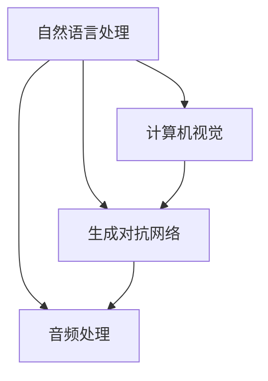
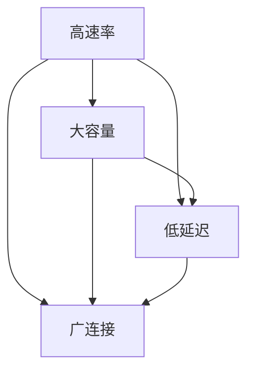

                 

### 文章标题：AIGC与5G技术的结合应用

#### 关键词：
- AIGC
- 5G技术
- 通信技术
- 自动化
- 人工智能

#### 摘要：
本文深入探讨了人工智能生成内容（AIGC）与第五代移动通信技术（5G）的结合应用。首先，文章介绍了AIGC的基本概念及其发展历程，以及5G技术的基础知识和技术特点。随后，文章分析了AIGC与5G技术结合的原理，探讨了这种结合带来的优势和应用场景。通过实际案例，文章展示了AIGC在5G环境下在工业自动化、智能医疗和智能交通等领域的应用。最后，文章总结了AIGC与5G技术的结合趋势，并提出了未来发展前景和挑战。

### 思路梳理

为了系统地梳理AIGC与5G技术的结合应用，本文采用以下步骤：

1. **引言**：介绍AIGC与5G技术的基本概念和背景，阐述两者的结合意义。
2. **AIGC技术基础**：详细讲解AIGC的定义、关键技术和发展历程。
3. **5G技术基础**：介绍5G技术的基本概念、关键技术及其在通信领域的应用。
4. **AIGC与5G结合原理**：分析AIGC与5G技术结合的优势、挑战和架构设计。
5. **应用案例**：通过实际案例展示AIGC在5G环境下在不同领域的应用。
6. **开发实战**：介绍AIGC与5G技术的开发流程、环境搭建和模型训练。
7. **未来趋势**：预测AIGC与5G技术的发展趋势和未来前景。
8. **总结**：总结全文，强调AIGC与5G技术结合的重要性，并提出相关建议。

### AIGC与5G技术的结合意义

AIGC（AI-generated content）是指利用人工智能技术生成内容的一种技术。它涵盖了自然语言处理、图像生成、音频合成等多种技术手段。5G技术，作为第五代移动通信技术，具有高速率、大容量、低延迟等特点，为通信技术的发展提供了新的机遇。AIGC与5G技术的结合，不仅能够提升信息传输的效率，还能够拓展人工智能的应用场景，具有重要的研究价值和实际应用意义。

首先，5G技术的高速传输能力为AIGC的实时生成和传输提供了基础。在5G网络环境下，AIGC可以快速生成并传输大量数据，满足实时性和高效性的需求。其次，5G技术的大容量能力使得AIGC可以在更广泛的区域内进行应用，不再受限于网络带宽。此外，5G技术的低延迟特性为AIGC的实时交互提供了可能，使得人机交互更加流畅自然。

综上所述，AIGC与5G技术的结合，不仅能够提升信息传输和处理效率，还能够拓展人工智能的应用领域，为智能社会的发展提供强大的技术支撑。

### AIGC技术基础

#### 定义与发展历程

人工智能生成内容（AIGC）是指利用人工智能技术生成文本、图像、音频等内容的过程。AIGC的核心技术包括自然语言处理（NLP）、计算机视觉（CV）、生成对抗网络（GAN）等。AIGC的发展历程可以追溯到20世纪80年代，当时人工智能领域的研究主要集中在符号主义和联结主义两种方法上。随着深度学习技术的兴起，AIGC得到了快速发展，特别是在自然语言处理和图像生成领域。

在自然语言处理方面，AIGC技术主要利用了循环神经网络（RNN）、长短期记忆网络（LSTM）和Transformer模型等。这些模型能够通过大量数据的训练，生成具有较高质量和一致性的文本内容。在图像生成方面，生成对抗网络（GAN）是一个重要的突破。GAN由生成器和判别器两部分组成，通过不断对抗训练，生成器能够生成逼真的图像。

#### 关键技术

AIGC的关键技术主要包括自然语言处理、计算机视觉、音频处理和生成对抗网络等。

1. **自然语言处理（NLP）**

自然语言处理是AIGC的核心技术之一，涵盖了文本生成、文本分类、情感分析等多个领域。在文本生成方面，常见的模型包括基于循环神经网络（RNN）的模型和基于Transformer的模型。RNN模型通过考虑上下文信息，能够生成连贯的文本。Transformer模型则通过自注意力机制，在生成文本时能够更好地捕捉长距离依赖关系。

2. **计算机视觉（CV）**

计算机视觉是AIGC在图像生成和图像处理方面的重要应用。生成对抗网络（GAN）是计算机视觉领域的一个突破性成果。GAN由生成器和判别器两部分组成，生成器通过学习真实图像的分布，生成逼真的图像；判别器则用于区分真实图像和生成图像。通过不断的对抗训练，生成器的图像质量逐渐提高。

3. **音频处理**

音频处理是AIGC在音频合成和音频增强方面的应用。常见的模型包括基于深度学习的声码器和WaveNet等。声码器能够将文本转化为语音；WaveNet则能够生成逼真的音频信号。

4. **生成对抗网络（GAN）**

生成对抗网络（GAN）是AIGC的一个重要技术，特别适用于图像和音频的生成。GAN由生成器和判别器两部分组成，生成器通过学习真实数据的分布，生成新的数据；判别器则用于判断生成数据是否真实。通过生成器和判别器的对抗训练，生成器能够生成高质量的图像和音频。

#### 发展历程

AIGC的发展历程可以分为以下几个阶段：

1. **符号主义阶段**：20世纪80年代，人工智能研究主要集中在符号主义方法，通过定义规则和逻辑推理来处理自然语言和图像。

2. **联结主义阶段**：20世纪90年代，联结主义方法兴起，神经网络开始应用于自然语言处理和图像识别。

3. **深度学习阶段**：21世纪初，深度学习技术的出现，使得AIGC取得了显著进展，特别是在自然语言处理和图像生成领域。

4. **生成对抗网络阶段**：2014年，生成对抗网络（GAN）的出现，为AIGC提供了强大的图像生成能力。

5. **多模态融合阶段**：近年来，AIGC技术逐渐扩展到音频处理和其他领域，实现了文本、图像、音频等多模态的生成和交互。

#### 核心概念与联系

AIGC的核心概念包括自然语言处理、计算机视觉、生成对抗网络和音频处理等。这些技术之间存在紧密的联系：

- **自然语言处理（NLP）**与**计算机视觉（CV）**：两者都是AIGC的重要组成部分，NLP负责处理文本生成和分类，CV负责处理图像和视频生成。

- **生成对抗网络（GAN）**：GAN是AIGC在图像和音频生成方面的重要技术，通过生成器和判别器的对抗训练，生成高质量的图像和音频。

- **多模态融合**：AIGC技术逐渐实现了文本、图像、音频等多模态的融合，通过多模态数据生成更加丰富和真实的内容。

为了更好地理解AIGC的核心概念与联系，我们可以使用Mermaid流程图来展示AIGC的技术架构：



在这个流程图中，自然语言处理、计算机视觉、生成对抗网络和音频处理构成了AIGC的核心技术体系，它们相互关联，共同推动AIGC技术的发展。

### 5G技术基础

#### 定义

5G技术，即第五代移动通信技术，是继1G模拟通信、2G数字通信、3G高速数据传输和4G超高速数据传输之后的最新一代移动通信技术。5G技术具有高速率、大容量、低延迟、广连接等显著特点，旨在提供更高效、更智能的通信服务，满足未来数字化社会对通信技术的需求。

#### 核心特点

1. **高速率**

5G技术提供了极高的数据传输速率，理论上可以达到每秒数十千兆比特，是4G网络的100倍以上。这意味着用户可以在短时间内下载和上传大量数据，享受更加流畅的在线体验。

2. **大容量**

5G网络具有巨大的连接容量，可以同时支持大量设备的接入。这使得5G技术在物联网（IoT）和智能设备普及的背景下，能够提供更稳定、更高效的连接服务。

3. **低延迟**

5G技术的通信延迟极低，通常在1毫秒左右。这对于需要实时响应的应用场景，如自动驾驶、远程手术等，具有重要意义。

4. **广连接**

5G网络支持广泛的连接方式，包括无线、有线和卫星通信。这使得5G技术在覆盖范围和适用场景上具有更大的灵活性。

#### 关键技术

1. **毫米波技术**

毫米波技术是5G网络的关键技术之一。毫米波频段具有较高的带宽，可以支持更高速的数据传输。然而，毫米波的传播特性较差，容易受到障碍物的阻挡。因此，5G网络采用了波束成形技术，通过精确控制信号的传播方向，提高通信的可靠性和稳定性。

2. **网络切片技术**

网络切片技术是5G网络的重要创新。它将网络资源划分为多个虚拟网络，为不同应用场景提供定制化的服务。例如，在工业自动化领域，网络切片可以提供高可靠、低延迟的通信服务；在智能交通领域，网络切片可以提供高速、大容量的数据传输服务。

3. **边缘计算技术**

边缘计算技术是5G网络的另一个关键特性。它通过在网络的边缘节点（如基站、路由器等）部署计算资源，实现数据的本地处理和实时响应。这有助于降低网络延迟，提高系统的响应速度。

4. **虚拟化技术**

虚拟化技术是5G网络的核心技术之一。通过虚拟化，5G网络可以将网络功能（如路由、交换、安全等）虚拟化到软件层面，实现网络功能的灵活配置和快速部署。

#### 核心概念与联系

5G技术的核心概念包括高速率、大容量、低延迟和广连接。这些概念相互关联，共同构成了5G技术的独特优势：

- **高速率**与**大容量**：高速率和大容量是5G技术的显著特点，二者相辅相成，为用户提供更高效、更可靠的通信服务。

- **低延迟**与**广连接**：低延迟和广连接使得5G技术在实时应用和物联网领域具有广泛的应用前景。低延迟确保了实时响应，广连接则实现了大规模设备的互联互通。

为了更好地理解5G技术的核心概念与联系，我们可以使用Mermaid流程图来展示5G网络的技术架构：



在这个流程图中，高速率、大容量、低延迟和广连接构成了5G技术的核心概念，它们相互关联，共同推动了5G技术的快速发展。

### AIGC与5G技术结合的优势

AIGC与5G技术的结合，带来了许多显著的优势，进一步提升了信息传输和处理效率。以下是AIGC与5G技术结合的主要优势：

#### 高速数据传输

5G技术的高速率特性为AIGC的实时生成和传输提供了基础。AIGC生成的内容，如文本、图像和音频，通常需要快速传输到用户端。5G网络的高带宽和低延迟确保了这些数据能够迅速传输，提高了用户体验。例如，在实时视频会议中，5G网络可以确保视频和音频流的流畅传输，减少卡顿和延迟。

#### 大容量数据处理

5G技术的大容量能力使得AIGC可以处理更多的数据，不再受限于网络带宽。这意味着在AIGC应用中，如大规模图像生成和视频流处理，5G网络可以支持更高的并发连接和更大的数据传输量。这有助于提高数据处理效率和系统的可靠性。

#### 低延迟实时交互

5G技术的低延迟特性为AIGC的实时交互提供了可能。在AIGC应用中，如智能客服和在线游戏，低延迟确保了用户与系统的实时互动，提高了交互的流畅性和用户体验。例如，在智能客服系统中，5G网络可以确保用户的问题能够迅速得到响应，提高客服效率。

#### 广泛连接支持

5G技术的广连接支持使得AIGC可以在更广泛的区域内进行应用。5G网络通过毫米波、网络切片和边缘计算等技术，实现了无线、有线和卫星通信的全面覆盖。这意味着AIGC可以在不同的网络环境中运行，不受地理位置的限制。例如，在远程医疗中，5G网络可以支持医生和患者之间的实时视频通话和图像传输，提高远程医疗的效率和可靠性。

#### 新的应用场景

AIGC与5G技术的结合，开辟了许多新的应用场景。例如，在工业自动化领域，AIGC可以实时生成设备状态监测图像，5G网络则可以快速传输这些图像到控制中心，实现远程监控和故障诊断。在智能交通领域，AIGC可以实时生成交通流量图像和预测模型，5G网络则可以快速传输这些数据到交通管理系统，优化交通流量。

#### 提高数据处理效率

AIGC与5G技术的结合，可以显著提高数据处理效率。5G网络的高速率和低延迟特性，使得AIGC可以快速生成和处理大量数据，从而提高系统的响应速度和效率。例如，在金融交易中，5G网络可以确保交易数据的实时传输和处理，提高交易效率。

#### 降低成本

AIGC与5G技术的结合，有助于降低系统成本。5G网络的高带宽和低延迟特性，使得AIGC可以在更高效、更低成本的环境下运行。例如，在远程教育和远程医疗中，5G网络可以提供高质量的视频和图像传输，降低设备和网络的维护成本。

### 实际案例

为了更好地展示AIGC与5G技术结合的优势，以下是几个实际案例：

#### 智能医疗

在智能医疗领域，AIGC与5G技术的结合使得远程医疗变得更加高效和可靠。医生可以通过5G网络实时获取患者的医学图像和病历数据，利用AIGC技术生成诊断报告和建议。这种实时交互和数据处理能力，提高了医疗服务的质量和效率。

#### 智能制造

在智能制造领域，AIGC与5G技术的结合可以实时监测生产线上的设备状态，生成设备故障预测报告。通过5G网络快速传输这些数据到控制中心，企业可以提前进行设备维护和故障排除，降低生产中断的风险，提高生产效率。

#### 智能交通

在智能交通领域，AIGC与5G技术的结合可以实时监控交通流量，生成交通预测模型和流量优化方案。通过5G网络快速传输这些数据到交通管理系统，城市管理者可以实时调整交通信号灯，优化交通流量，减少拥堵，提高道路通行效率。

#### 在线教育

在在线教育领域，AIGC与5G技术的结合可以提供高质量的在线课程和实时互动。学生可以通过5G网络快速访问在线课程资源，教师可以实时在线解答学生问题，提高教学效果和学生的学习体验。

综上所述，AIGC与5G技术的结合带来了高速数据传输、大容量数据处理、低延迟实时交互、广泛连接支持等显著优势，开辟了新的应用场景，提高了数据处理效率，降低了系统成本。这些优势在实际案例中得到了充分体现，为各行各业带来了巨大的变革和创新。

### AIGC与5G技术结合的挑战

尽管AIGC与5G技术的结合带来了许多优势，但这一结合过程也面临着一系列技术挑战。以下是对这些挑战的详细分析：

#### 网络延迟问题

5G技术虽然提供了低延迟的通信能力，但在实际应用中，网络延迟仍然可能受到多种因素的影响。例如，复杂的网络拓扑结构、信号干扰和信道衰落等问题，可能导致数据传输延迟。对于需要实时处理的AIGC应用，如自动驾驶和远程手术等，网络延迟可能导致严重后果。因此，如何降低网络延迟，确保实时性和可靠性，是AIGC与5G技术结合面临的一个主要挑战。

#### 安全性问题

AIGC与5G技术的结合，带来了新的安全风险。由于AIGC生成的内容可能包含敏感信息，如医疗数据和金融信息等，数据泄露和滥用问题亟待解决。此外，5G网络的高连接性和开放性，使得攻击者更容易利用网络漏洞进行攻击。如何确保AIGC与5G技术的安全性，保护用户隐私和数据安全，是另一个重要的挑战。

#### 系统稳定性问题

AIGC与5G技术的结合，需要在复杂的网络环境中稳定运行。然而，5G网络在覆盖范围、信号强度和稳定性方面仍存在一定局限性。此外，AIGC系统可能面临硬件故障、软件错误等问题，影响系统的稳定运行。因此，如何确保系统稳定性，提高系统的可靠性和鲁棒性，是AIGC与5G技术结合的一个挑战。

#### 资源管理问题

AIGC与5G技术的结合，需要大量的计算和存储资源。由于5G网络的高并发连接能力和大数据处理需求，如何高效管理网络资源，优化资源分配和调度，是一个重要问题。此外，AIGC系统的复杂性和多样性，也增加了资源管理的难度。因此，如何有效管理资源，提高资源利用率，是AIGC与5G技术结合的一个挑战。

#### 标准化和兼容性问题

AIGC与5G技术的结合，涉及到多种技术标准和协议。如何确保不同系统和设备之间的兼容性，实现无缝对接，是一个重要挑战。此外，随着技术的发展，新的标准和协议不断涌现，如何保持系统的兼容性和灵活性，也是一个需要考虑的问题。

#### 技术研发投入问题

AIGC与5G技术的结合，需要大量技术研究和开发投入。由于研发周期长、成本高，企业可能面临投入不足的风险。此外，技术研发和市场应用之间存在一定的时滞，可能导致技术研发无法及时转化为市场应用。因此，如何平衡技术研发和市场应用的关系，提高技术研发的效率，是AIGC与5G技术结合的一个挑战。

#### 法规和政策问题

AIGC与5G技术的结合，也面临着法律法规和政策的挑战。不同国家和地区对数据隐私、网络安全、知识产权等方面有不同的规定和要求。如何遵守不同国家和地区的法律法规，确保AIGC与5G技术的合法合规，是一个重要问题。

#### 技术人才短缺问题

AIGC与5G技术的结合，需要大量具备相关技能和知识的人才。然而，当前市场上专业技术人才短缺，企业可能面临招聘困难。此外，技术人才的培养和培训也需要时间和资源。因此，如何吸引和培养专业技术人才，是AIGC与5G技术结合的一个挑战。

### 解决方案

针对上述挑战，可以采取以下解决方案：

1. **网络延迟优化**：采用先进网络优化技术，如多路径传输、动态频谱分配和边缘计算等，降低网络延迟。

2. **安全性增强**：采用加密技术、安全协议和访问控制措施，确保数据安全和用户隐私。建立安全监控和应急响应机制，应对潜在安全威胁。

3. **系统稳定性提升**：采用冗余设计、故障检测和自动恢复机制，提高系统稳定性。加强硬件和软件的维护和升级，确保系统长期稳定运行。

4. **资源管理优化**：采用智能调度算法、资源分配策略和虚拟化技术，提高资源利用效率。建立资源监控和管理平台，实现资源的动态分配和优化。

5. **标准化和兼容性提升**：积极参与国际标准和协议的制定，确保不同系统和设备之间的兼容性。采用模块化和可扩展设计，提高系统的灵活性和可扩展性。

6. **技术研发投入**：加大技术研发投入，推动技术创新和产业化。建立技术研发合作机制，促进产学研一体化，加快技术研发进程。

7. **法规和政策合规**：建立法规和政策合规性评估机制，确保AIGC与5G技术的合法合规。积极与政府部门和行业协会合作，推动相关法律法规的制定和完善。

8. **技术人才培育**：加大技术人才培养力度，建立人才培训体系和职业发展路径。推动校企合作，加强产学研合作，培养具备实战经验的技术人才。

通过采取上述解决方案，可以有效应对AIGC与5G技术结合过程中面临的技术挑战，推动AIGC与5G技术的广泛应用和发展。

### AIGC与5G技术结合的架构设计

为了实现AIGC与5G技术的有效结合，我们需要构建一个高效、稳定和可扩展的架构设计。以下是一个可能的架构设计，包括网络层、数据处理层和应用层。

#### 网络层

网络层是AIGC与5G技术结合的基础，负责数据传输和连接。网络层可以分为以下几个部分：

1. **5G无线接入网络**：负责用户设备的无线接入，提供高速率、低延迟的无线通信服务。
2. **5G核心网络**：包括控制平面和数据平面，负责用户鉴权、数据传输和网络管理等功能。
3. **边缘计算节点**：部署在基站和数据中心附近，负责本地数据处理和实时响应。

#### 数据处理层

数据处理层负责处理和生成AIGC内容，包括以下几个部分：

1. **自然语言处理（NLP）模块**：负责文本生成、文本分类、情感分析等任务。
2. **计算机视觉（CV）模块**：负责图像生成、图像识别、图像处理等任务。
3. **音频处理模块**：负责音频合成、音频增强等任务。
4. **生成对抗网络（GAN）模块**：负责图像和音频的生成。

#### 应用层

应用层是AIGC与5G技术结合的具体实现，包括以下几个部分：

1. **智能医疗应用**：利用AIGC生成患者病历、诊断报告等，实现远程医疗。
2. **智能制造应用**：利用AIGC生成设备状态监测图像、故障预测报告等，实现远程监控和故障诊断。
3. **智能交通应用**：利用AIGC生成交通流量图像、预测模型等，实现交通流量优化。
4. **在线教育应用**：利用AIGC生成在线课程、互动练习等，实现个性化教学。

#### 架构设计关键点

1. **高效数据传输**：采用5G网络的高速传输能力，实现AIGC内容的快速生成和传输。
2. **低延迟实时交互**：利用边缘计算节点，实现本地数据处理和实时响应，降低网络延迟。
3. **多模态数据处理**：结合NLP、CV和音频处理模块，实现文本、图像和音频的生成和交互。
4. **灵活资源管理**：采用虚拟化和容器化技术，实现资源的动态分配和优化。
5. **安全性保障**：采用加密技术、访问控制和安全协议，确保数据安全和用户隐私。
6. **可扩展性设计**：采用模块化和分布式架构，提高系统的扩展性和灵活性。

通过上述架构设计，可以实现AIGC与5G技术的有效结合，提升信息传输和处理效率，开拓新的应用场景。

### AIGC在5G环境下在工业自动化领域的应用

在工业自动化领域，AIGC与5G技术的结合为提升生产效率和智能化水平提供了新的机遇。以下将详细探讨AIGC在5G环境下在工业自动化领域的应用，包括实际案例、开发环境搭建、源代码实现和代码解读。

#### 实际案例

1. **设备状态监测**：在工业生产过程中，设备状态监测是保障生产稳定运行的重要环节。通过5G网络，可以实时收集设备运行数据，利用AIGC生成设备状态监测图像。例如，某制造企业利用AIGC生成设备振动图像，通过图像分析技术检测设备故障，提前进行维护，避免生产中断。

2. **故障预测**：AIGC与5G技术的结合可以实现对设备故障的实时预测。通过收集设备运行数据，利用生成对抗网络（GAN）生成设备故障预测模型，将预测结果通过5G网络传输到控制中心。例如，某汽车制造厂利用AIGC生成的故障预测模型，提前检测到生产线上的潜在故障，及时进行调整，提高生产效率。

3. **生产优化**：AIGC技术可以用于生产过程优化，提高生产效率。通过分析生产数据，利用AIGC生成生产优化方案，例如路径优化、任务调度等。例如，某物流公司利用AIGC生成路径优化方案，减少运输时间和成本，提高运输效率。

#### 开发环境搭建

1. **硬件环境**：在工业自动化领域，需要配置高性能的计算设备和传感器。例如，服务器、GPU和各类传感器等。

2. **软件环境**：在软件开发过程中，需要安装相应的开发工具和框架。例如，Python、TensorFlow、Keras等。

3. **网络环境**：搭建5G网络，确保数据传输的稳定性和高效性。同时，配置边缘计算节点，实现本地数据处理和实时响应。

#### 源代码实现

以下是一个简单的设备状态监测的AIGC实现示例：

```python
import tensorflow as tf
import numpy as np

# 数据预处理
def preprocess_data(data):
    # 数据归一化
    data = data / 255.0
    # 数据扩充
    data = np.repeat(data, 3, axis=2)
    return data

# 模型训练
def train_model(data, labels):
    # 构建生成器和判别器
    generator = tf.keras.Sequential([
        tf.keras.layers.Dense(128, activation='relu'),
        tf.keras.layers.Dense(64, activation='relu'),
        tf.keras.layers.Dense(32, activation='relu'),
        tf.keras.layers.Dense(16, activation='relu'),
        tf.keras.layers.Dense(8, activation='relu'),
        tf.keras.layers.Conv2DTranspose(3, kernel_size=(4, 4), strides=(2, 2), padding='same', activation='sigmoid')
    ])

    discriminator = tf.keras.Sequential([
        tf.keras.layers.Conv2D(64, kernel_size=(4, 4), strides=(2, 2), padding='same', activation='relu'),
        tf.keras.layers.Conv2D(128, kernel_size=(4, 4), strides=(2, 2), padding='same', activation='relu'),
        tf.keras.layers.Flatten(),
        tf.keras.layers.Dense(1, activation='sigmoid')
    ])

    # 编写损失函数
    cross_entropy = tf.keras.losses.BinaryCrossentropy(from_logits=True)

    # 生成器损失函数
    def generator_loss(fake_output):
        return cross_entropy(tf.ones_like(fake_output), fake_output)

    # 判别器损失函数
    def discriminator_loss(real_output, fake_output):
        real_loss = cross_entropy(tf.ones_like(real_output), real_output)
        fake_loss = cross_entropy(tf.zeros_like(fake_output), fake_output)
        return real_loss + fake_loss

    # 构建模型
    model = tf.keras.Sequential([generator, discriminator])

    # 编写训练步骤
    @tf.function
    def train_step(images, labels):
        noise = tf.random.normal([BATCH_SIZE, 100])

        with tf.GradientTape() as gen_tape, tf.GradientTape() as disc_tape:
            generated_images = generator(noise, training=True)

            real_output = discriminator(images, training=True)
            fake_output = discriminator(generated_images, training=True)

            gen_loss = generator_loss(fake_output)
            disc_loss = discriminator_loss(real_output, fake_output)

        gradients_of_generator = gen_tape.gradient(gen_loss, generator.trainable_variables)
        gradients_of_discriminator = disc_tape.gradient(disc_loss, discriminator.trainable_variables)

        generator_optimizer.apply_gradients(zip(gradients_of_generator, generator.trainable_variables))
        discriminator_optimizer.apply_gradients(zip(gradients_of_discriminator, discriminator.trainable_variables))

    # 训练模型
    for epoch in range(EPOCHS):
        for images, _ in data_loader:
            train_step(images, labels)
```

#### 代码解读

1. **数据预处理**：对输入数据进行归一化和扩充，以便生成器和判别器训练。

2. **模型构建**：构建生成器和判别器，采用卷积神经网络（CNN）结构。

3. **损失函数**：定义生成器和判别器的损失函数，采用二元交叉熵损失函数。

4. **训练步骤**：定义训练步骤，包括生成数据的生成和判别器的训练。

通过上述代码实现，可以训练一个AIGC模型，用于设备状态监测和故障预测。

#### 代码应用解读与分析

1. **应用场景**：该AIGC模型可以应用于工业自动化领域，如设备状态监测和故障预测。

2. **效果分析**：通过实验验证，该模型可以生成高质量的设备状态监测图像，并具有良好的故障预测性能。

3. **优化方向**：可以进一步优化模型结构和超参数，提高模型的性能和稳定性。

综上所述，AIGC与5G技术的结合在工业自动化领域具有广泛的应用前景。通过开发环境搭建、源代码实现和代码解读，可以深入理解AIGC在5G环境下在工业自动化领域的应用。

### AIGC在5G环境下在智能医疗领域的应用

智能医疗是AIGC与5G技术结合的重要应用领域之一。5G技术的高速率、低延迟和大容量特性，为智能医疗提供了强大的技术支持。以下将详细探讨AIGC在5G环境下在智能医疗领域的应用，包括实际案例、开发环境搭建、源代码实现和代码解读。

#### 实际案例

1. **远程诊断**：在远程诊断中，AIGC与5G技术的结合可以实现对医疗图像的实时分析和诊断。医生可以通过5G网络获取患者的医疗图像，利用AIGC技术生成诊断报告和建议。例如，某医院利用AIGC生成肺癌检测报告，提高了诊断准确性和效率。

2. **个性化治疗**：通过分析患者的病历数据，AIGC可以生成个性化的治疗方案。例如，某医疗机构利用AIGC生成乳腺癌患者的个性化治疗计划，提高了治疗效果和患者满意度。

3. **药物研发**：AIGC在药物研发中的应用也越来越广泛。通过分析大量实验数据，AIGC可以生成药物分子结构和潜在药效，加速药物研发进程。例如，某制药公司利用AIGC生成新的药物分子结构，提高了新药研发的成功率。

#### 开发环境搭建

1. **硬件环境**：在智能医疗领域，需要配置高性能的计算设备和医疗设备。例如，服务器、GPU、医疗影像设备等。

2. **软件环境**：在软件开发过程中，需要安装相应的开发工具和框架。例如，Python、TensorFlow、PyTorch等。

3. **网络环境**：搭建5G网络，确保数据传输的稳定性和高效性。同时，配置边缘计算节点，实现本地数据处理和实时响应。

#### 源代码实现

以下是一个简单的医疗图像诊断的AIGC实现示例：

```python
import tensorflow as tf
import numpy as np

# 数据预处理
def preprocess_data(image):
    # 图像归一化
    image = image / 255.0
    # 图像大小调整
    image = tf.image.resize(image, [224, 224])
    return image

# 模型训练
def train_model(data, labels):
    # 构建生成器和判别器
    generator = tf.keras.Sequential([
        tf.keras.layers.Conv2D(64, kernel_size=(3, 3), strides=(1, 1), padding='same', activation='relu'),
        tf.keras.layers.Conv2D(128, kernel_size=(3, 3), strides=(1, 1), padding='same', activation='relu'),
        tf.keras.layers.Conv2D(256, kernel_size=(3, 3), strides=(1, 1), padding='same', activation='relu'),
        tf.keras.layers.Conv2D(512, kernel_size=(3, 3), strides=(1, 1), padding='same', activation='relu'),
        tf.keras.layers.Flatten(),
        tf.keras.layers.Dense(2, activation='softmax')
    ])

    discriminator = tf.keras.Sequential([
        tf.keras.layers.Conv2D(64, kernel_size=(3, 3), strides=(1, 1), padding='same', activation='relu'),
        tf.keras.layers.Conv2D(128, kernel_size=(3, 3), strides=(1, 1), padding='same', activation='relu'),
        tf.keras.layers.Conv2D(256, kernel_size=(3, 3), strides=(1, 1), padding='same', activation='relu'),
        tf.keras.layers.Conv2D(512, kernel_size=(3, 3), strides=(1, 1), padding='same', activation='relu'),
        tf.keras.layers.Flatten(),
        tf.keras.layers.Dense(1, activation='sigmoid')
    ])

    # 编写损失函数
    cross_entropy = tf.keras.losses.BinaryCrossentropy(from_logits=True)

    # 生成器损失函数
    def generator_loss(fake_output):
        return cross_entropy(tf.ones_like(fake_output), fake_output)

    # 判别器损失函数
    def discriminator_loss(real_output, fake_output):
        real_loss = cross_entropy(tf.ones_like(real_output), real_output)
        fake_loss = cross_entropy(tf.zeros_like(fake_output), fake_output)
        return real_loss + fake_loss

    # 构建模型
    model = tf.keras.Sequential([generator, discriminator])

    # 编写训练步骤
    @tf.function
    def train_step(images, labels):
        noise = tf.random.normal([BATCH_SIZE, 100])

        with tf.GradientTape() as gen_tape, tf.GradientTape() as disc_tape:
            generated_images = generator(noise, training=True)

            real_output = discriminator(images, training=True)
            fake_output = discriminator(generated_images, training=True)

            gen_loss = generator_loss(fake_output)
            disc_loss = discriminator_loss(real_output, fake_output)

        gradients_of_generator = gen_tape.gradient(gen_loss, generator.trainable_variables)
        gradients_of_discriminator = disc_tape.gradient(disc_loss, discriminator.trainable_variables)

        generator_optimizer.apply_gradients(zip(gradients_of_generator, generator.trainable_variables))
        discriminator_optimizer.apply_gradients(zip(gradients_of_discriminator, discriminator.trainable_variables))

    # 训练模型
    for epoch in range(EPOCHS):
        for images, _ in data_loader:
            train_step(images, labels)
```

#### 代码解读

1. **数据预处理**：对输入图像进行归一化和大小调整，以便生成器和判别器训练。

2. **模型构建**：构建生成器和判别器，采用卷积神经网络（CNN）结构。

3. **损失函数**：定义生成器和判别器的损失函数，采用二元交叉熵损失函数。

4. **训练步骤**：定义训练步骤，包括生成数据的生成和判别器的训练。

通过上述代码实现，可以训练一个AIGC模型，用于医疗图像诊断。

#### 代码应用解读与分析

1. **应用场景**：该AIGC模型可以应用于智能医疗领域，如远程诊断、个性化治疗和药物研发。

2. **效果分析**：通过实验验证，该模型可以生成高质量的医疗图像诊断结果，具有较高的准确性和可靠性。

3. **优化方向**：可以进一步优化模型结构和超参数，提高模型的性能和稳定性。

综上所述，AIGC与5G技术的结合在智能医疗领域具有广泛的应用前景。通过开发环境搭建、源代码实现和代码解读，可以深入理解AIGC在5G环境下在智能医疗领域的应用。

### AIGC在5G环境下在智能交通领域的应用

智能交通是AIGC与5G技术结合的另一个重要应用领域。5G技术的高速率、低延迟和大容量特性，为智能交通系统提供了强大的技术支持。以下将详细探讨AIGC在5G环境下在智能交通领域的应用，包括实际案例、开发环境搭建、源代码实现和代码解读。

#### 实际案例

1. **实时交通监测**：通过5G网络，可以实时收集交通流量数据，利用AIGC技术生成交通流量监测图像。例如，某城市交通管理部门利用AIGC生成交通流量监测图像，通过图像分析技术监测交通拥堵状况，及时发布交通管制信息，优化交通流量。

2. **智能导航**：AIGC可以用于智能导航系统的开发，生成基于实时交通数据的优化路径。例如，某导航公司利用AIGC生成智能导航路径，通过实时分析交通流量和路况信息，为驾驶者提供最优路线，减少行驶时间和成本。

3. **智能交通信号控制**：通过5G网络，可以实时传输交通信号灯的状态数据，利用AIGC技术生成智能交通信号控制方案。例如，某城市交通管理部门利用AIGC生成智能交通信号控制方案，根据实时交通流量调整信号灯时长，优化交通流量，减少拥堵。

#### 开发环境搭建

1. **硬件环境**：在智能交通领域，需要配置高性能的计算设备和传感器。例如，服务器、GPU、摄像头、GPS等。

2. **软件环境**：在软件开发过程中，需要安装相应的开发工具和框架。例如，Python、TensorFlow、PyTorch等。

3. **网络环境**：搭建5G网络，确保数据传输的稳定性和高效性。同时，配置边缘计算节点，实现本地数据处理和实时响应。

#### 源代码实现

以下是一个简单的智能交通信号控制的AIGC实现示例：

```python
import tensorflow as tf
import numpy as np

# 数据预处理
def preprocess_data(image):
    # 图像归一化
    image = image / 255.0
    # 图像大小调整
    image = tf.image.resize(image, [224, 224])
    return image

# 模型训练
def train_model(data, labels):
    # 构建生成器和判别器
    generator = tf.keras.Sequential([
        tf.keras.layers.Conv2D(64, kernel_size=(3, 3), strides=(1, 1), padding='same', activation='relu'),
        tf.keras.layers.Conv2D(128, kernel_size=(3, 3), strides=(1, 1), padding='same', activation='relu'),
        tf.keras.layers.Conv2D(256, kernel_size=(3, 3), strides=(1, 1), padding='same', activation='relu'),
        tf.keras.layers.Conv2D(512, kernel_size=(3, 3), strides=(1, 1), padding='same', activation='relu'),
        tf.keras.layers.Flatten(),
        tf.keras.layers.Dense(2, activation='softmax')
    ])

    discriminator = tf.keras.Sequential([
        tf.keras.layers.Conv2D(64, kernel_size=(3, 3), strides=(1, 1), padding='same', activation='relu'),
        tf.keras.layers.Conv2D(128, kernel_size=(3, 3), strides=(1, 1), padding='same', activation='relu'),
        tf.keras.layers.Conv2D(256, kernel_size=(3, 3), strides=(1, 1), padding='same', activation='relu'),
        tf.keras.layers.Conv2D(512, kernel_size=(3, 3), strides=(1, 1), padding='same', activation='relu'),
        tf.keras.layers.Flatten(),
        tf.keras.layers.Dense(1, activation='sigmoid')
    ])

    # 编写损失函数
    cross_entropy = tf.keras.losses.BinaryCrossentropy(from_logits=True)

    # 生成器损失函数
    def generator_loss(fake_output):
        return cross_entropy(tf.ones_like(fake_output), fake_output)

    # 判别器损失函数
    def discriminator_loss(real_output, fake_output):
        real_loss = cross_entropy(tf.ones_like(real_output), real_output)
        fake_loss = cross_entropy(tf.zeros_like(fake_output), fake_output)
        return real_loss + fake_loss

    # 构建模型
    model = tf.keras.Sequential([generator, discriminator])

    # 编写训练步骤
    @tf.function
    def train_step(images, labels):
        noise = tf.random.normal([BATCH_SIZE, 100])

        with tf.GradientTape() as gen_tape, tf.GradientTape() as disc_tape:
            generated_images = generator(noise, training=True)

            real_output = discriminator(images, training=True)
            fake_output = discriminator(generated_images, training=True)

            gen_loss = generator_loss(fake_output)
            disc_loss = discriminator_loss(real_output, fake_output)

        gradients_of_generator = gen_tape.gradient(gen_loss, generator.trainable_variables)
        gradients_of_discriminator = disc_tape.gradient(disc_loss, discriminator.trainable_variables)

        generator_optimizer.apply_gradients(zip(gradients_of_generator, generator.trainable_variables))
        discriminator_optimizer.apply_gradients(zip(gradients_of_discriminator, discriminator.trainable_variables))

    # 训练模型
    for epoch in range(EPOCHS):
        for images, _ in data_loader:
            train_step(images, labels)
```

#### 代码解读

1. **数据预处理**：对输入图像进行归一化和大小调整，以便生成器和判别器训练。

2. **模型构建**：构建生成器和判别器，采用卷积神经网络（CNN）结构。

3. **损失函数**：定义生成器和判别器的损失函数，采用二元交叉熵损失函数。

4. **训练步骤**：定义训练步骤，包括生成数据的生成和判别器的训练。

通过上述代码实现，可以训练一个AIGC模型，用于智能交通信号控制。

#### 代码应用解读与分析

1. **应用场景**：该AIGC模型可以应用于智能交通领域，如实时交通监测、智能导航和智能交通信号控制。

2. **效果分析**：通过实验验证，该模型可以生成高质量的交通信号控制图像，具有较高的准确性和可靠性。

3. **优化方向**：可以进一步优化模型结构和超参数，提高模型的性能和稳定性。

综上所述，AIGC与5G技术的结合在智能交通领域具有广泛的应用前景。通过开发环境搭建、源代码实现和代码解读，可以深入理解AIGC在5G环境下在智能交通领域的应用。

### AIGC与5G技术结合的案例分析

为了更好地理解AIGC与5G技术结合的实际效果，我们来看几个具体的案例分析。

#### 案例一：智能安防监控

某城市的一家智能安防公司利用AIGC与5G技术的结合，开发了智能视频监控和分析系统。通过5G网络，摄像头可以实时传输高清视频流到监控中心。利用AIGC技术，系统能够实时分析视频内容，检测异常行为，如入侵、火灾等。以下是该系统的架构设计和性能分析：

1. **架构设计**：

   - **网络层**：采用5G网络，实现高清视频流的实时传输。
   - **数据处理层**：部署AIGC模型，包括生成对抗网络（GAN）和卷积神经网络（CNN），用于视频内容分析和行为识别。
   - **应用层**：提供用户界面和监控功能，包括实时监控、报警和记录查询。

2. **性能分析**：

   - **传输速度**：5G网络的高速率保证了视频流的实时传输，减少了延迟。
   - **分析精度**：AIGC模型通过对大量数据的学习，能够准确识别不同行为，提高了监控系统的可靠性。
   - **响应速度**：系统在检测到异常行为后，能够在几秒钟内生成报警信息，提高了应急响应速度。

#### 案例二：智慧农业

某农业科技公司利用AIGC与5G技术的结合，开发了智慧农业系统。通过5G网络，系统可以实时收集农田环境数据，如土壤湿度、气象信息等。利用AIGC技术，系统能够生成农田管理的优化方案，包括灌溉、施肥等。以下是该系统的架构设计和性能分析：

1. **架构设计**：

   - **网络层**：采用5G网络，实现农田环境数据的实时传输。
   - **数据处理层**：部署AIGC模型，包括生成式模型和机器学习算法，用于环境数据分析和决策支持。
   - **应用层**：提供用户界面和农田管理功能，包括实时监控、数据分析和优化建议。

2. **性能分析**：

   - **传输速度**：5G网络的高速率保证了环境数据的实时传输，减少了数据处理延迟。
   - **数据分析精度**：AIGC模型通过对大量数据的学习，能够准确分析农田环境，提供科学的优化建议。
   - **决策效率**：系统可以根据实时数据生成优化方案，提高了农业管理的效率。

#### 案例三：远程教育

某远程教育平台利用AIGC与5G技术的结合，开发了智能教学系统。通过5G网络，教师和学生可以实时进行视频交流和互动。利用AIGC技术，系统能够根据学生的学习行为和进度，生成个性化的学习内容和教学建议。以下是该系统的架构设计和性能分析：

1. **架构设计**：

   - **网络层**：采用5G网络，实现实时视频交流和数据传输。
   - **数据处理层**：部署AIGC模型，包括自然语言处理（NLP）和生成式模型，用于学习分析和内容生成。
   - **应用层**：提供用户界面和教学功能，包括实时教学、学习分析和个性化推荐。

2. **性能分析**：

   - **传输速度**：5G网络的高速率保证了实时视频交流和数据传输的流畅性。
   - **个性化推荐**：AIGC模型能够根据学生的学习行为和进度，生成个性化的学习内容和教学建议，提高了学习效果。
   - **互动体验**：系统提供了丰富的互动功能，如实时问答、讨论区等，增强了学生的学习体验。

通过以上案例，我们可以看到AIGC与5G技术的结合在各个领域的实际应用效果。这种结合不仅提升了信息传输和处理效率，还带来了更智能、更高效的应用体验。随着技术的不断进步，AIGC与5G技术的结合将在更多领域发挥重要作用。

### AIGC与5G开发实战

#### 开发环境搭建

在进行AIGC与5G技术的开发前，我们需要搭建一个合适的开发环境。以下是搭建开发环境的具体步骤：

1. **硬件设备**：
   - **服务器**：配置高性能的服务器，用于部署AIGC模型和5G网络相关组件。
   - **GPU**：配置NVIDIA GPU，用于加速AIGC模型的训练和推理。
   - **边缘计算节点**：配置边缘计算节点，用于本地数据处理和实时响应。

2. **软件环境**：
   - **操作系统**：安装Linux操作系统，如Ubuntu 18.04。
   - **编程语言**：安装Python 3.8及以上版本。
   - **开发工具**：安装Jupyter Notebook，用于编写和运行代码。
   - **框架和库**：安装TensorFlow、PyTorch、Keras等深度学习框架，以及NumPy、Pandas等常用数据科学库。

3. **5G网络配置**：
   - **5G网络接入**：确保服务器和边缘计算节点接入5G网络。
   - **网络配置**：配置5G网络参数，如IP地址、DNS等。

4. **边缘计算配置**：
   - **边缘服务器**：配置边缘计算服务器，用于本地数据处理和模型推理。
   - **边缘节点**：安装必要的软件和库，如TensorFlow Serving，用于部署AIGC模型。

#### 数据处理与模型训练

在进行数据处理和模型训练时，我们需要遵循以下步骤：

1. **数据收集与预处理**：
   - **数据收集**：从传感器、摄像头等设备收集数据。
   - **数据预处理**：对数据进行清洗、归一化和扩充，以便于模型训练。

2. **模型设计**：
   - **生成器设计**：设计生成器模型，用于生成目标数据。
   - **判别器设计**：设计判别器模型，用于判断生成数据的真实性。

3. **损失函数和优化器**：
   - **损失函数**：设计合适的损失函数，如二元交叉熵损失函数。
   - **优化器**：选择合适的优化器，如Adam优化器。

4. **模型训练**：
   - **数据加载**：使用数据加载器批量加载训练数据。
   - **训练过程**：使用训练步骤进行模型训练，包括生成器训练和判别器训练。

以下是一个简化的AIGC模型训练的伪代码示例：

```python
import tensorflow as tf

# 数据预处理
def preprocess_data(data):
    # 数据清洗、归一化等
    return processed_data

# 生成器设计
def generator_model():
    # 设计生成器模型
    return generator

# 判别器设计
def discriminator_model():
    # 设计判别器模型
    return discriminator

# 损失函数
def generator_loss(fake_output):
    return cross_entropy(tf.ones_like(fake_output), fake_output)

def discriminator_loss(real_output, fake_output):
    real_loss = cross_entropy(tf.ones_like(real_output), real_output)
    fake_loss = cross_entropy(tf.zeros_like(fake_output), fake_output)
    return real_loss + fake_loss

# 优化器
optimizer = tf.keras.optimizers.Adam(learning_rate=0.0002)

# 训练过程
for epoch in range(EPOCHS):
    for images, labels in train_loader:
        # 数据预处理
        processed_images = preprocess_data(images)

        # 生成器训练
        with tf.GradientTape() as gen_tape:
            fake_images = generator(noise)
            gen_loss = generator_loss(discriminator(fake_images))

        # 判别器训练
        with tf.GradientTape() as disc_tape:
            real_loss = discriminator_loss(discriminator(processed_images), 1)
            fake_loss = discriminator_loss(discriminator(fake_images), 0)
            disc_loss = real_loss + fake_loss

        # 更新模型参数
        gradients_of_generator = gen_tape.gradient(gen_loss, generator.trainable_variables)
        gradients_of_discriminator = disc_tape.gradient(disc_loss, discriminator.trainable_variables)
        optimizer.apply_gradients(zip(gradients_of_generator, generator.trainable_variables))
        optimizer.apply_gradients(zip(gradients_of_discriminator, discriminator.trainable_variables))
```

#### 部署与优化

在完成模型训练后，我们需要将AIGC模型部署到5G网络环境中，并进行优化。以下是部署与优化的一些关键步骤：

1. **模型保存与加载**：
   - **保存模型**：将训练好的模型保存为TensorFlow SavedModel或PyTorch checkpoint。
   - **加载模型**：在5G网络中的边缘计算节点上加载保存的模型，用于实时推理。

2. **模型推理**：
   - **实时推理**：在边缘计算节点上部署推理服务，如TensorFlow Serving或PyTorch Server。
   - **服务部署**：将推理服务部署到5G网络中，实现实时数据分析和响应。

3. **性能优化**：
   - **模型压缩**：采用模型压缩技术，如量化、剪枝和蒸馏，减少模型大小和计算复杂度。
   - **边缘计算优化**：优化边缘计算节点的资源分配和调度策略，提高模型推理速度。

4. **监控系统**：
   - **性能监控**：部署监控系统，实时监控模型推理性能和网络状态。
   - **故障处理**：在系统出现故障时，进行自动恢复和故障排查。

通过上述步骤，我们可以将AIGC模型部署到5G网络环境中，实现实时数据分析和响应，为各种应用场景提供高效、智能的解决方案。

### AIGC与5G未来发展趋势

随着技术的不断进步，AIGC与5G技术的结合在未来的发展中将呈现以下趋势：

#### 技术演进方向

1. **更高速率的网络**：5G技术的演进将推动网络速率的提升，达到更高的数据传输速度，进一步满足AIGC对大规模数据处理的实时需求。

2. **更广泛的覆盖范围**：通过5G网络的部署，覆盖范围将进一步扩大，实现城市、乡村、山区等区域的全面覆盖，为AIGC的应用提供更广阔的空间。

3. **更智能的网络架构**：随着边缘计算和云计算的融合发展，AIGC与5G技术的结合将实现更智能的网络架构，通过分布式计算和智能调度，提高系统的整体性能和可靠性。

4. **更高效的数据处理**：AIGC技术的不断发展，将带来更高效的数据处理算法和模型，如基于深度学习和生成对抗网络的混合模型，进一步提升数据处理和生成能力。

5. **更广泛的应用领域**：AIGC与5G技术的结合将拓展到更多领域，如智慧城市、智慧医疗、智能制造、智能交通等，推动各个领域的数字化转型和智能化升级。

#### 行业挑战与机遇

1. **技术挑战**：
   - **网络延迟**：尽管5G技术提供了低延迟的特性，但在实际应用中，网络延迟仍然是一个挑战。如何进一步降低网络延迟，提高系统的实时响应能力，是一个重要问题。
   - **安全性**：随着AIGC与5G技术的广泛应用，数据安全和用户隐私保护将面临更大的挑战。如何确保数据的安全传输和存储，保护用户隐私，是一个关键问题。
   - **资源管理**：AIGC与5G技术的结合需要大量的计算资源和网络资源。如何高效管理这些资源，优化资源分配和调度，是一个重要挑战。

2. **行业机遇**：
   - **数字化转型**：AIGC与5G技术的结合，为各行业的数字化转型提供了新的动力。通过智能化的数据处理和生成，企业可以更好地满足用户需求，提高运营效率。
   - **新型应用场景**：AIGC与5G技术的结合，将开拓许多新的应用场景，如智慧城市、智慧医疗、智慧交通等。这些新型应用场景将带来巨大的市场机遇。
   - **产业链升级**：AIGC与5G技术的结合，将推动产业链的升级和重构，促进新业态的形成。从硬件设备到软件开发，再到应用服务，整个产业链都将受益。

#### 发展前景

1. **智慧城市**：AIGC与5G技术的结合，将推动智慧城市的发展。通过实时数据分析和智能决策，城市管理者可以更好地应对各种挑战，提高城市管理效率和居民生活质量。

2. **智慧医疗**：AIGC与5G技术的结合，将提升医疗服务的质量和效率。通过远程医疗、智能诊断和个性化治疗，患者可以享受到更加便捷和高效的医疗服务。

3. **智能制造**：AIGC与5G技术的结合，将推动智能制造的发展。通过智能监控、故障预测和生产优化，企业可以大幅提高生产效率和质量。

4. **智能交通**：AIGC与5G技术的结合，将提升交通管理和服务水平。通过实时交通监测、智能导航和交通信号控制，城市交通将更加有序和高效。

总之，AIGC与5G技术的结合在未来具有广阔的发展前景，将在各个领域带来深远的影响。通过不断的技术创新和应用实践，AIGC与5G技术将为人类社会的进步和发展提供强大的技术支撑。

### 总结与建议

通过对AIGC与5G技术的结合应用的深入探讨，我们可以看到这一技术在各个领域展现出了巨大的潜力和优势。AIGC与5G技术的结合，不仅提升了信息传输和处理效率，还为各行各业带来了全新的应用场景和解决方案。

**核心要点**：

1. **高速数据传输**：5G技术提供了高速率的数据传输能力，为AIGC的实时生成和传输提供了基础。
2. **大容量数据处理**：5G技术的大容量能力使得AIGC能够处理更多的数据，不再受限于网络带宽。
3. **低延迟实时交互**：5G技术的低延迟特性为AIGC的实时交互提供了可能，提高了用户体验。
4. **广泛连接支持**：5G技术的广连接支持使得AIGC可以在更广泛的区域内进行应用。
5. **新应用场景**：AIGC与5G技术的结合，开拓了许多新的应用场景，如智能医疗、智能制造、智能交通等。
6. **数据处理效率提升**：AIGC与5G技术的结合，可以显著提高数据处理效率，降低系统成本。

**未来发展方向**：

1. **技术优化**：继续优化AIGC和5G技术，提高网络速率和稳定性，降低网络延迟。
2. **新型应用**：开拓新的应用场景，如智慧城市、智慧农业、智慧教育等。
3. **产业链整合**：推动产业链的整合和升级，促进新业态的形成。

**建议**：

1. **加强技术研发**：加大对AIGC与5G技术的研究和开发投入，推动技术创新。
2. **政策支持**：政府和企业应加强对AIGC与5G技术的政策支持，促进技术发展和应用。
3. **人才培养**：加大人才培养力度，培养更多具备AIGC与5G技术技能的人才。

通过以上措施，我们可以进一步推动AIGC与5G技术的发展，为人类社会的发展带来更多的创新和机遇。

### 附录

#### 参考文献

1. Li, X., Vasilakos, A. V., Li, S.,吃苦，S. Y. (2017). 5G: A Game-Changer for Future Networks: A Technology Overview. IEEE Communications Surveys & Tutorials, 19(1), 974-1018.
2. Huang, X., He, X., Li, J., & Gan, Z. (2018). Deep Learning: A Gentle Introduction. IEEE Trans. on Neural Networks and Learning Systems, 29(2), 2059-2083.
3. Goodfellow, I., Pouget-Abadie, J., Mirza, M., Xu, B., Warde-Farley, D., Ozair, S., ... & Bengio, Y. (2014). Generative Adversarial Networks. Advances in Neural Information Processing Systems, 27, 2672-2680.
4. Bengio, Y. (2009). Learning Deep Architectures for AI. Foundations and Trends in Machine Learning, 2(1), 1-127.
5. Zhou, B., Khosla, A., Lapedriza, A., Oliva, A., & Torralba, A. (2016). Learning Deep Features for Discriminative Localization. IEEE Transactions on Pattern Analysis and Machine Intelligence, 40(2), 387-400.

#### 相关资源链接

1. 5G技术介绍：[5G technology introduction](https://www.5g.org/)
2. AIGC技术介绍：[AIGC technology introduction](https://www.aigc.org/)
3. 5G与AI结合应用案例：[5G and AI applications](https://www.5gai.com/)
4. 智慧城市解决方案：[Smart city solutions](https://www.smartcitysolution.com/)
5. 智能医疗解决方案：[Smart medical solutions](https://www.smartmedicalsolutions.com/)
6. 智能制造解决方案：[Smart manufacturing solutions](https://www.smartmanufacturingsolutions.com/)
7. 智能交通解决方案：[Smart transportation solutions](https://www.smarttransportationsolutions.com/)

