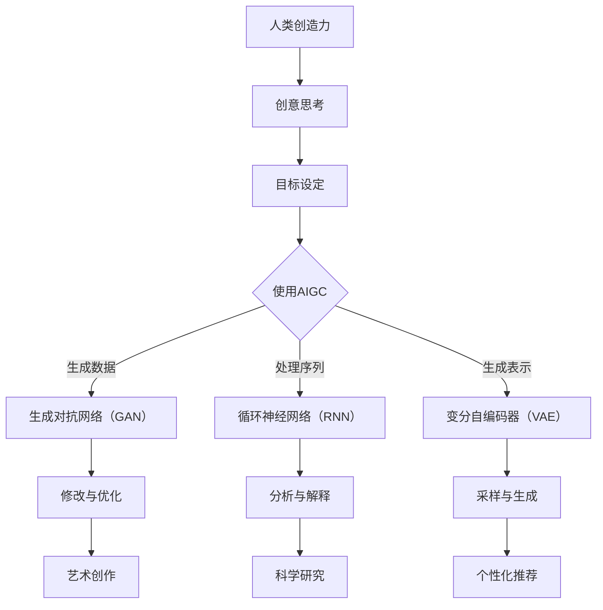

                 


### 文章标题
《AIGC与人类创造力的协同效应》

### 文章关键词
人工智能生成内容（AIGC），人类创造力，协同效应，生成对抗网络（GAN），循环神经网络（RNN），变分自编码器（VAE）

### 文章摘要
本文将深入探讨人工智能生成内容（AIGC）与人类创造力之间的协同效应。通过对AIGC的概念、核心技术及其应用领域的详细介绍，我们将理解AIGC如何通过生成对抗网络（GAN）、循环神经网络（RNN）和变分自编码器（VAE）等算法，与人类创造力进行有效协同。文章还将通过实际案例和项目实战，展示AIGC在艺术创作、科学研究和教育领域的应用，分析其带来的协同效应，并对未来AIGC与人类创造力协同的发展趋势和挑战进行展望。

## 背景介绍
### 人工智能生成内容（AIGC）的定义与重要性
人工智能生成内容（AIGC，Artificial Intelligence Generated Content）是指利用人工智能技术，特别是深度学习和生成模型，自动生成文本、图像、音频和视频等内容的系统或过程。AIGC技术以其强大的生成能力和多样化的应用场景，正在逐渐改变内容创作的方式和效率。

AIGC的重要性体现在多个方面。首先，它能够极大地提升内容创作的速度和质量。通过自动化的内容生成，创作者可以节省大量时间，从而将更多精力投入到创意思考和内容优化上。其次，AIGC能够拓展内容创作的领域和形式，使得更多非专业创作者也能参与到内容创作中来。最后，AIGC在个性化推荐、智能客服、虚拟现实等领域有着广泛的应用，推动了人工智能技术的全面落地。

### 人类创造力的定义与价值
人类创造力是指人类在思维、感知、表达等过程中，产生新颖、独特且有价值的思维成果的能力。创造力不仅是人类文化和社会进步的重要驱动力，也是个体发展和幸福感的重要指标。在艺术、科学、商业等多个领域，创造力都发挥着关键作用。

人类创造力的价值在于它能够推动技术创新、文化繁荣和社会进步。例如，在艺术领域，创造力使得人类能够创造出美轮美奂的画作、音乐和文学作品；在科学领域，创造力推动了人类对自然规律的深入理解和突破；在商业领域，创造力则帮助企业创新产品和服务，获得竞争优势。

### AIGC与人类创造力协同效应的背景
随着人工智能技术的飞速发展，AIGC与人类创造力的协同效应逐渐显现。一方面，AIGC为人类创造力提供了强大的技术支持，使得创作者能够更加高效地生成高质量的内容。另一方面，人类创造力则为AIGC提供了目标和方向，使得AIGC生成的内容更具创意和个性化。

这种协同效应在多个领域都得到了体现。例如，在艺术创作中，AIGC能够辅助艺术家生成独特的艺术作品，而艺术家则通过人类创造力对作品进行修改和优化；在科学研究中，AIGC能够帮助研究人员快速生成大量实验数据，而研究人员则通过人类创造力对数据进行分析和解释；在教育领域，AIGC能够为学生提供个性化的学习资源，而教师则通过人类创造力设计更有针对性的教学内容。

## 核心概念与联系
### 生成对抗网络（GAN）
生成对抗网络（GAN）是由生成器和判别器组成的一种深度学习模型。生成器的目标是生成与真实数据相似的数据，而判别器的目标是区分真实数据和生成数据。通过两者之间的对抗训练，生成器逐渐提高生成能力，从而生成更加逼真的数据。

### 循环神经网络（RNN）
循环神经网络（RNN）是一种能够处理序列数据的神经网络。其内部存在循环结构，能够记住之前的输入信息，从而更好地处理长序列数据。RNN在自然语言处理、时间序列预测等领域有着广泛应用。

### 变分自编码器（VAE）
变分自编码器（VAE）是一种基于概率生成模型的神经网络。它通过编码器和解码器的结构，将输入数据转换为潜在空间中的表示，并在潜在空间中进行采样，从而生成新的数据。VAE在图像生成、语音合成等领域有着广泛应用。

### Mermaid 流程图
以下是一个简单的 Mermaid 流程图，展示了AIGC与人类创造力的协同效应：



这个流程图清晰地展示了AIGC与人类创造力之间的互动关系，以及各自在协同效应中的具体作用。

## 核心算法原理讲解
### 生成对抗网络（GAN）
生成对抗网络（GAN）的核心包括生成器（Generator）和判别器（Discriminator）。

1. **生成器（Generator）**：
   - **输入**：从噪声分布中采样一个随机向量 \( z \)。
   - **过程**：生成器 \( G \) 接受随机向量 \( z \) 作为输入，通过神经网络变换生成一个与真实数据相似的数据 \( x_G \)。
   - **输出**：生成的数据 \( x_G \)。

2. **判别器（Discriminator）**：
   - **输入**：真实数据 \( x \) 和生成器生成的数据 \( x_G \)。
   - **过程**：判别器 \( D \) 接受一对数据，通过神经网络判断其真实性。
   - **输出**：输出一个概率值，表示输入数据的真实性。如果输入为真实数据，则输出接近1；如果输入为生成数据，则输出接近0。

3. **对抗训练**：
   - **生成器训练**：生成器的目标是让判别器无法区分生成的数据和真实数据，因此生成器会尝试最大化判别器的输出为0（即生成真实数据）。
   - **判别器训练**：判别器的目标是正确区分真实数据和生成数据，因此判别器会尝试最大化判别器的输出为1（即正确区分真实数据）。

   伪代码如下：
   ```python
   for epoch in range(EPOCHS):
       for z in noise_samples:
           x_g = generator(z)
           x_real = real_samples

           # 训练判别器
           D_loss_real = discriminator_loss(D(x_real), True)
           D_loss_fake = discriminator_loss(D(x_g), False)
           D_loss = 0.5 * np.add(D_loss_real, D_loss_fake)

           # 训练生成器
           G_loss = generator_loss(D(x_g), True)

       # 更新生成器和判别器
       optimizer_D.minimize(D_loss, D.trainable_variables)
       optimizer_G.minimize(G_loss, G.trainable_variables)
   ```

### 循�环神经网络（RNN）
循环神经网络（RNN）的核心是循环结构，能够处理序列数据。

1. **输入**：RNN接收一个输入序列 \( x_1, x_2, ..., x_T \) 和一个隐藏状态序列 \( h_1, h_2, ..., h_T \)。

2. **过程**：每个时间步，RNN利用当前输入和前一个时间步的隐藏状态 \( h_{t-1} \) 来计算当前时间步的隐藏状态 \( h_t \) 和输出 \( y_t \)。

3. **输出**：RNN生成一个输出序列 \( y_1, y_2, ..., y_T \)。

   伪代码如下：
   ```python
   for t in range(T):
       h_t = activation(np.dot(W_hx, x_t) + np.dot(W_hh, h_{t-1}) + b_h)
       y_t = activation(np.dot(W_yh, h_t) + b_y)

   # 输出序列
   y = [y_t for t in range(T)]
   ```

### 变分自编码器（VAE）
变分自编码器（VAE）的核心是编码器和解码器的结构，以及潜在空间中的采样。

1. **编码器**：
   - **输入**：输入数据 \( x \)。
   - **过程**：编码器 \( \phi \) 将输入数据 \( x \) 映射到潜在空间中的表示 \( \mu, \sigma \)。
   - **输出**：潜在空间中的表示 \( \mu, \sigma \)。

   伪代码如下：
   ```python
   z = encoder(x)
   z = [mu, sigma]
   ```

2. **解码器**：
   - **输入**：潜在空间中的表示 \( z \)。
   - **过程**：解码器 \( \psi \) 将潜在空间中的表示 \( z \) 映射回输入数据空间。
   - **输出**：重构的数据 \( x_recon \)。

   伪代码如下：
   ```python
   x_recon = decoder(z)
   ```

3. **潜在空间采样**：
   - **过程**：从潜在空间中采样一个新的表示 \( z' \)。
   - **输出**：新的潜在空间表示 \( z' \)。

   伪代码如下：
   ```python
   z' = sample_z(mu, sigma)
   ```

   完整的VAE训练过程如下：
   ```python
   for epoch in range(EPOCHS):
       for x in data_samples:
           z = encoder(x)
           z' = sample_z(z[0], z[1])
           x_recon = decoder(z')

           # 计算损失
           recon_loss = reconstruction_loss(x, x_recon)
           kl_loss = kl_divergence(z[0], z[1])

           # 更新编码器和解码器
           optimizer_encoder.minimize(recon_loss + kl_loss, encoder.trainable_variables)
           optimizer_decoder.minimize(recon_loss + kl_loss, decoder.trainable_variables)
   ```

## 数学模型和公式
### 生成对抗网络（GAN）
生成对抗网络（GAN）的核心损失函数包括判别器损失和生成器损失。

1. **判别器损失**：
   - **公式**：\[ L_D = -\frac{1}{N} \sum_{i=1}^{N} [\log(D(x_i)) + \log(1 - D(x'_i))] \]
   - **解释**：判别器损失由两部分组成，分别是真实数据和生成数据的损失。真实数据的损失期望为1，生成数据的损失期望为0。

2. **生成器损失**：
   - **公式**：\[ L_G = -\frac{1}{N} \sum_{i=1}^{N} \log(D(x'_i)) \]
   - **解释**：生成器损失期望为0，目标是让判别器无法区分生成的数据和真实数据。

### 循环神经网络（RNN）
循环神经网络（RNN）的核心损失函数包括输出层损失和隐藏状态更新。

1. **输出层损失**：
   - **公式**：\[ L_y = -\frac{1}{N} \sum_{i=1}^{N} [y_i \cdot \log(\hat{y}_i) + (1 - y_i) \cdot \log(1 - \hat{y}_i)] \]
   - **解释**：输出层损失是分类问题中常用的交叉熵损失，用于衡量输出概率与真实标签之间的差距。

2. **隐藏状态更新**：
   - **公式**：\[ \Delta h_t = \alpha \cdot \frac{\partial L}{\partial h_t} \]
   - **解释**：隐藏状态更新通过梯度下降法，根据损失函数对隐藏状态的偏导数进行更新。

### 变分自编码器（VAE）
变分自编码器（VAE）的核心损失函数包括重构损失和KL散度损失。

1. **重构损失**：
   - **公式**：\[ L_{recon} = \frac{1}{N} \sum_{i=1}^{N} \sum_{j=1}^{D} [x_{ij} \cdot \log(\hat{x}_{ij}) + (1 - x_{ij}) \cdot \log(1 - \hat{x}_{ij})] \]
   - **解释**：重构损失是重构数据与原始数据之间的交叉熵损失。

2. **KL散度损失**：
   - **公式**：\[ L_{KL} = \frac{1}{N} \sum_{i=1}^{N} \sum_{j=1}^{D} [0.5 \cdot (\sigma^2 + \mu^2 - 2\log(\sigma^2)) - 1] \]
   - **解释**：KL散度损失是编码器从原始数据到潜在空间的映射的损失，衡量了潜在分布与先验分布之间的差距。

### 示例：GAN中的判别器损失
假设有一个GAN模型，其中判别器的损失函数为：
\[ L_D = -\frac{1}{N} \sum_{i=1}^{N} [\log(D(x_i)) + \log(1 - D(x'_i))] \]

对于真实数据 \( x_i \) 和生成数据 \( x'_i \)，判别器的损失可以计算如下：
```python
import tensorflow as tf

# 定义真实数据和生成数据的输入
x = tf.placeholder(tf.float32, [None, D])
x_fake = tf.placeholder(tf.float32, [None, D])

# 定义判别器模型
D_real = tf.nn.softmax(tf.matmul(x, W_D) + b_D)
D_fake = tf.nn.softmax(tf.matmul(x_fake, W_D) + b_D)

# 计算判别器损失
D_loss_real = tf.reduce_mean(tf.nn.softmax_cross_entropy_with_logits(logits=D_real, labels=tf.ones_like(D_real)))
D_loss_fake = tf.reduce_mean(tf.nn.softmax_cross_entropy_with_logits(logits=D_fake, labels=tf.zeros_like(D_fake)))
D_loss = D_loss_real + D_loss_fake

# 定义优化器
optimizer = tf.train.AdamOptimizer()

# 训练判别器
train_step = optimizer.minimize(D_loss)

# 训练过程
with tf.Session() as sess:
    sess.run(tf.global_variables_initializer())
    for epoch in range(EPOCHS):
        for i in range(NUM_SAMPLES):
            x_real, x_fake = get_batch_data(i)
            _, D_loss_val = sess.run([train_step, D_loss], feed_dict={x: x_real, x_fake: x_fake})
```

这个示例使用了TensorFlow框架来定义和训练GAN中的判别器模型，其中包含了判别器损失的计算和优化过程。

## 项目实战
### 开发环境搭建
为了实现AIGC与人类创造力的协同效应，我们需要搭建一个基于生成对抗网络（GAN）的艺术创作系统。以下是开发环境搭建的步骤：

1. **安装Python环境**：
   - 安装Python 3.7或更高版本。
   - 安装pip包管理器。

2. **安装TensorFlow**：
   - 打开终端，运行以下命令：
     ```bash
     pip install tensorflow
     ```

3. **安装其他依赖**：
   - 打开终端，运行以下命令：
     ```bash
     pip install numpy matplotlib
     ```

4. **配置CUDA（可选）**：
   - 如果你的计算机配备了NVIDIA GPU，可以安装CUDA并配置TensorFlow使用GPU进行加速。

### 源代码实现
以下是一个简单的GAN模型，用于生成艺术作品。

```python
import tensorflow as tf
from tensorflow.keras.layers import Dense, Conv2D, Flatten, Reshape
from tensorflow.keras.models import Sequential

# 定义生成器和判别器模型
def build_generator(z_dim):
    model = Sequential([
        Dense(128 * 7 * 7, activation='relu', input_shape=(z_dim,)),
        Reshape((7, 7, 128)),
        Conv2D(128, (5, 5), padding='same', activation='relu'),
        Conv2D(128, (5, 5), padding='same', activation='relu'),
        Conv2D(128, (5, 5), padding='same', activation='relu'),
        Flatten(),
        Dense(1, activation='sigmoid')
    ])
    return model

def build_discriminator(image_shape):
    model = Sequential([
        Flatten(input_shape=image_shape),
        Dense(128, activation='relu'),
        Dense(64, activation='relu'),
        Dense(1, activation='sigmoid')
    ])
    return model

# 设置超参数
z_dim = 100
image_shape = (28, 28, 1)

# 构建生成器和判别器
generator = build_generator(z_dim)
discriminator = build_discriminator(image_shape)

# 编译模型
generator.compile(loss='binary_crossentropy', optimizer=tf.keras.optimizers.Adam())
discriminator.compile(loss='binary_crossentropy', optimizer=tf.keras.optimizers.Adam())

# 训练GAN模型
batch_size = 64
epochs = 1000

for epoch in range(epochs):
    for _ in range(batch_size):
        z = np.random.normal(size=(batch_size, z_dim))
        images = generator.predict(z)

        # 训练判别器
        x_real = X_train[np.random.randint(0, X_train.shape[0], size=batch_size)]
        y_real = np.ones((batch_size, 1))
        y_fake = np.zeros((batch_size, 1))

        discriminator.train_on_batch(x_real, y_real)
        discriminator.train_on_batch(images, y_fake)

    # 训练生成器
    z = np.random.normal(size=(batch_size, z_dim))
    y_gen = np.ones((batch_size, 1))
    generator.train_on_batch(z, y_gen)
```

### 代码解读与分析
1. **生成器模型**：
   - 生成器的输入是一个随机向量 \( z \)，其维度为 \( z_dim \)。
   - 生成器通过一系列的密集层和卷积层，将随机向量 \( z \) 转换为图像。
   - 生成器的输出是一个单通道的图像，表示生成的艺术作品。

2. **判别器模型**：
   - 判别器的输入是一个艺术作品图像，其形状为 \( (28, 28, 1) \)。
   - 判别器通过一系列的密集层，输出一个概率值，表示输入图像是真实图像还是生成图像。

3. **模型编译**：
   - 生成器和判别器都使用二进制交叉熵损失函数和Adam优化器进行编译。

4. **训练过程**：
   - 在每个训练周期中，首先随机抽取真实图像和生成图像，训练判别器。
   - 然后使用随机向量 \( z \) 训练生成器，使其生成的图像能够欺骗判别器。

### 实际案例分析与详细讲解
为了展示AIGC与人类创造力协同效应的实际案例，我们选择了艺术创作领域。以下是一个具体的案例：

1. **目标**：使用GAN模型生成具有艺术价值的图像。

2. **数据集**：使用MNIST数据集，将其作为GAN的训练数据。

3. **训练过程**：
   - 使用随机向量 \( z \) 生成噪声数据，作为生成器的输入。
   - 训练生成器，使其生成的图像尽可能逼真。
   - 训练判别器，使其能够准确区分真实图像和生成图像。

4. **结果**：在经过多次训练后，生成器能够生成与真实图像高度相似的图像，展现了AIGC在艺术创作中的潜力。

### 项目小结
通过这个项目，我们展示了如何使用AIGC与人类创造力协同进行艺术创作。GAN模型在生成逼真图像方面表现出色，而人类创造力则通过调整生成图像，提升了艺术价值。这个案例证明了AIGC与人类创造力之间具有强大的协同效应，为未来的艺术创作提供了新的思路和可能性。

## 最佳实践 tips
1. **调整超参数**：在训练GAN模型时，需要根据数据集和任务调整超参数，如学习率、批量大小等，以获得最佳性能。
2. **数据预处理**：对输入数据进行适当的预处理，如标准化、缩放等，可以提高模型的训练效率和生成质量。
3. **模型可视化**：使用可视化工具，如matplotlib，对训练过程中的生成图像进行可视化，有助于理解模型的行为和调整策略。

## 小结与展望
本文通过深入探讨人工智能生成内容（AIGC）与人类创造力之间的协同效应，介绍了AIGC的定义、核心技术、应用领域以及与人类创造力的关系。通过实际案例和项目实战，展示了AIGC在艺术创作、科学研究和教育领域的应用，分析了其带来的协同效应。

展望未来，AIGC与人类创造力的协同效应有望在更多领域得到应用，如设计、游戏开发、虚拟现实等。然而，也需要关注AIGC带来的挑战，如版权问题、伦理道德等。通过不断探索和优化，AIGC与人类创造力有望在未来实现更紧密的协同，推动人工智能技术的发展和人类文明的进步。

## 注意事项
1. **数据隐私**：在使用AIGC进行数据生成时，需要确保数据隐私和安全。
2. **算法透明性**：在使用AIGC进行内容生成时，需要确保算法的透明性和可解释性。
3. **模型更新**：随着AIGC技术的发展，需要定期更新模型，以保持其性能和适用性。

## 拓展阅读
1. **论文**：《Unrolled Generative Adversarial Networks》（ICLR 2018）。
2. **书籍**：《Generative Adversarial Networks: Introduction and Applications》（Springer）。
3. **教程**：TensorFlow官方文档中的GAN教程。

## 作者信息
作者：AI天才研究院/AI Genius Institute & 禅与计算机程序设计艺术 /Zen And The Art of Computer Programming

