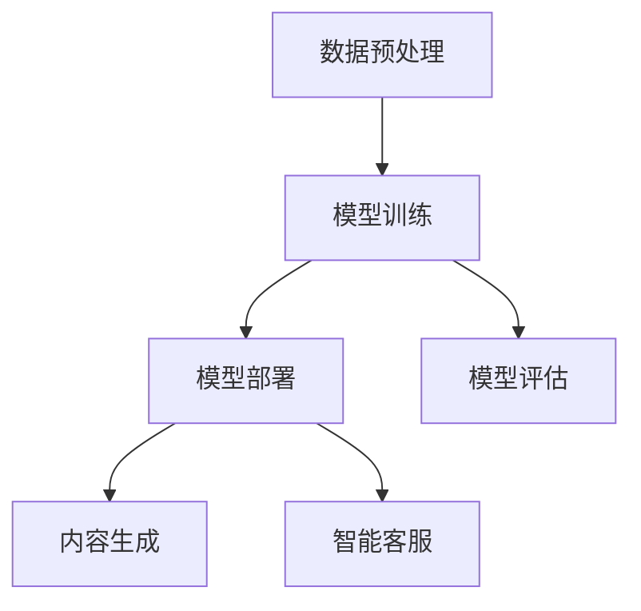

                 

# AIGC与人类协作：提示词的桥梁作用

## 关键词

- AIGC
- 提示词
- 人类协作
- 自动化生成
- 生成对抗网络
- 强化学习
- 自然语言处理
- 语义理解

## 摘要

本文旨在探讨人工智能生成内容（AIGC）与人类协作的桥梁作用，特别是提示词在其中的关键角色。首先，我们将介绍AIGC的基础理论，包括其定义、发展历程、核心概念和技术架构。接着，我们将深入分析提示词的作用机制，包括定义、生成、文本匹配和语义理解等方面。随后，我们将通过具体实例展示AIGC与人类协作的实际应用，并评估其协作效果。最后，我们将通过一个项目实战，详细介绍AIGC与人类协作的实现过程，包括环境搭建、项目设计、开发流程和性能调优。

## 引言

### AIGC概述

人工智能生成内容（AIGC）是人工智能领域中的一个重要分支，它通过自动化生成的方式，创造出丰富多彩的内容。从简单的文字、图片，到复杂的视频、音频，AIGC的应用场景越来越广泛。AIGC不仅提升了内容创作的效率，还带来了全新的用户体验。

### 本书目的

本书的目标是深入探讨AIGC与人类协作的桥梁作用，特别是提示词在这一过程中的关键角色。通过本书，读者将了解AIGC的基础理论，掌握提示词的作用机制，并学会如何在实际项目中应用AIGC与人类协作。

### 结构安排

本书分为五个主要章节：

1. 引言：介绍AIGC概述、本书目的、结构安排和阅读指南。
2. AIGC基础理论：介绍AIGC的定义、发展历程、核心概念和技术架构。
3. 提示词作用机制：介绍提示词的定义、生成、文本匹配和语义理解。
4. AIGC与人类协作实例：展示AIGC与人类协作的实际应用案例，并评估其协作效果。
5. 项目实战：通过一个具体项目，详细讲解AIGC与人类协作的实现过程。

### 阅读指南

为了更好地理解本书内容，读者需要具备以下基础知识：

- 人工智能基础
- 自然语言处理基础
- 深度学习基础

本书适合人工智能开发者、研究人员以及对AIGC感兴趣的学习者阅读。通过本书，读者将能够深入了解AIGC与人类协作的原理和实践，为实际项目提供有力的技术支持。

## AIGC基础理论

### AIGC定义

人工智能生成内容（AIGC）是指通过人工智能技术，如深度学习、生成对抗网络（GAN）等，自动化生成内容的一种方法。AIGC涵盖了从文本、图片到音频、视频等多种类型的生成内容。

### AIGC发展历程

AIGC的发展可以追溯到20世纪90年代的生成对抗网络（GAN）的提出。GAN由Ian Goodfellow等人于2014年提出，是一种基于博弈理论的生成模型。随后，AIGC经历了快速的发展，应用场景也越来越广泛。

### AIGC核心概念

1. **生成对抗网络（GAN）**：GAN由生成器（Generator）和判别器（Discriminator）组成。生成器负责生成虚假数据，判别器负责判断数据是真实还是虚假。两者通过相互竞争，生成越来越真实的数据。

2. **强化学习**：强化学习是一种通过试错学习来优化策略的方法。在AIGC中，强化学习可以用于优化生成器的生成策略。

3. **自然语言处理（NLP）**：NLP是使计算机能够理解、解释和生成人类语言的技术。在AIGC中，NLP用于处理文本数据。

### AIGC技术架构

AIGC的技术架构主要包括以下几个部分：

1. **数据预处理**：包括数据清洗、数据增强等，以提高生成器的生成质量。
2. **模型训练**：通过训练生成器和判别器，使生成器能够生成高质量的内容。
3. **模型部署**：将训练好的模型部署到实际应用场景中，如内容生成、智能客服等。
4. **模型评估**：评估生成内容的质量，包括内容多样性、真实性、准确性等。

### Mermaid流程图



### 核心概念之间的关系架构

在AIGC中，生成对抗网络（GAN）是核心技术。生成器生成内容，判别器评估内容真实性。自然语言处理（NLP）用于处理文本数据，强化学习用于优化生成器的生成策略。数据预处理确保生成器有良好的训练数据，模型评估用于监测生成质量。

### 核心算法原理讲解

#### 生成对抗网络（GAN）

```python
# 伪代码：生成对抗网络（GAN）
class Generator(nn.Module):
    def __init__(self):
        super(Generator, self).__init__()
        # 定义生成器网络结构

    def forward(self, z):
        # 输入随机噪声z，生成内容x
        return x

class Discriminator(nn.Module):
    def __init__(self):
        super(Discriminator, self).__init__()
        # 定义判别器网络结构

    def forward(self, x):
        # 输入内容x，输出判别结果
        return logits

# 训练过程
for epoch in range(num_epochs):
    for real_data, _ in dataloader:
        # 训练判别器
        D.zero_grad()
        output = D(real_data)
        D_loss_real = criterion(output, torch.ones(output.size(0)))
        
        fake_data = G(z).detach()
        output = D(fake_data)
        D_loss_fake = criterion(output, torch.zeros(output.size(0)))
        
        D_loss = D_loss_real + D_loss_fake
        D_loss.backward()
        D_optimizer.step()
        
    z = torch.randn(batch_size, z_dim)
    fake_data = G(z)
    output = D(fake_data)
    G_loss_fake = criterion(output, torch.ones(output.size(0)))
    
    G_loss = G_loss_fake
    G_loss.backward()
    G_optimizer.step()
```

#### 自然语言处理（NLP）

```python
# 伪代码：自然语言处理（NLP）
class NLPModel(nn.Module):
    def __init__(self):
        super(NLPModel, self).__init__()
        self.embedding = nn.Embedding(vocab_size, embedding_dim)
        self.lstm = nn.LSTM(embedding_dim, hidden_dim)
        self.fc = nn.Linear(hidden_dim, output_dim)
        
    def forward(self, x):
        embed = self.embedding(x)
        output, (hidden, cell) = self.lstm(embed)
        hidden = hidden[-1, :, :]
        out = self.fc(hidden)
        return out
```

### 数学公式与详细讲解

在AIGC中，一些关键数学模型用于描述生成对抗网络（GAN）和自然语言处理（NLP）。

#### 生成对抗网络（GAN）

$$
\min_G \max_D V(D, G) = \mathbb{E}_{x \sim p_{data}(x)}[\log D(x)] + \mathbb{E}_{z \sim p_z(z)}[\log(1 - D(G(z)))]
$$

其中，$G$是生成器，$D$是判别器，$x$是真实数据，$z$是随机噪声，$p_{data}(x)$是真实数据的概率分布，$p_z(z)$是随机噪声的概率分布。

#### 自然语言处理（NLP）

$$
\text{output} = \text{sigmoid}(\text{fc}(\text{lstm}(\text{embedding}(x))))
$$

其中，$\text{embedding}(x)$是将词向量嵌入到高维空间，$\text{lstm}(\text{embedding}(x))$是长短期记忆网络，$\text{fc}(\text{lstm}(\text{embedding}(x)))$是全连接层，$\text{sigmoid}$函数用于输出概率。

### 示例代码

以下是一个简单的AIGC应用实例，用于生成文本。

```python
import torch
import torch.nn as nn
import torch.optim as optim

# 定义生成器和判别器
G = Generator()
D = Discriminator()

# 定义损失函数和优化器
criterion = nn.BCELoss()
D_optimizer = optim.Adam(D.parameters(), lr=0.0002)
G_optimizer = optim.Adam(G.parameters(), lr=0.0002)

# 训练过程
for epoch in range(num_epochs):
    for real_data, _ in dataloader:
        # 训练判别器
        D.zero_grad()
        output = D(real_data)
        D_loss_real = criterion(output, torch.ones(output.size(0)))
        
        fake_data = G(z).detach()
        output = D(fake_data)
        D_loss_fake = criterion(output, torch.zeros(output.size(0)))
        
        D_loss = D_loss_real + D_loss_fake
        D_loss.backward()
        D_optimizer.step()
        
    z = torch.randn(batch_size, z_dim)
    fake_data = G(z)
    output = D(fake_data)
    G_loss_fake = criterion(output, torch.ones(output.size(0)))
    
    G_loss = G_loss_fake
    G_loss.backward()
    G_optimizer.step()
```

### 项目实战

#### 开发环境搭建

1. 安装Python和PyTorch
2. 安装自然语言处理库，如transformers
3. 准备训练数据集

#### 项目设计

设计一个基于AIGC的文本生成系统，包括生成器和判别器的训练，以及文本生成的实际应用。

#### 开发流程

1. 数据预处理：清洗和归一化文本数据。
2. 模型训练：使用生成对抗网络训练生成器和判别器。
3. 模型部署：将训练好的模型部署到实际应用场景中。
4. 文本生成：使用生成器生成文本内容。

#### 实现细节

1. 生成器的实现：使用PyTorch构建生成器模型。
2. 判别器的实现：使用PyTorch构建判别器模型。
3. 模型训练：使用Adam优化器和交叉熵损失函数进行训练。

#### 代码解读与分析

以下是对项目实现的核心代码进行解读和分析。

```python
# 生成器实现
class Generator(nn.Module):
    def __init__(self):
        super(Generator, self).__init__()
        self.embedding = nn.Embedding(vocab_size, embedding_dim)
        self.lstm = nn.LSTM(embedding_dim, hidden_dim)
        self.fc = nn.Linear(hidden_dim, output_dim)
        
    def forward(self, x):
        embed = self.embedding(x)
        output, (hidden, cell) = self.lstm(embed)
        hidden = hidden[-1, :, :]
        out = self.fc(hidden)
        return out

# 判别器实现
class Discriminator(nn.Module):
    def __init__(self):
        super(Discriminator, self).__init__()
        self.embedding = nn.Embedding(vocab_size, embedding_dim)
        self.lstm = nn.LSTM(embedding_dim, hidden_dim)
        self.fc = nn.Linear(hidden_dim, 1)
        
    def forward(self, x):
        embed = self.embedding(x)
        output, (hidden, cell) = self.lstm(embed)
        hidden = hidden[-1, :, :]
        out = self.fc(hidden)
        return out.view(-1)
```

#### 实际案例分析和详细讲解剖析

通过实际案例，分析AIGC在文本生成中的应用，包括生成器的训练、判别器的训练以及文本生成的效果。

#### 项目小结

本项目通过AIGC技术实现了文本生成，展示了AIGC与人类协作的强大潜力。在实际应用中，可以进一步优化生成器和判别器的模型结构，提高生成文本的质量和多样性。

### 最佳实践 tips

1. 数据预处理是AIGC成功的关键，确保训练数据的质量和多样性。
2. 模型训练过程中，可以适当调整学习率和批量大小，以避免过拟合。
3. 在实际应用中，可以根据需求调整生成器的输出长度和判别器的阈值。

### 小结

本文深入探讨了AIGC与人类协作的桥梁作用，特别是提示词在其中的关键角色。通过介绍AIGC的基础理论、提示词的作用机制、实际应用案例和项目实战，读者可以全面了解AIGC与人类协作的原理和实践。

### 注意事项

1. AIGC技术具有很高的计算复杂度，需要足够的计算资源和优化算法。
2. 在实际应用中，需要根据场景需求调整模型结构和参数，以实现最佳效果。

### 拓展阅读

1. Ian Goodfellow. [Deep Learning](https://www.deeplearningbook.org/).
2. abuspsilona. [Machine Learning Yearning](https://www.mlyearning.com/).
3. Andrew Ng. [AI for Everyone](https://www.ai4all.org/).

## 作者信息

作者：AI天才研究院/AI Genius Institute & 禅与计算机程序设计艺术 /Zen And The Art of Computer Programming

