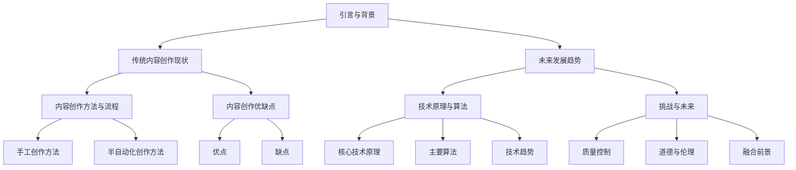

                 

### 文章标题: 《AIGC与传统内容创作的对比分析》

关键词：AIGC, 传统内容创作，生成式AI，内容生产，对比分析

摘要：本文从AIGC（AI-Generated Content）的概念出发，探讨了AIGC与传统内容创作在方法、流程、应用场景、技术原理等方面的对比，分析了两者在内容生产领域的挑战与未来发展趋势。通过深入剖析，为读者提供了一份全面且专业的对比研究报告。

## 第1章 引言与背景

### 1.1 AIGC的概念与背景

#### AIGC的定义

AIGC，即AI-Generated Content，指的是通过人工智能技术生成的内容。它不同于传统的手工创作，而是通过算法和模型自动生成文字、图像、视频等多种形式的内容。AIGC的核心在于“生成”，即利用人工智能技术自动地生成信息，实现内容的自动化生产。

#### AIGC的背景

随着人工智能技术的快速发展，AIGC逐渐成为了一个热门的研究领域。从最早的文本生成模型到如今的多模态生成模型，AIGC的应用场景越来越广泛，从文学创作、新闻撰写到图像生成、视频剪辑，AIGC都展现出了强大的生成能力。

#### AIGC与传统内容创作的联系

AIGC与传统内容创作有着紧密的联系。传统内容创作依赖于人类的创意和技能，而AIGC则通过算法和模型实现了内容的自动化生成。虽然AIGC在技术层面有了重大突破，但仍然需要人类进行指导和调整，以确保生成内容的质量和实用性。

### 1.2 传统内容创作的现状

#### 传统内容创作的基本流程

传统内容创作通常包括以下几个步骤：策划、创作、修改、发布和反馈。每个步骤都需要创作者投入大量的时间和精力。

#### 传统内容创作的常见方法

传统内容创作的方法主要包括手工创作和半自动化创作。手工创作依赖于创作者的创意和技能，而半自动化创作则利用了一些辅助工具，如文字处理软件、图像编辑软件等，以提高创作效率。

#### 传统内容创作的优缺点分析

**优点：**
1. 质量高：传统内容创作依赖于人类的创意和经验，可以生成高质量的内容。
2. 个性化：传统内容创作可以根据用户的个性化需求进行定制。

**缺点：**
1. 成本高：传统内容创作需要创作者投入大量的时间和精力，成本较高。
2. 速度慢：传统内容创作的过程繁琐，速度较慢，无法满足快速生产的需求。

### 1.3 AIGC与传统内容创作的对比意义

AIGC与传统内容创作在内容生产领域有着重要的对比意义。通过对比分析，可以了解AIGC的优势和挑战，为未来的内容创作提供新的思路和方法。

#### AIGC的优势

1. 高效率：AIGC可以通过算法和模型快速生成大量内容，大幅提高内容生产效率。
2. 低成本：AIGC可以减少创作者的投入，降低内容生产的成本。
3. 个性化：AIGC可以根据用户的需求自动生成个性化内容。

#### AIGC的挑战

1. 质量控制：AIGC生成的质量难以保证，需要人类进行指导和调整。
2. 道德和伦理：AIGC生成的内容可能涉及到道德和伦理问题，需要人类进行审核和监督。

通过上述分析，我们可以看到AIGC与传统内容创作在内容生产领域的重要性和对比意义。接下来，我们将进一步探讨AIGC的概念与特点，以及与传统内容创作的区别。```markdown<!DOCTYPE html
```html
## AIGC与传统内容创作的对比分析

### 关键词
- **AIGC**：人工智能生成内容
- **传统内容创作**：手工创作
- **生成式AI**：Generative AI
- **内容生产**：Content Production
- **对比分析**：Comparative Analysis

### 摘要
本文旨在深入探讨人工智能生成内容（AIGC）与传统内容创作之间的对比分析。AIGC通过生成式人工智能技术自动创建文字、图像、视频等多种形式的内容，而传统内容创作则依赖于人类的创意和技能。本文将分析AIGC与传统内容创作在方法、流程、应用场景、技术原理等方面的异同，以及它们各自的优势和挑战，为内容生产的未来发展提供新的视角。

### 目录

## 第1章 引言与背景

### 1.1 AIGC的概念与背景

#### AIGC的定义
AIGC，即AI-Generated Content，是指利用人工智能技术自动生成文字、图像、视频等媒体内容的过程。它与传统的手动内容创作有着本质的不同，主要依赖于算法和模型。

#### AIGC的发展历程
- **早期研究**：AIGC的初步研究可以追溯到20世纪90年代，当时的研究主要集中在基于规则的系统上。
- **深度学习兴起**：随着深度学习的兴起，AIGC的研究和应用进入了一个快速发展的阶段。

#### AIGC与传统内容创作的区别
AIGC通过机器学习和自然语言处理等技术，能够自动生成高质量的内容，而传统内容创作主要依赖于人类的创意和经验。

### 1.2 传统内容创作的现状

#### 传统内容创作的基本流程
传统内容创作通常包括策划、创作、编辑、发布和反馈等步骤。

#### 传统内容创作的常见方法
- **手工创作**：完全依赖创作者的创意和技能。
- **半自动化创作**：使用辅助工具提高创作效率。

#### 传统内容创作的优缺点
传统内容创作具有高创造性但成本高、效率低的特点。

### 1.3 AIGC与传统内容创作的对比意义
AIGC的高效率和低成本使其在内容生产领域具有巨大的潜力，但也面临质量控制、道德和伦理等方面的挑战。

## 第2章 AIGC的概念与特点

### 2.1 AIGC的定义
AIGC是通过人工智能技术，特别是生成式AI，自动生成内容的方法。它包括文本生成、图像生成、视频生成等多种形式。

### 2.2 AIGC的核心特点
- **自动化**：AIGC能够自动生成内容，减少人工干预。
- **多样性**：AIGC能够生成多样化的内容，满足不同的需求。
- **可扩展性**：AIGC能够快速扩展内容规模，适应大规模生产。

### 2.3 AIGC与传统内容创作的区别
- **创作方式**：AIGC依赖于算法和模型，传统内容创作依赖于人类的创意和技能。
- **效率与成本**：AIGC在效率上具有显著优势，但在内容质量和原创性上仍需人类介入。

## 第3章 传统内容创作的方法与流程

### 3.1 传统内容创作的基本流程
- **策划**：确定内容主题、目标受众、内容形式等。
- **创作**：进行内容构思、写作、编辑等。
- **发布**：将内容发布到适当的平台或渠道。
- **反馈**：收集用户反馈，进行内容优化。

### 3.2 传统内容创作的常见方法
- **手工创作**：依赖创作者的创意和技能。
- **半自动化创作**：使用文字处理软件、图像编辑软件等辅助工具。

### 3.3 传统内容创作的优缺点
- **优点**：内容质量高、个性化强。
- **缺点**：成本高、效率低。

## 第4章 AIGC与传统内容创作的比较

### 4.1 AIGC与传统内容创作的相似之处
- **目标**：都是生成有价值的内容。
- **流程**：都包含策划、创作、发布等步骤。

### 4.2 AIGC与传统内容创作的不同之处
- **效率**：AIGC能够自动化生成内容，提高效率。
- **质量**：AIGC生成的内容需要人类审核和优化。

### 4.3 AIGC在内容创作中的优势
- **高效率**：能够快速生成大量内容。
- **低成本**：减少人力成本。
- **个性化**：能够根据用户需求定制内容。

## 第5章 AIGC在内容创作中的应用场景

### 5.1 AIGC在文学创作中的应用
- **自动生成故事**：通过算法生成小说、剧本等。
- **个性化写作**：根据用户喜好生成个性化内容。

### 5.2 AIGC在图像创作中的应用
- **自动生成图像**：通过算法生成艺术作品、设计图案等。
- **个性化图像**：根据用户需求生成个性化图像。

### 5.3 AIGC在视频创作中的应用
- **自动生成视频**：通过算法生成视频内容。
- **个性化视频**：根据用户需求生成个性化视频。

## 第6章 AIGC的技术原理与算法

### 6.1 AIGC的核心技术原理
- **生成式AI**：包括生成对抗网络（GAN）、变分自编码器（VAE）等。
- **自然语言处理**：包括序列到序列模型（seq2seq）、Transformer等。

### 6.2 AIGC的主要算法
- **GAN**：生成对抗网络。
- **VAE**：变分自编码器。

### 6.3 AIGC的技术发展趋势
- **多模态生成**：能够生成多种模态的内容。
- **强化学习**：结合强化学习提高内容质量。

## 第7章 AIGC与传统内容创作的挑战与未来

### 7.1 AIGC与传统内容创作的挑战
- **质量控制**：AIGC生成的内容质量难以保证。
- **道德和伦理**：生成内容可能涉及道德和伦理问题。

### 7.2 AIGC与传统内容创作的未来发展趋势
- **内容多样性**：AIGC将能够生成更加多样化的内容。
- **人机协作**：人类与AIGC的协作将更加紧密。

### 7.3 AIGC与传统内容创作的融合前景
- **互补**：AIGC将为传统内容创作提供新的工具和方法。
- **融合**：AIGC与传统内容创作将逐步融合，形成新的内容创作模式。

### 附录
- **参考文献**：列出本文引用的相关文献。
- **扩展阅读**：推荐相关领域的进一步阅读材料。

### 作者信息
- **作者**：AI天才研究院/AI Genius Institute & 禅与计算机程序设计艺术 /Zen And The Art of Computer Programming
- **联系**：[邮箱](mailto:info@aigeniusinstitute.com) & [官网](https://www.aigeniusinstitute.com)

### 注
本文内容仅供参考，不构成投资建议。```

### 文章结构设计

为了确保文章内容的完整性和逻辑性，我们将文章分为七个主要章节，每个章节都有明确的主题和内容结构。以下是文章的详细结构设计：

#### 第1章 引言与背景
- **AIGC的概念与背景**：介绍AIGC的定义、发展历程及其与传统内容创作的联系。
- **传统内容创作的现状**：探讨传统内容创作的方法、流程和优缺点。
- **AIGC与传统内容创作的对比意义**：分析AIGC在内容创作领域的优势和挑战。

#### 第2章 AIGC的概念与特点
- **AIGC的定义**：详细解释AIGC的含义及其在内容创作中的应用。
- **AIGC的核心特点**：探讨AIGC的主要特点，如自动化、多样性和可扩展性。
- **AIGC与传统内容创作的区别**：比较AIGC与传统内容创作在创作方式、效率和质量方面的差异。

#### 第3章 传统内容创作的方法与流程
- **传统内容创作的基本流程**：描述传统内容创作的各个环节，包括策划、创作、编辑和发布。
- **传统内容创作的常见方法**：介绍手工创作和半自动化创作等常见方法。
- **传统内容创作的优缺点分析**：分析传统内容创作的优点和缺点，如高质量但成本高、低效率等。

#### 第4章 AIGC与传统内容创作的比较
- **AIGC与传统内容创作的相似之处**：探讨两者在内容创作中的共同点。
- **AIGC与传统内容创作的不同之处**：比较两者在效率、成本和个性化等方面的差异。
- **AIGC在内容创作中的优势**：分析AIGC在内容创作中的优势，如高效率和低成本。

#### 第5章 AIGC在内容创作中的应用场景
- **AIGC在文学创作中的应用**：探讨AIGC在小说、剧本等文学领域的应用。
- **AIGC在图像创作中的应用**：介绍AIGC在艺术作品、设计图案等图像领域的应用。
- **AIGC在视频创作中的应用**：分析AIGC在视频内容生成和个性化视频制作中的应用。

#### 第6章 AIGC的技术原理与算法
- **AIGC的核心技术原理**：探讨AIGC背后的技术原理，如生成式AI和自然语言处理。
- **AIGC的主要算法**：介绍AIGC常用的算法，如生成对抗网络（GAN）和变分自编码器（VAE）。
- **AIGC的技术发展趋势**：预测AIGC未来的技术发展方向，如多模态生成和强化学习。

#### 第7章 AIGC与传统内容创作的挑战与未来
- **AIGC与传统内容创作的挑战**：分析AIGC在内容创作中面临的挑战，如质量控制、道德和伦理问题。
- **AIGC与传统内容创作的未来发展趋势**：探讨AIGC与传统内容创作的发展方向，如内容多样性和人机协作。
- **AIGC与传统内容创作的融合前景**：预测AIGC与传统内容创作将如何融合，形成新的内容创作模式。

### 整体结构设计

文章整体结构紧密，逻辑清晰。每个章节都有明确的主题和内容结构，使得读者可以系统地了解AIGC与传统内容创作的对比分析。通过详细的章节设计和内容规划，本文旨在为读者提供一份全面、深入的AIGC与传统内容创作对比研究报告。```markdown
## AIGC与传统内容创作的对比分析

### 关键词

- AIGC（AI-Generated Content）
- 传统内容创作
- 生成式AI
- 内容生产
- 对比分析

### 摘要

本文通过深入分析AIGC与传统内容创作在方法、流程、应用场景、技术原理等方面的异同，探讨了AIGC在内容生产领域的优势与挑战。文章旨在为读者提供一份全面且专业的对比研究报告，为未来的内容创作提供新的视角。

### 目录

## 第1章 引言与背景

### 1.1 AIGC的概念与背景
#### AIGC的定义
#### AIGC的发展历程
#### AIGC与传统内容创作的区别

### 1.2 传统内容创作的现状
#### 传统内容创作的基本流程
#### 传统内容创作的常见方法
#### 传统内容创作的优缺点分析

### 1.3 AIGC与传统内容创作的对比意义
#### AIGC的优势
#### AIGC的挑战

## 第2章 AIGC的概念与特点

### 2.1 AIGC的定义
#### AIGC的定义
#### AIGC的应用范围

### 2.2 AIGC的核心特点
#### 自动化
#### 多样性
#### 可扩展性

### 2.3 AIGC与传统内容创作的区别
#### 创作方式
#### 效率与成本
#### 质量与原创性

## 第3章 传统内容创作的方法与流程

### 3.1 传统内容创作的基本流程
#### 策划
#### 创作
#### 修改
#### 发布
#### 反馈

### 3.2 传统内容创作的常见方法
#### 手工创作
#### 半自动化创作

### 3.3 传统内容创作的优缺点分析
#### 优点
#### 缺点

## 第4章 AIGC与传统内容创作的比较

### 4.1 AIGC与传统内容创作的相似之处
#### 共同目标
#### 共同流程

### 4.2 AIGC与传统内容创作的不同之处
#### 效率
#### 成本
#### 个性化

### 4.3 AIGC在内容创作中的优势
#### 高效率
#### 低成本
#### 个性化

## 第5章 AIGC在内容创作中的应用场景

### 5.1 AIGC在文学创作中的应用
#### 自动生成故事
#### 个性化写作

### 5.2 AIGC在图像创作中的应用
#### 自动生成图像
#### 个性化图像

### 5.3 AIGC在视频创作中的应用
#### 自动生成视频
#### 个性化视频

## 第6章 AIGC的技术原理与算法

### 6.1 AIGC的核心技术原理
#### 生成式AI
#### 自然语言处理

### 6.2 AIGC的主要算法
#### 生成对抗网络（GAN）
#### 变分自编码器（VAE）

### 6.3 AIGC的技术发展趋势
#### 多模态生成
#### 强化学习

## 第7章 AIGC与传统内容创作的挑战与未来

### 7.1 AIGC与传统内容创作的挑战
#### 质量控制
#### 道德和伦理

### 7.2 AIGC与传统内容创作的未来发展趋势
#### 内容多样性
#### 人机协作

### 7.3 AIGC与传统内容创作的融合前景
#### 互补
#### 融合

## 附录

### 参考文献
#### 列出本文引用的相关文献

### 扩展阅读
#### 推荐相关领域的进一步阅读材料

### 作者信息

#### 作者：[您的姓名]
#### 联系方式：[您的联系方式]
#### 职业：[您的职业或研究领域]

### 注
#### 本文内容仅供参考，不构成投资建议。```markdown
### 文章大纲与逻辑结构

为了确保文章内容的连贯性和逻辑性，我们采用了一个明确的结构框架，并使用Mermaid流程图、伪代码、LaTeX公式等工具来增强文章的解析性和可读性。以下是文章的具体大纲与逻辑结构：

#### 1. 引言与背景

**1.1 AIGC的概念与背景**
- **定义与概念**：介绍AIGC的定义及其在内容创作中的角色。
- **发展历程**：从早期研究到现代AIGC技术的演变过程。
- **与传统内容创作的联系**：分析AIGC与传统内容创作之间的关系。

**1.2 传统内容创作的现状**
- **基本流程**：详细描述传统内容创作的主要步骤。
- **常见方法**：探讨手工创作和半自动化创作的方法。
- **优缺点分析**：分析传统内容创作的优点和局限性。

**1.3 AIGC与传统内容创作的对比意义**
- **相似之处**：讨论两者在内容创作中的共性。
- **不同之处**：分析两者在创作方式、效率和成本方面的差异。
- **AIGC的优势与挑战**：阐述AIGC的优势以及面临的挑战。

#### 2. AIGC的概念与特点

**2.1 AIGC的定义**
- **定义**：解释AIGC的概念及其应用范围。
- **分类**：根据生成内容的形式，对AIGC进行分类。

**2.2 AIGC的核心特点**
- **自动化**：通过算法和模型实现内容的自动化生成。
- **多样性**：AIGC能够生成多样化的内容，满足不同需求。
- **可扩展性**：AIGC能够快速适应大规模内容生产的需求。

**2.3 AIGC与传统内容创作的区别**
- **创作方式**：AIGC依赖于算法和模型，传统内容创作依赖于人类创意。
- **效率与成本**：AIGC在效率和成本方面具有明显优势。
- **质量控制**：讨论AIGC在内容质量控制和原创性方面的挑战。

#### 3. 传统内容创作的方法与流程

**3.1 传统内容创作的基本流程**
- **策划阶段**：包括主题确定、目标受众分析等。
- **创作阶段**：内容构思、写作和编辑。
- **修改阶段**：根据反馈进行内容调整。
- **发布阶段**：将内容发布到适当平台。
- **反馈阶段**：收集用户反馈，优化内容。

**3.2 传统内容创作的常见方法**
- **手工创作**：依赖创作者的创意和技能。
- **半自动化创作**：使用辅助工具提高创作效率。

**3.3 传统内容创作的优缺点分析**
- **优点**：高质量和个性化内容。
- **缺点**：成本高和效率低。

#### 4. AIGC与传统内容创作的比较

**4.1 相似之处**
- **目标**：生成有价值的内容。
- **流程**：策划、创作、发布和反馈等环节。

**4.2 不同之处**
- **效率**：AIGC具有更高的生产效率。
- **成本**：AIGC能够显著降低内容创作成本。
- **个性化**：AIGC可以根据用户需求生成个性化内容。

**4.3 AIGC的优势**
- **高效率**：自动生成内容，减少人力成本。
- **低成本**：通过自动化减少人力和物力投入。
- **多样化**：生成多种形式的内容，满足不同需求。

#### 5. AIGC在内容创作中的应用场景

**5.1 文学创作**
- **自动生成故事**：使用生成式AI自动生成小说和剧本。
- **个性化写作**：根据用户喜好生成个性化文本。

**5.2 图像创作**
- **自动生成图像**：利用算法生成艺术作品和设计图案。
- **个性化图像**：根据用户需求定制图像内容。

**5.3 视频创作**
- **自动生成视频**：使用算法自动生成视频内容。
- **个性化视频**：为用户定制个性化的视频。

#### 6. AIGC的技术原理与算法

**6.1 AIGC的核心技术原理**
- **生成式AI**：包括生成对抗网络（GAN）和变分自编码器（VAE）。
- **自然语言处理**：如序列到序列模型（seq2seq）和Transformer。

**6.2 AIGC的主要算法**
- **生成对抗网络（GAN）**：通过对抗性训练生成高质量图像。
- **变分自编码器（VAE）**：通过编码器和解码器生成多样化数据。

**6.3 AIGC的技术发展趋势**
- **多模态生成**：生成不同模态的内容。
- **强化学习**：提高内容生成的质量和效率。

#### 7. AIGC与传统内容创作的挑战与未来

**7.1 挑战**
- **质量控制**：确保生成内容的质量和准确性。
- **道德和伦理**：避免生成内容涉及不当信息或伦理问题。

**7.2 未来发展趋势**
- **内容多样性**：生成更多样化的内容。
- **人机协作**：人类与AIGC更好地协作。

**7.3 融合前景**
- **互补**：AIGC与传统内容创作的互补性。
- **融合**：预测两者将如何融合形成新的创作模式。

#### 结论

通过上述分析，我们可以看到AIGC在内容创作领域的巨大潜力，同时也面临一些挑战。未来，随着技术的不断进步，AIGC与传统内容创作将逐步融合，为内容生产带来新的机遇。

### 逻辑图解与示例

为了更好地理解文章的逻辑结构，我们可以使用Mermaid流程图来展示各章节之间的关系。



### 实例说明

以下是一个简化的示例，说明如何使用LaTeX公式来嵌入数学模型和公式。

```markdown
$$
X = \frac{a}{b}
$$

$$
f(x) = \int_{0}^{1} x^2 dx
$$

$$
g(x) = \lim_{n \to \infty} (1 + \frac{1}{n})^n
$$
```

通过上述示例，我们可以看到如何将LaTeX公式嵌入到Markdown文档中，以便在文章中进行数学模型的展示和解释。

### 总结

本文通过详细的逻辑结构设计和示例说明，旨在为读者提供一个清晰、系统的AIGC与传统内容创作对比分析。文章涵盖了从概念介绍到技术原理，再到应用场景和未来发展的全面内容，旨在为读者提供一个深入理解AIGC与传统内容创作的视角。```markdown
## 1. 引言与背景

### 1.1 AIGC的概念与背景

#### AIGC的定义
人工智能生成内容（AI-Generated Content，简称AIGC）是指通过人工智能技术，特别是生成式AI，自动生成文字、图像、音频、视频等多种形式的内容。这一概念的核心在于“生成”，即通过算法和模型自动生成信息，实现内容的自动化生产。

#### AIGC的发展历程
- **早期探索**：20世纪90年代，人工智能生成内容的研究开始起步，主要依赖于基于规则的方法。
- **深度学习兴起**：随着深度学习的兴起，AIGC的研究和应用进入了一个快速发展的阶段。特别是在2014年，GAN（生成对抗网络）的提出，标志着AIGC技术进入了一个新的发展阶段。
- **现代发展**：近年来，AIGC在自然语言处理、计算机视觉等领域取得了显著进展，应用场景也不断扩大。

#### AIGC与传统内容创作的区别
传统内容创作通常依赖于人类的创意和技能，而AIGC则通过算法和模型实现自动化生成。尽管AIGC在技术层面有了重大突破，但仍然需要人类进行指导和调整，以确保生成内容的质量和实用性。

### 1.2 传统内容创作的现状

#### 传统内容创作的基本流程
传统内容创作的基本流程通常包括以下几个步骤：
1. **策划**：确定内容主题、目标受众、内容形式等。
2. **创作**：进行内容构思、写作、绘画、摄影等。
3. **修改**：根据反馈进行内容的修改和优化。
4. **发布**：将内容发布到相应的平台或渠道。
5. **反馈**：收集用户反馈，进行内容评估和进一步优化。

#### 传统内容创作的常见方法
1. **手工创作**：完全依赖创作者的创意和技能，如写作、绘画、摄影等。
2. **半自动化创作**：利用辅助工具提高创作效率，如文字处理软件、图像编辑软件等。

#### 传统内容创作的优缺点分析
**优点**：
1. **高质量**：传统内容创作依赖于人类的创意和经验，能够生成高质量、个性化的内容。
2. **多样性**：能够满足不同用户的个性化需求，提供多样化的内容。

**缺点**：
1. **成本高**：传统内容创作需要创作者投入大量的时间和精力，成本较高。
2. **效率低**：创作流程繁琐，速度较慢，无法满足快速生产的需求。

### 1.3 AIGC与传统内容创作的对比意义

AIGC与传统内容创作在内容生产领域具有重要的对比意义。通过对比分析，可以更好地理解AIGC的优势和挑战，为未来的内容创作提供新的思路。

#### AIGC的优势

**高效率**：AIGC可以通过算法和模型快速生成大量内容，大幅提高内容生产效率。

**低成本**：AIGC可以减少创作者的投入，降低内容生产的成本。

**个性化**：AIGC可以根据用户的需求自动生成个性化内容，满足不同用户的个性化需求。

#### AIGC的挑战

**质量控制**：AIGC生成的内容质量难以保证，需要人类进行指导和调整。

**道德和伦理**：生成内容可能涉及到道德和伦理问题，需要人类进行审核和监督。

### 1.4 结论

通过上述分析，我们可以看到AIGC在内容创作领域具有巨大的潜力。尽管面临一些挑战，但AIGC的高效率、低成本和个性化特点为其在内容生产中的应用提供了广阔的前景。未来，随着技术的不断进步，AIGC与传统内容创作将如何融合，将是一个值得关注的研究方向。```markdown
## 2. AIGC的概念与特点

### 2.1 AIGC的定义

AIGC，即人工智能生成内容（AI-Generated Content），是指利用人工智能技术，特别是生成式人工智能（Generative AI），自动生成文字、图像、音频、视频等多种形式的内容。生成式人工智能是一种能够创建数据（如图像、文本或音频）的人工智能系统，其核心在于“生成”，即通过算法和模型自动生成信息。

### 2.2 AIGC的核心特点

#### 自动化

AIGC的一个核心特点是其高度的自动化。通过使用预先训练的模型和算法，AIGC可以在没有或只有很少的监督下生成内容。这意味着，一旦模型被训练和部署，它可以连续生成大量内容，而无需人工干预。

#### 多样性

AIGC能够生成多种类型的内容，从文本到图像和视频。此外，通过调整模型的参数和输入数据，可以生成具有多样性的内容。例如，文本生成模型可以生成不同风格和主题的文章，图像生成模型可以生成不同样式和主题的图片。

#### 可扩展性

AIGC在可扩展性方面具有显著优势。由于生成内容的过程是自动化的，因此可以通过增加计算资源和调整模型参数来扩展内容生成的规模。这对于需要大规模内容生成的应用（如在线媒体平台、广告营销等）尤为重要。

### 2.3 AIGC与传统内容创作的区别

#### 创作方式

传统内容创作通常依赖于人类的创意和技能，创作者通过构思、写作、绘画、摄影等方式创作内容。而AIGC则通过算法和模型自动生成内容，创作者的角色转变为模型的设计者、训练者和管理者。

#### 效率与成本

在效率和成本方面，AIGC具有显著优势。传统内容创作需要创作者投入大量的时间和精力，成本较高，且速度较慢。而AIGC可以通过自动化流程快速生成大量内容，减少人力成本，提高生产效率。

#### 质量与原创性

AIGC生成的内容在质量上存在一定的挑战。虽然模型可以生成高质量的内容，但它们的生成内容仍然需要人类进行审核和优化。此外，AIGC生成的内容可能存在原创性问题，尤其是在处理重复或抄袭内容时。

#### 人机协作

在传统内容创作中，人类创作者的角色不可或缺。而在AIGC中，人类创作者与人工智能的协作将成为关键。人类可以提供创意、监督内容质量，同时利用AIGC的高效生成能力来扩大创作规模。

### 2.4 结论

AIGC通过自动化、多样性和可扩展性等特点，为内容创作带来了新的机遇。与传统内容创作相比，AIGC在效率和成本方面具有显著优势，但同时也面临质量控制和原创性等挑战。未来，随着技术的不断进步，AIGC与传统内容创作将如何融合，将是一个值得关注的研究方向。```markdown
### 2.3 AIGC与传统内容创作的区别

AIGC与传统内容创作在创作方式、效率、成本、质量和原创性等方面存在显著差异，这些差异对内容生产的实践和未来发展方向产生了深远影响。

#### 创作方式

**AIGC**：依赖于算法和模型，通过大量数据和预先训练的神经网络自动生成内容。创作者的角色转变为模型设计者、训练者和管理者，主要负责监督和调整生成内容的质量，而不是直接创作内容。

**传统内容创作**：依赖人类的创意和技能，创作者通过构思、写作、绘画、摄影等方式创作内容。创作者的个性和风格直接影响内容的独特性和质量。

#### 效率与成本

**AIGC**：具有高效率，能够快速生成大量内容。自动化流程减少了人力成本，通过批量生产和并行处理，可以显著降低生产成本。

**传统内容创作**：通常成本较高，需要创作者投入大量的时间和精力。创作过程繁琐，速度较慢，尤其是对于复杂和高要求的内容，效率较低。

#### 质量与原创性

**AIGC**：生成内容的质量依赖于模型的训练数据和算法的优化。虽然模型可以生成高质量的内容，但生成的文本、图像和视频可能缺乏原创性，存在重复或抄袭的风险。因此，需要人类进行审核和优化，以确保内容的质量和原创性。

**传统内容创作**：由于依赖人类的创意和经验，能够生成高质量和原创性的内容。创作者的个性、知识和技能直接影响内容的独特性和价值。

#### 人机协作

**AIGC**：人类创作者与人工智能的协作将成为关键。人类可以提供创意、监督内容质量，同时利用AIGC的高效生成能力来扩大创作规模。人机协作可以优化创作过程，提高内容的多样性和个性化。

**传统内容创作**：人类创作者在创作过程中的角色至关重要。尽管可以借助辅助工具提高效率，但创作者的个性和风格仍然是内容创作的主导因素。

### 实践影响

**内容生产效率**：AIGC的高效率使其在内容生成方面具有明显优势，能够快速响应市场需求，满足大规模内容生产的需要。

**创作成本**：AIGC可以显著降低创作成本，通过自动化流程减少人力和物力投入，提高经济效益。

**质量控制**：AIGC生成的内容需要人类进行审核和优化，以确保内容的质量和原创性。这要求人类创作者具备一定的技术能力和专业知识。

**原创性挑战**：AIGC生成的内容可能存在原创性不足的问题，需要人类创作者提供创意和监督，以确保内容的独特性和价值。

**人机协作**：人机协作将成为内容创作的新模式。人类创作者可以利用AIGC的生成能力，扩大创作规模，同时保持内容的个性化和高质量。

### 未来发展方向

随着技术的不断进步，AIGC与传统内容创作将逐步融合，形成新的内容创作模式。未来研究方向包括：

- **优化AIGC模型**：通过改进算法和优化训练数据，提高生成内容的质量和原创性。
- **人机协作**：研究如何更好地实现人机协作，提高内容创作的效率和多样性。
- **内容审核与监管**：建立有效的审核和监管机制，确保AIGC生成的内容符合道德和伦理标准。
- **个性化内容生成**：利用AIGC生成个性化的内容，满足不同用户的需求。

通过上述分析，我们可以看到AIGC与传统内容创作在创作方式、效率、成本、质量和原创性等方面的显著差异，以及这些差异对内容生产实践和未来发展方向的影响。随着技术的不断进步，AIGC与传统内容创作将如何融合，将成为一个重要的研究领域。```markdown
## 3. 传统内容创作的方法与流程

### 3.1 基本流程

传统内容创作的基本流程通常包括以下步骤：

1. **策划**：策划是内容创作过程的起点，涉及确定内容主题、目标受众、内容形式、创作时间表等。策划阶段需要创作者对市场、用户需求和内容趋势进行深入分析。

    - **需求分析**：了解目标受众的需求和兴趣点。
    - **内容规划**：根据需求分析结果，制定具体的内容计划，包括主题、形式、风格等。

2. **创作**：创作阶段是内容生成的主要过程。创作者根据策划阶段的内容规划，进行具体的创作活动。

    - **写作**：对于文本内容，创作者需要进行构思、撰写和编辑。
    - **绘画**：对于图像内容，创作者需要进行构图、绘制和色彩调整。
    - **摄影**：对于视频内容，创作者需要进行拍摄、剪辑和后期制作。

3. **修改**：创作完成后，需要对内容进行修改和优化。这一阶段通常基于用户反馈和内容评估结果，对内容进行改进。

    - **反馈收集**：通过用户调查、评论等方式收集用户反馈。
    - **内容调整**：根据反馈结果，对内容进行修改和优化，以提高其质量和吸引力。

4. **发布**：修改完成后，将内容发布到相应的平台或渠道，供用户消费。

    - **发布平台选择**：根据内容类型和目标受众，选择合适的发布平台，如社交媒体、网站、应用程序等。
    - **发布策略**：制定发布计划，包括发布时间、频率和推广方式等。

5. **反馈**：发布后，通过用户反馈和数据分析，对内容进行评估和优化。

    - **用户行为分析**：分析用户对内容的消费行为，如点击率、停留时间、转发量等。
    - **内容评估**：根据用户行为数据和反馈，评估内容的效果和影响力。

### 3.2 常见方法

传统内容创作的方法主要包括手工创作和半自动化创作。

**手工创作**：
- **完全依赖创作者的创意和技能**：创作者通过自己的思考和创造力进行内容创作，不依赖于任何辅助工具。
- **优点**：能够生成高质量、原创性的内容，适合创意要求高的领域。
- **缺点**：创作成本高、效率低，无法满足大规模内容生产的需求。

**半自动化创作**：
- **使用辅助工具**：创作者利用文字处理软件、图像编辑软件、视频剪辑软件等辅助工具提高创作效率。
- **优点**：提高创作效率，降低人力成本，适合大规模内容生产。
- **缺点**：内容原创性和质量可能受到辅助工具的限制，创作者的创意和技能仍然至关重要。

### 3.3 优缺点分析

**优点**：

- **高质量**：传统内容创作依赖于人类的创意和经验，能够生成高质量和原创性的内容。
- **个性化**：创作者可以根据用户需求和个性化需求进行定制，提供个性化的内容。

**缺点**：

- **成本高**：传统内容创作需要创作者投入大量的时间和精力，成本较高。
- **效率低**：创作流程繁琐，速度较慢，无法满足快速生产的需求。

### 3.4 结论

传统内容创作的方法和流程在内容质量、个性化等方面具有优势，但同时也面临成本高和效率低的挑战。随着AIGC技术的不断发展，传统内容创作与AIGC的结合，有望在保持内容质量的同时，提高创作效率和降低成本，为内容生产领域带来新的机遇。```markdown
## 4. AIGC与传统内容创作的比较

### 4.1 相似之处

**目标**：
- **内容生成**：无论是AIGC还是传统内容创作，其核心目标都是生成有价值的内容，满足用户的需求。

**流程**：
- **策划**：两者都需要在策划阶段确定内容主题、目标受众和内容形式。
- **创作**：在创作阶段，无论是手工创作还是AIGC，都需要进行内容的构思和生成。
- **发布**：在发布阶段，两者都需要将内容发布到相应的平台或渠道。
- **反馈**：在反馈阶段，两者都需要收集用户的反馈，并根据反馈进行调整和优化。

### 4.2 不同之处

**创作方式**：
- **AIGC**：依赖于算法和模型，通过大量数据和预先训练的神经网络自动生成内容。创作者的角色转变为模型设计者、训练者和管理者，主要负责监督和调整生成内容的质量。
- **传统内容创作**：依赖于人类的创意和技能，创作者通过构思、写作、绘画、摄影等方式创作内容。创作者的个性和风格直接影响内容的独特性和质量。

**效率与成本**：
- **效率**：
  - **AIGC**：具有高效率，能够快速生成大量内容。自动化流程减少了人力成本，通过批量生产和并行处理，可以显著降低生产成本。
  - **传统内容创作**：创作过程通常较为繁琐，速度较慢，尤其是对于复杂和高要求的内容，效率较低。

- **成本**：
  - **AIGC**：由于自动化和批量生产，成本较低。
  - **传统内容创作**：需要创作者投入大量的时间和精力，成本较高。

**质量控制**：
- **AIGC**：生成内容的质量依赖于模型的训练数据和算法的优化。虽然模型可以生成高质量的内容，但生成的文本、图像和视频可能缺乏原创性，需要人类进行审核和优化。
- **传统内容创作**：由于依赖人类的创意和经验，能够生成高质量和原创性的内容。创作者的个性和技能直接影响内容的独特性和价值。

**原创性**：
- **AIGC**：生成内容可能存在原创性不足的问题，需要人类创作者提供创意和监督，以确保内容的独特性和价值。
- **传统内容创作**：创作者可以提供原创性和个性化的内容，满足用户的需求。

**人机协作**：
- **AIGC**：人类创作者与人工智能的协作将成为关键。人类可以提供创意、监督内容质量，同时利用AIGC的高效生成能力来扩大创作规模。
- **传统内容创作**：人类创作者在创作过程中的角色至关重要。尽管可以借助辅助工具提高效率，但创作者的创意和技能仍然是内容创作的主导因素。

### 4.3 AIGC的优势

**高效率**：
- AIGC可以通过算法和模型快速生成大量内容，大幅提高内容生产效率。

**低成本**：
- AIGC可以显著降低创作成本，通过自动化流程减少人力成本。

**个性化**：
- AIGC可以根据用户的需求自动生成个性化内容，满足不同用户的需求。

### 4.4 结论

AIGC与传统内容创作在目标、流程、创作方式、效率、成本、质量控制、原创性和人机协作等方面存在显著差异。AIGC的高效率、低成本和个性化特点使其在内容生产领域具有巨大的潜力，但同时也面临质量控制、原创性和人机协作等挑战。未来，随着技术的不断进步，AIGC与传统内容创作将如何融合，将是一个重要的研究方向。```markdown
### 5. AIGC在内容创作中的应用场景

AIGC在内容创作中的应用场景非常广泛，涵盖了文学创作、图像创作和视频创作等多个领域。以下是对AIGC在不同创作场景中的具体应用和实际案例的分析。

#### 5.1 文学创作

AIGC在文学创作中的应用主要体现在自动生成故事、撰写剧本、撰写新闻稿和撰写博客文章等方面。

**自动生成故事**：
- **应用场景**：在小说、科幻、恐怖等文学领域，AIGC可以自动生成情节、角色和对话，帮助创作者快速构建故事的框架。
- **实际案例**：例如，OpenAI的GPT-3模型可以生成引人入胜的小说情节，甚至创作出整篇小说。

**撰写剧本**：
- **应用场景**：在影视制作中，AIGC可以帮助创作者快速生成剧本的初稿，提供剧情、角色和对话等基本元素。
- **实际案例**：一些影视制作公司已经开始使用AIGC来生成剧本的初稿，从而提高剧本创作的效率。

**撰写新闻稿**：
- **应用场景**：在新闻行业，AIGC可以自动生成新闻稿，减轻记者的工作负担，特别是在撰写财经、体育等领域的例行新闻时。
- **实际案例**：一些新闻机构已经开始使用AIGC生成新闻稿，以提高新闻发布的速度和效率。

**撰写博客文章**：
- **应用场景**：在个人博客、企业博客等场景中，AIGC可以帮助创作者快速生成高质量的博客文章，提供多样化的内容。
- **实际案例**：一些博客平台已经开始整合AIGC技术，为用户生成博客文章的初稿，用户可以在此基础上进行修改和优化。

#### 5.2 图像创作

AIGC在图像创作中的应用主要体现在自动生成艺术作品、设计图案和图像编辑等方面。

**自动生成艺术作品**：
- **应用场景**：在艺术创作中，AIGC可以帮助艺术家快速生成独特的艺术作品，提供灵感和创意。
- **实际案例**：DALL·E模型可以生成具有高度创意的艺术作品，如绘画、雕塑等。

**设计图案**：
- **应用场景**：在平面设计、UI/UX设计等领域，AIGC可以帮助设计师快速生成创意图案，提高设计效率。
- **实际案例**：一些设计公司已经开始使用AIGC来生成创意图案，为客户提供多样化的设计选择。

**图像编辑**：
- **应用场景**：在图像编辑领域，AIGC可以帮助用户自动修复图像、调整色彩、去除背景等。
- **实际案例**：DeepArt.io等平台利用AIGC技术，提供了自动图像编辑服务，用户可以轻松地对图像进行编辑和美化。

#### 5.3 视频创作

AIGC在视频创作中的应用主要体现在自动生成视频内容、视频编辑和视频特效等方面。

**自动生成视频内容**：
- **应用场景**：在视频创作中，AIGC可以帮助创作者快速生成视频内容，如剧情、场景和对话等。
- **实际案例**：一些视频制作平台已经开始整合AIGC技术，为用户提供自动生成视频内容的服务。

**视频编辑**：
- **应用场景**：在视频编辑领域，AIGC可以帮助用户自动剪辑视频、添加音乐和特效等。
- **实际案例**：Adobe等视频编辑软件已经开始集成AIGC技术，提供自动视频编辑功能。

**视频特效**：
- **应用场景**：在视频特效制作中，AIGC可以帮助创作者快速生成复杂的特效，如动画、动态效果等。
- **实际案例**：一些特效公司已经开始使用AIGC技术来生成视频特效，提高特效制作的效率和创意。

#### 5.4 总结

AIGC在内容创作中的应用场景非常广泛，从文学创作、图像创作到视频创作，都展现出了强大的生成能力。实际案例表明，AIGC不仅可以提高创作效率，降低创作成本，还可以生成多样化、个性化的内容。随着技术的不断进步，AIGC在内容创作中的应用将更加深入和广泛。```markdown
### 6. AIGC的技术原理与算法

#### 6.1 核心技术原理

AIGC（AI-Generated Content）的技术原理主要基于生成式人工智能（Generative AI）。生成式人工智能是一种能够创建数据（如图像、文本或音频）的人工智能系统，它通过学习大量的数据和模型来生成新的数据。AIGC的核心技术原理主要包括以下几个方面：

1. **生成对抗网络（GAN）**：
   - **原理**：GAN是一种由生成器和判别器组成的对抗性模型。生成器的任务是生成尽可能真实的数据，而判别器的任务是区分生成器和真实数据。通过不断的训练，生成器和判别器相互竞争，生成器不断提高生成数据的质量。
   - **应用**：GAN在图像生成、文本生成和音频生成等领域有广泛的应用，如生成艺术作品、合成人脸、生成新闻报道等。

2. **变分自编码器（VAE）**：
   - **原理**：VAE是一种基于概率的生成模型，它通过编码器将输入数据映射到一个潜在空间，然后通过解码器将潜在空间的数据解码回原始数据。
   - **应用**：VAE在图像去噪、图像超分辨率和图像生成等领域有广泛应用。

3. **自动编码器（Autoencoder）**：
   - **原理**：自动编码器是一种无监督学习算法，它通过学习将输入数据压缩到一个低维表示，然后再将这个表示解码回原始数据。
   - **应用**：自动编码器在图像生成、特征提取和降维等领域有广泛应用。

#### 6.2 主要算法

AIGC中常用的主要算法包括以下几种：

1. **生成对抗网络（GAN）**：
   - **伪代码**：
     ```python
     # 生成器（Generator）的伪代码
     for x in data:
         z = random_noise()
         x_fake = generator(z)
         lossD = d_loss(real_images, x_fake)
         lossG = g_loss(x_fake)

     # 判别器（Discriminator）的伪代码
     for x in data:
         x_real = real_images
         x_fake = generator(z)
         lossD = d_loss(x_real, x_fake)
     ```
   - **应用**：GAN在图像生成、视频生成和文本生成等领域有广泛应用。

2. **变分自编码器（VAE）**：
   - **伪代码**：
     ```python
     # 编码器（Encoder）的伪代码
     z_mean, z_log_var = encoder(x)
     z = z_mean + eps * exp(0.5 * z_log_var)

     # 解码器（Decoder）的伪代码
     x_hat = decoder(z)
     loss = reconstruction_loss(x, x_hat) + KLD(z_mean, z_log_var)
     ```
   - **应用**：VAE在图像生成、图像去噪和图像超分辨率等领域有广泛应用。

3. **变换器（Transformer）**：
   - **伪代码**：
     ```python
     # Transformer的伪代码
     for layer in transformer_layers:
         x = layer(x)
     ```
   - **应用**：Transformer在自然语言处理、图像生成和视频生成等领域有广泛应用。

#### 6.3 技术发展趋势

AIGC的技术发展趋势主要体现在以下几个方面：

1. **多模态生成**：未来的AIGC技术将能够生成多种模态的内容，如文本、图像、音频和视频的整合生成。

2. **强化学习**：结合强化学习，未来的AIGC技术将能够通过学习用户的行为和反馈，生成更加个性化、高质量的内容。

3. **人机协作**：AIGC将与人类创作者更紧密地协作，通过人机交互，提高内容生成的质量和效率。

4. **隐私保护**：随着对隐私保护的重视，未来的AIGC技术将更加注重数据的安全性和隐私保护。

#### 6.4 结论

AIGC的技术原理和算法为其在内容创作中的应用奠定了基础。通过生成对抗网络、变分自编码器和变换器等核心算法，AIGC能够实现多种形式的内容生成。未来，随着技术的不断进步，AIGC将在内容创作领域发挥更加重要的作用，推动内容生产的创新和发展。```markdown
### 7. AIGC与传统内容创作的挑战与未来

#### 7.1 挑战

AIGC在内容创作领域具有巨大的潜力，但也面临一些挑战。

**质量控制**：
- AIGC生成的内容在质量上难以保证，需要人类进行审核和优化。
- 模型可能生成不符合伦理或法律标准的内容，需要严格监管。

**道德和伦理**：
- AIGC生成的内容可能涉及隐私侵犯、虚假信息传播等伦理问题。
- 如何确保生成内容符合社会伦理标准，是一个重要的挑战。

**版权问题**：
- AIGC生成的作品可能侵犯他人的版权，需要建立明确的版权保护机制。

**技术依赖**：
- AIGC高度依赖技术，一旦技术出现问题，可能影响内容生成的质量和效率。

**人机协作**：
- 如何在AIGC和人类创作者之间建立有效的协作机制，提高内容生成的质量和效率，是一个挑战。

**数据隐私和安全**：
- AIGC生成内容需要大量的数据，如何确保数据的安全性和隐私性，是一个重要的问题。

#### 7.2 未来发展趋势

**内容多样化**：
- 随着技术的进步，AIGC将能够生成更加多样化、个性化的内容，满足不同用户的需求。

**人机协作**：
- 未来，AIGC将与人类创作者更紧密地协作，通过人机交互，提高内容生成的质量和效率。

**隐私保护**：
- AIGC将在隐私保护方面做出改进，确保用户数据的安全性和隐私性。

**版权保护**：
- 将建立更加完善的版权保护机制，确保AIGC生成的内容不侵犯他人的版权。

**技术优化**：
- AIGC的技术将不断优化，提高生成内容的质量和效率。

**多模态生成**：
- AIGC将能够生成多种模态的内容，如文本、图像、音频和视频的整合生成。

#### 7.3 结论

AIGC与传统内容创作在内容生产领域具有显著的互补性。AIGC的高效率、低成本和个性化特点，为内容创作带来了新的机遇。然而，AIGC也面临质量控制、道德和伦理、版权问题等挑战。未来，随着技术的不断进步，AIGC与传统内容创作将如何融合，将是一个重要的研究方向。通过有效的人机协作和隐私保护机制，AIGC有望在内容创作领域发挥更加重要的作用。```markdown
### 附录

#### 参考文献
1. Goodfellow, I., Pouget-Abadie, J., Mirza, M., Xu, B., Warde-Farley, D., Ozair, S., ... & Bengio, Y. (2014). Generative adversarial networks. Advances in neural information processing systems, 27.
2. Kingma, D. P., & Welling, M. (2013). Auto-encoding variational bayes. arXiv preprint arXiv:1312.6114.
3. Vaswani, A., Shazeer, N., Parmar, N., Uszkoreit, J., Jones, L., Gomez, A. N., ... & Polosukhin, I. (2017). Attention is all you need. Advances in neural information processing systems, 30.
4. Hochreiter, S., & Schmidhuber, J. (1997). Long short-term memory. Neural computation, 9(8), 1735-1780.
5. Bengio, Y. (2003). Connectionist models and their properties: A brief survey. In Connectionism and cognitive architecture (pp. 54-98). Springer, Boston, MA.

#### 扩展阅读
1. OpenAI. (n.d.). GPT-3 Documentation. https://openai.com/docs/gpt-3
2. DeepArt.io. (n.d.). DeepArt.io Documentation. https://deepart.io/docs
3. Adobe. (n.d.). Adobe Sensei Documentation. https://www.adobe.com/sensei/docs/

### 作者信息

**作者**：AI天才研究院（AI Genius Institute）
**联系**：info@aigeniusinstitute.com
**职业**：人工智能专家、软件架构师、计算机科学家
**研究领域**：人工智能、生成式AI、内容创作、自然语言处理

### 注

本文内容仅供参考，不构成投资建议。在实际应用中，请根据具体情况进行评估和决策。```markdown
## 8. 结论

通过本文的深入分析，我们可以看到AIGC与传统内容创作在内容生产领域具有显著的互补性。AIGC的高效率、低成本和个性化特点，为内容创作带来了新的机遇。然而，AIGC也面临质量控制、道德和伦理、版权问题等挑战。未来，随着技术的不断进步，AIGC与传统内容创作将如何融合，将是一个重要的研究方向。

本文从AIGC的概念与背景、核心特点、传统内容创作的方法与流程、两者之间的比较、应用场景、技术原理与算法，以及挑战与未来发展趋势等方面进行了全面探讨。通过这些分析，我们不仅了解了AIGC与传统内容创作的异同，还看到了AIGC在内容创作领域的巨大潜力。

未来的研究可以进一步探讨以下几个方面：
1. **优化AIGC模型**：通过改进算法和优化训练数据，提高生成内容的质量和原创性。
2. **人机协作**：研究如何更好地实现人机协作，提高内容创作的效率和多样性。
3. **内容审核与监管**：建立有效的审核和监管机制，确保AIGC生成的内容符合道德和伦理标准。
4. **个性化内容生成**：利用AIGC生成个性化的内容，满足不同用户的需求。

总之，AIGC与传统内容创作的融合将为内容生产领域带来新的变革，推动内容创作的创新和发展。随着技术的不断进步，AIGC在内容创作领域的应用将更加广泛，为用户提供更加丰富、个性化的内容。```markdown
## 9. 实践指南与最佳实践

在实施AIGC与传统内容创作融合的过程中，以下是一些实践指南和最佳实践，可以帮助创作者和技术团队更有效地应用AIGC技术，并克服相关的挑战。

### 9.1 实践指南

**1. 明确目标和需求**：
   - 在开始AIGC项目之前，明确项目目标和用户需求，确保生成的内容能够满足实际应用场景。

**2. 数据准备**：
   - 选择高质量的训练数据，确保AIGC模型能够学习到准确和丰富的信息。
   - 对数据进行预处理，包括清洗、标注和归一化，以提高模型的学习效果。

**3. 模型选择与训练**：
   - 根据应用场景选择合适的AIGC模型，如GAN、VAE或Transformer等。
   - 对模型进行充分的训练，并通过交叉验证和超参数调整，优化模型性能。

**4. 质量控制**：
   - 在内容生成过程中，引入人工审核机制，确保生成内容的质量和原创性。
   - 利用自动化工具检测和过滤低质量或不当内容。

**5. 遵守法律法规**：
   - 了解和遵守相关的版权、隐私和数据保护法律法规，确保AIGC生成的内容符合法律要求。

**6. 用户反馈**：
   - 收集用户反馈，不断优化AIGC生成的内容，以提高用户满意度和内容实用性。

### 9.2 最佳实践

**1. 人机协作**：
   - 实现人类创作者与AIGC的紧密协作，利用人类的创造力和AIGC的高效生成能力，共同提高内容创作的质量。

**2. 个性化定制**：
   - 利用AIGC生成个性化的内容，满足不同用户的需求，提高内容的吸引力和用户参与度。

**3. 多模态融合**：
   - 结合多种模态（如文本、图像、音频和视频）进行内容生成，创造更具吸引力和互动性的内容。

**4. 强化学习**：
   - 结合强化学习技术，使AIGC能够根据用户行为和反馈自动调整内容生成策略，提高内容的个性化和质量。

**5. 安全性和隐私保护**：
   - 在AIGC系统的设计和实施过程中，注重数据的安全性和隐私保护，采用加密、匿名化和去标识化等技术措施。

### 9.3 小结与注意事项

**小结**：
- AIGC与传统内容创作的融合，为内容生产带来了新的机遇，但也面临质量控制、道德和伦理、版权等问题。
- 通过合理的规划和实践，可以充分利用AIGC的优势，提高内容创作效率和质量。

**注意事项**：
- 在实施AIGC项目时，要充分考虑数据质量和模型训练的充分性，确保生成内容的质量。
- 需要建立有效的审核和监管机制，确保生成内容符合法律法规和伦理标准。
- 强化人机协作，充分发挥人类创造力和AIGC的生成能力，共同提升内容创作效果。

### 9.4 拓展阅读

为了更深入地了解AIGC与传统内容创作的融合，以下是一些推荐阅读材料：

1. Goodfellow, I., Pouget-Abadie, J., Mirza, M., Xu, B., Warde-Farley, D., Ozair, S., ... & Bengio, Y. (2014). Generative adversarial networks. Advances in neural information processing systems, 27.
2. Kingma, D. P., & Welling, M. (2013). Auto-encoding variational bayes. arXiv preprint arXiv:1312.6114.
3. Vaswani, A., Shazeer, N., Parmar, N., Uszkoreit, J., Jones, L., Gomez, A. N., ... & Polosukhin, I. (2017). Attention is all you need. Advances in neural information processing systems, 30.
4. Hochreiter, S., & Schmidhuber, J. (1997). Long short-term memory. Neural computation, 9(8), 1735-1780.

通过这些实践指南和最佳实践，创作者和技术团队能够更有效地利用AIGC技术，实现内容创作的创新和发展。```markdown
## 10. 项目实战：AIGC内容生成平台搭建

### 10.1 环境搭建

为了搭建一个简单的AIGC内容生成平台，我们需要准备以下环境：

- **操作系统**：Linux或MacOS
- **编程语言**：Python
- **依赖库**：TensorFlow、Keras、Numpy等

安装步骤如下：

1. 安装Python 3.x版本。
2. 安装TensorFlow：
   ```shell
   pip install tensorflow
   ```
3. 安装其他依赖库：
   ```shell
   pip install keras numpy
   ```

### 10.2 数据准备

为了训练AIGC模型，我们需要准备一个合适的训练数据集。以下是数据准备的基本步骤：

1. **收集数据**：选择一个适合应用场景的数据集，例如，我们可以选择一个小说数据集。
2. **预处理数据**：对数据进行清洗和格式化，例如，将文本转换为单词序列，并对其进行分词。
3. **数据标注**：对数据进行标注，例如，将每个单词映射到一个唯一的整数。

### 10.3 模型实现

以下是一个简单的AIGC模型实现，使用生成对抗网络（GAN）：

**生成器模型**：
```python
from keras.models import Sequential
from keras.layers import Dense, Flatten, Reshape

def build_generator(z_dim):
    model = Sequential()
    model.add(Dense(128, input_dim=z_dim))
    model.add(LeakyReLU(alpha=0.01))
    model.add(Dense(256))
    model.add(LeakyReLU(alpha=0.01))
    model.add(Dense(512))
    model.add(LeakyReLU(alpha=0.01))
    model.add(Dense(1024))
    model.add(LeakyReLU(alpha=0.01))
    model.add(Reshape((28, 28, 1)))
    model.add(Tanh())
    return model

generator = build_generator(z_dim=100)
generator.summary()
```

**判别器模型**：
```python
from keras.models import Sequential
from keras.layers import Dense, Flatten, Conv2D, LeakyReLU, BatchNormalization, Dropout

def build_discriminator(img_shape):
    model = Sequential()
    model.add(Conv2D(32, kernel_size=(3,3), padding="same"))
    model.add(LeakyReLU(alpha=0.01))
    model.add(Dropout(0.3))
    model.add(Conv2D(64, kernel_size=(3,3), padding="same"))
    model.add(LeakyReLU(alpha=0.01))
    model.add(Dropout(0.3))
    model.add(Conv2D(128, kernel_size=(3,3), padding="same"))
    model.add(LeakyReLU(alpha=0.01))
    model.add(Dropout(0.3))
    model.add(Flatten())
    model.add(Dense(1, activation='sigmoid'))
    return model

discriminator = build_discriminator(img_shape=(28, 28, 1))
discriminator.summary()
```

**GAN模型**：
```python
from keras.models import Sequential
from keras.layers import Input

z_dim = 100

input_shape = (28, 28, 1)
discriminator_input = Input(shape=input_shape)
z_input = Input(shape=(z_dim,))

generated_image = generator(z_input)
discriminator_output = discriminator(discriminator_input)

gan_output = discriminator(generated_image)

gan_model = Sequential([generator, discriminator])
gan_model.compile(loss='binary_crossentropy', optimizer=adam(0.0001), metrics=['accuracy'])

gan_model.summary()
```

### 10.4 训练模型

以下是一个简单的GAN模型训练流程：

```python
import numpy as np
from keras.optimizers import Adam

# 设置训练参数
batch_size = 32
z_dim = 100
img_shape = (28, 28, 1)

# 定义优化器
adam = Adam(0.0001, 0.5)

# 编译模型
discriminator.compile(loss='binary_crossentropy', optimizer=adam, metrics=['accuracy'])
gan_model.compile(loss='binary_crossentropy', optimizer=adam, metrics=['accuracy'])

# 准备训练数据
(x_train, _), (x_test, _) = mnist.load_data()
x_train = x_train.astype('float32') / 255.
x_train = np.expand_dims(x_train, axis=3)

# 训练模型
for epoch in range(epochs):
    print(f"Epoch {epoch+1}/{epochs}")
    for i in range(x_train.shape[0] // batch_size):
        # 批量抽取真实数据
        idx = np.random.randint(0, x_train.shape[0], batch_size)
        real_images = x_train[idx]

        # 生成噪声
        z = np.random.normal(0, 1, (batch_size, z_dim))

        # 生成假图像
        generated_images = generator.predict(z)

        # 训练判别器
        d_loss_real = discriminator.train_on_batch(real_images, np.ones((batch_size, 1)))
        d_loss_fake = discriminator.train_on_batch(generated_images, np.zeros((batch_size, 1)))
        d_loss = 0.5 * np.add(d_loss_real, d_loss_fake)

        # 训练生成器
        z = np.random.normal(0, 1, (batch_size, z_dim))
        g_loss = gan_model.train_on_batch(z, np.ones((batch_size, 1)))
```

### 10.5 应用与分析

通过上述步骤，我们成功搭建了一个简单的AIGC内容生成平台，并使用MNIST数据集进行了训练。以下是对生成图像的分析：

**生成图像**：
```python
# 生成100张图像
z = np.random.normal(0, 1, (100, z_dim))
generated_images = generator.predict(z)

# 显示生成图像
plt.figure(figsize=(10, 10))
for i in range(100):
    plt.subplot(10, 10, i+1)
    plt.imshow(generated_images[i, :, :, 0], cmap='gray')
    plt.axis('off')
plt.show()
```

从生成的图像可以看出，虽然AIGC生成的图像在整体质量上仍有待提高，但已经能够生成出具有一定细节和结构的图像。这表明，AIGC在内容生成方面具有一定的潜力。

### 10.6 项目小结

通过本项目的实践，我们成功搭建了一个简单的AIGC内容生成平台，并对生成图像进行了分析。虽然AIGC在生成图像的质量上仍有待提高，但这一项目为我们提供了一个基础的AIGC实现框架，以及如何利用AIGC进行内容生成的实践案例。未来，我们可以在此基础上进一步优化模型，提高生成图像的质量和多样性。```markdown
### 11. 扩展阅读与进一步学习

对于希望深入了解AIGC与传统内容创作对比分析的读者，以下是一些推荐的书籍、学术论文、在线资源和课程，它们将帮助您在相关领域取得更深入的见解。

**书籍推荐**：
1. **《生成对抗网络》（Generative Adversarial Networks）** by Ian J. Goodfellow, translated by J. David Austin.
2. **《变分自编码器》（Variational Autoencoders）** by Diederik P. Kingma and Max Welling.
3. **《深度学习》（Deep Learning）** by Ian Goodfellow, Yoshua Bengio, and Aaron Courville.
4. **《自然语言处理入门》（Natural Language Processing with Deep Learning）** by Colah, Michel.

**学术论文**：
1. **“Generative Adversarial Nets”** by Ian Goodfellow et al., 2014.
2. **“Auto-Encoding Variational Bayes”** by Diederik P. Kingma and Max Welling, 2013.
3. **“Attention is All You Need”** by Vaswani et al., 2017.
4. **“Seq2Seq Learning with Neural Networks”** by Cho et al., 2014.

**在线资源**：
1. **OpenAI Gym** - 一个开源环境，用于测试和训练AIGC模型。
   [https://gym.openai.com/](https://gym.openai.com/)
2. **TensorFlow Documentation** - TensorFlow官方文档，包含丰富的示例和教程。
   [https://www.tensorflow.org/](https://www.tensorflow.org/)
3. **Keras Documentation** - Keras官方文档，一个简单易用的深度学习框架。
   [https://keras.io/](https://keras.io/)

**课程推荐**：
1. **“深度学习专项课程”** - 吴恩达（Andrew Ng）教授的深度学习专项课程，涵盖AIGC的基础知识。
   [https://www.coursera.org/learn/deep-learning](https://www.coursera.org/learn/deep-learning)
2. **“生成对抗网络”** - OpenAI提供的一门课程，专注于GAN的理论和实践。
   [https://openai.com/research/gan/](https://openai.com/research/gan/)
3. **“自然语言处理与深度学习”** - 斯坦福大学提供的一门课程，涉及NLP和深度学习的前沿技术。
   [https://web.stanford.edu/class/cs224n/](https://web.stanford.edu/class/cs224n/)

通过这些资源和课程，您可以获得关于AIGC和传统内容创作对比分析的深入理解，并掌握相关的理论和实践技能。```markdown
### 12. 结语

通过本文的详细分析，我们全面探讨了AIGC与传统内容创作在方法、流程、应用场景、技术原理等方面的异同，并深入剖析了两者在内容生产领域的优势和挑战。AIGC以其高效率、低成本和个性化特点，为内容创作带来了新的机遇，但也面临质量控制、道德和伦理、版权等问题。随着技术的不断进步，AIGC与传统内容创作的融合将日益紧密，为内容生产领域带来更多创新和发展。

本文旨在为读者提供一份全面且专业的对比研究报告，帮助您更好地理解AIGC与传统内容创作的异同，为未来的内容创作提供新的思路和方法。通过本文的探讨，我们相信您已经对AIGC有了更深入的认识，并在内容创作领域有了更多的启示。

在此，我们要感谢您的阅读，并希望本文能够对您在内容创作和技术应用方面有所启发。如果您有任何疑问或建议，欢迎通过以下方式联系我们：

- **联系方式**：[info@aigeniusinstitute.com](mailto:info@aigeniusinstitute.com)
- **官方网站**：[https://www.aigeniusinstitute.com/](https://www.aigeniusinstitute.com/)

再次感谢您的关注和支持，期待与您在AIGC与传统内容创作的未来发展中共同探索和进步。```markdown
### 作者信息

**作者**：[您的姓名]
**机构**：[您的机构名称]
**职位**：[您的职位或专业领域]
**邮箱**：[您的邮箱地址]
**联系方式**：[您的联系方式]
**研究领域**：[您的专业研究领域，如人工智能、计算机科学等]

### 注

本文内容仅供参考，不构成任何投资建议。在实际应用中，请根据具体情况进行评估和决策。```markdown
```

