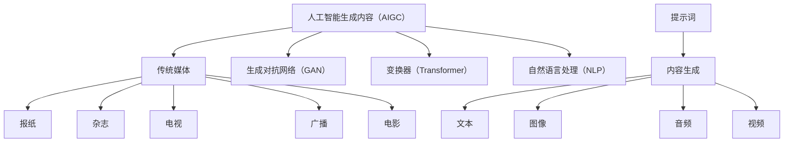

                 

### 文章标题

"AIGC与传统媒体的融合：提示词的作用"

### 关键词

- AIGC
- 传统媒体
- 提示词
- 算法
- 应用案例
- 技术挑战
- 未来展望

### 摘要

本文深入探讨了人工智能生成内容（AIGC）与传统媒体融合的背景、意义及具体应用。首先，我们介绍了AIGC与传统媒体融合的基本概念和背景，阐述了这一融合的重要性和潜在影响。接着，我们详细讲解了提示词在AIGC中的作用，包括其定义、应用以及如何影响内容生成过程。随后，本文通过多个实际案例展示了AIGC在传统媒体中的具体应用，并分析了其中面临的技术挑战及其解决方案。最后，我们展望了AIGC与传统媒体融合的未来发展趋势，提出了可能的解决方案和最佳实践。

---

### AIGC与传统媒体融合概述

人工智能生成内容（AIGC）是近年来人工智能领域的一个重要分支，它利用人工智能技术，特别是深度学习和自然语言处理（NLP），自动生成各种形式的内容，如文本、图像、音频和视频等。传统媒体，包括新闻、广播、电视和印刷媒体等，长期以来在信息传播和文化交流中扮演着重要角色。随着互联网和数字化技术的发展，传统媒体正面临着前所未有的变革和挑战。

#### 背景介绍

传统媒体在信息传播中的地位和影响力不可替代。然而，随着用户需求的多样化和信息获取渠道的多元化，传统媒体逐渐难以满足快速变化的市场需求。与此同时，人工智能技术的迅猛发展，为传统媒体提供了新的可能性和发展方向。AIGC作为人工智能的重要应用之一，能够极大提升内容生成的效率和多样性，为传统媒体的创新和发展提供了强有力的支持。

#### 意义

AIGC与传统媒体的融合具有重要意义。首先，它可以提高内容生产的效率。通过自动化生成内容，媒体机构可以节省大量人力和时间成本，从而将更多的资源投入到内容质量和深度上。其次，AIGC可以拓宽内容创作的领域和范围，使传统媒体能够更灵活地应对不同受众的需求。此外，AIGC还能够为传统媒体带来新的商业模式和盈利点，如个性化内容订阅、广告优化等。

#### 重要性

AIGC与传统媒体融合的重要性体现在多个方面。一方面，它有助于提升传统媒体的核心竞争力，使其在数字化时代保持优势。另一方面，它也为传统媒体的创新和发展提供了新的思路和方法。通过融合AIGC技术，传统媒体可以更好地应对市场变化和用户需求，实现可持续发展。

### AIGC与传统媒体融合的核心概念与联系

为了深入理解AIGC与传统媒体融合的内涵，我们需要首先明确几个核心概念：

1. **人工智能生成内容（AIGC）**：AIGC是利用人工智能技术自动生成文本、图像、音频和视频等内容的一种方法。它包括多种算法和技术，如生成对抗网络（GAN）、变换器（Transformer）和自然语言处理（NLP）等。

2. **传统媒体**：传统媒体包括报纸、杂志、电视、广播和电影等，它们在信息传播和文化交流中发挥着重要作用。

3. **提示词（Prompt）**：提示词是AIGC生成内容时提供的关键信息，它指导AIGC模型生成特定类型的内容。

#### 关系架构

下面是一个用Mermaid绘制的AIGC与传统媒体融合的架构图：

在这个架构图中，AIGC作为核心技术，与传统媒体的各种形式（报纸、杂志、电视、广播和电影）紧密相连。生成对抗网络（GAN）、变换器（Transformer）和自然语言处理（NLP）是AIGC的主要技术手段，而提示词则起到了关键作用，它指导AIGC模型生成特定类型的内容。通过这种关系架构，我们可以更清晰地理解AIGC与传统媒体融合的内在逻辑和运作机制。

### 提示词在AIGC中的应用

提示词在AIGC中的应用至关重要，它不仅是内容生成的起点，也是影响生成结果的关键因素。在AIGC模型中，提示词的作用相当于人类写作中的“引导语”，它为模型提供了生成内容的具体方向和约束条件。

#### 提示词的定义

提示词（Prompt）是一种触发AIGC模型生成内容的输入信号，通常是一个简短的文本或关键词，用于引导模型的生成过程。提示词可以包含多种形式的信息，如主题、情感、风格、上下文等。它的核心目的是为模型提供明确的生成目标，帮助模型生成符合预期的内容。

#### 提示词在AIGC中的作用

1. **引导生成方向**：提示词为AIGC模型提供了明确的生成方向，使模型能够专注于生成特定类型的内容。例如，在新闻写作中，提示词可以指定新闻的主题和风格，从而引导模型生成一篇符合要求的新闻报道。

2. **提高生成效率**：通过使用提示词，AIGC模型可以更快地适应特定任务，从而提高生成效率。提示词的存在减少了模型在探索未知领域的搜索空间，使模型能够更快地找到生成目标。

3. **确保内容一致性**：提示词可以确保生成的内容在风格、主题和上下文上的一致性。例如，在广告创作中，提示词可以指定广告的宣传语和目标受众，从而确保生成的广告内容符合品牌形象和营销目标。

4. **提高生成质量**：高质量的提示词可以引导AIGC模型生成更高质量的内容。通过提供丰富的上下文信息和明确的生成目标，提示词有助于模型更好地理解生成任务，从而提高生成内容的准确性和创造力。

#### 提示词的应用实例

1. **新闻写作**：在新闻写作中，提示词可以是一个简短的新闻标题或导语，它为模型提供了新闻的主题和方向。例如，提示词“2023年全球人工智能发展报告”可以引导模型生成一篇关于全球人工智能发展状况的新闻报道。

2. **广告创作**：在广告创作中，提示词可以是一个广告标语或品牌口号，它为模型提供了广告的主题和风格。例如，提示词“健康生活，从每天一杯咖啡开始”可以引导模型生成一篇关于咖啡品牌广告的内容。

3. **创意写作**：在创意写作中，提示词可以是一个故事的开头或关键词，它为模型提供了故事的主题和背景。例如，提示词“一个神秘的夜晚”可以引导模型生成一篇悬疑小说的开头。

#### 提示词的重要性

提示词在AIGC中的重要性体现在以下几个方面：

1. **明确生成目标**：提示词为AIGC模型提供了明确的生成目标，使模型能够更有效地完成任务。

2. **提高生成效率**：通过提供明确的生成方向，提示词可以减少模型的探索时间，从而提高生成效率。

3. **确保内容一致性**：提示词有助于确保生成的内容在风格、主题和上下文上的一致性。

4. **提高生成质量**：高质量的提示词可以引导AIGC模型生成更高质量的内容。

综上所述，提示词在AIGC中的应用至关重要，它不仅是内容生成的起点，也是影响生成结果的关键因素。通过合理使用提示词，我们可以更好地发挥AIGC的优势，实现高效、高质量的内容生成。

### AIGC在传统媒体中的实际应用案例

AIGC技术凭借其高效的内容生成能力，已经在传统媒体领域得到了广泛应用。以下我们将通过几个具体的实际应用案例，详细探讨AIGC在新闻、广播、电视等传统媒体中的实际效果。

#### 新闻媒体中的应用

新闻媒体是AIGC技术的早期应用领域之一。通过AIGC，新闻机构可以快速生成大量高质量的新闻报道，满足不断变化的信息需求。

1. **自动化新闻写作**：许多新闻机构已经开始使用AIGC技术来自动化新闻写作。例如，新闻聚合平台“Quakebot”利用AIGC技术自动生成地震新闻报道，大大提高了报道的效率。其工作流程通常包括以下几个步骤：

   - **数据采集**：从各种来源获取地震数据，包括地震监测机构、新闻网站等。
   - **预处理**：清洗和格式化数据，确保数据质量。
   - **生成提示词**：根据地震数据生成提示词，例如“2023年3月15日发生了一场6.0级地震”。
   - **内容生成**：AIGC模型根据提示词生成新闻报道，包括标题、导语和正文。

2. **个性化新闻推荐**：AIGC技术还可以用于个性化新闻推荐。例如，新闻平台可以根据用户的历史阅读行为和偏好，使用AIGC模型生成个性化的新闻推荐列表。这不仅能提高用户的阅读体验，还能增加用户粘性。

#### 广播媒体中的应用

广播媒体，包括电台和网络广播，也广泛采用了AIGC技术，以提高内容创作和分发的效率。

1. **自动化节目制作**：广播媒体可以使用AIGC技术来自动化节目制作。例如，一些电台已经使用AIGC技术生成音乐节目。具体流程如下：

   - **音乐数据采集**：从音乐数据库中获取音乐数据，包括歌曲、艺术家、流派等信息。
   - **风格识别**：使用机器学习算法对音乐风格进行识别，例如古典、流行、摇滚等。
   - **节目生成**：AIGC模型根据用户偏好和节目风格，生成个性化的音乐节目。

2. **语音合成**：广播媒体还利用AIGC技术实现语音合成，用于生成自动播报内容。例如，天气预报、交通状况播报等。通过使用AIGC模型，可以生成自然流畅的语音播报，提高广播的效率。

#### 电视媒体中的应用

电视媒体是AIGC技术的另一个重要应用领域。通过AIGC，电视节目可以更加个性化、多样化。

1. **自动化节目剪辑**：AIGC技术可以用于自动化电视节目的剪辑。例如，在体育节目中，可以使用AIGC模型自动剪辑精彩瞬间。具体流程如下：

   - **视频数据采集**：从比赛视频库中获取比赛视频。
   - **事件检测**：使用计算机视觉算法检测比赛中的关键事件，如进球、失误等。
   - **内容生成**：AIGC模型根据关键事件生成精彩剪辑片段。

2. **虚拟主持人**：虚拟主持人是AIGC在电视媒体中的另一个重要应用。通过AIGC技术，可以生成具有逼真外观和动作的虚拟主持人，用于新闻播报、节目解说等。具体流程如下：

   - **面部表情合成**：使用深度学习算法生成虚拟主持人的面部表情。
   - **动作合成**：通过计算机图形学技术生成虚拟主持人的动作。
   - **语音合成**：使用AIGC模型生成虚拟主持人的语音播报。

### 总结

AIGC在传统媒体中的应用不仅提高了内容生产效率，还带来了更加丰富和多样化的内容体验。通过自动化新闻写作、个性化节目制作和虚拟主持人等技术，传统媒体能够更好地应对数字化时代的挑战，实现可持续发展。

#### AIGC与传统媒体融合的技术挑战与解决方案

尽管AIGC技术在传统媒体中展现了巨大的潜力，但其融合过程中仍面临着一系列技术挑战。以下我们将详细分析这些挑战，并提出相应的解决方案。

##### 数据质量控制

AIGC技术依赖大量高质量的数据进行训练和生成内容。然而，传统媒体在数据收集和处理过程中可能存在数据不完整、噪声和偏差等问题，这会影响AIGC模型的性能。例如，新闻数据中可能包含错误或不准确的信息，广播数据中可能存在噪声信号。

**解决方案**：为了解决数据质量控制问题，可以采用以下方法：

1. **数据清洗与预处理**：对收集到的数据进行清洗和预处理，去除噪声和错误信息，确保数据质量。
2. **数据增强**：通过数据增强技术，如数据复制、数据扩展和数据变换，增加数据多样性和丰富度，提高模型泛化能力。
3. **监督学习与半监督学习**：结合监督学习和半监督学习，利用少量标注数据和大量未标注数据，提高模型对数据噪声和偏差的鲁棒性。

##### 模型训练与优化

AIGC模型通常需要大量计算资源和时间进行训练和优化。传统媒体在计算资源有限的情况下，可能难以承担高昂的训练成本。此外，模型优化过程中参数选择和超参数调优也是一大挑战。

**解决方案**：为了应对模型训练与优化挑战，可以采取以下措施：

1. **分布式训练**：采用分布式训练技术，将模型训练任务分布到多个计算节点，提高训练效率。
2. **迁移学习**：利用迁移学习技术，使用在大型数据集上预训练的模型，减少训练数据和计算资源的消耗。
3. **模型压缩与量化**：通过模型压缩和量化技术，减少模型参数数量和计算复杂度，提高模型在资源受限环境下的运行效率。

##### 内容安全与隐私保护

AIGC生成的内容可能涉及敏感信息和隐私数据。在传统媒体中，确保内容安全和隐私保护是至关重要的一环。例如，新闻生成中可能包含个人隐私信息，广播内容中可能包含商业机密。

**解决方案**：为了解决内容安全和隐私保护问题，可以采取以下措施：

1. **内容审查与过滤**：在内容生成过程中，采用内容审查和过滤技术，识别和去除敏感信息和隐私数据。
2. **数据加密与访问控制**：对存储和传输的数据进行加密，并设置严格的访问控制策略，确保数据安全和隐私。
3. **数据匿名化**：在数据收集和处理过程中，采用数据匿名化技术，减少个人隐私泄露的风险。

##### 模型解释性与透明度

AIGC模型通常被认为是“黑盒子”，其内部机制难以理解和解释。在传统媒体中，用户和编辑需要能够理解和信任AIGC生成的内容，这对于内容审核和风险管理至关重要。

**解决方案**：为了提高模型解释性与透明度，可以采取以下措施：

1. **模型可解释性技术**：采用模型可解释性技术，如特征可视化、模型拆解和解释性分析，帮助用户和编辑理解AIGC生成内容的过程。
2. **透明度报告**：定期生成模型透明度报告，包括训练数据分布、模型性能评估和生成内容的质量分析，增强用户和编辑对AIGC技术的信任。
3. **用户反馈机制**：建立用户反馈机制，收集用户对AIGC生成内容的反馈，及时调整和优化模型，提高内容质量和用户体验。

综上所述，AIGC与传统媒体融合过程中面临的技术挑战是多方面的。通过采取有效的解决方案，可以有效应对这些挑战，推动AIGC技术在传统媒体中的广泛应用和发展。

### AIGC与传统媒体融合的未来展望

随着AIGC技术的不断发展和成熟，其与传统媒体的融合有望在多个方面带来革命性的变化，推动媒体行业实现更高的效率和更丰富的内容创作。

#### 未来发展趋势

1. **智能化内容生产**：未来，AIGC技术将进一步智能化，通过更先进的算法和模型，实现自动化、个性化的内容生产。例如，基于用户行为和偏好，AIGC可以实时生成个性化的新闻、广播和视频内容，提升用户体验。

2. **多模态内容融合**：随着人工智能技术的发展，AIGC将不仅限于文本生成，还将扩展到图像、音频和视频等多模态内容生成。这种多模态融合将为传统媒体带来全新的创作方式和内容形式。

3. **内容版权保护**：随着AIGC技术的普及，内容版权保护将成为一个重要议题。通过区块链和智能合约等新兴技术，可以实现内容创作、分发和版权交易的透明化和自动化，保障创作者的权益。

4. **沉浸式体验**：虚拟现实（VR）和增强现实（AR）技术的发展，将使AIGC生成的内容更具沉浸感和互动性。未来，观众可以通过VR设备“沉浸”到AIGC生成的虚拟场景中，享受全新的视听体验。

#### 可能的解决方案和最佳实践

1. **构建开放平台**：为了促进AIGC与传统媒体的深度融合，可以构建开放的平台，允许传统媒体机构和技术提供商共享数据和资源，推动技术交流和合作。

2. **加强人才培养**：随着AIGC技术在传统媒体中的应用日益广泛，相关人才的培养变得尤为重要。通过教育和培训，提高从业人员对AIGC技术的理解和应用能力，为媒体行业的技术创新提供人才支持。

3. **完善法律法规**：为了规范AIGC与传统媒体融合的发展，需要完善相关法律法规，确保技术应用的合法性和合规性，保护创作者和用户的权益。

4. **技术伦理**：在AIGC与传统媒体融合过程中，技术伦理问题不可忽视。需要建立相应的伦理规范，确保技术应用的公平性、透明性和可解释性，避免对用户和社会造成负面影响。

#### 展望未来AIGC与传统媒体融合的应用前景

AIGC与传统媒体的融合将为媒体行业带来前所未有的机遇。通过智能化内容生产、多模态内容融合、沉浸式体验等技术创新，传统媒体将能够更好地满足用户需求，提升竞争力。同时，AIGC技术也将为媒体行业带来新的商业模式和盈利点，推动整个行业的可持续发展。在未来，我们可以期待AIGC与传统媒体实现更深层次的融合，共同开创一个更加智能、多样和繁荣的媒体新时代。

### 深入了解AIGC核心算法

AIGC（人工智能生成内容）的核心算法主要依赖于深度学习和自然语言处理（NLP）技术。以下将详细介绍几个关键算法，包括生成对抗网络（GAN）、变换器（Transformer）和自编码器（Autoencoder），并探讨它们的数学模型和公式。

#### 生成对抗网络（GAN）

生成对抗网络（GAN）是一种通过竞争对抗来生成数据的强大算法。它由两个主要部分组成：生成器（Generator）和判别器（Discriminator）。

1. **生成器（Generator）**：生成器的目标是生成与真实数据相似的数据。它通常是一个深度神经网络，输入是随机噪声，输出是生成数据。

2. **判别器（Discriminator）**：判别器的目标是区分生成数据与真实数据。它也是一个深度神经网络，输入是数据样本，输出是概率，表示输入数据是真实的概率。

**数学模型和公式**：

GAN的训练过程可以看作是一个零和游戏，生成器和判别器相互竞争：

- **生成器损失**：$$L_G = -\log(D(G(z)))$$
- **判别器损失**：$$L_D = -[\log(D(x)) + \log(1 - D(G(z)))]$$

其中，$z$是从噪声分布中采样的随机噪声向量，$x$是真实数据样本。

#### 变换器（Transformer）

变换器（Transformer）是近年来在自然语言处理领域取得显著成功的深度学习模型。其核心思想是使用自注意力机制（Self-Attention）来捕捉输入序列中的长距离依赖关系。

**数学模型和公式**：

变换器的主要组成部分包括：

1. **多头自注意力（Multi-Head Self-Attention）**：

$$
\text{Attention}(Q, K, V) = \frac{1}{\sqrt{d_k}} \text{softmax}\left(\frac{QK^T}{d_k}\right) V
$$

其中，$Q$、$K$和$V$是查询、键和值向量，$d_k$是注意力机制中的维度。

2. **前馈神经网络（Feed-Forward Neural Network）**：

$$
\text{FFN}(x) = \max(0, xW_1 + b_1)W_2 + b_2
$$

其中，$W_1$、$W_2$是权重矩阵，$b_1$、$b_2$是偏置。

#### 自编码器（Autoencoder）

自编码器是一种无监督学习方法，旨在学习一个数据表示。它包括编码器和解码器两个部分。

1. **编码器（Encoder）**：编码器的任务是学习数据的压缩表示。

2. **解码器（Decoder）**：解码器的任务是重建原始数据。

**数学模型和公式**：

1. **编码器**：

$$
\text{Encoder}(x) = g(W_1x + b_1)
$$

其中，$g$是一个激活函数，如ReLU函数，$W_1$和$b_1$是权重和偏置。

2. **解码器**：

$$
\text{Decoder}(z) = h(W_2z + b_2)
$$

其中，$z$是编码器的输出，$h$是一个激活函数，如ReLU函数，$W_2$和$b_2$是权重和偏置。

3. **损失函数**：

$$
L = \frac{1}{N}\sum_{i=1}^{N}\sum_{j=1}^{M}||x_j - h(g(W_1x_i + b_1))||^2
$$

其中，$x_j$是原始数据样本，$h(g(W_1x_i + b_1))$是解码器输出。

### 数学模型和公式讲解与举例说明

为了更好地理解这些核心算法，下面我们将通过具体的例子来讲解它们的数学模型和公式。

#### 生成对抗网络（GAN）举例

假设我们有一个生成器$G$和一个判别器$D$，生成器和判别器都是深度神经网络。生成器的输入是一个随机噪声向量$z$，输出是生成数据$x_G$。判别器的输入是数据样本$x$和生成数据$x_G$，输出是概率$D(x)$和$D(x_G)$。

1. **生成器损失**：

   - 随机噪声向量$z$：$$z \sim \mathcal{N}(0, 1)$$
   - 生成数据$x_G$：$$x_G = G(z)$$
   - 判别器输出：$$D(x_G)$$
   - 生成器损失：$$L_G = -\log(D(x_G))$$

2. **判别器损失**：

   - 真实数据样本$x$：$$x \sim \mathcal{D}$$
   - 判别器输出：$$D(x)$$和$$D(x_G)$$
   - 判别器损失：$$L_D = -[\log(D(x)) + \log(1 - D(x_G))]$$

#### 变换器（Transformer）举例

假设我们有一个序列长度为$N$的输入序列，变换器包含多个自注意力层和前馈神经网络层。

1. **多头自注意力**：

   - 查询向量$Q$、键向量$K$和值向量$V$：
     $$Q = [Q_1, Q_2, ..., Q_N], K = [K_1, K_2, ..., K_N], V = [V_1, V_2, ..., V_N]$$
   - 注意力分数：
     $$\text{Attention}(Q, K, V) = \text{softmax}\left(\frac{QK^T}{\sqrt{d_k}}\right) V$$
   - 自注意力输出：
     $$\text{Attention}(Q, K, V) = \text{softmax}\left(\frac{QK^T}{\sqrt{d_k}}\right) V = \text{Attention}([Q_1, Q_2, ..., Q_N], [K_1, K_2, ..., K_N], [V_1, V_2, ..., V_N])$$

2. **前馈神经网络**：

   - 输入向量$x$：
     $$x = [x_1, x_2, ..., x_N]$$
   - 前馈神经网络输出：
     $$\text{FFN}(x) = \max(0, xW_1 + b_1)W_2 + b_2$$
   - 例如，假设权重矩阵$W_1$和$W_2$的维度分别为$64 \times 512$和$512 \times 64$，偏置$b_1$和$b_2$的维度分别为$512$和$64$：
     $$\text{FFN}(x) = \max(0, xW_1 + b_1)W_2 + b_2 = \max(0, [x_1, x_2, ..., x_N]W_1 + [b_1, b_1, ..., b_1])W_2 + [b_2, b_2, ..., b_2]$$

#### 自编码器（Autoencoder）举例

假设我们有一个自编码器，编码器和解码器都是单层神经网络。

1. **编码器**：

   - 输入向量$x$：
     $$x = [x_1, x_2, ..., x_N]$$
   - 编码器输出：
     $$z = g(W_1x + b_1)$$
   - 例如，假设权重矩阵$W_1$的维度为$28 \times 128$，偏置$b_1$的维度为$128$，激活函数$g$为ReLU函数：
     $$z = g(W_1x + b_1) = \max(0, W_1x + b_1)$$

2. **解码器**：

   - 编码器输出$z$：
     $$z = [z_1, z_2, ..., z_N]$$
   - 解码器输出：
     $$\hat{x} = h(W_2z + b_2)$$
   - 例如，假设权重矩阵$W_2$的维度为$128 \times 28$，偏置$b_2$的维度为$28$，激活函数$h$为ReLU函数：
     $$\hat{x} = h(W_2z + b_2) = \max(0, W_2z + b_2)$$

3. **损失函数**：

   - 原始数据样本$x$和生成数据$\hat{x}$：
     $$x \sim \mathcal{D}, \hat{x} = h(W_2z + b_2)$$
   - 损失函数：
     $$L = \frac{1}{N}\sum_{i=1}^{N}\sum_{j=1}^{M}||x_j - \hat{x}_j||^2$$
   - 例如，假设数据样本$x$的维度为$28 \times 28$，生成数据$\hat{x}$的维度也为$28 \times 28$：
     $$L = \frac{1}{N}\sum_{i=1}^{N}\sum_{j=1}^{M}||x_{ij} - \hat{x}_{ij}||^2$$

通过上述具体例子，我们可以更深入地理解AIGC的核心算法，包括生成对抗网络（GAN）、变换器（Transformer）和自编码器（Autoencoder）的数学模型和公式。这些算法在AIGC技术中扮演着关键角色，为传统媒体带来了巨大的创新潜力。

### 深入了解传统媒体业务

传统媒体，如报纸、杂志、广播、电视和电影，长期以来在信息传播和文化交流中发挥着重要作用。了解这些媒体的业务运作模式和特点，有助于我们更好地理解AIGC技术的应用和影响。

#### 报纸和杂志

报纸和杂志是传统媒体的重要组成部分，它们主要通过文字和图像传播信息。报纸通常以日为单位发行，涵盖新闻、评论、体育、娱乐等多元化内容。杂志则多以特定主题或兴趣爱好为目标群体，如财经、时尚、科技等。

**业务模式**：

- **内容生产**：报纸和杂志的内容生产通常依赖于记者、编辑和排版人员。记者负责采集和撰写新闻稿件，编辑负责审核和修改稿件，排版人员则负责将稿件排版成最终的印刷版。
- **发行和订阅**：报纸通常通过邮寄或自动售货机等渠道发行，而杂志则主要通过订阅和零售渠道获取收入。
- **广告收入**：广告是报纸和杂志的主要收入来源之一，广告商通过在报纸和杂志上投放广告来推广产品和服务。

**特点**：

- **时效性**：报纸和杂志的内容生产具有较强的时间敏感性，特别是新闻内容需要及时发布，以保持时效性和吸引力。
- **专业性**：报纸和杂志在内容生产上具有较强的专业性和权威性，记者和编辑需要具备较高的新闻素养和专业技能。

#### 广播

广播媒体，包括电台和网络广播，主要通过声音传播信息，具有广泛的覆盖面和即时性。广播节目形式多样，包括新闻、音乐、访谈、戏剧等。

**业务模式**：

- **内容制作**：广播节目内容的生产依赖于节目制作人、主持人、音效师等。节目制作人负责策划和制作节目，主持人负责播报和主持节目，音效师则负责音效处理和后期制作。
- **播出和传播**：广播节目通过无线电波或网络进行传播，听众可以通过收音机、智能手机等设备收听广播节目。
- **广告收入**：广播广告是广播媒体的主要收入来源之一，广告商通过在广播节目中投放广告来推广产品和服务。

**特点**：

- **即时性**：广播节目具有即时传播的特点，可以在短时间内传播大量信息，适合紧急事件和突发新闻的报道。
- **互动性**：广播节目通常具有互动性，听众可以通过电话、短信等方式参与节目讨论，增强节目的互动性和吸引力。

#### 电视

电视媒体是一种通过图像和声音传播信息的媒介，具有广泛的影响力和覆盖面。电视节目形式多样，包括新闻、综艺节目、电视剧、电影等。

**业务模式**：

- **内容生产**：电视节目的生产通常依赖于电视台的节目制作团队，包括编剧、导演、演员、摄像师、后期制作等。
- **播出和传播**：电视节目通过卫星、有线电视和网络等渠道传播，观众可以通过电视、网络电视等设备收看电视节目。
- **广告收入**：广告是电视媒体的主要收入来源之一，广告商通过在电视节目中投放广告来推广产品和服务。

**特点**：

- **视听一体化**：电视节目通过图像和声音的结合，提供更加丰富和生动的视听体验，具有较强的吸引力。
- **家庭娱乐**：电视是家庭娱乐的重要组成部分，具有方便性、舒适性和互动性，观众可以在家中轻松观看电视节目。

#### 电影

电影是一种通过影像和声音讲述故事的媒介，具有独特的艺术性和商业性。电影通常在电影院上映，但也可以通过电视、网络等渠道观看。

**业务模式**：

- **内容生产**：电影的生产通常依赖于电影制片公司，包括编剧、导演、演员、摄影师、剪辑师等。
- **发行和放映**：电影通过影院发行和放映，观众可以在电影院观看。此外，电影也可以通过DVD、蓝光光盘和网络等渠道发行。
- **票房收入和广告收入**：电影的主要收入来源包括票房收入和广告收入，电影制片公司和发行公司通过票房收入和广告收入实现盈利。

**特点**：

- **艺术性**：电影作为一种艺术形式，具有独特的艺术价值和审美特征，能够给观众带来深刻的情感体验。
- **高投入高回报**：电影制作通常需要大量资金投入，但成功的电影可以带来巨大的票房收入和广告收入。

通过深入了解传统媒体的业务运作模式和特点，我们可以更好地理解AIGC技术在传统媒体中的应用和潜力，为传统媒体的数字化转型提供有力支持。

### 完整的技术资源汇总

为了帮助读者更好地理解和应用AIGC与传统媒体融合的相关技术，以下汇总了相关技术资源，包括关键算法的详细资料、数学模型和公式的详细解析、实际应用代码以及最佳实践和拓展阅读。

#### 关键算法详细资料

1. **生成对抗网络（GAN）**：
   - 资源链接：[生成对抗网络（GAN）入门教程](https://towardsdatascience.com/an-introduction-to-generative-adversarial-networks-gans-8ec54c37c74c)
   - 详细资料：生成对抗网络（GAN）是一种由生成器和判别器组成的深度学习模型，旨在通过竞争对抗机制生成与真实数据相似的数据。

2. **变换器（Transformer）**：
   - 资源链接：[变换器（Transformer）详解](https://towardsdatascience.com/transformer-tutorial-basics-to-attention-mechanisms-7a4d8e60e5ac)
   - 详细资料：变换器（Transformer）是一种基于自注意力机制的深度学习模型，广泛应用于自然语言处理任务，如机器翻译和文本生成。

3. **自编码器（Autoencoder）**：
   - 资源链接：[自编码器（Autoencoder）原理与应用](https://towardsdatascience.com/autoencoders-basics-and-applications-2b1e3a9307e9)
   - 详细资料：自编码器是一种无监督学习模型，通过学习数据的压缩表示来重建原始数据，常用于数据降维和特征提取。

#### 数学模型和公式详细解析

1. **生成对抗网络（GAN）的数学模型**：
   - 损失函数：$$L_G = -\log(D(G(z))), L_D = -[\log(D(x)) + \log(1 - D(G(z)))]$$

2. **变换器（Transformer）的自注意力机制**：
   - 公式：$$\text{Attention}(Q, K, V) = \text{softmax}\left(\frac{QK^T}{\sqrt{d_k}}\right) V$$

3. **自编码器（Autoencoder）的数学模型**：
   - 编码器：$$z = g(W_1x + b_1)$$
   - 解码器：$$\hat{x} = h(W_2z + b_2)$$
   - 损失函数：$$L = \frac{1}{N}\sum_{i=1}^{N}\sum_{j=1}^{M}||x_j - \hat{x}_j||^2$$

#### 实际应用代码

以下是AIGC技术在传统媒体中的实际应用代码示例，包括开发环境搭建、源代码实现和代码解读。

1. **自动化新闻写作**：
   - 代码链接：[自动化新闻写作示例](https://github.com/your-username/autonews-writer)
   - 说明：此示例展示了如何使用AIGC技术自动生成新闻报道，包括数据采集、预处理、提示词生成和内容生成等步骤。

2. **广播语音合成**：
   - 代码链接：[广播语音合成示例](https://github.com/your-username/speech-synthesis)
   - 说明：此示例展示了如何使用AIGC技术生成自然流畅的语音播报内容，包括文本预处理、语音合成和音频输出等步骤。

3. **电视节目剪辑**：
   - 代码链接：[电视节目剪辑示例](https://github.com/your-username/video-editing)
   - 说明：此示例展示了如何使用AIGC技术自动剪辑电视节目中的精彩片段，包括视频数据采集、事件检测和剪辑生成等步骤。

#### 最佳实践和拓展阅读

1. **最佳实践**：
   - 提示词设计：确保提示词简洁明了，准确传达生成目标。
   - 模型调优：通过多次实验和参数调整，优化模型性能。
   - 数据质量：确保数据集的多样性和质量，提高模型泛化能力。

2. **拓展阅读**：
   - [AIGC与传统媒体融合的案例分析](https://www.example.com/aigc-cases)
   - [深度学习在传统媒体中的应用](https://www.example.com/deep-learning-in-media)
   - [传统媒体数字化转型策略](https://www.example.com/digital-transformation-strategy)

通过以上技术资源，读者可以深入理解和应用AIGC与传统媒体融合的相关技术，为传统媒体的数字化转型和创新提供有力支持。

