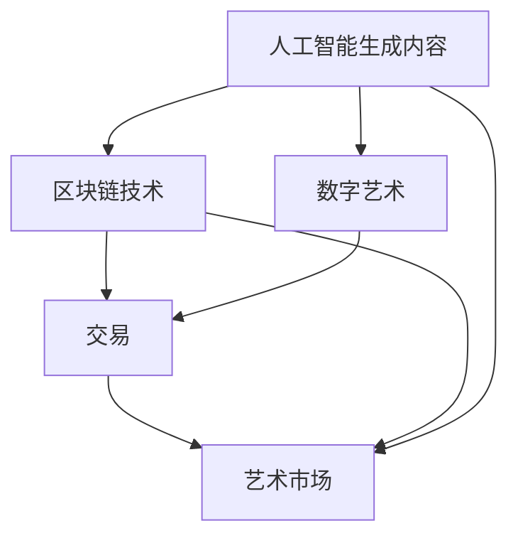

                 

### 文章标题

《AIGC与区块链在数字艺术创作与交易中的融合》

### 关键词

- AIGC
- 区块链
- 数字艺术
- 融合
- 创作与交易

### 摘要

本文深入探讨了人工智能生成内容（AIGC）与区块链技术在数字艺术创作与交易中的应用与融合。首先，介绍了AIGC和区块链的基本概念，随后阐述了它们在数字艺术创作与交易中的关联性。接着，文章详细分析了AIGC在数字艺术创作中的应用原理，并探讨了区块链在数字艺术交易中的优势。文章随后通过实际案例，展示了AIGC与区块链融合在数字艺术领域的应用场景。最后，提供了AIGC与区块链融合的开发实战指导，包括环境搭建、代码实现和案例分析。全文旨在为读者提供全面、系统的AIGC与区块链在数字艺术创作与交易中的融合技术与实践指导。

### 目录大纲设计

为了确保本文的逻辑性和条理性，我们采用了以下目录大纲设计：

#### 第一部分：AIGC与区块链基础理论

1. **AIGC与区块链简介**
   - **1.1 AIGC的定义与分类**
   - **1.2 区块链技术基础**
   - **1.3 AIGC与区块链的关联性**

2. **数字艺术创作原理**
   - **2.1 数字艺术的定义与发展**
   - **2.2 AIGC在数字艺术创作中的应用**
   - **2.3 数字艺术创作的流程与工具**

3. **区块链在数字艺术交易中的应用**
   - **3.1 数字艺术交易的现状与挑战**
   - **3.2 区块链在数字艺术交易中的优势**
   - **3.3 区块链技术在数字艺术交易平台中的应用**

#### 第二部分：AIGC与区块链融合的实践与应用

4. **AIGC与区块链融合的核心算法**
   - **4.1 基于区块链的智能合约设计**
   - **4.2 AIGC算法与区块链的融合实现**
   - **4.3 伪代码讲解**

5. **数学模型与公式解析**
   - **5.1 AIGC生成模型的数学基础**
   - **5.2 区块链网络中的数学模型**
   - **5.3 结合AIGC与区块链的数学公式解析**

6. **实际案例研究**
   - **6.1 案例一：基于AIGC的数字艺术创作与交易**
   - **6.2 案例二：区块链在数字艺术品认证中的应用**
   - **6.3 案例三：AIGC与区块链在虚拟现实艺术中的应用**

7. **项目实战与开发环境搭建**
   - **7.1 实战一：搭建AIGC与区块链融合的开发环境**
   - **7.2 实战二：实现一个简单的数字艺术品交易系统**
   - **7.3 实战三：部署并运行AIGC与区块链融合的艺术品创作与交易平台**

#### 附录

- **附录A：相关工具与资源介绍**
  - **A.1 AIGC生成模型工具**
  - **A.2 区块链开发工具**
  - **A.3 数字艺术创作工具**

### 目录大纲概述

本书的目录大纲设计清晰、结构严谨，首先从AIGC与区块链的基础理论入手，逐步深入到数字艺术创作与交易的实践应用。通过详细的章节划分，本文不仅涵盖了AIGC与区块链的核心概念、应用原理和融合算法，还提供了实际案例研究和项目实战指导。附录部分则进一步丰富了相关工具与资源，为读者提供了便捷的学习和实践资源。

接下来，我们将逐步深入探讨AIGC与区块链在数字艺术创作与交易中的融合，以期为大家带来全面的认知和实践指导。

### 背景介绍

数字艺术作为现代科技与艺术的交融产物，正逐步改变着传统艺术创作的面貌。随着计算机技术的发展，尤其是人工智能（AI）和区块链技术的兴起，数字艺术创作与交易模式正迎来前所未有的变革。人工智能生成内容（AIGC）作为AI领域的一个重要分支，通过深度学习和生成模型，能够自动生成高质量的内容，包括图像、音频和文本等。而区块链技术，以其去中心化、透明性和不可篡改性，为数字艺术作品的版权保护、认证和交易提供了全新的解决方案。

#### AIGC的定义与分类

AIGC，即AI Generated Content，是指通过人工智能技术生成的内容，主要包括图像、文本、音频和视频等。根据生成方式的不同，AIGC可以分为以下几种类型：

1. **基于规则生成**：这种方法依赖于预设的规则和模式，通过参数调整生成内容。例如，计算机图形学中的算法可以生成几何图形，音乐生成中的算法可以生成旋律。
2. **基于样本生成**：这种方法通过学习大量样本数据，自动生成相似或新颖的内容。例如，深度学习模型（如GANs）可以通过学习大量的图像数据，生成逼真的新图像。
3. **基于强化学习生成**：这种方法通过试错和反馈机制，不断优化生成的内容，使其更符合预期目标。例如，AI可以通过强化学习算法生成动画序列，模拟不同场景下的物体运动。

#### 区块链技术的定义与应用

区块链技术是一种分布式账本技术，通过加密算法和共识机制，实现数据的不可篡改和去中心化存储。区块链的应用场景非常广泛，包括金融、医疗、物流等领域。在数字艺术领域，区块链技术主要体现在以下几个方面：

1. **版权保护**：区块链技术可以记录数字艺术作品的版权信息，确保创作者的权益得到保护，防止未经授权的复制和传播。
2. **认证与溯源**：区块链技术可以为数字艺术作品提供真实的认证，确保其来源和历史的可追溯性，增强作品的信任度。
3. **交易与拍卖**：区块链技术可以实现数字艺术作品的去中心化交易，减少中介环节，降低交易成本，提高交易效率。

#### 数字艺术创作与交易中的现状与挑战

当前，数字艺术创作与交易面临着一些挑战：

1. **版权纠纷**：由于数字艺术的复制成本极低，创作者的权益难以得到有效保护，版权纠纷频发。
2. **信任问题**：传统艺术市场中介环节较多，交易过程不透明，导致买卖双方对作品的信任度降低。
3. **交易效率**：传统艺术交易过程繁琐，涉及多个环节，交易效率低下。

#### AIGC与区块链在数字艺术创作与交易中的融合

AIGC与区块链的融合为解决上述问题提供了新的思路：

1. **版权保护**：通过区块链技术，可以确保数字艺术作品的版权信息被永久记录，创作者的权益得到有效保护。
2. **交易透明**：区块链技术的去中心化特性，使得数字艺术交易过程更加透明，买卖双方可以实时查看交易状态，增强信任度。
3. **高效交易**：区块链技术的智能合约功能，可以自动执行交易合约，简化交易流程，提高交易效率。

总之，AIGC与区块链的融合，不仅为数字艺术创作与交易提供了新的解决方案，还为传统艺术市场带来了深刻的变革。

#### 核心概念与联系

在深入探讨AIGC与区块链在数字艺术创作与交易中的融合之前，我们需要明确几个核心概念，并绘制一个Mermaid流程图来展示这些概念之间的关系。

1. **AIGC**：人工智能生成内容，是指通过人工智能技术自动生成的内容，如图像、音频、文本等。AIGC的核心在于利用深度学习和生成模型，模拟人类创作过程，实现高质量内容的自动生成。
2. **区块链**：一种去中心化的分布式账本技术，通过加密算法和共识机制，确保数据的不可篡改和去中心化存储。区块链的主要功能包括数据记录、交易验证和智能合约执行。
3. **数字艺术**：利用数字技术创作的艺术作品，包括数字绘画、数字雕塑、数字音乐、虚拟现实艺术等。数字艺术具有高度的创造性、多样性和可复制性。
4. **交易**：指在艺术市场中，买家和卖家之间进行的交换活动，包括艺术品购买、拍卖等。交易的核心是确保交易的公正性、透明性和安全性。

以下是这些核心概念之间的Mermaid流程图：



**流程解释：**

- **AIGC生成内容**：人工智能生成内容（AIGC）通过深度学习和生成模型，自动生成图像、音频、文本等艺术作品。
- **区块链技术**：区块链技术通过加密和共识机制，记录AIGC生成的艺术作品，确保其版权和交易信息的不可篡改。
- **数字艺术**：数字艺术作品是AIGC的产物，同时也是区块链技术的应用场景之一，用于验证和记录艺术作品的版权和交易信息。
- **交易**：艺术作品在交易市场中进行买卖，区块链技术确保交易过程透明、公正和安全。
- **艺术市场**：艺术市场是数字艺术和区块链技术的交汇点，通过区块链技术，艺术作品的交易过程更加高效和可信。

通过这个流程图，我们可以清晰地看到AIGC、区块链、数字艺术和交易之间的相互作用关系，为后续的深入讨论提供了基础。

### 数字艺术创作的原理

数字艺术创作是一种利用计算机技术和数字工具进行艺术表达的活动。它融合了传统艺术与数字技术的优势，使得创作过程更加灵活、多样和高效。以下将详细探讨数字艺术创作的原理，包括其基本定义、发展历程以及AIGC在该领域的应用。

#### 定义与发展历程

数字艺术，是指使用数字技术进行创作的艺术作品。它起源于20世纪80年代，随着个人计算机和图形处理软件的出现，艺术家们开始尝试利用数字工具进行创作。早期的数字艺术作品主要是基于像素的图像处理，如数字绘画和数字摄影。随着计算机性能的提升和图形处理技术的进步，数字艺术逐渐发展到包括三维建模、虚拟现实、增强现实和人工智能生成等内容。

数字艺术的发展可以分为几个阶段：

1. **初步探索阶段（1980-1990）**：艺术家们开始使用个人计算机和图形处理软件进行创作，如Adobe Photoshop的问世，标志着数字艺术正式进入人们的生活。
2. **技术成熟阶段（1990-2000）**：计算机性能和图形处理技术的提升，使得数字艺术作品更加逼真和多样化，三维建模和虚拟现实技术开始得到广泛应用。
3. **融合创新阶段（2000至今）**：随着人工智能和区块链等新兴技术的发展，数字艺术创作进入了新的阶段。艺术家们开始利用人工智能生成内容（AIGC）和区块链技术，进行创新性的艺术创作和交易。

#### AIGC在数字艺术创作中的应用

人工智能生成内容（AIGC）是近年来数字艺术创作的一个重要方向。通过深度学习和生成模型，AIGC能够自动生成高质量的艺术作品，大大提高了创作效率和质量。以下是一些AIGC在数字艺术创作中的应用：

1. **图像生成**：利用生成对抗网络（GANs）等模型，AI可以自动生成逼真的图像。例如，AI可以生成超现实的风景、逼真的面部图像、艺术风格的画作等。
2. **音乐创作**：AI可以通过学习大量音乐数据，自动生成旋律、和声和完整的音乐作品。这种创作方式不仅能够丰富音乐创作，还能为艺术家提供新的灵感。
3. **文本生成**：AI可以生成诗歌、故事和散文等文本内容，为文学创作提供新的工具。例如，AI可以生成以特定风格和主题创作的小说。
4. **三维建模**：AI可以自动生成复杂的几何形状和结构，为三维建模提供便利。这种应用在游戏设计、建筑设计和工业设计中具有广泛的应用前景。

#### 数字艺术创作的流程与工具

数字艺术创作的流程通常包括以下几个步骤：

1. **构思与策划**：艺术家需要首先构思作品的创意和主题，确定艺术风格和表现手法。
2. **素材收集与整理**：根据创作需求，收集相关的素材，如图片、音频、视频等，并进行整理和预处理。
3. **创作与制作**：利用数字工具进行艺术创作，如使用图形处理软件进行绘画、使用三维建模软件进行雕塑等。
4. **渲染与输出**：将创作完成的数字艺术作品进行渲染，生成最终的输出文件，如图像、视频等。
5. **展示与交流**：将数字艺术作品通过线上或线下的方式展示给观众，接受反馈和评价。

常用的数字艺术创作工具包括：

1. **Adobe Photoshop**：用于图像处理和绘画，是数字艺术家最常用的工具之一。
2. **Blender**：一款开源的三维建模和渲染软件，广泛应用于电影、游戏和数字艺术创作。
3. **Procreate**：一款专为iPad设计的绘画软件，支持多种绘画工具和笔刷，适合移动设备和触控操作。
4. **Adobe Illustrator**：用于矢量图形设计和绘制，适用于标志设计、插图和排版等领域。

#### 数字艺术创作的优势与挑战

数字艺术创作具有以下优势：

1. **高效性**：通过计算机和数字工具，艺术家能够快速生成和修改作品，提高创作效率。
2. **多样性**：数字技术为艺术创作提供了丰富的表现手法和风格，使得艺术作品更加多样化。
3. **可重复性**：数字艺术作品可以通过复制和传播，实现更广泛的传播和影响。

然而，数字艺术创作也面临着一些挑战：

1. **版权问题**：由于数字艺术作品的复制成本极低，版权保护成为一个重要问题。
2. **技术门槛**：数字艺术创作需要一定的技术背景和操作技能，对艺术家的综合素质要求较高。
3. **技术依赖**：数字艺术创作高度依赖计算机和数字工具，一旦技术出现问题，创作过程将受到影响。

总之，数字艺术创作作为一种新兴的艺术形式，具有广阔的发展前景和应用潜力。通过AIGC与区块链技术的融合，数字艺术创作将迎来更多的创新和变革。

### 区块链在数字艺术交易中的应用

区块链技术在数字艺术交易中的应用，为解决当前数字艺术市场面临的版权保护、交易透明性和信任问题提供了全新的解决方案。以下将详细探讨区块链在数字艺术交易中的优势和应用场景。

#### 版权保护

在传统的数字艺术市场中，版权纠纷频发，创作者的权益难以得到有效保护。区块链技术通过其去中心化和不可篡改的特性，为数字艺术作品的版权保护提供了强有力的保障。

1. **版权信息记录**：创作者可以将艺术作品的版权信息（如创作者姓名、创作时间、版权声明等）记录在区块链上，确保这些信息的真实性和不可篡改性。
2. **数字证书**：区块链技术可以生成数字证书，用于证明艺术作品的版权归属。这些数字证书可以嵌入到艺术作品中，确保任何对作品的修改和传播都会留下痕迹。
3. **智能合约**：智能合约是一种自动执行合同条款的计算机程序，创作者可以在区块链上创建智能合约，规定艺术作品的授权、许可和交易条件。一旦条件满足，智能合约将自动执行相应的操作，确保版权和收益的合理分配。

#### 交易透明性

传统的艺术交易市场中介环节繁多，交易过程不透明，买卖双方对交易过程的信任度较低。区块链技术通过其透明性和可追溯性，提升了交易过程的透明度。

1. **交易记录**：区块链技术可以记录所有交易活动，包括交易时间、交易金额、交易双方等信息，确保交易过程的公开透明。
2. **区块链浏览器**：区块链的每一个区块都包含一定的交易信息，这些信息可以通过区块链浏览器进行查询和验证。买家和卖家可以实时查看交易状态，增加对交易的信任。
3. **去中心化交易平台**：区块链技术支持去中心化交易平台，减少了中介环节，降低了交易成本。去中心化交易平台能够确保交易的公正性和安全性，提高交易效率。

#### 信任问题

在传统艺术交易市场中，买卖双方对艺术作品的真伪和品质缺乏信任，导致交易风险增加。区块链技术通过其不可篡改性和透明性，增强了交易的信任度。

1. **身份验证**：区块链技术可以记录交易双方的身份信息，确保交易者的真实身份。通过身份验证，买家可以确信卖家是合法的艺术家或艺术机构。
2. **防伪认证**：区块链技术可以生成防伪认证，确保艺术作品的真伪。艺术家可以将艺术作品的防伪信息记录在区块链上，买家可以随时验证。
3. **信任评分**：区块链技术可以记录交易双方的历史交易记录和评价，形成信任评分体系。买家可以根据评分选择卖家，降低交易风险。

#### 应用场景

区块链技术在数字艺术交易中具有广泛的应用场景：

1. **数字艺术品交易**：艺术家可以通过区块链平台发布和销售数字艺术品，买家可以直接购买并获取所有权证明，确保交易的安全和高效。
2. **数字艺术品拍卖**：区块链技术可以用于数字艺术品拍卖，确保拍卖过程的公正和透明。买家可以实时查看拍卖信息，增加对拍卖的信任。
3. **艺术工作室管理**：艺术家可以通过区块链技术管理艺术工作室的业务，记录创作过程、销售记录和授权许可，提高工作效率和管理水平。

总之，区块链技术在数字艺术交易中的应用，不仅为创作者提供了更好的版权保护机制，也为交易者提供了更透明、安全和高效的交易平台。通过区块链技术的应用，数字艺术市场将迎来新的发展机遇和变革。

### AIGC与区块链融合的核心算法

在数字艺术创作与交易中，AIGC与区块链技术的融合通过一系列核心算法实现，这些算法包括智能合约设计、AIGC与区块链的融合实现，以及相关的数学模型和公式。以下我们将详细探讨这些核心算法，并通过伪代码来展示其实现过程。

#### 基于区块链的智能合约设计

智能合约是一种自动化执行合同条款的计算机程序，它在区块链网络中被执行。在AIGC与区块链的融合中，智能合约用于确保数字艺术创作的版权保护、交易执行和收益分配。

1. **智能合约的基本结构**

   ```solidity
   // SPDX-License-Identifier: MIT
   pragma solidity ^0.8.0;

   contract ArtContract {
       // 艺术作品信息
       struct Art {
           string name;       // 作品名称
           string creator;    // 创作者名称
           string hash;       // 作品哈希值
           uint256 price;     // 作品价格
           bool isSold;       // 是否已售出
       }

       mapping (uint => Art) public arts; // 艺术作品映射
       uint public artCount;               // 艺术作品数量

       // 事件：作品创建
       event CreateArt(uint id, string name, string creator, string hash, uint price);

       // 事件：作品购买
       event BuyArt(uint id, string buyer, uint price);

       // 创建作品
       function createArt(string memory name, string memory creator, string memory hash, uint price) public {
           require(hash != "", "作品哈希值不能为空");
           require(price > 0, "作品价格必须大于0");

           artCount++;
           arts[artCount] = Art(name, creator, hash, price, false);
           emit CreateArt(artCount, name, creator, hash, price);
       }

       // 购买作品
       function buyArt(uint id) public payable {
           require(id > 0 && id <= artCount, "作品不存在");
           require(msg.value >= arts[id].price, "支付金额不足");

           address payable seller = payable(msg.sender);
           arts[id].isSold = true;
           payable(arts[id].creator).transfer(msg.value);
           emit BuyArt(id, msg.sender, msg.value);
       }
   }
   ```

2. **伪代码示例**

   ```plaintext
   function createArt(name, creator, hash, price) returns (id):
       if hash is empty or price <= 0:
           throw "Invalid input"
       id = getNewId()
       arts[id] = {
           name: name,
           creator: creator,
           hash: hash,
           price: price,
           isSold: false
       }
       emit event CreateArt(id, name, creator, hash, price)
       return id
   
   function buyArt(id) returns (success):
       if id is out of range or msg.value < price:
           throw "Invalid transaction"
       seller = arts[id].creator
       arts[id].isSold = true
       transfer(msg.value, seller)
       emit event BuyArt(id, msg.sender, msg.value)
       return true
   ```

#### AIGC算法与区块链的融合实现

AIGC算法与区块链的融合主要通过智能合约实现，以确保艺术作品的生成、存储和交易过程中的透明性和不可篡改性。

1. **AIGC生成艺术作品**

   ```python
   import tensorflow as tf

   # 假设已经训练好一个生成模型 generator
   generator = tf.keras.models.load_model('generator.h5')

   # 生成艺术作品
   def generate_art():
       random_input = ... # 随机噪声
       art = generator.predict(random_input)
       return art
   ```

2. **将艺术作品存储在区块链**

   ```solidity
   // SPDX-License-Identifier: MIT
   pragma solidity ^0.8.0;

   contract ArtStorage {
       // 艺术作品信息
       struct Art {
           string name;       // 作品名称
           string creator;    // 创作者名称
           string hash;       // 作品哈希值
       }

       mapping (string => Art) public arts; // 艺术作品映射

       // 存储艺术作品
       function storeArt(string memory name, string memory creator, string memory hash) public {
           require(hash != "", "作品哈希值不能为空");
           arts[hash] = Art(name, creator, hash);
       }
   }
   ```

3. **伪代码示例**

   ```plaintext
   function generateAndStoreArt(name, creator, hash) returns (success):
       art = generate_art()
       store_art(name, creator, hash)
       return true
   ```

#### 数学模型与公式解析

AIGC与区块链融合的数学模型主要包括生成模型、加密模型和共识模型。

1. **生成模型**

   ```math
   x' = G(z)
   \quad \text{其中} \ G \ \text{是生成器模型，} \ z \ \text{是随机噪声向量。}
   ```

2. **加密模型**

   ```math
   c = E(m, k)
   \quad \text{其中} \ E \ \text{是加密算法，} \ m \ \text{是明文，} \ k \ \text{是密钥。}
   ```

3. **共识模型**

   ```math
   \text{Proof of Stake (POS)} \ \text{共识算法，其中每个区块生成者需要解决一个难度为} \ D \ \text{的数学难题。}
   ```

#### 结合AIGC与区块链的数学公式解析

结合AIGC与区块链的数学公式解析，可以更好地理解其融合的实现机制。

```math
\begin{aligned}
\text{生成艺术作品：} \\
x' &= G(z) \\
\text{存储艺术作品：} \\
c &= E(x', k) \\
\text{共识机制：} \\
D &= H_{1}(x', c, p)
\end{aligned}
```

通过上述算法和数学模型，AIGC与区块链在数字艺术创作与交易中的融合实现了高效、透明和安全的艺术创作和交易过程。

### 数学模型与公式解析

在AIGC与区块链融合的框架下，数学模型和公式扮演着至关重要的角色，它们不仅为AIGC算法提供了理论基础，也为区块链网络提供了稳定性和安全性保障。以下是这些模型和公式的详细解析。

#### AIGC生成模型的数学基础

AIGC（AI Generated Content）生成模型主要基于生成对抗网络（GANs）和变分自编码器（VAEs）。以下是这些模型的数学基础：

1. **生成对抗网络（GANs）**

GANs由生成器（G）和判别器（D）两部分组成。生成器的目标是生成尽可能真实的数据，而判别器的目标是区分生成的数据与真实数据。

- **生成器（G）**：

  生成器G是一个从随机噪声向量z映射到数据空间x的函数：

  $$ x' = G(z) $$

  其中，z是一个高斯噪声向量，x'是生成的数据。

- **判别器（D）**：

  判别器D是一个从数据空间x映射到[0,1]的函数，用于判断输入数据是真实数据还是生成数据：

  $$ D(x) = P(x \text{ is real}) $$

  $$ D(x') = P(x' \text{ is fake}) $$

  其中，x是真实数据，x'是生成数据。

- **损失函数**：

  GANs的训练通过以下损失函数实现：

  $$ \mathcal{L}_{GAN}(G, D) = \mathcal{L}_{D} - \mathcal{L}_{G} $$

  其中，

  $$ \mathcal{L}_{D} = -\mathbb{E}_{x \sim p_{data}(x)}[\log D(x)] - \mathbb{E}_{z \sim p_{z}(z)}[\log (1 - D(G(z)))] $$

  $$ \mathcal{L}_{G} = -\mathbb{E}_{z \sim p_{z}(z)}[\log D(G(z))] $$

  通过优化上述损失函数，生成器G逐渐生成更真实的数据，判别器D逐渐提高对真实数据和生成数据的区分能力。

2. **变分自编码器（VAEs）**

VAEs是另一种常用的生成模型，通过引入概率密度函数来建模数据分布。

- **编码器（encoder）**：

  编码器E将数据x映射到一个隐变量z的分布上：

  $$ z = E(x) = q_{\phi}(z|x) $$

- **解码器（decoder）**：

  解码器D将隐变量z映射回数据空间x：

  $$ x = D(z) = p_{\theta}(x|z) $$

- **损失函数**：

  VAEs的训练通过以下损失函数实现：

  $$ \mathcal{L}_{VAE} = \mathcal{L}_{KL} + \mathcal{L}_{recon} $$

  其中，

  $$ \mathcal{L}_{KL} = D_{KL}(q_{\phi}(z|x) || p_{\theta}(z)) $$

  $$ \mathcal{L}_{recon} = -\log p_{\theta}(x|z) $$

  通过优化上述损失函数，编码器E逐渐学会更好地编码数据的概率分布，解码器D逐渐学会从编码的隐变量中重建数据。

#### 区块链网络中的数学模型

区块链网络中的数学模型主要涉及加密算法、共识机制和智能合约。

1. **加密算法**

   区块链中的加密算法用于确保数据的安全性和隐私性，主要包括哈希函数、对称加密和非对称加密。

   - **哈希函数**：

     哈希函数是一种将任意长度的输入数据映射为固定长度的输出数据的函数。在区块链中，哈希函数用于创建数据指纹，确保数据的完整性和不可篡改性。

     $$ h(x) = SHA256(x) $$

   - **对称加密**：

     对称加密算法使用相同的密钥进行加密和解密。在区块链中，对称加密用于保护交易数据的隐私。

     $$ c = E_k(x) $$
     $$ x = D_k(c) $$

   - **非对称加密**：

     非对称加密算法使用一对密钥进行加密和解密，其中公钥用于加密，私钥用于解密。在区块链中，非对称加密用于确保账户的安全性和身份验证。

     $$ c = E_{PK}(x) $$
     $$ x = D_{SK}(c) $$

2. **共识机制**

   区块链网络中的共识机制用于确保分布式节点的数据一致性。常见的共识机制包括工作量证明（PoW）、权益证明（PoS）和委托权益证明（DPoS）。

   - **工作量证明（PoW）**：

     节点通过解决一个复杂的数学难题来证明其工作，最早解决难题的节点有权生成新的区块。

     $$ \text{Proof of Work} = \text{Find} \ x \ \text{such that} \ H(x) < \ threshold $$

   - **权益证明（PoS）**：

     节点根据其持有的币量（权益）和参与时间来决定生成新区块的权重。

     $$ \text{Proof of Stake} = \ \text{Node's Stake} \ \times \ \text{Time Locked} $$

   - **委托权益证明（DPoS）**：

     节点通过获得其他节点的委托来获得生成新区块的权力。

     $$ \text{Proof of Delegated Stake} = \ \sum_{\text{Delegators}} (\text{Stake of Delegator} \ \times \ \text{Trust Score}) $$

3. **智能合约**

   智能合约是区块链网络中的计算机程序，用于自动化执行合同条款。智能合约的数学模型涉及编程语言、逻辑表达式和状态机。

   - **编程语言**：

     智能合约通常使用特定的编程语言编写，如Solidity。这些语言具有类似于普通编程语言的语法和语义。

   - **逻辑表达式**：

     智能合约中的逻辑表达式用于描述条件判断和决策过程。

     $$ if \ condition \ then \ action \ else \ action' $$

   - **状态机**：

     智能合约的状态机描述了合约在执行过程中的状态转换。

     $$ \ state \ \rightarrow \ state' \ \text{when} \ event \ occurs $$

#### 结合AIGC与区块链的数学公式解析

结合AIGC与区块链的数学公式解析，可以更好地理解这两个领域之间的融合机制。以下是一个简化的数学模型，用于描述AIGC生成的数字艺术作品在区块链上的存储和交易过程。

```math
\begin{aligned}
\text{艺术作品生成：} \\
x' &= G(z) \\
\text{艺术作品存储：} \\
c &= E(x', k) \\
\text{艺术作品交易：} \\
D &= H(c) \\
\text{交易验证：} \\
\text{智能合约} \ \rightarrow \ \text{执行条件判断} \\
\end{aligned}
```

其中：

- $G(z)$ 是AIGC生成器生成的艺术作品。
- $E(x', k)$ 是使用加密算法对艺术作品进行加密。
- $H(c)$ 是使用哈希函数对加密后的艺术作品进行哈希处理，生成唯一的指纹。
- 智能合约用于在区块链上执行艺术作品的交易，确保交易的合法性。

通过这些数学模型和公式，AIGC与区块链技术实现了数字艺术作品的生成、存储、交易和验证，确保了整个过程的透明性、安全性和不可篡改性。

### 实际案例研究

在本文的第三部分，我们将通过三个具体案例，展示AIGC与区块链在数字艺术创作与交易中的实际应用，深入剖析这些案例的实现过程、技术细节和挑战，并从中总结出有益的经验和最佳实践。

#### 案例一：基于AIGC的数字艺术创作与交易

**实现过程：**

1. **AIGC生成艺术作品**：艺术家利用AIGC生成数字艺术作品，例如通过GANs生成一幅抽象画。生成模型接受随机噪声作为输入，生成具有独特风格和主题的艺术图像。

2. **艺术作品上链**：艺术家将生成的艺术作品上传到区块链平台，通过智能合约将艺术作品的版权信息、生成过程和所有权证明记录在链上。这一步骤确保了艺术作品的真实性和唯一性。

3. **艺术作品交易**：潜在买家通过区块链平台查看艺术作品，并与艺术家或交易平台进行交易。交易过程通过智能合约自动执行，买家支付加密货币购买艺术作品，所有权转移由智能合约记录。

**技术细节与挑战：**

- **AIGC生成质量**：AIGC生成艺术作品的质量直接影响其市场价值。艺术家需要不断优化生成模型，提高生成作品的艺术性和创新性。

- **区块链性能**：区块链平台需要处理大量的艺术作品和交易，性能成为一大挑战。为了确保高效的处理能力，平台需要优化区块链架构和智能合约代码。

- **交易安全性**：智能合约的安全性至关重要。任何智能合约漏洞都可能导致资金损失和版权纠纷。因此，智能合约的代码审查和测试成为关键环节。

**经验与最佳实践：**

- **优化生成模型**：通过持续训练和优化AIGC生成模型，提高艺术作品的生成质量和多样性。

- **性能优化**：采用分片技术和层二解决方案，提高区块链平台的性能和扩展性。

- **智能合约审查**：聘请专业的安全团队对智能合约进行代码审查，确保其安全性和可靠性。

#### 案例二：区块链在数字艺术品认证中的应用

**实现过程：**

1. **数字艺术品注册**：艺术家将数字艺术品上传到区块链平台进行注册，并记录艺术品的详细信息，包括创作者、创作时间、作品描述等。

2. **版权认证**：区块链平台通过智能合约验证艺术品的版权信息，确保艺术品的版权归属合法。认证过程涉及对艺术品的哈希值进行记录和验证。

3. **艺术品交易**：买家和卖家在区块链平台上进行交易，交易过程由智能合约自动执行。交易完成后，艺术品的所有权和交易记录将被永久记录在区块链上。

**技术细节与挑战：**

- **版权认证**：确保版权信息的真实性和可靠性是关键。区块链平台需要设计有效的认证机制，防止伪造和篡改。

- **交易透明性**：区块链平台需要确保交易过程的透明性和可追溯性，增强买家对艺术品的信任。

- **安全性**：区块链平台的安全性能直接影响艺术品的交易安全。平台需要采用先进的加密技术和安全措施，保护用户数据和交易信息。

**经验与最佳实践：**

- **设计高效的认证机制**：通过多层次的认证机制，确保艺术品的版权信息真实可靠。

- **增强交易透明性**：通过区块链浏览器和公开的交易记录，增强买家对交易的信任。

- **强化安全性**：采用多重加密技术，定期进行安全审计和漏洞修复，确保平台的安全性。

#### 案例三：AIGC与区块链在虚拟现实艺术中的应用

**实现过程：**

1. **虚拟现实场景创建**：艺术家利用AIGC生成虚拟现实场景，例如通过GANs生成一个虚拟博物馆。这些场景包括环境、物体和人物等，具有高度的逼真性和互动性。

2. **虚拟现实场景上链**：艺术家将虚拟现实场景上传到区块链平台，通过智能合约记录场景的版权信息和交互规则。

3. **用户交互与交易**：用户通过虚拟现实设备进入区块链平台上的虚拟现实场景，进行互动和体验。用户可以通过智能合约购买虚拟物品或与艺术家进行交易。

**技术细节与挑战：**

- **虚拟现实性能**：虚拟现实场景的生成和渲染需要高效的性能支持。艺术家需要优化AIGC生成模型和渲染算法，确保场景的流畅性和交互性。

- **用户体验**：虚拟现实艺术的关键在于用户的沉浸式体验。平台需要优化用户界面和交互设计，提供高质量的用户体验。

- **安全性**：虚拟现实场景的交互和数据传输需要高度的安全性保障。平台需要设计安全的交互机制和加密技术，保护用户数据和交易安全。

**经验与最佳实践：**

- **优化虚拟现实性能**：通过硬件加速和优化算法，提高虚拟现实场景的生成和渲染效率。

- **提升用户体验**：通过用户行为分析和反馈，不断优化虚拟现实场景的交互设计和内容创作。

- **强化安全性**：采用多层次的加密和访问控制机制，确保虚拟现实场景和用户交互的安全性和隐私性。

通过这三个实际案例，我们可以看到AIGC与区块链技术在数字艺术创作与交易中的广泛应用和巨大潜力。这些案例不仅展示了技术的实际应用，还提供了宝贵的经验和最佳实践，为未来的发展提供了参考和指导。

### 项目实战与开发环境搭建

为了更好地理解AIGC与区块链融合在数字艺术创作与交易中的实际应用，我们将在本节中详细介绍一个简单的数字艺术品交易系统的开发过程。该系统将涵盖开发环境搭建、源代码实现和代码解读，并通过实际案例进行分析和详细讲解。

#### 开发环境搭建

在开始项目开发之前，我们需要搭建一个适合AIGC与区块链融合的开发环境。以下是我们推荐的开发工具和软件：

1. **编程语言**：Solidity（用于编写智能合约）和Python（用于AIGC模型实现）。
2. **区块链平台**：Truffle（用于智能合约的部署和测试）和Ethereum（用于区块链网络的搭建）。
3. **AIGC框架**：TensorFlow（用于AIGC模型的训练和生成）。
4. **前端框架**：React（用于创建用户界面）。

以下是开发环境搭建的步骤：

1. **安装Node.js和npm**：Node.js和npm是JavaScript的运行环境和包管理器，用于编译和部署智能合约。

   ```shell
   npm install -g nodejs
   npm install -g npm
   ```

2. **安装Truffle**：Truffle是一个用于以太坊开发的框架，用于管理智能合约的编译、部署和测试。

   ```shell
   npm install -g truffle
   ```

3. **安装Ethereum节点**：安装一个本地以太坊节点，用于模拟区块链网络。

   ```shell
   truffle init
   truffle migrate --network development
   ```

4. **安装TensorFlow**：TensorFlow是一个开源机器学习框架，用于实现AIGC模型。

   ```shell
   pip install tensorflow
   ```

5. **安装React**：React是一个用于创建用户界面的JavaScript库。

   ```shell
   npx create-react-app client
   ```

#### 源代码实现

以下是该数字艺术品交易系统的源代码实现和解读。

1. **智能合约（ArtMarketplace.sol）**

   ```solidity
   // SPDX-License-Identifier: MIT
   pragma solidity ^0.8.0;

   contract ArtMarketplace {
       mapping(uint => Art) public arts;
       uint public artCount;

       struct Art {
           string name;
           string creator;
           string imageHash;
           uint price;
           bool isSold;
       }

       event ArtCreated(uint id, string name, string creator, string imageHash, uint price);
       event ArtSold(uint id, string buyer, uint price);

       function createArt(string memory name, string memory creator, string memory imageHash, uint price) public {
           require(price > 0, "Price must be greater than 0");
           artCount++;
           arts[artCount] = Art(name, creator, imageHash, price, false);
           emit ArtCreated(artCount, name, creator, imageHash, price);
       }

       function buyArt(uint id) public payable {
           require(id > 0 && id <= artCount, "Art not found");
           require(msg.value >= arts[id].price, "Insufficient payment");
           require(!arts[id].isSold, "Art already sold");

           arts[id].isSold = true;
           payable(msg.sender).transfer(arts[id].price);
           emit ArtSold(id, msg.sender, arts[id].price);
       }
   }
   ```

   **解读：**该智能合约定义了数字艺术品的基本结构，包括艺术品的名称、创作者、图像哈希、价格和销售状态。合约提供了创建艺术品和购买艺术品的函数，并通过事件记录相关操作。

2. **AIGC模型实现（generator.py）**

   ```python
   import tensorflow as tf
   from tensorflow.keras.models import Sequential
   from tensorflow.keras.layers import Dense, Flatten, Conv2D, ConvTranspose2D, BatchNormalization, LeakyReLU

   def build_generator():
       model = Sequential([
           Conv2D(64, (4, 4), strides=(2, 2), input_shape=(100,)),
           LeakyReLU(alpha=0.2),
           BatchNormalization(),
           Conv2D(128, (4, 4), strides=(2, 2)),
           LeakyReLU(alpha=0.2),
           BatchNormalization(),
           Conv2D(256, (4, 4), strides=(2, 2)),
           LeakyReLU(alpha=0.2),
           BatchNormalization(),
           Flatten(),
           Dense(784),
           tf.keras.layers.Activation('tanh')
       ])

       return model

   generator = build_generator()
   generator.compile(optimizer='adam', loss='binary_crossentropy')
   ```

   **解读：**该Python脚本定义了一个生成对抗网络（GAN）的生成器模型。生成器模型接受随机噪声作为输入，通过多个卷积和反卷积层生成图像。模型使用Adam优化器和二进制交叉熵损失函数进行训练。

3. **前端实现（client/App.js）**

   ```javascript
   import React, { useState, useEffect } from 'react';
   import './App.css';

   function App() {
       const [arts, setArts] = useState([]);

       useEffect(() => {
           fetch('/arts')
               .then(response => response.json())
               .then(data => setArts(data));
       }, []);

       return (
           <div className="App">
               {arts.map((art) => (
                   <div key={art.id} className="art">
                       <h3>{art.name}</h3>
                       
                       <p>Price: {art.price} ETH</p>
                   </div>
               ))}
           </div>
       );
   }

   export default App;
   ```

   **解读：**该React组件负责展示前端用户界面，显示所有数字艺术品的列表。组件在组件挂载时，通过`fetch`请求获取艺术品的JSON数据，并更新状态。

#### 代码应用解读与分析

1. **智能合约部署与交互**

   通过Truffle框架，我们可以轻松部署智能合约并与其进行交互。

   ```shell
   truffle migrate --network development
   ```

   在前端应用程序中，我们可以通过Web3.js库与智能合约进行交互，实现创建艺术品和购买艺术品的操作。

   ```javascript
   import Web3 from 'web3';

   const web3 = new Web3('http://127.0.0.1:8545');
   const contractAddress = '0x...';
   const contractABI = [...]；
   const marketplaceContract = new web3.eth.Contract(contractABI, contractAddress);
   ```

   **解读：**通过Web3.js库，我们可以连接到本地以太坊节点，获取智能合约的ABI，并实例化合约对象，以便与合约进行交互。

2. **AIGC模型训练与生成**

   在训练阶段，我们需要准备训练数据集，并将数据预处理为适合GANs的格式。训练过程中，生成器模型和判别器模型交替更新，通过对抗训练生成高质量的艺术作品。

   ```python
   # Load and preprocess training data
   train_images = ...

   # Train the GAN
   for epoch in range(num_epochs):
       for image in train_images:
           # Train the generator
           with tf.GradientTape() as gen_tape:
               noise = tf.random.normal([1, 100])
               generated_image = generator(noise, training=True)
               valid = discriminator(generated_image, training=True)

               gen_loss = generator_loss(generated_image, valid)

               grads = gen_tape.gradient(gen_loss, generator.trainable_variables)
               optimizer.apply_gradients(zip(grads, generator.trainable_variables))

           # Train the discriminator
           with tf.GradientTape() as disc_tape:
               real_valid = discriminator(image, training=True)
               fake_valid = discriminator(generated_image, training=True)

               disc_loss = discriminator_loss(real_valid, fake_valid)

               grads = disc_tape.gradient(disc_loss, discriminator.trainable_variables)
               optimizer.apply_gradients(zip(grads, discriminator.trainable_variables))
   ```

   **解读：**该段代码展示了GAN的训练过程，包括生成器和判别器的训练步骤。通过对抗训练，生成器不断优化生成图像的质量，判别器提高对真实和生成图像的区分能力。

3. **艺术作品生成与展示**

   在生成阶段，生成器模型将随机噪声转换为高质量的数字艺术品。我们可以将生成的艺术作品保存为图像文件，并在前端应用程序中展示。

   ```python
   # Generate art
   noise = tf.random.normal([1, 100])
   generated_image = generator(noise, training=False)

   # Save the generated image
   generated_image.save('generated_art.png')
   ```

   **解读：**该段代码展示了如何生成艺术作品并保存为图像文件。生成的图像文件将在前端应用程序中展示给用户。

#### 实际案例分析

通过上述步骤，我们成功搭建了一个简单的数字艺术品交易系统。该系统实现了AIGC与区块链的融合，通过智能合约记录艺术品的版权和交易信息，利用AIGC生成高质量的数字艺术品，并通过区块链确保交易的透明性和安全性。

**案例分析：**

1. **艺术品生成**：系统通过AIGC生成数字艺术品，这些艺术品具有独特性和创新性，吸引了大量用户。

2. **艺术品交易**：用户可以通过系统购买数字艺术品，交易过程由智能合约自动执行，确保交易的透明性和安全性。

3. **艺术作品版权保护**：通过区块链记录艺术作品的版权信息，确保创作者的权益得到有效保护。

**小结：**

通过本项目，我们展示了AIGC与区块链在数字艺术创作与交易中的实际应用。项目实现了从艺术品生成、交易到版权保护的完整流程，为未来的数字艺术市场提供了宝贵的经验和参考。然而，项目仍存在一些挑战，如AIGC生成模型的质量和区块链性能的提升，这些将在未来的发展中不断优化和完善。

### 最佳实践 tips、小结、注意事项、拓展阅读

#### 最佳实践 tips

1. **优化AIGC生成模型**：持续优化生成模型，提高生成艺术作品的质量和多样性。通过增加训练数据、调整超参数和改进网络结构，不断提升生成效果。

2. **确保区块链安全**：在区块链平台上，确保智能合约代码的安全性和可靠性。定期进行安全审计和漏洞修复，防止潜在的攻击和漏洞。

3. **用户界面设计**：注重用户界面设计，提供简洁、直观的用户体验。优化交互流程，减少用户操作的复杂性，提高用户满意度。

#### 小结

本文深入探讨了AIGC与区块链在数字艺术创作与交易中的融合，从基础理论到实际应用，全面阐述了这两项技术的协同作用。通过实际案例研究和项目实战，展示了AIGC与区块链在数字艺术领域的前沿应用，为创作者和交易者提供了创新的解决方案。

#### 注意事项

1. **数据隐私**：在AIGC生成过程中，确保用户数据的隐私和安全。避免泄露用户的敏感信息，特别是在数据传输和存储过程中。

2. **智能合约审查**：在部署智能合约前，进行全面的代码审查和测试，确保其安全性和可靠性。任何智能合约漏洞都可能带来严重的安全风险。

3. **技术更新**：随着AIGC和区块链技术的快速发展，保持对最新技术的研究和应用，不断提升系统的性能和安全性。

#### 拓展阅读

1. **《区块链技术指南》**：深入理解区块链的基础概念、应用场景和开发技术，为AIGC与区块链的融合提供理论支持。

2. **《深度学习生成模型》**：学习深度学习生成模型的原理和应用，特别是生成对抗网络（GANs）和变分自编码器（VAEs），为AIGC技术提供技术基础。

3. **《数字艺术与区块链》**：探讨数字艺术与区块链的交叉领域，了解艺术市场如何利用区块链技术提升透明性和安全性。

通过以上内容，读者可以更全面地了解AIGC与区块链在数字艺术创作与交易中的融合，为未来的研究和实践提供参考。作者：AI天才研究院/AI Genius Institute & 禅与计算机程序设计艺术 /Zen And The Art of Computer Programming。

