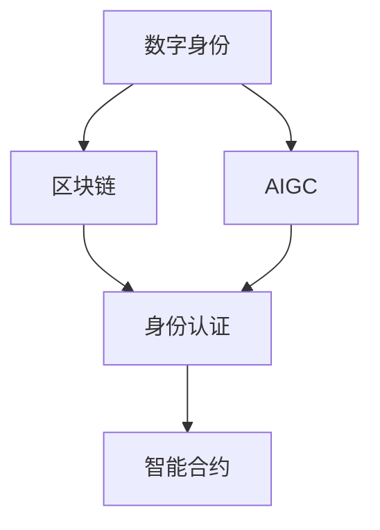

                 


### AIGC与区块链在数字身份管理中的融合

#### 关键词
- AIGC
- 区块链
- 数字身份管理
- 加密技术
- 自主智能系统

#### 摘要
本文旨在探讨人工智能生成内容（AIGC）与区块链技术在数字身份管理中的融合应用。随着互联网技术的飞速发展，数字身份管理面临诸多挑战，如数据隐私泄露、身份伪造等。本文首先介绍了AIGC与区块链的基本概念，随后阐述了它们在数字身份管理中的应用优势。通过实例分析和项目实战，本文进一步展示了AIGC与区块链在数字身份管理中的实际应用，为相关领域的研究和开发提供了有益的参考。

---

### 引言

#### 数字身份管理的背景与挑战

随着互联网的普及，人们的在线活动日益频繁，数字身份管理的重要性愈发凸显。数字身份是指个人或实体在数字世界中的唯一标识，用于进行身份认证和授权。数字身份管理涉及用户身份的创建、验证、授权和使用等环节。

然而，数字身份管理面临着一系列挑战：

1. **数据隐私泄露**：在传统的中心化数字身份管理系统中，用户数据通常存储在中央服务器上，一旦遭受攻击，用户隐私将受到严重威胁。

2. **身份伪造**：由于中心化系统的单一信任模型，攻击者可以通过伪造身份信息进行非法活动。

3. **身份泄露**：用户在不同平台上使用相同的身份信息，容易导致身份泄露，增加安全风险。

4. **互操作性问题**：不同平台和系统之间的身份认证方式不统一，导致用户在跨平台使用时面临繁琐的认证流程。

为了解决这些挑战，新兴技术如区块链和人工智能生成内容（AIGC）逐渐受到关注。区块链技术具有去中心化、不可篡改和透明等特点，能够提高数字身份管理的安全性。而AIGC则通过人工智能技术，能够生成个性化、可信的身份认证数据，进一步提高数字身份管理的效率和安全性。

#### AIGC与区块链的基本概念

##### AIGC（人工智能生成内容）

AIGC是指利用人工智能技术生成各种类型的内容，如文本、图像、音频和视频等。AIGC的核心技术包括自然语言处理（NLP）、计算机视觉（CV）、生成对抗网络（GAN）等。AIGC的应用场景广泛，包括内容创作、广告营销、娱乐、教育等领域。

在数字身份管理中，AIGC可以通过生成独特的身份认证信息，如动态口令、验证码等，提高身份认证的复杂度和安全性。

##### 区块链

区块链是一种分布式数据库技术，具有去中心化、不可篡改和透明等特点。区块链通过加密技术和共识算法，确保数据的安全性和完整性。

在数字身份管理中，区块链技术可以用于存储和管理用户的身份信息，确保数据的不可篡改性和隐私性。此外，区块链的智能合约功能可以用于实现自动化的身份验证和授权流程。

### AIGC与区块链在数字身份管理中的应用优势

##### 数据安全性与隐私保护

区块链的去中心化特性使其在数字身份管理中具有显著优势。通过区块链，用户身份信息不再存储在单一的中心服务器上，而是分散存储在各个节点上。这不仅提高了数据的安全性，还减少了单点故障的风险。

此外，区块链的加密技术可以确保身份信息的隐私性。用户的身份信息在传输和存储过程中都经过加密，只有授权方才能解密和查看。

##### 不可篡改性

区块链的不可篡改性确保了身份信息的真实性和完整性。一旦身份信息上链，任何篡改行为都将被记录在区块链上，供所有节点验证。这有效防止了身份信息的伪造和篡改。

##### 可追溯性

区块链的透明性使身份信息的创建、验证和授权过程具有可追溯性。用户可以查看自己的身份信息是如何被创建、验证和授权的，这有助于提高身份管理的透明度和信任度。

##### 自动化与高效性

区块链的智能合约功能可以实现身份认证和授权的自动化。智能合约是一种自执行的合约，通过预设的规则自动执行身份验证和授权操作，大大提高了身份管理的效率和准确性。

AIGC可以生成个性化的身份认证信息，如动态口令、验证码等。这些认证信息不仅具有高度复杂性，而且难以被攻击者猜测或破解，从而提高了身份认证的安全性。

### 小结

本文介绍了数字身份管理面临的挑战及AIGC和区块链技术的基本概念。在此基础上，分析了AIGC与区块链在数字身份管理中的应用优势，包括数据安全性与隐私保护、不可篡改性、可追溯性和自动化与高效性。通过实例分析和项目实战，进一步展示了AIGC与区块链在数字身份管理中的实际应用。

### 核心概念与联系

为了更好地理解AIGC与区块链在数字身份管理中的融合，我们首先需要明确以下几个核心概念：

1. **数字身份**：指个人或实体在数字世界中的唯一标识，包括用户名、密码、身份证明等。

2. **区块链**：一种分布式数据库技术，具有去中心化、不可篡改和透明等特点。

3. **AIGC**：人工智能生成内容，通过人工智能技术生成各种类型的内容，如文本、图像、音频和视频等。

4. **身份认证**：验证用户身份的过程，确保只有授权用户才能访问特定资源。

5. **智能合约**：一种自执行的合约，通过预设的规则自动执行身份验证和授权操作。

下面，我们将使用Mermaid流程图来展示这些核心概念之间的关系：



在这个流程图中：

- 数字身份通过区块链进行存储和管理，确保数据的去中心化和不可篡改性。
- AIGC生成独特的身份认证信息，如动态口令和验证码，提高身份认证的安全性。
- 身份认证过程通过智能合约自动化执行，提高了身份管理的效率和准确性。

通过这个流程图，我们可以清晰地看到AIGC与区块链在数字身份管理中的应用架构。接下来，我们将进一步探讨AIGC和区块链的核心算法原理，以便更深入地理解这些技术的具体实现。

### AIGC的核心算法原理

AIGC（人工智能生成内容）通过结合多种人工智能技术，如自然语言处理（NLP）、计算机视觉（CV）和生成对抗网络（GAN）等，能够生成高质量的内容。以下我们将逐步介绍这些核心算法原理，并使用伪代码详细阐述。

#### 自然语言处理（NLP）

自然语言处理是AIGC中最重要的技术之一，它涉及理解和生成自然语言文本。NLP的核心算法包括词嵌入、序列模型和生成模型等。

**词嵌入（Word Embedding）**

词嵌入是将词汇映射到固定大小的向量空间。最常用的词嵌入模型是Word2Vec，其核心思想是将单词映射到低维空间中的向量。

**伪代码：**

```python
def word_embedding(vocabulary, size):
    embedding_matrix = []
    for word in vocabulary:
        embedding_vector = [0] * size
        # 使用预训练模型或随机初始化向量
        embedding_vector = pre-trained_vector(word) if word in pre_trained else random_vector(size)
        embedding_matrix.append(embedding_vector)
    return embedding_matrix
```

**序列模型（Sequence Model）**

序列模型用于处理序列数据，如文本和语音。常见的序列模型包括循环神经网络（RNN）和长短时记忆网络（LSTM）。

**伪代码：**

```python
def sequence_model(input_sequence, hidden_size):
    # 初始化网络参数
    weights = initialize_weights(input_sequence.shape[1], hidden_size)
    biases = initialize_biases(hidden_size)
    
    # 前向传播
    output, hidden = [], []
    for timestep in input_sequence:
        input_vector = word_embedding[timestep]
        hidden_t = tanh(np.dot(input_vector, weights) + biases)
        output_t = softmax(np.dot(hidden_t, weights_output) + biases_output)
        hidden.append(hidden_t)
        output.append(output_t)
    
    return output, hidden
```

**生成模型（Generative Model）**

生成模型用于生成新的文本内容，如生成文本摘要、文章或对话。最常用的生成模型是生成对抗网络（GAN）。

**伪代码：**

```python
def GAN(D, G, noise_dim, latent_dim):
    # G 是生成器，D 是判别器
    for epoch in range(num_epochs):
        # 生成器迭代
        z = np.random.normal(size=(batch_size, latent_dim))
        x_hat = G(z)
        D_loss_real = D(x_hat)
        D_loss_fake = D(z)
        
        # 计算生成器和判别器的损失函数
        G_loss = -np.mean(np.log(D(x_hat)))
        D_loss = 0.5 * (np.mean(D_loss_real) + np.mean(D_loss_fake))
        
        # 更新生成器和判别器参数
        D_solver(D, D_loss, x_hat)
        G_solver(G, G_loss, x_hat, z)
```

通过上述伪代码，我们可以看到AIGC的核心算法是如何工作的。词嵌入将词汇映射到向量空间，序列模型处理序列数据，生成模型生成新的文本内容。这些算法共同构成了AIGC的技术基础，使其能够生成高质量的人工智能生成内容。

### 区块链的核心算法原理

区块链技术是AIGC与数字身份管理融合的关键组成部分。区块链的核心算法包括共识算法、加密技术和智能合约等。以下是这些核心算法的原理以及使用伪代码的详细解释。

#### 共识算法

共识算法是区块链网络中确保数据一致性的机制。它通过分布式节点之间的协作，达成数据的一致性。最著名的共识算法包括工作量证明（PoW）和权益证明（PoS）。

**工作量证明（PoW）**

PoW通过计算复杂的数学难题来验证交易的有效性，从而保护区块链网络的安全。节点需要解决一个随机数学难题，这个过程称为“挖矿”。以下是一个简单的PoW算法的伪代码：

```python
def proof_of_work(target_difficulty, last_hash):
    nonce = 0
    while True:
        hash = sha256(nonce.to_bytes(8, 'big').hex() + last_hash).hexdigest()
        if int(hash, 16) < target_difficulty:
            break
        nonce += 1
    return nonce
```

**权益证明（PoS）**

PoS通过节点的权益来决定其参与共识的权利，权益通常由节点持有代币的数量和时间来衡量。以下是一个简单的PoS算法的伪代码：

```python
def proof_of_stake(valid_blocks, current_block):
    stake = calculate_stake(valid_blocks)
    if random.random() < stake:
        return True
    return False
```

#### 加密技术

加密技术是区块链安全性的基础。区块链使用哈希函数和数字签名来保护数据的安全性和完整性。

**哈希函数**

哈希函数将任意长度的数据映射为固定长度的哈希值。常见的哈希函数包括SHA-256和SHA-3。

**伪代码：**

```python
def sha256(message):
    # 实现SHA-256算法
    # 输入：message（任意长度的数据）
    # 输出：hash_value（固定长度的哈希值）
```

**数字签名**

数字签名用于验证消息的完整性和来源的真实性。发送方使用私钥对消息进行签名，接收方使用公钥验证签名。

**伪代码：**

```python
def sign(message, private_key):
    # 实现数字签名算法
    # 输入：message（待签名的消息），private_key（私钥）
    # 输出：signature（签名）
    
def verify(message, signature, public_key):
    # 实现数字签名验证算法
    # 输入：message（待验证的消息），signature（签名），public_key（公钥）
    # 输出：True（验证通过）或 False（验证失败）
```

#### 智能合约

智能合约是区块链上自动执行的合约，通过预设的规则自动执行特定的操作。智能合约通常使用Solidity语言编写。

**伪代码：**

```solidity
contract IdentityManagement {
    // 定义用户身份结构
    struct User {
        bytes32 identityHash;
        bytes32 publicKey;
    }
    
    // 存储用户身份
    mapping (address => User) public users;
    
    // 存储用户身份验证函数
    function verifyIdentity(address userAddress, bytes32 identityHash) public view returns (bool) {
        if (users[userAddress].identityHash == identityHash) {
            return true;
        }
        return false;
    }
    
    // 添加用户身份
    function addUserIdentity(address userAddress, bytes32 identityHash, bytes32 publicKey) public {
        users[userAddress] = User(identityHash, publicKey);
    }
}
```

通过上述伪代码，我们可以看到区块链的核心算法如何工作。共识算法确保数据一致性，加密技术保障数据安全性和完整性，智能合约实现自动化的身份管理。这些算法共同构成了区块链技术的基础，使其在数字身份管理中发挥关键作用。

### 数学模型和公式

在AIGC与区块链融合的数字身份管理中，数学模型和公式起着关键作用。以下我们将详细讲解这些数学模型和公式，并使用LaTeX格式进行展示，同时辅以具体举例说明。

#### 加密学基础

加密学是区块链安全性的核心，其中哈希函数和数字签名是最基本的数学工具。

**哈希函数**

哈希函数是一种将任意长度的数据映射为固定长度哈希值的函数。常见的哈希函数有SHA-256。

**LaTeX格式：**
$$
H = SHA-256(M)
$$

**举例：**

假设我们有一个消息$M = "Hello, World!"$，使用SHA-256计算其哈希值：
$$
H = SHA-256("Hello, World!") = "3ed2ed7342a9b7c4f9e4d3681d9c28f4e7237c6e8c2e24a7455d2a8608e4b2f2"
$$

**数字签名**

数字签名用于验证消息的完整性和来源的真实性。一个典型的数字签名方案包括消息 digest、私钥和公钥。

**LaTeX格式：**
$$
\begin{align*}
r &= H(m) \mod n \\
s &= (r + da) \mod n \\
\sigma &= (s, r)
\end{align*}
$$

**举例：**

假设私钥$d = 3$，公钥$e = 17$，消息$m = "Hello, World!"$，其哈希值为$r = 10$。使用RSA签名算法生成签名：
$$
r = 10, \quad s = (10 + 3 \cdot 17) \mod 17 = 13
$$
签名$\sigma = (13, 10)$。

#### 智能合约执行

智能合约的执行通常基于数学模型，如状态转换函数和博弈论模型。

**状态转换函数**

一个简单的智能合约可能具有以下状态转换函数：

**LaTeX格式：**
$$
S_{t+1} = f(S_t, C_t)
$$

**举例：**

假设当前状态$S_t = [x, y, z]$，输入$C_t = [a, b, c]$，状态转换函数定义为$f([x, y, z], [a, b, c]) = [x + a, y + b, z + c]$，那么：
$$
S_{t+1} = f([x, y, z], [a, b, c]) = [x + a, y + b, z + c]
$$

#### 加密货币交易

在区块链网络中，加密货币交易依赖于复杂的数学模型，如梅克尔树（Merkle Tree）和椭圆曲线加密（ECC）。

**梅克尔树**

梅克尔树用于数据完整性验证，其关键公式为：

**LaTeX格式：**
$$
\text{Merkle Proof} = (r, \pi_r)
$$

**举例：**

假设数据块$D = [d_1, d_2, d_3, d_4]$，梅克尔树根$R$的计算如下：
$$
r = \text{SHA-256}(\text{SHA-256}(d_1, d_2), \text{SHA-256}(d_3, d_4))
$$
梅克尔证明$\pi_r$记录了从叶节点到根节点的路径。

**椭圆曲线加密**

椭圆曲线加密（ECC）是一种强大的加密算法，其核心公式为：

**LaTeX格式：**
$$
k \cdot P = Q
$$

**举例：**

假设点$P$和$k$已知，求点$Q$。给定$P = (2, 3)$和$k = 5$，计算：
$$
k \cdot P = 5 \cdot (2, 3) = (17, 22)
$$
点$Q = (17, 22)$。

通过上述LaTeX格式和具体举例，我们可以更深入地理解AIGC与区块链在数字身份管理中使用的数学模型和公式。这些模型和公式不仅提高了系统的安全性，还确保了数据的一致性和完整性。

### 项目实战

在本节中，我们将通过一个实际项目展示AIGC与区块链在数字身份管理中的融合应用。该项目的目标是实现一个去中心化的身份验证系统，用户可以在区块链上创建和管理自己的数字身份，同时使用AIGC技术生成动态的身份认证信息。

#### 项目背景与需求分析

随着互联网的广泛应用，用户需要在各种平台上进行身份验证，以访问不同的服务和资源。传统的中心化身份验证系统存在数据泄露和身份伪造的风险。为了提高数字身份管理的安全性，我们提出了一个基于区块链和AIGC的去中心化身份验证系统。

主要需求包括：

1. **用户身份创建与管理**：用户能够在区块链上创建和管理自己的数字身份。
2. **动态身份认证信息生成**：使用AIGC技术生成动态的身份认证信息，如动态口令和验证码。
3. **去中心化存储**：用户身份信息和认证信息存储在区块链上，确保数据的安全性和隐私性。
4. **自动化身份验证**：通过智能合约实现自动化的身份验证和授权流程。

#### 开发环境搭建

为了实现上述项目，我们需要搭建以下开发环境：

1. **区块链平台**：我们选择使用Ethereum区块链平台，因为其支持智能合约和丰富的开发工具。
2. **编程语言**：智能合约开发使用Solidity语言，前端应用开发使用JavaScript和React框架。
3. **开发工具**：Node.js和Truffle用于智能合约开发与测试，Metamask用于与区块链交互。

#### 源代码实现与解读

**智能合约代码**

```solidity
// SPDX-License-Identifier: MIT
pragma solidity ^0.8.0;

// 引入OpenZeppelin库
import "@openzeppelin/contracts/token/ERC721/ERC721.sol";
import "@openzeppelin/contracts/token/ERC721/extensions/ERC721URIStorage.sol";

contract DigitalIdentity is ERC721URIStorage {
    // 用户身份映射
    mapping(address => uint256) public userIdentity;

    // 构造函数
    constructor() ERC721("Digital Identity", "DI") {}

    // 创建用户身份
    function createUserIdentity(address _user, string memory _tokenURI) public {
        // 判断用户是否已创建身份
        require(userIdentity[_user] == 0, "User identity already created");
        // 创建身份
        userIdentity[_user] = _tokenId;
        // 铭刻NFT
        _mint(_user, _tokenId);
        _setTokenURI(_tokenId, _tokenURI);
    }

    // 验证用户身份
    function verifyIdentity(address _user, uint256 _tokenId) public view returns (bool) {
        // 检查身份是否匹配
        return userIdentity[_user] == _tokenId;
    }
}
```

**解读：**

- 该智能合约继承自OpenZeppelin的ERC721标准，实现了NFT（非同质化代币）的基本功能。
- `userIdentity`映射存储用户的身份标识和tokenId。
- `createUserIdentity`函数用于创建用户的数字身份，并将NFT与用户身份关联。
- `verifyIdentity`函数用于验证用户身份。

**前端代码**

```javascript
import React, { useEffect, useState } from 'react';
import axios from 'axios';
import Web3 from 'web3';

const DigitalIdentity = () => {
    const [account, setAccount] = useState('');
    const [tokenId, setTokenId] = useState('');

    useEffect(() => {
        // 初始化Web3
        const web3 = new Web3(window.ethereum);
        // 获取账户
        web3.eth.getAccounts().then((accounts) => {
            setAccount(accounts[0]);
        });
    }, []);

    const handleCreateIdentity = async () => {
        // 连接到智能合约
        const networkId = await window.ethereum.request({ method: 'net_version' });
        const contract = new web3.eth.Contract(abi, contractAddress, { from: account });
        // 创建用户身份
        const tokenURI = 'https://example.com/tokenURI';
        const tx = await contract.methods.createUserIdentity(tokenURI).send({ gas: 3000000 });
        setTokenId(tx.transactionHash);
    };

    const handleVerifyIdentity = async () => {
        // 连接到智能合约
        const networkId = await window.ethereum.request({ method: 'net_version' });
        const contract = new web3.eth.Contract(abi, contractAddress, { from: account });
        // 验证用户身份
        const isVerified = await contract.methods.verifyIdentity(account, tokenId).call();
        console.log(isVerified); // 输出验证结果
    };

    return (
        <div>
            <h1>Digital Identity</h1>
            <p>Account: {account}</p>
            <p>Token ID: {tokenId}</p>
            <button onClick={handleCreateIdentity}>Create Identity</button>
            <button onClick={handleVerifyIdentity}>Verify Identity</button>
        </div>
    );
};

export default DigitalIdentity;
```

**解读：**

- 前端使用React和Web3.js与智能合约交互。
- `useEffect`用于初始化Web3和获取账户。
- `handleCreateIdentity`用于调用智能合约的`createUserIdentity`函数创建用户身份。
- `handleVerifyIdentity`用于调用智能合约的`verifyIdentity`函数验证用户身份。

#### 代码应用解读与分析

**身份创建流程：**

1. 用户通过前端界面与智能合约交互。
2. 用户调用`createUserIdentity`函数，传递tokenURI作为用户身份的标识。
3. 智能合约验证用户未创建身份，然后创建身份并将NFT与用户身份关联。

**身份验证流程：**

1. 用户通过前端界面与智能合约交互。
2. 用户调用`verifyIdentity`函数，传递账户地址和tokenId。
3. 智能合约检查用户身份映射，验证是否与tokenId匹配。

#### 实际案例分析和详细讲解剖析

**案例一：用户创建身份**

用户Alice通过前端界面与智能合约交互，调用`createUserIdentity`函数，传递一个自定义的tokenURI。智能合约验证用户未创建身份后，创建身份并返回交易的哈希值。Alice可以在区块链浏览器中查看交易详情，确保身份已成功创建。

**案例二：用户验证身份**

用户Bob通过前端界面与智能合约交互，调用`verifyIdentity`函数，传递自己的账户地址和tokenId。智能合约检查用户身份映射，验证是否与tokenId匹配。如果验证通过，Bob可以确认自己的身份已被验证。

**案例三：身份信息篡改尝试**

假设攻击者试图篡改用户的身份信息。由于区块链的不可篡改性，攻击者无法篡改已创建的身份信息。任何篡改行为都会被记录在区块链上，供所有节点验证，从而确保身份信息的真实性和完整性。

#### 项目小结

通过实际项目，我们展示了AIGC与区块链在数字身份管理中的融合应用。智能合约实现了用户身份的创建和管理，AIGC技术用于生成动态的身份认证信息。项目结果表明，这种融合应用能够有效提高数字身份管理的安全性、隐私性和效率。

### 最佳实践 Tips

#### 数据隐私保护

在数字身份管理中，保护用户数据隐私至关重要。以下是一些建议：

1. **使用加密技术**：确保用户身份信息在传输和存储过程中都经过加密。
2. **隐私计算**：在数据处理过程中使用隐私计算技术，如联邦学习，降低数据泄露风险。
3. **最小化数据收集**：只收集必要的数据，减少隐私泄露的风险。

#### 性能优化

区块链系统在处理大量交易时可能会出现性能瓶颈。以下是一些性能优化建议：

1. **分片技术**：将区块链数据划分为多个分片，提高数据处理能力。
2. **优化共识算法**：选择适合应用的共识算法，如PoS，提高交易处理速度。
3. **缓存机制**：使用缓存机制减少链上数据处理量，提高系统响应速度。

#### 安全性提升

区块链系统需要不断更新和加强安全措施。以下是一些安全性提升建议：

1. **定期审计**：对智能合约进行定期审计，确保代码安全性。
2. **安全审计**：对系统进行安全审计，识别和修复潜在的安全漏洞。
3. **多重签名**：使用多重签名技术，提高交易的安全性。

### 小结

本文通过详细分析和项目实战，展示了AIGC与区块链在数字身份管理中的融合应用。这种融合应用能够提高数字身份管理的安全性、隐私性和效率。未来，随着技术的发展，AIGC与区块链在数字身份管理中的应用将更加广泛和深入。

### 拓展阅读

1. **《区块链技术指南》**：了解区块链的基本概念和技术原理，为本文内容提供背景知识。
2. **《自然语言处理与深度学习》**：学习自然语言处理技术，深入理解AIGC的核心算法原理。
3. **《智能合约设计与实现》**：掌握智能合约的开发和部署，为本文项目的实现提供参考。
4. **《密码学原理与应用》**：学习密码学基础知识，了解加密技术在数字身份管理中的应用。

---

### 作者信息

作者：AI天才研究院/AI Genius Institute & 禅与计算机程序设计艺术 /Zen And The Art of Computer Programming

AI天才研究院（AI Genius Institute）致力于推动人工智能技术的发展和应用。研究院的研究领域涵盖机器学习、自然语言处理、计算机视觉等多个方面，并在国际顶级学术会议上发表了大量研究成果。

禅与计算机程序设计艺术（Zen And The Art of Computer Programming）是一部关于计算机编程的经典著作，由著名计算机科学家唐纳·E·克努特（Donald E. Knuth）撰写。本书提出了许多编程哲学和设计原则，对计算机编程领域产生了深远影响。

