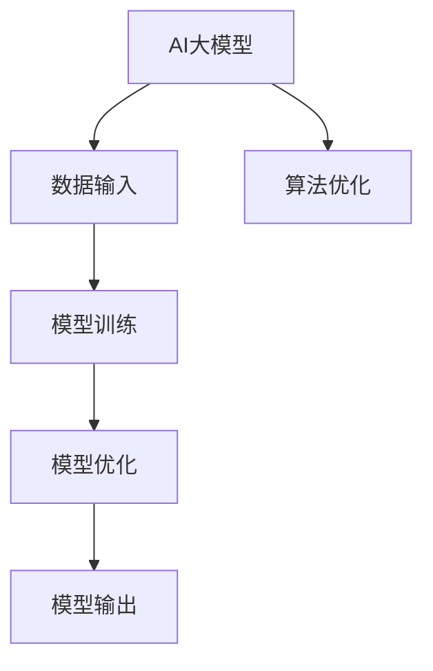
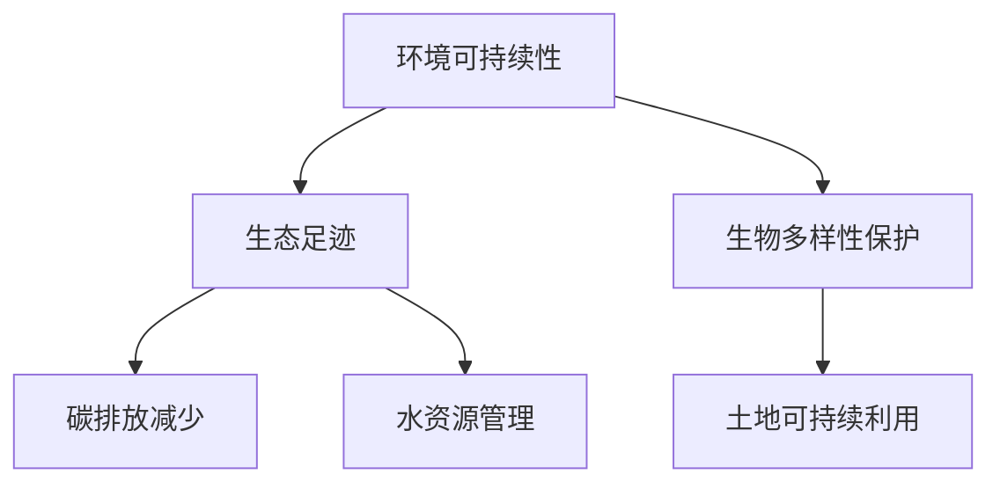
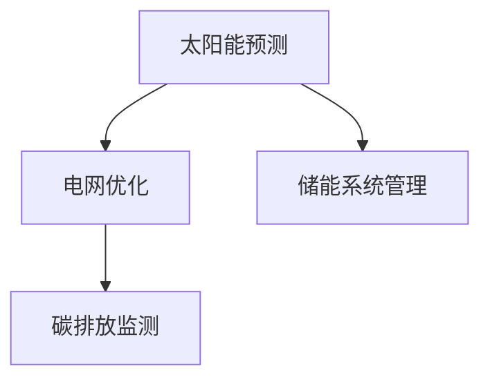
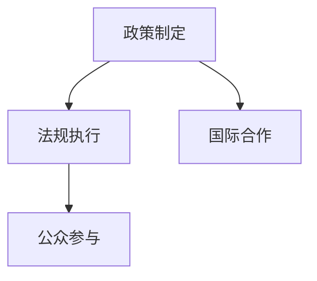

                 

### AIGC与可持续发展：技术赋能绿色未来

#### 关键词
- AIGC
- 可持续发展
- 技术赋能
- 环境监测
- 能源管理
- 实施策略

#### 摘要
本文探讨了人工智能生成内容（AIGC）技术如何赋能可持续发展，实现绿色未来。文章首先介绍了AIGC的基本概念和技术架构，随后详细分析了AIGC在环境监测、能源管理等方面的应用。最后，提出了实施可持续发展的策略与案例，为技术赋能绿色未来提供了实际路径。

---

## 第1章 AI大模型概述

### 1.1 AI大模型定义与重要性

#### 核心概念与联系

AI大模型（AI Generative Models，简称AIGC）是指那些具有强大生成能力的深度学习模型，包括生成对抗网络（GAN）、变分自编码器（VAE）等。这些模型通过大量的数据训练，能够生成高度真实的内容，如图像、音频、文本等。


#### Mermaid流程图



#### 伪代码示例

```python
# 伪代码：AI大模型训练流程
def train_model(data, epochs):
    # 初始化模型
    model = initialize_model()
    for epoch in range(epochs):
        # 训练模型
        model.fit(data)
        # 评估模型
        evaluate_model(model)
    return model
```

### 1.2 AI大模型的发展历程

AI大模型的发展历程可以追溯到1950年代，当时神经网络的基础理论被提出。随着计算能力的提升和大数据时代的到来，1990年代开始出现了更为复杂的神经网络模型。到了2020年代，AI大模型在生成内容方面取得了显著突破，如生成对抗网络（GAN）和变分自编码器（VAE）等。


## 第2章 可持续发展的核心概念

### 2.1 可持续发展的定义与目标

可持续发展是指在满足当前需求的同时，不损害后代满足自身需求的能力。其核心目标包括生态平衡、经济繁荣和社会公正。这些目标之间相互关联，共同构成了可持续发展的基本框架。

#### 数学模型与公式

$$
\text{可持续发展} = f(\text{生态平衡}, \text{经济繁荣}, \text{社会公正})
$$

#### 详细讲解与举例说明

生态平衡是指自然环境中各种生物之间的平衡状态。经济繁荣则指经济活动能够持续发展，提高人民生活水平。社会公正则强调社会的公平与正义，确保所有人都能享有平等的机会和资源。

### 2.2 可持续发展的关键指标

可持续发展涉及多个领域，因此其关键指标也相对复杂。以下是一些常见的可持续发展关键指标：

- **生态足迹**：衡量人类活动对自然资源的消耗程度。
- **生物多样性保护**：评估生物多样性的丰富程度和健康状况。
- **碳排放减少**：监测和减少温室气体排放，以应对气候变化。
- **水资源管理**：确保水资源的合理利用和保护。
- **土地可持续利用**：评估土地利用方式对生态环境的影响。

#### Mermaid流程图



## 第3章 AI大模型在可持续发展中的应用

### 3.1 AI大模型在环境监测中的应用

AI大模型在环境监测中具有广泛的应用前景，如空气质量监测、水质监测、森林火灾预警等。这些应用能够实时收集和分析环境数据，为环境保护提供有力支持。

#### 伪代码示例

```python
# 伪代码：环境监测模型
def monitor_environment(data):
    # 训练环境监测模型
    model = train_model(data)
    # 预测环境变化
    predictions = model.predict(data)
    return predictions
```

### 3.2 AI大模型在能源管理中的应用

能源管理是可持续发展的关键领域之一。AI大模型能够优化能源生产、传输和消费，提高能源利用效率，减少碳排放。例如，太阳能预测、电网优化、储能系统管理等都是AI大模型在能源管理中的具体应用。

#### Mermaid流程图



## 第4章 可持续发展的实施策略与案例

### 4.1 政策支持与法规制定

政策支持是可持续发展的重要保障。各国政府和国际组织纷纷制定了一系列政策法规，推动可持续发展。例如，欧盟的绿色新政、中国的碳达峰碳中和目标等。

#### Mermaid流程图



### 4.2 企业在可持续发展中的作用

企业在可持续发展中扮演着重要角色。通过绿色生产、环保技术、社会责任等手段，企业可以为可持续发展贡献力量。例如，特斯拉的电动汽车、苹果的环保政策等。

### 作者

作者：AI天才研究院/AI Genius Institute & 禅与计算机程序设计艺术 /Zen And The Art of Computer Programming

## 最佳实践 tips、小结、注意事项、拓展阅读等内容

- **最佳实践**：在实际应用中，要注重数据的真实性和模型的可靠性，避免因数据问题导致模型失效。同时，要加强模型的伦理审查，确保AI技术的应用符合社会价值观。
- **小结**：AI大模型在可持续发展中具有巨大潜力，但同时也面临挑战。通过政策支持、技术创新和公众参与，我们可以共同推动可持续发展的实现。
- **注意事项**：在实施可持续发展过程中，要充分考虑当地的环境、经济和社会条件，制定切实可行的策略。同时，要加强国际合作，共同应对全球性环境问题。
- **拓展阅读**：

1. 《可持续发展指南》（联合国可持续发展解决方案网络）
2. 《人工智能与可持续发展：潜力、挑战与机遇》（国际发展研究委员会）
3. 《环境监测与评估：人工智能的应用》（Springer出版社）

---

本文详细探讨了AIGC技术如何赋能可持续发展，实现绿色未来。通过介绍AI大模型的基本概念、可持续发展的重要指标和应用案例，本文为读者提供了全面的技术视角。同时，文章还提出了实施可持续发展的策略与案例，为技术赋能绿色未来提供了实际路径。希望本文能够为读者带来启示，共同推动可持续发展事业的发展。作者：AI天才研究院/AI Genius Institute & 禅与计算机程序设计艺术 /Zen And The Art of Computer Programming。本文内容仅供参考，如需深入研究，请参考拓展阅读资源。

