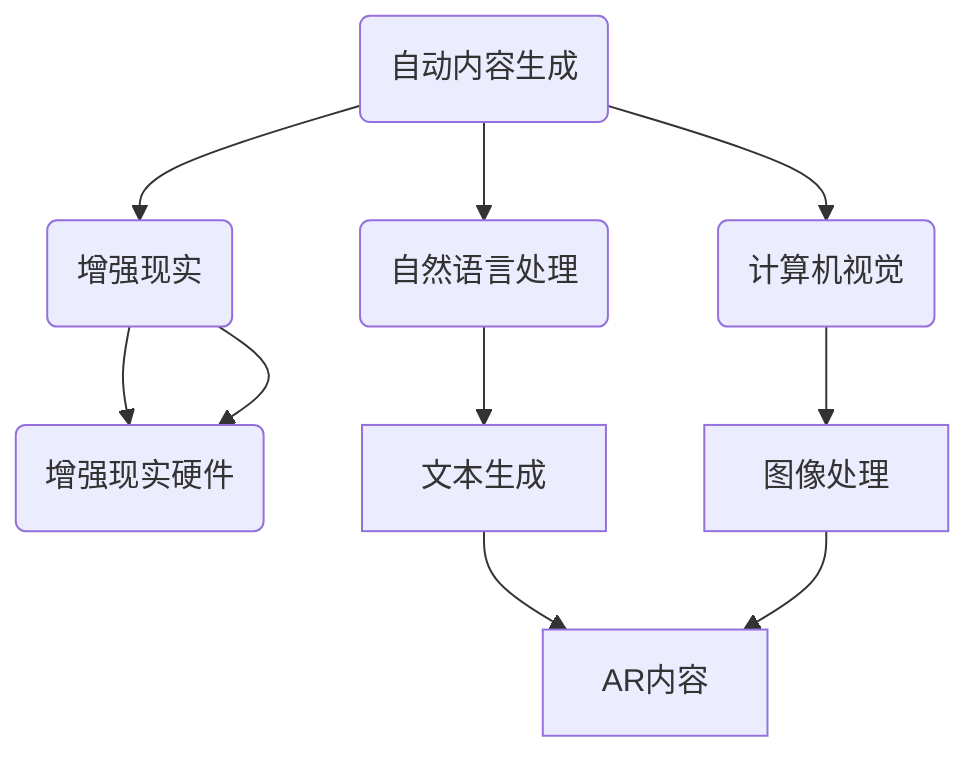
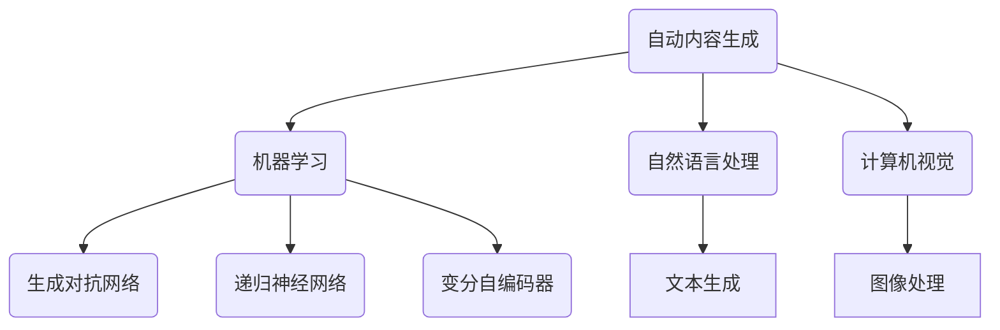
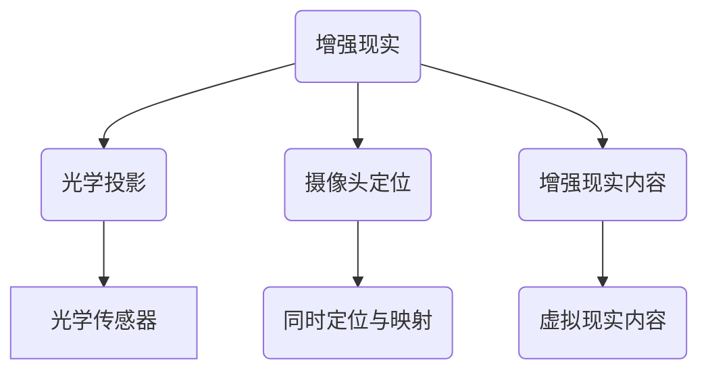
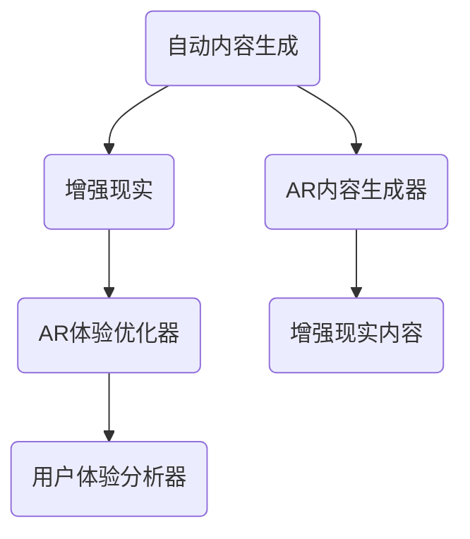
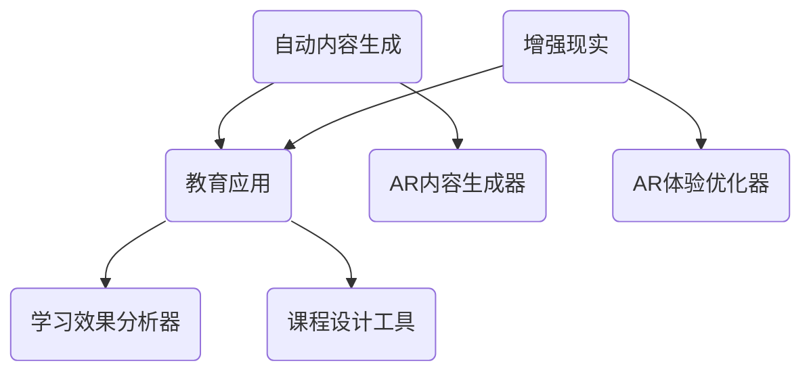
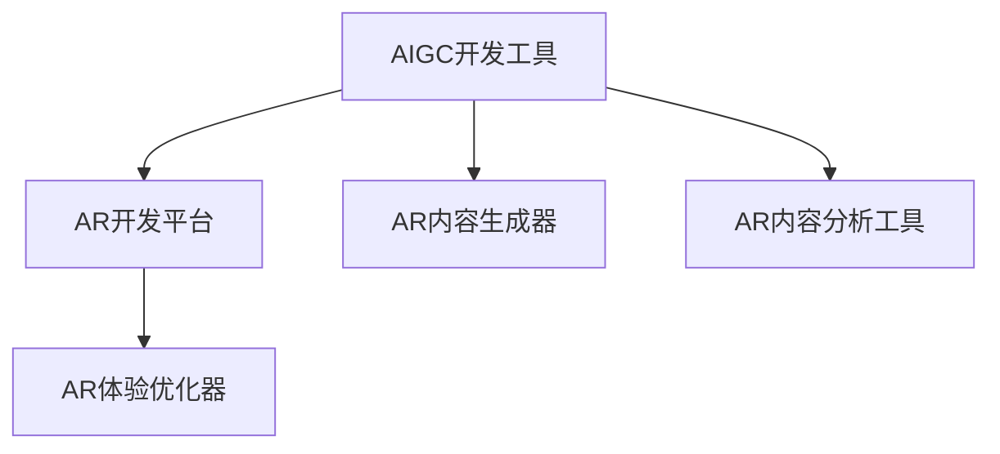
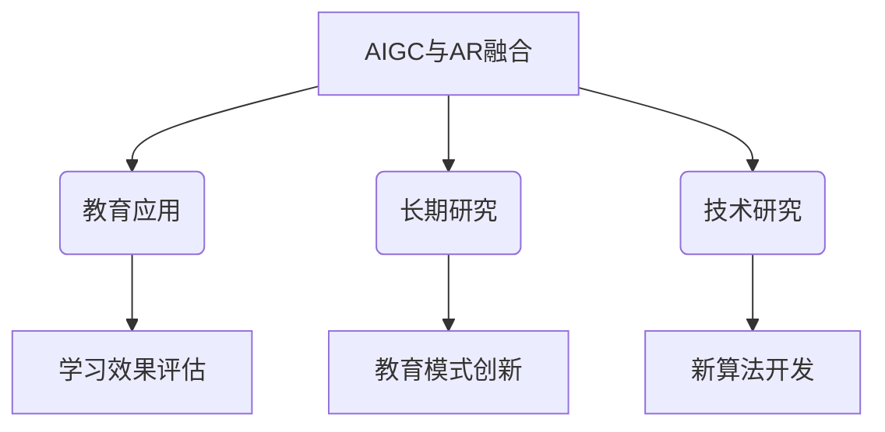

                 


为了撰写一篇深度且逻辑清晰的博客文章《AIGC与增强现实（AR）在教育中的融合》，我们将按照以下步骤进行分析和推理：

### 第一步：引言与概述

**背景介绍**：
- AIGC（AI-Generated Content）是由人工智能技术驱动的自动内容生成技术，可以生成文本、图像、视频等多种形式的内容。
- AR（Augmented Reality）是一种通过叠加虚拟信息到现实场景中的技术，用户可以看到增强后的现实世界。

**核心概念与联系**：
- AIGC和AR都是基于人工智能和计算机视觉的技术，但它们的应用场景和目标不同。
- AIGC侧重于自动生成内容，而AR侧重于增强现实体验。

**Mermaid流程图**：


**核心算法原理讲解**：
- AIGC的核心算法包括生成对抗网络（GAN）、递归神经网络（RNN）和变分自编码器（VAE）。
- 伪代码示例：
  ```python
  # GAN伪代码
  for epoch in 1...num_epochs:
      for data in data_loader:
          z = sample_from_noise_distribution()
          generated_content = generator(z)
          real_content = discriminator(data)
          fake_content = discriminator(generated_content)
          loss_G = loss_function(fake_content, real_content)
          loss_D = loss_function(real_content, fake_content)
          update_generator_and_discriminator(G, D)
  ```

**数学模型和公式**：
- AIGC的数学模型通常涉及优化问题，如最小化生成器和判别器的损失函数。
- 公式示例：
  ```latex
  $$ L_D = -\frac{1}{2} \sum_{x \in X} \left( y(x; D(x)) - \log D(x) \right) - \frac{1}{2} \sum_{z \in Z} \left( 1 - \log D(G(z)) \right) $$
  ```

**举例说明**：
- 例如，使用AIGC生成一本教科书，可以生成包含文本、图表、图片和视频的内容。

### 第二步：AIGC基础知识

**核心概念与联系**：
- AIGC的核心技术包括机器学习、自然语言处理（NLP）和计算机视觉（CV）。

**Mermaid流程图**：


**核心算法原理讲解**：
- GAN：生成器和判别器相互竞争，生成器试图生成逼真的内容，而判别器试图区分生成内容和真实内容。
- RNN：通过循环结构对序列数据进行建模，适用于生成文本和序列数据。
- VAE：通过编码器和解码器学习数据分布，生成新的数据。

**数学模型和公式**：
- GAN的数学模型涉及生成器和判别器的损失函数，如上面提到的。
- RNN的数学模型基于递归关系，如：
  ```latex
  $$ h_t = \sigma(W_h \cdot [h_{t-1}, x_t] + b_h) $$
  $$ o_t = \text{softmax}(W_o \cdot h_t + b_o) $$
  ```

**举例说明**：
- 使用VAE生成图像，可以生成类似于人脸、风景等类型的图像。

### 第三步：AR技术基础

**核心概念与联系**：
- AR的核心技术包括光学投影、摄像头定位和增强现实内容。

**Mermaid流程图**：


**核心算法原理讲解**：
- 光学投影：将虚拟图像映射到现实场景中的技术，通常使用投影仪或光学传感器。
- 摄像头定位：通过摄像头捕捉现实场景，并使用SLAM技术进行实时定位。

**数学模型和公式**：
- SLAM的数学模型涉及概率图模型和贝叶斯推理，如：
  ```latex
  $$ P(x_t, u_t, z_t | x_{0:t-1}) = \prod_{i=1}^{n} P(x_t | x_{t-1}, u_t) P(z_t | x_t) P(u_t)
  ```

**举例说明**：
- 在AR游戏中，使用光学投影将虚拟角色映射到现实场景中，使用摄像头定位跟踪角色的位置。

### 第四步：AIGC与AR的融合

**核心概念与联系**：
- AIGC与AR的融合可以实现自动生成增强现实内容，如AR游戏、教育应用等。

**Mermaid流程图**：


**核心算法原理讲解**：
- AIGC用于生成AR内容，如3D模型、动画等。
- AR体验优化器通过收集用户反馈和使用数据来不断优化AR体验。

**数学模型和公式**：
- 用户反馈分析可能涉及贝叶斯优化模型，如：
  ```latex
  $$ p(\theta | X) = \frac{p(X | \theta) p(\theta)}{p(X)}
  ```

**举例说明**：
- 在一个AR教育应用中，AIGC可以自动生成3D模型来展示复杂的概念，AR体验优化器可以收集用户的学习数据来调整模型的交互方式。

### 第五步：应用案例

**核心概念与联系**：
- AIGC与AR在教育中的应用可以改善教学体验，提高学习效果。

**Mermaid流程图**：


**核心算法原理讲解**：
- AIGC生成互动式教学材料，如虚拟实验、动画等。
- AR体验优化器分析学生的学习行为，优化教学内容。

**数学模型和公式**：
- 学习效果分析可能涉及学习曲线模型，如：
  ```latex
  $$ E(f(x)) = \int_{-\infty}^{\infty} f(x) \phi(x) dx
  ```

**举例说明**：
- 在一个科学教育应用中，学生可以使用AIGC生成的3D模型进行虚拟实验，并通过AR体验优化器来调整模型的参数，以更好地理解实验结果。

### 第六步：开发工具与平台

**核心概念与联系**：
- 开发AIGC与AR应用需要使用特定的工具和平台。

**Mermaid流程图**：


**核心算法原理讲解**：
- 开发工具如TensorFlow、PyTorch等用于AIGC开发。
- AR开发平台如Unity、ARKit等用于AR内容创建和优化。

**举例说明**：
- 使用TensorFlow和Unity开发一个AR教育应用，AIGC用于生成3D模型，ARKit用于AR内容渲染。

### 第七步：未来展望

**核心概念与联系**：
- AIGC与AR在教育中的融合将不断演进，带来新的教学方式和教育模式。

**Mermaid流程图**：


**核心算法原理讲解**：
- 长期研究可能涉及教育数据挖掘和机器学习优化。
- 新算法开发可能涉及生成对抗网络（GAN）的变体和AR技术的创新。

**举例说明**：
- 随着技术的进步，未来可能会出现更智能的AR教育应用，能够根据学生的学习习惯和进度提供个性化的教学内容。

通过上述的逐步分析和推理，我们可以构建出一篇关于AIGC与AR在教育中融合的深度技术博客。接下来，我们将根据这些分析结果，逐步撰写出完整的高质量博客文章。如果需要进一步的细节或调整，请随时告知。

