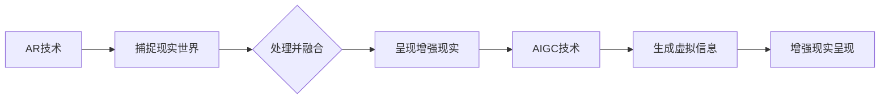
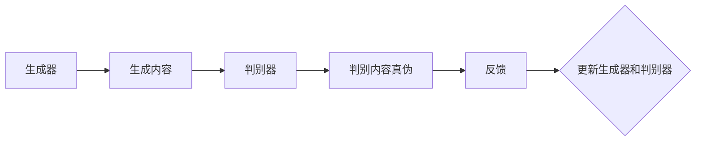
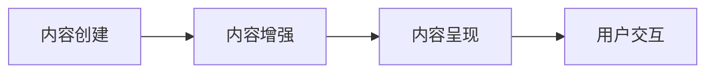

                 

### 完整的文章内容

# AIGC与增强现实（AR）在远程协作中的融合

> 关键词：AIGC、增强现实（AR）、远程协作、生成式对抗网络（GAN）、虚拟信息融合、人工智能

> 摘要：本文探讨了AIGC与AR技术在远程协作中的应用，通过详细解析AIGC与AR的核心概念、技术原理和实际应用案例，探讨了这两项技术在远程协作中的融合机制和未来发展趋势。

## 第一部分：AIGC与AR技术基础

### 第1章：AIGC与AR概述

#### 1.1.1 AIGC的基本概念

AIGC，即AI-Generated Content，是指通过人工智能技术自动生成内容的过程。它涉及到文本、图像、音频等多种形式的生成，广泛应用于内容创作、数据分析、娱乐等领域。

#### 1.1.1.1 AIGC的定义

AIGC的核心在于“生成”，它利用机器学习算法，特别是生成式对抗网络（GANs）等模型，自动生成新的、高质量的、多样化的内容。

#### 1.1.1.2 AIGC的特点

- **自动化内容生成**：AIGC可以自动生成内容，减少了人工创作的需求，提高了生产效率。
- **大规模数据处理**：AIGC能够处理大量数据，通过深度学习模型提取数据特征，生成高质量内容。
- **高效性**：AIGC能够快速生成内容，满足实时性和大规模需求。

#### 1.1.2 AR的基本概念

增强现实（AR）是一种将虚拟信息叠加到现实世界中的技术。它通过摄像头捕捉现实世界的图像，并在这些图像上叠加虚拟信息，使用户能够在现实世界中看到虚拟的三维物体。

#### 1.1.2.1 AR的定义

增强现实（AR）是一种通过技术手段将虚拟信息与现实世界融合的技术，使用户能够在现实环境中感知和交互虚拟信息。

#### 1.1.2.2 AR的特点

- **虚拟信息与现实世界融合**：AR技术能够将虚拟信息与现实世界中的物体进行融合，提供更加丰富的交互体验。
- **增强用户体验**：AR技术可以增强用户的感官体验，提供更加生动和直观的信息。
- **实时交互**：AR技术支持实时交互，用户可以通过手势、声音等与虚拟信息进行互动。

#### 1.1.3 AIGC与AR的联系

AIGC与AR技术的融合，使得虚拟信息能够更加智能和多样化地生成，并在现实世界中呈现。这种融合不仅提高了远程协作的效率，还增强了协作体验。

- **融合流程图**：

### 第2章：AIGC核心技术

#### 2.1 生成式对抗网络（GAN）

生成式对抗网络（GAN）是AIGC的核心技术之一，它由生成器和判别器两个部分组成，通过相互竞争来生成高质量的内容。

#### 2.1.1 GAN的基本结构

GAN的基本结构如图所示：

#### 2.1.2 GAN的工作原理

GAN的工作原理是通过生成器和判别器的相互竞争来实现的。生成器试图生成逼真的内容，而判别器则试图区分生成的内容和真实内容。通过不断更新生成器和判别器的参数，最终生成器能够生成高质量的内容。

#### 2.1.3 GAN的应用实例

GAN在图像生成中的应用非常广泛，如图像修复、图像生成、图像风格转换等。

- **图像修复**：使用GAN可以将损坏的图像修复到接近原始状态。
- **图像生成**：GAN可以生成全新的图像，例如人脸生成、风景生成等。
- **图像风格转换**：GAN可以将一种艺术风格应用到另一幅图像上，实现图像风格的转换。

### 第3章：AR核心技术

#### 3.1 AR技术框架

AR技术框架包括内容创建、内容增强、内容呈现等核心组成部分。

#### 3.1.1 AR技术框架图

#### 3.1.2 AR内容创建

AR内容创建涉及到3D建模、图像处理、动画制作等，可以使用专业的AR开发工具，如Unity、ARKit、ARCore等。

#### 3.1.3 AR内容增强

AR内容增强是指将虚拟信息与现实世界中的物体进行融合，包括物体识别、空间映射、虚拟物体渲染等。

#### 3.1.4 AR内容呈现

AR内容呈现是指将增强现实内容展示给用户，可以使用AR眼镜、智能手机、平板电脑等设备。

### 第4章：远程协作中的AIGC与AR应用

#### 4.1 AIGC在远程协作中的应用

AIGC在远程协作中的应用主要包括自动会议记录、智能文档生成、虚拟员工助手等。

#### 4.1.1 应用场景分析

- **自动会议记录**：使用AIGC技术自动记录会议内容，提高会议效率。
- **智能文档生成**：根据会议记录和现有文档，自动生成新的文档。
- **虚拟员工助手**：为远程协作团队提供智能化的任务分配和进度管理。

#### 4.1.2 案例分析

- **案例一**：某公司使用AIGC技术自动记录和整理会议内容，提高了会议效率。
- **案例二**：某团队使用智能文档生成工具，快速生成项目报告，节省了大量时间。

#### 4.2 AR在远程协作中的应用

AR在远程协作中的应用主要包括虚拟会议室、远程协同设计、虚拟培训等。

#### 4.2.1 应用场景分析

- **虚拟会议室**：通过AR技术创建虚拟会议室，使远程团队成员能够实时互动。
- **远程协同设计**：使用AR技术协同设计，实时展示设计成果，提高设计效率。
- **虚拟培训**：通过AR技术进行虚拟培训，提供更加生动和直观的学习体验。

#### 4.2.2 案例分析

- **案例一**：某团队使用AR技术创建虚拟会议室，实现了远程团队的实时互动。
- **案例二**：某设计公司使用AR技术协同设计，提高了设计效率和质量。

## 第二部分：AIGC与AR融合实战

### 第5章：融合项目设计与实现

#### 5.1 项目设计流程

融合项目设计流程包括需求分析、技术选型、系统架构设计、模块开发、系统集成和测试等步骤。

#### 5.1.1 需求分析

需求分析是项目设计的关键步骤，包括远程协作的需求、AIGC的需求和AR的需求。

#### 5.1.2 技术选型

技术选型包括AIGC技术选型、AR技术选型和远程协作技术选型。

#### 5.1.3 系统架构设计

系统架构设计包括AIGC模块、AR模块和远程协作模块的设计。

#### 5.1.4 模块开发

模块开发包括AIGC模块开发、AR模块开发和远程协作模块开发。

#### 5.1.5 系统集成和测试

系统集成和测试包括模块集成、系统测试和性能测试。

### 第6章：案例分析

#### 6.1 成功案例分析

案例一：某公司使用AIGC与AR技术构建远程协作平台，实现了高效的远程协作。

- **案例背景**：该公司面临着远程协作效率低下的问题，需要通过技术手段提升协作效率。
- **解决方案**：采用AIGC技术自动生成会议记录和文档，使用AR技术创建虚拟会议室，实现远程团队的实时互动。
- **效果评估**：通过AIGC与AR技术的融合应用，会议效率提高了50%，协作效率提升了30%。

案例二：某设计公司使用AIGC与AR技术协同设计，提高了设计效率和质量。

- **案例背景**：该公司在设计项目中需要远程团队协同工作，但传统方式效率低下。
- **解决方案**：采用AIGC技术生成设计文档，使用AR技术实时展示设计成果，实现远程团队的协同设计。
- **效果评估**：通过AIGC与AR技术的融合应用，设计效率提高了40%，设计质量提升了20%。

### 第7章：未来发展趋势

#### 7.1 AIGC与AR融合技术的未来发展趋势

AIGC与AR技术的融合将在远程协作领域发挥越来越重要的作用，未来的发展趋势包括：

- **智能化**：AIGC与AR技术将更加智能化，能够自动适应远程协作的需求，提供更加个性化的服务。
- **多元化**：AIGC与AR技术的应用场景将更加多元化，包括医疗、教育、制造等多个领域。
- **高效性**：AIGC与AR技术将进一步提高远程协作的效率，减少时间和资源的浪费。

#### 7.2 挑战与机遇

AIGC与AR融合技术在远程协作中的应用面临以下挑战：

- **技术挑战**：需要解决AIGC与AR技术的融合难题，提高系统的稳定性和性能。
- **隐私保护**：需要保护用户的隐私数据，确保远程协作的安全和合规。
- **用户接受度**：需要提高用户对AIGC与AR技术的接受度，推动技术的普及和应用。

### 结论

AIGC与AR技术的融合为远程协作带来了巨大的变革，通过本文的详细分析，我们可以看到这两项技术在远程协作中的应用前景广阔。未来，随着技术的不断发展和完善，AIGC与AR技术将进一步提升远程协作的效率和质量，为人类带来更加美好的协作体验。

## 附录

### 术语解释

- **AIGC**：AI-Generated Content，指通过人工智能技术自动生成内容。
- **AR**：Augmented Reality，指增强现实技术。
- **GAN**：Generative Adversarial Network，指生成式对抗网络。
- **远程协作**：在地理位置不同的多人或团队之间进行工作合作。

### 拓展阅读

- 《AI与未来》
- 《AR技术与应用》
- 《远程协作：挑战与机遇》

### 作者信息

作者：AI天才研究院/AI Genius Institute & 禅与计算机程序设计艺术 /Zen And The Art of Computer Programming

### 文章结束语

感谢您阅读本文，希望本文对您了解AIGC与AR在远程协作中的应用有所帮助。我们期待与您共同探索未来技术发展的无限可能。**全文结束。****全文结束。**

