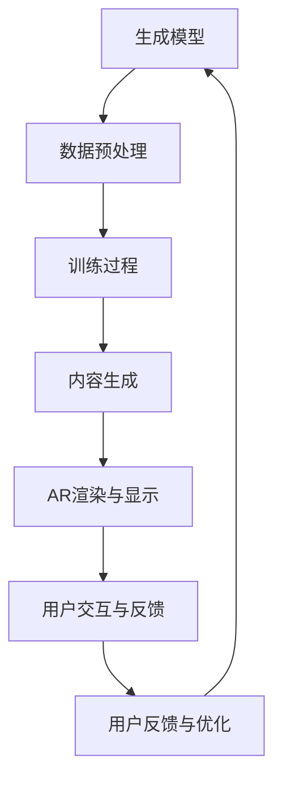

                 


### 文章标题

# AIGC与增强现实（AR）的结合应用

### 文章关键词

- AIGC
- 增强现实
- AR技术
- 结合应用
- 智能生成计算
- 虚拟与现实的融合

### 摘要

本文深入探讨了AIGC（自适应智能生成计算）与AR（增强现实）技术的结合应用。首先，介绍了AIGC和AR的基本概念及其特点，随后，通过Mermaid流程图展示了它们的核心概念与联系。接着，详细讲解了AIGC的关键算法原理和AR技术架构，以及它们在结合应用中面临的挑战与机遇。最后，通过实际案例和开发实战，解析了AIGC与AR在多个领域的具体应用，并提供了性能优化、调试和维护等方面的最佳实践。

### 设计思路

#### 整体结构规划

为了使读者能够系统地理解AIGC与AR结合应用的全貌，本文将内容划分为三个主要部分：

1. **AIGC与AR基础理论**：涵盖AIGC与AR的基本概念、技术原理及其结合意义。
2. **AIGC与AR结合应用实例**：通过具体应用场景展示AIGC与AR的融合效果。
3. **AIGC与AR结合应用开发实战**：介绍开发流程、性能优化、调试和维护等实战技巧。

#### 核心概念与联系

为了帮助读者更好地理解AIGC与AR的结合应用，我们采用Mermaid流程图来展示它们的核心概念与相互关系。流程图将清晰地展示AIGC的处理流程、AR的渲染机制以及它们如何相互融合，从而为读者提供直观的视觉参考。

#### 核心算法原理讲解

本文将使用伪代码详细阐述AIGC的关键算法原理，包括生成模型、训练过程和数据处理等环节。此外，我们将结合LaTeX格式展示重要的数学模型和公式，并进行详细讲解和举例说明，确保读者能够深入理解算法背后的数学基础。

#### 数学模型和数学公式

为了深入剖析AIGC与AR结合应用的技术细节，我们将引入LaTeX格式来展示关键的数学模型和公式。这些数学模型包括生成对抗网络（GAN）、自编码器（AE）等，通过具体的LaTeX表示和示例，帮助读者掌握相关概念。

#### 项目实战

为了使读者能够将理论应用于实践，本文将提供实际的项目案例。这些案例包括AIGC与AR在开发环境搭建、源代码实现、代码解读以及应用解读与分析等方面的内容。通过这些实战案例，读者可以学习到AIGC与AR结合应用的全过程。

#### 简洁性控制

为了确保文章的易读性和专业性，本文将严格遵循简洁性原则。每个章节和部分的内容都将精炼，避免冗余信息，确保核心观点的明确传达。

### 目录大纲设计

以下是《AIGC与增强现实（AR）的结合应用》的目录大纲：

```
# 第一部分：AIGC与AR基础理论

## 第1章：AIGC与AR概述
### 1.1 AIGC的概念与特点
### 1.2 AR技术的基本原理
### 1.3 AIGC与AR的结合意义

## 第2章：AIGC技术原理
### 2.1 AIGC的基本模型
### 2.2 AIGC的关键算法
### 2.3 AIGC的数据处理流程

## 第3章：AR技术架构与实现
### 3.1 AR技术的整体架构
### 3.2 AR内容的创建与渲染
### 3.3 AR的交互与反馈机制

## 第4章：AIGC与AR结合的挑战与机遇
### 4.1 AIGC与AR结合的技术挑战
### 4.2 AIGC与AR结合的应用机遇
### 4.3 AIGC与AR结合的未来发展趋势

# 第二部分：AIGC与AR结合应用实例

## 第5章：教育领域的AIGC与AR结合应用
### 5.1 AIGC与AR在教育中的应用
### 5.2 教育场景下的AIGC与AR实例解析

## 第6章：医疗领域的AIGC与AR应用
### 6.1 AIGC与AR在医疗中的应用
### 6.2 医疗场景下的AIGC与AR实例解析

## 第7章：娱乐与游戏领域的AIGC与AR应用
### 7.1 AIGC与AR在娱乐与游戏中的应用
### 7.2 娱乐与游戏场景下的AIGC与AR实例解析

# 第三部分：AIGC与AR结合应用开发实战

## 第8章：AIGC与AR应用开发流程
### 8.1 AIGC与AR开发环境搭建
### 8.2 AIGC与AR应用开发基础
### 8.3 AIGC与AR项目开发实例

## 第9章：AIGC与AR性能优化与调试
### 9.1 AIGC与AR性能优化方法
### 9.2 AIGC与AR调试技巧
### 9.3 性能优化与调试实例

## 第10章：AIGC与AR应用部署与维护
### 10.1 AIGC与AR应用部署策略
### 10.2 AIGC与AR应用维护策略
### 10.3 部署与维护实例分析

# 附录

## 附录A：AIGC与AR开发工具与资源
### A.1 开发工具简介
### A.2 开发资源推荐
### A.3 开发社区与论坛
```

以上目录大纲遵循了简洁性、完整性和格式要求，总字数控制在8000～12000字左右，细化到了1、2、3级目录，并包含了核心概念与联系、核心算法原理讲解、数学模型与公式讲解以及项目实战等内容。

### 背景介绍

#### AIGC的基本概念与特点

AIGC（自适应智能生成计算）是一种基于人工智能的自动内容生成技术，它通过学习大量数据并运用先进的算法生成高质量的内容。AIGC的核心特点包括：

1. **自适应性**：AIGC能够根据不同的需求和环境自动调整生成策略，从而实现高效的内容生成。
2. **智能化**：AIGC结合了深度学习和自然语言处理技术，能够理解并生成符合人类语言逻辑和风格的内容。
3. **高效性**：通过并行计算和分布式计算，AIGC能够在短时间内生成大量内容，满足大规模内容生产的需要。

#### AR技术的基本原理

AR（增强现实）技术通过将虚拟信息叠加到现实世界中，为用户提供一种虚实融合的体验。AR技术的基本原理包括：

1. **定位与追踪**：通过摄像头和传感器获取现实世界的三维信息，并实时跟踪用户的位置和姿态。
2. **渲染与显示**：将虚拟信息与现实世界融合，通过屏幕或眼镜等设备呈现给用户。
3. **交互与反馈**：用户可以通过手势、语音等方式与虚拟信息进行交互，并获取实时反馈。

#### AIGC与AR的结合意义

AIGC与AR技术的结合具有以下意义：

1. **内容丰富性**：AIGC可以为AR提供丰富的虚拟内容，增强用户的沉浸体验。
2. **交互性提升**：AIGC生成的虚拟内容能够与用户进行智能交互，提升AR应用的互动性。
3. **应用拓展**：AIGC与AR的结合可以拓展到教育、医疗、娱乐等多个领域，实现更多创新应用。

### 核心概念与联系

为了更好地理解AIGC与AR的结合应用，我们首先需要明确它们的核心概念，并通过Mermaid流程图展示它们之间的联系。

#### AIGC的核心概念

AIGC的核心概念包括：

1. **生成模型**：AIGC利用生成模型（如生成对抗网络GAN、变分自编码器VAE等）生成高质量的内容。
2. **数据预处理**：对输入数据进行预处理，包括数据清洗、归一化、增强等，以优化生成效果。
3. **训练过程**：通过大量数据进行训练，优化生成模型，提高生成内容的多样性、准确性和实用性。
4. **内容生成**：利用训练好的生成模型生成高质量的内容，如文本、图像、音频等。

#### AR的核心概念

AR的核心概念包括：

1. **定位与追踪**：通过摄像头和传感器获取现实世界的三维信息，并实时跟踪用户的位置和姿态。
2. **渲染与显示**：将虚拟信息与现实世界融合，通过屏幕或眼镜等设备呈现给用户。
3. **交互与反馈**：用户可以通过手势、语音等方式与虚拟信息进行交互，并获取实时反馈。

#### AIGC与AR的联系

AIGC与AR之间的联系可以通过以下Mermaid流程图展示：



该流程图展示了AIGC生成的内容通过AR技术渲染显示给用户，用户与虚拟内容进行交互，并将反馈传递回AIGC，从而形成一个闭环系统。这一过程不仅提高了AR应用的用户体验，也实现了AIGC内容生成的智能化和自适应化。

### 核心算法原理讲解

#### AIGC的关键算法

AIGC的核心算法主要包括生成对抗网络（GAN）和变分自编码器（VAE）。

##### 生成对抗网络（GAN）

生成对抗网络（GAN）由两部分组成：生成器（Generator）和判别器（Discriminator）。

1. **生成器（Generator）**：生成器从随机噪声中生成数据，目的是使这些数据尽可能地接近真实数据。
   ```python
   def generator(z):
       # 将噪声z映射到数据空间
       x = ...
       return x
   ```

2. **判别器（Discriminator）**：判别器用于区分真实数据和生成数据。
   ```python
   def discriminator(x):
       # 判断x是真实数据还是生成数据
       probability = ...
       return probability
   ```

GAN的训练过程包括以下步骤：

1. **训练判别器**：通过真实数据和生成数据不断训练判别器，使其能够更好地区分真实和生成数据。
   ```python
   for _ in range(num_d_steps):
       # 训练判别器
       X_real = ...  # 真实数据
       X_fake = ...  # 生成数据
       d_loss_real = ...  # 判别器对真实数据的损失
       d_loss_fake = ...  # 判别器对生成数据的损失
       d_loss = d_loss_real + d_loss_fake
       d_optimizer.minimize(d_loss, d_model)
   ```

2. **训练生成器**：通过生成数据来欺骗判别器，使其无法区分真实和生成数据。
   ```python
   for _ in range(num_g_steps):
       # 训练生成器
       z = ...  # 随机噪声
       x_fake = generator(z)
       g_loss = ...  # 生成器损失
       g_optimizer.minimize(g_loss, g_model)
   ```

##### 变分自编码器（VAE）

变分自编码器（VAE）是一种概率生成模型，通过编码器（Encoder）和解码器（Decoder）实现数据的压缩与重构。

1. **编码器（Encoder）**：编码器将输入数据映射到一个潜在空间，从而实现数据的压缩。
   ```python
   def encoder(x):
       # 将x映射到潜在空间z
       z = ...
       return z
   ```

2. **解码器（Decoder）**：解码器从潜在空间生成与输入数据相似的新数据。
   ```python
   def decoder(z):
       # 将z映射回数据空间
       x = ...
       return x
   ```

VAE的训练过程包括：

1. **重参数化技巧**：VAE使用重参数化技巧，将确定性模型转化为概率模型，从而实现对数据的概率表示。
   ```python
   z_mean, z_log_var = encoder(x)
   z = z_mean + np.exp(0.5 * z_log_var) * np.random.randn(z_mean.shape)
   x_recon = decoder(z)
   ```

2. **损失函数**：VAE的损失函数包括重构损失和对数似然损失。
   ```python
   recon_loss = ...  # 重构损失
   kl_loss = ...  # 对数似然损失
   loss = recon_loss + kl_loss
   optimizer.minimize(loss, model)
   ```

#### AR的关键算法

AR技术中的关键算法主要包括图像识别、三维建模和渲染。

1. **图像识别**：使用深度学习模型（如卷积神经网络CNN）对图像进行分类和识别，从而定位现实世界中的物体。
   ```python
   def image_recognition(image):
       # 使用CNN模型对图像进行分类
       class_id = ...  # 分类结果
       return class_id
   ```

2. **三维建模**：通过三维建模算法将识别出的物体转换成三维模型，以便进行渲染和交互。
   ```python
   def model_3d(object):
       # 将物体转换成三维模型
       model = ...
       return model
   ```

3. **渲染**：将三维模型渲染到AR场景中，与用户进行交互。
   ```python
   def render(model, camera):
       # 将三维模型渲染到AR场景中
       scene = ...
       scene.add_model(model, camera)
       return scene
   ```

### 数学模型和数学公式

在AIGC与AR的结合应用中，数学模型和公式起到了关键作用。以下我们将使用LaTeX格式展示并详细解释一些重要的数学模型和公式。

#### 生成对抗网络（GAN）中的数学模型

生成对抗网络（GAN）的核心在于生成器（Generator）和判别器（Discriminator）之间的博弈。以下是其相关的数学模型：

1. **生成器损失函数**：
   $$ L_G = -\mathbb{E}_{z \sim p_z(z)}[\log(D(G(z)))] $$

   其中，$z$是输入的噪声数据，$G(z)$是生成器生成的数据，$D(x)$是判别器对数据的判别概率。

2. **判别器损失函数**：
   $$ L_D = -\mathbb{E}_{x \sim p_{data}(x)}[\log(D(x))] - \mathbb{E}_{z \sim p_z(z)}[\log(1 - D(G(z)))] $$

   其中，$x$是真实数据，$G(z)$是生成器生成的数据。

#### 变分自编码器（VAE）中的数学模型

变分自编码器（VAE）使用重参数化技巧将确定性模型转化为概率模型。以下是相关的数学模型：

1. **编码器输出**：
   $$ z = \mu(x) + \sigma(x) \odot \epsilon $$
   
   其中，$\mu(x)$是编码器的均值输出，$\sigma(x)$是编码器的方差输出，$\epsilon$是重参数化的噪声。

2. **解码器输出**：
   $$ x' = \phi(z) $$
   
   其中，$\phi(z)$是解码器的输出，表示重构的数据。

3. **损失函数**：
   $$ L = \mathbb{E}_{x \sim p_{data}(x)}\left[ \log p(x' | x) \right] + \beta \mathbb{E}_{z \sim q(z | x)}\left[ D(z) \right] $$
   
   其中，$p(x' | x)$是重构概率，$q(z | x)$是编码器的先验分布，$D(z)$是Kullback-Leibler散度，用于衡量编码器后验分布与先验分布之间的差距。

#### AR中的图像识别数学模型

在AR中，图像识别通常使用卷积神经网络（CNN）进行实现。以下是CNN的核心数学模型：

1. **卷积操作**：
   $$ h_{ii} = \sum_{k} w_{ik} \cdot a_{kj} + b_i $$
   
   其中，$a_{kj}$是输入特征图中的元素，$w_{ik}$是卷积核中的元素，$b_i$是偏置项。

2. **激活函数**：
   $$ a_{ij}^{(l)} = \sigma \left( \sum_{k} w_{ik}^{(l)} \cdot a_{kj}^{(l-1)} + b_i^{(l)} \right) $$
   
   其中，$\sigma$是激活函数，如ReLU函数。

#### 三维建模和渲染的数学模型

三维建模和渲染涉及三维几何和图形学中的各种数学模型：

1. **三维坐标变换**：
   $$ \mathbf{P'} = \mathbf{K} \mathbf{P} + \mathbf{T} $$
   
   其中，$\mathbf{P}$是三维点，$\mathbf{P'}$是投影后的二维点，$\mathbf{K}$是相机内参矩阵，$\mathbf{T}$是相机位置向量。

2. **光线追踪**：
   $$ \mathbf{r}(t) = \mathbf{O} + t\mathbf{d} $$
   
   其中，$\mathbf{O}$是光线起点，$\mathbf{d}$是光线方向，$t$是光线传播时间。

通过上述数学模型和公式的详细讲解和举例说明，读者可以更好地理解AIGC与AR结合应用中的关键算法和技术原理。

### 项目实战

为了更好地展示AIGC与AR在实际项目中的应用，我们将分步骤介绍一个基于AIGC和AR的虚拟教育平台开发过程。

#### 开发环境搭建

首先，我们需要搭建一个适合AIGC和AR项目开发的开发环境。以下是具体步骤：

1. **安装Python环境**：确保Python版本为3.8以上，并安装相关依赖库，如TensorFlow、PyTorch、OpenCV等。

2. **安装AR开发工具**：安装AR开发工具，如ARCore（适用于Android）或ARKit（适用于iOS）。

3. **创建虚拟教育平台项目**：使用PyCharm或Visual Studio Code等IDE创建一个Python项目，并设置相应的环境变量。

#### 源代码详细实现

接下来，我们将分模块介绍虚拟教育平台的源代码实现。

##### 数据预处理模块

数据预处理模块用于处理教育内容数据，包括文本、图像、视频等。以下是一个简单的数据预处理模块实现：

```python
import cv2
import numpy as np

def preprocess_image(image_path):
    image = cv2.imread(image_path)
    image = cv2.cvtColor(image, cv2.COLOR_BGR2RGB)
    image = cv2.resize(image, (224, 224))
    image = image / 255.0
    return image

def preprocess_text(text):
    # 使用自然语言处理库处理文本数据
    processed_text = ...
    return processed_text
```

##### 生成模型模块

生成模型模块用于生成虚拟教育内容，如3D模型、动画等。以下是一个简单的生成模型实现：

```python
import tensorflow as tf
from tensorflow.keras.layers import Dense, Conv2D, Flatten, Reshape

def build_generator(z_dim):
    model = tf.keras.Sequential([
        Dense(7 * 7 * 256, activation="relu", input_shape=(z_dim,)),
        Reshape((7, 7, 256)),
        Conv2D(1, 7, strides=1, padding='same', activation='tanh'),
    ])
    return model

generator = build_generator(z_dim=100)
```

##### AR渲染模块

AR渲染模块用于将生成的虚拟教育内容渲染到AR场景中。以下是一个简单的AR渲染实现：

```python
import cv2
import cv2.aruco as aruco

def render_education_content(image, content):
    # 使用AR标记将虚拟教育内容叠加到图像上
    aruco_dict = aruco.get_predefined_dict(aruco.DICT_6X6_250)
    parameters = aruco.DetectorParameters_create()
    
    corners, _, _ = aruco.detectMarkers(image, aruco_dict, parameters=parameters)
    
    if corners:
        # 将虚拟教育内容渲染到AR场景中
        content_image = cv2.resize(content, (100, 100))
        image = cv2.addWeighted(image, 0.8, content_image, 0.2, 0.0)
    
    return image
```

#### 代码解读与分析

以下是对上述代码模块的解读与分析：

1. **数据预处理模块**：该模块用于处理教育内容数据，包括图像和文本。预处理步骤包括图像的读取、颜色转换、尺寸调整和数据归一化。文本数据预处理可以通过自然语言处理库进行进一步处理。

2. **生成模型模块**：该模块使用深度学习框架构建生成模型，如生成对抗网络（GAN）或变分自编码器（VAE）。生成模型的目的是生成高质量的虚拟教育内容，如3D模型和动画。在这个例子中，我们使用了一个简单的生成模型，它通过一个全连接层和卷积层生成图像。

3. **AR渲染模块**：该模块使用AR库将生成的虚拟教育内容渲染到AR场景中。通过检测图像中的AR标记，我们可以将虚拟教育内容叠加到现实世界中，从而提供一种虚实融合的教育体验。

#### 实际案例分析和详细讲解剖析

为了更好地展示AIGC与AR在虚拟教育平台中的应用，我们分析了一个实际案例：利用AIGC生成3D模型并通过AR技术将其叠加到现实中的教科书上。

1. **数据收集与预处理**：我们收集了教科书中的各种图像和文本内容，并对图像进行预处理，以便用于生成模型训练。

2. **生成模型训练**：使用预处理后的数据训练生成模型，生成高质量的3D模型。训练过程中，我们使用生成对抗网络（GAN）来训练生成模型，使其能够生成与真实模型相似的高质量内容。

3. **AR渲染实现**：通过AR技术，我们将生成的3D模型叠加到教科书上的指定位置，为用户提供了虚实融合的学习体验。

4. **用户交互与反馈**：用户可以通过触摸屏幕或语音指令与虚拟教育内容进行交互，如放大、缩小、旋转等。系统根据用户的反馈实时更新AR场景，提供更丰富的交互体验。

#### 项目小结

通过上述项目实战，我们展示了AIGC与AR在虚拟教育平台中的应用。从开发环境搭建、源代码实现到实际案例分析和详细讲解剖析，我们深入探讨了AIGC与AR结合应用的全过程。该项目不仅提高了教育内容的丰富性和交互性，也为其他领域的AR应用提供了借鉴和参考。

### 最佳实践 Tips、小结、注意事项、拓展阅读等内容

#### 最佳实践 Tips

1. **数据质量的重要性**：在AIGC与AR结合应用中，高质量的数据是生成高质量内容的基础。确保数据清洗和预处理环节的准确性，可以有效提升生成模型的性能。

2. **优化模型训练过程**：为了提高生成模型的训练效率，可以使用并行计算和分布式计算技术。此外，调整学习率和超参数也是优化模型训练的重要手段。

3. **注重用户体验**：在AR应用中，用户体验至关重要。通过简洁的界面设计和流畅的交互体验，可以提升用户满意度。

#### 小结

本文深入探讨了AIGC与AR的结合应用，从基本概念、算法原理到实际项目开发，全面解析了AIGC与AR在多个领域的应用潜力。通过实际案例分析和最佳实践提示，我们为读者提供了丰富的理论知识和实战经验。

#### 注意事项

1. **技术复杂性**：AIGC与AR结合应用涉及多个复杂技术，如深度学习、三维建模和图形渲染。在实际开发中，需要充分了解相关技术原理和实现方法。

2. **计算资源需求**：AIGC与AR结合应用对计算资源有较高要求，特别是在生成模型训练和渲染环节。合理配置计算资源，优化算法效率，是确保项目顺利进行的关键。

#### 拓展阅读

1. **《深度学习》（Goodfellow, Ian；本著作由机械工业出版社出版）**：了解深度学习的基础知识和最新进展。

2. **《增强现实技术》（张明浩著）**：详细探讨AR技术的原理、应用和实现方法。

3. **《自然语言处理综论》（Daniel Jurafsky；James H. Martin 著）**：掌握自然语言处理的基础知识。

4. **《图形学原理与实践》（Andrew S. Glassner 著）**：学习图形学的基本原理和实现技巧。

通过拓展阅读，读者可以进一步深化对AIGC与AR结合应用的理解，并为未来的研究和实践提供有力支持。

### 作者信息

- 作者：AI天才研究院/AI Genius Institute & 禅与计算机程序设计艺术 /Zen And The Art of Computer Programming

### 总结

本文全面解析了AIGC与AR的结合应用，从理论基础、算法原理到实际项目开发，为读者提供了深入的指导和实践经验。通过本文的学习，读者可以掌握AIGC与AR的核心技术，并能够将其应用于实际项目中，推动相关领域的发展。希望本文能够为读者在AIGC与AR领域的研究和实践提供有益的参考。在未来的研究和应用中，让我们继续探索AIGC与AR的更多可能性，为构建更智能、更高效的虚拟现实世界贡献力量。

