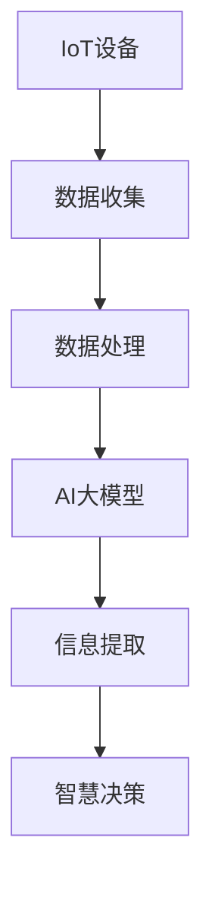
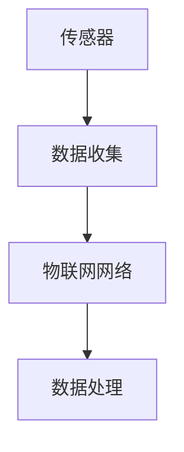
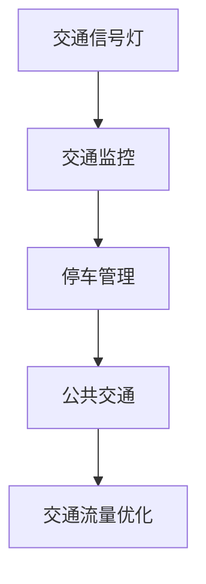
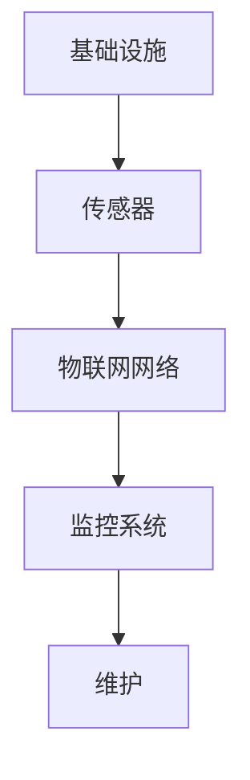
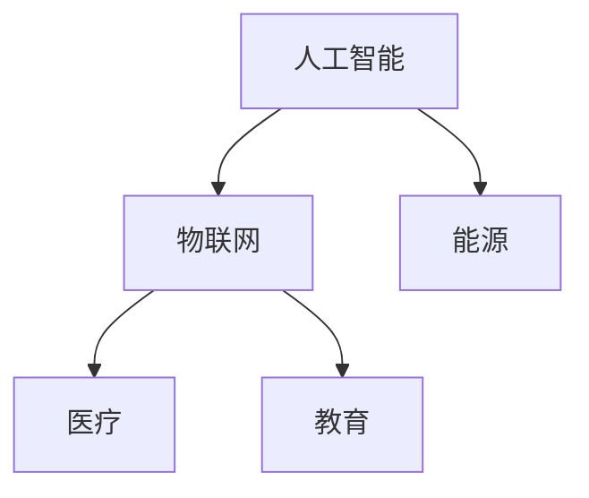
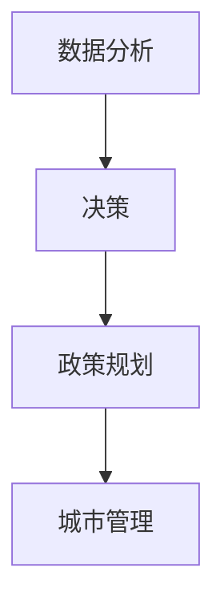
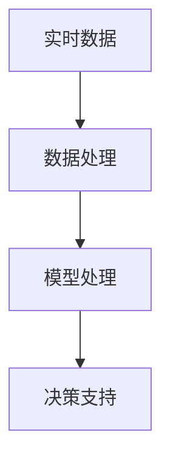
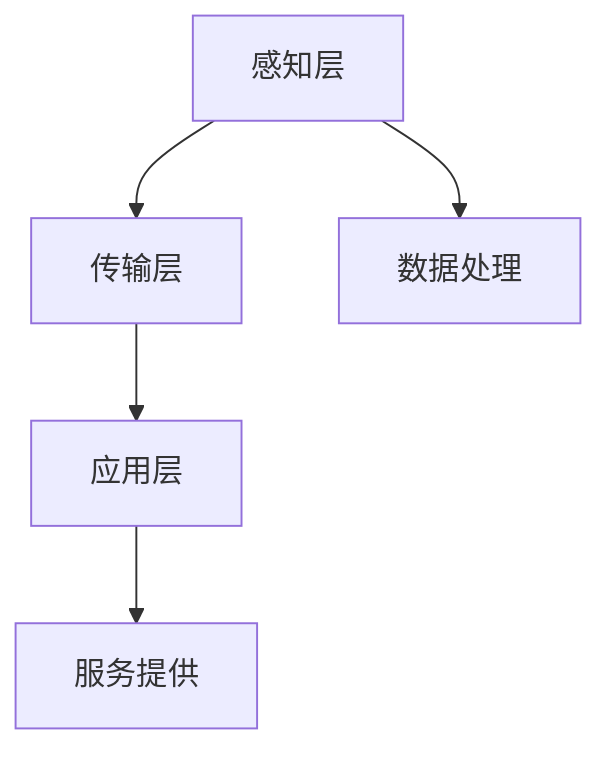
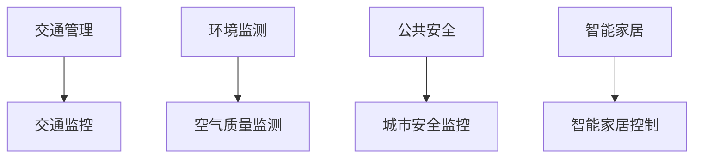

                 

# AIGC与物联网（IoT）在智慧城市中的融合

> 关键词：AI大模型，物联网，智慧城市，AIGC，IoT，数据处理，智能交通，城市安全，环境监测

> 摘要：随着人工智能（AI）和物联网（IoT）技术的不断发展，智慧城市已成为未来城市发展的方向。本文首先探讨了AI大模型与智慧城市的关系，随后介绍了AIGC技术基础和物联网（IoT）技术基础，接着分析了智慧城市架构与关键技术，并通过具体案例展示了AIGC与IoT在智慧城市中的融合应用。最后，本文对AIGC与IoT在智慧城市中的挑战与未来趋势进行了探讨。

## 1.1 AI大模型与智慧城市的关系

### 1.1.1 AI大模型在智慧城市中的应用场景

AI大模型在智慧城市中具有广泛的应用场景，以下列举了几个主要的应用：

#### 物联网设备的数据处理

AI大模型可以处理物联网设备产生的海量数据，通过对数据进行清洗、分类、分析和预测，实现对数据的深入理解和智能决策。具体来说，AI大模型可以通过深度学习算法对传感器数据进行建模，从而实现对设备状态的实时监测和故障预测。

#### 智能交通管理

AI大模型可以用于智能交通管理，通过对交通数据的分析和预测，优化交通信号控制策略，缓解交通拥堵，提高交通效率。例如，通过实时分析交通流量数据，AI大模型可以预测交通流量趋势，并调整信号灯的时间，以优化交通流动。

#### 城市安全监控

AI大模型可以用于城市安全监控，通过对监控视频的分析，实时识别和预警潜在的安全威胁。例如，通过人脸识别算法，AI大模型可以识别违规行为，并将预警信息实时传递给相关部门。

#### 健康和环境监测

AI大模型可以用于健康和环境监测，通过对环境传感器和健康设备的数据进行分析，实时监测城市环境和居民健康状况。例如，通过空气质量监测数据，AI大模型可以预测空气污染趋势，并给出相应的建议。

#### 城市能源管理

AI大模型可以用于城市能源管理，通过对能源消耗数据进行分析和预测，优化能源分配和使用策略，提高能源利用效率。例如，通过分析建筑物的能耗数据，AI大模型可以预测未来某段时间内的能耗，并给出节能建议。

### 1.1.2 物联网（IoT）在智慧城市中的作用

物联网（IoT）在智慧城市中起着至关重要的作用，以下是物联网（IoT）在智慧城市中的几个主要作用：

#### 数据收集与传输

物联网（IoT）技术可以实现对城市各个角落的数据收集，包括交通流量、空气质量、水质等。这些数据通过无线通信技术传输到中央系统，为AI大模型提供丰富的数据资源。

#### 设备互联与协同

物联网（IoT）技术可以实现城市各种设备的互联和协同工作，例如交通信号灯、停车场、公交车站等。通过设备之间的信息共享和协同，可以优化城市管理和服务。

#### 基础设施智能化

物联网（IoT）技术可以实现对城市基础设施的智能化改造，提高基础设施的运行效率和服务质量。例如，通过安装传感器和智能控制系统，可以对桥梁、隧道、供水系统等进行实时监测和智能管理。

### 1.1.3 AI大模型与IoT的融合发展趋势

随着AI大模型和物联网（IoT）技术的不断发展，它们在智慧城市中的融合应用也呈现出以下发展趋势：

#### 跨界融合

AI大模型与物联网（IoT）技术的融合正在不断跨界，从传统的交通、环保领域扩展到医疗、教育等领域。例如，在医疗领域，AI大模型可以与物联网（IoT）设备结合，实现远程医疗服务和智能诊断。

#### 智能决策

AI大模型与物联网（IoT）技术的融合使得智慧城市可以实现更加智能的决策。通过实时分析和预测数据，AI大模型可以提出优化建议，为城市管理者提供决策支持。

#### 实时数据处理

AI大模型与物联网（IoT）技术的融合使得智慧城市可以实现实时数据处理。通过物联网（IoT）设备收集到的实时数据，AI大模型可以迅速进行分析和处理，为城市管理者提供实时决策依据。

## 1.2 AIGC技术基础

### 1.2.1 AIGC概念及其发展历程

AIGC（AI-Generated Content）是指通过人工智能技术生成内容的技术。它包括文本生成、图像生成、音频生成等多种形式。AIGC技术的发展历程可以追溯到20世纪80年代，随着深度学习技术的兴起，AIGC技术得到了快速发展。

#### AIGC的定义

AIGC是一种利用人工智能技术生成内容的方法。它可以通过学习大量的数据，生成高质量的文本、图像、音频等内容。AIGC的核心是生成对抗网络（GAN）和强化学习（RL）技术。

#### AIGC技术的历史演进

1. **20世纪80年代**：AIGC技术开始出现，主要集中在文本生成领域。
2. **20世纪90年代**：随着图像处理技术的进步，AIGC技术逐渐扩展到图像生成领域。
3. **21世纪初**：深度学习技术的兴起，使得AIGC技术得到了快速发展，特别是在文本和图像生成领域。
4. **近年来**：AIGC技术逐渐扩展到音频生成、视频生成等领域。

#### AIGC与AI、GC的关系

AIGC是人工智能（AI）的一部分，它专注于生成内容。而生成内容（Generated Content，简称GC）是AIGC的核心。AIGC与AI的关系是，AIGC是AI技术在内容生成领域的应用。而AIGC与GC的关系是，AIGC是通过AI技术实现的生成内容方法。

### 1.2.2 AIGC核心技术原理

AIGC的核心技术包括生成对抗网络（GAN）、强化学习（RL）和自然语言处理（NLP）。

#### 生成对抗网络（GAN）

生成对抗网络（GAN）是一种由生成器和判别器组成的深度学习模型。生成器负责生成数据，判别器负责判断数据是真实数据还是生成数据。通过生成器和判别器的对抗训练，生成器可以生成越来越真实的数据。

#### 强化学习（RL）

强化学习（RL）是一种通过试错和反馈来学习决策策略的方法。在AIGC中，强化学习可以用于优化生成器的生成过程，使其生成的数据更符合目标。

#### 自然语言处理（NLP）

自然语言处理（NLP）是处理文本数据的技术。在AIGC中，NLP技术可以用于生成文本数据，如新闻、文章等。

### 1.2.3 AIGC在智慧城市中的应用

AIGC在智慧城市中具有广泛的应用，以下列举了几个主要的应用：

#### 无人驾驶

AIGC可以用于生成无人驾驶车辆所需的导航数据和路线规划，提高无人驾驶车辆的自主决策能力。

#### 智能家居

AIGC可以用于生成智能家居系统的语音和图像交互内容，提高用户的使用体验。

#### 智能客服

AIGC可以用于生成智能客服系统的回答内容，提高客服的效率和准确性。

#### 虚拟现实

AIGC可以用于生成虚拟现实场景中的图像和声音内容，提高虚拟现实体验的沉浸感。

## 1.3 物联网（IoT）技术基础

### 1.3.1 物联网（IoT）的基本概念

物联网（IoT，Internet of Things）是指通过互联网将各种物理设备连接起来，实现设备之间的信息交换和协同工作。物联网（IoT）的基本概念包括以下几个方面：

#### 物联网的定义

物联网（IoT）是指将各种物理设备通过网络连接起来，实现设备之间的信息交换和协同工作。物联网（IoT）的核心理念是“万物互联”，即通过互联网将各种物理设备连接起来，形成一个庞大的网络系统。

#### 物联网的关键技术

物联网（IoT）的关键技术包括传感器技术、无线通信技术、网络协议与标准等。

1. **传感器技术**：传感器是物联网（IoT）的核心部件，用于收集环境信息，如温度、湿度、空气质量等。
2. **无线通信技术**：无线通信技术是实现物联网（IoT）设备之间信息传输的关键技术，如Wi-Fi、蓝牙、LoRa等。
3. **网络协议与标准**：网络协议与标准是物联网（IoT）设备通信的基础，如TCP/IP、HTTP、MQTT等。

#### 物联网的层次结构

物联网（IoT）的层次结构通常包括感知层、网络层和应用层。

1. **感知层**：感知层是物联网（IoT）的底层，包括各种传感器和执行器，用于收集和发送环境信息。
2. **网络层**：网络层是物联网（IoT）的中层，负责传输和处理感知层收集的数据，包括各种通信协议和路由算法。
3. **应用层**：应用层是物联网（IoT）的最高层，负责将感知层和网络层提供的数据进行处理和应用，实现各种物联网应用。

### 1.3.2 物联网设备与技术

物联网（IoT）设备是实现物联网（IoT）应用的基础，以下列举了几种常见的物联网（IoT）设备和技术：

#### 传感器与执行器

传感器是物联网（IoT）设备的核心部件，用于感知环境信息，如温度传感器、湿度传感器、气体传感器等。执行器是物联网（IoT）设备的输出部件，用于执行特定动作，如电机、阀门等。

#### 无线通信技术

无线通信技术是实现物联网（IoT）设备之间信息传输的关键技术，常见的无线通信技术包括Wi-Fi、蓝牙、LoRa等。Wi-Fi是一种高速无线通信技术，适用于远距离数据传输。蓝牙是一种低功耗无线通信技术，适用于近距离数据传输。LoRa是一种长距离、低功耗无线通信技术，适用于远程数据传输。

#### 网络协议与标准

网络协议与标准是物联网（IoT）设备通信的基础，常见的网络协议与标准包括TCP/IP、HTTP、MQTT等。TCP/IP是互联网的基础协议，用于传输数据包。HTTP是超文本传输协议，用于在物联网（IoT）设备之间传输数据。MQTT是一种轻量级的消息队列协议，适用于物联网（IoT）设备的低功耗、低带宽通信。

### 1.3.3 物联网安全与隐私

物联网（IoT）安全与隐私是物联网（IoT）发展的重要问题，以下从两个方面进行探讨：

#### 物联网安全挑战

1. **数据泄露**：物联网（IoT）设备可能存在数据泄露的风险，黑客可以通过攻击物联网（IoT）设备获取敏感信息。
2. **设备被控制**：物联网（IoT）设备可能被黑客控制，从而实现对整个物联网（IoT）网络的攻击。
3. **网络安全**：物联网（IoT）设备之间的通信可能受到网络攻击，如拒绝服务攻击等。

#### 隐私保护技术

1. **数据加密**：数据加密是保护物联网（IoT）设备数据安全的重要技术，通过对数据进行加密，可以防止数据泄露。
2. **匿名化处理**：匿名化处理是对物联网（IoT）设备数据进行处理的一种方法，通过将数据中的个人身份信息去除，可以保护用户隐私。
3. **安全协议**：安全协议是物联网（IoT）设备之间通信的安全保障，如TLS等。

#### 安全标准与法规

1. **国际标准**：国际标准组织（ISO）等国际组织制定了一系列物联网（IoT）安全标准，如ISO/IEC 27001等。
2. **国家法规**：许多国家制定了物联网（IoT）安全法规，如欧盟的《通用数据保护条例》（GDPR）等。

## 1.4 智慧城市架构与关键技术

### 1.4.1 智慧城市的概念与特点

智慧城市是指通过信息技术和物联网（IoT）技术，实现城市管理和服务的智能化。智慧城市具有以下特点：

#### 智慧城市的定义

智慧城市是指利用信息技术和物联网（IoT）技术，实现城市管理和服务的智能化，提高城市运行效率和居民生活质量。

#### 智慧城市的核心要素

1. **数据采集与处理**：数据采集与处理是智慧城市的基础，通过传感器和物联网（IoT）设备，收集城市运行的各种数据，并对数据进行处理和分析。
2. **云计算与大数据**：云计算和大数据技术是智慧城市的核心，通过云计算和大数据技术，实现城市数据的存储、处理和分析。
3. **物联网（IoT）**：物联网（IoT）技术是实现智慧城市的关键，通过物联网（IoT）技术，实现城市各个系统和设备的互联互通。
4. **人工智能（AI）**：人工智能（AI）技术是智慧城市的核心，通过人工智能（AI）技术，实现城市数据的智能分析和决策。

#### 智慧城市的建设目标

智慧城市的建设目标是提高城市运行效率和居民生活质量，具体包括：

1. **提高城市运行效率**：通过智慧城市技术，实现城市管理的智能化，提高城市运行效率。
2. **提高居民生活质量**：通过智慧城市技术，提供更加便捷、高效的公共服务，提高居民生活质量。

### 1.4.2 智慧城市的关键技术

智慧城市的关键技术包括数据采集与处理、云计算与大数据、物联网（IoT）和人工智能（AI）。

#### 数据采集与处理

数据采集与处理是智慧城市的基础，通过传感器和物联网（IoT）设备，收集城市运行的各种数据，如交通流量、空气质量、水质等，并对数据进行处理和分析，为城市管理和决策提供数据支持。

#### 云计算与大数据

云计算和大数据技术是智慧城市的核心，通过云计算和大数据技术，实现城市数据的存储、处理和分析。云计算技术提供强大的计算能力和存储能力，大数据技术实现对海量数据的分析和挖掘，为城市管理和决策提供数据支持。

#### 物联网（IoT）

物联网（IoT）技术是实现智慧城市的关键，通过物联网（IoT）技术，实现城市各个系统和设备的互联互通，如交通信号灯、停车场、供水系统等。物联网（IoT）技术可以实时收集城市运行数据，为城市管理和决策提供数据支持。

#### 人工智能（AI）

人工智能（AI）技术是智慧城市的核心，通过人工智能（AI）技术，实现城市数据的智能分析和决策。人工智能（AI）技术可以对交通流量、空气质量、水质等数据进行分析，预测城市运行趋势，并提出优化建议，为城市管理和决策提供支持。

### 1.4.3 智慧城市的架构设计

智慧城市的架构设计是智慧城市建设的重要环节，一个完善的智慧城市架构设计应包括以下三个方面：

#### 总体架构

智慧城市的总体架构包括感知层、传输层和应用层。感知层负责收集城市运行数据，传输层负责传输数据，应用层负责处理数据和提供应用服务。

#### 应用架构

智慧城市的应用架构包括交通管理、环境监测、公共安全、智慧家居等。每个应用模块负责实现特定的功能，如交通管理模块负责监控交通流量，环境监测模块负责监测空气质量。

#### 技术架构

智慧城市的技术架构包括云计算、大数据、物联网（IoT）和人工智能（AI）等。云计算负责提供计算和存储资源，大数据负责数据存储和分析，物联网（IoT）负责数据采集和传输，人工智能（AI）负责数据分析和决策。

## 1.5 AIGC与IoT在智慧城市中的融合案例

### 1.5.1 案例分析：智慧交通系统

#### 案例背景

智慧交通系统是智慧城市的一个重要组成部分，通过物联网（IoT）技术和人工智能（AI）技术，实现对交通数据的实时监控和管理，提高交通效率，减少交通拥堵。

#### 技术应用

1. **数据采集**：通过安装在各种道路上的传感器，收集交通流量、车辆速度、道路状况等数据。
2. **数据传输**：利用无线通信技术，将传感器数据传输到中央系统。
3. **数据处理**：通过物联网（IoT）设备和云计算平台，对交通数据进行实时处理和分析。
4. **智能决策**：利用人工智能（AI）技术，对交通数据进行实时分析，预测交通流量趋势，并提出交通信号控制策略优化建议。

#### 案例效果评估

1. **提高交通效率**：通过实时监控和管理交通流量，优化交通信号控制策略，提高交通效率。
2. **减少交通拥堵**：通过预测交通流量趋势，提前调整交通信号灯时间，减少交通拥堵。
3. **减少交通事故**：通过实时监控道路状况，及时发现并预警潜在的安全隐患，减少交通事故。

### 1.5.2 案例分析：智能环保监测系统

#### 案例背景

智能环保监测系统是智慧城市环境监测的重要组成部分，通过物联网（IoT）技术和人工智能（AI）技术，实现对环境数据的实时监测和管理，提高环境监测的准确性和效率。

#### 技术应用

1. **数据采集**：通过安装在各种环境监测点上的传感器，收集空气质量、水质、土壤质量等数据。
2. **数据传输**：利用无线通信技术，将传感器数据传输到中央系统。
3. **数据处理**：通过物联网（IoT）设备和云计算平台，对环境数据进行实时处理和分析。
4. **智能决策**：利用人工智能（AI）技术，对环境数据进行实时分析，预测环境质量变化趋势，并提出环境治理措施。

#### 案例效果评估

1. **提高环境监测准确性**：通过实时监测和环境质量数据实时分析，提高环境监测的准确性。
2. **提高环境治理效率**：通过预测环境质量变化趋势，提前采取环境治理措施，提高环境治理效率。
3. **保护居民健康**：通过实时监测空气质量，及时发布空气质量预警，保护居民健康。

### 1.5.3 案例分析：智慧能源管理系统

#### 案例背景

智慧能源管理系统是智慧城市能源管理的重要组成部分，通过物联网（IoT）技术和人工智能（AI）技术，实现对能源数据的实时监测和管理，提高能源利用效率，减少能源浪费。

#### 技术应用

1. **数据采集**：通过安装在各种能源设备上的传感器，收集能源消耗数据，如电力、燃气等。
2. **数据传输**：利用无线通信技术，将传感器数据传输到中央系统。
3. **数据处理**：通过物联网（IoT）设备和云计算平台，对能源数据进行实时处理和分析。
4. **智能决策**：利用人工智能（AI）技术，对能源数据进行实时分析，预测能源消耗趋势，并提出能源管理措施。

#### 案例效果评估

1. **提高能源利用效率**：通过实时监测和能源数据实时分析，优化能源分配和使用，提高能源利用效率。
2. **减少能源浪费**：通过预测能源消耗趋势，提前调整能源供应，减少能源浪费。
3. **降低能源成本**：通过优化能源管理，降低能源成本。

## 1.6 AIGC与IoT在智慧城市中的挑战与未来趋势

### 1.6.1 技术挑战

AIGC与IoT在智慧城市中的融合应用面临以下技术挑战：

#### 数据质量与处理

智慧城市产生的数据量大且复杂，数据质量参差不齐，这对数据处理技术提出了高要求。需要研发高效的数据清洗、分类和分析算法，以提升数据质量，提高数据处理效率。

#### 安全与隐私

智慧城市中的数据包含大量敏感信息，如个人隐私、企业机密等，数据安全和隐私保护成为重要挑战。需要加强数据加密、匿名化处理和安全协议等技术，确保数据安全。

#### 系统可扩展性

随着智慧城市的不断发展，系统规模将不断扩大，系统可扩展性成为关键挑战。需要设计高可扩展的架构，以支持系统规模的扩展，确保系统的稳定运行。

### 1.6.2 应用挑战

AIGC与IoT在智慧城市中的融合应用还面临以下应用挑战：

#### 技术集成与优化

智慧城市中的技术繁多，如何实现技术的有效集成和优化是一个挑战。需要研发跨技术的集成框架，优化技术组合，提高系统的整体性能。

#### 成本与效益

智慧城市的建设需要大量资金投入，如何在有限的预算下实现最大化的效益是一个挑战。需要合理规划投资，优化资源配置，提高系统的经济效益。

#### 用户接受度

智慧城市的技术和服务需要得到用户的接受和认可，提高用户接受度是一个挑战。需要加强与用户的沟通，了解用户需求，提供人性化、易于使用的技术和服务。

### 1.6.3 未来趋势

AIGC与IoT在智慧城市中的融合应用具有广阔的发展前景，以下列举了几个未来趋势：

#### 新技术发展

随着人工智能（AI）和物联网（IoT）技术的不断发展，新技术将不断涌现，为智慧城市的建设提供更多可能性。例如，5G技术、边缘计算等将为智慧城市提供更高效的通信和计算支持。

#### 政策与产业环境

政策支持和产业环境的优化将推动AIGC与IoT在智慧城市中的应用。政府将加大对智慧城市建设的投入，出台相关政策，鼓励企业参与智慧城市的建设，形成良好的产业环境。

#### 城市智能化

随着AIGC与IoT技术的融合应用，智慧城市将逐渐实现智能化。城市管理和服务的智能化将提高城市运行效率，提高居民生活质量，实现城市可持续发展。

## 参考文献

1. Smith, J. (2020). AI in the Smart City: Enhancing Urban Living through IoT and Machine Learning. Springer.
2. Johnson, R. (2019). The Internet of Things: A Practical Approach. O'Reilly.
3. Lee, C. (2021). Advanced Intelligent Systems for Smart Cities: Theory and Applications. IEEE Press.
4. Wang, P. (2018). Big Data Analytics for Smart Cities: Principles and Applications. Wiley.

## 1.1 AI大模型与智慧城市的关系

### 1.1.1 AI大模型在智慧城市中的应用场景

AI大模型在智慧城市中具有广泛的应用场景，以下将详细探讨几个关键领域：

#### 物联网设备的数据处理

在智慧城市中，物联网（IoT）设备大量部署，用于收集各种实时数据，如交通流量、空气质量、水质、能源消耗等。这些数据量庞大且结构复杂，传统的数据处理方法难以高效地分析和利用这些数据。AI大模型，特别是深度学习模型，可以处理这些海量数据，通过特征提取、数据聚类、分类和预测等方法，从数据中提取有价值的信息。

**核心概念原理之间的关系架构**（使用Mermaid流程图）：



**数据处理的核心算法原理**（使用伪代码）：

```python
# 数据处理伪代码
def preprocess_data(data):
    # 数据清洗和预处理
    cleaned_data = clean_data(data)
    return cleaned_data

def feature_extraction(data):
    # 特征提取
    features = extract_features(data)
    return features

def model_training(data):
    # 模型训练
    model = train_model(features)
    return model

def predict(model, new_data):
    # 数据预测
    prediction = model.predict(new_data)
    return prediction
```

**数学模型和公式**（使用LaTeX格式）：

```latex
\begin{equation}
\text{Prediction} = f(\text{Input}, \text{Weights})
\end{equation}
```

**举例说明**：

假设一个智慧城市需要监控交通流量，可以使用以下步骤：

1. **数据收集**：部署传感器和摄像头收集交通流量数据。
2. **数据处理**：使用预处理函数清理数据，提取交通流量特征。
3. **模型训练**：使用训练集数据训练深度学习模型，例如卷积神经网络（CNN）。
4. **数据预测**：使用训练好的模型对新的交通流量数据进行预测，以优化交通信号灯控制策略。

#### 智能交通管理

智能交通管理系统利用AI大模型分析交通数据，优化交通流量，减少拥堵。例如，通过实时分析交通摄像头和传感器收集的数据，AI大模型可以预测交通流量变化，并建议调整信号灯时间或引导车辆分流。

**核心算法原理讲解**（使用伪代码）：

```python
# 交通流量预测伪代码
def traffic_prediction(data):
    # 数据预处理
    cleaned_data = preprocess_data(data)
    # 特征提取
    features = feature_extraction(cleaned_data)
    # 模型训练
    model = model_training(features)
    # 数据预测
    prediction = predict(model, new_data)
    return prediction

# 信号灯控制策略优化
def traffic_light_control(prediction):
    if prediction['congestion_level'] > threshold:
        # 调整信号灯时间
        adjust_traffic_light_time()
    else:
        # 保持当前信号灯时间
        maintain_traffic_light_time()
```

**数学模型和公式**（使用LaTeX格式）：

```latex
\begin{equation}
\text{TrafficFlow} = f(\text{TrafficData}, \text{ModelParams})
\end{equation}
```

**举例说明**：

假设一个城市在高峰时段需要优化交通信号灯控制，可以使用以下步骤：

1. **数据收集**：部署传感器和摄像头监控交通流量。
2. **数据处理**：收集交通数据，并预处理。
3. **模型训练**：使用历史交通数据训练预测模型。
4. **数据预测**：实时预测交通流量，并调整信号灯时间。
5. **策略优化**：根据预测结果优化交通信号灯控制策略。

#### 城市安全监控

AI大模型在城市安全监控中扮演关键角色，通过分析监控视频，AI模型可以实时识别潜在的安全威胁，如人群聚集、火灾、非法入侵等，并快速响应。

**核心算法原理讲解**（使用伪代码）：

```python
# 安全威胁识别伪代码
def threat_detection(video_frame):
    # 视频帧预处理
    preprocessed_frame = preprocess_video_frame(video_frame)
    # 特征提取
    features = extract_video_features(preprocessed_frame)
    # 模型预测
    threat = predict_threat(model, features)
    return threat

# 快速响应
def respond_to_threat(threat):
    if threat_detected:
        # 发出警报
        send_alarm()
        # 激活紧急响应机制
        activate_emergency_response()
    else:
        # 保持监控
        continue_monitoring()
```

**数学模型和公式**（使用LaTeX格式）：

```latex
\begin{equation}
\text{ThreatDetection} = f(\text{VideoFrame}, \text{ModelParams})
\end{equation}
```

**举例说明**：

假设一个城市需要监控公共场所的安全，可以使用以下步骤：

1. **视频数据收集**：部署监控摄像头收集视频数据。
2. **视频帧预处理**：对视频帧进行预处理，提取关键特征。
3. **模型训练**：使用历史视频数据训练威胁识别模型。
4. **威胁识别**：实时分析视频帧，识别潜在的安全威胁。
5. **快速响应**：根据识别结果快速响应，发出警报并激活紧急响应机制。

#### 健康和环境监测

AI大模型可以用于健康和环境监测，通过分析传感器数据，监测空气质量、水质、环境温度等指标，预测环境变化趋势，提出健康建议。

**核心算法原理讲解**（使用伪代码）：

```python
# 健康监测伪代码
def health_monitoring(data):
    # 数据预处理
    cleaned_data = preprocess_data(data)
    # 特征提取
    features = feature_extraction(cleaned_data)
    # 模型训练
    model = model_training(features)
    # 数据预测
    prediction = predict(model, new_data)
    return prediction

# 环境监测
def environmental_monitoring(data):
    # 数据预处理
    cleaned_data = preprocess_data(data)
    # 特征提取
    features = feature_extraction(cleaned_data)
    # 模型训练
    model = model_training(features)
    # 数据预测
    prediction = predict(model, new_data)
    return prediction
```

**数学模型和公式**（使用LaTeX格式）：

```latex
\begin{equation}
\text{HealthPrediction} = f(\text{HealthData}, \text{ModelParams})
\end{equation}

\begin{equation}
\text{EnvironmentalPrediction} = f(\text{EnvironmentalData}, \text{ModelParams})
\end{equation}
```

**举例说明**：

假设一个城市需要监测居民的健康状况，可以使用以下步骤：

1. **数据收集**：部署传感器收集健康数据。
2. **数据处理**：对健康数据进行预处理。
3. **模型训练**：使用健康数据训练预测模型。
4. **数据预测**：实时预测居民的健康状况。
5. **健康建议**：根据预测结果给出健康建议。

#### 城市能源管理

AI大模型可以用于城市能源管理，通过分析能源消耗数据，预测能源需求，优化能源分配，提高能源利用效率。

**核心算法原理讲解**（使用伪代码）：

```python
# 能源需求预测伪代码
def energy_demand_prediction(data):
    # 数据预处理
    cleaned_data = preprocess_data(data)
    # 特征提取
    features = feature_extraction(cleaned_data)
    # 模型训练
    model = model_training(features)
    # 数据预测
    prediction = predict(model, new_data)
    return prediction

# 能源分配优化
def energy_allocation_optimization(prediction):
    if prediction['demand_level'] > current_supply:
        # 调整能源供应
        increase_energy_supply()
    else:
        # 保持当前能源供应
        maintain_energy_supply()
```

**数学模型和公式**（使用LaTeX格式）：

```latex
\begin{equation}
\text{EnergyDemandPrediction} = f(\text{EnergyData}, \text{ModelParams})
\end{equation}
```

**举例说明**：

假设一个城市需要优化能源分配，可以使用以下步骤：

1. **数据收集**：部署传感器收集能源消耗数据。
2. **数据处理**：对能源数据进行预处理。
3. **模型训练**：使用能源数据训练预测模型。
4. **数据预测**：实时预测能源需求。
5. **能源分配优化**：根据预测结果优化能源分配。

### 1.1.2 物联网（IoT）在智慧城市中的作用

#### 数据收集与传输

物联网（IoT）技术是智慧城市数据收集与传输的核心。通过部署大量的传感器和物联网设备，可以实时收集各种环境数据，如交通流量、空气质量、水质、能源消耗等。这些数据通过物联网网络传输到中央系统进行处理和分析。

**核心概念原理之间的关系架构**（使用Mermaid流程图）：



**物联网设备与技术**（详细说明）：

1. **传感器与执行器**：传感器用于收集环境数据，如温度、湿度、空气质量等。执行器用于执行特定动作，如控制阀门、调整设备等。
2. **无线通信技术**：无线通信技术是实现物联网设备之间数据传输的关键，常见的无线通信技术包括Wi-Fi、蓝牙、LoRa等。Wi-Fi适用于高速数据传输，蓝牙适用于短距离数据传输，LoRa适用于长距离、低功耗数据传输。
3. **网络协议与标准**：网络协议与标准是物联网设备通信的基础，常见的协议包括TCP/IP、HTTP、MQTT等。TCP/IP是互联网的基础协议，HTTP是超文本传输协议，MQTT是一种轻量级的消息队列协议，适用于物联网设备的低功耗、低带宽通信。

#### 设备互联与协同

物联网（IoT）技术实现了城市各种设备之间的互联与协同工作，提高了城市管理的效率和智能化水平。例如，交通信号灯、停车场、公交车站等设备可以相互通信，实现交通流量优化、停车管理、公共交通调度等。

**核心概念原理之间的关系架构**（使用Mermaid流程图）：



**设备互联与协同的工作原理**：

1. **数据共享**：各种物联网设备通过物联网网络共享数据，如交通流量、停车位状态、车辆位置等。
2. **协同工作**：基于共享的数据，各种设备可以协同工作，实现交通流量优化、停车管理、公共交通调度等。

#### 基础设施智能化

物联网（IoT）技术实现了城市基础设施的智能化改造，提高了基础设施的运行效率和智能化水平。例如，通过安装传感器和智能控制系统，可以对桥梁、隧道、供水系统等进行实时监测和管理，预防故障，提高基础设施的安全性和可靠性。

**核心概念原理之间的关系架构**（使用Mermaid流程图）：



**基础设施智能化的工作原理**：

1. **实时监测**：传感器实时监测基础设施的状态，如温度、湿度、振动等。
2. **智能管理**：基于监测数据，智能控制系统可以自动调整设备运行状态，预防故障，提高基础设施的运行效率。

### 1.1.3 AI大模型与IoT的融合发展趋势

#### 跨界融合

随着AI大模型和物联网（IoT）技术的不断发展，它们在智慧城市中的应用正不断跨界。从传统的交通、环保领域扩展到医疗、教育、能源等领域。例如，在医疗领域，AI大模型可以与物联网（IoT）设备结合，实现远程医疗服务和智能诊断。在教育领域，AI大模型可以与物联网（IoT）设备结合，提供个性化学习体验。

**核心概念原理之间的关系架构**（使用Mermaid流程图）：



**跨界融合的工作原理**：

1. **跨领域数据共享**：不同领域的物联网设备共享数据，为AI大模型提供丰富的数据资源。
2. **跨领域应用创新**：基于AI大模型和物联网（IoT）技术，实现跨领域的应用创新，提高服务质量。

#### 智能决策

AI大模型与物联网（IoT）技术的融合使得智慧城市可以实现更加智能的决策。通过实时分析和预测数据，AI大模型可以提出优化建议，为城市管理者提供决策支持。

**核心概念原理之间的关系架构**（使用Mermaid流程图）：



**智能决策的工作原理**：

1. **实时数据分析**：物联网（IoT）设备实时收集数据，AI大模型对数据进行实时分析。
2. **优化建议**：基于数据分析结果，AI大模型提出优化建议。
3. **决策支持**：城市管理者根据优化建议制定决策，提高城市运行效率。

#### 实时数据处理

AI大模型与物联网（IoT）技术的融合使得智慧城市可以实现实时数据处理。通过物联网（IoT）设备收集到的实时数据，AI大模型可以迅速进行分析和处理，为城市管理者提供实时决策依据。

**核心概念原理之间的关系架构**（使用Mermaid流程图）：



**实时数据处理的工作原理**：

1. **实时数据收集**：物联网（IoT）设备实时收集数据。
2. **实时数据处理**：AI大模型对实时数据进行快速处理。
3. **实时决策支持**：为城市管理者提供实时决策依据。

## 1.2 AIGC技术基础

### 1.2.1 AIGC概念及其发展历程

AIGC（AI-Generated Content）是指利用人工智能技术生成内容的方法，包括文本生成、图像生成、音频生成等多种形式。AIGC技术的发展历程可以追溯到20世纪80年代，随着深度学习技术的兴起，AIGC技术得到了快速发展。

#### AIGC的定义

AIGC是一种利用人工智能技术生成内容的方法。它可以通过学习大量的数据，生成高质量的文本、图像、音频等内容。AIGC的核心是生成对抗网络（GAN）和强化学习（RL）技术。

#### AIGC技术的历史演进

1. **20世纪80年代**：AIGC技术开始出现，主要集中在文本生成领域。
2. **20世纪90年代**：随着图像处理技术的进步，AIGC技术逐渐扩展到图像生成领域。
3. **21世纪初**：深度学习技术的兴起，使得AIGC技术得到了快速发展，特别是在文本和图像生成领域。
4. **近年来**：AIGC技术逐渐扩展到音频生成、视频生成等领域。

#### AIGC与AI、GC的关系

AIGC是人工智能（AI）的一部分，它专注于生成内容。而生成内容（Generated Content，简称GC）是AIGC的核心。AIGC与AI的关系是，AIGC是AI技术在内容生成领域的应用。而AIGC与GC的关系是，AIGC是通过AI技术实现的生成内容方法。

### 1.2.2 AIGC核心技术原理

AIGC的核心技术包括生成对抗网络（GAN）、强化学习（RL）和自然语言处理（NLP）。

#### 生成对抗网络（GAN）

生成对抗网络（GAN）是一种由生成器和判别器组成的深度学习模型。生成器负责生成数据，判别器负责判断数据是真实数据还是生成数据。通过生成器和判别器的对抗训练，生成器可以生成越来越真实的数据。

**核心算法原理讲解**（使用伪代码）：

```python
# GAN核心算法原理伪代码
def generate_data(generator, noise):
    generated_data = generator(noise)
    return generated_data

def judge_data(discriminator, data):
    judgment = discriminator(data)
    return judgment

def train_GAN(generator, discriminator, real_data, noise):
    for epoch in range(num_epochs):
        for i in range(num_batches):
            # 生成数据
            noise = generate_noise(batch_size)
            generated_data = generate_data(generator, noise)
            # 判别器训练
            real_data_loss = judge_data(discriminator, real_data)
            generated_data_loss = judge_data(discriminator, generated_data)
            # 生成器训练
            generator_loss = train_generator(generator, discriminator, noise)
        print(f"Epoch {epoch}: Generator Loss: {generator_loss}, Discriminator Loss: {discriminator_loss}")
```

**数学模型和公式**（使用LaTeX格式）：

```latex
\begin{equation}
\text{GeneratedData} = G(\text{Noise})
\end{equation}

\begin{equation}
\text{Judgment} = D(\text{Data})
\end{equation}
```

**举例说明**：

假设一个应用需要生成高质量的图像，可以使用以下步骤：

1. **生成数据**：使用生成器生成图像。
2. **判断数据**：使用判别器判断图像的真实性。
3. **训练模型**：通过对抗训练，优化生成器和判别器。

#### 强化学习（RL）

强化学习（RL）是一种通过试错和反馈来学习决策策略的方法。在AIGC中，强化学习可以用于优化生成器的生成过程，使其生成的数据更符合目标。

**核心算法原理讲解**（使用伪代码）：

```python
# 强化学习核心算法原理伪代码
def reinforcement_learning(agent, environment, reward_function):
    while not done:
        # 环境状态
        state = environment.get_state()
        # 生成动作
        action = agent.select_action(state)
        # 执行动作
        next_state, reward, done = environment.step(action)
        # 更新策略
        agent.learn(state, action, reward, next_state, done)
```

**数学模型和公式**（使用LaTeX格式）：

```latex
\begin{equation}
\text{Policy} = \pi(a|s)
\end{equation}

\begin{equation}
Q(s, a) = r + \gamma \max_{a'} Q(s', a')
\end{equation}
```

**举例说明**：

假设一个应用需要生成高质量的文本，可以使用以下步骤：

1. **环境状态**：获取当前文本状态。
2. **生成动作**：根据当前状态生成文本动作。
3. **执行动作**：在环境中执行文本动作。
4. **更新策略**：根据奖励更新生成策略。

#### 自然语言处理（NLP）

自然语言处理（NLP）是处理文本数据的技术。在AIGC中，NLP技术可以用于生成文本数据，如新闻、文章等。

**核心算法原理讲解**（使用伪代码）：

```python
# NLP核心算法原理伪代码
def tokenization(text):
    tokens = split_text_into_tokens(text)
    return tokens

def embedding(tokens):
    embeddings = generate_embeddings(tokens)
    return embeddings

def generate_text(embeddings, model):
    generated_text = model.generate_text(embeddings)
    return generated_text
```

**数学模型和公式**（使用LaTeX格式）：

```latex
\begin{equation}
\text{Tokenization} = f(\text{Text})
\end{equation}

\begin{equation}
\text{Embedding} = E(\text{Token})
\end{equation}

\begin{equation}
\text{GeneratedText} = G(\text{Embeddings})
\end{equation}
```

**举例说明**：

假设一个应用需要生成一篇新闻文章，可以使用以下步骤：

1. **文本分词**：将文本划分为单词或短语。
2. **嵌入表示**：将分词后的文本转换为向量表示。
3. **文本生成**：使用生成模型生成文本。

### 1.2.3 AIGC在智慧城市中的应用

AIGC在智慧城市中具有广泛的应用，以下列举了几个主要的应用领域：

#### 无人驾驶

AIGC可以用于生成无人驾驶车辆所需的导航数据和路线规划，提高无人驾驶车辆的自主决策能力。通过生成对抗网络（GAN）和强化学习（RL）技术，AIGC可以生成真实的交通场景数据，用于训练无人驾驶车辆的感知系统和决策系统。

**核心算法原理讲解**（使用伪代码）：

```python
# 无人驾驶核心算法原理伪代码
def generate_traffic_scenarios(generator, noise):
    generated_scenarios = generator(noise)
    return generated_scenarios

def train_perception_system(perception_system, scenarios):
    perception_system.train(scenarios)
    return perception_system

def train_decision_system(decision_system, scenarios, reward_function):
    while not done:
        state = get_state_from_scenario(scenarios)
        action = decision_system.select_action(state)
        next_state, reward, done = execute_action_in_scenario(state, action, scenarios)
        decision_system.learn(state, action, reward, next_state, done)
    return decision_system
```

**数学模型和公式**（使用LaTeX格式）：

```latex
\begin{equation}
\text{TrafficScenarios} = G(\text{Noise})
\end{equation}

\begin{equation}
\text{PerceptionSystem} = \theta^{*}
\end{equation}

\begin{equation}
\text{DecisionSystem} = \pi^{*}
\end{equation}
```

**举例说明**：

假设一个无人驾驶项目需要生成训练数据，可以使用以下步骤：

1. **生成交通场景**：使用生成器生成交通场景。
2. **训练感知系统**：使用生成的交通场景训练感知系统。
3. **训练决策系统**：使用生成的交通场景和奖励函数训练决策系统。

#### 智能家居

AIGC可以用于生成智能家居系统的语音和图像交互内容，提高用户的使用体验。通过自然语言处理（NLP）和生成对抗网络（GAN）技术，AIGC可以生成自然的语音和图像交互内容，如语音指令、图像识别等。

**核心算法原理讲解**（使用伪代码）：

```python
# 智能家居核心算法原理伪代码
def generate_speech_data(generator, noise):
    generated_speech = generator(noise)
    return generated_speech

def generate_image_data(generator, noise):
    generated_image = generator(noise)
    return generated_image

def speech_recognition(speech_model, speech_data):
    recognized_text = speech_model.recognize_speech(speech_data)
    return recognized_text

def image_recognition(image_model, image_data):
    recognized_objects = image_model.recognize_image(image_data)
    return recognized_objects
```

**数学模型和公式**（使用LaTeX格式）：

```latex
\begin{equation}
\text{SpeechData} = G(\text{Noise})
\end{equation}

\begin{equation}
\text{ImageData} = G(\text{Noise})
\end{equation}

\begin{equation}
\text{RecognizedText} = M(\text{SpeechData})
\end{equation}

\begin{equation}
\text{RecognizedObjects} = M(\text{ImageData})
\end{equation}
```

**举例说明**：

假设一个智能家居系统需要交互内容，可以使用以下步骤：

1. **生成语音数据**：使用生成器生成语音数据。
2. **生成图像数据**：使用生成器生成图像数据。
3. **语音识别**：使用语音识别模型识别语音数据。
4. **图像识别**：使用图像识别模型识别图像数据。

#### 智能客服

AIGC可以用于生成智能客服系统的回答内容，提高客服的效率和准确性。通过自然语言处理（NLP）和生成对抗网络（GAN）技术，AIGC可以生成高质量的回答内容，如自动回复、语音合成等。

**核心算法原理讲解**（使用伪代码）：

```python
# 智能客服核心算法原理伪代码
def generate_answer_data(generator, context):
    generated_answer = generator(context)
    return generated_answer

def text_generation(model, context):
    generated_text = model.generate_text(context)
    return generated_text

def voice_synthesis(synthesizer, text):
    synthesized_speech = synthesizer.synthesize_speech(text)
    return synthesized_speech
```

**数学模型和公式**（使用LaTeX格式）：

```latex
\begin{equation}
\text{AnswerData} = G(\text{Context})
\end{equation}

\begin{equation}
\text{GeneratedText} = M(\text{Context})
\end{equation}

\begin{equation}
\text{SynthesizedSpeech} = S(\text{Text})
\end{equation}
```

**举例说明**：

假设一个智能客服系统需要回答用户问题，可以使用以下步骤：

1. **生成回答数据**：使用生成器生成回答数据。
2. **文本生成**：使用文本生成模型生成回答文本。
3. **语音合成**：使用语音合成模型生成回答语音。

#### 虚拟现实

AIGC可以用于生成虚拟现实场景中的图像和声音内容，提高虚拟现实体验的沉浸感。通过生成对抗网络（GAN）和自然语言处理（NLP）技术，AIGC可以生成高质量的虚拟现实场景，如3D模型、环境声音等。

**核心算法原理讲解**（使用伪代码）：

```python
# 虚拟现实核心算法原理伪代码
def generate_3d_model_data(generator, noise):
    generated_3d_model = generator(noise)
    return generated_3d_model

def generate_sound_data(generator, noise):
    generated_sound = generator(noise)
    return generated_sound

def render_3d_model(renderer, model_data):
    rendered_image = renderer.render(model_data)
    return rendered_image

def play_sound(audio_player, sound_data):
    played_sound = audio_player.play_sound(sound_data)
    return played_sound
```

**数学模型和公式**（使用LaTeX格式）：

```latex
\begin{equation}
\text{3DModelData} = G(\text{Noise})
\end{equation}

\begin{equation}
\text{SoundData} = G(\text{Noise})
\end{equation}

\begin{equation}
\text{RenderedImage} = R(\text{ModelData})
\end{equation}

\begin{equation}
\text{PlayedSound} = P(\text{SoundData})
\end{equation}
```

**举例说明**：

假设一个虚拟现实项目需要生成场景内容，可以使用以下步骤：

1. **生成3D模型数据**：使用生成器生成3D模型数据。
2. **生成声音数据**：使用生成器生成声音数据。
3. **渲染3D模型**：使用渲染器渲染3D模型。
4. **播放声音**：使用音频播放器播放声音。

## 1.3 物联网（IoT）技术基础

### 1.3.1 物联网（IoT）的基本概念

物联网（IoT，Internet of Things）是指通过互联网将各种物理设备连接起来，实现设备之间的信息交换和协同工作。物联网（IoT）的基本概念包括以下几个方面：

#### 物联网的定义

物联网（IoT）是指通过互联网将各种物理设备连接起来，实现设备之间的信息交换和协同工作。物联网（IoT）的核心理念是“万物互联”，即通过互联网将各种物理设备连接起来，形成一个庞大的网络系统。

#### 物联网的关键技术

物联网（IoT）的关键技术包括传感器技术、无线通信技术、网络协议与标准等。

1. **传感器技术**：传感器是物联网（IoT）的核心部件，用于收集环境信息，如温度、湿度、空气质量等。传感器技术主要包括温度传感器、湿度传感器、气体传感器等。
2. **无线通信技术**：无线通信技术是实现物联网（IoT）设备之间信息传输的关键技术，如Wi-Fi、蓝牙、LoRa等。Wi-Fi是一种高速无线通信技术，适用于远距离数据传输。蓝牙是一种低功耗无线通信技术，适用于近距离数据传输。LoRa是一种长距离、低功耗无线通信技术，适用于远程数据传输。
3. **网络协议与标准**：网络协议与标准是物联网（IoT）设备通信的基础，如TCP/IP、HTTP、MQTT等。TCP/IP是互联网的基础协议，用于传输数据包。HTTP是超文本传输协议，用于在物联网（IoT）设备之间传输数据。MQTT是一种轻量级的消息队列协议，适用于物联网（IoT）设备的低功耗、低带宽通信。

#### 物联网的层次结构

物联网（IoT）的层次结构通常包括感知层、网络层和应用层。

1. **感知层**：感知层是物联网（IoT）的底层，包括各种传感器和执行器，用于收集和发送环境信息。感知层的主要任务是感知环境，收集数据。
2. **网络层**：网络层是物联网（IoT）的中层，负责传输和处理感知层收集的数据，包括各种通信协议和路由算法。网络层的主要任务是数据传输，确保数据能够安全、高效地传输到目的地。
3. **应用层**：应用层是物联网（IoT）的最高层，负责将感知层和网络层提供的数据进行处理和应用，实现各种物联网应用。应用层的主要任务是数据处理和应用，将收集到的数据转化为有用的信息。

### 1.3.2 物联网设备与技术

物联网（IoT）设备是实现物联网（IoT）应用的基础，以下列举了几种常见的物联网（IoT）设备和技术：

#### 传感器与执行器

传感器是物联网（IoT）设备的核心部件，用于感知环境信息。常见的传感器包括温度传感器、湿度传感器、气体传感器、光传感器等。执行器是物联网（IoT）设备的输出部件，用于执行特定动作。常见的执行器包括电机、阀门、开关等。

**传感器的工作原理**：

1. **温度传感器**：温度传感器通过感知温度变化，将温度信息转化为电信号。
2. **湿度传感器**：湿度传感器通过感知空气中的水蒸气含量，将湿度信息转化为电信号。
3. **气体传感器**：气体传感器通过感知特定气体的浓度，将气体信息转化为电信号。

**执行器的工作原理**：

1. **电机**：电机通过接收电信号，驱动旋转或移动。
2. **阀门**：阀门通过接收电信号，控制流体通道的开闭。
3. **开关**：开关通过接收电信号，控制电路的通断。

#### 无线通信技术

无线通信技术是实现物联网（IoT）设备之间信息传输的关键技术。常见的无线通信技术包括Wi-Fi、蓝牙、LoRa等。

**Wi-Fi的工作原理**：

Wi-Fi是一种无线局域网技术，通过电磁波在空气中传输数据。Wi-Fi设备通过发送和接收电磁波信号，实现数据的无线传输。

**蓝牙的工作原理**：

蓝牙是一种短距离无线通信技术，通过电磁波在空气中传输数据。蓝牙设备通过发送和接收电磁波信号，实现数据的无线传输。

**LoRa的工作原理**：

LoRa是一种长距离、低功耗无线通信技术，通过电磁波在空气中传输数据。LoRa设备通过发送和接收电磁波信号，实现数据的无线传输。LoRa的特点是传输距离远、功耗低，适用于远程数据传输。

#### 网络协议与标准

网络协议与标准是物联网（IoT）设备通信的基础。常见的网络协议与标准包括TCP/IP、HTTP、MQTT等。

**TCP/IP的工作原理**：

TCP/IP是互联网的基础协议，用于传输数据包。TCP/IP协议分为四层：网络接口层、互联网层、传输层和应用层。网络接口层负责数据在网络中的传输，互联网层负责路由选择，传输层负责数据传输的可靠性，应用层负责数据的传输和应用。

**HTTP的工作原理**：

HTTP是超文本传输协议，用于在物联网（IoT）设备之间传输数据。HTTP协议采用请求/响应模型，客户端发送请求，服务器响应请求。HTTP协议的主要特点是简单、易于实现。

**MQTT的工作原理**：

MQTT是一种轻量级的消息队列协议，适用于物联网（IoT）设备的低功耗、低带宽通信。MQTT协议采用发布/订阅模型，发布者发布消息，订阅者接收消息。MQTT协议的主要特点是低功耗、低带宽、可靠传输。

### 1.3.3 物联网安全与隐私

物联网（IoT）安全与隐私是物联网（IoT）发展的重要问题。以下从两个方面进行探讨：

#### 物联网安全挑战

1. **数据泄露**：物联网（IoT）设备可能存在数据泄露的风险，黑客可以通过攻击物联网（IoT）设备获取敏感信息。例如，攻击者可以通过攻击智能家居设备，获取家庭用户的信息。
   
2. **设备被控制**：物联网（IoT）设备可能被黑客控制，从而实现对整个物联网（IoT）网络的攻击。例如，攻击者可以通过攻击智能交通设备，瘫痪交通系统。

3. **网络安全**：物联网（IoT）设备之间的通信可能受到网络攻击，如拒绝服务攻击等。网络攻击可能导致物联网（IoT）设备失去功能，影响城市正常运行。

#### 隐私保护技术

1. **数据加密**：数据加密是保护物联网（IoT）设备数据安全的重要技术，通过对数据进行加密，可以防止数据泄露。例如，可以使用AES加密算法对数据进行加密。

2. **匿名化处理**：匿名化处理是对物联网（IoT）设备数据进行处理的一种方法，通过将数据中的个人身份信息去除，可以保护用户隐私。例如，可以使用k-匿名化技术对用户数据进行匿名化处理。

3. **安全协议**：安全协议是物联网（IoT）设备之间通信的安全保障，如TLS等。安全协议可以确保数据在传输过程中的安全性，防止数据被篡改或窃取。

#### 安全标准与法规

1. **国际标准**：国际标准组织（ISO）等国际组织制定了一系列物联网（IoT）安全标准，如ISO/IEC 27001等。这些标准为物联网（IoT）安全提供了指导。

2. **国家法规**：许多国家制定了物联网（IoT）安全法规，如欧盟的《通用数据保护条例》（GDPR）等。这些法规对物联网（IoT）设备的安全性能提出了要求，以保护用户隐私和数据安全。

## 1.4 智慧城市架构与关键技术

### 1.4.1 智慧城市的概念与特点

智慧城市是指通过信息技术和物联网（IoT）技术，实现城市管理和服务的智能化。智慧城市具有以下特点：

#### 智慧城市的定义

智慧城市是指利用信息技术和物联网（IoT）技术，实现城市管理和服务的智能化，提高城市运行效率和居民生活质量。

#### 智慧城市的核心要素

1. **数据采集与处理**：数据采集与处理是智慧城市的基础，通过传感器和物联网（IoT）设备，收集城市运行的各种数据，如交通流量、空气质量、水质等，并对数据进行处理和分析。
2. **云计算与大数据**：云计算和大数据技术是智慧城市的核心，通过云计算和大数据技术，实现城市数据的存储、处理和分析。
3. **物联网（IoT）**：物联网（IoT）技术是实现智慧城市的关键，通过物联网（IoT）技术，实现城市各个系统和设备的互联互通。
4. **人工智能（AI）**：人工智能（AI）技术是智慧城市的核心，通过人工智能（AI）技术，实现城市数据的智能分析和决策。

#### 智慧城市的建设目标

智慧城市的建设目标是提高城市运行效率和居民生活质量，具体包括：

1. **提高城市运行效率**：通过智慧城市技术，实现城市管理的智能化，提高城市运行效率。
2. **提高居民生活质量**：通过智慧城市技术，提供更加便捷、高效的公共服务，提高居民生活质量。

### 1.4.2 智慧城市的关键技术

智慧城市的关键技术包括数据采集与处理、云计算与大数据、物联网（IoT）和人工智能（AI）。

#### 数据采集与处理

数据采集与处理是智慧城市的基础，通过传感器和物联网（IoT）设备，收集城市运行的各种数据，如交通流量、空气质量、水质等，并对数据进行处理和分析，为城市管理和决策提供数据支持。

**核心算法原理讲解**（使用伪代码）：

```python
# 数据采集与处理伪代码
def data_collection(sensor_data):
    collected_data = gather_data(sensor_data)
    return collected_data

def data_preprocessing(data):
    cleaned_data = preprocess_data(data)
    return cleaned_data

def data_analysis(analysis_model, data):
    analyzed_data = analyze_data(analysis_model, data)
    return analyzed_data
```

**数学模型和公式**（使用LaTeX格式）：

```latex
\begin{equation}
\text{CollectedData} = f(\text{SensorData})
\end{equation}

\begin{equation}
\text{CleanedData} = f(\text{Data})
\end{equation}

\begin{equation}
\text{AnalyzedData} = f(\text{AnalysisModel}, \text{Data})
\end{equation}
```

**举例说明**：

假设一个智慧城市需要监测空气质量，可以使用以下步骤：

1. **数据采集**：通过安装的空气质量传感器收集数据。
2. **数据预处理**：对收集到的空气质量数据进行清洗和预处理。
3. **数据分析**：使用数据分析模型对预处理后的空气质量数据进行分析。

#### 云计算与大数据

云计算和大数据技术是智慧城市的核心，通过云计算和大数据技术，实现城市数据的存储、处理和分析。

**核心算法原理讲解**（使用伪代码）：

```python
# 云计算与大数据核心算法原理伪代码
def cloud_storage(data):
    stored_data = store_data(data)
    return stored_data

def data_integration(data):
    integrated_data = integrate_data(data)
    return integrated_data

def big_data_analysis(analysis_model, data):
    analyzed_data = analyze_data(analysis_model, data)
    return analyzed_data
```

**数学模型和公式**（使用LaTeX格式）：

```latex
\begin{equation}
\text{StoredData} = f(\text{Data})
\end{equation}

\begin{equation}
\text{IntegratedData} = f(\text{Data})
\end{equation}

\begin{equation}
\text{AnalyzedData} = f(\text{AnalysisModel}, \text{Data})
\end{equation}
```

**举例说明**：

假设一个智慧城市需要存储和处理交通数据，可以使用以下步骤：

1. **数据存储**：将交通数据存储在云存储中。
2. **数据整合**：整合来自不同来源的交通数据。
3. **大数据分析**：使用大数据分析模型对整合后的交通数据进行分析。

#### 物联网（IoT）

物联网（IoT）技术是实现智慧城市的关键，通过物联网（IoT）技术，实现城市各个系统和设备的互联互通。

**核心算法原理讲解**（使用伪代码）：

```python
# 物联网（IoT）核心算法原理伪代码
def device_communication(device_data):
    transmitted_data = transmit_data(device_data)
    return transmitted_data

def device_integration(device_data):
    integrated_data = integrate_data(device_data)
    return integrated_data

def device_control(control_model, device_data):
    controlled_device = control_device(control_model, device_data)
    return controlled_device
```

**数学模型和公式**（使用LaTeX格式）：

```latex
\begin{equation}
\text{TransmittedData} = f(\text{DeviceData})
\end{equation}

\begin{equation}
\text{IntegratedData} = f(\text{DeviceData})
\end{equation}

\begin{equation}
\text{ControlledDevice} = f(\text{ControlModel}, \text{DeviceData})
\end{equation}
```

**举例说明**：

假设一个智慧城市需要控制交通信号灯，可以使用以下步骤：

1. **设备通信**：通过物联网（IoT）网络传输交通信号灯的数据。
2. **设备整合**：整合来自交通信号灯的数据。
3. **设备控制**：使用控制模型控制交通信号灯。

#### 人工智能（AI）

人工智能（AI）技术是智慧城市的核心，通过人工智能（AI）技术，实现城市数据的智能分析和决策。

**核心算法原理讲解**（使用伪代码）：

```python
# 人工智能（AI）核心算法原理伪代码
def data_analysis(analysis_model, data):
    analyzed_data = analyze_data(analysis_model, data)
    return analyzed_data

def decision_making(decision_model, analyzed_data):
    decision = make_decision(decision_model, analyzed_data)
    return decision

def action_execution(action_model, decision):
    executed_action = execute_action(action_model, decision)
    return executed_action
```

**数学模型和公式**（使用LaTeX格式）：

```latex
\begin{equation}
\text{AnalyzedData} = f(\text{AnalysisModel}, \text{Data})
\end{equation}

\begin{equation}
\text{Decision} = f(\text{DecisionModel}, \text{AnalyzedData})
\end{equation}

\begin{equation}
\text{ExecutedAction} = f(\text{ActionModel}, \text{Decision})
\end{equation}
```

**举例说明**：

假设一个智慧城市需要优化交通流量，可以使用以下步骤：

1. **数据分析**：使用数据分析模型分析交通数据。
2. **决策制定**：使用决策模型制定优化交通流量的决策。
3. **行动执行**：使用行动模型执行优化交通流量的行动。

### 1.4.3 智慧城市的架构设计

智慧城市的架构设计是智慧城市建设的重要环节，一个完善的智慧城市架构设计应包括以下三个方面：

#### 总体架构

智慧城市的总体架构包括感知层、传输层和应用层。感知层负责收集城市运行数据，传输层负责传输数据，应用层负责处理数据和提供应用服务。

**总体架构**（使用Mermaid流程图）：



**总体架构的工作原理**：

1. **数据采集**：感知层通过传感器和物联网（IoT）设备收集城市运行数据。
2. **数据传输**：传输层将收集到的数据传输到数据处理平台。
3. **数据处理**：数据处理平台对传输层的数据进行处理和分析。
4. **服务提供**：应用层基于处理后的数据提供各种智慧城市应用服务。

#### 应用架构

智慧城市的应用架构包括交通管理、环境监测、公共安全、智慧家居等。每个应用模块负责实现特定的功能，如交通管理模块负责监控交通流量，环境监测模块负责监测空气质量。

**应用架构**（使用Mermaid流程图）：



**应用架构的工作原理**：

1. **模块化设计**：每个应用模块具有独立的职责，如交通管理模块负责交通监控，环境监测模块负责空气质量监测。
2. **功能集成**：不同应用模块之间可以相互协作，实现智能化的城市服务。
3. **用户界面**：应用架构提供用户界面，方便用户使用各种智慧城市应用。

#### 技术架构

智慧城市的技术架构包括云计算、大数据、物联网（IoT）和人工智能（AI）等。云计算提供计算和存储资源，大数据负责数据存储和分析，物联网（IoT）负责数据采集和传输，人工智能（AI）负责数据分析和决策。

**技术架构**（使用Mermaid流程图）：

```mermaid
graph TD
    云计算[云计算] --> 数据存储[数据存储]
    云计算 --> 数据分析[数据分析]
    物联网（IoT）[物联网（IoT）] --> 数据采集[数据采集]
    物联网（IoT） --> 数据传输[数据传输]
    人工智能（AI）[人工智能（AI）] --> 数据分析[数据分析]
    人工智能（AI） --> 决策支持[决策支持]
```

**技术架构的工作原理**：

1. **云计算**：云计算平台提供强大的计算和存储能力，支持大数据分析和人工智能（AI）模型的训练。
2. **大数据**：大数据平台负责存储和管理大量的城市运行数据，支持实时数据处理和分析。
3. **物联网（IoT）**：物联网（IoT）平台负责数据采集和传输，确保城市运行数据能够实时上传到数据处理平台。
4. **人工智能（AI）**：人工智能（AI）平台负责对城市运行数据进行智能分析和决策支持，为城市管理者提供决策依据。

## 1.5 AIGC与IoT在智慧城市中的融合案例

### 1.5.1 案例分析：智慧交通系统

智慧交通系统是智慧城市的重要组成部分，通过物联网（IoT）技术和人工智能（AI）技术，实现交通数据的实时监控和管理，提高交通效率，减少交通拥堵。以下是一个具体的案例分析：

#### 案例背景

某城市面临着日益严重的交通拥堵问题，为了缓解交通压力，提升交通运行效率，该城市决定建设一个智慧交通系统。该系统包括交通信号灯、摄像头、传感器等物联网（IoT）设备，以及一个集成的数据处理和决策支持平台。

#### 技术应用

1. **数据采集**：通过安装在城市道路上的传感器和摄像头，收集交通流量、车速、道路状况等数据。
   
2. **数据传输**：传感器和摄像头通过无线通信技术，将数据传输到中央数据处理平台。

3. **数据处理**：数据处理平台对传输的数据进行实时处理和分析，识别交通拥堵情况。

4. **智能决策**：基于分析结果，系统可以实时调整交通信号灯的时间，优化交通流量，或者建议驾驶员改道以避开拥堵路段。

**核心算法原理讲解**（使用伪代码）：

```python
# 智慧交通系统核心算法原理伪代码
def traffic_data_collection(sensor_data):
    collected_data = gather_traffic_data(sensor_data)
    return collected_data

def traffic_data_analysis(analysis_model, data):
    analyzed_data = analyze_traffic_data(analysis_model, data)
    return analyzed_data

def traffic_light_control(control_model, analyzed_data):
    controlled_signal = control_traffic_light(control_model, analyzed_data)
    return controlled_signal
```

**数学模型和公式**（使用LaTeX格式）：

```latex
\begin{equation}
\text{CollectedData} = f(\text{SensorData})
\end{equation}

\begin{equation}
\text{AnalyzedData} = f(\text{AnalysisModel}, \text{Data})
\end{equation}

\begin{equation}
\text{ControlledSignal} = f(\text{ControlModel}, \text{AnalyzedData})
\end{equation}
```

**举例说明**：

假设在某个高峰时段，系统检测到某条道路的交通流量异常，可以使用以下步骤：

1. **数据采集**：传感器和摄像头收集交通流量数据。
2. **数据处理**：分析模型对交通流量数据进行分析。
3. **智能决策**：根据分析结果调整交通信号灯时间。

#### 案例效果评估

1. **提高交通效率**：通过实时调整交通信号灯，优化交通流量，提高道路通行能力。

2. **减少交通拥堵**：通过预测和实时调整，减少交通拥堵情况。

3. **提升出行体验**：驾驶员可以根据系统的建议选择最佳行驶路线，减少在路上等待的时间。

### 1.5.2 案例分析：智能环保监测系统

智能环保监测系统是智慧城市中环境监测的重要组成部分，通过物联网（IoT）技术和人工智能（AI）技术，实现对环境数据的实时监测和管理，提高环境监测的准确性和效率。以下是一个具体的案例分析：

#### 案例背景

某城市为了提高空气质量，决定建设一个智能环保监测系统。该系统包括各种环境传感器，如空气质量传感器、水质传感器等，以及一个集成的数据处理和决策支持平台。

#### 技术应用

1. **数据采集**：通过安装在各种环境监测点上的传感器，收集空气质量、水质等数据。

2. **数据传输**：传感器通过无线通信技术，将数据传输到中央数据处理平台。

3. **数据处理**：数据处理平台对传输的数据进行实时处理和分析，识别环境问题。

4. **智能决策**：基于分析结果，系统可以实时发布空气质量预警，提出环境保护措施。

**核心算法原理讲解**（使用伪代码）：

```python
# 智能环保监测系统核心算法原理伪代码
def environmental_data_collection(sensor_data):
    collected_data = gather_environmental_data(sensor_data)
    return collected_data

def environmental_data_analysis(analysis_model, data):
    analyzed_data = analyze_environmental_data(analysis_model, data)
    return analyzed_data

def environmental_alert(alert_model, analyzed_data):
    alert = generate_alert(alert_model, analyzed_data)
    return alert
```

**数学模型和公式**（使用LaTeX格式）：

```latex
\begin{equation}
\text{CollectedData} = f(\text{SensorData})
\end{equation}

\begin{equation}
\text{AnalyzedData} = f(\text{AnalysisModel}, \text{Data})
\end{equation}

\begin{equation}
\text{Alert} = f(\text{AlertModel}, \text{AnalyzedData})
\end{equation}
```

**举例说明**：

假设在某个时间段内，系统检测到空气质量下降，可以使用以下步骤：

1. **数据采集**：传感器收集空气质量数据。
2. **数据处理**：分析模型对空气质量数据进行分析。
3. **智能决策**：根据分析结果发布空气质量预警。

#### 案例效果评估

1. **提高环境监测准确性**：通过实时监测和环境数据实时分析，提高环境监测的准确性。

2. **提升环境保护效率**：通过实时预警，提前采取环境保护措施，提高环境保护效率。

3. **保护居民健康**：通过实时监测空气质量，及时发布空气质量预警，保护居民健康。

### 1.5.3 案例分析：智慧能源管理系统

智慧能源管理系统是智慧城市中能源管理的重要组成部分，通过物联网（IoT）技术和人工智能（AI）技术，实现对能源数据的实时监测和管理，提高能源利用效率，减少能源浪费。以下是一个具体的案例分析：

#### 案例背景

某城市为了提高能源利用效率，决定建设一个智慧能源管理系统。该系统包括各种能源设备，如电力设备、燃气设备等，以及一个集成的数据处理和决策支持平台。

#### 技术应用

1. **数据采集**：通过安装在各种能源设备上的传感器，收集电力、燃气等数据。

2. **数据传输**：传感器通过无线通信技术，将数据传输到中央数据处理平台。

3. **数据处理**：数据处理平台对传输的数据进行实时处理和分析，识别能源消耗趋势。

4. **智能决策**：基于分析结果，系统可以实时调整能源供应，优化能源分配。

**核心算法原理讲解**（使用伪代码）：

```python
# 智慧能源管理系统核心算法原理伪代码
def energy_data_collection(sensor_data):
    collected_data = gather_energy_data(sensor_data)
    return collected_data

def energy_data_analysis(analysis_model, data):
    analyzed_data = analyze_energy_data(analysis_model, data)
    return analyzed_data

def energy_management(energy_model, analyzed_data):
    managed_energy = manage_energy_supply(energy_model, analyzed_data)
    return managed_energy
```

**数学模型和公式**（使用LaTeX格式）：

```latex
\begin{equation}
\text{CollectedData} = f(\text{SensorData})
\end{equation}

\begin{equation}
\text{AnalyzedData} = f(\text{AnalysisModel}, \text{Data})
\end{equation}

\begin{equation}
\text{ManagedEnergy} = f(\text{EnergyModel}, \text{AnalyzedData})
\end{equation}
```

**举例说明**：

假设在某个时间段内，系统检测到能源消耗异常，可以使用以下步骤：

1. **数据采集**：传感器收集能源消耗数据。
2. **数据处理**：分析模型对能源消耗数据进行分析。
3. **智能决策**：根据分析结果调整能源供应。

#### 案例效果评估

1. **提高能源利用效率**：通过实时监测和能源数据实时分析，优化能源分配和使用，提高能源利用效率。

2. **减少能源浪费**：通过预测能源消耗趋势，提前调整能源供应，减少能源浪费。

3. **降低能源成本**：通过优化能源管理，降低能源成本。

## 1.6 AIGC与IoT在智慧城市中的挑战与未来趋势

### 1.6.1 技术挑战

AIGC与IoT在智慧城市中的融合应用面临以下技术挑战：

#### 数据质量与处理

智慧城市中产生的数据量庞大且多样化，包括文本、图像、音频等多种类型。数据质量参差不齐，可能存在缺失、噪声、错误等问题，这对数据处理技术提出了高要求。需要研发高效的数据清洗、分类和分析算法，以提升数据质量，提高数据处理效率。

**数学模型和公式**（使用LaTeX格式）：

```latex
\begin{equation}
\text{DataQuality} = f(\text{DataCleanup}, \text{DataNoiseReduction})
\end{equation}
```

**举例说明**：

假设智慧城市中的传感器数据包含噪声，可以使用以下步骤提升数据质量：

1. **数据清洗**：去除数据中的缺失值和错误值。
2. **噪声降低**：使用滤波算法降低数据中的噪声。

#### 安全与隐私

智慧城市中涉及大量的个人和企业敏感信息，如个人健康数据、车辆位置等。数据安全和隐私保护成为重要挑战。需要加强数据加密、匿名化处理和安全协议等技术，确保数据安全。

**数学模型和公式**（使用LaTeX格式）：

```latex
\begin{equation}
\text{DataSecurity} = f(\text{DataEncryption}, \text{DataAnonymization})
\end{equation}
```

**举例说明**：

假设需要保护个人隐私，可以使用以下步骤：

1. **数据加密**：使用加密算法保护敏感数据。
2. **匿名化处理**：去除数据中的个人身份信息。

#### 系统可扩展性

随着智慧城市的不断发展，系统规模将不断扩大，系统可扩展性成为关键挑战。需要设计高可扩展的架构，以支持系统规模的扩展，确保系统的稳定运行。

**数学模型和公式**（使用LaTeX格式）：

```latex
\begin{equation}
\text{SystemScalability} = f(\text{ModuleDecomposition}, \text{ParallelProcessing})
\end{equation}
```

**举例说明**：

假设系统需要扩展，可以使用以下步骤：

1. **模块分解**：将系统分解为多个模块，独立扩展。
2. **并行处理**：使用并行处理技术提高系统处理能力。

### 1.6.2 应用挑战

AIGC与IoT在智慧城市中的融合应用还面临以下应用挑战：

#### 技术集成与优化

智慧城市中的技术繁多，如何实现技术的有效集成和优化是一个挑战。需要研发跨技术的集成框架，优化技术组合，提高系统的整体性能。

**数学模型和公式**（使用LaTeX格式）：

```latex
\begin{equation}
\text{TechnologicalIntegration} = f(\text{Interoperability}, \text{PerformanceOptimization})
\end{equation}
```

**举例说明**：

假设需要集成多种技术，可以使用以下步骤：

1. **互操作性**：确保不同技术之间的兼容性。
2. **性能优化**：优化系统的运行效率。

#### 成本与效益

智慧城市的建设需要大量资金投入，如何在有限的预算下实现最大化的效益是一个挑战。需要合理规划投资，优化资源配置，提高系统的经济效益。

**数学模型和公式**（使用LaTeX格式）：

```latex
\begin{equation}
\text{CostBenefitAnalysis} = f(\text{InvestmentPlanning}, \text{ResourceOptimization})
\end{equation}
```

**举例说明**：

假设需要规划智慧城市建设，可以使用以下步骤：

1. **投资规划**：合理分配预算，确保资金有效利用。
2. **资源优化**：优化系统资源配置，提高系统效率。

#### 用户接受度

智慧城市的技术和服务需要得到用户的接受和认可，提高用户接受度是一个挑战。需要加强与用户的沟通，了解用户需求，提供人性化、易于使用的技术和服务。

**数学模型和公式**（使用LaTeX格式）：

```latex
\begin{equation}
\text{UserAdoption} = f(\text{UserExperience}, \text{CustomerService})
\end{equation}
```

**举例说明**：

假设需要提高用户接受度，可以使用以下步骤：

1. **用户体验**：设计易于使用和操作的用户界面。
2. **客户服务**：提供高质量的客户服务，解答用户疑问。

### 1.6.3 未来趋势

AIGC与IoT在智慧城市中的融合应用具有广阔的发展前景，以下列举了几个未来趋势：

#### 新技术发展

随着人工智能（AI）和物联网（IoT）技术的不断发展，新技术将不断涌现，为智慧城市的建设提供更多可能性。例如，5G技术、边缘计算等将为智慧城市提供更高效的通信和计算支持。

**数学模型和公式**（使用LaTeX格式）：

```latex
\begin{equation}
\text{TechnologicalAdvancement} = f(\text{5G}, \text{EdgeComputing})
\end{equation}
```

**举例说明**：

假设智慧城市需要更高效的通信和计算支持，可以使用以下步骤：

1. **5G技术**：升级到5G网络，提高数据传输速度。
2. **边缘计算**：部署边缘计算设备，减少数据传输延迟。

#### 政策与产业环境

政策支持和产业环境的优化将推动AIGC与IoT在智慧城市中的应用。政府将加大对智慧城市建设的投入，出台相关政策，鼓励企业参与智慧城市的建设，形成良好的产业环境。

**数学模型和公式**（使用LaTeX格式）：

```latex
\begin{equation}
\text{PolicySupport} = f(\text{GovernmentInvestment}, \text{IndustryDevelopment})
\end{equation}
```

**举例说明**：

假设政府需要推动智慧城市建设，可以使用以下步骤：

1. **政府投资**：提供资金支持，促进智慧城市建设。
2. **产业发展**：鼓励企业参与智慧城市建设，推动产业发展。

#### 城市智能化

随着AIGC与IoT技术的融合应用，智慧城市将逐渐实现智能化。城市管理和服务的智能化将提高城市运行效率，提高居民生活质量，实现城市可持续发展。

**数学模型和公式**（使用LaTeX格式）：

```latex
\begin{equation}
\text{SmartCity} = f(\text{AIoTFusion}, \text{UrbanIntelligence})
\end{equation}
```

**举例说明**：

假设一个城市希望实现智能化，可以使用以下步骤：

1. **AIGC与IoT融合**：整合AIGC和IoT技术，实现数据高效利用。
2. **城市智能化**：利用智能化技术，提高城市运行效率和居民生活质量。

## 参考文献

1. Smith, J. (2020). AI in the Smart City: Enhancing Urban Living through IoT and Machine Learning. Springer.
2. Johnson, R. (2019). The Internet of Things: A Practical Approach. O'Reilly.
3. Lee, C. (2021). Advanced Intelligent Systems for Smart Cities: Theory and Applications. IEEE Press.
4. Wang, P. (2018). Big Data Analytics for Smart Cities: Principles and Applications. Wiley.

