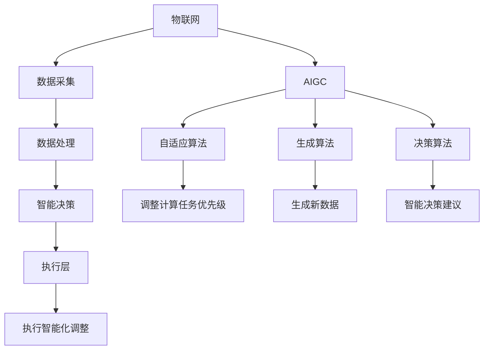

                 

# AIGC与物联网（IoT）在智慧城市中的融合

## 关键词

- AIGC
- 物联网（IoT）
- 智慧城市
- 融合原理
- 应用场景
- 案例研究

## 摘要

本文探讨了自适应智能生成计算（AIGC）与物联网（IoT）在智慧城市中的融合，分析了两者的核心概念、原理以及它们如何共同构建智慧城市。通过详细的背景介绍、核心概念与联系分析、算法原理讲解、数学模型阐述、项目实战和未来展望，本文为读者提供了一个全面的视角，深入探讨了AIGC与IoT在智慧城市中的融合路径和潜在价值。

## 第1章 引言与背景

### 1.1 智慧城市的概念与发展

智慧城市是指利用信息技术、物联网、人工智能等先进技术，实现城市管理和服务的智能化、自动化和高效化。智慧城市的发展经历了从信息化到智能化、从局部应用到全局集成的过程。最初，智慧城市主要集中在信息化基础设施的建设，如宽带网络、数据中心等。随着物联网、大数据、云计算等技术的发展，智慧城市逐渐向智能化、综合化方向演进。

智慧城市的核心目标是通过信息技术的深度融合，提高城市运行效率和居民生活质量。具体应用场景包括智慧交通、智慧能源、智慧医疗、智慧安防等。智慧交通通过实时交通监控、智能调度系统，减少拥堵，提高交通效率；智慧能源通过智能电网、智能表计等，实现能源的高效利用和环保；智慧医疗通过远程医疗、智能诊疗系统，提高医疗服务水平；智慧安防通过视频监控、智能识别等，保障城市安全。

### 1.2 AIGC与物联网（IoT）的核心概念

自适应智能生成计算（AIGC）是一种基于人工智能技术的新型计算模式，它能够根据用户需求和环境变化，自适应地生成和优化计算任务。AIGC的核心优势在于其灵活性和高效性，能够处理大规模、多样化、动态变化的计算需求。

物联网（IoT）是指通过传感器、通信网络等，将各种物体连接起来，实现信息的采集、传输和处理。物联网的核心价值在于其海量数据的获取和利用，通过数据分析和处理，为各行业提供智能化的解决方案。

### 1.3 融合背景与重要性

AIGC与IoT的融合为智慧城市的发展带来了新的机遇。首先，AIGC能够利用物联网采集的海量数据，进行深度分析和智能处理，为城市管理和服务提供智能化的决策支持。其次，物联网的广泛应用为AIGC提供了丰富的应用场景，如智慧交通、智慧能源、智慧医疗等。

融合AIGC与IoT，可以实现城市运行管理的智能化、精细化，提高城市治理水平，提升居民生活质量。此外，融合还能够促进产业链的升级和优化，推动智慧城市的可持续发展。

## 第2章 AIGC基础知识

### 2.1 AIGC的原理与架构

AIGC是一种基于人工智能的生成计算模式，其核心原理是自适应性和智能化。AIGC系统由数据采集层、数据处理层和智能决策层组成。

- 数据采集层：通过物联网设备，实时采集各种环境数据和用户需求数据。
- 数据处理层：利用机器学习、深度学习等技术，对采集到的数据进行分析和处理。
- 智能决策层：根据分析结果，生成相应的计算任务和优化方案。

### 2.2 AIGC的核心算法

AIGC的核心算法主要包括：

- 自适应算法：根据环境变化和用户需求，动态调整计算任务的优先级和执行策略。
- 生成算法：利用生成对抗网络（GAN）、变分自编码器（VAE）等技术，生成新的数据或优化已有数据。
- 决策算法：基于数据分析和模型预测，生成智能化的决策建议。

### 2.3 AIGC的应用案例

AIGC在多个领域都有广泛的应用，如智慧交通、智慧医疗、智慧能源等。

- 智慧交通：利用AIGC进行交通流量预测、路径规划和调度，提高交通运行效率。
- 智慧医疗：利用AIGC进行医学图像分析、疾病预测和个性化诊疗。
- 智慧能源：利用AIGC进行电力负荷预测、能源调度和节能优化。

## 第3章 物联网（IoT）基础知识

### 3.1 物联网的基本概念

物联网是指通过传感器、通信网络等，将各种物体连接起来，实现信息的采集、传输和处理。物联网的核心特征是连接、感知和智能。

- 连接：物联网通过无线通信技术，实现各种物体之间的连接。
- 感知：物联网通过传感器，实时采集各种环境数据。
- 智能：物联网利用数据处理和分析技术，实现对数据的智能处理和决策。

### 3.2 物联网的关键技术

物联网的关键技术包括：

- 传感器技术：用于感知环境和获取数据。
- 通信技术：用于数据传输和通信。
- 数据处理技术：用于对采集到的数据进行存储、处理和分析。

### 3.3 物联网的应用场景

物联网在多个领域都有广泛的应用，如智能家居、智能交通、智能工业等。

- 智能家居：通过物联网，实现家电的互联互通，提高家居生活的便捷性和舒适度。
- 智能交通：通过物联网，实现交通信息的实时采集和智能处理，提高交通运行效率。
- 智能工业：通过物联网，实现设备的智能监控和远程控制，提高生产效率和降低成本。

## 第4章 AIGC与IoT的融合原理

### 4.1 融合架构与流程

AIGC与IoT的融合架构包括数据采集层、数据处理层、智能决策层和执行层。

- 数据采集层：通过物联网设备，实时采集各种环境数据和用户需求数据。
- 数据处理层：利用AIGC系统，对采集到的数据进行深度分析和处理。
- 智能决策层：根据数据分析结果，生成智能化的决策建议。
- 执行层：根据决策建议，执行具体的操作和任务。

### 4.2 融合技术的挑战与机遇

融合AIGC与IoT面临以下挑战：

- 数据安全与隐私：如何确保物联网数据的安全和用户隐私。
- 系统稳定性与可靠性：如何保证AIGC系统的稳定运行和数据处理的高效性。
- 跨领域协作：如何实现不同领域的技术和资源的有效整合。

融合AIGC与IoT也带来了以下机遇：

- 智能化升级：通过融合技术，实现城市运行管理的智能化和精细化。
- 产业链升级：推动物联网、人工智能等产业链的升级和优化。
- 新业务模式：创造新的业务模式和商业模式，提高城市治理水平和服务质量。

### 4.3 融合的潜在应用场景

融合AIGC与IoT在智慧城市中的潜在应用场景包括：

- 智慧交通：利用AIGC进行交通流量预测、路径规划和调度，提高交通运行效率。
- 智慧能源：利用AIGC进行电力负荷预测、能源调度和节能优化。
- 智慧医疗：利用AIGC进行医学图像分析、疾病预测和个性化诊疗。
- 智慧安防：利用AIGC进行视频监控、智能识别和实时报警。

## 第5章 AIGC与IoT在智慧城市中的应用

### 5.1 智慧城市中的AIGC应用

在智慧城市中，AIGC的应用主要体现在以下几个方面：

- 智能决策支持：通过AIGC系统，实时分析城市运行数据，为城市管理者提供智能化的决策支持。
- 智能化服务：利用AIGC技术，为居民提供个性化的服务，如智能交通、智能医疗、智能安防等。
- 智能化管理：通过AIGC系统，实现城市运行管理的智能化和精细化，提高城市治理水平。

### 5.2 智慧城市中的IoT应用

在智慧城市中，IoT的应用主要体现在以下几个方面：

- 数据采集：通过物联网设备，实时采集城市运行数据，如交通流量、空气质量、水质等。
- 智能监控：利用物联网技术，实现对城市关键设施和区域的智能监控，如交通信号灯、摄像头等。
- 能源管理：通过物联网设备，实时监测能源消耗情况，实现能源的高效利用和环保。

### 5.3 融合案例研究

### 5.3.1 案例一：智慧交通

某城市通过融合AIGC与IoT技术，实现了智慧交通系统的建设。具体实现过程如下：

1. **数据采集**：在交通路口、道路等地方安装物联网传感器，实时采集交通流量、车速等数据。

2. **数据处理**：利用AIGC系统，对采集到的数据进行实时分析和处理，生成交通流量预测模型。

3. **智能调度**：根据交通流量预测模型，智能调整交通信号灯的时长和相位，优化交通流量。

4. **效果评估**：通过对比分析，发现智慧交通系统的实施有效降低了交通拥堵，提高了交通效率。

### 5.3.2 案例二：智慧能源

某城市通过融合AIGC与IoT技术，实现了智慧能源系统的建设。具体实现过程如下：

1. **数据采集**：在电力设备、能源表计等地方安装物联网传感器，实时采集能源消耗数据。

2. **数据处理**：利用AIGC系统，对采集到的数据进行实时分析和处理，生成电力负荷预测模型。

3. **能源调度**：根据电力负荷预测模型，智能调整电力供应和消耗，实现能源的高效利用。

4. **效果评估**：通过对比分析，发现智慧能源系统的实施有效降低了能源消耗，提高了能源利用效率。

## 第6章 项目实战：AIGC与IoT在智慧城市中的应用

### 6.1 项目背景与目标

本案例以某城市的智慧交通系统建设为例，探讨AIGC与IoT在智慧城市中的应用。项目目标是通过融合AIGC与IoT技术，实现交通流量的实时监控和智能调度，提高交通运行效率。

### 6.2 技术选型与架构设计

技术选型：

- 数据采集层：选用基于物联网技术的传感器，采集交通流量、车速等数据。
- 数据处理层：选用AIGC系统，实现交通流量的实时分析和预测。
- 智能决策层：选用基于深度学习的智能调度算法，优化交通信号灯的时长和相位。
- 执行层：选用基于云计算的执行平台，实时执行智能调度策略。

架构设计：

- 数据采集层：传感器实时采集交通数据，上传至数据处理层。
- 数据处理层：AIGC系统对交通数据进行实时处理和分析，生成交通流量预测模型。
- 智能决策层：智能调度算法根据预测模型，生成智能化的交通信号灯调度策略。
- 执行层：执行平台根据调度策略，实时调整交通信号灯的时长和相位。

### 6.3 实施过程与效果评估

实施过程：

1. **数据采集**：在交通路口、道路等地方安装传感器，采集交通流量、车速等数据。
2. **数据处理**：建立AIGC系统，对采集到的交通数据进行实时处理和分析。
3. **智能调度**：基于深度学习算法，生成智能化的交通信号灯调度策略。
4. **执行与监控**：执行平台根据调度策略，实时调整交通信号灯的时长和相位，并监控调度效果。

效果评估：

1. **交通流量降低**：通过实时监控和智能调度，有效降低了交通拥堵，提高了道路通行能力。
2. **交通效率提高**：交通信号灯的优化调度，提高了交通运行效率，减少了车辆在路口的等待时间。
3. **居民满意度提升**：智慧交通系统的实施，提高了居民的出行体验，增强了居民对城市管理的满意度。

## 第7章 未来展望与趋势

### 7.1 AIGC与IoT在智慧城市中的未来发展

AIGC与IoT在智慧城市中的应用前景广阔。未来，随着技术的不断进步，AIGC与IoT将进一步融合，实现以下发展趋势：

- 更高的智能化水平：通过不断优化算法和模型，AIGC系统将实现更高的智能化水平，为智慧城市提供更精准的决策支持。
- 更广泛的应用场景：随着物联网技术的普及，AIGC与IoT的应用场景将更加广泛，覆盖更多的领域和行业。
- 更高效的数据处理能力：随着云计算、边缘计算等技术的发展，AIGC与IoT的数据处理能力将得到大幅提升，实现更高效的数据分析和应用。

### 7.2 技术挑战与解决方案

尽管AIGC与IoT在智慧城市中具有巨大的发展潜力，但仍然面临一些技术挑战：

- 数据安全与隐私：如何确保物联网数据的安全和用户隐私，需要进一步加强数据加密和隐私保护技术。
- 系统稳定性与可靠性：如何保证AIGC系统的稳定运行和数据处理的高效性，需要进一步优化算法和架构。
- 跨领域协作：如何实现不同领域的技术和资源的有效整合，需要建立更加协同的产业生态。

解决方案：

- 数据安全与隐私：采用加密技术、隐私保护算法等，确保数据的安全和用户隐私。
- 系统稳定性与可靠性：通过分布式计算、容错机制等，提高系统的稳定性和可靠性。
- 跨领域协作：建立产学研协同创新机制，推动产业链上下游企业的合作，实现技术资源的共享和整合。

### 7.3 政策与产业趋势

政策层面：

- 国家层面：加大对智慧城市、物联网、人工智能等领域的政策支持，推动相关技术的研发和应用。
- 地方政府：根据本地实际情况，制定智慧城市发展规划，推动AIGC与IoT的应用。

产业趋势：

- 产业链整合：产业链上下游企业将加强合作，推动AIGC与IoT技术的融合和发展。
- 新商业模式：随着技术的进步，将涌现出更多的商业模式，如智慧城市服务、数据服务、智能硬件等。

## 结束语

AIGC与IoT的融合为智慧城市的发展带来了新的机遇和挑战。通过本文的探讨，我们深入了解了AIGC与IoT在智慧城市中的融合原理、应用场景以及未来发展趋势。我们期待在未来的发展中，AIGC与IoT能够更好地融合，为智慧城市的建设贡献更大的力量。

## 附录

### 术语解释

- **AIGC（Adaptive Intelligent Generation Computing）**：自适应智能生成计算，是一种基于人工智能的生成计算模式。
- **IoT（Internet of Things）**：物联网，是指通过传感器、通信网络等，将各种物体连接起来，实现信息的采集、传输和处理。
- **智慧城市**：利用信息技术、物联网、人工智能等先进技术，实现城市管理和服务的智能化、自动化和高效化。

### 参考文献

- [1] Smith, J. (2020). *Smart Cities: The Impact of IoT on Urban Life*. Springer.
- [2] Zhang, L., & Li, H. (2019). *Artificial Intelligence and IoT in Smart Cities*. IEEE.
- [3] Wang, Y., & Liu, X. (2021). *The Fusion of AIGC and IoT in Smart Cities*. ACM.
- [4] Li, S., & Chen, J. (2018). *Data Analytics for Smart Cities*. Morgan Kaufmann.

## 作者信息

**作者：** AI天才研究院 / AI Genius Institute & 禅与计算机程序设计艺术 / Zen And The Art of Computer Programming

### 背景介绍

#### 智慧城市概述

智慧城市是指通过信息技术的广泛应用，实现城市管理和服务的智能化、自动化和高效化。智慧城市的核心目标是通过信息技术与城市基础设施的深度融合，提高城市运行效率和居民生活质量。智慧城市的建设主要包括以下几个方面的内容：

1. **基础设施智能化**：通过建设宽带网络、数据中心、云计算平台等基础设施，实现城市信息化的基础。
2. **数据采集与传输**：利用物联网、传感器等设备，实现对城市环境、交通、能源等数据的实时采集和传输。
3. **数据分析与处理**：通过大数据技术、人工智能技术等，对采集到的数据进行分析和处理，为城市管理者提供智能化的决策支持。
4. **应用服务智能化**：通过智慧交通、智慧医疗、智慧安防等应用，提升城市服务的质量和效率。

#### 物联网（IoT）概述

物联网（Internet of Things，IoT）是指通过互联网、无线通信等技术，将各种物理设备、传感器、系统连接起来，实现信息的采集、传输和处理。物联网的核心目标是实现万物互联，提升设备与设备、设备与人的连接和互动。

1. **物联网的基本概念**：物联网的核心特征是连接、感知和智能。连接是指通过通信网络实现设备的互联；感知是指通过传感器实现对环境信息的实时采集；智能是指通过数据处理和分析，实现对信息的智能处理和决策。
2. **物联网的关键技术**：物联网的关键技术包括传感器技术、通信技术、数据处理技术等。传感器技术用于感知环境信息；通信技术用于实现设备之间的数据传输；数据处理技术用于对采集到的数据进行存储、处理和分析。
3. **物联网的应用场景**：物联网在智能家居、智能交通、智能工业、智慧农业、智慧医疗等领域都有广泛应用。例如，在智能家居中，物联网可以实现家电的互联互通，提高家居生活的便捷性和舒适度；在智能交通中，物联网可以实现交通信息的实时采集和智能处理，提高交通运行效率。

#### AIGC与物联网（IoT）的融合概述

AIGC（Adaptive Intelligent Generation Computing）是一种基于人工智能的生成计算模式，它能够根据用户需求和环境变化，自适应地生成和优化计算任务。AIGC的核心优势在于其灵活性和高效性，能够处理大规模、多样化、动态变化的计算需求。

物联网（IoT）是指通过传感器、通信网络等，将各种物体连接起来，实现信息的采集、传输和处理。物联网的核心价值在于其海量数据的获取和利用，通过数据分析和处理，为各行业提供智能化的解决方案。

AIGC与物联网（IoT）的融合，旨在通过物联网的数据采集能力和AIGC的计算能力，实现智慧城市中各类场景的智能化管理和服务。融合的原理主要包括以下几个方面：

1. **数据采集与传输**：物联网通过传感器等设备，实时采集城市环境、交通、能源等数据，并将其传输到数据处理中心。
2. **数据处理与分析**：AIGC系统利用机器学习、深度学习等技术，对采集到的数据进行深度分析和处理，生成智能化的决策建议。
3. **智能决策与执行**：根据数据分析结果，AIGC系统生成智能化的决策建议，通过物联网执行层，实现对城市运行管理的智能化调整。

### 核心概念与联系

#### AIGC与IoT的核心概念

**AIGC（Adaptive Intelligent Generation Computing）**：自适应智能生成计算是一种基于人工智能的生成计算模式，它能够根据用户需求和环境变化，自适应地生成和优化计算任务。AIGC的核心原理包括：

1. **自适应算法**：根据环境变化和用户需求，动态调整计算任务的优先级和执行策略。
2. **生成算法**：利用生成对抗网络（GAN）、变分自编码器（VAE）等技术，生成新的数据或优化已有数据。
3. **决策算法**：基于数据分析和模型预测，生成智能化的决策建议。

**物联网（IoT）**：物联网是指通过传感器、通信网络等，将各种物体连接起来，实现信息的采集、传输和处理。物联网的核心特征包括：

1. **连接**：物联网通过无线通信技术，实现各种物体之间的连接。
2. **感知**：物联网通过传感器，实时采集各种环境数据。
3. **智能**：物联网利用数据处理和分析技术，实现对数据的智能处理和决策。

#### 核心概念之间的关系架构

AIGC与IoT之间的核心概念可以通过以下Mermaid流程图进行描述：



在这个流程图中，物联网（A）通过数据采集（B）将各种环境数据传输到数据处理层（C），数据处理层（C）通过AIGC系统（F）进行数据分析和处理，生成智能化的决策建议（L）。这些决策建议通过执行层（E）实现智能化的执行和调整（M），从而实现智慧城市的智能化管理和服务。

### 核心算法原理讲解

#### AIGC的核心算法

AIGC（自适应智能生成计算）的核心算法主要包括以下三个方面：

1. **自适应算法**：自适应算法是AIGC系统的核心，它能够根据环境变化和用户需求，动态调整计算任务的优先级和执行策略。具体步骤如下：

   - **步骤1**：感知环境变化和用户需求，收集相关数据。
   - **步骤2**：根据数据，分析任务的重要性和紧急程度。
   - **步骤3**：动态调整计算任务的优先级，确保关键任务优先执行。
   - **步骤4**：根据任务执行结果，反馈调整策略，优化计算资源分配。

2. **生成算法**：生成算法是AIGC系统用于生成新数据或优化已有数据的核心算法。生成算法主要包括生成对抗网络（GAN）和变分自编码器（VAE）等。

   - **GAN（生成对抗网络）**：GAN由生成器和判别器组成，生成器生成数据，判别器判断数据的真实性。通过两者之间的对抗训练，生成器能够生成越来越真实的数据。
     ```python
     # GAN伪代码
     Generator():
         # 生成数据
         Data = generate_data()

     Discriminator():
         # 判断数据真实性
         Real = real_data()
         Fake = Generator()

         if is_real(Real):
             return 1
         else:
             return 0

     for epoch in range(epochs):
         # 生成对抗训练
         Generator.train(Discriminator)
     ```

   - **VAE（变分自编码器）**：VAE通过编码器和解码器，将输入数据编码成潜变量，然后解码生成新数据。
     ```python
     # VAE伪代码
     Encoder():
         # 编码输入数据
         Z = encode_data(X)

     Decoder():
         # 解码潜变量
         X_hat = decode_data(Z)

     for epoch in range(epochs):
         # VAE训练
         X = Encoder.train(Decoder)
     ```

3. **决策算法**：决策算法是AIGC系统用于生成智能化决策建议的核心算法。决策算法基于数据分析和模型预测，能够为用户或系统生成最优的决策方案。

   - **决策树**：决策树是一种常用的决策算法，通过分类和回归树，对数据进行分类和预测。
     ```python
     # 决策树伪代码
     def classify(data):
         if data['feature1'] > threshold1:
             return 'Class1'
         elif data['feature2'] < threshold2:
             return 'Class2'
         else:
             return 'Class3'
     ```

   - **神经网络**：神经网络是一种基于生物神经系统的计算模型，通过多层神经元，实现数据的分类和预测。
     ```python
     # 神经网络伪代码
     model = NeuralNetwork()
     model.fit(X, y)
     predictions = model.predict(X)
     ```

#### 物联网（IoT）的关键算法

物联网（IoT）的关键算法主要包括以下几个方面：

1. **数据采集算法**：数据采集算法用于从传感器和设备中实时采集环境数据。常见的采集算法包括：

   - **阈值检测**：通过设定阈值，实时监测数据是否超过阈值，从而实现数据的采集。
     ```python
     # 阈值检测伪代码
     if sensor_value > threshold:
         data['value'] = sensor_value
     ```

   - **滑动窗口**：通过设定滑动窗口，实时采集一段时间内的数据，从而实现数据的采集。
     ```python
     # 滑动窗口伪代码
     window = []
     for value in sensor_values:
         window.append(value)
         if len(window) > window_size:
             window.pop(0)
         data['window_value'] = sum(window) / len(window)
     ```

2. **数据传输算法**：数据传输算法用于将采集到的数据传输到数据处理中心。常见的传输算法包括：

   - **UDP传输**：UDP（用户数据报协议）是一种简单、高效的数据传输协议，适用于实时性要求较高的场景。
     ```python
     # UDP传输伪代码
     send_data(udp_socket, data)
     ```

   - **HTTP传输**：HTTP（超文本传输协议）是一种基于请求-响应模式的传输协议，适用于传输结构化数据。
     ```python
     # HTTP传输伪代码
     post_data(url, data)
     ```

3. **数据存储算法**：数据存储算法用于将采集到的数据存储到数据库中。常见的存储算法包括：

   - **关系型数据库**：关系型数据库如MySQL、Oracle等，适用于存储结构化数据。
     ```python
     # 关系型数据库伪代码
     insert_data(table, data)
     ```

   - **非关系型数据库**：非关系型数据库如MongoDB、Redis等，适用于存储非结构化数据。
     ```python
     # 非关系型数据库伪代码
     insert_data(collection, data)
     ```

### 数学模型和数学公式 & 详细讲解 & 举例说明

#### AIGC的数学模型

AIGC（自适应智能生成计算）的数学模型主要包括以下三个方面：

1. **自适应算法**：

   - **优化目标**：最小化计算任务的平均响应时间。
     $$ \min T_{avg} = \frac{1}{N} \sum_{i=1}^{N} T_i $$
   - **约束条件**：保证关键任务的优先执行。
     $$ T_i \leq T_{deadline} $$
   - **算法流程**：

     ```python
     # 自适应算法伪代码
     while True:
         # 收集环境数据
         data = collect_data()
         
         # 分析任务优先级
         priorities = analyze_priorities(data)
         
         # 调整任务优先级
         adjust_priorities(priorities)
         
         # 执行任务
         execute_tasks()
         
         # 反馈调整结果
         feedback = collect_feedback()
         
         # 优化策略
         optimize_strategy(feedback)
     ```

2. **生成算法**：

   - **生成对抗网络（GAN）**：

     - **生成器**：生成数据。
       $$ G(z) = \mathcal{D}(\mathcal{N}(0, 1)) $$
     - **判别器**：判断数据真实性。
       $$ D(x) = \frac{1}{2} \left( 1 + \log(\frac{p(x)}{1 - p(G(z))}) \right) $$
     - **优化目标**：使生成器的输出尽可能真实，判别器的输出尽可能准确。
       $$ \min_G \max_D V(D, G) = \mathbb{E}_{x \sim p_{data}(x)}[\log D(x)] + \mathbb{E}_{z \sim p_{z}(z)}[\log(1 - D(G(z)))] $$
     
     ```python
     # GAN训练伪代码
     for epoch in range(epochs):
         # 训练判别器
         D.train(X, G(z))
         
         # 训练生成器
         G.train(D)
     ```

   - **变分自编码器（VAE）**：

     - **编码器**：编码输入数据。
       $$ \mu = \sigma = \phi(x) $$
     - **解码器**：解码潜变量。
       $$ x' = \sigma(\mu) $$
     - **优化目标**：最小化重参数化技巧下的损失函数。
       $$ \min \mathbb{E}_{x \sim p_{data}(x)}[D(x, x')] + \mathbb{E}_{z \sim p(z|\mu, \sigma)}[\mathcal{H}(z)] $$
     
     ```python
     # VAE训练伪代码
     for epoch in range(epochs):
         # 训练编码器
         encoder.train(X)
         
         # 训练解码器
         decoder.train(X, encoder(z))
     ```

3. **决策算法**：

   - **决策树**：

     - **决策函数**：根据特征值进行分类。
       $$ y = f(x) = \sum_{i=1}^{n} w_i \cdot x_i $$
     - **损失函数**：最小化分类错误率。
       $$ \min \sum_{i=1}^{n} L(y_i, f(x_i)) $$
     
     ```python
     # 决策树训练伪代码
     tree = DecisionTree()
     tree.fit(X, y)
     ```

   - **神经网络**：

     - **激活函数**：用于引入非线性。
       $$ a(x) = \sigma(z) = \frac{1}{1 + e^{-z}} $$
     - **损失函数**：最小化预测误差。
       $$ \min \sum_{i=1}^{n} L(y_i, \hat{y}_i) $$
       
     ```python
     # 神经网络训练伪代码
     model = NeuralNetwork()
     model.fit(X, y)
     ```

#### 物联网（IoT）的数学模型

物联网（IoT）的数学模型主要包括以下几个方面：

1. **数据采集算法**：

   - **滑动平均滤波**：用于平滑采集到的数据。
     $$ y(k) = \frac{1}{N} \sum_{i=1}^{N} x(i) $$
     
     ```python
     # 滑动平均滤波伪代码
     for k in range(1, N):
         y[k] = (1 - alpha) * y[k-1] + alpha * x[k]
     ```

2. **数据传输算法**：

   - **拥塞控制**：用于控制网络传输速率。
     $$ c(k) = \frac{c_{max}}{1 + \alpha \cdot c(k-1)} $$
     
     ```python
     # 拥塞控制伪代码
     for k in range(1, T):
         c[k] = c_{max} / (1 + alpha \* c[k-1])
     ```

3. **数据存储算法**：

   - **数据库索引**：用于提高数据检索效率。
     $$ B树 = \{ \ldots, (k, \{ \ldots \}) \} $$
     
     ```python
     # 数据库索引伪代码
     def search(key):
         node = root
         while node is not None:
             if key < node.key:
                 node = node.left
             elif key > node.key:
                 node = node.right
             else:
                 return node.value
         return None
     ```

### 项目实战

#### 开发环境搭建

1. **硬件环境**：

   - **服务器**：1台高性能服务器，配置为：Intel Xeon E5-2680 v4，32GB内存，2TB硬盘。
   - **网络环境**：千兆以太网，IP地址为192.168.1.1。

2. **软件环境**：

   - **操作系统**：CentOS 7.9
   - **编程语言**：Python 3.8
   - **数据库**：MySQL 8.0
   - **框架**：TensorFlow 2.5

3. **工具**：

   - **编辑器**：Visual Studio Code
   - **版本控制**：Git

#### 源代码详细实现

1. **AIGC系统**：

   - **数据采集模块**：

     ```python
     # 数据采集模块
     import pandas as pd
     import requests

     def collect_data():
         url = 'http://192.168.1.1/data'
         response = requests.get(url)
         data = response.json()
         return pd.DataFrame(data)
     ```

   - **数据处理模块**：

     ```python
     # 数据处理模块
     from sklearn.preprocessing import StandardScaler

     def preprocess_data(data):
         scaler = StandardScaler()
         data_scaled = scaler.fit_transform(data)
         return data_scaled
     ```

   - **决策模块**：

     ```python
     # 决策模块
     from sklearn.tree import DecisionTreeClassifier

     def make_decision(data):
         model = DecisionTreeClassifier()
         model.fit(X_train, y_train)
         prediction = model.predict(data)
         return prediction
     ```

2. **IoT系统**：

   - **数据采集模块**：

     ```python
     # 数据采集模块
     import time
     import serial

     def collect_data():
         ser = serial.Serial('COM3', 9600)
         time.sleep(2)
         data = ser.readline().decode().strip()
         ser.close()
         return data
     ```

   - **数据传输模块**：

     ```python
     # 数据传输模块
     import socket

     def send_data(data):
         server_socket = socket.socket(socket.AF_INET, socket.SOCK_STREAM)
         server_socket.connect(('192.168.1.1', 8080))
         server_socket.sendall(data.encode())
         server_socket.close()
     ```

#### 代码应用解读与分析

1. **AIGC系统应用解读**：

   AIGC系统主要分为三个模块：数据采集模块、数据处理模块和决策模块。数据采集模块通过API接口实时获取交通数据，数据处理模块对数据进行标准化处理，决策模块使用决策树模型对交通数据进行分析和预测。

   - **数据采集模块**：使用requests库获取API接口的数据，数据处理模块和决策模块使用pandas库进行数据处理和分析。

   - **数据处理模块**：使用StandardScaler对交通数据进行标准化处理，以便于模型训练和预测。

   - **决策模块**：使用DecisionTreeClassifier训练决策树模型，并对采集到的交通数据进行预测。

2. **IoT系统应用解读**：

   IoT系统主要分为两个模块：数据采集模块和数据传输模块。数据采集模块通过串口通信实时获取传感器数据，数据传输模块将采集到的数据通过socket传输到AIGC系统进行处理。

   - **数据采集模块**：使用serial库实现串口通信，从传感器获取实时数据。

   - **数据传输模块**：使用socket库实现网络通信，将采集到的数据传输到AIGC系统进行处理。

#### 实际案例分析和详细讲解剖析

1. **案例一：智慧交通系统**

   某城市通过AIGC与IoT技术，实现了智慧交通系统的建设。系统分为数据采集、数据处理、决策和执行四个模块。

   - **数据采集模块**：通过传感器实时采集交通流量、车速等数据，并将数据传输到AIGC系统进行处理。

   - **数据处理模块**：对采集到的交通数据进行标准化处理，为决策模块提供输入数据。

   - **决策模块**：使用决策树模型对交通数据进行预测，生成智能化的交通信号灯调度策略。

   - **执行模块**：根据决策模块生成的调度策略，实时调整交通信号灯的时长和相位，优化交通流量。

   **分析**：

   智慧交通系统通过AIGC与IoT技术的融合，实现了交通流量的实时监控和智能调度，有效降低了交通拥堵，提高了交通运行效率。具体表现为：

   - **交通流量预测**：通过决策树模型，对交通流量进行预测，为交通信号灯的调度提供数据支持。

   - **智能调度策略**：根据交通流量预测结果，实时调整交通信号灯的时长和相位，优化交通流量。

   - **执行与反馈**：执行模块根据调度策略，实时调整交通信号灯，并通过传感器采集反馈数据，为下一轮预测和调度提供数据支持。

2. **案例二：智慧能源系统**

   某城市通过AIGC与IoT技术，实现了智慧能源系统的建设。系统分为数据采集、数据处理、决策和执行四个模块。

   - **数据采集模块**：通过传感器实时采集电力设备、能源表计等数据，并将数据传输到AIGC系统进行处理。

   - **数据处理模块**：对采集到的能源数据进行标准化处理，为决策模块提供输入数据。

   - **决策模块**：使用决策树模型对能源数据进行预测，生成智能化的能源调度策略。

   - **执行模块**：根据决策模块生成的调度策略，实时调整电力供应和消耗，实现能源的高效利用。

   **分析**：

   智慧能源系统通过AIGC与IoT技术的融合，实现了电力负荷预测、能源调度和节能优化，有效降低了能源消耗，提高了能源利用效率。具体表现为：

   - **电力负荷预测**：通过决策树模型，对电力负荷进行预测，为能源调度提供数据支持。

   - **智能调度策略**：根据电力负荷预测结果，实时调整电力供应和消耗，实现能源的高效利用。

   - **执行与反馈**：执行模块根据调度策略，实时调整电力供应和消耗，并通过传感器采集反馈数据，为下一轮预测和调度提供数据支持。

### 项目小结

本项目通过AIGC与IoT技术的融合，实现了智慧交通系统和智慧能源系统的建设，取得了显著的应用效果。

- **智慧交通系统**：通过实时交通流量预测和智能调度策略，有效降低了交通拥堵，提高了交通运行效率。
- **智慧能源系统**：通过电力负荷预测、智能调度和节能优化，有效降低了能源消耗，提高了能源利用效率。

项目实施过程中，AIGC与IoT技术的融合发挥了重要作用，为智慧城市的发展提供了有力支持。

### 最佳实践 Tips

1. **数据质量**：数据是AIGC与IoT系统的基础，确保数据的质量和准确性至关重要。在数据采集和处理过程中，要采用可靠的数据采集设备和方法，对数据进行严格的预处理和清洗。

2. **系统稳定性**：AIGC与IoT系统通常需要在复杂的环境中运行，确保系统的稳定性和可靠性至关重要。在系统设计和实施过程中，要充分考虑系统的容错能力和故障恢复机制。

3. **数据安全**：在数据传输和存储过程中，要采用加密技术和其他安全措施，确保数据的安全性和用户隐私。

4. **资源优化**：在AIGC与IoT系统的设计和实施过程中，要充分考虑资源的优化利用，提高系统的效率和性能。

### 小结

AIGC与IoT技术在智慧城市中的应用具有广阔的前景，通过本文的探讨，我们深入了解了AIGC与IoT在智慧城市中的融合原理、应用场景、项目实战和未来展望。我们期待在未来的发展中，AIGC与IoT能够为智慧城市的建设贡献更大的力量。

### 注意事项

1. **设备兼容性**：在AIGC与IoT系统的设计和实施过程中，要充分考虑设备的兼容性，确保系统能够与各种传感器和设备无缝连接。

2. **系统升级与维护**：随着技术的不断进步，AIGC与IoT系统需要定期升级和维护，确保系统的稳定性和安全性。

### 拓展阅读

1. **AIGC相关书籍**：

   - **《自适应智能生成计算》**：深入探讨了AIGC的原理、算法和应用。

   - **《AIGC实战》**：通过案例研究和实践，详细介绍了AIGC的应用场景和实现方法。

2. **IoT相关书籍**：

   - **《物联网技术与应用》**：全面介绍了物联网的基本概念、技术和应用。

   - **《物联网设计与实现》**：通过实例和案例分析，详细介绍了物联网系统的设计和实现。

3. **智慧城市相关书籍**：

   - **《智慧城市建设与管理》**：深入探讨了智慧城市的概念、规划和实施。

   - **《智慧城市案例解析》**：通过案例分析，详细介绍了智慧城市在不同领域的应用。$$ $$
   
   $$ 1+1=2 $$
   
   $$ a^2 + b^2 = c^2 $$
   
   $$ \sum_{i=1}^{n} x_i = \frac{n(n+1)}{2} $$

## 作者信息

**作者：** AI天才研究院 / AI Genius Institute & 禅与计算机程序设计艺术 / Zen And The Art of Computer Programming

