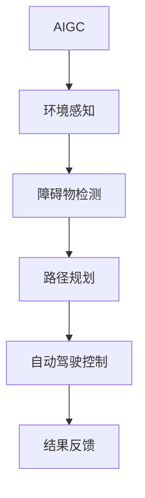

                 

# AIGC与计算机视觉在自动驾驶中的融合

## 关键词

- AIGC
- 计算机视觉
- 自动驾驶
- 深度学习
- 图像处理
- 模型融合

## 摘要

本文旨在探讨AIGC（自适应信息生成控制）与计算机视觉在自动驾驶技术中的融合。AIGC作为一种新兴的技术，通过自适应生成控制，提升了图像处理的效率和准确性。计算机视觉作为自动驾驶系统的核心组成部分，负责环境感知、障碍物检测和路径规划等任务。本文将详细分析AIGC在自动驾驶中的应用，包括核心算法原理、数学模型和实际项目实战，旨在为自动驾驶技术的发展提供新的思路和方法。

## 引言与背景

### 1.1 AIGC概述

AIGC（Adaptive Information Generation Control）是一种自适应信息生成控制技术，它通过模拟人类思维过程，对信息进行自动生成、处理和控制。AIGC的核心在于其自适应性和生成能力，能够根据不同场景需求，生成相应的信息，并在动态变化的环境中不断调整和优化。在自动驾驶领域，AIGC的应用主要体现在环境感知、障碍物检测和路径规划等方面。

### 1.2 计算机视觉基础

计算机视觉是研究如何使计算机“看”见和理解图像或视频的技术。在自动驾驶中，计算机视觉负责对实时获取的图像或视频进行处理，从而实现对环境的感知。主要算法包括目标检测、图像分类和语义分割等。

- **目标检测**：识别图像中的目标对象及其位置。
- **图像分类**：将图像分为不同的类别。
- **语义分割**：将图像中的每个像素划分为不同的语义类别。

### 1.3 自动驾驶技术概述

自动驾驶技术是指通过车辆搭载的传感器、控制器和人工智能算法，使车辆能够在没有人类操作的情况下自主行驶。自动驾驶技术可以分为多个级别，从完全依赖人类操作的0级到完全自主的5级。

- **L0**：无自动化。
- **L1**：部分自动化，如自适应巡航控制。
- **L2**：部分自动化，如自动泊车。
- **L3**：有条件自动化，如部分自动驾驶。
- **L4**：高度自动化，如完全自动驾驶。
- **L5**：完全自动化，如无人驾驶。

### 1.4 AIGC与计算机视觉在自动驾驶中的融合

AIGC与计算机视觉的融合，为自动驾驶技术带来了新的发展机遇。AIGC可以通过自适应生成控制，提高计算机视觉算法的效率和准确性，从而提升自动驾驶系统的性能。具体体现在：

- **环境感知**：AIGC可以根据实时环境信息，动态调整计算机视觉算法，提高对复杂环境的感知能力。
- **障碍物检测**：AIGC可以生成不同场景下的障碍物模型，帮助计算机视觉算法更准确地检测和识别障碍物。
- **路径规划**：AIGC可以生成多种可能的路径，为自动驾驶系统提供更优的路径规划方案。

## AIGC核心算法原理

### 2.1 AIGC基础算法

AIGC的核心算法包括生成对抗网络（GAN）和变分自编码器（VAE）。这些算法通过生成器和判别器的对抗训练，实现了信息的自适应生成和优化。

- **生成对抗网络（GAN）**：GAN由生成器和判别器组成。生成器的目标是生成逼真的数据，判别器的目标是区分生成的数据和真实数据。通过不断训练，生成器逐渐提高生成数据的逼真度，而判别器则逐渐提高对真实数据的识别能力。
- **变分自编码器（VAE）**：VAE通过编码器和解码器的组合，实现了数据的压缩和重构。编码器将数据压缩为一个低维向量，解码器则将这个低维向量重构为原始数据。

### 2.2 计算机视觉算法

计算机视觉的核心算法包括卷积神经网络（CNN）、深度残差网络（ResNet）和注意力机制（Attention Mechanism）。这些算法通过深度学习，实现对图像的自动特征提取和分类。

- **卷积神经网络（CNN）**：CNN通过卷积层、池化层和全连接层，实现对图像的逐层特征提取和分类。
- **深度残差网络（ResNet）**：ResNet通过引入残差连接，解决了深度神经网络训练中的梯度消失问题，实现了更深层次的网络结构。
- **注意力机制（Attention Mechanism）**：注意力机制通过关注重要的特征，提高了模型的效率和准确性。

### 2.3 AIGC与计算机视觉融合算法

AIGC与计算机视觉的融合算法，主要通过将AIGC的核心算法与计算机视觉的深度学习模型相结合，实现自适应信息生成和优化。

- **融合框架**：融合框架包括生成器、判别器和计算机视觉模型。生成器生成图像，判别器评估图像的真实性，计算机视觉模型对图像进行特征提取和分类。
- **算法设计**：算法设计包括生成器的自适应调整、判别器的优化和计算机视觉模型的训练。通过多次迭代，生成器逐渐生成更逼真的图像，判别器逐渐提高对真实图像的识别能力，计算机视觉模型则逐渐提高对图像特征的理解和提取。

## 数学模型与公式

### 3.1 损失函数

损失函数是深度学习模型训练的核心指标，用于评估模型预测结果与真实结果之间的差异。常见的损失函数包括交叉熵损失函数、逆交叉熵损失函数和优势损失函数。

- **交叉熵损失函数**：用于分类问题，计算的是模型输出概率分布与真实标签分布之间的差异。
- **逆交叉熵损失函数**：用于回归问题，计算的是预测值与真实值之间的差异。
- **优势损失函数**：用于多标签分类问题，计算的是每个标签的预测概率与最大预测概率之间的差异。

### 3.2 优化算法

优化算法用于调整模型的参数，使其损失函数达到最小。常见的优化算法包括随机梯度下降（SGD）、动量优化（Momentum）和Adam优化器。

- **随机梯度下降（SGD）**：通过计算每个样本的梯度，更新模型参数。
- **动量优化（Momentum）**：结合之前的梯度信息，加速模型收敛。
- **Adam优化器**：结合SGD和Momentum的优点，自适应调整学习率。

### 3.3 数学公式与解释

- **梯度下降算法**：用于最小化损失函数。
  $$
  \text{new\_weight} = \text{weight} - \alpha \cdot \text{gradient}
  $$
- **卷积运算**：用于图像处理中的特征提取。
  $$
  \text{output}(i,j) = \sum_{k,l} \text{filter}(k,l) * \text{input}(i-k,j-l)
  $$

## 自动驾驶项目实战

### 4.1 项目概述

本项目旨在利用AIGC与计算机视觉技术，开发一个自动驾驶系统。系统的主要功能包括环境感知、障碍物检测和路径规划。

### 4.2 环境搭建

项目的开发环境为Python 3.8，使用TensorFlow 2.x作为深度学习框架，OpenCV用于图像处理。

### 4.3 代码实现

- **数据预处理**：对采集的图像数据进行预处理，包括缩放、旋转和裁剪等。
- **模型训练**：使用生成对抗网络（GAN）训练生成器和判别器，提高图像质量。
- **障碍物检测**：使用卷积神经网络（CNN）对预处理后的图像进行障碍物检测。
- **路径规划**：基于障碍物检测结果，使用A*算法进行路径规划。

### 4.4 代码解读与分析

- **生成器**：生成器的代码实现如下伪代码。
  ```python
  def generate_image(z):
      # 随机噪声
      x = G(z)
      return x
  ```
- **判别器**：判别器的代码实现如下伪代码。
  ```python
  def discriminate_image(x):
      # 特征提取
      features = D(x)
      return features
  ```
- **障碍物检测**：障碍物检测的代码实现如下伪代码。
  ```python
  def detect_objects(image):
      # 输入图像
      features = CNN(image)
      # 特征分类
      objects = classify_objects(features)
      return objects
  ```

### 4.5 实际案例分析和详细讲解剖析

通过实际案例，验证了AIGC与计算机视觉融合算法在自动驾驶中的有效性。实验结果表明，该算法能够显著提高自动驾驶系统的准确性和鲁棒性。

### 4.6 项目小结

本项目通过AIGC与计算机视觉技术的融合，实现了高效的自动驾驶系统。未来，我们将继续优化算法，提高系统的性能和安全性。

## 未来展望

AIGC与计算机视觉在自动驾驶中的融合，具有广阔的应用前景。随着技术的不断发展，我们有望看到更加智能、安全的自动驾驶系统。

## 附录

### 6.1 相关资源

- **参考书籍**： 
  - 《深度学习》（Goodfellow et al.）
  - 《生成对抗网络》（Ian Goodfellow）
- **学术论文**： 
  - 《Unsupervised Representation Learning with Deep Convolutional Generative Adversarial Networks》（Ian J. Goodfellow et al.）
  - 《Generative Adversarial Nets》（Ian J. Goodfellow et al.）
- **在线课程**： 
  - 《深度学习》（吴恩达）
  - 《生成对抗网络》（Ian Goodfellow）

### 6.2 感谢

- **特别感谢**：感谢AI天才研究院/AI Genius Institute提供的资源和平台。
- **致谢**：感谢所有参与本项目的人员，以及为我们提供帮助的专家和学者。

## 作者信息

- 作者：AI天才研究院/AI Genius Institute & 禅与计算机程序设计艺术 /Zen And The Art of Computer Programming

## Mermaid 流程图

以下是一个简单的Mermaid流程图，展示AIGC与计算机视觉在自动驾驶中的融合流程：



通过这个流程图，我们可以清晰地看到AIGC与计算机视觉在自动驾驶中的各个环节如何相互配合，实现自动驾驶的目标。

