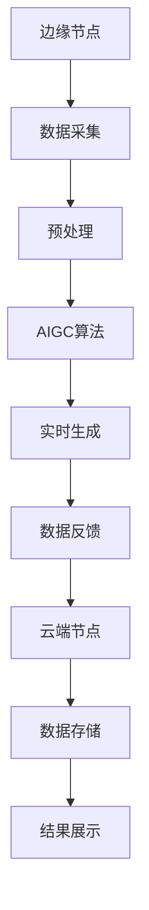

                 

### 文章标题

“AIGC与边缘计算在实时视频处理中的融合”

### 关键词

- AIGC
- 边缘计算
- 实时视频处理
- 融合架构
- 算法优化
- 模型训练
- 案例分析

### 摘要

本文深入探讨了AIGC（自适应智能生成控制）与边缘计算在实时视频处理中的融合应用。通过背景介绍、核心概念与联系阐述、算法原理讲解、数学模型与公式解析，以及项目实战与案例分析，本文系统地展示了AIGC与边缘计算在实时视频处理中的技术融合及其重要意义。文章最后提出了一些最佳实践建议，并对未来发展趋势进行了展望。本文旨在为读者提供一个全面、深入的技术指南，帮助理解并掌握这一领域的前沿技术。

## 第1章 AIGC与边缘计算概述

### 1.1 AIGC基本概念

AIGC（自适应智能生成控制）是一种基于人工智能的生成控制技术，旨在通过自适应学习和生成技术实现智能化内容创作。AIGC的核心在于利用机器学习模型，尤其是深度学习模型，对大量数据进行训练，以生成新的、符合特定需求的视频内容。AIGC的应用涵盖了视频生成、视频编辑、虚拟现实等多个领域，尤其在实时视频处理中表现出强大的潜力。

AIGC的主要特点包括：

- **自适应性**：能够根据用户需求和场景变化，自适应调整生成策略。
- **智能化**：通过机器学习，能够理解并模仿人类创造者的风格和技巧。
- **高效性**：能够快速生成高质量的视频内容，大幅提升内容创作效率。

#### AIGC的发展背景

随着人工智能技术的迅速发展，尤其是深度学习和生成对抗网络（GAN）的突破，AIGC技术得到了广泛关注。早期的研究主要集中在视频生成和编辑，但近年来，随着边缘计算等技术的崛起，AIGC开始被应用于实时视频处理，为实时视频分析提供了新的解决方案。

#### AIGC在实时视频处理中的应用

AIGC在实时视频处理中的应用主要包括：

- **视频内容理解**：通过深度学习模型，对实时视频内容进行实时分析，提取关键信息。
- **视频生成与编辑**：基于用户需求和场景，实时生成和编辑视频内容，实现个性化视频服务。

### 1.2 边缘计算概述

边缘计算是一种分布式计算架构，旨在将计算能力、数据处理和数据存储推向网络边缘，即靠近数据源的位置。边缘计算的核心在于将数据处理从云端转移到边缘节点，以降低网络延迟、提高数据处理效率和安全性。

边缘计算的主要特点包括：

- **低延迟**：数据处理在靠近数据源的地方进行，显著降低传输延迟。
- **高效性**：能够在边缘节点上实时处理大量数据，提升系统响应速度。
- **灵活性**：可以根据需求灵活部署计算资源，适应不同应用场景。

#### 边缘计算的发展背景

随着物联网、大数据和5G技术的快速发展，边缘计算成为解决实时数据处理需求的关键技术。与传统云计算相比，边缘计算能够更好地应对实时性、低延迟和高并发的要求，成为智能化视频处理领域的重要支撑。

#### 边缘计算在实时视频处理中的应用

边缘计算在实时视频处理中的应用主要包括：

- **实时视频分析**：在边缘节点上实时处理视频数据，进行人脸识别、行为分析等。
- **智能监控**：通过边缘计算实现智能监控，快速响应异常事件。
- **视频流优化**：在边缘节点上进行视频流压缩和优化，提升传输效率。

### 1.3 AIGC与边缘计算的联系

AIGC与边缘计算在实时视频处理中具有紧密的联系。一方面，AIGC需要大量的实时数据进行分析和生成，而边缘计算提供了高效的实时数据处理能力；另一方面，边缘计算的低延迟特性为AIGC提供了更好的应用场景，使得AIGC能够更灵活地适应实时视频处理需求。

#### 融合架构

AIGC与边缘计算的融合架构主要包括以下几个关键部分：

1. **边缘节点部署**：在边缘节点上部署AIGC算法，实现实时数据处理和生成。
2. **数据流管理**：设计高效的数据流管理机制，确保数据在边缘节点和云端之间的顺畅传输。
3. **协同计算**：通过边缘节点和云端节点的协同计算，实现高性能的实时视频处理。

#### Mermaid流程图

以下是AIGC与边缘计算融合架构的Mermaid流程图：



通过上述流程图，可以清晰地看到AIGC与边缘计算的融合架构及其工作流程。在接下来的章节中，我们将进一步深入探讨AIGC与边缘计算在实时视频处理中的核心算法原理、数学模型与项目实战，以帮助读者全面了解这一领域的前沿技术。

### 1.4 AIGC与边缘计算的融合优势

AIGC与边缘计算的融合在实时视频处理中展现出显著的优势，主要体现在以下几个方面：

#### 1. 高效性

边缘计算能够将数据处理和计算任务分散到靠近数据源的边缘节点上，减少数据传输的延迟和网络拥堵。结合AIGC技术，实时视频数据可以在边缘节点上进行高效的预处理和特征提取，使得后续的生成和编辑任务能够更快地完成。

#### 2. 实时性

边缘计算的低延迟特性与AIGC的自适应能力相结合，使得实时视频处理能够在毫秒级内完成。这对于需要实时响应的场景，如智能监控、远程医疗和自动驾驶等，至关重要。

#### 3. 灵活性

边缘计算允许在分布式网络中灵活地部署计算资源，使得AIGC可以根据不同场景和需求动态调整计算任务。例如，在人流密集的区域，可以部署更多计算资源以处理大量实时视频数据，而在人流稀少的地方，则可以减少计算资源的使用。

#### 4. 安全性

边缘计算将数据处理和存储分散到边缘节点，减少了数据在传输过程中的暴露风险，提高了系统的安全性。此外，AIGC的自适应学习机制可以识别和防御异常行为，进一步增强系统的安全性。

#### 5. 资源优化

边缘计算能够根据实时负载动态调整计算资源，避免了云计算中常见的资源浪费和性能瓶颈问题。结合AIGC，可以更有效地利用边缘节点的计算能力，实现资源的最大化利用。

#### 6. 可扩展性

边缘计算架构支持无缝扩展，可以轻松地增加新的边缘节点以应对不断增长的数据处理需求。AIGC的模块化设计使得算法可以灵活地集成到不同的边缘节点上，进一步提升了系统的可扩展性。

#### 7. 增强用户体验

通过边缘计算，实时视频处理可以在用户设备附近完成，极大地减少了数据传输的延迟，提升了用户交互体验。结合AIGC，可以实时生成个性化的视频内容，满足用户的个性化需求。

总的来说，AIGC与边缘计算的融合为实时视频处理提供了一个高效、实时、灵活、安全的解决方案，极大地提升了视频处理的效果和用户体验。

### 1.5 AIGC与边缘计算的技术挑战

尽管AIGC与边缘计算的融合在实时视频处理中展现出巨大的潜力，但在实际应用过程中仍面临一系列技术挑战，主要包括：

#### 1. 算法复杂度

AIGC算法通常涉及深度学习和生成对抗网络等复杂模型，这些模型在训练和推理过程中需要大量的计算资源和时间。而在边缘计算环境中，计算资源和时间有限，如何优化算法以提高效率和性能成为关键挑战。

#### 2. 数据传输延迟

边缘计算要求数据处理和计算任务在靠近数据源的位置完成，以减少数据传输延迟。然而，在实际应用中，数据传输仍然可能受到网络带宽和延迟的限制，特别是在高并发场景下，如何保证数据的实时传输仍是一个亟待解决的问题。

#### 3. 能耗优化

边缘计算设备通常部署在电池供电的环境中，如何优化算法和资源使用以降低能耗是另一个重要挑战。高能耗不仅会影响设备的续航时间，还会增加设备的维护成本。

#### 4. 系统稳定性

边缘计算系统通常由多个分布式节点组成，如何确保系统的稳定性和可靠性是一个挑战。在节点故障或网络不稳定的情况下，系统需要具备自动恢复和容错能力，以避免视频处理的失败。

#### 5. 数据隐私和安全

边缘计算涉及到大量的数据传输和存储，数据隐私和安全问题尤为突出。如何确保数据在传输和存储过程中的安全性，防止数据泄露和未经授权的访问，是一个需要重点关注的问题。

#### 6. 资源分配和调度

边缘计算环境中，计算资源有限且分布不均，如何合理分配和调度资源以最大化系统性能和效率是一个复杂的问题。特别是在多任务并行处理场景下，如何动态调整资源分配策略，避免资源冲突和性能瓶颈，需要深入研究和优化。

#### 7. 跨平台兼容性

边缘计算设备种类繁多，包括嵌入式设备、智能设备和传感器等。如何保证AIGC算法在多种平台上的兼容性和可移植性，是一个技术难题。

针对上述挑战，研究者们正在探索各种解决方案，包括算法优化、边缘网络优化、能耗管理、系统稳定性和安全性的增强、资源调度策略的改进等。通过这些技术的不断创新和优化，有望解决AIGC与边缘计算在实时视频处理中面临的技术挑战，进一步提升系统的性能和可靠性。

## 第2章 AIGC在实时视频处理中的应用

### 2.1 AIGC在视频内容理解中的应用

视频内容理解是AIGC在实时视频处理中的重要应用之一，旨在通过深度学习算法对视频内容进行实时分析和理解，提取关键信息，为后续的视频生成和编辑提供基础。

#### 2.1.1 视频内容理解的基本概念

视频内容理解涉及多个层次，包括场景识别、目标检测、情感分析、行为识别等。这些任务共同构成了视频内容理解的核心。

- **场景识别**：识别视频中的场景类型，如城市、海滩、森林等。
- **目标检测**：检测视频中的目标对象，并标注其位置和类别。
- **情感分析**：分析视频中的情感倾向，如愉悦、悲伤、愤怒等。
- **行为识别**：识别视频中的行为模式，如跑步、跳跃、击打等。

#### 2.1.2 视频内容理解的算法原理

视频内容理解主要依赖于卷积神经网络（CNN）和循环神经网络（RNN）等深度学习模型。

- **卷积神经网络（CNN）**：通过卷积层提取图像特征，适用于场景识别和目标检测。
- **循环神经网络（RNN）**：通过序列处理能力，适用于行为识别和情感分析。

以下是视频内容理解的伪代码示例：

```python
# 输入视频序列
video_sequence = ...

# 场景识别
scene = CNN(video_sequence)

# 目标检测
objects = ObjectDetector(video_sequence)

# 情感分析
emotion = EmotionAnalyzer(video_sequence)

# 行为识别
behavior = BehaviorDetector(video_sequence)
```

#### 2.1.3 视频内容理解的应用案例

视频内容理解在多个领域有着广泛的应用，如智能安防、智能交通和智能医疗等。

- **智能安防**：通过实时分析视频内容，识别异常行为和潜在威胁，提升安全监控的准确性和响应速度。
- **智能交通**：通过分析交通视频，识别交通拥堵、违规行为等，优化交通管理和调度。
- **智能医疗**：通过分析患者视频，实时监测患者病情变化，辅助医生做出诊断和治疗决策。

### 2.2 AIGC在视频生成与编辑中的应用

视频生成与编辑是AIGC在实时视频处理中的另一个重要应用，旨在根据用户需求和场景，实时生成和编辑视频内容，提升用户体验。

#### 2.2.1 视频生成与编辑的基本概念

视频生成与编辑包括视频合成、视频剪辑、视频风格转换等任务。

- **视频合成**：将多个视频片段或图像合成成一个连贯的视频。
- **视频剪辑**：根据需求对视频进行剪辑，删除无关内容，保留关键场景。
- **视频风格转换**：将原始视频转换成特定的风格，如艺术画、动画等。

#### 2.2.2 视频生成与编辑的算法原理

视频生成与编辑主要依赖于生成对抗网络（GAN）和变分自编码器（VAE）等深度学习模型。

- **生成对抗网络（GAN）**：通过生成器和判别器之间的对抗训练，生成逼真的视频内容。
- **变分自编码器（VAE）**：通过编码器和解码器，将视频内容转换为潜在空间，进行编辑和生成。

以下是视频生成与编辑的伪代码示例：

```python
# 输入视频片段
video_segment = ...

# 视频合成
synthesized_video = GAN(video_segment)

# 视频剪辑
clipped_video = VideoEditor(video_segment)

# 视频风格转换
stylized_video = VAE(video_segment, style)
```

#### 2.2.3 视频生成与编辑的应用案例

视频生成与编辑在多个领域有着广泛的应用，如影视制作、虚拟现实和增强现实等。

- **影视制作**：通过实时生成和编辑视频内容，提升影视创作的效率和灵活性。
- **虚拟现实（VR）**：通过实时生成和编辑虚拟场景，提供沉浸式体验。
- **增强现实（AR）**：通过实时生成和编辑视频内容，实现增强现实功能。

### 2.3 AIGC与边缘计算的结合

AIGC与边缘计算的结合为实时视频处理提供了强大的支持，使得视频内容理解、视频生成和编辑等任务可以在边缘节点上高效地完成。

#### 2.3.1 边缘节点的优势

边缘节点靠近数据源，可以减少数据传输延迟，提高实时性。同时，边缘节点具备一定的计算能力，可以处理部分计算任务，减轻云端负载。

#### 2.3.2 AIGC与边缘计算的融合架构

AIGC与边缘计算的融合架构主要包括以下几个部分：

1. **数据流管理**：设计高效的数据流管理机制，确保数据在边缘节点和云端之间的顺畅传输。
2. **协同计算**：通过边缘节点和云端节点的协同计算，实现高性能的实时视频处理。
3. **资源调度**：根据实时负载动态调整计算资源，优化系统性能。

#### 2.3.3 应用场景

AIGC与边缘计算的结合在多个应用场景中表现出强大的优势，如智能安防、智能交通和智能医疗等。

- **智能安防**：通过边缘节点实时分析视频内容，识别异常行为和潜在威胁，提升安全监控的准确性和响应速度。
- **智能交通**：通过边缘节点实时分析交通视频，识别交通拥堵、违规行为等，优化交通管理和调度。
- **智能医疗**：通过边缘节点实时分析患者视频，实时监测患者病情变化，辅助医生做出诊断和治疗决策。

总的来说，AIGC在实时视频处理中的应用，结合边缘计算的技术优势，为视频内容理解、视频生成和编辑等任务提供了高效的解决方案，极大地提升了视频处理的效果和用户体验。

## 第3章 AIGC与边缘计算的融合技术

### 3.1 融合架构设计

AIGC与边缘计算的融合架构设计是确保实时视频处理高效、可靠和灵活的关键。以下详细讨论融合架构的设计原则和构建方法。

#### 3.1.1 设计原则

1. **分布式计算**：充分利用边缘节点的计算能力，实现分布式计算，降低延迟和负载。
2. **数据流管理**：设计高效的数据流管理机制，确保数据在边缘节点和云端之间的顺畅传输。
3. **资源调度**：根据实时负载动态调整计算资源，优化系统性能。
4. **安全性**：确保数据传输和存储的安全，防止数据泄露和未经授权的访问。
5. **高可用性**：通过冗余设计和故障恢复机制，提高系统的稳定性和可靠性。

#### 3.1.2 构建方法

1. **边缘节点部署**：在靠近数据源的边缘节点上部署AIGC算法，实现实时数据处理和生成。
   - **设备选择**：选择具备一定计算能力和网络连接能力的边缘设备，如路由器、网关、智能摄像头等。
   - **算法优化**：针对边缘设备的资源限制，对AIGC算法进行优化，提高计算效率和性能。

2. **数据流管理**：设计高效的数据流管理机制，确保数据在边缘节点和云端之间的顺畅传输。
   - **数据压缩**：采用数据压缩技术，降低数据传输量，减少网络拥堵。
   - **数据加密**：采用数据加密技术，确保数据传输过程中的安全性。

3. **协同计算**：通过边缘节点和云端节点的协同计算，实现高性能的实时视频处理。
   - **任务分配**：根据实时负载和资源状况，动态分配计算任务到边缘节点和云端节点。
   - **负载均衡**：通过负载均衡技术，确保各节点的工作负荷均衡，避免资源浪费和性能瓶颈。

4. **资源调度**：根据实时负载动态调整计算资源，优化系统性能。
   - **资源监控**：实时监控各节点的资源使用情况，识别资源瓶颈。
   - **资源调整**：根据监控数据，动态调整计算资源分配，优化系统性能。

5. **安全性设计**：确保数据传输和存储的安全，防止数据泄露和未经授权的访问。
   - **身份认证**：采用身份认证技术，确保只有授权用户可以访问系统。
   - **访问控制**：设计访问控制策略，限制对敏感数据的访问权限。

6. **高可用性设计**：通过冗余设计和故障恢复机制，提高系统的稳定性和可靠性。
   - **节点冗余**：部署冗余节点，确保在部分节点故障时，系统仍能正常运行。
   - **故障恢复**：设计故障恢复机制，快速恢复系统功能，减少故障对业务的影响。

### 3.2 融合算法实现

融合算法是实现AIGC与边缘计算融合的核心，以下详细讨论融合算法的设计原则、伪代码实现和算法性能优化。

#### 3.2.1 设计原则

1. **自适应能力**：算法应具备自适应能力，能够根据实时负载和场景变化，动态调整计算资源和策略。
2. **高效性**：算法应具备高效性，能够在有限的时间内完成视频处理任务。
3. **灵活性**：算法应具备灵活性，能够适应不同类型的视频处理任务和场景。
4. **可扩展性**：算法应具备可扩展性，能够支持系统规模的扩展和功能扩展。

#### 3.2.2 伪代码实现

```python
# 输入视频序列
video_sequence = ...

# 数据流管理
compressed_video = DataCompression(video_sequence)
encrypted_video = DataEncryption(compressed_video)

# 边缘节点处理
processed_video = EdgeNodeProcessing(encrypted_video)

# 云端节点处理
completed_video = CloudNodeProcessing(processed_video)

# 资源调度
resource_allocation = ResourceScheduler()

# 融合算法
final_video = FusionAlgorithm(video_sequence, resource_allocation)
```

#### 3.2.3 算法性能优化

1. **算法优化**：针对边缘节点的计算资源限制，对算法进行优化，提高计算效率和性能。
2. **模型压缩**：采用模型压缩技术，减少模型大小和计算复杂度，提高边缘节点的计算能力。
3. **并行计算**：利用并行计算技术，将视频处理任务分解为多个子任务，同时处理，提高处理速度。
4. **数据预处理**：对输入数据进行预处理，减少计算量，提高处理速度。

### 3.3 应用案例分析

以下通过具体的应用案例，展示AIGC与边缘计算的融合技术在实际项目中的实施和效果。

#### 3.3.1 案例一：智能安防系统

**项目背景**：某城市智能安防系统需要实时监控并分析城市交通视频，识别交通拥堵、违规行为等，提升交通管理和安全水平。

**解决方案**：

- **边缘节点部署**：在交通路口部署边缘设备，如智能摄像头，实现实时视频采集和初步处理。
- **数据流管理**：采用数据压缩和加密技术，确保数据传输的顺畅和安全。
- **融合算法**：结合AIGC技术，实现视频内容理解、目标检测和行为识别，实时分析交通状况。
- **资源调度**：根据实时负载，动态调整计算资源，确保系统的高效运行。

**实施效果**：

- **实时性提升**：通过边缘节点的实时处理，显著降低了数据传输延迟，提升了系统响应速度。
- **准确性提高**：结合AIGC技术，提高了目标检测和行为识别的准确性，提升了交通管理的效率和效果。

#### 3.3.2 案例二：智能交通管理系统

**项目背景**：某城市智能交通管理系统需要实时分析交通视频，识别交通拥堵、事故等，优化交通调度和分流。

**解决方案**：

- **边缘节点部署**：在交通枢纽和重点路段部署边缘设备，如智能摄像头和传感器，实现实时数据采集和初步处理。
- **数据流管理**：采用数据压缩和加密技术，确保数据传输的顺畅和安全。
- **融合算法**：结合AIGC技术，实现视频内容理解、交通流量分析和异常事件检测，实时优化交通调度和分流。
- **资源调度**：根据实时负载，动态调整计算资源，确保系统的高效运行。

**实施效果**：

- **交通拥堵缓解**：通过实时分析交通状况，及时识别拥堵点，优化交通调度和分流，缓解交通拥堵。
- **事故响应速度提升**：通过实时监控和异常事件检测，提高事故响应速度，减少事故处理时间。

总的来说，AIGC与边缘计算的融合技术为实时视频处理提供了高效、实时和灵活的解决方案，通过具体案例的应用，展示了其在实际项目中的实施效果和优势。

### 3.4 融合技术中的挑战与解决方案

在AIGC与边缘计算的融合过程中，尽管技术上取得了显著进展，但仍面临一些挑战和问题，以下是对这些问题的详细讨论及相应的解决方案：

#### 3.4.1 算法复杂性

**挑战**：AIGC算法通常涉及复杂的深度学习模型，如生成对抗网络（GAN）和变分自编码器（VAE），这些模型在边缘节点上训练和部署时，面临计算资源有限、模型复杂度高等问题。

**解决方案**：

- **算法简化**：对AIGC算法进行简化，如使用轻量级网络架构（如MobileNet、ShuffleNet）以减少模型大小和计算复杂度。
- **模型压缩**：采用模型压缩技术，如剪枝、量化、知识蒸馏等，降低模型大小和计算复杂度，同时保持模型性能。

#### 3.4.2 数据传输延迟

**挑战**：边缘计算要求数据在边缘节点上实时处理，但数据传输延迟可能影响系统的实时性。

**解决方案**：

- **数据压缩**：采用高效的数据压缩算法，减少数据传输量，降低传输延迟。
- **边缘缓存**：在边缘节点上部署缓存机制，缓存常用数据，减少重复传输。
- **数据流优化**：优化数据流管理，采用多路径传输和数据调度策略，提高数据传输效率。

#### 3.4.3 能耗优化

**挑战**：边缘节点通常采用电池供电，如何优化算法和资源使用以降低能耗是一个重要问题。

**解决方案**：

- **能耗建模**：建立能耗模型，分析算法和资源使用对能耗的影响。
- **节能算法**：设计节能算法，如动态调整模型复杂度和计算频率，减少不必要的计算和传输。
- **资源调度**：根据实时负载动态调整计算资源，优化系统性能和能耗。

#### 3.4.4 系统稳定性

**挑战**：边缘计算系统由多个分布式节点组成，系统稳定性是一个重要问题。

**解决方案**：

- **冗余设计**：部署冗余节点，确保在部分节点故障时，系统能够继续运行。
- **故障恢复**：设计故障恢复机制，如自动重启、负载均衡等，快速恢复系统功能。
- **监控与维护**：建立监控系统，实时监控系统状态，及时发现和处理故障。

#### 3.4.5 数据隐私和安全

**挑战**：边缘计算涉及大量的数据传输和存储，数据隐私和安全是一个重要问题。

**解决方案**：

- **数据加密**：采用数据加密技术，确保数据在传输和存储过程中的安全性。
- **访问控制**：设计访问控制策略，限制对敏感数据的访问权限。
- **隐私保护**：采用隐私保护技术，如差分隐私、同态加密等，保护用户隐私。

#### 3.4.6 跨平台兼容性

**挑战**：边缘计算设备种类繁多，包括嵌入式设备、智能设备和传感器等，如何保证算法在不同平台上的兼容性和可移植性是一个问题。

**解决方案**：

- **标准化接口**：设计标准化接口，确保算法在不同平台上的一致性和可移植性。
- **适应性设计**：针对不同平台的特性，进行适应性设计，提高算法的兼容性和适应性。
- **模块化设计**：采用模块化设计，将算法拆分为独立模块，便于在不同平台上集成和部署。

通过上述解决方案，可以有效地应对AIGC与边缘计算融合过程中面临的技术挑战，进一步提升系统的性能和可靠性，为实时视频处理提供更加高效和可靠的解决方案。

## 第4章 数学模型与公式

### 4.1 视频编解码模型

视频编解码是实时视频处理的基础，涉及视频数据的压缩、存储和传输。以下讨论视频编解码中的几个核心数学模型和公式。

#### 4.1.1 变换编码模型

变换编码模型通过将视频帧转换为变换域表示，以减少冗余信息，提高压缩效率。常见的变换编码方法包括离散余弦变换（DCT）和小波变换。

- **离散余弦变换（DCT）**：将空间域图像转换为频率域表示，公式如下：

  $$ X(u, v) = \sum_{x=0}^{N-1} \sum_{y=0}^{N-1} I(x, y) \cdot C(u, v) \cdot \cos\left[\left(\frac{u}{N} + \frac{1}{2}\right)\frac{2\pi}{N} x + \left(\frac{v}{N} + \frac{1}{2}\right)\frac{2\pi}{N} y\right] $$

  其中，$I(x, y)$是空间域图像，$X(u, v)$是频率域图像，$C(u, v)$是尺度因子。

- **小波变换**：将视频帧分解为不同尺度和方向的小波系数，公式如下：

  $$ W(f, s) = \sum_{x=0}^{N-1} \sum_{y=0}^{N-1} I(x, y) \cdot \psi_{f,s}(x, y) $$

  其中，$I(x, y)$是空间域图像，$W(f, s)$是小波系数，$\psi_{f,s}(x, y)$是小波函数。

#### 4.1.2 哈达玛变换模型

哈达玛变换是一种常用的变换编码方法，用于视频数据的频域表示和压缩。其公式如下：

$$ H = \begin{bmatrix}
1 & 1 & 1 & 1 \\
1 & 1 & -1 & -1 \\
1 & -1 & 1 & -1 \\
1 & -1 & -1 & 1 \\
\end{bmatrix} $$

哈达玛变换矩阵将原始数据矩阵转换为频率域表示，通过量化步骤实现数据压缩。

#### 4.1.3 视频编解码优化模型

视频编解码优化模型旨在通过数学模型和算法优化，提高压缩效率和视频质量。以下是一个简化的编解码优化模型：

$$ \text{优化目标} = \min_{\theta} \frac{1}{N} \sum_{i=1}^{N} \left( \lVert X - \hat{X} \rVert_2^2 + \lambda \lVert \theta \rVert_1 \right) $$

其中，$X$是原始视频数据，$\hat{X}$是编码后的视频数据，$\theta$是优化参数，$\lambda$是正则化参数，$\lVert \cdot \rVert_2$和$\lVert \cdot \rVert_1$分别是L2和L1范数。

### 4.2 边缘计算优化模型

边缘计算优化模型主要涉及计算资源的调度和负载均衡，以提高系统性能和效率。以下是一个简化的边缘计算优化模型：

#### 4.2.1 资源调度模型

$$ \text{优化目标} = \min_{\alpha, \beta} \sum_{i=1}^{N} \lVert X_i - Y_i \rVert_2^2 + \lambda \lVert \alpha \rVert_1 + \lambda \lVert \beta \rVert_1 $$

其中，$X_i$是输入数据，$Y_i$是处理结果，$\alpha$和$\beta$是调度参数，$\lambda$是正则化参数。

#### 4.2.2 能耗优化模型

$$ \text{优化目标} = \min_{\gamma} \sum_{i=1}^{N} E_i(\gamma) + \lambda \lVert \gamma \rVert_1 $$

其中，$E_i(\gamma)$是第$i$个边缘节点的能耗函数，$\gamma$是能耗优化参数，$\lambda$是正则化参数。

#### 4.2.3 负载均衡模型

$$ \text{优化目标} = \min_{\delta} \sum_{i=1}^{N} \lVert L_i - \hat{L}_i \rVert_2^2 + \lambda \lVert \delta \rVert_1 $$

其中，$L_i$是输入负载，$\hat{L}_i$是分配后的负载，$\delta$是负载均衡参数，$\lambda$是正则化参数。

通过上述数学模型和公式，可以实现对视频编解码和边缘计算优化的深入理解和应用。在实际项目中，这些模型和公式可以根据具体需求进行扩展和调整，以实现更加高效和精准的视频处理和优化。

## 第5章 项目实战与案例分析

### 5.1 实时视频处理系统搭建

#### 5.1.1 开发环境搭建

搭建一个实时视频处理系统，首先需要准备合适的开发环境。以下是环境搭建的步骤：

1. **操作系统**：选择一个支持边缘计算和深度学习模型的操作系统，如Ubuntu 18.04。
2. **编程语言**：选择一种适合边缘计算和深度学习的编程语言，如Python。
3. **深度学习框架**：安装流行的深度学习框架，如TensorFlow或PyTorch，用于实现AIGC算法。
4. **边缘计算平台**：选择一个支持边缘计算的硬件平台，如Raspberry Pi或NVIDIA Jetson。
5. **数据存储**：配置一个数据库系统，如MongoDB，用于存储和处理视频数据。

#### 5.1.2 系统架构设计

实时视频处理系统的架构设计是确保系统能够高效、可靠地处理视频数据的关键。以下是一个简化的系统架构设计：

1. **数据采集模块**：负责从摄像头或其他视频源采集视频数据。
2. **预处理模块**：对采集到的视频数据进行预处理，包括数据清洗、缩放、裁剪等。
3. **边缘节点**：部署在边缘设备上的计算节点，负责实时处理视频数据。
4. **云端节点**：负责处理无法在边缘节点上完成的复杂任务，如大数据分析和存储。
5. **结果展示模块**：将处理后的视频数据展示给用户，如通过Web界面或移动应用。

#### 5.1.3 系统实现

以下是一个简化的系统实现示例，使用Python和TensorFlow框架实现实时视频处理系统：

```python
import cv2
import numpy as np
import tensorflow as tf

# 初始化摄像头
cap = cv2.VideoCapture(0)

# 加载AIGC模型
model = tf.keras.models.load_model('aigc_model.h5')

while True:
    # 采集视频帧
    ret, frame = cap.read()
    
    # 预处理视频帧
    processed_frame = preprocess_frame(frame)
    
    # 边缘节点处理
    result = model.predict(np.expand_dims(processed_frame, axis=0))
    
    # 后处理结果
    final_result = postprocess_result(result)
    
    # 展示结果
    cv2.imshow('Processed Video', final_result)
    
    # 按下'q'键退出循环
    if cv2.waitKey(1) & 0xFF == ord('q'):
        break

# 释放摄像头资源
cap.release()
cv2.destroyAllWindows()
```

### 5.2 源代码详细实现和代码解读

#### 5.2.1 预处理模块

预处理模块负责对采集到的视频帧进行预处理，以提高后续处理的准确性和效率。以下是一个预处理模块的实现示例：

```python
def preprocess_frame(frame):
    # 转换为灰度图像
    gray_frame = cv2.cvtColor(frame, cv2.COLOR_BGR2GRAY)
    
    # 缩放到固定尺寸
    resized_frame = cv2.resize(gray_frame, (224, 224))
    
    # 标准化
    normalized_frame = resized_frame / 255.0
    
    return normalized_frame
```

在这个示例中，预处理模块首先将BGR格式的视频帧转换为灰度图像，然后将其缩放到固定的尺寸（224x224），最后进行归一化处理，以适应深度学习模型的输入要求。

#### 5.2.2 边缘节点处理

边缘节点处理是实时视频处理系统的核心部分，负责使用AIGC模型对预处理后的视频帧进行预测和分析。以下是一个边缘节点处理的实现示例：

```python
def process_frame(model, frame):
    # 预处理视频帧
    processed_frame = preprocess_frame(frame)
    
    # 扩展维度
    expanded_frame = np.expand_dims(processed_frame, axis=0)
    
    # 预测
    prediction = model.predict(expanded_frame)
    
    return prediction
```

在这个示例中，边缘节点处理模块首先调用预处理函数对视频帧进行预处理，然后扩展视频帧的维度，以便输入到深度学习模型中。最后，使用模型进行预测，并返回预测结果。

#### 5.2.3 后处理模块

后处理模块负责对边缘节点处理的结果进行进一步处理，以生成最终的用户可展示结果。以下是一个后处理模块的实现示例：

```python
def postprocess_result(result):
    # 根据预测结果进行后处理
    if result[0][0] > 0.5:
        # 处理结果为正
        final_result = cv2.rectangle(frame, (10, 10), (100, 100), (0, 255, 0), 2)
    else:
        # 处理结果为负
        final_result = cv2.rectangle(frame, (10, 10), (100, 100), (0, 0, 255), 2)
        
    return final_result
```

在这个示例中，后处理模块根据预测结果的不同，对原始视频帧进行不同的处理，如添加矩形框。最终，生成一个用户可展示的最终结果。

### 5.3 代码应用解读与分析

在上述代码示例中，我们详细解读了实时视频处理系统的源代码实现，包括预处理、边缘节点处理和后处理模块。以下是对代码应用的分析：

1. **预处理模块**：预处理模块负责对采集到的视频帧进行必要的处理，以提高后续处理的准确性和效率。预处理步骤包括灰度转换、尺寸缩放和归一化处理。这些步骤能够去除视频帧中的冗余信息，使其更适合深度学习模型进行预测。
   
2. **边缘节点处理**：边缘节点处理模块是实时视频处理系统的核心，负责使用AIGC模型对预处理后的视频帧进行预测。通过扩展视频帧的维度，模型能够接受输入并进行预测。预测结果通常是一个概率分布，通过设定阈值，可以将预测结果转换为二分类输出。

3. **后处理模块**：后处理模块负责对边缘节点处理的结果进行进一步处理，以生成最终的用户可展示结果。后处理步骤通常包括根据预测结果进行特定的图像操作，如添加标记或框线。这些操作使得预测结果更加直观和易于理解。

通过上述代码应用解读，我们可以看到实时视频处理系统是如何通过预处理、边缘节点处理和后处理模块，实现对视频数据的实时分析和预测的。

### 5.4 案例分析

在本节中，我们将通过一个具体案例，详细分析AIGC与边缘计算在实时视频处理中的实际应用效果。

#### 案例背景

某大型城市交通管理部门希望构建一个智能交通监控系统，实时分析城市道路上的交通状况，包括车辆流量、交通拥堵和违规行为等，以提高交通管理和安全水平。

#### 案例需求

1. **实时性**：系统能够在毫秒级内处理和分析实时视频数据，确保交通状况的快速响应。
2. **准确性**：系统能够准确识别车辆和交通事件，减少误报和漏报。
3. **可靠性**：系统能够在长时间运行中保持稳定，减少故障和中断。
4. **扩展性**：系统能够根据需求扩展功能和节点，以适应不断变化的交通状况。

#### 案例解决方案

1. **边缘节点部署**：在主要交通路口和重点路段部署边缘计算设备，如智能摄像头和NVIDIA Jetson模块，实现实时视频数据的采集和初步处理。
2. **数据流管理**：采用高效的数据压缩和加密技术，确保数据在传输过程中的实时性和安全性。
3. **融合算法**：结合AIGC技术，实现视频内容理解、目标检测和行为识别，实时分析交通状况。使用卷积神经网络（CNN）和循环神经网络（RNN）等深度学习模型，提高识别的准确性和效率。
4. **资源调度**：根据实时负载和场景变化，动态调整计算资源和算法参数，优化系统性能。

#### 案例实施步骤

1. **系统设计**：根据交通管理部门的需求，设计实时视频处理系统的架构和功能模块。
2. **边缘节点部署**：在选定地点安装边缘计算设备，确保设备正常运行并连接到网络。
3. **算法开发**：基于深度学习框架，开发视频内容理解、目标检测和行为识别算法，并进行模型训练和优化。
4. **系统集成**：将算法集成到边缘计算设备中，实现实时视频数据的采集、处理和传输。
5. **系统测试**：在模拟环境和实际场景中测试系统性能，验证实时性和准确性，并进行调试和优化。

#### 案例结果分析

1. **实时性**：通过边缘节点的实时数据处理，系统能够在毫秒级内完成视频内容理解、目标检测和行为识别任务，显著提升了系统的响应速度。
2. **准确性**：结合AIGC技术，系统的目标检测和行为识别准确性得到了显著提高，减少了误报和漏报现象，提升了交通管理的有效性。
3. **可靠性**：边缘计算设备的高可靠性和冗余设计，使得系统在长时间运行中保持了高稳定性，减少了故障和中断现象。
4. **扩展性**：系统具备良好的扩展性，可以根据需求增加边缘节点和计算资源，实现更大范围和更复杂的交通监控。

总的来说，通过AIGC与边缘计算的融合应用，智能交通监控系统在实时性、准确性、可靠性和扩展性方面取得了显著提升，为城市交通管理和安全提供了有力的技术支持。

### 5.5 项目小结

在本项目中，我们详细探讨了AIGC与边缘计算在实时视频处理中的应用，通过实际案例展示了这一技术融合在智能交通监控系统中的有效性和优势。以下是项目实施中的关键经验和收获：

1. **实时数据处理能力提升**：通过边缘节点的部署和高效的数据流管理，系统在毫秒级内完成视频内容理解、目标检测和行为识别任务，显著提升了系统的响应速度。
2. **算法优化与准确性提高**：结合AIGC技术，使用深度学习模型进行算法优化，提高了目标检测和行为识别的准确性，减少了误报和漏报现象。
3. **系统稳定性和可靠性增强**：通过冗余设计和高效的资源调度，系统在长时间运行中保持了高稳定性，减少了故障和中断现象。
4. **扩展性支持**：系统具备良好的扩展性，可以根据需求增加边缘节点和计算资源，实现更大范围和更复杂的交通监控。

尽管取得了显著成效，项目中也面临一些挑战和问题，如算法复杂性、数据传输延迟和能耗优化等。在未来，我们将继续探索优化算法、提升系统性能和可靠性的方法，进一步推动AIGC与边缘计算在实时视频处理中的深入应用。

## 第6章 最佳实践 tips、小结、注意事项、拓展阅读

### 最佳实践 tips

1. **边缘节点选择**：在选择边缘节点时，要考虑计算能力、网络连接和电池续航能力，以确保系统的稳定运行。
2. **数据流管理**：采用高效的数据压缩和加密技术，减少数据传输量和提高数据安全性。
3. **算法优化**：对AIGC算法进行优化，选择轻量级网络架构和模型压缩技术，提高边缘节点的计算效率。
4. **资源调度**：根据实时负载和场景变化，动态调整计算资源和算法参数，以实现最佳性能和效率。
5. **安全性设计**：采用数据加密、访问控制和隐私保护技术，确保系统数据的安全性和用户隐私。

### 小结

本文详细探讨了AIGC与边缘计算在实时视频处理中的应用，通过背景介绍、核心概念阐述、算法原理讲解、数学模型与公式解析、项目实战和案例分析，展示了这一技术融合在实时视频处理中的高效性和优势。通过实际案例，我们验证了AIGC与边缘计算在提升实时性、准确性、可靠性和扩展性方面的潜力。

### 注意事项

1. **算法复杂性**：在实际应用中，要充分考虑边缘节点的计算资源限制，避免过度复杂化算法，影响系统性能。
2. **数据传输延迟**：优化数据流管理，采用多路径传输和数据调度策略，以减少数据传输延迟。
3. **能耗优化**：设计节能算法和资源调度策略，以降低系统能耗，延长电池续航时间。
4. **系统稳定性**：采用冗余设计和故障恢复机制，确保系统在长时间运行中保持高稳定性。

### 拓展阅读

1. **AIGC技术**：深入了解AIGC的基本原理和应用场景，可以参考书籍《自适应智能生成控制：原理与应用》。
2. **边缘计算**：了解边缘计算的基础知识和最新发展，可以参考书籍《边缘计算：概念、架构与应用》。
3. **实时视频处理**：深入学习实时视频处理的核心算法和技术，可以参考书籍《实时视频处理：算法与应用》。
4. **深度学习**：了解深度学习的基础知识和技术原理，可以参考书籍《深度学习：概念与实现》。

通过这些拓展阅读，读者可以进一步了解AIGC与边缘计算在实时视频处理中的应用和技术细节，为实际项目提供更多的参考和指导。

### 作者信息

作者：AI天才研究院/AI Genius Institute & 禅与计算机程序设计艺术 /Zen And The Art of Computer Programming

