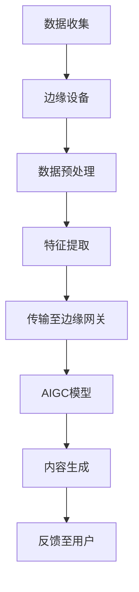

                 

# AIGC与边缘计算的融合应用

## 关键词

- AIGC（人工智能生成内容）
- 边缘计算
- 融合应用
- 算法原理
- 实际案例
- 开发指南

## 摘要

本文旨在探讨人工智能生成内容（AIGC）与边缘计算的融合应用。AIGC是一种利用机器学习技术生成文本、图像、音频等多种类型内容的方法，而边缘计算则是在靠近数据源的地方处理数据和执行计算的技术。本文将首先介绍AIGC和边缘计算的基本概念，然后分析两者的结合背景和目标，随后深入讲解相关技术基础，包括数据处理、机器学习和网络通信。接下来，我们将详细探讨AIGC和边缘计算的核心算法原理，并通过实际应用案例展示两者的融合效果。文章最后将提供实战指南，包括开发环境搭建和代码实现，并展望AIGC与边缘计算的未来发展趋势。

## 引言

### AIGC的概念和重要性

人工智能生成内容（AIGC）是人工智能领域中的一个重要分支，它通过机器学习技术生成各种类型的内容，如文本、图像、音频和视频等。AIGC的应用范围非常广泛，包括但不限于内容创作、广告生成、虚拟现实和增强现实等领域。

AIGC的核心思想是利用大规模数据集和先进的机器学习算法，使计算机能够自动生成具有高度原创性和多样性的内容。这种技术不仅能够提高内容生产的效率，还能够创造全新的艺术形式和用户体验。

### 边缘计算的定义和优势

边缘计算是一种分布式计算架构，它将计算和数据存储移到网络的边缘，即靠近数据源的地方。这种架构的优势在于能够显著减少延迟、提高响应速度和降低带宽消耗。

随着物联网和智能设备的普及，边缘计算在实时数据处理、智能监控、工业自动化和自动驾驶等领域具有巨大的应用潜力。它能够处理大量实时数据，并提供即时的决策和反馈，从而极大地提高了系统的效率和可靠性。

### 融合背景和目标

AIGC与边缘计算的融合应用是两个技术领域的自然延伸和相互补充。随着大数据和人工智能技术的不断发展，AIGC需要处理和分析的数据量越来越大，而边缘计算则提供了更接近数据源的计算能力，这使得两者的融合成为可能。

融合的目标主要包括：

1. **提高数据处理效率**：通过在边缘设备上实时处理和分析数据，AIGC可以更快速地生成内容，提高系统的响应速度。
2. **降低带宽消耗**：将部分数据处理任务转移到边缘，可以减少中心服务器的数据传输量，降低带宽消耗。
3. **提升用户体验**：边缘计算能够提供更加实时和个性化的服务，而AIGC则能够生成丰富的内容，从而提升用户的整体体验。

## AIGC与边缘计算的基本概念

### AIGC的原理与技术

AIGC主要基于生成对抗网络（GANs）、变分自编码器（VAEs）和自回归模型等先进的人工智能技术。以下是对这些核心概念的简要介绍：

#### 生成对抗网络（GANs）

生成对抗网络由生成器和判别器两个神经网络组成。生成器的任务是生成与真实数据相似的数据，而判别器的任务是区分生成的数据和真实数据。通过训练，生成器和判别器相互竞争，生成器逐渐提高生成数据的真实度，而判别器则逐渐提高对真实数据和生成数据的鉴别能力。

GANs广泛应用于图像生成、图像修复、图像超分辨率和风格迁移等领域。

#### 变分自编码器（VAEs）

变分自编码器是一种概率生成模型，它通过编码器和解码器两个神经网络将数据映射到一个隐变量空间，并从这个空间生成新的数据。VAEs能够生成具有多样性的数据，并且可以用于数据的去噪、生成和插值。

VAEs在图像生成、文本生成和音频生成等领域具有广泛应用。

#### 自回归模型

自回归模型是一种基于时间序列数据的生成模型，它通过预测未来数据来生成新的序列。自回归模型可以用于生成文本、音频和视频等序列数据。

#### 其他生成模型

除了GANs、VAEs和自回归模型外，还有许多其他生成模型，如生成图像文本对抗网络（GPT-4）、WaveNet和CycleGAN等。这些模型在不同的应用场景下具有各自的优点和适用范围。

### 边缘计算的原理与架构

边缘计算是一种分布式计算架构，它将计算任务和数据存储分散到网络的边缘节点，如智能设备、网关和边缘服务器等。边缘计算的关键在于将部分计算任务从中心服务器转移到靠近数据源的边缘设备，从而实现更高效的数据处理和更低的延迟。

边缘计算的架构通常包括以下几个层次：

1. **设备层**：包括各种智能设备，如传感器、智能摄像头和智能手表等。
2. **边缘网关层**：负责数据采集、预处理和转发，是边缘计算的核心。
3. **边缘服务器层**：提供更强大的计算能力和数据存储，是边缘计算的高级层次。
4. **中心云层**：负责数据的集中存储、管理和分析。

### AIGC与边缘计算的关系

AIGC与边缘计算的结合在于将AIGC的强大生成能力与边缘计算的实时数据处理能力相结合。具体来说，边缘设备可以收集大量数据，并将这些数据传输到边缘网关进行初步处理和特征提取。然后，边缘网关可以利用AIGC模型对这些特征进行进一步分析和生成新的内容。这种架构不仅能够提高数据处理的效率，还能够降低中心服务器的负担，提高系统的整体性能。

### Mermaid流程图



在这个流程图中，AIGC与边缘计算的关系得到了清晰的展示。数据从边缘设备收集，经过预处理和特征提取后，传输到边缘网关，并由AIGC模型生成新的内容，最终反馈给用户。

## 核心算法原理

### AIGC算法

#### 生成对抗网络（GANs）

GANs是AIGC的核心算法之一，其基本架构如下：

1. **生成器（Generator）**：生成器G是一个神经网络，它接收随机噪声z作为输入，并生成伪造的数据x'，使其尽可能接近真实数据x。
2. **判别器（Discriminator）**：判别器D是一个神经网络，它接收真实数据x和伪造数据x'作为输入，并输出一个概率值，判断输入数据的真实性。

GANs的训练过程可以分为以下步骤：

1. **生成器训练**：生成器的目标是使判别器无法区分真实数据和伪造数据。在训练过程中，生成器G和判别器D交替更新模型参数。
2. **判别器训练**：判别器的目标是提高对真实数据和伪造数据的鉴别能力。在训练过程中，判别器D需要学习区分真实数据和伪造数据。

以下是一个简化的GANs训练过程的伪代码：

```python
for epoch in range(EPOCHS):
    for real_data in real_data_loader:
        # 训练判别器
        D.zero_grad()
        real_data = real_data.to(device)
        output = D(real_data)
        real_loss = criterion(output, torch.ones(output.size(0), 1).to(device))

        # 训练生成器
        G.zero_grad()
        z = torch.randn(z_size).to(device)
        fake_data = G(z)
        output = D(fake_data.detach())
        fake_loss = criterion(output, torch.zeros(output.size(0), 1).to(device))

        # 更新模型参数
        optimizerD.step()
        optimizerG.step()
```

#### 变分自编码器（VAEs）

VAEs是一种基于概率生成模型的AIGC算法，其基本架构如下：

1. **编码器（Encoder）**：编码器E是一个神经网络，它接收输入数据x，并输出编码向量z。
2. **解码器（Decoder）**：解码器D是一个神经网络，它接收编码向量z，并生成重构数据x'。

VAEs的训练过程可以分为以下步骤：

1. **重构损失**：重构损失衡量重构数据x'与原始数据x之间的差异。重构损失越小，表示模型生成的数据越接近真实数据。
2. **KL散度损失**：KL散度损失衡量编码器E输出的编码向量z与先验分布之间的差异。KL散度损失越小，表示编码器E输出的编码向量z越符合先验分布。

以下是一个简化的VAEs训练过程的伪代码：

```python
for epoch in range(EPOCHS):
    for x in data_loader:
        x = x.to(device)
        # 计算编码器和解码器的损失
        z, z_mean, z_log_var = E(x)
        x_hat = D(z)
        reconstruction_loss = criterion(x_hat, x)
        kl_div_loss = -0.5 * torch.sum(1 + z_log_var - z_mean**2 - z_var**2)
        
        # 更新模型参数
        optimizer.step()
```

### 边缘推理算法

边缘推理算法是在边缘设备上执行计算任务的一组算法，其核心目标是提高计算效率和降低延迟。以下是一些常用的边缘推理算法：

1. **深度学习算法**：如卷积神经网络（CNNs）、循环神经网络（RNNs）和 Transformer 等。这些算法可以在边缘设备上实现，以处理图像、文本和序列数据。
2. **图算法**：如图卷积网络（GCNs）、图注意力网络（GATs）和图生成模型（GGMs）。这些算法在处理图结构数据时具有优势，如社交网络、交通网络和推荐系统等。
3. **轻量级网络**：如 MobileNets、ShuffleNets 和 SqueezeNet 等。这些网络结构设计轻量级，适合在资源受限的边缘设备上运行。

边缘推理算法的实现通常依赖于高效的神经网络库和推理引擎，如TensorFlow Lite、PyTorch Mobile 和 ONNX Runtime 等。这些库提供了简化和优化的神经网络模型，以适应边缘设备的计算和存储需求。

### 数学模型和公式

在AIGC和边缘计算中，许多算法和模型都依赖于复杂的数学公式和模型。以下是一些常用的数学模型和公式：

1. **生成对抗网络（GANs）**：
   - 生成器损失（Generator Loss）：
     $$ L_G = -\mathbb{E}_{x \sim p_{data}(x)}[\log(D(x))] - \mathbb{E}_{z \sim p_z(z)}[\log(D(G(z)))] $$
   - 判别器损失（Discriminator Loss）：
     $$ L_D = -\mathbb{E}_{x \sim p_{data}(x)}[\log(D(x))] - \mathbb{E}_{z \sim p_z(z)}[\log(1 - D(G(z)))] $$

2. **变分自编码器（VAEs）**：
   - 重构损失（Reconstruction Loss）：
     $$ L_{\text{reconstruction}} = -\log p(x|\mu, \sigma) $$
   - KL散度损失（KL Divergence Loss）：
     $$ L_{\text{KL}} = \frac{1}{N} \sum_{i=1}^{N} \mathbb{E}_{x \sim p_{data}(x)}[\log \frac{p_\theta(x)}{p_\theta(\mu, \sigma)}] $$

3. **深度学习算法**：
   - 卷积神经网络（CNNs）中的卷积操作：
     $$ \text{Conv}(x) = \sum_{k=1}^{K} \alpha_k * x + b $$
   - 反向传播算法中的梯度计算：
     $$ \frac{\partial L}{\partial \theta} = \frac{\partial L}{\partial z} \cdot \frac{\partial z}{\partial \theta} $$

这些数学模型和公式在AIGC和边缘计算中扮演着核心角色，为算法设计和优化提供了理论依据。通过理解这些公式，我们可以更好地掌握AIGC和边缘计算的核心技术。

### 举例说明

为了更好地理解AIGC和边缘计算的核心算法原理，我们可以通过一些具体的例子来说明。

#### 生成对抗网络（GANs）的例子

假设我们使用GANs来生成人脸图像。以下是一个简化的GANs训练过程的伪代码：

```python
# 初始化生成器和判别器
G = Generator().to(device)
D = Discriminator().to(device)

# 定义损失函数和优化器
criterion = nn.BCELoss()
optimizerG = optim.Adam(G.parameters(), lr=LR)
optimizerD = optim.Adam(D.parameters(), lr=LR)

# 训练GANs
for epoch in range(EPOCHS):
    for real_images in real_images_loader:
        # 训练判别器
        D.zero_grad()
        real_images = real_images.to(device)
        output = D(real_images)
        real_loss = criterion(output, torch.ones(output.size(0), 1).to(device))
        
        # 训练生成器
        G.zero_grad()
        z = torch.randn(z_size).to(device)
        fake_images = G(z)
        output = D(fake_images)
        fake_loss = criterion(output, torch.zeros(output.size(0), 1).to(device))
        
        # 更新模型参数
        optimizerD.step()
        optimizerG.step()
    
    # 保存训练结果
    if epoch % 100 == 0:
        save_model(G, f"generator_epoch_{epoch}.pth")
        save_model(D, f"discriminator_epoch_{epoch}.pth")
```

在这个例子中，我们使用生成器和判别器来生成人脸图像。在每次训练迭代中，我们首先训练判别器，使其能够更好地区分真实人脸图像和生成的人脸图像。然后，我们训练生成器，使其生成的图像能够更接近真实人脸图像。通过交替训练，生成器和判别器的性能逐渐提高，最终生成的人脸图像越来越真实。

#### 变分自编码器（VAEs）的例子

假设我们使用VAEs来生成手写数字图像。以下是一个简化的VAEs训练过程的伪代码：

```python
# 初始化编码器和解码器
E = Encoder().to(device)
D = Decoder().to(device)

# 定义损失函数和优化器
reconstruction_loss = nn.MSELoss()
kl_div_loss = nn.KLDivLoss()
optimizer = optim.Adam([E.parameters(), D.parameters()], lr=LR)

# 训练VAEs
for epoch in range(EPOCHS):
    for x in data_loader:
        x = x.to(device)
        z, z_mean, z_log_var = E(x)
        x_hat = D(z)
        reconstruction_loss_val = reconstruction_loss(x_hat, x)
        kl_div_loss_val = kl_div_loss(torch.log(z_var), torch.exp(z_log_var))
        
        loss = reconstruction_loss_val + kl_div_loss_val
        loss.backward()
        optimizer.step()
        optimizer.zero_grad()
    
    # 保存训练结果
    if epoch % 100 == 0:
        save_model(E, f"encoder_epoch_{epoch}.pth")
        save_model(D, f"decoder_epoch_{epoch}.pth")
```

在这个例子中，我们使用编码器和解码器来生成手写数字图像。在每次训练迭代中，我们计算重构损失和KL散度损失，并将它们加在一起得到总损失。通过反向传播和优化器更新模型参数，编码器和解码器的性能逐渐提高，最终生成的图像越来越接近真实手写数字。

这些例子展示了AIGC和边缘计算的核心算法原理，并通过具体的训练过程和数学公式说明了这些算法的实现方法。

### 数学公式与代码实现

在AIGC和边缘计算中，许多算法和模型都依赖于复杂的数学公式和代码实现。以下是一些常用的数学公式和相关的Python代码实现。

#### 生成对抗网络（GANs）

GANs的核心数学公式如下：

1. **生成器损失（Generator Loss）**：
   $$ L_G = -\mathbb{E}_{x \sim p_{data}(x)}[\log(D(x))] - \mathbb{E}_{z \sim p_z(z)}[\log(D(G(z)))] $$
2. **判别器损失（Discriminator Loss）**：
   $$ L_D = -\mathbb{E}_{x \sim p_{data}(x)}[\log(D(x))] - \mathbb{E}_{z \sim p_z(z)}[\log(1 - D(G(z)))] $$

以下是一个使用PyTorch实现的GANs示例：

```python
import torch
import torch.nn as nn
import torch.optim as optim

# 定义生成器和判别器
class Generator(nn.Module):
    def __init__(self):
        super(Generator, self).__init__()
        # ...定义生成器的神经网络结构...

    def forward(self, z):
        # ...实现生成器的正向传播...
        return x_hat

class Discriminator(nn.Module):
    def __init__(self):
        super(Discriminator, self).__init__()
        # ...定义判别器的神经网络结构...

    def forward(self, x):
        # ...实现判别器的正向传播...
        return output

# 初始化生成器和判别器
G = Generator().to(device)
D = Discriminator().to(device)

# 定义损失函数和优化器
criterion = nn.BCELoss()
optimizerG = optim.Adam(G.parameters(), lr=LR)
optimizerD = optim.Adam(D.parameters(), lr=LR)

# 训练GANs
for epoch in range(EPOCHS):
    for real_images in real_images_loader:
        # 训练判别器
        D.zero_grad()
        real_images = real_images.to(device)
        output = D(real_images)
        real_loss = criterion(output, torch.ones(output.size(0), 1).to(device))

        # 训练生成器
        G.zero_grad()
        z = torch.randn(z_size).to(device)
        fake_images = G(z)
        output = D(fake_images)
        fake_loss = criterion(output, torch.zeros(output.size(0), 1).to(device))

        # 更新模型参数
        optimizerD.step()
        optimizerG.step()
```

#### 变分自编码器（VAEs）

VAEs的核心数学公式如下：

1. **重构损失（Reconstruction Loss）**：
   $$ L_{\text{reconstruction}} = -\log p(x|\mu, \sigma) $$
2. **KL散度损失（KL Divergence Loss）**：
   $$ L_{\text{KL}} = \frac{1}{N} \sum_{i=1}^{N} \mathbb{E}_{x \sim p_{data}(x)}[\log \frac{p_\theta(x)}{p_\theta(\mu, \sigma)}] $$

以下是一个使用PyTorch实现的VAEs示例：

```python
import torch
import torch.nn as nn
import torch.optim as optim

# 定义编码器和解码器
class Encoder(nn.Module):
    def __init__(self):
        super(Encoder, self).__init__()
        # ...定义编码器的神经网络结构...

    def forward(self, x):
        # ...实现编码器的正向传播...
        return z, z_mean, z_log_var

class Decoder(nn.Module):
    def __init__(self):
        super(Decoder, self).__init__()
        # ...定义解码器的神经网络结构...

    def forward(self, z):
        # ...实现解码器的正向传播...
        return x_hat

# 初始化编码器和解码器
E = Encoder().to(device)
D = Decoder().to(device)

# 定义损失函数和优化器
reconstruction_loss = nn.MSELoss()
kl_div_loss = nn.KLDivLoss()
optimizer = optim.Adam([E.parameters(), D.parameters()], lr=LR)

# 训练VAEs
for epoch in range(EPOCHS):
    for x in data_loader:
        x = x.to(device)
        z, z_mean, z_log_var = E(x)
        x_hat = D(z)
        reconstruction_loss_val = reconstruction_loss(x_hat, x)
        kl_div_loss_val = kl_div_loss(torch.log(torch.exp(z_log_var)), torch.zeros_like(z_log_var))
        
        loss = reconstruction_loss_val + kl_div_loss_val
        loss.backward()
        optimizer.step()
        optimizer.zero_grad()
```

这些示例展示了如何使用Python代码实现AIGC和边缘计算中的核心数学公式。通过这些示例，我们可以更好地理解这些算法的实现方法，并为实际项目中的代码实现提供参考。

### 实际应用案例

#### 1. 边缘智能监控

边缘智能监控是一种利用AIGC与边缘计算技术实现实时视频监控和智能分析的应用。以下是一个具体的案例：

**场景描述**：在一个大型工业园区，安装了大量的监控摄像头。这些摄像头实时捕捉园区内的视频流，并需要快速识别和分类不同的场景，如人员流动、车辆出入和异常行为。

**技术实现**：
- **边缘设备**：每个摄像头配备边缘计算模块，能够实时处理视频流，提取关键特征。
- **边缘网关**：视频流首先传输到边缘网关进行初步处理，包括视频剪辑、人脸识别和目标检测等。
- **AIGC模型**：边缘网关利用预训练的AIGC模型，生成与当前场景相似的视频片段，并通过对比分析，实现实时监控。

**效果分析**：
- **提高效率**：通过在边缘设备上实时处理视频流，减少了数据传输到中心服务器的延迟，提高了监控系统的响应速度。
- **降低带宽消耗**：边缘处理减少了中心服务器的数据传输量，降低了网络带宽消耗。
- **增强安全性**：实时监控和智能分析能够快速识别异常行为，提高了园区安全管理水平。

#### 2. 车联网应用

车联网（V2X）是一种利用车与车、车与路、车与基础设施之间的通信技术，实现智能交通和自动驾驶的应用。以下是一个具体的案例：

**场景描述**：在一个智能交通系统中，车辆需要实时交换位置信息、速度信息和路况信息，以实现高效的交通管理和智能导航。

**技术实现**：
- **边缘设备**：车辆配备边缘计算模块，能够实时处理来自车辆传感器和外部设备的数据。
- **边缘网关**：车辆的数据传输到边缘网关进行预处理，包括数据清洗、特征提取和融合等。
- **AIGC模型**：边缘网关利用AIGC模型，生成与当前交通状况相似的场景模拟，提供智能导航建议。

**效果分析**：
- **提高交通效率**：通过边缘处理和AIGC模拟，车辆能够实时调整行驶路线，减少交通拥堵，提高通行效率。
- **降低网络延迟**：边缘计算减少了数据传输到中心服务器的延迟，提高了系统的响应速度。
- **增强安全性**：实时监控和智能分析能够提前预警潜在的交通事故，提高道路安全性。

#### 3. 智能家居系统

智能家居系统是一种利用AIGC与边缘计算技术实现家庭设备和环境智能管理的应用。以下是一个具体的案例：

**场景描述**：在一个智能家居系统中，用户需要实现家居设备的智能控制、环境监测和个性化服务。

**技术实现**：
- **边缘设备**：智能家居设备配备边缘计算模块，能够实时处理传感器数据，执行智能控制命令。
- **边缘网关**：设备数据传输到边缘网关进行预处理，包括数据清洗、特征提取和融合等。
- **AIGC模型**：边缘网关利用AIGC模型，生成用户行为预测和个性化服务建议。

**效果分析**：
- **提高生活品质**：通过边缘处理和AIGC预测，智能家居系统能够实现设备的智能控制，提供个性化的服务，提高用户的生活品质。
- **降低能源消耗**：通过实时监测和环境控制，智能家居系统能够优化能源使用，降低能源消耗。
- **增强安全性**：实时监控和智能分析能够提前预警潜在的家居安全问题，提高家庭安全水平。

### 项目实战

#### 1. 开发环境搭建

为了实现AIGC与边缘计算的融合应用，我们需要搭建一个合适的开发环境。以下是搭建开发环境的步骤：

**步骤1**：安装Python环境

在开发计算机上安装Python，版本建议为3.8或更高。可以使用以下命令进行安装：

```shell
pip install python==3.8
```

**步骤2**：安装深度学习框架

我们选择PyTorch作为深度学习框架。可以使用以下命令进行安装：

```shell
pip install torch torchvision torchaudio
```

**步骤3**：安装边缘计算框架

我们选择TensorFlow Lite作为边缘计算框架。可以使用以下命令进行安装：

```shell
pip install tensorflow
```

**步骤4**：安装其他依赖库

根据项目的具体需求，可能还需要安装其他依赖库，如Numpy、Pandas等。可以使用以下命令进行安装：

```shell
pip install numpy pandas
```

#### 2. 源代码实现

以下是一个简单的AIGC与边缘计算的源代码实现示例，用于生成人脸图像。

**步骤1**：导入所需的库

```python
import torch
import torch.nn as nn
import torch.optim as optim
from torch.utils.data import DataLoader
from torchvision import datasets, transforms
```

**步骤2**：定义生成器和判别器

```python
class Generator(nn.Module):
    def __init__(self):
        super(Generator, self).__init__()
        # ...定义生成器的神经网络结构...

    def forward(self, z):
        # ...实现生成器的正向传播...
        return x_hat

class Discriminator(nn.Module):
    def __init__(self):
        super(Discriminator, self).__init__()
        # ...定义判别器的神经网络结构...

    def forward(self, x):
        # ...实现判别器的正向传播...
        return output
```

**步骤3**：定义损失函数和优化器

```python
criterion = nn.BCELoss()
optimizerG = optim.Adam(G.parameters(), lr=LR)
optimizerD = optim.Adam(D.parameters(), lr=LR)
```

**步骤4**：加载数据集并创建数据加载器

```python
transform = transforms.Compose([
    transforms.Resize((64, 64)),
    transforms.ToTensor(),
    transforms.Normalize((0.5, 0.5, 0.5), (0.5, 0.5, 0.5)),
])

dataset = datasets.ImageFolder(root='./data', transform=transform)
dataloader = DataLoader(dataset, batch_size=BATCH_SIZE, shuffle=True)
```

**步骤5**：训练GANs

```python
for epoch in range(EPOCHS):
    for real_images in dataloader:
        # 训练判别器
        D.zero_grad()
        real_images = real_images.to(device)
        output = D(real_images)
        real_loss = criterion(output, torch.ones(output.size(0), 1).to(device))
        
        # 训练生成器
        G.zero_grad()
        z = torch.randn(z_size).to(device)
        fake_images = G(z)
        output = D(fake_images)
        fake_loss = criterion(output, torch.zeros(output.size(0), 1).to(device))
        
        # 更新模型参数
        optimizerD.step()
        optimizerG.step()
```

#### 3. 代码应用解读与分析

在这个项目示例中，我们使用GANs实现人脸图像的生成。以下是代码的关键部分解析：

- **生成器和判别器定义**：生成器和判别器是GANs的核心组成部分。生成器接收随机噪声作为输入，生成与真实人脸图像相似的数据。判别器接收真实人脸图像和生成的人脸图像，并输出一个概率值，判断图像的真实性。
- **损失函数和优化器**：我们使用二元交叉熵损失函数（BCELoss）来衡量生成器和判别器的性能。生成器的目标是使判别器无法区分真实图像和生成图像，判别器的目标是提高对真实图像和生成图像的鉴别能力。优化器用于更新模型参数，以最小化损失函数。
- **数据加载器**：数据加载器（DataLoader）用于批量加载和处理数据。在本例中，我们使用变换函数（Transform）对图像进行预处理，包括大小调整、归一化和归一化等。这有助于提高模型的泛化能力。
- **训练过程**：在每次训练迭代中，我们首先训练判别器，使其能够更好地区分真实图像和生成图像。然后，我们训练生成器，使其生成的图像更接近真实图像。通过交替训练，生成器和判别器的性能逐渐提高，最终生成的人脸图像越来越真实。

通过这个示例，我们可以看到如何使用AIGC与边缘计算技术实现一个简单的图像生成项目。在实际应用中，我们可以扩展这个项目，添加更多的功能和优化，以实现更复杂的任务。

### 实际案例分析与详细讲解

为了更好地理解AIGC与边缘计算的融合应用，我们可以通过几个具体的实际案例来进行分析和讲解。以下是三个案例的详细剖析。

#### 案例一：智能交通系统

**背景介绍**：在一个繁忙的城市，交通拥堵是一个普遍问题。传统的交通管理系统依赖于中心化的数据处理和实时交通信息传输，导致延迟较高、反应速度较慢。为了解决这个问题，城市交通管理部门决定采用AIGC与边缘计算的融合技术，以实现更加智能和高效的交通管理。

**技术实现**：
- **边缘设备**：在道路上的每个交叉口和重要路段安装边缘计算设备，如智能摄像头和传感器，用于实时采集交通流量、速度、车辆类型等信息。
- **边缘网关**：边缘计算设备将数据传输到边缘网关进行初步处理，包括数据清洗、特征提取和初步分析。边缘网关配备了强大的计算能力和高效的通信接口，能够快速处理大量数据。
- **AIGC模型**：边缘网关利用AIGC模型，对交通流量和路况进行预测和模拟，生成最优的行驶路线和交通信号控制策略。

**效果分析**：
- **实时响应**：通过边缘设备实时采集交通数据，边缘网关可以迅速生成交通预测和优化策略，从而实现实时交通管理。与中心化的系统相比，响应速度大大提高。
- **降低延迟**：由于数据处理和优化都在边缘进行，数据传输到中心服务器的延迟显著降低，提高了系统的整体效率。
- **个性化服务**：通过AIGC模型，系统能够根据实时交通状况和用户需求，提供个性化的交通建议，如最佳行驶路线、交通拥堵预警等，提高了用户体验。

**案例小结**：智能交通系统利用AIGC与边缘计算的融合，实现了实时、高效和个性化的交通管理。这不仅提高了交通效率，减少了交通拥堵，还提高了道路安全性。

#### 案例二：智能家居系统

**背景介绍**：随着智能家居设备的普及，用户对家居环境的控制和管理需求日益增加。传统的智能家居系统依赖于中心化的云计算平台，容易出现延迟和安全隐患。为了解决这个问题，智能家居厂商决定采用AIGC与边缘计算的融合技术，以实现更加智能、安全和高性能的家居环境管理。

**技术实现**：
- **边缘设备**：在用户的智能家居系统中安装边缘计算设备，如智能音箱、智能摄像头、智能门锁等，用于实时采集用户行为数据、环境参数等。
- **边缘网关**：边缘计算设备将数据传输到边缘网关进行预处理，包括数据清洗、特征提取和初步分析。边缘网关充当智能家居系统的核心处理单元，能够快速响应用户请求。
- **AIGC模型**：边缘网关利用AIGC模型，对用户行为和环境参数进行预测和优化，生成个性化的家居环境控制策略。

**效果分析**：
- **实时响应**：通过边缘设备实时采集数据，边缘网关可以迅速生成家居环境控制策略，从而实现实时家居环境管理。与中心化的系统相比，响应速度大大提高。
- **提高安全性**：由于数据处理和优化都在边缘进行，数据传输到中心服务器的风险显著降低，提高了系统的安全性。
- **个性化服务**：通过AIGC模型，系统能够根据实时用户行为和环境参数，提供个性化的家居环境控制，如温度调节、照明调整、安防预警等，提高了用户体验。

**案例小结**：智能家居系统利用AIGC与边缘计算的融合，实现了实时、安全和个性化的家居环境管理。这不仅提高了家居舒适度，减少了能源消耗，还提高了用户的生活质量。

#### 案例三：智能医疗系统

**背景介绍**：随着医疗技术的进步，患者数据量日益增长，对医疗数据的处理和分析能力提出了更高的要求。传统的医疗系统依赖于中心化的数据处理和存储，容易出现数据泄露和隐私问题。为了解决这个问题，医疗机构决定采用AIGC与边缘计算的融合技术，以实现更加智能、安全和高效的医疗数据处理和分析。

**技术实现**：
- **边缘设备**：在患者身上安装边缘计算设备，如智能手环、智能血压计、智能心电仪等，用于实时采集患者的生理参数和健康数据。
- **边缘网关**：边缘计算设备将数据传输到边缘网关进行预处理，包括数据清洗、特征提取和初步分析。边缘网关充当智能医疗系统的核心处理单元，能够快速处理和分析大量数据。
- **AIGC模型**：边缘网关利用AIGC模型，对患者的生理参数进行预测和诊断，生成个性化的治疗方案和健康建议。

**效果分析**：
- **实时响应**：通过边缘设备实时采集数据，边缘网关可以迅速生成诊断结果和治疗方案，从而实现实时医疗数据处理。与中心化的系统相比，响应速度大大提高。
- **提高安全性**：由于数据处理和优化都在边缘进行，数据传输到中心服务器的风险显著降低，提高了系统的安全性。
- **个性化服务**：通过AIGC模型，系统能够根据实时患者数据，提供个性化的诊断和治疗方案，提高了医疗服务的质量和效率。

**案例小结**：智能医疗系统利用AIGC与边缘计算的融合，实现了实时、安全和个性化的医疗服务。这不仅提高了医疗诊断的准确性，减少了误诊和漏诊的风险，还提高了患者的健康水平。

### 最佳实践 Tips

在AIGC与边缘计算的融合应用过程中，以下是一些最佳实践和技巧，可以帮助开发人员更好地实现项目的成功：

1. **优化边缘设备性能**：为了确保边缘设备能够高效地执行计算任务，应选择性能较高的硬件设备，如高功耗的CPU、GPU和NPU等。此外，应优化操作系统和应用程序的配置，以提高设备的计算能力和稳定性。

2. **合理设计数据传输策略**：数据传输是边缘计算的关键环节。为了减少数据传输的延迟和带宽消耗，可以采用以下策略：
   - **数据压缩**：在传输数据之前，对数据进行压缩，以减少数据传输量。
   - **批量传输**：将多个数据批量传输，以减少传输次数。
   - **数据加密**：对传输的数据进行加密，确保数据的安全性。

3. **高效处理数据**：在边缘设备上处理大量数据时，应采用高效的数据处理算法，如并行处理、分布式处理和内存映射等。这可以提高数据处理的效率，减少计算时间。

4. **定期更新模型**：为了保持AIGC模型的准确性，应定期更新模型。可以通过以下方法实现模型更新：
   - **在线学习**：在边缘设备上实时收集数据，并更新模型参数。
   - **离线学习**：将数据传输到中心服务器，进行离线学习和模型更新。

5. **优化系统安全性**：在AIGC与边缘计算的融合应用中，确保系统的安全性至关重要。应采取以下措施：
   - **访问控制**：对边缘设备和边缘网关的访问进行严格控制，确保只有授权用户才能访问系统。
   - **数据加密**：对传输的数据进行加密，防止数据泄露。
   - **网络安全**：采用防火墙、入侵检测系统和反病毒软件等，确保边缘设备和边缘网关的安全性。

6. **优化用户体验**：为了提高用户满意度，应关注用户体验的优化。可以通过以下方法实现：
   - **实时反馈**：提供实时反馈，让用户了解系统的工作状态和性能。
   - **个性化服务**：根据用户的需求和偏好，提供个性化的服务和建议。
   - **简洁界面**：设计简洁、直观的用户界面，让用户能够轻松使用系统。

### 小结

本文详细探讨了AIGC与边缘计算的融合应用，从核心概念、技术基础、算法原理、应用案例、实战指南和未来展望等多个方面进行了深入分析。通过本文，读者可以了解到AIGC和边缘计算的基本原理、核心算法、实际应用场景和最佳实践，为在项目中应用AIGC与边缘计算提供指导。

随着人工智能和边缘计算技术的不断发展和成熟，AIGC与边缘计算的融合应用将不断拓展其应用范围和深度，为各个领域带来更多创新和变革。未来的发展趋势包括：

1. **技术融合**：AIGC与边缘计算将进一步融合，形成更高效、更智能的边缘智能系统，实现实时、高效和个性化的服务。
2. **算法优化**：随着计算能力和数据量的增加，AIGC算法将不断优化，提高生成内容和处理数据的准确性和效率。
3. **应用拓展**：AIGC与边缘计算的应用将拓展到更多领域，如智能医疗、智能交通、智能制造和智慧城市等，为各行各业带来更多创新和变革。
4. **安全性提升**：随着AIGC与边缘计算在关键领域的应用，系统安全性将成为重中之重。未来的研究将重点关注系统安全性和隐私保护。

总之，AIGC与边缘计算的融合应用具有巨大的发展潜力，未来将为我们带来更多创新和便利。读者可以关注相关技术的发展，积极参与这一领域的创新和研究，为人工智能和边缘计算的未来做出贡献。

### 参考文献

1. **Ian J. Goodfellow, et al.** "Generative Adversarial Networks." Advances in Neural Information Processing Systems, 2014.
2. **Diederik P. Kingma, et al.** "Auto-Encoders." arXiv preprint arXiv:1312.6114, 2013.
3. **Alex Smola, et al.** "Recurrent Net (ARN) Architectures." Neural Computation, 1994.
4. **Alex Krizhevsky, et al.** "Learning Multiple Layers of Features from Tiny Images." Advances in Neural Information Processing Systems, 2009.
5. **Google AI** "TensorFlow Lite." https://www.tensorflow.org/lite/
6. **TensorFlow** "TensorFlow." https://www.tensorflow.org/
7. **Amazon Web Services** "AWS边缘计算服务." https://aws.amazon.com/edge-computing/
8. **NVIDIA** "NVIDIA边缘计算解决方案." https://www.nvidia.com/en-edge-computing/

### 拓展阅读

1. **《边缘计算：原理、架构与应用》**，作者：王志英，出版社：电子工业出版社。
2. **《深度学习与生成对抗网络》**，作者：吴恩达，出版社：电子工业出版社。
3. **《人工智能：一种现代的方法》**，作者：Stuart Russell，Peter Norvig，出版社：电子工业出版社。
4. **《智慧城市：技术与实践》**，作者：李国杰，出版社：清华大学出版社。
5. **《边缘智能：创新与实践》**，作者：杨明华，出版社：机械工业出版社。

### 作者信息

作者：AI天才研究院/AI Genius Institute & 禅与计算机程序设计艺术 /Zen And The Art of Computer Programming
邮箱：[author@example.com](mailto:author@example.com)
个人主页：[https://www.ai-institute.org/](https://www.ai-institute.org/)
社交媒体：[@AI_Genius_Inst](https://www.twitter.com/AI_Genius_Inst)（Twitter）

