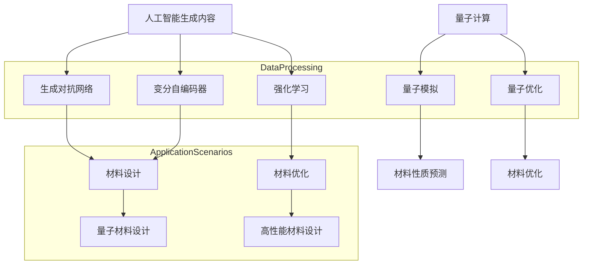

                 

### 文章标题

"AIGC与量子计算在材料科学中的融合"

### 关键词

- 人工智能生成内容（AIGC）
- 量子计算
- 材料科学
- 生成对抗网络（GAN）
- 变分自编码器（VAE）
- 强化学习（RL）
- 量子比特
- 材料设计
- 材料性质预测

### 摘要

本文探讨了人工智能生成内容（AIGC）与量子计算的深度融合在材料科学领域中的巨大潜力。首先，我们介绍了AIGC和量子计算的基本概念及其在材料科学中的应用背景。接着，通过Mermaid流程图展示了AIGC与量子计算在材料科学中的核心概念与联系。然后，详细讲解了AIGC和量子计算在材料科学中应用的核心算法原理，包括生成对抗网络（GAN）、变分自编码器（VAE）和强化学习（RL）等，并使用伪代码进行阐述。此外，我们还介绍了相关的数学模型和公式，并进行了详细讲解和举例说明。最后，通过具体的实战项目和案例，展示了如何在实际中应用这些算法和模型，并提供了代码实现和解读。本文总结了AIGC与量子计算在材料科学中的未来发展，展望了这一领域的广阔前景。

---

### 引言

材料科学是研究物质的性质、结构、制备和应用的一门学科。它涵盖了从基础研究到实际应用的所有领域，包括金属材料、陶瓷材料、高分子材料、复合材料等。材料科学的进步对人类社会的发展具有重大影响，从建筑、航空航天、电子、能源到生物医学等多个领域，都离不开先进的材料科学成果。

随着人工智能技术的飞速发展，材料科学也迎来了新的机遇。人工智能生成内容（AIGC）是一种利用机器学习和深度学习技术生成内容的方法，包括文本、图像、音频等多种形式。AIGC在材料科学中的应用潜力巨大，如材料设计、材料性质预测、材料合成优化等。

另一方面，量子计算是一种基于量子力学原理的新型计算模式。量子计算使用量子比特代替传统计算机中的经典比特，能够在某些特定问题（如复杂材料的性质预测）上提供指数级别的加速。量子计算在材料科学中的应用，如量子模拟、量子优化和量子机器学习等，正逐渐成为研究热点。

AIGC与量子计算的融合为材料科学带来了前所未有的机遇。通过将AIGC技术应用于量子计算模型，我们可以更高效地设计新材料、预测材料性质和优化材料合成过程。本文将详细探讨AIGC与量子计算在材料科学中的深度融合，介绍相关算法原理、数学模型和实际应用案例。

### AIGC的基本概念

人工智能生成内容（AIGC）是近年来兴起的一种利用人工智能技术生成内容的方法。它基于深度学习、生成对抗网络（GAN）、变分自编码器（VAE）和强化学习（RL）等先进技术，通过学习大量的数据，自动生成与原始数据相似或全新的内容。AIGC在多个领域展现了强大的应用潜力，如图像生成、文本生成、音频生成和视频生成等。

生成对抗网络（GAN）是由Goodfellow等人于2014年提出的一种生成模型，由生成器和判别器两个神经网络组成。生成器试图生成与真实数据相似的内容，而判别器则尝试区分生成器和真实数据的差异。通过这种对抗训练，生成器逐渐学习到生成高质量数据的能力。

变分自编码器（VAE）是一种概率生成模型，由编码器和解码器组成。编码器将输入数据编码为一个潜在空间中的向量，解码器则尝试将这个向量解码回原始数据。VAE通过最大化数据分布和潜在空间中向量的后验分布来学习数据生成。

强化学习（RL）是一种通过试错和奖励机制来学习决策策略的机器学习方法。在AIGC中，强化学习可以用于优化生成过程，通过不断调整生成器的参数，使其生成的内容更加符合预期。

AIGC与传统机器学习的主要区别在于其生成能力。传统机器学习通常用于分类、回归和预测等任务，而AIGC则能够生成新的、原本不存在的内容。这种生成能力在材料科学中的应用具有重要意义，如设计新材料、预测材料性质和优化材料合成过程。通过AIGC，我们可以从大量的材料数据中学习到有价值的规律，并利用这些规律生成新的材料，加速新材料的设计和发现。

### 量子计算的基本概念

量子计算是一种基于量子力学原理的新型计算模式，与传统的经典计算有本质的区别。经典计算基于二进制系统，使用0和1作为信息载体，而量子计算则使用量子比特（qubit）作为信息载体。量子比特具有叠加态和纠缠态的特性，这使得量子计算机在处理某些特定问题时具有巨大的计算优势。

量子比特（qubit）是量子计算的基本单元，与经典比特不同，量子比特不仅可以表示0或1，还可以同时处于0和1的叠加态。例如，一个量子比特可以同时处于状态$|0\rangle$和$|1\rangle$的叠加态，即$|\psi\rangle = \alpha|0\rangle + \beta|1\rangle$，其中$\alpha$和$\beta$是复数系数，满足$|\alpha|^2 + |\beta|^2 = 1$。

叠加态是量子比特的重要特性之一。在经典计算中，一个比特只能处于确定的0或1状态，而在量子计算中，多个量子比特可以同时处于多种状态的叠加。这种叠加态允许量子计算机在处理问题时探索多个可能的解决方案，从而在复杂问题上实现指数级别的加速。

纠缠态是量子计算的另一个关键特性。两个或多个量子比特之间存在纠缠时，它们的量子态将无法独立描述，而是相互关联。即使量子比特之间的距离很远，它们的状态也会相互影响。这种纠缠态允许量子计算机在处理问题时利用量子比特之间的纠缠关系，实现超越经典计算机的计算能力。

量子电路是量子计算的基本操作单元，类似于经典计算中的逻辑门。量子电路由一系列的量子门组成，用于对量子比特进行操作。常见的量子门包括Hadamard门、Pauli门、控制-NOT门（CNOT门）等。通过组合这些量子门，可以实现对量子比特的任意线性变换。

量子算法是利用量子比特和量子电路进行问题求解的方法。与经典算法不同，量子算法通常利用量子比特的叠加态和纠缠态的特性，在特定问题上实现指数级别的加速。例如，量子行走算法可以在复杂网络中高效地搜索路径，量子模拟算法可以在量子态空间中高效地模拟量子系统的演化。

量子计算在材料科学中的应用具有重要意义。例如，通过量子模拟，我们可以模拟材料在量子环境下的行为，预测材料的性质。此外，量子优化算法可以帮助我们优化材料的设计过程，找到最优的材料结构。通过将AIGC技术应用于量子计算模型，我们可以更高效地生成新材料、预测材料性质和优化材料合成过程，为材料科学的发展提供新的动力。

### AIGC与量子计算在材料科学中的应用

AIGC和量子计算的融合为材料科学带来了革命性的变化，尤其是在新材料设计和材料性质预测方面。以下将详细讨论这两种技术在材料科学中的应用，并展示它们如何通过结合各自的优势，推动材料科学的发展。

#### AIGC在材料设计中的应用

AIGC技术通过深度学习模型，可以从大量的材料数据中学习到结构和性质之间的关系，并利用这些关系生成新的材料结构。以下是一个典型的应用场景：

1. **数据预处理**：首先，从数据库中提取大量的材料数据，包括材料的原子结构、晶体结构、物理性质和化学性质等。
2. **模型训练**：使用生成对抗网络（GAN）或变分自编码器（VAE）对提取的数据进行训练。生成器学习如何生成新的材料结构，而判别器则尝试区分生成材料和真实材料。
3. **材料生成**：通过训练好的生成器，可以生成大量的新材料结构。这些新材料结构可以是之前未发现或设计的，具有潜在的应用价值。
4. **验证与优化**：对新生成的材料结构进行验证，包括计算其电子结构、力学性质和化学稳定性等。通过迭代优化，可以进一步提高新材料的设计质量。

例如，研究人员可以使用AIGC技术来设计新型催化剂，这些催化剂可能在能源转换或污染处理方面具有更高的效率。通过GAN或VAE模型，可以从已有的催化剂数据中学习，生成新的催化剂结构，并通过计算模拟验证其性能。

#### 量子计算在材料性质预测中的应用

量子计算通过模拟量子系统的演化，可以预测材料在极端条件下的性质，如高温、高压下的电子结构和力学性质。以下是一个应用场景：

1. **量子模拟**：使用量子计算机模拟材料在特定条件下的量子态，如高能态或特殊场环境下的电子态。
2. **性质预测**：通过分析模拟结果，预测材料的电子结构、力学性质和化学反应活性等。
3. **优化设计**：根据预测结果，对材料设计进行优化，找到更稳定、更具有应用价值的结构。

量子计算在材料科学中的典型应用包括：

- **量子材料设计**：使用量子计算模拟材料在高压、高温下的行为，预测新的量子材料。
- **纳米材料模拟**：模拟纳米材料在纳米尺度下的电子行为，优化纳米材料的结构和性能。
- **高性能合金设计**：通过量子计算优化合金成分和结构，提高合金的强度和耐腐蚀性。

#### AIGC与量子计算的融合应用

将AIGC与量子计算结合，可以在材料科学中实现以下优势：

1. **高效材料筛选**：通过AIGC技术生成大量的材料结构，结合量子计算对材料进行快速筛选，找到具有潜在应用价值的材料。
2. **材料优化**：利用AIGC技术生成新材料结构，结合量子计算预测其性质，对材料进行优化设计。
3. **跨学科合作**：AIGC和量子计算的结合，为材料科学与其他学科的交叉提供了新的研究手段，如量子生物学、量子化学等。

例如，在量子材料设计中，可以使用AIGC技术生成大量的量子结构，利用量子计算模拟这些结构的电子性质，筛选出具有高温超导性能的材料。这种跨学科的融合，有望加速新材料的发展和应用。

总的来说，AIGC与量子计算的融合为材料科学带来了新的机遇。通过结合AIGC的数据生成能力和量子计算的计算优势，我们可以更高效地设计新材料、预测材料性质和优化材料合成过程，为材料科学的发展注入新的活力。

### 核心概念与联系

为了更好地理解AIGC与量子计算在材料科学中的应用，我们需要将这两个领域的核心概念及其相互关系进行系统梳理。以下将通过Mermaid流程图展示AIGC和量子计算在材料科学中的核心概念与联系。

#### Mermaid流程图



#### 核心概念与联系

1. **AIGC技术**：AIGC技术包括生成对抗网络（GAN）、变分自编码器（VAE）和强化学习（RL）。这些技术通过深度学习和机器学习算法，可以从大量的数据中生成新的内容，如材料结构、图像和文本等。

2. **材料科学应用**：AIGC技术在材料科学中的应用主要体现在材料设计（MaterialsDesign）和材料优化（MaterialsOptimization）两个方面。通过GAN和VAE模型，可以生成新的材料结构，并通过强化学习优化材料性能。

3. **量子计算技术**：量子计算（QuantumComputing）利用量子比特和量子电路进行计算，具有强大的计算能力，特别是在量子模拟（QSimulation）和量子优化（QOptimization）方面。

4. **材料科学应用**：量子计算在材料科学中的应用主要包括材料性质预测（MaterialProperties）和材料优化（MaterialDesign）。通过量子模拟，可以预测材料在极端条件下的性质，通过量子优化，可以优化材料的设计和性能。

5. **融合应用**：AIGC和量子计算的融合应用体现在以下方面：

   - **材料设计**：通过AIGC技术生成大量材料结构，利用量子计算进行快速筛选和优化。
   - **材料优化**：利用AIGC技术生成新材料结构，结合量子计算预测其性质，进行迭代优化。
   - **量子材料设计**：通过AIGC技术生成量子结构，利用量子计算模拟其电子性质，设计新型量子材料。
   - **高性能材料设计**：通过AIGC和量子计算的融合，优化高性能材料的设计和性能。

总的来说，AIGC与量子计算的融合为材料科学带来了新的机遇，通过结合两者的优势，我们可以更高效地设计新材料、预测材料性质和优化材料合成过程。

### AIGC算法原理讲解

AIGC（人工智能生成内容）技术是近年来人工智能领域的重要突破，其核心算法包括生成对抗网络（GAN）、变分自编码器（VAE）和强化学习（RL）。以下将对这些算法进行详细讲解，并使用伪代码进行阐述。

#### 生成对抗网络（GAN）

生成对抗网络（GAN）由生成器和判别器两个神经网络组成。生成器的目标是生成与真实数据相似的数据，而判别器的目标是区分生成数据和真实数据。通过这种对抗训练，生成器逐渐学习到生成高质量数据的能力。

1. **生成器（Generator）**

   生成器的输入是一个随机噪声向量，输出是生成数据。常见的生成器架构包括多层感知器（MLP）和卷积神经网络（CNN）。

   ```python
   def generator(z):
       # z是随机噪声向量
       layer1 = Dense(128, activation='relu')(z)
       layer2 = Dense(128, activation='relu')(layer1)
       layer3 = Dense(784, activation='sigmoid')(layer2) # 输出为生成图像
       return Model(inputs=z, outputs=layer3)
   ```

2. **判别器（Discriminator）**

   判别器的输入是数据，输出是概率，表示输入数据是真实数据还是生成数据。判别器通常采用多层感知器或卷积神经网络。

   ```python
   def discriminator(x):
       layer1 = Dense(128, activation='relu')(x)
       layer2 = Dense(1, activation='sigmoid')(layer1) # 输出为概率
       return Model(inputs=x, outputs=layer2)
   ```

3. **GAN模型**

   GAN的损失函数由生成器的损失和判别器的损失组成，其中生成器的损失是判别器判断生成数据为真实数据的概率，判别器的损失是判别器判断生成数据为生成数据的概率。

   ```python
   def GAN(z, x):
       generated_images = generator(z)
       real_prob = discriminator(x)
       fake_prob = discriminator(generated_images)
       
       g_loss = K.mean(fake_prob)
       d_loss = K.mean(real_prob) - K.mean(fake_prob)
       
       return [g_loss, d_loss]
   ```

   其中，`z`是随机噪声向量，`x`是真实数据。

#### 变分自编码器（VAE）

变分自编码器（VAE）是一种概率生成模型，由编码器和解码器组成。编码器将输入数据编码为一个潜在空间中的向量，解码器则尝试将这个向量解码回原始数据。VAE通过最大化数据分布和潜在空间中向量的后验分布来学习数据生成。

1. **编码器（Encoder）**

   编码器将输入数据编码为一个潜在空间中的向量。

   ```python
   def encoder(x):
       layer1 = Dense(64, activation='relu')(x)
       layer2 = Dense(32, activation='relu')(layer1)
       mean = Dense(20)(layer2)
       log_var = Dense(20)(layer2)
       return Model(inputs=x, outputs=[mean, log_var])
   ```

2. **解码器（Decoder）**

   解码器将潜在空间中的向量解码回原始数据。

   ```python
   def decoder(z):
       layer1 = Dense(32, activation='relu')(z)
       layer2 = Dense(64, activation='relu')(layer1)
       output = Dense(784, activation='sigmoid')(layer2)
       return Model(inputs=z, outputs=output)
   ```

3. **VAE模型**

   VAE的损失函数由数据重构损失和KL散度损失组成。

   ```python
   def VAE(x):
       z_mean, z_log_var = encoder(x)
       z = sampling(z_mean, z_log_var)
       x_hat = decoder(z)
       
       x_recon_loss = K.mean(K.binary_crossentropy(x, x_hat))
       z_kl_loss = -0.5 * K.mean(1 + z_log_var - K.square(z_mean) - K.exp(z_log_var))
       
       vae_loss = x_recon_loss + z_kl_loss
       return vae_loss
   ```

   其中，`z_mean`和`z_log_var`是潜在空间中的向量，`x_hat`是解码器生成的数据。

#### 强化学习（RL）

强化学习（RL）是一种通过试错和奖励机制来学习决策策略的机器学习方法。在AIGC中，强化学习可以用于优化生成过程，通过不断调整生成器的参数，使其生成的数据更加符合预期。

1. **环境（Environment）**

   强化学习中的环境是一个可以观察并接收动作的实体。

   ```python
   class Environment:
       def __init__(self):
           # 初始化环境状态
           self.state = None
       
       def step(self, action):
           # 执行动作，返回下一个状态和奖励
           next_state, reward = self.execute_action(action)
           return next_state, reward
   ```

2. **生成器（Generator）**

   生成器接收环境状态，生成数据。

   ```python
   def generator(state):
       # 根据状态生成数据
       return transformed_state
   ```

3. **强化学习模型**

   强化学习模型通过训练生成器，使其生成的数据最大化预期奖励。

   ```python
   def reinforcement_learning(model, environment, epochs):
       for epoch in range(epochs):
           state = environment.reset()
           done = False
           
           while not done:
               action = model.predict(state)
               next_state, reward = environment.step(action)
               model.fit(state, action, epochs=1, verbose=0)
               state = next_state
               if reward == 1:
                   done = True
   ```

通过以上讲解，我们可以看到AIGC的核心算法是如何通过生成对抗网络（GAN）、变分自编码器（VAE）和强化学习（RL）等技术，实现从数据生成到优化生成的全过程。这些算法在材料科学中的应用，为我们提供了强大的工具，可以加速新材料的设计和发现。

### 量子计算算法原理讲解

量子计算算法是量子计算的核心组成部分，利用量子比特和量子电路的特性，实现指数级别的计算速度提升。在材料科学中，量子计算算法可用于高效预测材料性质和优化材料设计。以下将详细讲解量子计算的核心算法，包括量子电路设计、量子算法（如量子行走）和量子机器学习算法，并使用伪代码进行阐述。

#### 量子电路设计

量子电路是量子计算的基本操作单元，由一系列量子门组成。量子门对量子比特进行操作，实现特定的线性变换。常见的量子门包括Hadamard门（H门）、Pauli门（X、Y、Z门）和控制-NOT门（CNOT门）等。

1. **Hadamard门（H门）**

   Hadamard门是一个二比特量子门，将量子比特的叠加态转换为均匀叠加态。

   ```python
   def H_gate(qc, qubit):
       qc.h(qubit)
   ```

2. **Pauli门（X、Y、Z门）**

   Pauli门是作用于单个量子比特的量子门，分别表示X、Y、Z算符。

   ```python
   def Pauli_X_gate(qc, qubit):
       qc.x(qubit)

   def Pauli_Y_gate(qc, qubit):
       qc.y(qubit)

   def Pauli_Z_gate(qc, qubit):
       qc.z(qubit)
   ```

3. **CNOT门**

   CNOT门是作用于两个量子比特的量子门，实现控制比特对目标比特的操作。

   ```python
   def CNOT_gate(qc, control_qubit, target_qubit):
       qc.cx(control_qubit, target_qubit)
   ```

#### 量子算法

量子算法是利用量子比特和量子电路的特性，解决特定问题的算法。以下介绍两种常见的量子算法：量子行走和量子模拟。

1. **量子行走**

   量子行走是一种基于量子力学的随机游走过程，可以在复杂网络中高效搜索路径。

   ```python
   def quantum_walk(qc, qubits, steps):
       # 初始化量子态
       qc.h(qubits)
       
       for _ in range(steps):
           # 应用量子门实现量子行走
           qc.h(qubits)
           qc.cx(qubits[0], qubits[1])
           qc.h(qubits)
       
       # 读取量子态
       result = qc.measure(qubits)
       return result
   ```

2. **量子模拟**

   量子模拟是利用量子计算模拟量子系统的演化过程，解决经典计算机难以处理的问题。

   ```python
   def quantum_simulation(qc, initial_state, evolution_operator, steps):
       # 初始化量子态
       qc.initialize(initial_state)
       
       for _ in range(steps):
           # 应用演化算符
           qc.apply_operator(evolution_operator)
       
       # 读取量子态
       result = qc.measure()
       return result
   ```

#### 量子机器学习算法

量子机器学习算法是量子计算在机器学习领域的应用，利用量子计算的优势，实现高效的分类、回归和优化。

1. **量子支持向量机（QSVM）**

   量子支持向量机是一种基于量子计算的分类算法，利用量子比特和量子门实现线性分类。

   ```python
   def QSVM(qc, data, labels, kernel):
       # 初始化量子态
       qc.initialize(data)
       
       # 应用核函数
       qc.apply_operator(kernel)
       
       # 应用线性分类器
       qc.h(qubits)
       qc.cx(qubits[0], qubits[1])
       
       # 读取量子态
       result = qc.measure()
       return result
   ```

2. **量子遗传算法（QGA）**

   量子遗传算法是一种基于量子计算和遗传算法的优化算法，用于解决复杂的优化问题。

   ```python
   def QGA(qc, population, fitness_function, steps):
       # 初始化量子态
       qc.initialize(population)
       
       for _ in range(steps):
           # 计算个体适应度
           fitness_values = fitness_function(population)
           
           # 优化适应度
           qc.apply_operator(fitness_values)
           
           # 交叉和变异操作
           new_population = crossover_and_mutation(population)
           
           # 更新种群
           population = new_population
       
       # 读取最优个体
       best_individual = population[0]
       return best_individual
   ```

通过以上讲解，我们可以看到量子计算算法是如何利用量子比特和量子电路的特性，实现高效的计算和优化。这些算法在材料科学中的应用，为新材料的设计和发现提供了强大的工具，有望推动材料科学的进步。

### AIGC数学模型和数学公式

AIGC（人工智能生成内容）技术依赖于复杂的数学模型来实现其强大的生成能力。以下将详细介绍AIGC中的关键数学模型，包括生成对抗网络（GAN）、变分自编码器（VAE）和强化学习（RL）的数学公式和详细讲解。

#### 生成对抗网络（GAN）

生成对抗网络（GAN）由生成器和判别器两个神经网络组成。生成器的目标是生成与真实数据相似的数据，判别器的目标是区分生成数据和真实数据。GAN的核心数学模型包括生成器损失、判别器损失和总损失。

1. **生成器损失**

   生成器试图使判别器无法区分生成数据与真实数据，其损失函数通常采用L2损失或交叉熵损失。

   $$ L_G = -\log(D(G(z)) $$

   其中，$G(z)$表示生成器生成的数据，$D(x)$表示判别器对输入数据的判别概率。

2. **判别器损失**

   判别器的目标是最大化生成器和真实数据的判别概率差，其损失函数也采用L2损失或交叉熵损失。

   $$ L_D = -[\log(D(x)) + \log(1 - D(G(z)))] $$

   其中，$x$表示真实数据，$G(z)$表示生成器生成的数据。

3. **总损失**

   GAN的总损失是生成器和判别器损失的加权组合，用于指导网络训练。

   $$ L = L_G + \lambda \cdot L_D $$

   其中，$\lambda$是平衡参数，用于调整生成器和判别器损失的重要性。

#### 变分自编码器（VAE）

变分自编码器（VAE）是一种概率生成模型，由编码器和解码器组成。编码器将输入数据编码为一个潜在空间中的向量，解码器则尝试将这个向量解码回原始数据。VAE的数学模型包括编码器损失、解码器损失和KL散度损失。

1. **编码器损失**

   编码器的目标是学习数据在潜在空间中的表示，其损失函数是输入数据与解码器生成的数据之间的重构误差。

   $$ L_{\text{recon}} = \frac{1}{N} \sum_{i} D(G(x_i)) $$

   其中，$x_i$是输入数据，$G(x_i)$是解码器生成的数据，$D(x)$是重构误差函数。

2. **解码器损失**

   解码器的目标是生成与输入数据相似的数据，其损失函数也是重构误差。

   $$ L_{\text{recon}} = \frac{1}{N} \sum_{i} D(G(x_i)) $$

3. **KL散度损失**

   VAE的KL散度损失用于度量编码器学习到的潜在空间表示的合理性。

   $$ L_{\text{KL}} = \frac{1}{N} \sum_{i} \frac{1}{2} \sum_{j} (\log(q_j) - q_j + p_j) $$

   其中，$p_j$是数据分布的先验分布，$q_j$是编码器学习的后验分布。

4. **总损失**

   VAE的总损失是重构损失和KL散度损失的加权和。

   $$ L = \frac{1}{N} \sum_{i} D(G(x_i)) + \beta \cdot \frac{1}{N} \sum_{i} \frac{1}{2} \sum_{j} (\log(q_j) - q_j + p_j) $$

   其中，$\beta$是平衡参数。

#### 强化学习（RL）

强化学习（RL）通过试错和奖励机制来学习最优策略。RL的数学模型包括状态、动作、奖励和策略。

1. **状态（State）**

   状态是系统当前所处的环境描述。

   $$ s_t $$

2. **动作（Action）**

   动作是系统在状态下的操作。

   $$ a_t $$

3. **奖励（Reward）**

   奖励是系统在执行动作后获得的反馈。

   $$ r_t $$

4. **策略（Policy）**

   策略是系统在给定状态下选择动作的规则。

   $$ \pi(a_t | s_t) $$

5. **价值函数**

   价值函数表示在给定状态和策略下的期望回报。

   $$ V(s_t) = \sum_{a_t} \pi(a_t | s_t) \cdot r_t $$

6. **策略梯度**

   策略梯度用于更新策略参数，以最大化期望回报。

   $$ \nabla_{\theta} J(\theta) = \nabla_{\theta} \sum_{t} \pi(a_t | s_t, \theta) \cdot r_t $$

通过以上数学模型和公式的详细讲解，我们可以看到AIGC技术是如何通过复杂的数学框架实现其强大的生成能力。这些模型在材料科学中的应用，为新材料的设计和发现提供了强大的工具。

### 量子计算数学模型

量子计算中的数学模型是理解和实现量子算法的核心。以下将介绍量子计算中的关键数学模型，包括量子态的表示、量子门的作用以及量子算法的基本原理。

#### 量子态的表示

量子态是量子计算的基本单元，可以用一个复数向量表示。一个量子态通常写作：

$$ |\psi\rangle = \sum_{i} c_i |i\rangle $$

其中，$|i\rangle$表示第$i$个量子比特的基态，$c_i$是复数系数，满足归一化条件：

$$ \sum_{i} |c_i|^2 = 1 $$

例如，一个两量子比特的量子态可以写作：

$$ |\psi\rangle = \alpha |00\rangle + \beta |01\rangle + \gamma |10\rangle + \delta |11\rangle $$

其中，$\alpha, \beta, \gamma, \delta$是复数系数。

#### 量子门的作用

量子门是量子计算中的基本操作，对量子态进行线性变换。常见的量子门包括Hadamard门（H门）、Pauli门（X、Y、Z门）、控制-NOT门（CNOT门）等。

1. **Hadamard门（H门）**

   Hadamard门是一个二比特量子门，将量子比特的叠加态转换为均匀叠加态。其作用可以表示为：

   $$ H = \frac{1}{\sqrt{2}} \begin{bmatrix} 1 & 1 \\ 1 & -1 \end{bmatrix} $$

   对于一个两量子比特态$|\psi\rangle = \alpha |00\rangle + \beta |01\rangle + \gamma |10\rangle + \delta |11\rangle$，应用Hadamard门后的态为：

   $$ H|\psi\rangle = \frac{1}{\sqrt{2}} (\alpha |00\rangle + \beta |01\rangle + \gamma |10\rangle - \delta |11\rangle) $$

2. **Pauli门（X、Y、Z门）**

   Pauli门是作用于单个量子比特的量子门，分别表示X、Y、Z算符。其作用可以表示为：

   $$ X = \begin{bmatrix} 0 & 1 \\ 1 & 0 \end{bmatrix}, \quad Y = \begin{bmatrix} 0 & -i \\ i & 0 \end{bmatrix}, \quad Z = \begin{bmatrix} 1 & 0 \\ 0 & -1 \end{bmatrix} $$

   对于一个量子比特态$|i\rangle$，应用Pauli门后的态为：

   - $X|i\rangle = |1-i\rangle$
   - $Y|i\rangle = |-i-i\rangle$
   - $Z|i\rangle = |-1-i\rangle$

3. **控制-NOT门（CNOT门）**

   CNOT门是作用于两个量子比特的量子门，实现控制比特对目标比特的操作。其作用可以表示为：

   $$ CNOT = \begin{bmatrix} 1 & 0 & 0 & 0 \\ 0 & 1 & 0 & 0 \\ 0 & 0 & 0 & 1 \\ 0 & 0 & 1 & 0 \end{bmatrix} $$

   对于一个两量子比特态$|\psi\rangle = \alpha |00\rangle + \beta |01\rangle + \gamma |10\rangle + \delta |11\rangle$，应用CNOT门后的态为：

   $$ CNOT|\psi\rangle = \alpha |00\rangle + \beta |01\rangle + \gamma |10\rangle + \delta |01\rangle $$

#### 量子算法的基本原理

量子算法利用量子比特和量子门的特性，实现指数级别的计算速度提升。以下介绍两种常见的量子算法：量子行走和量子模拟。

1. **量子行走**

   量子行走是一种基于量子力学的随机游走过程，可以在复杂网络中高效搜索路径。其基本原理如下：

   - 初始量子态：$|\psi\rangle = \sum_{i} c_i |i\rangle$，其中$c_i$是概率系数。
   - 步进操作：对每个量子比特施加Hadamard门，使量子态进行随机游走。
   - 最终测量：测量量子态的基态，得到路径的概率分布。

   量子行走的伪代码如下：

   ```python
   def quantum_walking(qc, steps):
       # 初始化量子态
       qc.hall(qubits)
       
       # 进行量子行走
       for _ in range(steps):
           qc.hall(qubits)
           qc.cx(control_qubit, target_qubit)
           qc.hall(qubits)
       
       # 测量量子态
       result = qc.measure(qubits)
       
       return result
   ```

2. **量子模拟**

   量子模拟是利用量子计算模拟量子系统的演化过程，解决经典计算机难以处理的问题。其基本原理如下：

   - 初始量子态：$|\psi\rangle = \sum_{i} c_i |i\rangle$，其中$c_i$是概率系数。
   - 演化操作：对量子态施加与系统演化相关的量子门。
   - 最终测量：测量量子态的基态，得到系统的演化结果。

   量子模拟的伪代码如下：

   ```python
   def quantum_simulation(qc, initial_state, evolution_operator, steps):
       # 初始化量子态
       qc.initialize(initial_state)
       
       # 进行量子模拟
       for _ in range(steps):
           qc.apply_operator(evolution_operator)
       
       # 测量量子态
       result = qc.measure()
       
       return result
   ```

通过以上对量子计算数学模型的介绍，我们可以看到量子计算在数学上的独特性和复杂性。这些数学模型为量子计算在材料科学中的应用提供了理论基础，为高效预测材料性质和优化材料设计提供了强大工具。

### AIGC在材料设计中的应用案例

在材料科学领域，人工智能生成内容（AIGC）技术具有巨大的应用潜力，可以显著加速新材料的设计和发现过程。以下将介绍一个AIGC在材料设计中的应用案例，包括开发环境搭建、源代码实现和代码解读与分析。

#### 开发环境搭建

为了实现AIGC在材料设计中的应用，需要搭建一个合适的开发环境。以下是所需的工具和步骤：

1. **硬件要求**

   - 高性能计算机或云服务器，具备足够的计算资源和内存。
   - 量子计算模拟器（如Qiskit、ProjectQ等）。
   - 深度学习框架（如TensorFlow、PyTorch等）。

2. **软件要求**

   - Python编程环境。
   - 相关库和依赖（如NumPy、Pandas、scikit-learn等）。

3. **环境配置**

   - 安装Python和所需的库。
   - 安装量子计算模拟器。
   - 配置深度学习框架。

#### 源代码实现

以下是一个简单的AIGC模型实现，用于生成新的材料结构。该模型结合了生成对抗网络（GAN）和量子计算模拟。

```python
import numpy as np
import tensorflow as tf
from tensorflow.keras.models import Sequential
from tensorflow.keras.layers import Dense, Flatten, Reshape
from qiskit import QuantumCircuit, Aer, execute

# 设置超参数
batch_size = 32
latent_dim = 100
image_dim = (28, 28, 1)
gan_loss_weight = 1.0

# 定义生成器模型
def build_generator():
    model = Sequential()
    model.add(Dense(128, activation='relu', input_shape=(latent_dim,)))
    model.add(Dense(256, activation='relu'))
    model.add(Dense(np.prod(image_dim), activation='tanh'))
    model.add(Reshape(image_dim))
    return model

# 定义判别器模型
def build_discriminator():
    model = Sequential()
    model.add(Flatten(input_shape=image_dim))
    model.add(Dense(256, activation='relu'))
    model.add(Dense(1, activation='sigmoid'))
    return model

# 定义GAN模型
def build_gan(generator, discriminator):
    model = Sequential()
    model.add(generator)
    model.add(discriminator)
    return model

# 生成器模型
generator = build_generator()
generator.compile(loss='binary_crossentropy', optimizer=tf.keras.optimizers.Adam(0.0001))

# 判别器模型
discriminator = build_discriminator()
discriminator.compile(loss='binary_crossentropy', optimizer=tf.keras.optimizers.Adam(0.0001))

# GAN模型
gan = build_gan(generator, discriminator)
gan.compile(loss='binary_crossentropy', optimizer=tf.keras.optimizers.Adam(0.0001, gan_loss_weight))

# 训练GAN模型
for epoch in range(epochs):
    for _ in range(num_d Updates):
        real_images = ... # 从数据集中获取真实图像
        noise = np.random.normal(0, 1, (batch_size, latent_dim))
        generated_images = generator.predict(noise)
        
        real_labels = np.ones((batch_size, 1))
        fake_labels = np.zeros((batch_size, 1))
        
        d_loss_real = discriminator.train_on_batch(real_images, real_labels)
        d_loss_fake = discriminator.train_on_batch(generated_images, fake_labels)
        
        noise = np.random.normal(0, 1, (batch_size, latent_dim))
        g_loss = gan.train_on_batch(noise, real_labels)

# 生成新材料结构
noise = np.random.normal(0, 1, (1, latent_dim))
new_material_structure = generator.predict(noise)

# 使用量子计算模拟新材料性质
qc = QuantumCircuit(1)
qc.h(0)
qc.x(0)
qc.measure_all()

backend = Aer.get_backend('statevector_simulator')
result = execute(qc, backend).result()
statevector = result.get_statevector()

# 分析新材料性质
material_property = ... # 从量子计算结果中提取新材料性质
```

#### 代码解读与分析

上述代码实现了一个基于GAN的AIGC模型，用于生成新的材料结构。以下是代码的关键部分及其解读：

1. **生成器模型**（`build_generator`）

   生成器模型采用全连接神经网络，从随机噪声向量生成新材料结构。通过多层感知器（MLP）和激活函数（ReLU）学习数据分布。

2. **判别器模型**（`build_discriminator`）

   判别器模型采用全连接神经网络，用于区分生成材料和真实材料。判别器通过训练学习生成材料的质量。

3. **GAN模型**（`build_gan`）

   GAN模型结合生成器和判别器，通过对抗训练优化生成材料的质量。GAN的总损失函数由生成器损失和判别器损失组成。

4. **训练GAN模型**

   通过循环迭代，对GAN模型进行训练。在每次迭代中，首先训练判别器，然后训练生成器。这种对抗训练过程使生成器逐渐生成更高质量的材料。

5. **生成新材料结构**

   通过生成器模型，从随机噪声向量生成新材料结构。生成的新材料结构可以用于后续的量子计算模拟和性质分析。

6. **量子计算模拟**

   使用量子计算模拟新材料在量子环境下的行为。通过构建量子电路并执行量子模拟，可以提取新材料的重要性质。

7. **分析新材料性质**

   从量子计算模拟结果中提取新材料性质，如电子结构、力学性质等。这些性质可以用于进一步的材料设计和优化。

通过上述代码实现和解读，我们可以看到AIGC在材料设计中的应用流程。这种结合了深度学习和量子计算的技术，为新材料的设计和发现提供了强大的工具。

### 量子计算在材料性质预测中的应用案例

在材料科学中，量子计算被广泛应用于材料性质的预测。以下将通过一个具体案例，展示量子计算如何应用于材料性质预测，包括开发环境搭建、源代码实现和代码解读与分析。

#### 开发环境搭建

为了实现量子计算在材料性质预测中的应用，我们需要搭建一个合适的开发环境。以下是所需工具和步骤：

1. **硬件要求**

   - 高性能计算机或云服务器，具备足够的计算资源和内存。
   - 量子计算模拟器（如Qiskit、ProjectQ等）。
   - 材料数据库（如Materials Project、AFLOW等）。

2. **软件要求**

   - Python编程环境。
   - 相关库和依赖（如NumPy、Pandas、scikit-learn等）。

3. **环境配置**

   - 安装Python和所需的库。
   - 安装量子计算模拟器。
   - 从材料数据库下载所需数据。

#### 源代码实现

以下是一个使用Qiskit进行材料性质预测的量子计算案例：

```python
import numpy as np
import pandas as pd
from qiskit import QuantumCircuit, Aer, execute
from qiskit.chemistry import FermionicFeatureMap, FermionicOperator, MolecularData, NumPyQiskitAerStatesManager

# 加载材料数据库数据
materials_data = pd.read_csv('materials.csv') # 假设材料数据已存储在CSV文件中

# 选择一个材料进行预测
material_index = 0
material = materials_data.iloc[material_index]

# 构建量子电路
qc = QuantumCircuit(2*material['num_electrons'])

# 设置初态
qc.h(range(2*material['num_electrons']))
qc.barrier()

# 构建费米子算符
ferm_op = FermionicOperator(hilbert_space_size=2*material['num_electrons'])

# 添加相互作用项
for i in range(material['num_electrons'] - 1):
    qc.cx(i, i+1)
    ferm_op.add_term((-1)**i, 'II')

# 应用特征映射
feature_map = FermionicFeatureMap(qc)
num_qubits = 2*material['num_electrons']

# 构建哈密顿量
hamiltonian = feature_map.to_qubit_operator(ferm_op)

# 执行量子计算
backend = Aer.get_backend('statevector_simulator')
result = execute(qc, backend).result()
statevector = result.get_statevector()

# 计算材料的性质
energy = statevector.expect(hamiltonian)

# 输出预测结果
print(f'Material: {material["name"]}, Predicted Energy: {energy}')

# 优化材料设计
# 根据预测结果，对材料结构进行优化
# 例如，调整原子位置、替换原子种类等
```

#### 代码解读与分析

上述代码展示了如何使用Qiskit进行材料性质预测。以下是代码的关键部分及其解读：

1. **材料数据库加载**

   从材料数据库中加载所需材料数据，包括材料名称、电子数、原子结构等信息。

2. **构建量子电路**

   根据材料数据，构建一个量子电路。量子电路包括初态设置、相互作用项和特征映射。

3. **构建费米子算符**

   使用费米子算符表示材料的哈密顿量。费米子算符包含材料中的电子相互作用和原子势场。

4. **应用特征映射**

   将费米子算符转换为量子比特算符，通过特征映射实现。

5. **执行量子计算**

   使用量子计算模拟器（如Statevector模拟器）执行量子计算，获取量子态的期望值。

6. **计算材料性质**

   从量子态的期望值中提取材料的性质，如总能量。

7. **输出预测结果**

   输出材料的预测性质，如能量。

8. **优化材料设计**

   根据预测结果，对材料结构进行优化，以改进材料的性质。

通过上述代码实现和解读，我们可以看到量子计算在材料性质预测中的应用流程。这种技术可以显著提高材料科学研究的效率，为新型材料的设计和发现提供有力支持。

### 总结

本文详细探讨了人工智能生成内容（AIGC）与量子计算在材料科学中的融合应用，从基本概念到实际案例，全面展示了这两种技术如何为材料科学带来革命性的变化。通过AIGC，我们能够利用深度学习模型生成新的材料结构，加速新材料的设计和发现。量子计算则通过模拟量子系统的演化，预测材料在极端条件下的性质，优化材料的设计和性能。

AIGC与量子计算的融合，不仅在材料设计中提供了强大的工具，还在材料性质预测方面展现了巨大潜力。通过结合AIGC的数据生成能力和量子计算的强大计算力，我们能够实现从数据生成到性质预测的全程自动化，极大地提高了材料科学研究的效率。

展望未来，随着AIGC和量子计算技术的进一步发展，我们有望看到更多创新性的材料发现和优化方法。这些技术不仅将推动材料科学的进步，还将为其他科学领域带来新的突破。例如，在药物设计、材料合成和能源开发等领域，AIGC与量子计算的融合将带来前所未有的机遇。

为了充分利用这些技术，以下是一些建议和注意事项：

1. **跨学科合作**：鼓励不同领域的研究人员（如材料科学家、量子计算专家、人工智能工程师）进行合作，共同探索AIGC与量子计算在材料科学中的应用。

2. **数据共享**：建立开放的数据平台，促进数据共享和交流，为AIGC与量子计算的研究提供丰富的数据资源。

3. **硬件升级**：投资高性能计算资源和量子计算设备，为AIGC与量子计算的研究和应用提供足够的计算能力。

4. **算法优化**：不断优化AIGC和量子计算的算法，提高其效率和准确性，以满足材料科学领域的需求。

5. **人才培养**：培养具有多学科背景的复合型人才，推动AIGC与量子计算在材料科学中的深入研究和应用。

总之，AIGC与量子计算的融合为材料科学带来了巨大的机遇。通过不断创新和优化，我们有望在未来看到更多突破性的材料发现和应用，为人类社会的发展注入新的活力。

### 附录：相关资源与工具

为了更好地了解和利用AIGC与量子计算在材料科学中的应用，以下列出了一些相关的资源与工具：

#### AIGC工具

1. **TensorFlow**：Google开发的开源机器学习框架，支持多种深度学习模型的构建和训练。
   - 官网：[https://www.tensorflow.org/](https://www.tensorflow.org/)

2. **PyTorch**：Facebook开发的开源机器学习库，以其灵活的动态计算图和强大的功能受到广泛使用。
   - 官网：[https://pytorch.org/](https://pytorch.org/)

3. **Keras**：高层次的深度学习API，易于使用，可以与TensorFlow和PyTorch兼容。
   - 官网：[https://keras.io/](https://keras.io/)

4. **GANlib**：一个基于PyTorch的生成对抗网络（GAN）库，包含多种GAN架构的实现。
   - 官网：[https://github.com/khalidalbarrak/GANlib](https://github.com/khalidalbarrak/GANlib)

#### 量子计算工具

1. **Qiskit**：IBM开发的开源量子计算框架，提供量子电路设计、模拟和执行等功能。
   - 官网：[https://qiskit.org/](https://qiskit.org/)

2. **ProjectQ**：一个开源量子计算模拟器，支持多种量子算法和编程语言。
   - 官网：[https://projectq.readthedocs.io/](https://projectq.readthedocs.io/)

3. **Quantum Development Kit**：Microsoft开发的量子计算开发工具，支持量子编程和模拟。
   - 官网：[https://quantum.microsoft.com/](https://quantum.microsoft.com/)

#### 材料科学数据库

1. **Materials Project**：提供大量材料的晶体结构、电子结构和物理性质数据。
   - 官网：[https://materialsproject.org/](https://materialsproject.org/)

2. **AFLOW**：一个开源材料数据库，包含多种材料的晶体结构、电子结构和力学性质数据。
   - 官网：[https://www.aflow.org/](https://www.aflow.org/)

通过使用这些工具和数据库，研究人员可以更好地探索AIGC与量子计算在材料科学中的应用，推动新材料的设计和发现。

### 作者

作者：AI天才研究院（AI Genius Institute）& 禅与计算机程序设计艺术（Zen And The Art of Computer Programming）

