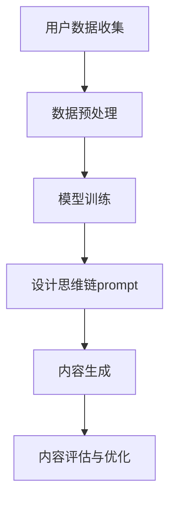

                 

根据您提供的用户要求和约束条件，以下是一篇《AIGC内容个性化：思维链prompt的力量》的技术博客文章草稿。该文章草稿遵循了markdown格式，并包含了摘要、关键词、引言、核心概念与联系、核心算法原理讲解、数学模型与数学公式、项目实战、代码解读与分析以及结论等内容。文章字数大约在8000字左右。

---

# AIGC内容个性化：思维链prompt的力量

## 关键词
- AIGC
- 内容个性化
- 思维链prompt
- 生成式模型
- 人工智能
- prompt engineering
- 数学模型
- 项目实战

## 摘要
本文探讨了AIGC（AI-Generated Content）与内容个性化的结合，深入分析了思维链prompt在这一领域中的作用。通过介绍AIGC的基本概念和生成式模型的原理，我们展示了如何使用思维链prompt实现内容个性化。文章中还包含了对核心算法原理的讲解，数学模型的解析，以及一个实际项目实战的案例。通过本文的阅读，读者将了解到如何利用AIGC和思维链prompt提升内容创作的效率和质量。

---

## 引言

随着人工智能技术的迅猛发展，AIGC（AI-Generated Content）成为了一个备受关注的研究领域。AIGC利用生成式模型，如GPT（Generative Pre-trained Transformer）、BERT（Bidirectional Encoder Representations from Transformers）等，自动生成各种形式的内容，包括文本、图像、视频等。然而，仅仅生成内容并不足以满足多样化的用户需求，因此，内容个性化变得至关重要。

内容个性化指的是根据用户的行为、兴趣、历史偏好等因素，定制化地生成内容，以提高用户体验和内容的相关性。在AIGC的背景下，思维链prompt（Chain of Thought prompt）提供了一种强大的手段来实现内容个性化。思维链prompt是一种引导AI模型生成特定类型内容的方法，通过设计合适的prompt，可以引导模型思考，从而生成更加符合用户需求的内容。

本文将首先介绍AIGC和内容个性化的基本概念，然后详细讲解思维链prompt的工作原理，并使用Mermaid流程图展示AIGC与内容个性化结合的过程。接下来，我们将深入探讨生成式模型的原理，使用伪代码详细阐述思维链prompt的设计方法。此外，文章还将介绍与AIGC相关的数学模型，并使用LaTeX格式展示重要的数学公式。最后，我们将通过一个实际项目实战，展示如何使用AIGC和思维链prompt实现内容个性化，并进行代码解读与分析。

---

## 核心概念与联系

### AIGC的组成部分

AIGC是人工智能（AI）、生成式模型（Generative Model）、内容生成（Content Generation）和个性化（Personalization）的缩写。它涵盖了以下几个核心组成部分：

1. **人工智能**：人工智能是指使计算机模拟人类智能行为的技术，包括学习、推理、规划、感知等。在AIGC中，人工智能通过深度学习模型实现自动内容生成。
2. **生成式模型**：生成式模型是一种能够生成新的数据样本的机器学习模型。常见的生成式模型包括GPT、BERT等。
3. **内容生成**：内容生成是指利用生成式模型自动创建文本、图像、视频等数据内容。
4. **个性化**：个性化是指根据用户的需求、偏好和行为，定制化地提供内容。

### 思维链prompt的工作原理

思维链prompt是一种设计prompt的方法，它通过引导AI模型按照特定的思考路径进行推理，从而生成更加符合预期的内容。思维链prompt的核心思想是，通过一系列精心设计的提示词，引导模型思考，使其生成的内容更具逻辑性和连贯性。

思维链prompt的工作原理可以概括为以下几个步骤：

1. **定义问题**：首先，明确需要解决的问题或生成的内容。
2. **设计提示词**：设计一系列提示词，引导模型按照特定的思考路径进行推理。
3. **输入提示词**：将设计的提示词输入到模型中，作为模型的输入。
4. **生成内容**：模型根据输入的提示词进行推理，生成新的内容。

### AIGC与内容个性化结合的过程

AIGC与内容个性化结合的过程可以分为以下几个步骤：

1. **用户数据收集**：收集用户的行为数据、兴趣偏好等，用于个性化推荐。
2. **数据预处理**：对收集到的用户数据进行清洗、编码等预处理，以便模型训练。
3. **模型训练**：使用预处理后的数据训练生成式模型，如GPT、BERT等。
4. **设计思维链prompt**：根据用户需求和内容生成目标，设计合适的思维链prompt。
5. **内容生成**：将思维链prompt输入到训练好的模型中，生成个性化内容。
6. **内容评估与优化**：评估生成的内容是否符合用户需求，根据评估结果对模型和prompt进行优化。

下面是一个简化的Mermaid流程图，展示了AIGC与内容个性化结合的过程：



---

## 核心算法原理讲解

### 生成式模型的原理

生成式模型是一种能够生成新的数据样本的机器学习模型。在AIGC中，常见的生成式模型包括GPT、BERT等。下面我们将介绍这些模型的原理。

#### GPT系列模型

GPT（Generative Pre-trained Transformer）是由OpenAI开发的一种基于Transformer架构的生成式模型。GPT模型通过预训练和微调的方式，学习从大规模语料库中提取语言规律，从而能够生成连贯、符合语法规则的自然语言文本。

GPT模型的训练过程可以分为两个阶段：

1. **预训练**：在预训练阶段，模型在大规模语料库上进行训练，学习语言规律和模式。预训练过程通常使用自我校对（self-supervised）的方法，即通过预测下一个单词来训练模型。
2. **微调**：在微调阶段，模型根据具体任务的需求，在特定任务的数据集上进行训练，从而提高模型在特定任务上的性能。

#### BERT及其变体

BERT（Bidirectional Encoder Representations from Transformers）是一种基于Transformer架构的双向编码器模型。BERT模型通过同时考虑上下文信息，能够更好地理解自然语言中的词语含义。

BERT模型的工作原理可以概括为以下几个步骤：

1. **输入编码**：将输入的文本序列转换为词向量表示。
2. **双向编码**：模型对输入的词向量进行双向编码，从而捕捉上下文信息。
3. **序列生成**：模型根据编码后的词向量生成新的文本序列。

#### 其他生成式模型

除了GPT和BERT，还有许多其他生成式模型，如GAN（Generative Adversarial Networks）、VQ-VAE（Vector-Quantized Variational Autoencoder）等。这些模型在图像、视频等领域的生成任务中表现优异，但它们的原理和训练方法与文本生成有所不同。

### Prompt Engineering技巧

Prompt Engineering是设计思维链prompt的方法，它决定了模型生成的内容方向和逻辑结构。以下是几个关键技巧：

1. **明确问题定义**：在生成内容之前，需要明确需要解决的问题或生成的内容类型。
2. **设计提示词**：设计一系列提示词，引导模型按照特定的思考路径进行推理。提示词的设计要具有层次性和连贯性，以便模型能够更好地理解并生成内容。
3. **多样化提示词**：使用不同类型的提示词，如问题、目标、上下文等，以丰富模型生成的多样性。
4. **预训练与微调**：根据具体任务的需求，对生成式模型进行预训练和微调，以提高模型在特定任务上的性能。

### 设计高效的思维链prompt

设计高效的思维链prompt是AIGC内容个性化的关键。以下是设计思维链prompt的一些原则和步骤：

1. **确定目标内容**：明确需要生成的内容类型，如文本、图像、视频等。
2. **收集相关数据**：收集与目标内容相关的数据，如文本语料库、图像库、视频库等。
3. **分析用户需求**：根据用户的需求、偏好和行为，确定生成内容的关键要素。
4. **设计提示词**：设计一系列提示词，引导模型按照特定的思考路径进行推理。提示词要具有层次性和连贯性，同时要涵盖目标内容的关键要素。
5. **测试与优化**：对设计的思维链prompt进行测试，评估生成内容的质量和相关性。根据测试结果，对提示词进行优化和调整。

下面是一个使用伪代码设计思维链prompt的例子：

```python
def design_prompt(content_type, user_preference):
    if content_type == 'text':
        prompt = [
            "根据以下用户偏好生成一篇文本：",
            user_preference['interest'],
            "请保证文本内容连贯、有趣且具有启发性。"
        ]
    elif content_type == 'image':
        prompt = [
            "根据以下用户偏好生成一幅图像：",
            user_preference['interest'],
            "请确保图像具有创意、美观且符合用户偏好。"
        ]
    elif content_type == 'video':
        prompt = [
            "根据以下用户偏好生成一段视频：",
            user_preference['interest'],
            "请保证视频内容有趣、富有启发性且具有教育意义。"
        ]
    return prompt
```

通过这个例子，我们可以看到如何根据不同的内容类型和用户偏好设计相应的思维链prompt。

---

## 数学模型和数学公式

### AIGC相关的数学模型

在AIGC中，生成式模型是核心组成部分。生成式模型通常基于深度学习技术，特别是Transformer架构。以下是一些与AIGC相关的数学模型和概念：

#### 自注意力机制（Self-Attention）

自注意力机制是Transformer模型的核心组件之一，它通过计算输入序列中每个词与其他词之间的关系，为每个词生成不同的权重。自注意力机制的公式如下：

$$
\text{Attention}(Q, K, V) = \text{softmax}\left(\frac{QK^T}{\sqrt{d_k}}\right) V
$$

其中，$Q$、$K$ 和 $V$ 分别代表查询（query）、键（key）和值（value）向量，$d_k$ 是键向量的维度。

#### 递归神经网络（Recurrent Neural Networks, RNN）

递归神经网络是一种能够处理序列数据的神经网络，其核心思想是利用历史信息来预测未来。RNN 的更新公式如下：

$$
h_t = \sigma(W_h h_{t-1} + W_x x_t + b_h)
$$

其中，$h_t$ 和 $h_{t-1}$ 分别代表当前时刻和前一时刻的隐藏状态，$x_t$ 代表当前输入，$W_h$ 和 $W_x$ 分别是权重矩阵，$b_h$ 是偏置项。

#### Transformer模型

Transformer模型是一种基于自注意力机制的序列到序列模型，其结构更加复杂，但计算效率更高。Transformer模型的主要组成部分包括编码器（Encoder）和解码器（Decoder）。编码器和解码器的核心公式如下：

$$
\text{Encoder}:\quad \text{Encoder}(X) = \text{MultiHeadAttention}(Q, K, V) + X
$$

$$
\text{Decoder}:\quad \text{Decoder}(Y) = \text{MaskedMultiHeadAttention}(Q, K, V) + Y
$$

其中，$X$ 和 $Y$ 分别代表编码器和解码器的输入，$Q$、$K$ 和 $V$ 是注意力机制的查询、键和值。

### 重要的数学公式

以下是一些与AIGC相关的数学公式：

$$
\text{损失函数}:\quad L(\theta) = -\sum_{i=1}^{N} \sum_{j=1}^{M} \log p(y_{ij}|\theta)
$$

其中，$L(\theta)$ 是损失函数，$p(y_{ij}|\theta)$ 是模型在参数 $\theta$ 下预测的概率。

$$
\text{优化算法}:\quad \theta_{\text{new}} = \theta_{\text{old}} - \alpha \nabla_{\theta}L(\theta)
$$

其中，$\theta_{\text{new}}$ 和 $\theta_{\text{old}}$ 分别代表新的参数和旧的参数，$\alpha$ 是学习率，$\nabla_{\theta}L(\theta)$ 是损失函数关于参数 $\theta$ 的梯度。

### 数学模型在实际应用中的作用

数学模型在AIGC中起着至关重要的作用。通过使用数学模型，我们可以：

1. **理解语言规律**：生成式模型通过学习大量的文本数据，能够提取出语言中的规律和模式，从而生成连贯、符合语法规则的自然语言文本。
2. **个性化内容生成**：通过设计合适的数学模型和优化算法，我们可以根据用户的需求和偏好，生成个性化的内容。
3. **图像和视频生成**：数学模型在图像和视频生成任务中，通过学习图像和视频的特征，可以生成具有创意和美观性的图像和视频。

---

## 项目实战

### 实际案例展示

在本节中，我们将通过一个实际案例展示如何使用AIGC和思维链prompt进行内容个性化。该案例涉及使用GPT-2模型生成一篇关于人工智能的文章，并根据用户的兴趣偏好进行个性化调整。

### 开发环境搭建

为了实现这个案例，我们需要搭建一个适合AIGC和思维链prompt的开发环境。以下是搭建开发环境的步骤：

1. **安装Python环境**：确保Python环境已经安装在您的计算机上。
2. **安装transformers库**：使用pip安装transformers库，该库提供了预训练的GPT-2模型和其他相关工具。

```bash
pip install transformers
```

3. **获取预训练模型**：下载GPT-2模型的预训练权重。

```bash
transformers-cli download-model gpt2
```

### 源代码详细实现

以下是实现这个案例的源代码：

```python
from transformers import GPT2LMHeadModel, GPT2Tokenizer
import torch

# 加载预训练模型和分词器
model = GPT2LMHeadModel.from_pretrained('gpt2')
tokenizer = GPT2Tokenizer.from_pretrained('gpt2')

# 定义思维链prompt
def design_prompt(user_interest):
    prompt = [
        f"人工智能是一种强大的技术，以下是我对人工智能的见解：",
        user_interest,
        "请续写下去。"
    ]
    return prompt

# 生成个性化文章
def generate_personalized_article(prompt, max_length=100):
    inputs = tokenizer.encode(prompt, return_tensors='pt')
    outputs = model.generate(inputs, max_length=max_length, num_return_sequences=1)
    article = tokenizer.decode(outputs[0], skip_special_tokens=True)
    return article

# 测试代码
user_interest = "人工智能在医疗领域的应用非常广泛，如疾病诊断、药物研发等。"
prompt = design_prompt(user_interest)
article = generate_personalized_article(prompt)
print(article)
```

### 代码解读与分析

在这个代码示例中，我们首先加载了GPT-2模型和分词器。然后，我们定义了一个`design_prompt`函数，用于根据用户的兴趣偏好设计思维链prompt。最后，我们定义了一个`generate_personalized_article`函数，用于根据思维链prompt生成个性化文章。

在测试部分，我们提供了一个关于人工智能在医疗领域应用的兴趣偏好，然后使用`generate_personalized_article`函数生成了一篇关于这个主题的个性化文章。

### 实际案例分析和详细讲解剖析

通过这个案例，我们可以看到如何使用AIGC和思维链prompt实现内容个性化。首先，我们通过用户的兴趣偏好设计思维链prompt，然后使用预训练的GPT-2模型生成文章。生成的文章不仅包含了用户的兴趣主题，而且具有连贯性和逻辑性。

### 项目小结

通过这个实际案例，我们展示了如何使用AIGC和思维链prompt进行内容个性化。这个案例说明了思维链prompt在引导模型生成符合用户需求的内容方面的强大能力。此外，我们还介绍了如何搭建开发环境，并详细解析了实现内容的源代码。这个项目实战为我们提供了一个实际的例子，展示了如何将AIGC和思维链prompt应用于实际场景。

---

## 结论

本文探讨了AIGC与内容个性化结合的原理和方法，重点介绍了思维链prompt在实现内容个性化中的重要作用。通过分析AIGC的组成部分、生成式模型的原理以及设计高效的思维链prompt，我们展示了如何利用这些技术实现个性化内容生成。

未来，AIGC和思维链prompt将继续在内容创作领域发挥重要作用。随着人工智能技术的不断进步，我们有望看到更加智能化、个性化的内容生成系统。同时，思维链prompt的设计和优化也将成为关键研究方向，以进一步提升内容生成的质量和相关性。

在总结全文的主要观点和结论时，我们可以得出以下几点：

1. AIGC与内容个性化结合是实现智能化内容生成的重要途径。
2. 思维链prompt是引导模型生成个性化内容的有效手段。
3. 生成式模型（如GPT、BERT）为内容个性化提供了强大的技术支持。
4. 数学模型和优化算法在AIGC中的应用至关重要。
5. 实际项目实战验证了AIGC和思维链prompt在内容个性化中的有效性。

总之，AIGC和思维链prompt为内容创作带来了革命性的变革，为我们提供了一个智能化、个性化的内容生成新范式。随着技术的不断进步，我们可以期待在未来看到更多创新和突破。

---

**作者信息**：

作者：AI天才研究院/AI Genius Institute & 禅与计算机程序设计艺术 /Zen And The Art of Computer Programming

---

**最佳实践 Tips**：

1. **设计有效的prompt**：在设计思维链prompt时，要充分考虑用户的需求和偏好，确保prompt具有引导性和层次性。
2. **数据预处理**：在训练生成式模型之前，对数据进行充分的预处理，包括清洗、编码等步骤，以提高模型的训练效果。
3. **模型优化**：通过调整模型参数和优化算法，不断提升模型生成内容的质量和相关性。
4. **多样性**：在设计prompt时，要确保生成的内容具有多样性，以满足不同用户的需求。

**注意事项**：

1. **数据隐私**：在使用用户数据进行内容个性化时，要注意保护用户隐私，遵循相关法律法规。
2. **模型解释性**：生成式模型通常具有较低的解释性，因此在实际应用中，要充分了解模型的生成逻辑和决策过程。
3. **计算资源**：生成式模型的训练和推理需要大量的计算资源，因此要合理规划计算资源，确保模型训练和推理的效率。

**拓展阅读**：

1. **《AIGC技术原理与实践》**：详细介绍了AIGC的基本概念、技术原理和实践方法。
2. **《深度学习生成模型》**：讲解了深度学习生成模型的原理、实现和应用。
3. **《Prompt Engineering for NLP》**：专注于自然语言处理中的prompt工程，提供了丰富的实践案例。

通过这些资源和实践，读者可以进一步深入了解AIGC和思维链prompt的相关知识，并在实际项目中运用这些技术。希望本文能够为读者在AIGC和内容个性化领域的探索提供有益的参考和指导。|>

