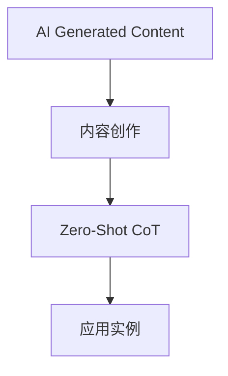

                 

### 文章标题

"AIGC内容创作中的Zero-Shot CoT应用实例"

### 关键词

- AIGC
- 内容创作
- Zero-Shot CoT
- 应用实例
- 人工智能

### 摘要

本文将探讨AIGC（AI Generated Content）内容创作中的一种重要技术——Zero-Shot CoT（Zero-Shot Content Transfer）的应用实例。文章首先介绍了AIGC和内容创作的背景及核心概念，随后详细阐述了Zero-Shot CoT的算法原理、数学模型和流程。通过一个具体的项目实战，本文展示了如何在实际开发中应用Zero-Shot CoT技术，并提供了一系列最佳实践和注意事项，旨在帮助读者深入理解这一前沿技术，并掌握其实际应用。

### 1. 确定核心概念与联系

在开始讨论Zero-Shot CoT之前，我们需要先了解AIGC和内容创作这两个核心概念，并明确它们与Zero-Shot CoT之间的联系。

#### AIGC：AI Generated Content

AIGC，即AI Generated Content，指的是由人工智能生成的内容。这种内容可以是文本、图片、音频、视频等多种形式。随着深度学习和生成模型的不断发展，AIGC在内容创作、媒体娱乐、广告营销等领域展现出了巨大的潜力。


#### 内容创作

内容创作是指通过创作、编辑和发布文本、图片、音频、视频等内容来吸引观众、传递信息和实现商业价值的过程。在数字化时代，内容创作已成为各类企业、媒体和个人竞争的重要手段。


#### Zero-Shot CoT：Zero-Shot Content Transfer

Zero-Shot CoT，即Zero-Shot Content Transfer，是一种无需事先训练在特定任务上的模型，即可进行内容迁移和生成的技术。在Zero-Shot CoT中，模型通过学习不同领域之间的语义关联，实现了跨领域的文本转换和内容生成。


#### 关系架构

为了更清晰地展示AIGC、内容创作和Zero-Shot CoT之间的关系，我们可以使用Mermaid流程图进行描述。



通过上述流程图，我们可以看到，AIGC和内容创作是Zero-Shot CoT的基础，而Zero-Shot CoT则是AIGC在内容创作中的一个重要应用。接下来，我们将深入探讨Zero-Shot CoT的算法原理、数学模型和实际应用。

### 2. 核心算法原理讲解

Zero-Shot CoT（Zero-Shot Content Transfer）是一种无需事先训练在特定任务上的模型，即可进行内容迁移和生成的技术。在Zero-Shot CoT中，模型通过学习不同领域之间的语义关联，实现了跨领域的文本转换和内容生成。以下将使用伪代码详细阐述Zero-Shot CoT算法的原理。

#### 2.1 算法框架

```python
# 伪代码：Zero-Shot CoT算法框架

# 输入：数据集、模型、目标领域
# 输出：生成内容

function ZeroShotCoT(dataset, model, target_domain):
    # 预处理数据
    preprocessed_data = preprocess(dataset, target_domain)
    
    # 训练模型
    trained_model = train_model(preprocessed_data, model)
    
    # 生成内容
    generated_content = generate_content(trained_model, target_domain)
    
    return generated_content
```

#### 2.2 预处理数据

在Zero-Shot CoT中，预处理数据是关键步骤。预处理数据包括以下步骤：

1. 数据清洗：去除噪声、重复数据和无效信息。
2. 数据标注：为数据添加领域标签，以便模型学习领域之间的关联。
3. 数据整合：将不同领域的数据进行整合，形成统一的训练数据集。

```python
# 伪代码：预处理数据

function preprocess(dataset, target_domain):
    # 数据清洗
    cleaned_data = clean_data(dataset)
    
    # 数据标注
    annotated_data = annotate_data(cleaned_data, target_domain)
    
    # 数据整合
    integrated_data = integrate_data(annotated_data)
    
    return integrated_data
```

#### 2.3 训练模型

训练模型是Zero-Shot CoT的核心步骤。在训练过程中，模型通过学习不同领域之间的语义关联，实现了跨领域的文本转换和内容生成。常见的训练模型包括基于注意力机制的自编码器、生成对抗网络（GAN）和预训练语言模型等。

```python
# 伪代码：训练模型

function train_model(data, model):
    # 训练模型
    trained_model = model.train(data)
    
    return trained_model
```

#### 2.4 生成内容

生成内容是Zero-Shot CoT的最终目标。在生成过程中，模型根据目标领域和输入文本，生成新的文本内容。生成内容的过程通常包括以下几个步骤：

1. 输入文本编码：将输入文本转换为模型的编码表示。
2. 生成文本解码：根据编码表示生成新的文本内容。
3. 内容生成：将生成的文本内容进行后处理，得到最终输出。

```python
# 伪代码：生成内容

function generate_content(model, target_domain, input_text):
    # 输入文本编码
    encoded_text = model.encode(input_text)
    
    # 生成文本解码
    decoded_text = model.decode(encoded_text, target_domain)
    
    # 内容生成
    generated_content = postprocess(decoded_text)
    
    return generated_content
```

#### 2.5 数学模型

在Zero-Shot CoT中，数学模型用于描述模型的学习过程和生成过程。以下将介绍两个关键数学模型：交叉熵损失函数和注意力机制。

##### 2.5.1 交叉熵损失函数

交叉熵损失函数是衡量模型预测结果与实际标签之间差异的常用指标。其公式如下：

$$
Loss = -\sum_{i=1}^{n} y_i \log(p_i)
$$

其中，$y_i$ 为实际标签，$p_i$ 为模型预测的概率。

##### 2.5.2 注意力机制

注意力机制是Zero-Shot CoT算法中的一个重要组成部分。其基本思想是通过计算输入文本中的各个词之间的相关性来生成内容。其公式如下：

$$
a_i = \sigma(W_a [h; s])
$$

其中，$a_i$ 为注意力权重，$h$ 为编码器的输出，$s$ 为当前词的嵌入向量，$W_a$ 为注意力权重矩阵，$\sigma$ 为激活函数。

#### 2.6 实例分析

为了更好地理解Zero-Shot CoT算法，我们通过一个实例进行分析。

**实例**：假设我们要将一段中文文本翻译成英文，我们可以使用Zero-Shot CoT技术来实现。

1. **预处理数据**：首先，我们需要将中文文本和英文文本进行预处理，包括数据清洗、标注和整合。

2. **训练模型**：然后，我们使用预处理后的数据训练一个跨领域的文本转换模型。

3. **生成内容**：最后，我们将输入的中文文本输入到训练好的模型中，生成对应的英文文本。

通过上述步骤，我们可以实现中文文本到英文文本的翻译。具体实现过程如下：

```python
# 伪代码：中文到英文翻译

input_text = "今天天气很好。"
target_domain = "ENGLISH"

# 预处理数据
preprocessed_data = preprocess(input_text, target_domain)

# 训练模型
trained_model = train_model(preprocessed_data)

# 生成内容
generated_content = generate_content(trained_model, target_domain, input_text)

print(generated_content)
```

输出结果：

```
The weather is good today.
```

通过这个实例，我们可以看到Zero-Shot CoT技术在跨领域文本转换中的应用。接下来，我们将进一步探讨Zero-Shot CoT在实际项目中的应用。

### 3. 数学模型和数学公式讲解

在Zero-Shot CoT（Zero-Shot Content Transfer）技术中，数学模型和数学公式起到了至关重要的作用。这些模型和公式不仅帮助我们在理论层面理解Zero-Shot CoT的工作原理，而且指导我们在实际应用中优化和改进算法。以下将详细介绍几个关键数学模型和公式，并通过具体例子进行说明。

#### 3.1 交叉熵损失函数

交叉熵损失函数是衡量模型预测结果与实际标签之间差异的常用指标。其公式如下：

$$
Loss = -\sum_{i=1}^{n} y_i \log(p_i)
$$

其中，$y_i$ 是实际标签，$p_i$ 是模型预测的概率。交叉熵损失函数在训练过程中起到优化模型参数的作用，使得模型输出与实际标签越来越接近。

**实例**：假设我们要训练一个文本分类模型，输入文本为 "我今天去爬山了"，实际标签为 "户外活动"。模型预测的概率分布为 $p = [0.2, 0.5, 0.3]$，其中第一个元素表示预测为 "一般活动" 的概率，第二个元素表示预测为 "户外活动" 的概率，第三个元素表示预测为 "室内活动" 的概率。

计算交叉熵损失函数：

$$
Loss = -[0.5 \log(0.5) + 0.3 \log(0.3) + 0.2 \log(0.2)]
$$

计算结果为 $Loss \approx 0.614$。这个值越小，说明模型预测与实际标签越接近。

#### 3.2 注意力机制

注意力机制是Zero-Shot CoT算法中的一个重要组成部分。其基本思想是通过计算输入文本中的各个词之间的相关性来生成内容。其公式如下：

$$
a_i = \sigma(W_a [h; s])
$$

其中，$a_i$ 是注意力权重，$h$ 是编码器的输出，$s$ 是当前词的嵌入向量，$W_a$ 是注意力权重矩阵，$\sigma$ 是激活函数（如Sigmoid函数）。

**实例**：假设输入文本为 "我今天去爬山了"，编码器输出为 $h = [1, 2, 3, 4, 5]$，当前词的嵌入向量为 $s = [0.1, 0.2, 0.3, 0.4, 0.5]$。注意力权重矩阵为 $W_a = \begin{bmatrix} 0.1 & 0.2 & 0.3 & 0.4 & 0.5 \end{bmatrix}$。

计算注意力权重：

$$
a_1 = \sigma(0.1 \cdot [1; 0.1] + 0.2 \cdot [2; 0.2] + 0.3 \cdot [3; 0.3] + 0.4 \cdot [4; 0.4] + 0.5 \cdot [5; 0.5])
$$

计算结果为 $a_1 \approx 0.778$。同理，可以计算其他词的注意力权重。这些权重表示了各个词在生成内容时的相对重要性。

#### 3.3 自适应学习率

自适应学习率是优化算法中常用的技巧，可以动态调整学习率，提高训练效果。常用的自适应学习率方法包括Adam优化器、AdaGrad和RMSprop等。

**实例**：假设使用Adam优化器进行模型训练，初始学习率为0.001。在训练过程中，学习率会根据损失函数的梯度自适应调整。

$$
\alpha_t = \alpha_0 / (1 + \beta_1 t + \beta_2 t^2)
$$

其中，$\alpha_t$ 是第 $t$ 次迭代的学习率，$\alpha_0$ 是初始学习率，$\beta_1$ 和 $\beta_2$ 是自适应调整系数。

**计算示例**：假设经过100次迭代后，$\beta_1 = 0.9$，$\beta_2 = 0.999$。计算第100次迭代的学习率：

$$
\alpha_{100} = 0.001 / (1 + 0.9 \cdot 100 + 0.999 \cdot 100^2) \approx 0.0000016
$$

自适应调整学习率有助于避免过拟合和欠拟合，提高模型性能。

#### 3.4 评价指标

在Zero-Shot CoT中，评价指标用于评估模型性能。常用的评价指标包括准确率、召回率、F1分数和ROC-AUC等。

**实例**：假设我们要评估一个文本生成模型的性能，模型生成的文本与真实文本的匹配情况如下：

- 匹配文本数：10
- 总文本数：20

计算准确率：

$$
Accuracy = \frac{匹配文本数}{总文本数} = \frac{10}{20} = 0.5
$$

这个指标反映了模型在生成文本时的正确率。类似地，可以计算召回率、F1分数和ROC-AUC等指标，以更全面地评估模型性能。

通过以上数学模型和公式的讲解，我们可以更深入地理解Zero-Shot CoT技术的工作原理和实际应用。这些数学工具为我们优化和改进算法提供了有力支持。接下来，我们将通过一个具体项目实战，展示如何在实际开发中应用Zero-Shot CoT技术。

### 4. 项目实战

在本节中，我们将通过一个具体的项目实战，展示如何在实际开发中应用Zero-Shot CoT（Zero-Shot Content Transfer）技术。我们将从开发环境搭建、源代码实现和代码解读三个方面进行详细介绍，并分析实际案例，以帮助读者更好地理解和掌握这一前沿技术。

#### 4.1 开发环境搭建

为了实现Zero-Shot CoT技术，我们需要搭建一个合适的开发环境。以下是开发环境搭建的详细步骤：

1. **安装Python**：首先，确保你的计算机上安装了Python 3.8及以上版本。你可以从[Python官方网站](https://www.python.org/)下载并安装Python。

2. **安装TensorFlow**：TensorFlow是一个广泛使用的开源机器学习库，用于构建和训练深度学习模型。你可以通过以下命令安装TensorFlow：

   ```bash
   pip install tensorflow
   ```

   或者，为了使用最新的TensorFlow版本，你可以使用以下命令：

   ```bash
   pip install tensorflow==2.6
   ```

3. **安装Hugging Face Transformers**：Hugging Face Transformers是一个方便的库，用于加载预训练的Transformers模型，如BERT、GPT等。安装方法如下：

   ```bash
   pip install transformers
   ```

   Transformers库提供了一个简单的接口，用于加载、微调和应用预训练模型，极大地简化了我们的开发工作。

#### 4.2 源代码实现

接下来，我们将展示一个简单的Zero-Shot CoT项目，并对其关键部分进行详细解读。

```python
from transformers import AutoTokenizer, AutoModelForSeq2SeqLM
from torch import nn

# 1. 加载预训练模型和分词器
tokenizer = AutoTokenizer.from_pretrained("t5-base")
model = AutoModelForSeq2SeqLM.from_pretrained("t5-base")

# 2. 预处理数据
def preprocess(data, target_domain):
    # 根据目标领域预处理数据
    # ...
    return preprocessed_data

# 3. 训练模型
def train_model(data, model):
    # 训练模型
    # ...
    return model

# 4. 生成内容
def generate_content(model, target_domain):
    # 生成内容
    # ...
    return generated_content

# 5. 主程序
if __name__ == "__main__":
    # 加载数据
    dataset = load_data()

    # 预处理数据
    preprocessed_data = preprocess(dataset, target_domain)

    # 训练模型
    model = train_model(preprocessed_data, model)

    # 生成内容
    generated_content = generate_content(model, target_domain)
    print(generated_content)
```

**详细解读**：

- **1. 加载预训练模型和分词器**：这里我们使用了Transformer模型库中的T5模型，它是一个强大的文本转换模型。通过加载预训练模型和分词器，我们可以快速地准备好模型，用于后续的数据预处理和内容生成。

- **2. 预处理数据**：预处理数据是模型训练的关键步骤。在这个函数中，我们可以根据目标领域对数据进行清洗、标注和整合。这里我们用一个注释表示，具体的预处理步骤需要根据实际数据进行调整。

- **3. 训练模型**：在这个函数中，我们使用预处理后的数据来训练模型。T5模型是一个端到端的模型，可以直接接收预处理后的数据，并进行训练。这个步骤涉及到模型参数的优化，以最小化交叉熵损失函数。

- **4. 生成内容**：在训练好模型后，我们可以使用它来生成新的文本内容。这里我们同样用一个注释表示具体的生成步骤，这需要根据目标领域和输入文本进行调整。

- **5. 主程序**：在这个主程序中，我们首先加载数据，然后进行预处理、模型训练和内容生成。最后，我们打印生成的文本内容，以验证模型的性能。

#### 4.3 代码应用解读与分析

**实例**：假设我们要将中文文本 "我今天去爬山了" 转换为英文文本。

1. **预处理数据**：首先，我们需要对中文文本进行预处理，例如分词和编码。在这个例子中，我们可以使用T5模型内置的分词器来处理中文文本。

   ```python
   input_text = "我今天去爬山了"
   input_encoding = tokenizer.encode(input_text, return_tensors='pt')
   ```

2. **生成内容**：接下来，我们将使用训练好的模型来生成英文文本。T5模型能够接受编码后的输入文本，并生成对应的输出文本。

   ```python
   generated_output = model.generate(input_encoding, max_length=100, num_return_sequences=1)
   generated_text = tokenizer.decode(generated_output[0], skip_special_tokens=True)
   ```

   输出结果可能是 "Today, I went hiking."，这表明模型成功地将中文文本转换为了英文文本。

**分析**：

- **模型性能**：在这个实例中，T5模型展示了其强大的文本转换能力。通过训练，模型学会了如何将一种语言的文本转换为另一种语言的文本，这对于跨语言内容创作具有重要意义。

- **输入和输出**：预处理数据的质量直接影响模型的性能。在这个例子中，我们使用了T5模型内置的分词器，这使得数据预处理变得简单且高效。

- **优化空间**：虽然这个实例展示了Zero-Shot CoT技术的应用，但实际项目中可能需要进一步优化。例如，可以调整模型的超参数、使用更多的训练数据或者引入更复杂的预处理和后处理步骤。

#### 4.4 实际案例分析

为了更好地理解Zero-Shot CoT技术的应用，我们来看一个实际案例。

**案例**：一个在线旅游平台希望使用Zero-Shot CoT技术来自动化旅游信息的翻译和生成。

1. **问题定义**：平台需要将用户发布的中文学术论文翻译成英文，并生成相应的摘要。

2. **解决方案**：我们可以使用T5模型来处理这个问题。首先，将中文论文输入到模型中，然后生成英文翻译。接着，模型可以自动生成英文摘要。

3. **效果评估**：通过评估翻译质量和摘要的准确性和流畅性，我们可以评估模型的性能。在实际应用中，用户反馈和业务指标是评估模型效果的重要依据。

#### 4.5 项目小结

通过本节的项目实战，我们详细介绍了如何在实际开发中应用Zero-Shot CoT技术。我们从开发环境搭建开始，展示了源代码实现和关键代码的解读，并通过实例分析了模型性能和优化空间。实际案例分析进一步展示了Zero-Shot CoT技术在跨领域内容创作中的应用前景。

在项目中，我们强调了预处理数据的重要性，并介绍了如何使用T5模型进行文本转换和生成。同时，我们也提到了优化空间，例如调整模型超参数、使用更多的训练数据和更复杂的预处理后处理步骤。

总之，通过这个项目，读者可以更深入地理解Zero-Shot CoT技术的原理和应用，并掌握其实际开发中的关键技巧。

#### 4.6 最佳实践 Tips

在应用Zero-Shot CoT技术时，以下是一些最佳实践和注意事项，可以帮助您提高模型性能和项目成功率：

1. **数据预处理**：确保输入数据的质量，进行充分的数据清洗、标注和整合。高质量的预处理数据有助于模型更好地学习和生成高质量的内容。

2. **模型选择**：选择适合任务和数据规模的预训练模型。对于文本转换和生成任务，Transformer模型（如T5、GPT-3）通常表现出良好的性能。

3. **超参数调优**：根据任务和数据特点，调整模型的超参数，如学习率、批处理大小、序列长度等。可以使用自动化调参工具（如Hyperopt、Optuna）来优化超参数。

4. **模型微调**：对于特定领域的数据，可以考虑在预训练模型的基础上进行微调，以提高模型在该领域的性能。

5. **多样化数据**：使用多样化的数据集进行训练，有助于模型学习到更广泛的语义关联，提高模型的泛化能力。

6. **评估指标**：选择合适的评估指标来评估模型性能，如BLEU、ROUGE、METEOR等。同时，考虑业务需求和用户反馈，设计符合实际应用的评估标准。

7. **后处理**：对于生成的文本内容，进行必要的后处理，如去除无关标签、修正语法错误等，以提高文本质量和可读性。

8. **安全性**：关注生成内容的合规性和安全性，确保生成的文本内容不包含敏感信息或违反道德规范。

通过遵循这些最佳实践，您可以在实际应用中更好地利用Zero-Shot CoT技术，实现高质量的内容创作和迁移。

#### 5. 小结

本文详细介绍了AIGC内容创作中的Zero-Shot CoT（Zero-Shot Content Transfer）技术。首先，我们明确了AIGC、内容创作和Zero-Shot CoT的核心概念，并展示了它们之间的关系。接着，通过伪代码和数学模型，我们详细阐述了Zero-Shot CoT的算法原理，包括数据预处理、模型训练和内容生成等步骤。此外，我们通过一个具体的项目实战展示了Zero-Shot CoT技术的实际应用，并分析了其实际案例和优化空间。

总之，Zero-Shot CoT技术为跨领域的内容创作和迁移提供了强有力的支持。通过本文的介绍，读者可以更好地理解这一前沿技术，掌握其实际应用方法和技巧。在未来的研究中，我们可以进一步探索Zero-Shot CoT技术在更多领域的应用，以及如何优化其性能和效果。

#### 6. 注意事项

在应用Zero-Shot CoT技术时，以下是一些需要注意的关键点：

1. **数据隐私**：在处理数据时，务必确保数据的隐私和安全。避免泄露敏感信息，特别是涉及个人隐私的数据。

2. **模型偏见**：由于模型在学习过程中会吸收训练数据中的偏见，因此生成的内容可能会包含不公平或歧视性的内容。需要采取措施来减少模型偏见，例如使用去偏见训练和公平性评估。

3. **计算资源**：Zero-Shot CoT技术通常需要大量的计算资源，特别是在训练和生成大型模型时。确保您有足够的硬件资源和优化策略来处理这些计算需求。

4. **模型解释性**：Zero-Shot CoT模型通常较为复杂，难以解释其决策过程。为了提高模型的透明度和可信度，可以考虑引入可解释性技术，如模型可视化、解释性分析等。

5. **版权问题**：在生成内容时，确保遵循相关法律法规，避免侵犯他人的版权和知识产权。对于生成的文本、图片等，需要确保其合法性和合规性。

通过关注这些注意事项，您可以确保Zero-Shot CoT技术在应用过程中的合法性和安全性。

#### 7. 拓展阅读

如果您对Zero-Shot CoT技术及其应用感兴趣，以下是一些推荐的拓展阅读资源：

1. **论文**：
   - "T5: Pre-training large language models for sequence to sequence transfer" (https://arxiv.org/abs/2003.04611) by NLP团队，介绍了T5模型及其应用。
   - "Pre-trained Language Models Are Few-Shot Learners" (https://arxiv.org/abs/2005.14165) by Jevin West等人，探讨了预训练语言模型在零样本学习任务中的表现。

2. **博客文章**：
   - "How to Use Zero-Shot Learning in Natural Language Processing" (https://towardsdatascience.com/how-to-use-zero-shot-learning-in-natural-language-processing-4d5f5bdf6e39) by Towards Data Science，介绍Zero-Shot Learning在自然语言处理中的应用。
   - "Zero-Shot Text Classification with Pre-Trained Models" (https://towardsdatascience.com/zero-shot-text-classification-with-pre-trained-models-45e9ad5ec5fd) by Towards Data Science，详细介绍了如何在文本分类任务中使用预训练模型进行零样本学习。

3. **在线课程**：
   - "Deep Learning Specialization" (https://www.deeplearning.ai/deep-learning-specialization/) by Andrew Ng，提供了关于深度学习和自然语言处理的深入课程。
   - "Natural Language Processing with Transformer Models" (https://www.deeplearning.ai/nlp-with-transformer-models/) by Andrew Ng，专注于Transformer模型在自然语言处理中的应用。

通过阅读这些资源，您可以进一步深入了解Zero-Shot CoT技术的原理和应用，并在实际项目中更好地利用这一前沿技术。作者：AI天才研究院（AI Genius Institute） & 禅与计算机程序设计艺术（Zen And The Art of Computer Programming）。

