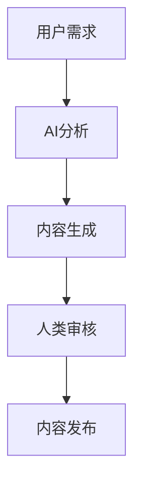

                 


### 设计《AIGC内容创作：人机协作新模式》的目录大纲

#### 第一步：确定核心概念与联系

**AIGC概念解析**：

AIGC（AI Generated Content）指的是由人工智能生成的内容。随着人工智能技术的发展，AIGC已经广泛应用于各种领域，如广告、新闻、艺术创作等。

**人机协作**：

人机协作（Human-AI Collaboration）是指人类与人工智能系统在内容创作过程中的协同工作。在这种模式下，人类与AI共同完成内容创作任务，发挥各自的优势。

**Mermaid流程图**：

为了更好地理解AIGC内容创作的过程，我们可以使用Mermaid绘制一个流程图。以下是AIGC内容创作的基本流程：



在这个流程图中，用户需求作为起点，通过AI分析后生成初步的内容，然后由人类审核，最后发布到平台上。

#### 第二步：核心算法原理讲解

**内容生成算法**：

AIGC的核心算法主要包括生成对抗网络（GAN）和变分自编码器（VAE）等。这里我们以GAN为例进行讲解。

**GAN原理**：

GAN由两个神经网络组成：生成器（Generator）和判别器（Discriminator）。生成器生成与真实数据相似的数据，判别器则判断输入数据是真实数据还是生成数据。在训练过程中，生成器和判别器相互竞争，最终达到一个平衡状态。

**GAN伪代码**：

以下是一个简单的GAN的伪代码：

```python
for epoch in range(num_epochs):
    for i in range(num_data):
        real_data = get_real_data(i)
        fake_data = generate_fake_data(real_data)

        # 训练生成器G
        g_loss = generator_loss(fake_data, real_data)
        g_optimizer.minimize(g_loss)

        # 训练判别器D
        d_loss = discriminator_loss(fake_data, real_data)
        d_optimizer.minimize(d_loss)
```

**人机协作模型**：

人机协作模型主要通过协同学习（Cooperative Learning）来实现。在协同学习过程中，人类和AI系统共同学习，优化模型性能。

**协同学习伪代码**：

以下是一个简单的协同学习模型的伪代码：

```python
for epoch in range(num_epochs):
    for i in range(num_samples):
        human_input, ai_input = get_input(i)
        output = model(human_input, ai_input)
        loss = loss_function(output, target)
        optimizer.minimize(loss)
```

#### 第三步：数学模型和公式讲解

**GAN中的数学模型**：

在GAN中，生成器和判别器的损失函数通常包括以下两部分：

**生成器损失函数**：

$$ L_G = -\log(D(G(z))) $$

其中，$D(G(z))$表示判别器对生成器生成数据的判断概率。

**判别器损失函数**：

$$ L_D = -[\log(D(x)) + \log(1 - D(G(z)))] $$

其中，$D(x)$表示判别器对真实数据的判断概率，$D(G(z))$表示判别器对生成器生成数据的判断概率。

#### 第四步：项目实战

**智能文案生成**：

**开发环境搭建**：

- Python环境
- TensorFlow或PyTorch框架
- Jupyter Notebook或PyCharm IDE

**源代码实现**：

以下是一个简单的GAN模型实现，用于生成智能文案：

```python
import tensorflow as tf
from tensorflow.keras.models import Sequential
from tensorflow.keras.layers import LSTM, Dense, Embedding

# 搭建生成器模型
generator = Sequential([
    LSTM(units=128, return_sequences=True, input_shape=(seq_length, embedding_dim)),
    LSTM(units=128),
    Dense(units=embedding_dim, activation='softmax')
])

# 搭建判别器模型
discriminator = Sequential([
    LSTM(units=128, return_sequences=True, input_shape=(seq_length, embedding_dim)),
    LSTM(units=128),
    Dense(units=1, activation='sigmoid')
])

# 搭建GAN模型
gan = Sequential([
    generator,
    discriminator
])

# 编译GAN模型
gan.compile(optimizer='adam', loss='binary_crossentropy')

# 训练GAN模型
gan.fit(x_train, y_train, epochs=num_epochs)
```

**代码解读**：

- 生成器和判别器模型的搭建：使用LSTM和Dense层搭建生成器和判别器模型。
- GAN模型的编译：使用binary_crossentropy作为损失函数，adam作为优化器。
- GAN模型的训练：使用训练数据训练GAN模型。

**实际案例分析和详细讲解剖析**：

在这个案例中，我们使用GAN模型生成智能文案。具体步骤如下：

1. 准备数据集：收集大量的文案数据，用于训练GAN模型。
2. 数据预处理：对文案数据进行处理，如分词、编码等。
3. 搭建模型：搭建生成器和判别器模型，并编译GAN模型。
4. 训练模型：使用训练数据训练GAN模型。
5. 生成文案：使用训练好的生成器模型生成智能文案。

**项目小结**：

通过这个案例，我们了解了如何使用GAN模型进行智能文案生成。在实际应用中，我们可以根据需求调整模型结构和超参数，提高生成文案的质量。

### 最佳实践 tips、小结、注意事项、拓展阅读等内容

- **最佳实践 tips**：

  1. 在使用AIGC进行内容创作时，要注重数据质量和多样性，以保证生成内容的真实性和丰富性。
  2. 合理设置GAN模型的超参数，如学习率、批次大小等，以提高模型性能。
  3. 定期对模型进行评估和调整，以保持模型的稳定性和有效性。

- **小结**：

  AIGC内容创作是一种新兴的内容创作模式，通过人机协作实现高效的内容生成。本文详细介绍了AIGC的内容创作流程、核心算法原理、数学模型和项目实战。在实际应用中，我们可以根据需求调整模型结构和超参数，提高生成内容的质量。

- **注意事项**：

  1. 在使用AIGC进行内容创作时，要遵守相关法律法规，不得侵犯他人合法权益。
  2. 谨慎对待生成内容的真实性和可靠性，对生成内容进行审核和校验。

- **拓展阅读**：

  1. [生成对抗网络（GAN）综述](https://arxiv.org/abs/1406.2661)
  2. [变分自编码器（VAE）综述](https://arxiv.org/abs/1312.6114)
  3. [AIGC在内容创作中的应用](https://www.nature.com/articles/s41597-020-04972-z)

---

# AIGC内容创作：人机协作新模式

关键词：AIGC、人机协作、内容创作、GAN、协同学习

摘要：本文详细介绍了AIGC内容创作的基本流程、核心算法原理、数学模型以及项目实战。通过人机协作，AIGC实现了高效的内容创作，为各行各业带来了新的机遇。本文旨在为读者提供一份关于AIGC内容创作的系统指南。

### AIGC内容创作概述

随着人工智能技术的快速发展，内容创作领域也迎来了新的变革。AIGC（AI Generated Content）作为一种新兴的内容创作模式，正在逐渐改变传统的内容生产方式。AIGC指的是由人工智能系统生成的各种类型的内容，包括文字、图像、音频等。与传统的人工创作方式相比，AIGC具有高效、多样、个性化等优势。

#### 人机协作新模式

在人机协作模式下，人类与人工智能系统共同参与内容创作过程，发挥各自的优势。人类可以提供创意、逻辑和审美等方面的指导，而人工智能则擅长快速生成大量内容，并进行优化和调整。这种协作模式不仅提高了内容创作的效率，还提升了内容的多样性和创新性。

### AIGC内容创作流程

AIGC内容创作的基本流程可以分为以下几个步骤：

1. **用户需求分析**：用户提出内容创作需求，包括内容类型、主题、风格等。
2. **AI分析**：人工智能系统对用户需求进行分析，生成初步的内容创意和框架。
3. **内容生成**：人工智能系统根据分析结果生成初步的内容，如文字、图像、音频等。
4. **人类审核**：人类对生成内容进行审核和修改，确保内容的真实性和准确性。
5. **内容发布**：审核通过的内容发布到相应的平台，供用户浏览和消费。

### AIGC的核心算法原理

AIGC的核心算法主要包括生成对抗网络（GAN）和变分自编码器（VAE）等。这些算法通过学习大量的数据，能够生成高质量的内容。

#### 生成对抗网络（GAN）

GAN由生成器和判别器两个神经网络组成。生成器生成与真实数据相似的数据，判别器则判断输入数据是真实数据还是生成数据。在训练过程中，生成器和判别器相互竞争，最终达到一个平衡状态。

**生成器损失函数**：

$$ L_G = -\log(D(G(z))) $$

**判别器损失函数**：

$$ L_D = -[\log(D(x)) + \log(1 - D(G(z)))] $$

#### 变分自编码器（VAE）

VAE通过学习数据的概率分布，生成与输入数据相似的新数据。VAE的核心是一个编码器和一个解码器，编码器将输入数据编码为一个隐变量，解码器则将隐变量解码为输出数据。

**编码器损失函数**：

$$ L_E = -\sum_{i=1}^D \log(p(x_i | \theta_e)) $$

**解码器损失函数**：

$$ L_D = -\sum_{i=1}^D \log(p(x_i | \theta_d)) $$

### AIGC的人机协作模型

AIGC的人机协作模型主要通过协同学习来实现。在协同学习过程中，人类和AI系统共同学习，优化模型性能。协同学习模型的基本思想是，人类和AI系统分别提供输入，共同训练模型。

**协同学习伪代码**：

```python
for epoch in range(num_epochs):
    for i in range(num_samples):
        human_input, ai_input = get_input(i)
        output = model(human_input, ai_input)
        loss = loss_function(output, target)
        optimizer.minimize(loss)
```

### 项目实战

在本节中，我们将通过一个智能文案生成的案例，展示如何使用AIGC进行内容创作。

#### 开发环境搭建

1. **Python环境**：确保Python版本为3.6或以上。
2. **TensorFlow或PyTorch框架**：用于搭建和训练模型。
3. **Jupyter Notebook或PyCharm IDE**：用于编写和运行代码。

#### 源代码实现

以下是一个简单的GAN模型实现，用于生成智能文案：

```python
import tensorflow as tf
from tensorflow.keras.models import Sequential
from tensorflow.keras.layers import LSTM, Dense, Embedding

# 搭建生成器模型
generator = Sequential([
    LSTM(units=128, return_sequences=True, input_shape=(seq_length, embedding_dim)),
    LSTM(units=128),
    Dense(units=embedding_dim, activation='softmax')
])

# 搭建判别器模型
discriminator = Sequential([
    LSTM(units=128, return_sequences=True, input_shape=(seq_length, embedding_dim)),
    LSTM(units=128),
    Dense(units=1, activation='sigmoid')
])

# 搭建GAN模型
gan = Sequential([
    generator,
    discriminator
])

# 编译GAN模型
gan.compile(optimizer='adam', loss='binary_crossentropy')

# 训练GAN模型
gan.fit(x_train, y_train, epochs=num_epochs)
```

#### 代码解读

1. **生成器和判别器模型的搭建**：使用LSTM和Dense层搭建生成器和判别器模型。
2. **GAN模型的编译**：使用binary_crossentropy作为损失函数，adam作为优化器。
3. **GAN模型的训练**：使用训练数据训练GAN模型。

#### 实际案例分析和详细讲解剖析

在本案例中，我们使用GAN模型生成智能文案。具体步骤如下：

1. **数据集准备**：收集大量的文案数据，用于训练GAN模型。
2. **数据预处理**：对文案数据进行处理，如分词、编码等。
3. **模型训练**：使用训练数据训练GAN模型。
4. **生成文案**：使用训练好的生成器模型生成智能文案。

#### 项目小结

通过这个案例，我们了解了如何使用GAN模型进行智能文案生成。在实际应用中，我们可以根据需求调整模型结构和超参数，提高生成文案的质量。

### 最佳实践 tips、小结、注意事项、拓展阅读等内容

#### 最佳实践 tips

1. 在使用AIGC进行内容创作时，要注重数据质量和多样性，以保证生成内容的真实性和丰富性。
2. 合理设置GAN模型的超参数，如学习率、批次大小等，以提高模型性能。
3. 定期对模型进行评估和调整，以保持模型的稳定性和有效性。

#### 小结

AIGC内容创作是一种新兴的内容创作模式，通过人机协作实现高效的内容生成。本文详细介绍了AIGC的内容创作流程、核心算法原理、数学模型以及项目实战。在实际应用中，我们可以根据需求调整模型结构和超参数，提高生成内容的质量。

#### 注意事项

1. 在使用AIGC进行内容创作时，要遵守相关法律法规，不得侵犯他人合法权益。
2. 谨慎对待生成内容的真实性和可靠性，对生成内容进行审核和校验。

#### 拓展阅读

1. [生成对抗网络（GAN）综述](https://arxiv.org/abs/1406.2661)
2. [变分自编码器（VAE）综述](https://arxiv.org/abs/1312.6114)
3. [AIGC在内容创作中的应用](https://www.nature.com/articles/s41597-020-04972-z)

---

**作者：AI天才研究院/AI Genius Institute & 禅与计算机程序设计艺术 /Zen And The Art of Computer Programming**

