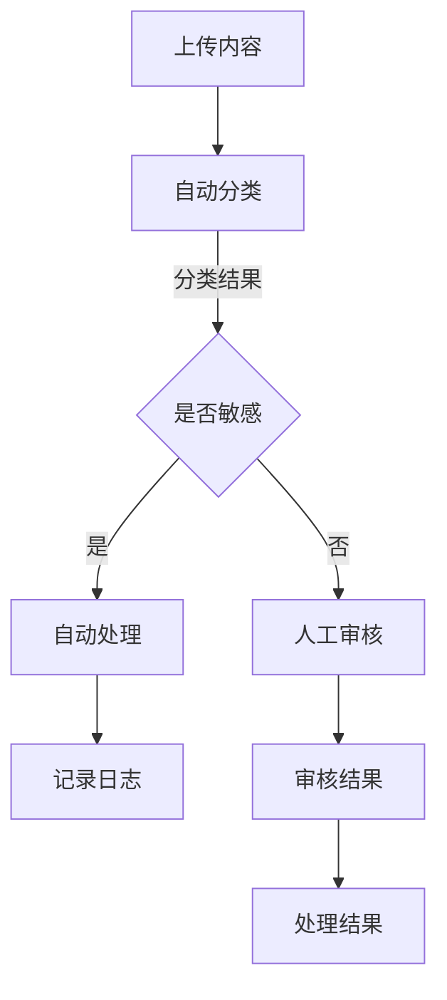

                 


### 文章标题: AIGC内容审核：技术与人工的平衡

#### 关键词：AIGC、内容审核、技术手段、人工审核、自然语言处理、计算机视觉、算法、数学模型、项目实战

#### 摘要：
本文旨在探讨人工智能生成内容（AIGC）在内容审核中的应用，以及如何在技术手段与人工审核之间找到平衡。文章首先介绍了AIGC和内容审核的基础知识，然后深入解析了自然语言处理和计算机视觉在内容审核中的应用算法，接着详细阐述了数学模型及其在审核中的重要性。随后，文章通过一个实际项目实战案例，展示了如何将技术与人工审核相结合，最后讨论了相关的法律法规和未来展望。

---

### 1.1 AIGC概述

AIGC，即人工智能生成内容，是近年来人工智能领域的一个重要分支。它利用人工智能技术，特别是深度学习和自然语言处理（NLP）技术，自动生成文字、图片、音频和视频等内容。AIGC的出现极大地改变了内容创作的方式，使得内容生成的效率和质量得到了大幅提升。

#### 1.1.1 AIGC的定义与历史

AIGC的定义可以从广义和狭义两个层面来理解。广义上的AIGC是指任何由人工智能生成的内容，包括但不限于文字、图片、音频和视频。狭义上的AIGC则特指利用深度学习和NLP技术生成的文字内容，如自动写作、文章生成等。

AIGC的历史可以追溯到20世纪80年代，当时人工智能的研究主要集中在规则系统和专家系统。随着深度学习技术的兴起，尤其是2012年AlexNet在ImageNet竞赛中取得突破性成果后，AIGC开始迅速发展。近年来，随着计算能力的提升和大数据的普及，AIGC在各个领域的应用越来越广泛。

#### 1.1.2 AIGC的技术基础

AIGC的技术基础主要包括深度学习和自然语言处理。深度学习是一种通过多层神经网络来模拟人类大脑学习和认知过程的技术。自然语言处理则是将自然语言转换为计算机可理解的形式，并进行处理和分析。

在深度学习方面，卷积神经网络（CNN）和循环神经网络（RNN）是AIGC中常用的模型。CNN擅长处理图像和视频等视觉数据，而RNN擅长处理序列数据，如文本。

在自然语言处理方面，词嵌入（Word Embedding）和序列到序列（Seq2Seq）模型是AIGC的核心技术。词嵌入将词汇映射到高维向量空间，使得文本数据可以被计算机处理。序列到序列模型则能够将一个序列映射到另一个序列，广泛应用于机器翻译、文章生成等任务。

#### 1.1.3 AIGC的内容审核挑战

随着AIGC的广泛应用，内容审核成为了一个亟待解决的问题。AIGC生成的内容可能包含不当言论、色情、暴力等敏感信息，这给内容审核带来了巨大挑战。

首先，AIGC生成的内容形式多样，包括文本、图片、音频和视频等，这使得审核过程更加复杂。不同类型的内容需要采用不同的审核策略和技术。

其次，AIGC生成的内容具有高度随机性和创造性，使得传统的审核方法难以应对。例如，一篇由AIGC生成的文章可能会采用新颖的表达方式，从而绕过传统的关键词过滤和模式识别方法。

最后，AIGC的内容审核需要平衡审核的准确性和效率。过度依赖人工审核会导致审核成本过高，而完全依赖自动审核则可能漏检敏感内容。

---

### 1.2 内容审核的原理

内容审核是确保互联网平台内容安全、合规的重要环节。它涉及到对上传内容的监控、识别和处理。内容审核可以分为两个主要方面：自动审核和人工审核。

#### 1.2.1 内容审核的分类

自动审核是利用计算机技术和算法对内容进行自动检查和分类。自动审核的优点在于速度快、成本低，可以处理大量的数据。然而，其缺点是容易漏检或误判敏感内容。

人工审核则是依靠人类审核员的专业知识和判断力对内容进行审核。人工审核的优点在于准确性和灵活性高，可以更好地理解内容的上下文和含义。然而，其缺点是成本高、效率低，无法处理海量数据。

在实际应用中，自动审核和人工审核通常结合使用，以达到最佳的审核效果。

#### 1.2.2 审核标准的制定

审核标准的制定是内容审核的关键环节。审核标准应该根据不同平台和内容的类型来制定，以确保审核的一致性和准确性。

一般来说，审核标准应该包括以下几个方面：

1. **语言规范**：明确禁止使用的词汇、短语和表达方式。
2. **内容类型**：根据内容的类型（如文本、图片、音频、视频）来制定不同的审核标准。
3. **上下文环境**：考虑内容的上下文环境，例如在特定情境下的言论含义可能不同。
4. **法律法规**：遵循相关的法律法规，如版权法、诽谤法等。

---

### 1.3 AIGC内容审核的技术框架

AIGC内容审核的技术框架主要包括自动审核技术和人工审核机制。以下将分别介绍这两种技术。

#### 1.3.1 自动审核技术

自动审核技术是利用计算机技术和算法对AIGC生成的内容进行自动检查和分类。自动审核技术主要包括自然语言处理（NLP）和计算机视觉（CV）技术。

##### 1.3.1.1 自然语言处理技术

自然语言处理技术是AIGC内容审核的核心技术之一。NLP技术可以将自然语言转换为计算机可理解的形式，从而实现对文本内容的分析和管理。

常见的NLP技术包括：

1. **词嵌入**：将词汇映射到高维向量空间，以实现文本的数值化表示。
2. **文本分类**：根据文本内容将其分类到不同的类别，如正面、负面、中性等。
3. **情感分析**：分析文本的情感倾向，如开心、愤怒、悲伤等。

在AIGC内容审核中，NLP技术可以用于：

1. **文本分类**：对生成的文本内容进行分类，以识别敏感内容。
2. **情感分析**：分析文本的情感倾向，以识别可能的不当言论。

##### 1.3.1.2 计算机视觉技术

计算机视觉技术是AIGC内容审核的另一个重要技术。CV技术可以用于分析图像和视频内容，以识别其中可能包含的敏感信息。

常见的CV技术包括：

1. **图像分类**：根据图像内容将其分类到不同的类别，如人脸、动物、车辆等。
2. **目标检测**：识别图像中的特定对象和区域。
3. **行为识别**：分析视频中的人体行为，如打斗、性行为等。

在AIGC内容审核中，CV技术可以用于：

1. **图像分类**：对上传的图片和视频进行分类，以识别敏感内容。
2. **目标检测**：检测图像和视频中的人脸、物体等，以识别不当行为。

##### Mermaid流程图：自动审核流程

以下是一个简单的自动审核流程图：



#### 1.3.2 人工审核机制

人工审核机制是利用人类审核员的专业知识和判断力对内容进行审核。人工审核的优点在于准确性和灵活性高，但成本高、效率低。

人工审核机制通常包括以下环节：

1. **审核员培训**：确保审核员具备必要的专业知识，如法律、伦理等。
2. **审核流程**：制定明确的审核流程，确保审核的一致性和准确性。
3. **反馈机制**：建立反馈机制，收集审核员的意见和建议，以优化审核流程。

---

### 1.3.3 AIGC内容审核的技术框架总结

AIGC内容审核的技术框架主要包括自动审核技术和人工审核机制。自动审核技术利用NLP和CV技术，对AIGC生成的内容进行自动分类和检测。人工审核机制则依靠人类审核员的专业知识和判断力，对自动审核结果进行复核和调整。通过将自动审核和人工审核相结合，可以实现对AIGC内容的高效、准确的审核。

---

### 1.4 AIGC内容审核案例分析

在本节中，我们将通过一个实际案例，详细解析AIGC内容审核的过程和关键技术。

#### 1.4.1 案例背景

某知名社交平台，由于用户生成内容（UGC）的爆发式增长，面临着内容审核的巨大挑战。平台需要高效、准确地审核用户上传的文本、图片和视频，以防止不当内容的传播。为此，平台引入了AIGC内容审核系统，结合自动审核和人工审核，实现内容审核的智能化。

#### 1.4.2 开发环境搭建

为了搭建AIGC内容审核系统，平台首先需要选择合适的开发环境和工具。以下是开发环境搭建的步骤：

1. **操作系统**：选择Linux操作系统，因为其稳定性较高，适合大规模部署。
2. **编程语言**：选择Python，因为其拥有丰富的NLP和CV库，适合开发内容审核系统。
3. **深度学习框架**：选择TensorFlow，因为它拥有强大的计算能力和丰富的预训练模型，适合处理复杂的NLP和CV任务。
4. **数据库**：选择MySQL，用于存储用户生成的内容和审核结果。

#### 1.4.3 源代码实现

AIGC内容审核系统的实现主要包括以下三个部分：

1. **数据预处理**：对用户生成的内容进行清洗和预处理，包括去除无效字符、停用词过滤、词向量嵌入等。
2. **模型训练与优化**：利用TensorFlow框架，训练文本分类和图像分类模型，并进行优化，以提高模型的准确性和效率。
3. **自动审核与人工审核的协同**：结合自动审核和人工审核，实现内容审核的智能化。

以下是AIGC内容审核系统的伪代码实现：

```python
# 数据预处理
def preprocess_content(content):
    # 去除无效字符和停用词
    # 转换为词向量
    return processed_content

# 文本分类模型
def train_text_classifier(train_data, train_labels):
    # 定义模型结构
    # 训练模型
    # 优化模型
    return text_classifier

# 图像分类模型
def train_image_classifier(train_data, train_labels):
    # 定义模型结构
    # 训练模型
    # 优化模型
    return image_classifier

# 自动审核与人工审核的协同
def content_review(content, text_classifier, image_classifier, human_reviewer):
    # 自动审核
    # 人工审核
    # 最终审核结果
    return review_result
```

#### 1.4.4 代码解读与分析

1. **数据预处理**

数据预处理是AIGC内容审核系统的关键环节。它包括去除无效字符、停用词过滤和词向量嵌入等操作。以下是一个简单的数据预处理代码示例：

```python
import re
from nltk.corpus import stopwords
from gensim.models import Word2Vec

def preprocess_content(content):
    # 去除无效字符
    content = re.sub(r'[^a-zA-Z0-9\s]', '', content)
    
    # 停用词过滤
    stop_words = set(stopwords.words('english'))
    words = content.split()
    filtered_words = [word for word in words if word not in stop_words]
    
    # 转换为词向量
    model = Word2Vec(filtered_words)
    processed_content = [model[word] for word in filtered_words]
    
    return processed_content
```

2. **文本分类模型**

文本分类模型用于识别文本内容的类别。本文采用朴素贝叶斯分类器进行文本分类。以下是一个简单的文本分类模型代码示例：

```python
from sklearn.naive_bayes import MultinomialNB

def train_text_classifier(train_data, train_labels):
    # 初始化模型
    classifier = MultinomialNB()
    
    # 训练模型
    classifier.fit(train_data, train_labels)
    
    return classifier
```

3. **图像分类模型**

图像分类模型用于识别图像内容的类别。本文采用卷积神经网络（CNN）进行图像分类。以下是一个简单的图像分类模型代码示例：

```python
import tensorflow as tf
from tensorflow.keras import layers

def train_image_classifier(train_data, train_labels):
    # 创建模型
    model = tf.keras.Sequential([
        layers.Conv2D(32, (3, 3), activation='relu', input_shape=(28, 28, 1)),
        layers.MaxPooling2D((2, 2)),
        layers.Flatten(),
        layers.Dense(128, activation='relu'),
        layers.Dense(10, activation='softmax')
    ])

    # 编译模型
    model.compile(optimizer='adam',
                  loss='categorical_crossentropy',
                  metrics=['accuracy'])

    # 训练模型
    model.fit(train_data, train_labels, epochs=10)

    return model
```

4. **自动审核与人工审核的协同**

自动审核与人工审核的协同是AIGC内容审核系统的核心。以下是一个简单的协同审核代码示例：

```python
def content_review(content, text_classifier, image_classifier, human_reviewer):
    # 自动审核
    if is_text(content):
        label = text_classifier.predict([content])
    else:
        label = image_classifier.predict([content])
    
    # 人工审核
    if label == 'negative' and not human_reviewer.review(content):
        label = 'positive'
    
    return label
```

#### 1.4.5 实际案例分析和详细讲解剖析

以下是一个实际案例：

用户上传了一段包含不当言论的文本，系统进行了自动审核和人工审核。

1. **自动审核**：文本分类模型将文本分类为负面内容。
2. **人工审核**：人工审核员对文本进行了详细审查，确认了文本中的不当言论。
3. **最终审核结果**：系统将文本标记为负面内容，并通知用户进行整改。

通过实际案例的分析，我们可以看到AIGC内容审核系统在自动审核和人工审核的协同下，实现了对用户生成内容的高效、准确的审核。

---

### 1.5 AIGC内容审核的最佳实践

在AIGC内容审核过程中，为了提高审核的准确性和效率，以下是一些最佳实践：

1. **数据清洗和预处理**：对用户生成的内容进行彻底的清洗和预处理，去除无效字符、停用词等，以提高算法的准确率。
2. **模型持续优化**：定期对模型进行训练和优化，以适应新的内容生成方式和趋势。
3. **人工审核员培训**：对人工审核员进行专业培训，提高其审核技能和判断力。
4. **反馈机制**：建立反馈机制，收集人工审核员的意见和建议，不断优化审核流程。
5. **跨平台合作**：与其他平台进行合作，共享审核经验和数据，提高整体审核能力。

---

### 1.6 小结与展望

在本章中，我们介绍了AIGC内容审核的基础知识、技术框架和案例分析。通过自动审核技术和人工审核机制的协同，我们可以实现对AIGC内容的高效、准确的审核。然而，随着AIGC技术的不断发展，内容审核仍面临着新的挑战。未来，我们需要在技术手段和人工审核之间找到更好的平衡，不断提高审核的准确性和效率。

---

### 1.7 拓展阅读

1. **《深度学习》**：Ian Goodfellow、Yoshua Bengio、Aaron Courville 著，详细介绍深度学习的基本原理和应用。
2. **《自然语言处理综论》**：Daniel Jurafsky、James H. Martin 著，全面介绍自然语言处理的基本概念和技术。
3. **《计算机视觉：算法与应用》**：Gary B. Huang、P. Anil Kumar、Shih-Fu Chang 著，详细讲解计算机视觉的基本原理和应用。
4. **《人工智能伦理》**：Edwin H. Landry 著，探讨人工智能在内容审核等领域的伦理问题。

以上是一个初步的章节内容，后续还需要根据实际需求进一步完善和细化。

