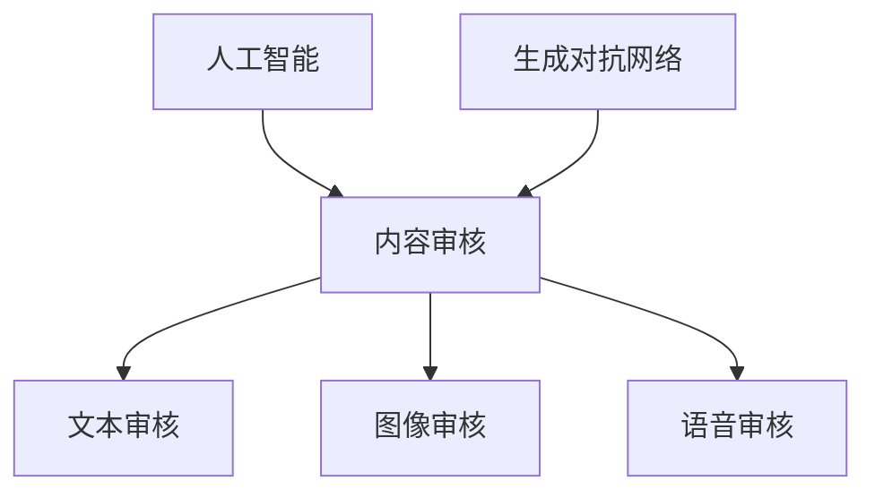

                 

# AIGC内容审核：设计安全可控的提示词系统

## 关键词
AIGC, 内容审核, 提示词系统, 安全可控性, 自然语言处理, 机器学习, 深度学习

## 摘要
本文探讨了AIGC内容审核中的关键问题——设计安全可控的提示词系统。通过介绍AIGC内容审核的概念和重要性，详细阐述其技术原理，以及提示词系统的设计和实现，本文旨在为读者提供一个全面的指南，以帮助他们在实际项目中构建高效、安全的提示词系统。

## 目录

## 第一部分：AIGC内容审核基础

### 第1章：AIGC内容审核概述

### 第2章：AIGC内容审核技术原理

### 第3章：安全可控的提示词系统设计

## 第二部分：AIGC内容审核应用实战

### 第4章：实际项目需求分析

### 第5章：设计安全可控的提示词系统

### 第6章：系统开发与实现

### 第7章：系统测试与评估

### 第8章：案例研究

## 第三部分：展望与未来方向

### 第9章：AIGC内容审核的挑战与机遇

### 第10章：AIGC内容审核的未来方向

### 细化目录大纲与内容

**第一部分：AIGC内容审核基础**

### 第1章：AIGC内容审核概述

**1.1 背景介绍**
内容审核是互联网时代的重要需求，随着AI技术的崛起，人工智能增强内容生成（AIGC）技术开始应用于内容审核领域，提供自动化、智能化的审核解决方案。

**1.2 核心概念与联系**
AIGC内容审核涉及的关键概念包括人工智能（AI）、生成对抗网络（GAN）和内容审核。以下是这些概念之间的联系架构：

**1.3 AIGC内容审核的重要性**
AIGC内容审核在保护用户权益、维护网络秩序、提升内容质量等方面发挥着重要作用。

### 第2章：AIGC内容审核技术原理

**2.1 自然语言处理技术**
自然语言处理（NLP）是AIGC内容审核的核心技术之一，包括分词、词性标注、句法分析等步骤。

**2.2 机器学习与深度学习算法**
机器学习与深度学习算法在AIGC内容审核中用于特征提取和分类模型训练。

**2.3 数据预处理与特征提取**
数据预处理是AIGC内容审核的基础，特征提取则决定了模型的表现。

### 第3章：安全可控的提示词系统设计

**3.1 提示词生成算法的数学模型**
提示词生成算法的数学模型通常基于概率模型或深度学习模型，用于生成具有特定语义的提示词。

**3.2 提示词安全性的评估方法**
提示词安全性的评估方法包括词频统计、关键词筛选和语义分析等。

**3.3 提示词生成算法的详细解释**
详细解释提示词生成算法的流程，包括数据预处理、模型训练、生成与评估等步骤。

**第二部分：AIGC内容审核应用实战**

### 第4章：实际项目需求分析

**4.1 项目背景与需求**
分析实际项目中的背景和需求，明确内容审核的目标和要求。

**4.2 用户需求分析与痛点**
分析用户在内容审核中的具体需求，以及可能遇到的痛点。

### 第5章：设计安全可控的提示词系统

**5.1 提示词系统的架构设计**
设计安全可控的提示词系统架构，包括数据层、算法层和应用层。

**5.2 安全控制策略的实现**
实现安全控制策略，确保提示词系统的安全性和可控性。

### 第6章：系统开发与实现

**6.1 开发环境搭建**
搭建AIGC内容审核系统的开发环境，包括硬件配置、软件安装和开发工具选择。

**6.2 源代码详细实现**
详细解释源代码的实现过程，包括模型训练、提示词生成和内容审核等。

**6.3 代码解读与分析**
对源代码进行解读与分析，解释关键算法和实现的细节。

### 第7章：系统测试与评估

**7.1 系统测试方法与工具**
介绍系统测试的方法和工具，确保系统在不同环境下都能正常运行。

**7.2 性能评估与优化**
对系统进行性能评估，并提出优化策略，提高系统效率。

### 第8章：案例研究

**8.1 成功案例介绍**
介绍实际应用中的成功案例，展示AIGC内容审核系统的效果。

**8.2 挑战与解决方案**
分析实际项目中遇到的挑战，并介绍相应的解决方案。

**第三部分：展望与未来方向**

### 第9章：AIGC内容审核的挑战与机遇

**9.1 技术发展趋势**
探讨AIGC内容审核领域的技术发展趋势，包括新算法、新应用等。

**9.2 应用领域的拓展**
分析AIGC内容审核在各个应用领域的拓展潜力。

### 第10章：AIGC内容审核的未来方向

**10.1 安全性提升**
讨论如何提升AIGC内容审核系统的安全性，应对日益复杂的网络威胁。

**10.2 多语言与跨模态内容审核**
探讨多语言与跨模态内容审核的发展方向，为全球范围内的内容审核提供解决方案。

## 结论

本文通过对AIGC内容审核的深入探讨，提供了设计安全可控的提示词系统的指导。随着AI技术的不断发展，AIGC内容审核将在网络安全、内容质量控制等领域发挥越来越重要的作用。希望本文能为相关领域的从业人员提供有价值的参考。作者：AI天才研究院/AI Genius Institute & 禅与计算机程序设计艺术 /Zen And The Art of Computer Programming。

