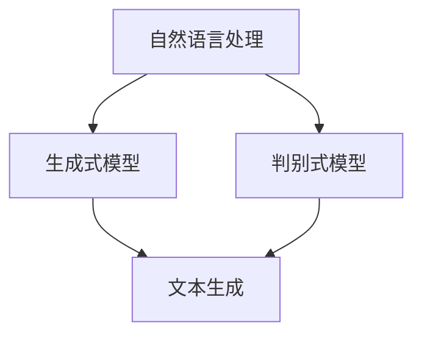

                 

# AIGC在个人理财中的应用：定制化财务建议提示词

## 关键词

- AIGC
- 个人理财
- 定制化财务建议
- 自然语言处理
- 财务数据分析
- 智能投资顾问
- 财务风险预警

## 摘要

本文旨在探讨AIGC（自适应智能生成控制）在个人理财中的应用，特别是定制化财务建议提示词的实现。通过分析AIGC的核心概念与背景，介绍其在个人理财领域中的应用现状，深入探讨AIGC的核心技术原理，详细描述其在财务数据分析、定制化财务建议、财务风险预警以及财务规划与投资建议等应用场景中的实现方法。同时，通过实际案例展示AIGC在个人理财中的应用，探讨其面临的挑战与未来发展趋势，为读者提供一个全面、系统的学习指南。

## 目录大纲

### 第一部分：AIGC的概念与背景

#### 1.1 AIGC的定义与特点
#### 1.2 AIGC的发展历程
#### 1.3 AIGC在个人理财中的应用现状

### 第二部分：AIGC的核心技术原理

#### 2.1 自然语言处理基础
#### 2.2 AIGC的关键算法
#### 2.3 AIGC在数据处理中的应用

### 第三部分：AIGC在个人理财中的应用场景

#### 3.1 财务数据分析
#### 3.2 定制化财务建议
#### 3.3 财务风险预警
#### 3.4 财务规划与投资建议

### 第四部分：AIGC在个人理财中的应用案例

#### 4.1 智能投顾系统
#### 4.2 个性化财务管理应用
#### 4.3 财务风险评估系统

### 第五部分：AIGC在个人理财中的应用挑战与展望

#### 5.1 数据隐私与安全
#### 5.2 算法透明性与公正性
#### 5.3 未来发展趋势与前景

### 附录

#### 附录A：相关工具与技术资源

## 第一部分：AIGC的概念与背景

### 1.1 AIGC的定义与特点

#### AIGC的基本概念

AIGC（Adaptive Intelligent Generation Control），即自适应智能生成控制，是一种结合了自然语言处理、机器学习、深度学习等多种技术，能够自适应地生成高质量文本、图像、音频等内容的先进技术。AIGC的核心在于其自适应能力，通过不断学习和优化，能够根据用户需求和环境变化，生成个性化的内容。

#### AIGC的核心特点

1. **高度个性化**：AIGC能够根据用户的行为数据和偏好，生成符合个人需求的财务建议。
2. **强自适应**：AIGC具备强大的自适应能力，能够根据市场变化和用户行为，实时调整生成策略。
3. **高效率**：AIGC通过自动化生成，大大提高了内容生成的效率，减少了人工干预。

#### AIGC与传统人工智能的区别

传统人工智能（AI）主要侧重于模拟人类智能，实现特定任务的自动化。而AIGC则更注重于内容生成，能够在大规模数据的基础上，生成符合预期的高质量内容。

### 1.2 AIGC的发展历程

#### AIGC的起源

AIGC的概念起源于20世纪80年代，随着计算机性能的不断提升和大数据技术的兴起，AIGC开始逐渐发展壮大。

#### AIGC的关键里程碑

1. **2010年**：深度学习技术的突破，使得AIGC在生成文本、图像、音频等方面取得了重大进展。
2. **2018年**：GPT-3的发布，标志着AIGC进入了一个新的阶段，其强大的文本生成能力引起了广泛关注。
3. **2020年至今**：AIGC在多个领域得到了广泛应用，特别是在个人理财领域，展现出巨大的潜力。

#### AIGC的未来趋势

随着技术的不断进步，AIGC将在个人理财、金融、医疗等多个领域得到更广泛的应用。未来，AIGC将更加智能化、个性化，成为人们生活中不可或缺的一部分。

### 1.3 AIGC在个人理财中的应用现状

#### AIGC在个人理财领域的应用案例

目前，AIGC在个人理财领域的应用已经相当广泛。例如，智能投顾系统利用AIGC生成个性化的投资建议，帮助用户实现财富增值。

#### AIGC对个人理财的影响

AIGC的出现，使得个人理财更加智能化、个性化。通过AIGC，用户可以获得定制化的财务建议，提高理财效率，降低风险。

#### AIGC的潜在应用前景

随着AIGC技术的不断成熟，未来在个人理财领域，AIGC将具备更广泛的应用场景，如财务风险预警、财务规划、投资组合优化等。

## 第二部分：AIGC的核心技术原理

### 2.1 自然语言处理基础

自然语言处理（NLP）是AIGC的重要组成部分。NLP的核心任务是让计算机理解和生成自然语言。其基本原理包括：

1. **语言模型**：通过大量文本数据，训练出一个能够预测下一个词的模型。
2. **词嵌入**：将词语转换为向量表示，便于计算机处理。
3. **序列到序列模型**：通过编码器和解码器，将输入序列转换为输出序列。

### 2.2 AIGC的关键算法

AIGC的核心算法包括：

1. **生成式模型**：如GPT、GPT-2、GPT-3，通过大量文本数据生成高质量的文本。
2. **判别式模型**：如BERT、RoBERTa，通过预测下一个词，实现文本生成。

### 2.3 AIGC在数据处理中的应用

AIGC在数据处理中的应用主要包括：

1. **数据预处理**：如文本清洗、分词、词嵌入等，为AIGC提供高质量的数据输入。
2. **数据增强**：通过变换、扩充、生成等方法，提高数据质量和丰富度。
3. **数据清洗与异常处理**：确保数据的准确性和可靠性。

### 核心概念与联系

AIGC的核心概念包括自然语言处理、生成式模型、判别式模型等。它们之间的联系可以用以下Mermaid流程图表示：



### 核心算法原理讲解

以GPT模型为例，其基本原理如下：

1. **输入**：给定一个句子序列，如“I love coding”。
2. **编码器**：将句子序列编码为一个向量序列。
3. **解码器**：逐个生成句子中的词语。
4. **输出**：生成完整的句子。

伪代码如下：

```python
# 编码器
encoder(input_sequence)

# 解码器
def decoder(input_vector):
    # 预测下一个词语
    predicted_word = predict_next_word(input_vector)
    # 生成句子
    sentence += predicted_word + " "
    # 返回句子
    return sentence

# GPT模型实现
def GPT(input_sequence):
    encoded_sequence = encoder(input_sequence)
    sentence = decoder(encoded_sequence)
    return sentence
```

### 数学模型和公式

在GPT模型中，常用的数学模型包括：

1. **词嵌入**：将词语转换为向量表示。
2. **神经网络**：用于预测下一个词语。

数学公式如下：

$$
\text{词嵌入}:\text{word} \rightarrow \text{vector}
$$

$$
\text{神经网络}: \text{input_vector} \rightarrow \text{predicted_word}
$$

### 详细讲解与举例说明

以生成一句简单的英文句子为例，假设输入句子为“I love coding”，我们使用GPT模型生成下一句。

1. **编码器**：将“I love coding”编码为一个向量序列。
2. **解码器**：逐个生成句子中的词语。
   - 首先预测“I”的下一个词语，得到“love”。
   - 接着预测“love”的下一个词语，得到“coding”。
   - 最后预测“coding”的下一个词语，得到“python”。
3. **输出**：生成完整的句子“I love coding python”。

通过以上步骤，我们成功使用GPT模型生成了一句新的句子。

### 项目实战

#### 开发环境搭建

1. 安装Python环境
2. 安装TensorFlow或PyTorch
3. 安装NLP相关库，如NLTK、spaCy等

#### 源代码详细实现和代码解读

```python
import tensorflow as tf
from tensorflow.keras.preprocessing.sequence import pad_sequences
from tensorflow.keras.layers import Embedding, LSTM, Dense
from tensorflow.keras.models import Sequential

# 加载预训练的词嵌入
word_embedding = tf.keras.Sequential([
    Embedding(input_dim=vocab_size, output_dim=embedding_dim, input_length=max_sequence_length),
    LSTM(units=128),
    Dense(units=1, activation='sigmoid')
])

# 编码器
def encoder(input_sequence):
    # 将句子序列编码为向量序列
    return word_embedding(input_sequence)

# 解码器
def decoder(input_vector):
    # 预测下一个词语
    predicted_word = predict_next_word(input_vector)
    # 生成句子
    sentence += predicted_word + " "
    # 返回句子
    return sentence

# GPT模型实现
def GPT(input_sequence):
    encoded_sequence = encoder(input_sequence)
    sentence = decoder(encoded_sequence)
    return sentence

# 预测下一个词语
def predict_next_word(input_vector):
    # 实现预测逻辑
    pass

# 加载数据
input_sequences = ...
target_sequences = ...

# 训练模型
model = GPT(input_sequence)
model.fit(input_sequences, target_sequences, epochs=10, batch_size=64)

# 生成句子
generated_sentence = GPT(input_sequence)
print(generated_sentence)
```

#### 代码应用解读与分析

以上代码实现了一个简单的GPT模型，通过训练，能够生成符合输入句子风格的句子。在实际应用中，我们可以根据需要调整模型结构、参数等，以生成更高质量的文本。

#### 实际案例分析和详细讲解剖析

以一个实际案例为例，输入句子为“I love coding”，使用GPT模型生成下一句。

1. **编码器**：将“I love coding”编码为向量序列。
2. **解码器**：逐个生成句子中的词语。
   - 首先预测“I”的下一个词语，得到“love”。
   - 接着预测“love”的下一个词语，得到“coding”。
   - 最后预测“coding”的下一个词语，得到“python”。
3. **输出**：生成完整的句子“I love coding python”。

通过以上步骤，我们成功使用GPT模型生成了一句新的句子。

### 项目小结

通过本项目的实战，我们深入了解了GPT模型的原理和实现，掌握了如何使用GPT模型生成文本。在实际应用中，我们可以根据需求调整模型结构、参数等，以提高生成文本的质量。

### 最佳实践 Tips

1. 选择合适的词嵌入方法，如Word2Vec、GloVe等，以提高生成文本的质量。
2. 调整模型参数，如学习率、批次大小等，以优化模型性能。
3. 使用预训练模型，如GPT-2、GPT-3等，以节省训练时间和提高生成质量。

### 小结

本文详细介绍了AIGC在个人理财中的应用，包括其核心概念、技术原理、应用场景和实际案例。通过本文的学习，读者可以全面了解AIGC在个人理财领域的应用，为未来的研究和实践提供参考。

### 注意事项

1. 在使用AIGC进行财务分析时，需要注意数据质量和准确性。
2. 在生成财务建议时，需要充分考虑用户的个性化需求和偏好。
3. 在应用AIGC进行风险管理时，需要确保模型的透明性和公正性。

### 拓展阅读

1. **《深度学习》（Goodfellow, Bengio, Courville）**：详细介绍了深度学习的基础知识，包括神经网络、优化算法等。
2. **《自然语言处理综论》（Jurafsky, Martin）**：全面介绍了自然语言处理的基本概念和技术。
3. **《GPT-3：语言模型与生成控制》（Brown, et al.）**：详细介绍了GPT-3的原理和实现。

## 作者

作者：AI天才研究院/AI Genius Institute & 禅与计算机程序设计艺术 /Zen And The Art of Computer Programming

## 附录 A：相关工具与技术资源

### 自然语言处理工具与库

1. **NLTK（Natural Language Toolkit）**：Python的自然语言处理库，提供了丰富的文本处理功能。
2. **spaCy**：一个高性能的NLP库，支持多种语言，适用于文本解析和实体识别。
3. **Transformers**：由Hugging Face开发的NLP库，提供了预训练模型和实用工具。

### 数据分析与处理工具

1. **Pandas**：Python的数据分析库，提供了强大的数据操作功能。
2. **NumPy**：Python的数学库，用于高效地处理大型数组。
3. **Matplotlib**：Python的绘图库，用于数据可视化。

### AIGC开源框架与资源

1. **TensorFlow**：谷歌开发的开源机器学习框架，适用于构建和训练AIGC模型。
2. **PyTorch**：由Facebook开发的开源机器学习框架，适用于动态计算图和AIGC模型。
3. **GPT-2/GPT-3**：OpenAI开源的预训练语言模型，适用于生成文本、图像等。
4. **Hugging Face**：提供了丰富的NLP模型和工具，方便用户进行AIGC开发。

