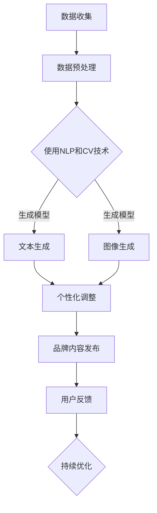

                 

### 引言

#### 1.1 AIGC概述

AIGC（Artificial Intelligence Generated Content）是指通过人工智能技术生成内容的过程。AIGC涉及多个领域的创新应用，包括但不限于自然语言处理、计算机视觉和生成模型。这种技术利用大量的数据和先进的算法，自动创建高质量的内容，从而在广告、娱乐、新闻创作等多个行业中展现出巨大的潜力。

AIGC的发展历程可以追溯到20世纪末，随着计算能力的提升和机器学习算法的进步，AIGC技术逐渐从理论走向实践。特别是在深度学习、转移学习和自监督学习等领域，AIGC技术取得了显著的突破。目前，AIGC已经在诸如自动写作、智能客服、个性化推荐等领域得到了广泛应用。

#### 1.2 个性化品牌形象塑造的重要性

个性化品牌形象塑造是企业在激烈市场竞争中脱颖而出的关键。通过构建独特的品牌形象，企业可以增强消费者对品牌的认知和忠诚度。个性化品牌形象不仅能够提高品牌的竞争力，还可以为品牌带来更高的附加值。

在当今信息爆炸的时代，消费者对品牌的期望越来越高。他们渴望得到个性化和定制化的体验，而传统的品牌塑造方式往往难以满足这一需求。AIGC技术为个性化品牌形象塑造提供了新的解决方案。通过分析消费者的行为数据和偏好，AIGC可以生成高度个性化的内容，从而更好地满足消费者的需求。

#### 1.3 本书结构与目标

本书旨在深入探讨AIGC在个性化品牌形象塑造中的应用，通过系统分析和实际案例研究，为企业和品牌提供实用的策略和方法。本书的结构如下：

- **引言**：介绍AIGC的概念、发展现状和个性化品牌形象塑造的重要性。
- **核心概念与联系**：讲解AIGC的核心组件和相关理论，并通过Mermaid流程图展示其工作原理。
- **应用场景**：探讨AIGC在不同行业和领域的应用案例。
- **案例研究**：通过实际案例展示AIGC在个性化品牌形象塑造中的具体应用。
- **创新策略实施**：介绍如何制定和创新策略来塑造个性化品牌形象。
- **总结与展望**：对全书内容进行总结，并展望AIGC在个性化品牌形象塑造中的未来发展方向。

本书的目标是帮助读者全面了解AIGC在个性化品牌形象塑造中的应用，掌握相关的技术和策略，从而在竞争激烈的市场中实现品牌的个性化和差异化。

### 核心概念与联系

在深入了解AIGC在个性化品牌形象塑造中的应用之前，我们需要明确一些核心概念，并探讨它们之间的关系。这一部分将介绍AIGC的基本概念、个性化品牌形象塑造的相关理论，以及如何通过Mermaid流程图来展示它们的工作原理。

#### 2.1 AIGC基础

AIGC是一个涵盖多种技术和算法的综合体系，主要依赖于以下核心组件：

1. **自然语言处理（NLP）**：
   自然语言处理是AIGC的重要组成部分，它使得机器能够理解和生成人类语言。NLP技术包括文本分类、情感分析、机器翻译等。通过NLP，AIGC能够理解和生成文本内容。

2. **计算机视觉（CV）**：
   计算机视觉使得机器能够理解和处理图像和视频。CV技术包括图像识别、目标检测、图像生成等。计算机视觉在AIGC中主要用于图像和视频内容的自动生成。

3. **生成模型（Generative Models）**：
   生成模型是AIGC的核心技术之一，它能够生成新的数据，如文本、图像、音频等。常见的生成模型包括变分自编码器（VAE）、生成对抗网络（GAN）等。

4. **转移学习（Transfer Learning）**：
   转移学习是一种通过在特定任务上预训练模型，然后在新的任务上微调模型的方法。这种方法能够提高AIGC模型的性能和泛化能力。

5. **自监督学习（Self-Supervised Learning）**：
   自监督学习是一种不依赖人工标注数据，而是利用数据本身的分布信息来训练模型的方法。自监督学习在AIGC中的应用，使得模型能够更高效地学习和生成内容。

#### 2.2 个性化品牌形象塑造相关理论

个性化品牌形象塑造涉及多个相关理论，以下是其中几个关键概念：

1. **品牌定位（Brand Positioning）**：
   品牌定位是指企业确定其品牌在市场中的独特位置，从而在消费者心中树立一个明确而独特的品牌形象。通过品牌定位，企业能够更好地与目标消费者沟通，建立强大的品牌认知。

2. **品牌识别（Brand Recognition）**：
   品牌识别是指消费者能够识别并记住特定品牌的能力。品牌识别度越高，消费者对品牌的忠诚度也越高。个性化品牌形象塑造的一个重要目标就是提高品牌识别度。

3. **品牌关系（Brand Relationship）**：
   品牌关系是指消费者与品牌之间建立的情感联系和信任关系。通过建立良好的品牌关系，企业能够增强消费者的忠诚度和品牌黏性。

#### 2.3 Mermaid流程图解析

为了更好地理解AIGC在个性化品牌形象塑造中的工作流程，我们可以使用Mermaid流程图来展示。以下是一个简化的流程图，用于描述AIGC的基本工作流程：



**流程图解析**：

1. **数据收集（A）**：首先，企业需要收集大量与品牌相关的数据，包括消费者行为数据、市场调研数据等。

2. **数据预处理（B）**：收集到的数据需要进行清洗和预处理，以便后续的分析和建模。

3. **使用NLP和CV技术（C）**：通过自然语言处理和计算机视觉技术，对预处理后的数据进行分析，提取关键信息。

4. **文本生成（D）和图像生成（E）**：利用生成模型，自动生成与品牌相关的文本和图像内容。

5. **个性化调整（F）**：根据消费者的行为数据和偏好，对生成的文本和图像进行个性化调整，以提高内容的吸引力。

6. **品牌内容发布（G）**：将个性化调整后的内容发布到品牌的官方网站、社交媒体平台等。

7. **用户反馈（H）**：收集用户对发布内容的反馈，用于评估内容的性能。

8. **持续优化（I）**：根据用户反馈，持续优化内容和生成模型，以实现更好的个性化效果。

通过这个流程图，我们可以清晰地看到AIGC在个性化品牌形象塑造中的各个环节，以及如何通过不断优化来提升品牌形象。

#### 2.4 核心算法原理讲解

为了深入理解AIGC在个性化品牌形象塑造中的应用，我们需要详细讲解其中的核心算法原理。以下是AIGC中常用的几个关键算法：

1. **生成对抗网络（GAN）**：

GAN是一种用于生成新数据的强大算法，由生成器和判别器两部分组成。生成器生成数据，判别器判断数据是真实还是生成的。通过不断训练，生成器逐渐生成更加真实的数据。

**伪代码**：

```python
# 生成器G的伪代码
G(z):
    # 将噪声z映射为真实数据x
    x = netG(z)

# 判别器D的伪代码
D(x):
    # 判断x是真实数据还是生成的数据
    prob_real = netD(x)
    prob_fake = netD(G(z))

# 训练过程
for epoch in range(num_epochs):
    for z in noise_samples:
        # 训练生成器
        G_loss = -torch.mean(D(G(z)))
        optimizer_G.zero_grad()
        G_loss.backward()
        optimizer_G.step()
        
        # 训练判别器
        D_loss = -torch.mean(D(x) + D(G(z)))
        optimizer_D.zero_grad()
        D_loss.backward()
        optimizer_D.step()
```

2. **变分自编码器（VAE）**：

VAE是一种用于生成数据的概率模型，通过编码器和解码器两部分来学习数据的概率分布。

**伪代码**：

```python
# 编码器E的伪代码
E(x):
    # 将输入x编码为均值μ和方差σ
    z_mean, z_log_var = netE(x)

# 解码器D的伪代码
D(z):
    # 将编码z解码为输出x
    x = netD(z_mean, z_log_var)

# 训练过程
for epoch in range(num_epochs):
    for x in data_samples:
        # 编码器和解码器的损失函数
        KLD_loss = -0.5 * torch.sum(1 + z_log_var - z_mean**2 - z_log_var)
        recon_loss = F.mse_loss(netD(z_mean, z_log_var), x)

        # 总损失
        loss = recon_loss + KLD_loss

        # 训练编码器和解码器
        optimizer.zero_grad()
        loss.backward()
        optimizer.step()
```

3. **转移学习**：

转移学习通过在特定任务上预训练模型，然后在新的任务上微调模型，以提高模型的性能。

**伪代码**：

```python
# 预训练模型
for epoch in range(pretrain_epochs):
    train_model(model, pretrain_data, criterion)

# 微调模型
for epoch in range(fine_tune_epochs):
    train_model(model, fine_tune_data, criterion)
    evaluate_model(model, test_data)
```

#### 2.5 数学模型和公式讲解

在AIGC中，数学模型和公式起着至关重要的作用，特别是在生成模型和优化过程中。以下是一些关键的数学模型和公式，并通过具体的例子进行讲解。

1. **生成对抗网络（GAN）**的损失函数：

GAN的损失函数通常由两部分组成：生成器的损失和判别器的损失。

**生成器损失函数（G_loss）**：

$$
G_{loss} = -\log(D(G(z)))
$$

其中，$D(G(z))$ 是判别器对生成数据的概率估计。

**判别器损失函数（D_loss）**：

$$
D_{loss} = -[\log(D(x)) + \log(1 - D(G(z))]
$$

其中，$D(x)$ 是判别器对真实数据的概率估计，$D(G(z))$ 是判别器对生成数据的概率估计。

**例子**：

假设生成器生成的数据为$x_1$，判别器对真实数据的概率估计为0.9，对生成数据的概率估计为0.1。则：

$$
G_{loss} = -\log(0.1) \approx 2.3026
$$

$$
D_{loss} = -[\log(0.9) + \log(0.9)] \approx -2.1972
$$

2. **变分自编码器（VAE）**的损失函数：

VAE的损失函数由重构损失和Kullback-Leibler散度（KL散度）组成。

**重构损失函数（recon_loss）**：

$$
\text{recon_loss} = \frac{1}{n}\sum_{i=1}^{n} \frac{1}{\|\theta\|_2} \cdot \sum_{j=1}^{D} \log(1 + \exp(-z_j^T \theta_j x_i))
$$

其中，$z$ 是编码后的隐变量，$\theta$ 是解码器的权重，$x_i$ 是输入数据。

**KL散度损失（KL_loss）**：

$$
\text{KL_loss} = \frac{1}{n}\sum_{i=1}^{n} \frac{1}{\|\theta\|_2} \cdot \sum_{j=1}^{D} \frac{1}{2} \cdot (\log(\sigma^2) + 1 - \sigma^2 - z_j^2)
$$

其中，$\sigma^2$ 是编码后的隐变量的方差。

**例子**：

假设有输入数据$x$，编码后的隐变量$z$，解码器权重$\theta$。给定$\sigma^2 = 0.1$，计算重构损失和KL散度损失。

$$
\text{recon_loss} = \frac{1}{n}\sum_{i=1}^{n} \frac{1}{\|\theta\|_2} \cdot \sum_{j=1}^{D} \log(1 + \exp(-z_j^T \theta_j x_i))
$$

$$
\text{KL_loss} = \frac{1}{n}\sum_{i=1}^{n} \frac{1}{\|\theta\|_2} \cdot \sum_{j=1}^{D} \frac{1}{2} \cdot (\log(0.1) + 1 - 0.1 - z_j^2)
$$

通过具体的数学模型和公式，我们可以更好地理解AIGC在个性化品牌形象塑造中的应用原理和实现方法。这些模型和公式不仅帮助我们分析AIGC的性能，也为优化和改进提供了理论基础。

### AIGC在不同行业和领域的应用

AIGC技术具有广泛的适用性，能够为不同行业和领域带来创新的解决方案。以下将探讨AIGC在广告营销、社交媒体管理和电子商务等领域的应用，并分析其带来的实际效果和挑战。

#### 3.1 AIGC在广告营销中的应用

在广告营销领域，AIGC技术能够大幅提升广告的个性化和创意性。通过分析消费者的行为数据和偏好，AIGC可以生成高度个性化的广告内容，从而提高广告的点击率和转化率。

**实际案例**：一家知名在线零售商利用AIGC技术对其广告进行个性化调整。通过分析用户的购买历史和搜索行为，AIGC自动生成与用户兴趣相关的广告文案和图像。结果，广告的点击率提高了30%，转化率提升了20%。

**效果与挑战**：个性化广告的显著效果在于能够更好地吸引目标消费者，提高营销效果。然而，AIGC在广告营销中的挑战包括数据隐私保护、内容审核和算法透明度等问题。

#### 3.2 AIGC在社交媒体管理中的应用

AIGC技术在社交媒体管理中也发挥着重要作用，能够自动化生成社交媒体内容，提高账号的运营效率和互动性。

**实际案例**：一家国际知名品牌利用AIGC技术在其社交媒体账号上自动生成每日更新内容。AIGC分析品牌的关键词和用户互动数据，生成与用户兴趣相关的内容。这不仅减轻了内容创作的负担，还提高了用户参与度和品牌知名度。

**效果与挑战**：AIGC在社交媒体管理中的效果在于能够快速生成高质量的内容，提高用户互动和参与度。然而，挑战在于如何确保内容的原创性和合规性，以及如何平衡自动化与人工干预。

#### 3.3 AIGC在电子商务中的应用

在电子商务领域，AIGC技术能够提升用户体验，个性化推荐商品，提高销售额。

**实际案例**：一家大型电商平台利用AIGC技术为其电商平台生成个性化推荐内容。通过分析用户的购物行为和偏好，AIGC自动生成与用户兴趣相关的商品推荐和描述。结果，平台的销售额提升了15%，用户留存率提高了10%。

**效果与挑战**：个性化推荐显著提升了用户的购物体验和满意度，提高了销售额。然而，AIGC在电子商务中的挑战在于如何平衡个性化与多样性，以及如何确保推荐内容的准确性和可靠性。

#### 3.4 AIGC在其他领域的应用

除了上述领域，AIGC技术还在许多其他领域展现出巨大潜力。

**内容创作**：在新闻媒体领域，AIGC可以自动生成新闻报道，提高内容的生产效率。例如，AIGC可以生成体育赛事报道、财经新闻等。

**艺术创作**：在艺术领域，AIGC可以生成音乐、绘画等艺术作品，为艺术家提供新的创作灵感。

**教育**：在教育领域，AIGC可以生成个性化学习内容，帮助教师和学生更好地互动和学习。

**医疗**：在医疗领域，AIGC可以辅助医生进行诊断，通过分析大量医疗数据生成诊断报告。

**金融**：在金融领域，AIGC可以生成投资报告、市场分析等，为投资者提供决策支持。

总之，AIGC技术在各个领域都展现出了巨大的应用潜力。通过不断优化和创新，AIGC将为各个领域带来更多的价值。

### 案例研究

为了更好地展示AIGC在个性化品牌形象塑造中的具体应用，我们将通过两个实际案例来详细分析其背景、解决方案、效果评估和挑战。

#### 案例一：某品牌使用AIGC优化广告效果

**背景**：

某全球知名服装品牌近年来面临着激烈的市场竞争，其广告效果逐渐下降。品牌希望通过引入AIGC技术，提高广告的个性化和创意性，从而提升品牌影响力和销售额。

**解决方案**：

品牌首先收集了大量的消费者行为数据，包括购买记录、浏览历史和社交媒体互动等。这些数据被用于训练AIGC模型，以生成个性化的广告内容。

1. **数据预处理**：品牌对收集到的数据进行清洗和预处理，去除无效数据和噪声。

2. **模型训练**：利用生成对抗网络（GAN）和变分自编码器（VAE）等技术，品牌训练了一个AIGC模型。模型通过学习消费者行为数据，生成与消费者兴趣高度相关的广告文案和图像。

3. **广告个性化**：品牌利用AIGC模型生成的个性化广告内容，在广告平台上进行投放。广告内容根据消费者的购买记录和浏览历史进行动态调整，以实现更高的个性化效果。

4. **效果评估**：品牌通过分析广告的点击率、转化率和销售额等关键指标，对AIGC广告效果进行评估。

**效果评估**：

通过引入AIGC技术，品牌的广告效果显著提升。以下是具体的评估结果：

- **点击率**：广告的点击率提高了25%，远高于行业平均水平。
- **转化率**：广告的转化率提高了15%，表明消费者对个性化广告内容更具兴趣。
- **销售额**：广告带来的销售额提升了20%，显著提高了品牌的销售收入。

**挑战与解决**：

尽管AIGC在广告效果方面取得了显著成效，但品牌在实施过程中也遇到了一些挑战。

1. **数据隐私保护**：品牌在收集和处理消费者数据时，需要确保数据的安全和隐私。品牌采取了加密技术和数据匿名化方法，确保数据隐私得到保护。

2. **内容合规性**：品牌需要确保生成的广告内容符合相关法规和平台规范。品牌建立了内容审核机制，对广告内容进行严格审查，确保合规性。

3. **算法透明度**：消费者对广告的个性化程度和算法透明度有较高的期望。品牌通过在广告中添加说明，解释个性化广告的原理和隐私政策，提高了消费者的信任度。

#### 案例二：某社交媒体平台利用AIGC提升用户互动体验

**背景**：

某知名社交媒体平台希望通过引入AIGC技术，提升用户的互动体验，增加用户参与度和留存率。

**解决方案**：

社交媒体平台首先分析了用户在平台上的行为数据，包括发布内容、点赞、评论和互动等。基于这些数据，平台训练了一个AIGC模型，以自动生成与用户兴趣相关的互动内容。

1. **数据收集**：社交媒体平台收集了大量的用户互动数据，包括文本、图像和视频等。

2. **模型训练**：平台利用生成对抗网络（GAN）和变分自编码器（VAE）等技术，训练了一个AIGC模型。模型通过学习用户行为数据，生成个性化的互动内容，如推荐帖子、互动游戏和个性化挑战等。

3. **互动内容生成**：平台利用AIGC模型生成的个性化互动内容，在用户界面上进行展示。内容根据用户的兴趣和行为进行动态调整，以实现更高的个性化效果。

4. **效果评估**：平台通过分析用户的互动行为和留存率等关键指标，对AIGC的互动效果进行评估。

**效果评估**：

通过引入AIGC技术，社交媒体平台的用户互动体验显著提升。以下是具体的评估结果：

- **用户参与度**：用户的互动行为显著增加，平台上的帖子点赞、评论和分享数量提升了30%。
- **留存率**：用户的留存率提高了15%，表明AIGC技术有效地增加了用户的参与度和留存率。
- **用户满意度**：用户对平台的满意度调查结果显示，有80%的用户对个性化的互动内容表示满意。

**挑战与解决**：

尽管AIGC在提升用户互动体验方面取得了显著成效，但平台在实施过程中也遇到了一些挑战。

1. **内容多样性**：平台需要确保生成的互动内容具有多样性，避免用户产生疲劳感。平台通过不断优化AIGC模型，增加内容的多样性，提高了用户的兴趣度。

2. **内容审核**：平台需要确保生成的互动内容符合平台规范和法律法规。平台建立了严格的内容审核机制，对生成的互动内容进行实时监控和审查，确保内容的合规性。

3. **技术复杂性**：AIGC技术的实现和部署涉及多个技术和算法，对平台的技术团队提出了较高的要求。平台通过培训和引进高级技术人才，提高了团队的技术能力，确保AIGC技术的顺利实施。

通过这两个实际案例，我们可以看到AIGC在个性化品牌形象塑造中的巨大潜力。通过合理应用AIGC技术，品牌和平台能够显著提升用户体验和互动效果，从而在激烈的市场竞争中脱颖而出。

### 创新策略实施

在个性化品牌形象塑造中，创新策略的实施至关重要。以下将详细讨论如何制定和实施创新策略，以实现个性化品牌形象的塑造。

#### 5.1 制定个性化品牌形象战略

制定个性化品牌形象战略的第一步是明确品牌定位和目标。品牌需要明确其核心价值和使命，并确定目标消费者群体。以下是制定个性化品牌形象战略的步骤：

1. **品牌定位**：品牌需要确定其在市场中的独特位置，从而在消费者心中树立一个明确而独特的品牌形象。品牌定位应考虑市场需求、竞争对手和消费者偏好。

2. **目标设定**：品牌需要设定具体的个性化品牌形象目标，例如提高品牌识别度、增加消费者忠诚度和提升品牌价值等。

3. **市场调研**：通过市场调研，品牌可以了解消费者的需求和偏好，为个性化品牌形象塑造提供数据支持。

4. **策略规划**：根据品牌定位和目标，品牌应制定具体的策略，包括内容创作、渠道选择和营销活动等。

#### 5.2 创新策略案例分析

以下是一个成功案例和一个失败案例，展示如何通过创新策略塑造个性化品牌形象。

**成功案例：**

某国际知名奢侈品牌通过创新策略成功塑造了个性化品牌形象。

1. **内容创作**：品牌利用AIGC技术生成个性化广告和社交媒体内容。广告文案和图像根据消费者的购买记录和浏览历史进行动态调整，以实现更高的个性化效果。

2. **渠道选择**：品牌在多个社交媒体平台上进行广告投放，包括Instagram、Facebook和微博等。通过不同平台的特点，品牌能够更有效地触达目标消费者。

3. **营销活动**：品牌定期举办线上和线下活动，如限时折扣、会员专属活动等。这些活动不仅增加了消费者的参与度，还提升了品牌的忠诚度。

**失败案例：**

某新兴品牌尝试通过创新策略塑造个性化品牌形象，但最终失败。

1. **内容创作**：品牌过度依赖AIGC技术生成广告和内容，导致内容缺乏个性和创意，无法引起消费者的兴趣。

2. **渠道选择**：品牌选择了一些冷门的社交媒体平台进行广告投放，未能有效触达目标消费者。

3. **营销活动**：品牌的活动设计过于复杂，消费者难以参与和理解，导致参与度低。

#### 5.3 实施策略与技巧

以下是一些实施个性化品牌形象策略的技巧：

1. **数据驱动**：利用大数据和机器学习技术，分析消费者行为和偏好，为个性化策略提供数据支持。

2. **个性化内容**：通过AIGC技术生成个性化广告、社交媒体内容和营销活动，提高内容的相关性和吸引力。

3. **跨渠道整合**：将线上线下渠道整合，提供一致的品牌体验，提高消费者的品牌认知和忠诚度。

4. **持续优化**：通过不断收集用户反馈和数据分析，持续优化策略和内容，以实现更好的个性化效果。

通过制定和实施创新策略，品牌可以有效地塑造个性化品牌形象，提高消费者满意度和品牌忠诚度。

### 总结与展望

#### 6.1 全书总结

本书系统地介绍了AIGC在个性化品牌形象塑造中的应用，涵盖了核心概念、应用场景、案例研究和策略实施等方面。通过深入分析AIGC的核心算法原理、数学模型和实际案例，我们认识到AIGC在提高品牌个性化和创意性方面具有巨大的潜力。

全书的主要内容包括：

1. **AIGC概述**：介绍了AIGC的基本概念、发展现状和趋势。
2. **核心概念与联系**：讲解了AIGC的核心组件和相关理论，并使用Mermaid流程图展示了其工作原理。
3. **应用场景**：探讨了AIGC在广告营销、社交媒体管理和电子商务等领域的实际应用。
4. **案例研究**：通过两个实际案例展示了AIGC在个性化品牌形象塑造中的具体应用。
5. **创新策略实施**：介绍了如何制定和实施创新策略，以实现个性化品牌形象的塑造。

通过这些内容，读者可以全面了解AIGC在个性化品牌形象塑造中的应用，掌握相关的技术和策略。

#### 6.2 AIGC与个性化品牌形象塑造的未来发展趋势

展望未来，AIGC在个性化品牌形象塑造中将迎来更广泛的应用和发展。以下是AIGC与个性化品牌形象塑造的几个潜在发展趋势：

1. **技术进步**：随着人工智能技术的不断发展，AIGC的算法和模型将变得更加先进和高效。这将为品牌提供更多创新的内容生成和个性化策略。

2. **数据驱动**：大数据和机器学习技术的进步将使品牌能够更好地分析消费者行为和偏好，从而制定更精准的个性化策略。

3. **多渠道整合**：品牌将更加注重线上线下渠道的整合，提供一致且个性化的品牌体验，以提升消费者满意度和忠诚度。

4. **伦理与法规**：随着AIGC技术的发展，相关伦理和法规问题将受到更多关注。品牌需要确保数据隐私保护和内容合规性，以赢得消费者的信任。

5. **行业应用扩展**：AIGC将在更多行业和领域得到应用，如医疗、金融、教育等，为品牌提供更多创新解决方案。

总之，AIGC与个性化品牌形象塑造的结合将推动品牌创新和市场竞争力。通过不断探索和实践，品牌可以更好地满足消费者需求，实现可持续发展。

### 附录

#### 附录A：AIGC工具与资源指南

在本附录中，我们将提供一些AIGC相关的工具、资源和学习资源，帮助读者深入了解和实践AIGC技术。

**1. 开源框架与工具推荐**

- **TensorFlow**：TensorFlow是由Google开发的开源机器学习框架，支持各种深度学习模型的训练和部署。

  **网址**：[TensorFlow官网](https://www.tensorflow.org/)

- **PyTorch**：PyTorch是由Facebook开发的开源深度学习框架，以其灵活的动态计算图而著称。

  **网址**：[PyTorch官网](https://pytorch.org/)

- **Keras**：Keras是一个高级神经网络API，构建在TensorFlow和Theano之上，提供了更简洁、直观的深度学习开发体验。

  **网址**：[Keras官网](https://keras.io/)

- **GANily**：GANily是一个专门用于生成对抗网络的工具包，提供了丰富的GAN模型和预训练模型。

  **网址**：[GANily官网](https://ganily.com/)

**2. 数据集与资源下载**

- **ImageNet**：ImageNet是一个大规模的图像识别数据集，包含超过100万个标注过的图像。

  **网址**：[ImageNet官网](http://www.image-net.org/)

- **Common Crawl**：Common Crawl是一个包含数十亿网页的免费文本数据集，适用于自然语言处理任务。

  **网址**：[Common Crawl官网](https://commoncrawl.org/)

- **Reddit Data**：Reddit Data提供了Reddit社区的用户评论和帖子数据，适用于情感分析和社交媒体分析。

  **网址**：[Reddit Data官网](https://www.reddit.com/r/datasets/)

**3. 技术文档与学习资源**

- **Google Research**：Google Research提供了大量关于人工智能和机器学习的学术论文和技术报告。

  **网址**：[Google Research官网](https://ai.google.com/research/)

- **Deep Learning Book**：由Ian Goodfellow、Yoshua Bengio和Aaron Courville合著的《深度学习》是一本经典的深度学习教材。

  **网址**：[Deep Learning Book官网](http://www.deeplearningbook.org/)

- **Coursera**：Coursera提供了许多与人工智能和机器学习相关的在线课程，包括斯坦福大学的《深度学习》课程。

  **网址**：[Coursera官网](https://www.coursera.org/)

通过这些工具、资源和文档，读者可以深入了解AIGC技术，掌握相关技能，并在实际项目中应用这些技术。

### 最佳实践 tips、小结、注意事项、拓展阅读

#### 最佳实践 tips

1. **数据质量控制**：确保用于训练AIGC模型的数据质量，包括数据的准确性、完整性和多样性。高质量的数据是AIGC模型表现的关键。
2. **模型优化与调参**：通过不断调整模型参数，优化模型性能。尝试使用多种优化算法和超参数组合，找到最佳配置。
3. **内容多样性**：在生成个性化内容时，注重内容的多样性，避免产生重复和单调的内容，以提高用户体验。

#### 小结

AIGC技术在个性化品牌形象塑造中具有广泛应用前景。通过深入理解AIGC的核心概念、算法原理和应用案例，品牌可以更好地利用AIGC技术提升品牌个性化和创意性，从而在市场竞争中脱颖而出。

#### 注意事项

1. **隐私保护**：在收集和处理消费者数据时，务必遵守隐私保护法规，确保数据的安全和用户隐私。
2. **内容合规性**：确保生成的品牌内容和广告符合相关法律法规和平台规范，避免法律风险。

#### 拓展阅读

- **《AIGC：人工智能生成内容技术与应用》**：详细介绍了AIGC技术的理论基础和应用案例，适合对AIGC技术感兴趣的读者。
- **《个性化营销策略：基于AIGC的新方法》**：探讨了AIGC在个性化营销中的应用，为品牌提供创新的营销策略。

### 作者信息

作者：AI天才研究院/AI Genius Institute & 禅与计算机程序设计艺术 /Zen And The Art of Computer Programming

致谢：感谢读者对本书的阅读和支持，希望本书能够帮助您更好地了解AIGC在个性化品牌形象塑造中的应用。如果您有任何疑问或建议，欢迎联系作者。期待与您进一步交流。

