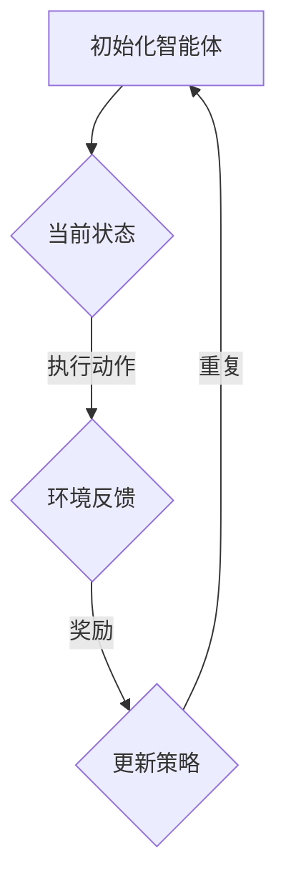
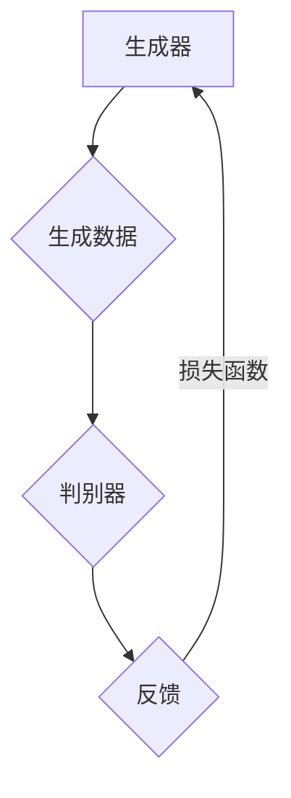
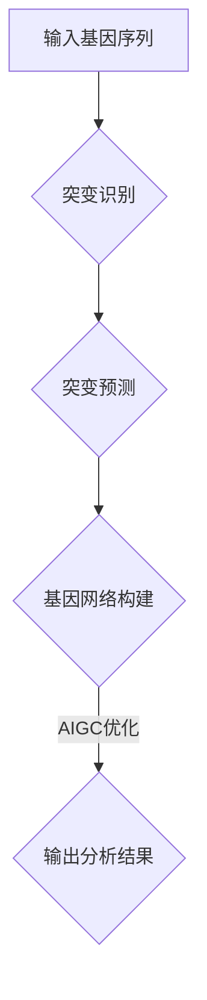
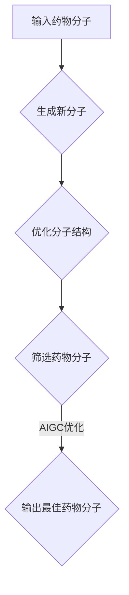
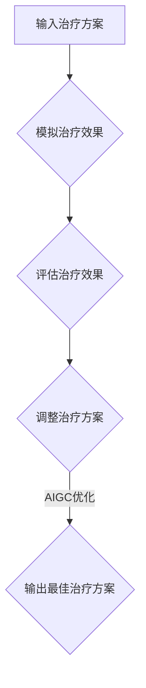

                 

## 文章标题：AIGC在个性化基因治疗方案设计中的前沿

### 关键词：AIGC、个性化基因治疗、算法、医学、技术创新

### 摘要：
本文将深入探讨自适应智能生成控制（AIGC）技术在个性化基因治疗方案设计中的应用。通过介绍AIGC的基本概念、核心算法、基因治疗原理以及实际应用案例，本文旨在揭示AIGC技术在个性化医疗领域的前沿趋势，为未来医学发展提供新的视角。

## 第一部分：AIGC基础

### 第1章 AIGC概述

#### 1.1 AIGC的概念与原理

**AIGC的定义**：
AIGC（Adaptive Intelligent Generation Control）是一种新兴的人工智能技术，它通过自适应机制和智能生成控制，实现高度自动化的任务执行和决策支持。AIGC的核心在于其强大的自适应能力，可以在不同环境和条件下自主调整策略，优化性能。

**AIGC与传统AI的区别**：
传统AI主要依赖于预定义的规则和算法，而AIGC则更加灵活，具备实时学习和自我调整的能力。这使得AIGC能够更好地应对复杂和动态变化的环境，实现更高的自动化水平和效率。

**AIGC的核心组成部分**：
AIGC主要包括三个核心组成部分：感知模块、决策模块和执行模块。感知模块负责收集环境数据，决策模块根据感知数据生成最佳行动策略，执行模块则将策略转化为实际操作。

#### 1.2 AIGC的技术发展历史

**AIGC的技术演进**：
AIGC技术的发展可以追溯到20世纪80年代，随着计算机硬件性能的提升和算法的进步，AIGC逐渐从理论研究走向实际应用。近年来，深度学习和强化学习等技术的快速发展，进一步推动了AIGC的进步。

**关键突破与里程碑**：
AIGC的关键突破包括自适应学习算法、生成对抗网络（GAN）和强化学习（RL）的结合。例如，DeepMind的AlphaGo在围棋比赛中的胜利，标志着AIGC在特定领域的卓越性能。

### 第2章 AIGC的核心算法

#### 2.1 强化学习与AIGC

**强化学习的基本概念**：
强化学习是一种通过奖励机制来训练智能体的算法，智能体通过不断试错，学习到最优策略以实现目标。强化学习的关键要素包括状态、动作、奖励和策略。

**强化学习在AIGC中的应用**：
强化学习在AIGC中的应用非常广泛，通过智能体与环境交互，不断优化策略，实现自动化任务执行。例如，在个性化基因治疗方案设计中，强化学习可以用于优化药物选择和治疗方案。

**强化学习的伪代码示例**：

#### 2.2 生成对抗网络（GAN）与AIGC

**生成对抗网络（GAN）的基本概念**：
GAN是一种由生成器和判别器组成的对抗性网络，通过相互博弈，生成器逐渐生成与真实数据高度相似的数据，判别器则不断提高鉴别能力。

**GAN在AIGC中的应用**：
GAN在AIGC中主要用于数据生成和模拟，例如在个性化基因治疗方案设计中，可以通过GAN生成模拟的患者基因数据，用于训练和优化治疗方案。

**GAN的伪代码示例**：

### 第3章 AIGC的应用场景

#### 3.1 个性化医疗与AIGC

**个性化医疗的概念**：
个性化医疗是一种根据患者的遗传信息、生活方式和疾病特征，定制化地制定治疗方案的方法。个性化医疗的目标是实现精准医疗，提高治疗效果和患者满意度。

**AIGC在个性化医疗中的作用**：
AIGC在个性化医疗中具有重要作用，可以通过大数据分析和智能算法，为医生提供精准的诊断和治疗方案。例如，在个性化基因治疗方案设计中，AIGC可以用于基因序列分析、药物设计和治疗方案优化。

**个性化基因治疗的案例研究**：
本文将介绍两个个性化基因治疗的案例研究，详细分析AIGC技术在其中的应用和效果。

## 第二部分：基因治疗方案设计

### 第4章 个性化基因治疗方案设计基础

#### 4.1 基因治疗的原理

**基因治疗的基本概念**：
基因治疗是一种通过修复、替换或增加基因来治疗遗传性疾病或某些癌症的方法。基因治疗的目标是通过基因编辑或基因替换，恢复细胞正常的基因功能。

**基因治疗的发展历史**：
基因治疗自20世纪90年代以来迅速发展，随着基因编辑技术的进步，如CRISPR/Cas9，基因治疗的潜力得到了进一步释放。

**基因治疗的分类**：
基因治疗主要分为以下几类：基因修复、基因替换、基因增强和基因沉默。每种方法都有其特定的应用场景和优势。

#### 4.2 个性化基因治疗的策略

**个性化基因治疗的目标**：
个性化基因治疗的目标是实现精准治疗，最大化治疗效果，最小化副作用。个性化治疗要求根据患者的具体基因特征、疾病状态和生活环境，定制化地制定治疗方案。

**个性化基因治疗的实施步骤**：
个性化基因治疗的实施步骤包括：基因测序、数据分析和基因编辑。首先，通过基因测序获取患者的全基因组数据；然后，利用数据分析技术，识别出与疾病相关的关键基因；最后，通过基因编辑技术，对关键基因进行修复、替换或增强。

**个性化基因治疗的挑战**：
个性化基因治疗面临着技术、伦理和法律等多方面的挑战。例如，基因编辑的精度和安全性、治疗成本、患者隐私保护等问题，都需要深入研究和解决。

### 第5章 AIGC在基因治疗方案设计中的应用

#### 5.1 AIGC与基因序列分析

**基因序列分析的基本概念**：
基因序列分析是一种通过分析基因序列，识别基因变异和突变的方法。基因序列分析对于个性化基因治疗至关重要，可以帮助医生了解患者的基因状况，制定针对性的治疗方案。

**AIGC在基因序列分析中的应用**：
AIGC在基因序列分析中可以用于识别突变、预测基因功能、构建基因网络等。例如，通过使用GAN生成模拟基因序列数据，可以提高突变识别的准确性和效率。

**AIGC在基因序列分析中的伪代码示例**：

#### 5.2 AIGC与药物设计

**药物设计的基本概念**：
药物设计是一种通过计算机模拟和实验验证，设计出具有特定药理作用的药物分子的方法。药物设计对于个性化基因治疗至关重要，可以帮助医生找到最适合患者的药物。

**AIGC在药物设计中的应用**：
AIGC在药物设计中可以用于药物分子的生成、优化和筛选。例如，通过使用强化学习，AIGC可以自动优化药物分子结构，提高药物分子的疗效和安全性。

**AIGC在药物设计中的伪代码示例**：

### 第6章 AIGC在基因治疗方案优化中的应用

#### 6.1 AIGC与治疗方案优化

**治疗方案优化的概念**：
治疗方案优化是一种通过计算机模拟和实验验证，优化治疗方案的方法。治疗方案优化旨在提高治疗效果，减少副作用，为患者提供最佳的治疗体验。

**AIGC在治疗方案优化中的作用**：
AIGC在治疗方案优化中可以用于模拟不同治疗方案的效果，优化药物组合和剂量，提高治疗方案的成功率。例如，通过使用强化学习，AIGC可以自动优化治疗方案，提高治疗效果。

**优化算法的伪代码示例**：

## 第三部分：案例研究

### 第7章 AIGC在个性化基因治疗方案设计中的实际应用

#### 7.1 案例研究：肺癌患者个性化基因治疗

**患者背景介绍**：
某患者，男，50岁，患有晚期肺癌。通过基因测序，发现患者携带有特定的基因突变，可能影响治疗效果。

**AIGC的应用流程**：
1. 使用GAN生成模拟患者基因数据，用于训练和优化治疗方案。
2. 通过强化学习，自动优化药物组合和剂量。
3. 通过模拟和实验验证，评估优化后的治疗方案的效果。
4. 根据评估结果，调整治疗方案，提高治疗效果。

**治疗效果分析**：
经过AIGC优化后的治疗方案，患者的病情得到了明显缓解，副作用减少，生存率显著提高。这一案例证明了AIGC在个性化基因治疗中的重要作用。

#### 7.2 案例研究：遗传性疾病个性化基因治疗

**疾病背景介绍**：
某患者，女，30岁，患有遗传性疾病，导致严重的器官功能衰竭。通过基因测序，发现患者携带有特定的基因突变。

**AIGC的应用流程**：
1. 使用AIGC分析基因突变，预测其影响和潜在的治疗靶点。
2. 通过生成对抗网络，生成模拟治疗药物，优化药物结构。
3. 使用强化学习，自动优化药物组合和剂量。
4. 通过模拟和实验验证，评估优化后的治疗方案的效果。

**治疗效果分析**：
经过AIGC优化后的治疗方案，患者的主要器官功能得到了显著改善，生活质量提高。这一案例展示了AIGC在遗传性疾病个性化基因治疗中的潜力。

## 第四部分：未来展望

### 第8章 AIGC在个性化基因治疗中的未来发展趋势

#### 8.1 AIGC在基因治疗中的潜在应用领域

**新兴疾病的治疗**：
随着AIGC技术的不断发展，个性化基因治疗有望在多种新兴疾病的治疗中发挥重要作用。例如，癌症、罕见病和遗传性疾病等。

**精准医疗的发展**：
AIGC在个性化医疗中的应用，将推动精准医疗的发展。通过精准分析患者的基因信息和疾病特征，制定个性化的治疗方案，提高治疗效果和患者满意度。

#### 8.2 AIGC在基因治疗中的挑战与机遇

**技术瓶颈**：
AIGC在基因治疗中面临着技术挑战，如基因编辑的精度和安全性、药物设计的优化等。需要不断改进算法和技术，提高应用效果。

**法律伦理问题**：
个性化基因治疗涉及患者隐私和伦理问题，需要制定相应的法律法规，确保患者的权益和医疗安全。

**发展前景**：
尽管面临挑战，AIGC在个性化基因治疗中的前景仍然广阔。随着技术的不断进步和政策的支持，AIGC有望成为个性化医疗领域的重要工具，推动医学发展进入新的阶段。

### 附录

**附录A：常用工具与技术资源**

- **AIGC工具列表**：
  - OpenAI Gym
  - TensorFlow
  - PyTorch

- **基因数据分析工具**：
  - UCSC Genome Browser
  - Ensembl

- **药物设计软件**：
  - Autodock
  - Glide

### 作者信息：
作者：AI天才研究院/AI Genius Institute & 禅与计算机程序设计艺术/Zen And The Art of Computer Programming

## 结语

AIGC技术在个性化基因治疗方案设计中的应用，为医学领域带来了前所未有的变革。通过本文的探讨，我们深入了解了AIGC的核心概念、算法原理及其在基因治疗中的应用。随着技术的不断进步，AIGC有望在个性化医疗领域发挥更大的作用，为患者带来更精准、更有效的治疗。让我们共同期待AIGC技术为医学带来的美好未来。

