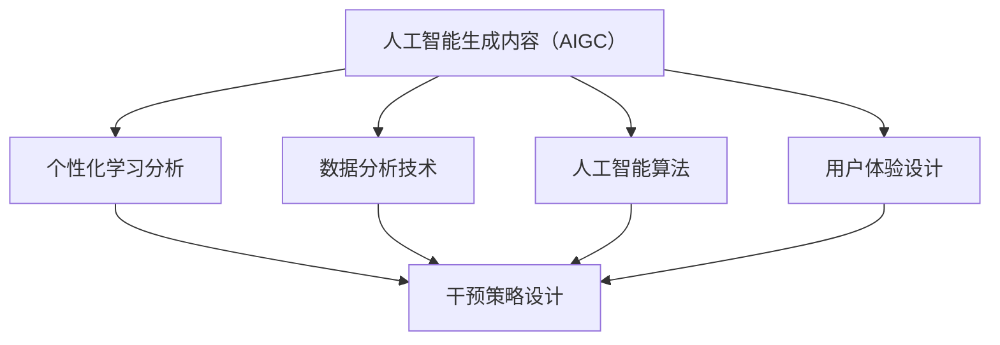
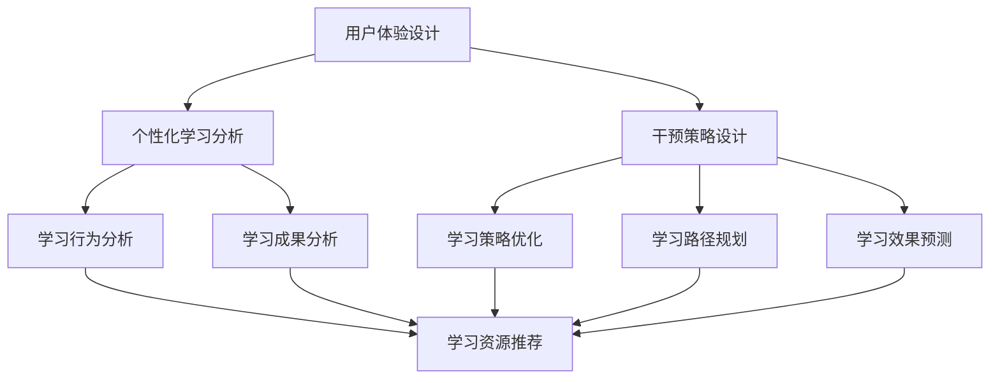

                 

### AIGC在个性化学习分析与干预中的创新实践

#### 关键词

- AIGC
- 个性化学习
- 数据分析
- 人工智能算法
- 用户体验设计

#### 摘要

本文将探讨AIGC（人工智能生成内容）在个性化学习分析与干预中的创新应用。首先，我们将介绍AIGC的基本概念和类型，接着分析个性化学习分析与干预的理论基础。随后，我们将深入探讨数据分析技术在个性化学习中的应用，以及人工智能算法在干预策略设计中的作用。最后，我们将讨论用户体验设计在个性化学习中的作用，并通过实际案例分析和详细讲解，展示AIGC在个性化学习中的实际应用效果。

---

## 1. AIGC的基本概念与类型

AIGC（人工智能生成内容）是指通过人工智能技术生成或辅助生成内容的过程。AIGC的核心在于利用机器学习、自然语言处理等技术，从大量数据中自动提取信息、生成文本、图像、音频等多种形式的内容。

### AIGC的类型

AIGC主要包括以下几种类型：

1. **文本生成**：如GPT系列模型，能够根据用户输入生成连贯的文本。
2. **图像生成**：如生成对抗网络（GAN）模型，能够生成逼真的图像。
3. **音频生成**：如音乐生成、语音合成等。
4. **视频生成**：如视频剪辑、动画制作等。

这些类型在个性化学习中有广泛的应用，能够根据学习者的需求和特点，生成个性化的学习资源和干预策略。

### Mermaid流程图：核心概念联系

## 2. 个性化学习分析与干预的理论基础

### 个性化学习的基本概念

个性化学习是一种以学习者为中心的教学模式，旨在根据学习者的特点、需求和兴趣，提供个性化的学习资源和干预策略，以提高学习效果。

### 个性化学习分析

个性化学习分析是指通过数据分析和人工智能技术，对学习者的学习行为、学习成果、学习兴趣等数据进行深入挖掘和分析，以了解学习者的学习状况和需求。

### 干预策略设计

干预策略设计是指根据个性化学习分析的结果，设计相应的干预措施，如调整学习内容、改变教学方法、提供个性化的辅导等，以促进学习者的学习进步。

### 数据分析技术在个性化学习中的应用

数据分析技术，如数据挖掘、机器学习等，在个性化学习中的应用主要包括：

1. **学习行为分析**：通过分析学习者的学习行为数据，了解学习者的学习模式、兴趣点等。
2. **学习成果分析**：通过分析学习者的学习成果数据，评估学习者的学习效果，识别学习难点。
3. **个性化推荐**：根据学习者的学习行为和学习成果，推荐个性化的学习资源和干预策略。

### 人工智能算法在干预策略设计中的应用

人工智能算法，如深度学习、强化学习等，在干预策略设计中的应用主要包括：

1. **学习策略优化**：通过优化学习策略，提高学习者的学习效率和成果。
2. **学习路径规划**：根据学习者的特点和需求，规划个性化的学习路径。
3. **学习效果预测**：通过预测学习者的学习效果，提前干预，避免学习问题的发生。

## 3. 用户体验设计在个性化学习中的作用

### 用户体验设计的基本概念

用户体验设计（UX Design）是指从用户的角度出发，设计产品的交互界面和用户体验，以提高产品的易用性、可用性和满意度。

### 个性化学习中的用户体验设计

在个性化学习中，用户体验设计的作用主要包括：

1. **学习界面设计**：设计简洁、直观的学习界面，方便学习者快速找到所需的学习资源和干预策略。
2. **学习过程优化**：通过优化学习过程，提高学习者的学习效率和体验。
3. **学习反馈机制**：设计有效的学习反馈机制，及时了解学习者的学习状况和需求，调整干预策略。

### Mermaid流程图：核心概念联系

## 4. AIGC在个性化学习中的应用案例

### 案例背景

某在线教育平台希望通过引入AIGC技术，为其学习者提供个性化的学习资源和干预策略，以提高学习效果。

### 应用方案

1. **数据收集**：平台收集了学习者的学习行为数据、学习成果数据等，用于AIGC模型的训练。
2. **AIGC模型训练**：使用GPT模型对收集到的数据进行训练，生成个性化的学习资源和干预策略。
3. **个性化推荐**：根据学习者的学习行为和学习成果，使用AIGC模型推荐个性化的学习资源和干预策略。
4. **用户体验优化**：根据学习者的反馈，不断优化AIGC模型和学习界面设计，提高学习者的学习体验。

### 应用效果

通过引入AIGC技术，平台的学习效果得到显著提升，学习者的学习兴趣和满意度也得到提高。

### 项目小结

AIGC在个性化学习中的应用，为学习者提供了更加个性化和高效的学习体验。通过深入分析学习行为和学习成果，AIGC能够生成高质量的学习资源和干预策略，为个性化学习提供了有力的技术支持。

## 5. 最佳实践 tips、小结、注意事项、拓展阅读

### 最佳实践 tips

1. 在引入AIGC技术前，充分了解学习者的需求和特点，确保AIGC模型能够准确生成个性化的学习资源和干预策略。
2. 关注用户体验设计，设计简洁、直观的学习界面，提高学习者的使用体验。
3. 定期对AIGC模型进行优化和更新，确保其能够适应不断变化的学习需求和趋势。

### 小结

AIGC在个性化学习中有广泛的应用前景，通过深入分析学习行为和学习成果，能够生成高质量的学习资源和干预策略，为个性化学习提供有力的技术支持。

### 注意事项

1. AIGC模型训练需要大量高质量的数据支持，确保数据的真实性和可靠性。
2. 在应用AIGC技术时，要充分尊重学习者的隐私，确保数据的保密性。

### 拓展阅读

1. 《人工智能生成内容：技术与应用》
2. 《个性化学习：理论与实践》
3. 《用户体验设计：方法与实践》

---

作者：AI天才研究院/AI Genius Institute & 禅与计算机程序设计艺术 /Zen And The Art of Computer Programming

---

通过这篇文章，我们深入探讨了AIGC在个性化学习分析与干预中的创新实践。从AIGC的基本概念与类型，到个性化学习分析与干预的理论基础，再到用户体验设计在其中的作用，我们一步步分析了AIGC在个性化学习中的应用案例，展示了其在提升学习效果和用户体验方面的巨大潜力。希望这篇文章能够为读者在个性化学习领域的研究和实践提供有益的启示。

