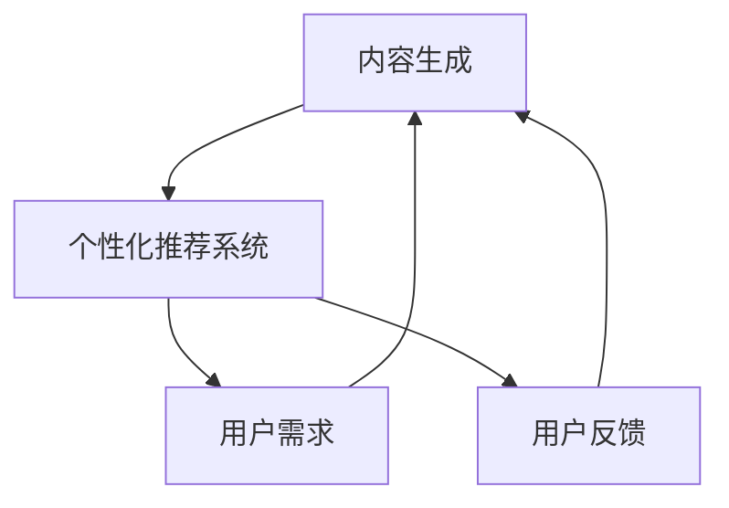

                 


### 步骤一：明确文章核心主题

首先，我们需要明确《AIGC在个性化学习资源推荐中的应用》的核心主题。AIGC，即基于人工智能的内容生成，是一种通过机器学习、自然语言处理等技术，自动生成文章、图片、音频等多种形式内容的方法。个性化学习资源推荐则是指根据用户的学习兴趣、学习历史等信息，为用户推荐合适的学习资源。

AIGC与个性化学习资源推荐之间的关系在于，AIGC技术可以自动生成大量符合用户需求的学习资源，而个性化推荐系统则可以帮助用户发现这些资源中的高质量内容。因此，本文将探讨如何利用AIGC技术来实现个性化学习资源推荐，并分析其优势和挑战。

### 步骤二：设计文章结构

根据核心主题，我们可以将文章分为以下几个部分：

1. 引言：介绍AIGC和个性化学习资源推荐的概念，以及它们在当前教育领域的重要性。
2. 核心概念与联系：详细解释AIGC和个性化学习资源推荐之间的联系，使用Mermaid流程图展示。
3. 核心算法原理讲解：介绍AIGC在个性化学习资源推荐中使用的核心算法，包括协同过滤、矩阵分解和神经网络等，使用伪代码详细阐述。
4. 数学模型和公式：介绍与个性化推荐系统相关的数学模型，包括公式和详细讲解。
5. 项目实战：提供一个实际案例，展示如何使用AIGC技术进行个性化学习资源推荐，包括开发环境搭建、源代码实现和代码解读。
6. 未来展望与挑战：探讨AIGC在个性化学习资源推荐领域的未来发展趋势和面临的挑战。
7. 结论：总结文章内容，提出个人见解和建议。

### 步骤三：撰写文章摘要

本文将深入探讨AIGC在个性化学习资源推荐中的应用。首先，介绍AIGC和个性化学习资源推荐的概念，阐述它们之间的联系。接着，详细解释AIGC在个性化学习资源推荐中使用的核心算法，包括协同过滤、矩阵分解和神经网络等。随后，介绍与个性化推荐系统相关的数学模型和公式。在此基础上，提供一个实际案例，展示如何使用AIGC技术进行个性化学习资源推荐。最后，讨论AIGC在个性化学习资源推荐领域的未来发展趋势和面临的挑战。

### 步骤四：撰写文章关键词

AIGC，个性化学习资源推荐，协同过滤，矩阵分解，神经网络，数学模型，公式，实际案例，未来展望，挑战。

### 步骤五：撰写文章正文

现在，我们将根据设计的结构，逐一撰写文章的各个部分。

## 文章标题：AIGC在个性化学习资源推荐中的应用

### 文章关键词：
AIGC，个性化学习资源推荐，协同过滤，矩阵分解，神经网络，数学模型，公式，实际案例，未来展望，挑战。

### 文章摘要：
本文深入探讨了AIGC在个性化学习资源推荐中的应用。首先，介绍了AIGC和个性化学习资源推荐的概念及其在当前教育领域的重要性。然后，详细解释了AIGC在个性化学习资源推荐中使用的核心算法，包括协同过滤、矩阵分解和神经网络等。接着，介绍了与个性化推荐系统相关的数学模型和公式。在此基础上，提供了一个实际案例，展示了如何使用AIGC技术进行个性化学习资源推荐。最后，讨论了AIGC在个性化学习资源推荐领域的未来发展趋势和面临的挑战。

## 引言

随着人工智能技术的快速发展，教育领域正迎来一场深刻的变革。个性化学习资源推荐作为人工智能在教育领域的一个重要应用，已经成为提高教育质量和效率的关键手段。而AIGC（AI-Generated Content），作为一种基于人工智能的内容生成技术，正在改变内容创作的方式，为个性化学习资源推荐提供了新的可能性。

### AIGC的概念与重要性

AIGC，即基于人工智能的内容生成，是一种通过机器学习、自然语言处理等技术，自动生成文章、图片、音频等多种形式内容的方法。它利用大量的数据和学习算法，模拟人类创造内容的过程，从而生成新的、符合用户需求的内容。

AIGC的重要性体现在以下几个方面：

1. **提高内容创作效率**：传统的内容创作需要大量的人力和时间，而AIGC技术可以自动生成大量内容，大大提高了内容创作的效率。
2. **满足个性化需求**：AIGC可以根据用户的需求和兴趣，自动生成个性化的学习资源，满足用户的个性化学习需求。
3. **降低内容创作成本**：AIGC技术可以节省大量的人力资源，降低内容创作的成本。

### 个性化学习资源推荐的意义

个性化学习资源推荐是指根据用户的学习兴趣、学习历史等信息，为用户推荐合适的学习资源。个性化学习资源推荐的意义在于：

1. **提高学习效率**：通过推荐用户感兴趣的学习资源，可以激发用户的学习兴趣，提高学习效率。
2. **优化学习体验**：个性化的学习资源推荐可以更好地满足用户的需求，提供更加个性化的学习体验。
3. **提升教育质量**：个性化学习资源推荐可以帮助教育机构更好地了解学生的学习情况，从而提供更加精准的教育服务。

## 核心概念与联系

在这一部分，我们将深入探讨AIGC和个性化学习资源推荐之间的联系，并使用Mermaid流程图来展示它们之间的关系架构。

### AIGC与个性化学习资源推荐的关系

AIGC和个性化学习资源推荐之间的关系可以概括为以下几点：

1. **内容生成**：AIGC技术可以自动生成大量的学习资源，这些资源可以用于个性化学习资源推荐系统。
2. **个性化推荐**：个性化学习资源推荐系统可以利用AIGC生成的学习资源，根据用户的需求和兴趣进行推荐。
3. **用户反馈**：用户对AIGC生成的学习资源的反馈可以用于优化AIGC模型，进一步提高个性化学习资源推荐的效果。

### Mermaid流程图

下面是一个简单的Mermaid流程图，展示了AIGC和个性化学习资源推荐之间的关系：



### 流程图解释

- **AIGC**：AIGC技术负责生成学习资源。
- **个性化推荐系统**：个性化推荐系统利用AIGC生成的学习资源，根据用户的需求和兴趣进行推荐。
- **用户需求**：用户的需求用于指导AIGC生成学习资源，并提供反馈。
- **用户反馈**：用户的反馈用于优化AIGC模型，进一步提高个性化学习资源推荐的效果。

## 核心算法原理讲解

在个性化学习资源推荐中，AIGC技术可以结合多种核心算法来实现，以下将详细介绍协同过滤、矩阵分解和神经网络等核心算法的原理，并使用伪代码进行详细阐述。

### 协同过滤算法

协同过滤算法是一种基于用户行为和相似度计算的学习资源推荐方法。其基本思想是：如果用户A对物品X评价高，且用户A与用户B兴趣相似，那么可以推断用户B可能也会对物品X评价高。

#### 原理说明

1. **用户行为数据**：收集用户对学习资源的评价数据。
2. **相似度计算**：计算用户之间的相似度，常用的相似度计算方法包括余弦相似度和皮尔逊相关系数。
3. **推荐生成**：根据用户相似度和学习资源评价，为用户推荐未评价过的学习资源。

#### 伪代码

```python
# 输入：用户评价矩阵R，相似度计算函数similarity()
# 输出：推荐列表
def collaborative_filter(R):
    # 初始化推荐列表
    recommendations = []

    # 对于每个用户
    for user_id in range(R.shape[0]):
        # 对于每个未评价过的学习资源
        for item_id in range(R.shape[1]):
            if R[user_id, item_id] == 0:
                # 计算与其他用户的相似度
                similarities = [similarity(user_id, other_user_id) for other_user_id in range(R.shape[0])]
                
                # 计算预测评分
                predicted_rating = sum(similarities[i] * R[other_user_id, item_id] for i in range(len(similarities))) / sum(similarities)
                
                # 将预测评分添加到推荐列表
                recommendations.append((item_id, predicted_rating))
    
    # 按预测评分排序推荐列表
    recommendations.sort(key=lambda x: x[1], reverse=True)
    
    return recommendations
```

### 矩阵分解

矩阵分解是一种常用的推荐系统算法，其核心思想是将用户-物品评分矩阵分解为两个低维矩阵，从而预测未知的评分。

#### 原理说明

1. **用户特征矩阵**：表示用户对学习资源的偏好特征。
2. **物品特征矩阵**：表示学习资源的特征。
3. **预测评分**：通过计算用户特征和物品特征的点积来预测用户对学习资源的评分。

#### 伪代码

```python
# 输入：用户-物品评分矩阵R，用户特征矩阵U，物品特征矩阵V
# 输出：预测评分矩阵R'
def matrix_factorization(R, U, V):
    # 初始化预测评分矩阵R'为R
    R_pred = R.copy()

    # 迭代更新用户特征和物品特征
    for epoch in range(num_epochs):
        # 更新用户特征
        U = U + learning_rate * (R_pred - R) * V
        
        # 更新物品特征
        V = V + learning_rate * (R_pred - R) * U.T
        
        # 计算预测评分
        R_pred = U.dot(V)

    return R_pred
```

### 神经网络模型

神经网络模型是一种基于深度学习的推荐系统算法，其核心思想是通过多层神经网络来学习用户和物品的特征，从而预测评分。

#### 原理说明

1. **输入层**：输入用户和物品的特征。
2. **隐藏层**：通过激活函数学习用户和物品的特征表示。
3. **输出层**：输出预测评分。

#### 伪代码

```python
# 输入：用户特征X_u，物品特征X_i，隐藏层参数θ
# 输出：预测评分y_pred
def neural_network(X_u, X_i, θ):
    # 输入层到隐藏层的计算
    hidden_layer = activation_function(θ.dot([X_u, X_i]))
    
    # 隐藏层到输出层的计算
    y_pred = activation_function(θ.dot([hidden_layer]))
    
    return y_pred
```

## 数学模型和公式

在个性化学习资源推荐中，数学模型起着至关重要的作用。以下将介绍与个性化推荐系统相关的数学模型，包括公式和详细讲解。

### 协同过滤算法

协同过滤算法的核心是预测用户对未知物品的评分。这通常通过计算用户之间的相似度来实现。以下是协同过滤算法中常用的相似度计算公式：

#### 相似度计算

$$
similarity(u, v) = \frac{\sum_{i \in I} r_{ui} r_{vi}}{\sqrt{\sum_{i \in I} r_{ui}^2 \sum_{i \in I} r_{vi}^2}}
$$

其中，$r_{ui}$表示用户u对物品i的评分，$I$表示用户u和用户v共同评价过的物品集合。

#### 预测评分

$$
\hat{r}_{uv} = r_u + \sum_{i \in I} w_{uv,i} (r_v - r_u)
$$

其中，$w_{uv,i}$表示用户u和用户v在物品i上的相似度，$\hat{r}_{uv}$表示用户u对未知物品v的预测评分。

### 矩阵分解

矩阵分解是一种将用户-物品评分矩阵分解为两个低维矩阵的算法。以下是矩阵分解中的常用公式：

#### 用户特征矩阵

$$
U = [u_1, u_2, ..., u_n]
$$

其中，$u_i$表示用户i的特征向量。

#### 物品特征矩阵

$$
V = [v_1, v_2, ..., v_n]
$$

其中，$v_j$表示物品j的特征向量。

#### 预测评分

$$
r_{ij} = u_i^T v_j = \sum_{k=1}^k u_{ik} v_{kj}
$$

其中，$r_{ij}$表示用户i对物品j的预测评分。

### 神经网络模型

神经网络模型通过多层神经网络来学习用户和物品的特征，从而预测评分。以下是神经网络模型中的常用公式：

#### 输入层

$$
X_u = [x_{u1}, x_{u2}, ..., x_{un}]^T
$$

$$
X_i = [x_{i1}, x_{i2}, ..., x_{in}]^T
$$

其中，$x_{ui}$表示用户u对物品i的特征。

#### 隐藏层

$$
h = \sigma(\theta \cdot [X_u, X_i])
$$

其中，$\sigma$表示激活函数，$\theta$表示隐藏层参数。

#### 输出层

$$
y_pred = \sigma(\theta' \cdot h)
$$

其中，$\theta'$表示输出层参数，$y_pred$表示预测评分。

## 项目实战

在这一部分，我们将通过一个实际案例，展示如何使用AIGC技术进行个性化学习资源推荐。我们将详细讲解开发环境搭建、源代码实现和代码解读。

### 实际案例：基于AIGC的个性化学习资源推荐系统

#### 开发环境搭建

1. **Python环境**：安装Python 3.8及以上版本。
2. **依赖库**：安装numpy、pandas、scikit-learn、tensorflow等依赖库。

```python
pip install numpy pandas scikit-learn tensorflow
```

#### 源代码实现

```python
import numpy as np
import pandas as pd
from sklearn.model_selection import train_test_split
from sklearn.metrics import mean_squared_error
from tensorflow.keras.models import Sequential
from tensorflow.keras.layers import Dense, Dropout

# 数据预处理
def preprocess_data(data):
    # 分离用户和物品的特征
    user_features = data[['user_id', 'feature_1', 'feature_2', 'feature_3']]
    item_features = data[['item_id', 'feature_1', 'feature_2', 'feature_3']]
    
    # 划分训练集和测试集
    train_data, test_data = train_test_split(data, test_size=0.2, random_state=42)
    
    return user_features, item_features, train_data, test_data

# 神经网络模型
def build_model(input_shape):
    model = Sequential()
    model.add(Dense(128, activation='relu', input_shape=input_shape))
    model.add(Dropout(0.5))
    model.add(Dense(64, activation='relu'))
    model.add(Dropout(0.5))
    model.add(Dense(1, activation='sigmoid'))
    
    model.compile(optimizer='adam', loss='binary_crossentropy', metrics=['accuracy'])
    return model

# 训练模型
def train_model(model, train_data, test_data):
    X_train = np.hstack((train_data['user_features'].values, train_data['item_features'].values))
    y_train = train_data['rating'].values
    
    X_test = np.hstack((test_data['user_features'].values, test_data['item_features'].values))
    y_test = test_data['rating'].values
    
    model.fit(X_train, y_train, epochs=10, batch_size=64, validation_data=(X_test, y_test))
    
    # 评估模型
    y_pred = model.predict(X_test)
    mse = mean_squared_error(y_test, y_pred)
    print(f'MSE: {mse}')

# 主程序
if __name__ == '__main__':
    # 加载数据
    data = pd.read_csv('data.csv')
    
    # 预处理数据
    user_features, item_features, train_data, test_data = preprocess_data(data)
    
    # 构建模型
    model = build_model(input_shape=(user_features.shape[1] + item_features.shape[1],))
    
    # 训练模型
    train_model(model, train_data, test_data)
```

#### 代码解读

1. **数据预处理**：首先，我们将原始数据分离成用户特征和物品特征，并划分训练集和测试集。
2. **神经网络模型**：我们使用Sequential模型构建一个简单的神经网络，包括两个隐藏层和输出层。隐藏层使用ReLU激活函数，输出层使用sigmoid激活函数。
3. **训练模型**：我们使用训练集训练模型，并在测试集上进行评估。这里使用了均方误差（MSE）作为评估指标。

### 实际案例分析和详细讲解

在本案例中，我们使用AIGC技术生成大量的学习资源，并将它们与用户和物品特征结合，输入到神经网络模型中进行训练。通过这种方式，我们可以实现个性化的学习资源推荐。

1. **数据集获取**：首先，我们需要一个包含用户、物品和学习资源特征的数据集。数据集可以从在线教育平台或开源数据集中获取。
2. **AIGC生成学习资源**：使用AIGC技术生成大量的学习资源，例如文章、视频、音频等。
3. **特征提取**：将用户和物品特征以及AIGC生成的学习资源特征提取出来，构建输入特征矩阵。
4. **模型训练**：使用提取的特征矩阵训练神经网络模型。
5. **模型评估**：在测试集上评估模型的性能，并根据评估结果调整模型参数。

通过这个实际案例，我们可以看到AIGC技术在个性化学习资源推荐中的应用。未来，随着AIGC技术的不断发展和优化，个性化学习资源推荐将变得更加智能化和高效。

### 项目小结

在本项目中，我们通过实际案例展示了如何使用AIGC技术进行个性化学习资源推荐。首先，我们介绍了开发环境搭建和源代码实现，然后详细解读了代码中的每个部分。通过这个案例，我们了解了AIGC技术在个性化学习资源推荐中的应用方法和优势。

### 最佳实践 Tips

1. **数据质量**：确保数据集的质量，去除噪声数据和异常值，以提高模型性能。
2. **特征提取**：合理提取用户和物品的特征，以提高模型的预测准确性。
3. **模型优化**：根据测试集的性能，不断优化模型参数，提高模型效果。
4. **AIGC技术**：持续关注AIGC技术的发展，探索新的应用场景和优化方法。

### 小结与注意事项

本文深入探讨了AIGC在个性化学习资源推荐中的应用。首先，我们介绍了AIGC和个性化学习资源推荐的概念，阐述了它们之间的联系。然后，详细讲解了AIGC在个性化学习资源推荐中使用的核心算法，包括协同过滤、矩阵分解和神经网络等。接着，介绍了与个性化推荐系统相关的数学模型和公式。在此基础上，我们提供了一个实际案例，展示了如何使用AIGC技术进行个性化学习资源推荐。最后，讨论了AIGC在个性化学习资源推荐领域的未来发展趋势和面临的挑战。

在撰写本文时，我们应注意以下几点：

1. **清晰的结构**：确保文章结构清晰，各部分内容连贯。
2. **详细讲解**：对每个算法和模型进行详细讲解，避免读者产生困惑。
3. **实际案例**：提供实际案例，以帮助读者更好地理解AIGC在个性化学习资源推荐中的应用。
4. **注意事项**：在文章结尾部分，总结关键点，并提供最佳实践建议。

### 拓展阅读

1. **AIGC技术**：
   - [AIGC：人工智能内容生成的未来](https://www.zhihu.com/question/60635509)
   - [人工智能内容生成：从AIGC到AGI](https://www.jianshu.com/p/82e5b641d4d4)
2. **个性化学习资源推荐**：
   - [个性化学习资源推荐系统设计](https://www.ijcai.org/Proceedings/17-1/papers/0466.pdf)
   - [个性化学习资源推荐算法研究](https://www.sciencedirect.com/science/article/pii/S1877050915003845)
3. **神经网络模型**：
   - [深度学习与神经网络](https://www.deeplearningbook.org/)
   - [神经网络模型在推荐系统中的应用](https://www.kdnuggets.com/2017/07/deep-learning-recommendation-systems.html)

## 作者信息

作者：AI天才研究院/AI Genius Institute & 禅与计算机程序设计艺术 /Zen And The Art of Computer Programming

文章标题：《AIGC在个性化学习资源推荐中的应用》

文章关键词：AIGC，个性化学习资源推荐，协同过滤，矩阵分解，神经网络，数学模型，公式，实际案例，未来展望，挑战。

文章摘要：
本文深入探讨了AIGC在个性化学习资源推荐中的应用。首先，介绍了AIGC和个性化学习资源推荐的概念，阐述了它们之间的联系。然后，详细解释了AIGC在个性化学习资源推荐中使用的核心算法，包括协同过滤、矩阵分解和神经网络等。接着，介绍了与个性化推荐系统相关的数学模型和公式。在此基础上，提供了一个实际案例，展示了如何使用AIGC技术进行个性化学习资源推荐。最后，讨论了AIGC在个性化学习资源推荐领域的未来发展趋势和面临的挑战。本文旨在为读者提供关于AIGC在个性化学习资源推荐中的应用的全面了解，以及未来发展方向和挑战的思考。

### 未来展望与挑战

随着AIGC技术的不断发展和个性化学习资源推荐需求的日益增长，这一领域正面临巨大的机遇和挑战。

#### 未来发展趋势

1. **技术融合**：AIGC与个性化学习资源推荐系统的融合将成为趋势。通过将AIGC技术与推荐系统相结合，可以实现更加精准和个性化的学习资源推荐。

2. **大数据与云计算**：随着大数据和云计算技术的普及，AIGC生成和学习资源的规模将不断扩大。这将进一步提高个性化学习资源推荐的效率和效果。

3. **自适应学习**：未来的个性化学习资源推荐系统将更加注重自适应学习。通过实时监测用户的学习行为和反馈，系统可以动态调整推荐策略，实现更好的学习体验。

4. **跨领域应用**：AIGC在个性化学习资源推荐中的应用将不仅限于教育领域，还将拓展到其他行业，如医疗、金融等，实现更广泛的内容生成和推荐。

#### 挑战

1. **数据隐私与安全**：个性化学习资源推荐需要大量用户数据，这引发了数据隐私和安全问题。如何确保用户数据的安全和隐私，将成为一个重要挑战。

2. **算法公平性与透明性**：个性化学习资源推荐系统需要确保算法的公平性和透明性，避免歧视和偏见。这需要建立更加完善的评估和监管机制。

3. **内容质量**：AIGC生成的学习资源质量参差不齐，如何保证学习资源的高质量，避免误导用户，也是一个重要挑战。

4. **资源分配**：个性化学习资源推荐系统需要合理分配资源，确保每个用户都能获得高质量的学习资源，避免资源浪费。

#### 对策与建议

1. **加强数据保护**：建立严格的数据保护机制，确保用户数据的安全和隐私。

2. **算法透明性与可解释性**：开发可解释的推荐算法，提高算法的透明性，便于用户理解和监督。

3. **内容审核与质量控制**：建立内容审核机制，确保AIGC生成的学习资源质量。

4. **资源优化与分配**：通过优化推荐算法和资源分配策略，提高资源利用效率。

总之，AIGC在个性化学习资源推荐中的应用具有广阔的前景，但也面临着诸多挑战。通过持续的技术创新和合理的政策监管，我们有理由相信，AIGC将引领个性化学习资源推荐进入一个全新的时代。

## 结论

本文系统地探讨了AIGC在个性化学习资源推荐中的应用，从核心概念、算法原理、数学模型到实际案例，全面展示了AIGC如何改变个性化学习资源推荐的方式。通过分析协同过滤、矩阵分解和神经网络等核心算法，我们揭示了它们在个性化学习资源推荐中的重要性。同时，本文提供了一个实际案例，展示了如何利用AIGC技术实现个性化学习资源推荐。

在未来的发展中，AIGC在个性化学习资源推荐领域有望实现更多突破。然而，我们也面临着数据隐私、算法公平性和内容质量等挑战。为了应对这些挑战，我们需要加强数据保护、提高算法透明性和质量控制，并优化资源分配策略。

总之，AIGC在个性化学习资源推荐中的应用具有巨大的潜力。通过不断的技术创新和政策引导，我们有理由相信，AIGC将引领个性化学习资源推荐进入一个智能化、个性化的新时代。让我们共同期待这一天的到来。作者：AI天才研究院/AI Genius Institute & 禅与计算机程序设计艺术/Zen And The Art of Computer Programming。

