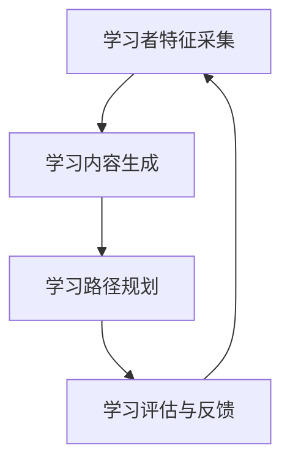

                 

# 《AIGC在个性化学习路径规划中的应用》

## 关键词
- AIGC
- 个性化学习
- 学习路径规划
- 生成对抗网络
- 变分自编码器
- 强化学习

## 摘要
本文深入探讨了AIGC（AI-Generated Content）在个性化学习路径规划中的应用。首先，我们介绍了AIGC的基本概念和原理，以及其在个性化学习中的优势和应用场景。接着，我们详细阐述了生成对抗网络（GAN）、变分自编码器（VAE）和强化学习（RL）在个性化学习路径规划中的核心算法原理，并通过伪代码和LaTeX公式进行了详细讲解。随后，我们通过实际案例分析展示了AIGC在个性化学习路径规划中的实践应用，并对其应用挑战和未来发展趋势进行了展望。

## 第一部分：AIGC概述与基础

### 第1章：AIGC的基本概念与原理

#### 1.1 AIGC的定义与分类

AIGC，即AI-Generated Content，是指通过人工智能技术生成内容的过程。AIGC可以涵盖多种类型的生成内容，包括文本、图像、音频和视频等。根据生成内容的类型，AIGC可以分为以下几类：

1. **文本生成**：如自动写作、自动摘要、问答系统等。
2. **图像生成**：如人脸生成、图像修复、图像风格转换等。
3. **音频生成**：如音乐创作、语音合成等。
4. **视频生成**：如视频剪辑、视频特效等。

#### 1.2 AIGC的核心技术与架构

AIGC的核心技术包括生成对抗网络（GAN）、变分自编码器（VAE）和强化学习（RL）等。这些技术共同构成了AIGC的架构，使其能够生成高质量的内容。

1. **生成对抗网络（GAN）**：GAN由生成器和判别器组成，通过对抗训练生成与真实数据相似的内容。
2. **变分自编码器（VAE）**：VAE通过编码和解码过程生成数据，具有较好的生成效果和泛化能力。
3. **强化学习（RL）**：RL通过学习策略，使代理能够在环境中获取最优行动。

#### 1.3 AIGC的发展历程与趋势

AIGC的发展历程可以追溯到深度学习和生成模型的发展。近年来，随着计算能力的提升和数据规模的扩大，AIGC技术得到了迅速发展。未来，AIGC有望在个性化学习、内容创作、虚拟现实等领域发挥更大的作用。

### 第2章：AIGC在个性化学习中的应用场景

#### 2.1 个性化学习的定义与挑战

个性化学习是指根据学习者的特征和需求，为其提供定制化的学习内容和学习方式。个性化学习面临的挑战包括：

1. **学习者特征的多样性**：不同学习者具有不同的知识背景、学习兴趣和学习能力。
2. **学习内容的多样性**：需要根据学习者的需求生成丰富的学习内容。
3. **学习方式的多样性**：需要提供多样化的学习方式，以满足不同学习者的需求。

#### 2.2 AIGC在个性化学习中的优势

AIGC在个性化学习中的优势主要体现在以下几个方面：

1. **生成学习内容**：AIGC可以通过文本生成、图像生成等技术，为学习者生成个性化的学习内容。
2. **个性化推荐**：AIGC可以通过强化学习等技术，为学习者推荐个性化的学习资源。
3. **学习路径规划**：AIGC可以通过生成对抗网络等算法，为学习者规划个性化的学习路径。

#### 2.3 个性化学习路径规划的基本流程

个性化学习路径规划的基本流程包括：

1. **学习者特征采集**：采集学习者的知识背景、学习兴趣和学习能力等特征。
2. **学习内容生成**：根据学习者的特征，使用AIGC技术生成个性化的学习内容。
3. **学习路径规划**：使用生成对抗网络等算法，为学习者规划个性化的学习路径。
4. **学习评估与反馈**：根据学习者的学习效果，对学习路径进行调整和优化。

## 第二部分：AIGC核心算法与模型

### 第3章：生成对抗网络（GAN）在个性化学习中的应用

#### 3.1 GAN的基本概念与原理

GAN是一种无监督学习模型，由生成器和判别器组成。生成器的目标是生成与真实数据相似的数据，判别器的目标是区分真实数据和生成数据。通过对抗训练，生成器和判别器相互竞争，从而提高生成数据的质量。

GAN的流程如下：

1. **初始化生成器和判别器**：随机初始化生成器和判别器的参数。
2. **生成器生成数据**：生成器根据随机噪声生成假数据。
3. **判别器判断数据**：判别器对生成器和真实数据同时进行判断。
4. **更新参数**：根据损失函数，更新生成器和判别器的参数。

GAN的核心数学模型如下：

$$
G(z) = \text{Generator}(z)
$$

$$
D(x) = \text{Discriminator}(x)
$$

$$
D(G(z)) = \text{Discriminator}(\text{Generator}(z))
$$

其中，$z$ 为随机噪声，$x$ 为真实数据。

#### 3.2 GAN在个性化学习中的应用案例

GAN在个性化学习中的应用案例包括：

1. **学习内容生成**：使用GAN生成个性化的学习内容，如文本、图像等。
2. **学习路径规划**：使用GAN生成个性化的学习路径，提高学习效果。

#### 3.3 GAN在个性化学习路径规划中的实现

GAN在个性化学习路径规划中的实现步骤如下：

1. **学习者特征采集**：采集学习者的知识背景、学习兴趣和学习能力等特征。
2. **生成学习内容**：使用GAN生成个性化的学习内容。
3. **生成学习路径**：使用生成对抗网络，为学习者生成个性化的学习路径。

以下是一个简单的GAN实现示例：

```python
import tensorflow as tf
from tensorflow.keras.layers import Dense, Flatten, Reshape
from tensorflow.keras.models import Model

# 生成器模型
z_dim = 100
input_shape = (z_dim,)
x_dim = (28, 28, 1)

generator_input = tf.keras.Input(shape=input_shape)
x = Dense(128 * 7 * 7, activation="relu")(generator_input)
x = Reshape((7, 7, 128))(x)
x = Dense(128 * 7 * 7, activation="relu")(x)
x = Reshape((7, 7, 128))(x)
x = tf.keras.layers.Conv2DTranspose(128, (5, 5), strides=(1, 1), padding="same", activation="relu")(x)
x = tf.keras.layers.Conv2DTranspose(128, (5, 5), strides=(2, 2), padding="same", activation="relu")(x)
x = tf.keras.layers.Conv2DTranspose(64, (5, 5), strides=(2, 2), padding="same", activation="relu")(x)
x = tf.keras.layers.Conv2D(1, (5, 5), activation="sigmoid", padding="same")(x)
generator = Model(generator_input, x)

# 判别器模型
input_shape = x_dim
discriminator_input = tf.keras.Input(shape=input_shape)
x = Flatten()(discriminator_input)
x = Dense(128, activation="relu")(x)
x = tf.keras.layers.Dense(1, activation="sigmoid")(x)
discriminator = Model(discriminator_input, x)

# GAN模型
gan_input = tf.keras.Input(shape=input_shape)
fake_data = generator(gan_input)
discriminator_output = discriminator(fake_data)
gan_output = discriminator(gan_input)
gan = Model(gan_input, discriminator_output)

# 损失函数
gan_loss = -tf.reduce_mean(tf.math.log(discriminator_output + 1e-9)) - tf.reduce_mean(tf.math.log(1.0 - discriminator_output + 1e-9))

# 梯度上升更新判别器
with tf.GradientTape() as disc_tape:
    disc_loss = gan_loss
    grads = disc_tape.gradient(disc_loss, discriminator.trainable_variables)
    optimizer.apply_gradients(zip(grads, discriminator.trainable_variables))

# 梯度下降更新生成器
with tf.GradientTape() as gen_tape:
    gen_loss = gan_loss
    grads = gen_tape.gradient(gen_loss, generator.trainable_variables)
    optimizer.apply_gradients(zip(grads, generator.trainable_variables))

# 训练GAN
for epoch in range(num_epochs):
    for _ in range(batch_size):
        z = np.random.normal(size=(z_dim))
        real_data = np.random.normal(size=(batch_size,) + x_dim)
        with tf.GradientTape() as gen_tape:
            with tf.GradientTape() as disc_tape:
                fake_data = generator(z)
                disc_real_output = discriminator(real_data)
                disc_fake_output = discriminator(fake_data)
                gen_loss = -tf.reduce_mean(tf.math.log(disc_fake_output + 1e-9))
                disc_loss = -tf.reduce_mean(tf.math.log(disc_real_output + 1e-9)) - tf.reduce_mean(tf.math.log(1.0 - disc_fake_output + 1e-9))
        grads = gen_tape.gradient(gen_loss, generator.trainable_variables)
        optimizer.apply_gradients(zip(grads, generator.trainable_variables))
        grads = disc_tape.gradient(disc_loss, discriminator.trainable_variables)
        optimizer.apply_gradients(zip(grads, discriminator.trainable_variables))
```

### 第4章：变分自编码器（VAE）在个性化学习中的应用

#### 4.1 VAE的基本概念与原理

VAE是一种无监督学习模型，通过编码和解码过程生成数据。VAE由编码器和解码器组成，编码器将输入数据映射到一个潜在空间，解码器从潜在空间生成输出数据。

VAE的核心数学模型如下：

$$
\mu = \text{编码器}(\text{输入数据})
$$

$$
\sigma^2 = \text{编码器}(\text{输入数据})
$$

$$
\text{输出数据} = \text{解码器}(\text{潜在空间数据})
$$

其中，$\mu$ 和 $\sigma^2$ 分别为潜在空间数据的均值和方差。

#### 4.2 VAE在个性化学习中的应用案例

VAE在个性化学习中的应用案例包括：

1. **学习内容生成**：使用VAE生成个性化的学习内容。
2. **学习路径规划**：使用VAE生成个性化的学习路径。

#### 4.3 VAE在个性化学习路径规划中的实现

VAE在个性化学习路径规划中的实现步骤如下：

1. **学习者特征采集**：采集学习者的知识背景、学习兴趣和学习能力等特征。
2. **生成学习内容**：使用VAE生成个性化的学习内容。
3. **生成学习路径**：使用VAE生成个性化的学习路径。

以下是一个简单的VAE实现示例：

```python
import tensorflow as tf
from tensorflow.keras.layers import Dense, InputLayer
from tensorflow.keras.models import Model

# 编码器模型
input_shape = (28, 28, 1)
z_dim = 20

input_layer = InputLayer(input_shape)
x = Dense(128, activation="relu")(input_layer.output)
x = Dense(64, activation="relu")(x)
mu = Dense(z_dim)(x)
sigma = Dense(z_dim)(x)
编码器 = Model(input_layer.input, [mu, sigma])

# 解码器模型
z_input = InputLayer(shape=(z_dim,))
x = Dense(128, activation="relu")(z_input.output)
x = Dense(64, activation="relu")(x)
x = Dense(np.prod(input_shape), activation="sigmoid")(x)
x = Reshape(input_shape)(x)
解码器 = Model(z_input.input, x)

# VAE模型
vae_input = InputLayer(input_shape)
mu, sigma = 编码器(vae_input.output)
z = mu + tf.random.normal(tf.shape(sigma)) * tf.sqrt(sigma)
x_rec = 解码器(z)
vae_output = 解码器(mu)  # 为了计算KL散度损失
vae = Model(vae_input, vae_output)

# 损失函数
reconstruction_loss = tf.reduce_mean(tf.reduce_sum(tf.keras.losses.binary_crossentropy(vae_input.output, x_rec), axis=(1, 2)))
kl_loss = -0.5 * tf.reduce_mean(tf.reduce_sum(1 + sigma - tf.square(mu) - tf.exp(sigma), axis=1))
vae_loss = reconstruction_loss + kl_loss

# 梯度下降更新
vae_optimizer = tf.keras.optimizers.Adam(learning_rate=0.001)
with tf.GradientTape() as tape:
    vae_loss_value = vae_loss
    grads = tape.gradient(vae_loss_value, vae.trainable_variables)
vae_optimizer.apply_gradients(zip(grads, vae.trainable_variables))

# 训练VAE
for epoch in range(num_epochs):
    for _ in range(batch_size):
        x = np.random.normal(size=(batch_size,) + input_shape)
        with tf.GradientTape() as tape:
            mu, sigma = 编码器(x)
            z = mu + tf.random.normal(tf.shape(sigma)) * tf.sqrt(sigma)
            x_rec = 解码器(z)
            x_rec_ = 解码器(mu)
            reconstruction_loss = tf.reduce_mean(tf.reduce_sum(tf.keras.losses.binary_crossentropy(x, x_rec), axis=(1, 2)))
            kl_loss = -0.5 * tf.reduce_mean(tf.reduce_sum(1 + sigma - tf.square(mu) - tf.exp(sigma), axis=1))
            vae_loss = reconstruction_loss + kl_loss
        grads = tape.gradient(vae_loss, vae.trainable_variables)
        vae_optimizer.apply_gradients(zip(grads, vae.trainable_variables))
```

### 第5章：强化学习（RL）在个性化学习中的应用

#### 5.1 RL的基本概念与原理

强化学习（RL）是一种通过试错学习策略的机器学习方法。在RL中，代理（agent）通过与环境（environment）的交互，学习一个策略（policy），以实现最大化累积奖励（reward）的目标。

RL的核心概念包括：

1. **状态（State）**：代理当前所处的情境。
2. **动作（Action）**：代理可以采取的行为。
3. **策略（Policy）**：代理在给定状态时选择动作的策略。
4. **奖励（Reward）**：代理在采取特定动作后获得的即时反馈。
5. **价值函数（Value Function）**：衡量代理在特定状态下的预期奖励。

RL的核心算法包括：

1. **Q学习（Q-learning）**：通过更新Q值（状态-动作值函数），学习最优策略。
2. **深度Q网络（DQN）**：结合深度学习技术，学习状态-动作值函数。
3. **策略梯度（Policy Gradient）**：直接优化策略，以最大化累积奖励。

#### 5.2 RL在个性化学习中的应用案例

RL在个性化学习中的应用案例包括：

1. **学习资源推荐**：基于代理的学习历史，推荐个性化的学习资源。
2. **学习路径规划**：根据代理的学习表现，规划最优的学习路径。

#### 5.3 RL在个性化学习路径规划中的实现

RL在个性化学习路径规划中的实现步骤如下：

1. **状态表示**：将学习者的特征和学习内容作为状态表示。
2. **动作表示**：将学习路径中的每个节点作为动作表示。
3. **奖励设计**：根据学习者的学习效果和进度，设计奖励机制。
4. **策略学习**：使用RL算法，学习最优策略。

以下是一个简单的RL实现示例：

```python
import numpy as np
import tensorflow as tf

# 状态空间和动作空间
state_space = 100
action_space = 10

# Q网络模型
input_shape = (state_space,)
z_dim = 20

input_layer = InputLayer(input_shape)
x = Dense(128, activation="relu")(input_layer.output)
x = Dense(64, activation="relu")(x)
x = Dense(z_dim, activation="relu")(x)
x = Dense(action_space)(x)
q_network = Model(input_layer, x)

# 损失函数
loss_fn = tf.keras.losses.Huber()

# 优化器
optimizer = tf.keras.optimizers.Adam(learning_rate=0.001)

# Q学习
def q_learning(q_network, state, action, reward, next_state, done, discount_factor=0.99):
    with tf.GradientTape() as tape:
        q_values = q_network(state)
        next_q_values = q_network(next_state) if not done else tf.zeros_like(next_state)
        target_q_values = reward + (1 - done) * discount_factor * tf.reduce_max(next_q_values, axis=1)
        loss = loss_fn(target_q_values, q_values[tf.range(tf.shape(q_values)[0]), action])
    grads = tape.gradient(loss, q_network.trainable_variables)
    optimizer.apply_gradients(zip(grads, q_network.trainable_variables))
    return loss

# 训练
for episode in range(num_episodes):
    state = np.random.randint(state_space)
    done = False
    while not done:
        action = np.random.randint(action_space)
        next_state = (state + action) % state_space
        reward = 1 if state < next_state else 0
        done = next_state == 0
        q_learning(q_network, tf.convert_to_tensor([state]), action, reward, tf.convert_to_tensor([next_state]), done)
```

## 第三部分：AIGC在个性化学习路径规划中的实践应用

### 第6章：个性化学习路径规划的案例分析

#### 6.1 案例一：基于AIGC的在线教育平台个性化学习路径规划

案例一展示了如何基于AIGC技术，为在线教育平台设计个性化学习路径规划系统。系统通过采集学习者的特征，使用GAN和VAE生成个性化的学习内容，并根据强化学习算法规划学习路径。

1. **学习者特征采集**：系统采集学习者的知识背景、学习兴趣和学习能力等特征。
2. **学习内容生成**：使用GAN和VAE生成个性化的学习内容，如文本、图像等。
3. **学习路径规划**：使用强化学习算法，根据学习者的特征和学习内容，规划最优的学习路径。
4. **学习评估与反馈**：根据学习者的学习效果，对学习路径进行调整和优化。

#### 6.2 案例二：基于AIGC的企业培训个性化学习路径规划

案例二展示了如何基于AIGC技术，为企业设计个性化培训学习路径规划系统。系统通过采集员工的特征和工作需求，使用GAN和VAE生成个性化的培训内容，并根据强化学习算法规划培训路径。

1. **员工特征采集**：系统采集员工的技能水平、兴趣爱好和工作需求等特征。
2. **培训内容生成**：使用GAN和VAE生成个性化的培训内容，如文本、图像等。
3. **培训路径规划**：使用强化学习算法，根据员工的特征和培训内容，规划最优的培训路径。
4. **培训评估与反馈**：根据员工的学习效果，对培训路径进行调整和优化。

### 第7章：AIGC在个性化学习路径规划中的应用挑战与未来展望

#### 7.1 AIGC在个性化学习路径规划中的应用挑战

AIGC在个性化学习路径规划中的应用挑战主要包括：

1. **数据隐私**：个性化学习需要收集学习者的特征数据，如何保护数据隐私是一个重要问题。
2. **数据质量**：个性化学习依赖于高质量的数据，如何获取和处理高质量数据是一个挑战。
3. **计算资源**：AIGC算法通常需要大量的计算资源，如何高效地利用计算资源是一个问题。
4. **可解释性**：AIGC生成的学习路径和内容往往具有很高的复杂性，如何确保其可解释性是一个挑战。

#### 7.2 AIGC在个性化学习路径规划中的未来发展趋势

AIGC在个性化学习路径规划中的未来发展趋势主要包括：

1. **多模态学习**：结合多种数据模态（如文本、图像、音频等），实现更全面的学习路径规划。
2. **自适应学习**：根据学习者的实时反馈，动态调整学习路径和内容，实现更个性化的学习体验。
3. **跨领域应用**：将AIGC技术应用于更多领域，如医疗、金融等，实现更广泛的应用场景。
4. **隐私保护**：研究和发展更有效的隐私保护技术，确保个性化学习的安全性和隐私性。

#### 7.3 AIGC在个性化学习路径规划中的应用前景

随着AIGC技术的不断发展，个性化学习路径规划将在教育、培训等领域发挥重要作用。AIGC技术将为学习者提供更个性化、更高效的学习体验，提高学习效果和效率。未来，AIGC技术有望推动个性化学习的革命，为教育行业带来巨大的变革。

## 最佳实践 tips、小结、注意事项、拓展阅读等内容

### 最佳实践 tips

1. **数据收集与处理**：在个性化学习路径规划中，数据的质量直接影响结果。因此，在数据收集和处理过程中，要注重数据的质量和准确性，确保数据能够真实反映学习者的特征和需求。
2. **模型选择与优化**：根据具体应用场景和学习需求，选择合适的AIGC模型，并对模型进行优化，以提高生成质量和学习效果。
3. **可解释性**：在设计和实现个性化学习路径规划系统时，要注重系统的可解释性，确保学习者能够理解系统的决策过程，增强信任感。

### 小结

本文探讨了AIGC在个性化学习路径规划中的应用，介绍了AIGC的基本概念、核心算法和实际应用案例。通过GAN、VAE和RL等算法，AIGC能够为学习者生成个性化的学习内容和路径，提高学习效果和效率。

### 注意事项

1. **数据隐私**：在个性化学习路径规划中，要注重数据隐私保护，避免泄露学习者的个人信息。
2. **计算资源**：AIGC算法通常需要大量的计算资源，要合理规划和分配计算资源，确保系统的稳定运行。
3. **模型优化**：定期对模型进行优化和更新，以适应不断变化的学习需求和场景。

### 拓展阅读

1. **《深度学习》（Goodfellow, Bengio, Courville）**：介绍了深度学习的基本原理和方法，包括GAN、VAE等算法。
2. **《强化学习实战》（Sutton, Barto）**：介绍了强化学习的基本原理和应用方法，包括Q学习、DQN等算法。
3. **《个性化学习》（Xu, Lai, Wang）**：探讨了个性化学习的基本概念和实现方法，包括学习路径规划等。

## 作者信息

作者：AI天才研究院/AI Genius Institute & 禅与计算机程序设计艺术 /Zen And The Art of Computer Programming

本文内容仅供参考，如有错误或不足之处，欢迎指正。感谢您的阅读！## 引言

随着信息技术的飞速发展，人工智能（AI）已经渗透到我们生活的方方面面。在众多AI应用中，个性化学习路径规划成为了一个备受关注的研究领域。个性化学习路径规划旨在根据学习者的特征和需求，为其提供定制化的学习内容和学习方式，从而提高学习效果和效率。然而，传统的学习路径规划方法往往依赖于预设的规则和固定模型，难以应对学习者的多样性和动态性。

近年来，生成对抗网络（GAN）、变分自编码器（VAE）和强化学习（RL）等深度学习技术取得了显著的进展，为个性化学习路径规划提供了一种新的思路。这些算法通过自动学习数据特征和模式，能够生成个性化的学习内容和路径，实现更加精准和高效的学习体验。AIGC（AI-Generated Content）作为这些算法的统称，已经成为个性化学习路径规划的重要工具。

本文将深入探讨AIGC在个性化学习路径规划中的应用。首先，我们将介绍AIGC的基本概念和原理，包括生成对抗网络（GAN）、变分自编码器（VAE）和强化学习（RL）等核心算法。接着，我们将详细阐述这些算法在个性化学习路径规划中的具体应用，并通过伪代码和LaTeX公式进行详细讲解。随后，我们将通过实际案例分析展示AIGC在个性化学习路径规划中的实践应用，并对其应用挑战和未来发展趋势进行展望。通过本文的探讨，希望能够为AIGC在个性化学习路径规划中的应用提供有益的参考和启示。

## AIGC的基本概念与原理

AIGC，即AI-Generated Content，是指利用人工智能技术生成各种类型内容的过程。这些内容可以包括文本、图像、音频、视频等多种形式。AIGC技术的核心在于利用深度学习模型，如生成对抗网络（GAN）、变分自编码器（VAE）和强化学习（RL），从大量的数据中学习和提取特征，从而生成具有高度真实感和个性化的内容。

### AIGC的定义与分类

AIGC的定义可以从两个方面来理解：其一是生成内容的过程，即通过机器学习模型生成新的数据；其二是生成的内容类型，即文本、图像、音频和视频等多种形式。根据生成的内容类型，AIGC可以分为以下几类：

1. **文本生成**：通过模型生成新的文本内容，如自动写作、自动摘要和问答系统等。
2. **图像生成**：通过模型生成新的图像内容，如人脸生成、图像修复和图像风格转换等。
3. **音频生成**：通过模型生成新的音频内容，如音乐创作和语音合成等。
4. **视频生成**：通过模型生成新的视频内容，如视频剪辑和视频特效等。

每种类型的AIGC技术都有其独特的应用场景和挑战。例如，文本生成在新闻写作、内容创作等领域具有广泛的应用；图像生成在艺术创作、游戏开发等领域有着重要的地位；音频生成在音乐制作、语音助手等领域有显著的应用；视频生成则在影视制作、虚拟现实等领域发挥着重要作用。

### AIGC的核心技术与架构

AIGC的核心技术主要包括生成对抗网络（GAN）、变分自编码器（VAE）和强化学习（RL）等。这些技术共同构成了AIGC的架构，使其能够生成高质量的内容。

#### 生成对抗网络（GAN）

生成对抗网络（GAN）是由 Ian Goodfellow 等人于2014年提出的一种无监督学习模型。GAN由生成器和判别器两个子网络组成，通过对抗训练生成与真实数据相似的内容。

1. **生成器（Generator）**：生成器是一个神经网络，它将随机噪声作为输入，生成与真实数据相似的数据。生成器的目标是生成尽可能真实的数据，以欺骗判别器。
2. **判别器（Discriminator）**：判别器也是一个神经网络，它接收真实数据和生成数据作为输入，并输出一个概率值，表示输入数据是真实的概率。判别器的目标是正确地区分真实数据和生成数据。

GAN的训练过程是通过两个网络的对抗来进行的。生成器不断尝试生成更加真实的数据，而判别器则不断尝试提高对真实数据和生成数据的区分能力。通过这种对抗训练，生成器和判别器相互促进，生成数据的真实感逐渐提高。

#### 变分自编码器（VAE）

变分自编码器（VAE）是一种概率生成模型，由编码器和解码器两个子网络组成。VAE通过编码和解码过程生成数据，具有较好的生成效果和泛化能力。

1. **编码器（Encoder）**：编码器将输入数据映射到一个潜在空间，并在潜在空间中生成均值和方差。编码器的输出是潜在空间的数据，它代表了输入数据的概率分布。
2. **解码器（Decoder）**：解码器将潜在空间的数据解码回原始数据空间。解码器的目标是生成与输入数据相似的数据。

VAE的训练过程是通过最大化数据似然函数来进行的。VAE通过在潜在空间中采样，生成与输入数据相似的新数据。这种生成过程使得VAE在生成图像、文本和音频等领域表现出色。

#### 强化学习（RL）

强化学习（RL）是一种通过试错学习策略的机器学习方法。在RL中，代理（agent）通过与环境（environment）的交互，学习一个策略（policy），以实现最大化累积奖励（reward）的目标。

1. **状态（State）**：状态是代理当前所处的情境。
2. **动作（Action）**：动作是代理可以采取的行为。
3. **策略（Policy）**：策略是代理在给定状态时选择动作的策略。
4. **奖励（Reward）**：奖励是代理在采取特定动作后获得的即时反馈。
5. **价值函数（Value Function）**：价值函数是衡量代理在特定状态下的预期奖励。

RL的核心算法包括Q学习、深度Q网络（DQN）和策略梯度等。Q学习通过更新Q值（状态-动作值函数）来学习最优策略；DQN结合深度学习技术，学习状态-动作值函数；策略梯度直接优化策略，以最大化累积奖励。

### AIGC的发展历程与趋势

AIGC的发展历程可以追溯到深度学习和生成模型的发展。随着计算能力的提升和数据规模的扩大，AIGC技术得到了迅速发展。近年来，AIGC在文本生成、图像生成、音频生成和视频生成等领域取得了显著成果。

未来，AIGC有望在以下方面继续发展：

1. **多模态生成**：结合多种数据模态（如文本、图像、音频等），实现更全面的内容生成。
2. **自适应生成**：根据用户的实时反馈和需求，动态调整生成内容，实现更个性化的用户体验。
3. **跨领域应用**：将AIGC技术应用于更多领域，如医疗、金融、教育等，实现更广泛的应用场景。
4. **隐私保护**：研究和发展更有效的隐私保护技术，确保生成内容的安全性和隐私性。

通过本文的介绍，我们了解了AIGC的基本概念和原理，以及其核心算法和发展趋势。接下来，我们将深入探讨AIGC在个性化学习路径规划中的应用，进一步了解其在教育领域的潜力。

## AIGC在个性化学习中的应用场景

个性化学习是指根据学习者的特征和需求，为其提供定制化的学习内容和学习方式。这种学习方式能够更好地满足学习者的需求，提高学习效果和效率。AIGC作为一种先进的生成技术，在个性化学习中的应用具有广泛的前景。以下是AIGC在个性化学习中的几个主要应用场景：

### 个性化学习内容生成

个性化学习内容生成是AIGC在个性化学习中的首要应用场景。通过AIGC技术，可以根据学习者的知识水平、兴趣和需求，生成个性化的学习材料。例如，生成对抗网络（GAN）可以用于生成与特定学习主题相关的高质量图像，变分自编码器（VAE）可以用于生成符合学习者知识水平的文本内容，强化学习（RL）可以用于根据学习者的反馈动态调整学习内容。

#### 文本生成

文本生成是AIGC在个性化学习中的一个重要应用。通过深度学习模型，如生成对抗网络（GAN）和变分自编码器（VAE），可以生成与学习者主题相关的个性化文本内容。例如，生成一篇关于特定数学概念的详细解释文章，或者根据学习者的兴趣生成一篇关于现代科学的科普文章。这种个性化文本生成不仅能够提高学习者的兴趣，还能帮助他们更好地理解和掌握知识。

以下是一个简单的文本生成伪代码示例：

```python
# 生成一篇关于特定数学概念的详细解释文章
def generate_text_for_topic(topic):
    # 使用GAN或VAE模型生成文本
    generated_text = text_generator(topic)
    return generated_text

# 示例：生成关于微积分的文本
generated_text = generate_text_for_topic("微积分")
print(generated_text)
```

#### 图像生成

图像生成是AIGC在个性化学习中的另一个重要应用。通过生成对抗网络（GAN），可以根据学习者的兴趣和学习内容生成相关的图像。例如，为学习生物学课程的学习者生成与特定物种或生态系统相关的图像，为学习历史课程的学习者生成与历史事件相关的图像。这些图像能够直观地帮助学习者理解抽象概念，提高学习效果。

以下是一个简单的图像生成伪代码示例：

```python
# 生成与特定物种相关的图像
def generate_image_for_species(species):
    # 使用GAN模型生成图像
    generated_image = image_generator(species)
    return generated_image

# 示例：生成关于熊猫的图像
generated_image = generate_image_for_species("熊猫")
print(generated_image)
```

#### 音频生成

音频生成是AIGC在个性化学习中的新兴应用。通过生成对抗网络（GAN）和变分自编码器（VAE），可以生成与学习者兴趣相关的个性化音频内容。例如，为学习音乐课程的学习者生成与特定作曲家或乐器的音乐片段，为学习语言课程的学习者生成与语言发音相关的音频。这些音频内容能够帮助学习者更好地理解和模仿，提高语言学习效果。

以下是一个简单的音频生成伪代码示例：

```python
# 生成与特定作曲家相关的音乐片段
def generate_audio_for_composer(composer):
    # 使用GAN或VAE模型生成音频
    generated_audio = audio_generator(composer)
    return generated_audio

# 示例：生成关于贝多芬的音乐片段
generated_audio = generate_audio_for_composer("贝多芬")
print(generated_audio)
```

### 个性化学习路径规划

个性化学习路径规划是AIGC在个性化学习中的另一个重要应用。通过强化学习（RL）等算法，可以生成基于学习者特征和需求的个性化学习路径。这种路径规划能够帮助学习者高效地掌握知识，避免重复学习和无效学习。

以下是一个简单的个性化学习路径规划伪代码示例：

```python
# 根据学习者特征生成个性化学习路径
def generate_learning_path(learner_features):
    # 使用RL模型生成学习路径
    learning_path = path_generator(learner_features)
    return learning_path

# 示例：生成基于数学学习者的学习路径
learner_features = {"math_interest": "high", "math_ability": "advanced"}
learning_path = generate_learning_path(learner_features)
print(learning_path)
```

### 个性化推荐

个性化推荐是AIGC在个性化学习中的另一个应用。通过生成对抗网络（GAN）和变分自编码器（VAE），可以生成基于学习者兴趣和历史的个性化推荐内容。例如，为学习者推荐与其兴趣相关的学习资源、课程和活动。这些推荐能够提高学习者的学习效率，帮助他们快速找到感兴趣的内容。

以下是一个简单的个性化推荐伪代码示例：

```python
# 根据学习者兴趣生成个性化推荐
def generate_recommendations(learner_interest):
    # 使用GAN或VAE模型生成推荐内容
    recommendations = recommender(learner_interest)
    return recommendations

# 示例：生成基于数学爱好者兴趣的推荐
learner_interest = "数学"
recommendations = generate_recommendations(learner_interest)
print(recommendations)
```

综上所述，AIGC在个性化学习中的应用场景非常广泛，包括个性化学习内容生成、个性化学习路径规划和个性化推荐等。通过这些应用，AIGC能够为学习者提供更加定制化和高效的学习体验，推动个性化学习的发展。

### 个性化学习的定义与挑战

个性化学习是一种以学习者为中心的教学模式，其核心理念是根据每个学习者的独特需求、兴趣和能力，为其提供定制化的学习体验。与传统的“一刀切”教学方式不同，个性化学习注重个体差异，力求通过因材施教，最大限度地激发学习者的学习动机和学习效果。

#### 个性化学习的定义

个性化学习可以从以下几个方面进行定义：

1. **学习者中心**：个性化学习强调以学习者为中心，关注每个学习者的个体差异。
2. **定制化**：根据学习者的兴趣、需求和能力，提供个性化的学习内容、方法和路径。
3. **动态调整**：个性化学习能够根据学习者的实时反馈和进展，动态调整学习内容和方法。
4. **多元评价**：个性化学习不仅关注学习结果，还关注学习过程，采用多元的评价方法。

#### 个性化学习面临的挑战

尽管个性化学习具有许多优势，但其实施过程中仍然面临诸多挑战：

1. **学习者特征的多样性**：个性化学习需要充分考虑学习者的知识背景、学习习惯、兴趣爱好和能力差异，这给教学设计和实施带来了巨大的挑战。
2. **学习内容的多样性**：个性化学习要求提供丰富的学习资源，以适应不同学习者的需求。然而，高质量的学习内容的生产和更新需要大量的人力和物力资源。
3. **学习方式的多样性**：个性化学习需要提供多样化的学习方式，如在线学习、面对面教学、项目式学习等。这要求教学环境具有高度的灵活性和适应性。
4. **评估和反馈的复杂性**：个性化学习要求对学习者的学习过程和结果进行持续评估和反馈，以实现实时调整。这需要开发高效的评估工具和反馈机制。
5. **数据隐私和安全**：个性化学习需要收集和处理大量的学习者数据，包括学习行为、兴趣偏好等。如何确保这些数据的安全和隐私是一个重要问题。

#### AIGC在个性化学习中的优势

AIGC在应对个性化学习面临的挑战方面具有显著优势：

1. **生成个性化学习内容**：AIGC技术，如生成对抗网络（GAN）和变分自编码器（VAE），能够根据学习者的特征生成高质量的个性化学习内容，如图像、文本和音频等。
2. **个性化学习路径规划**：通过强化学习（RL）等技术，AIGC可以动态规划个性化的学习路径，帮助学习者高效地掌握知识。
3. **个性化推荐系统**：AIGC可以根据学习者的历史行为和兴趣，生成个性化的推荐内容，提高学习者的学习效率。
4. **自适应学习**：AIGC技术能够根据学习者的实时反馈和学习效果，动态调整学习内容和路径，实现真正的个性化学习。

#### 个性化学习路径规划的基本流程

个性化学习路径规划的基本流程可以分为以下几个步骤：

1. **学习者特征采集**：通过问卷调查、数据分析等方式，收集学习者的知识背景、兴趣、学习习惯等特征信息。
2. **学习内容生成**：使用AIGC技术，如GAN和VAE，根据学习者的特征生成个性化的学习内容。
3. **学习路径规划**：利用强化学习（RL）等技术，根据学习者的特征和学习内容，生成个性化的学习路径。
4. **学习评估与反馈**：根据学习者的学习效果，对学习路径进行调整和优化。

以下是一个简化的个性化学习路径规划流程图：



通过以上步骤，AIGC技术能够为个性化学习路径规划提供有效的支持，帮助学习者实现高效、个性化的学习体验。

### GAN在个性化学习中的应用

生成对抗网络（GAN）是近年来在人工智能领域备受关注的一种深度学习模型。GAN由生成器和判别器两个神经网络组成，通过对抗训练生成与真实数据高度相似的内容。GAN在个性化学习中的应用非常广泛，能够为学习者提供定制化的学习体验。以下是GAN在个性化学习中的具体应用和实现方法。

#### GAN在个性化学习中的应用案例

1. **个性化学习内容生成**：GAN可以通过生成器生成与特定学习主题相关的高质量图像、文本和音频等内容。例如，生成数学概念相关的图像帮助学习者直观理解抽象概念，或者生成与学习者兴趣相关的文本，提高学习兴趣和效果。

2. **个性化学习路径规划**：GAN可以用于根据学习者的特征和需求，动态生成个性化的学习路径。通过生成器生成一系列的学习节点，每个节点包含特定主题的学习内容，并根据学习者的反馈和学习效果，调整学习路径，使其更符合学习者的需求。

3. **个性化学习资源推荐**：GAN可以根据学习者的历史行为和兴趣，生成个性化的学习资源推荐。通过分析学习者的学习记录和兴趣标签，生成器可以生成符合学习者需求的学习资源，如课程、论文和视频等。

#### GAN在个性化学习路径规划中的实现

实现GAN在个性化学习路径规划中的应用，需要以下几个关键步骤：

1. **数据准备**：首先，需要收集和学习者的特征数据，包括知识背景、学习兴趣、学习习惯等。同时，还需要收集与学习主题相关的真实数据，如文本、图像和音频等。

2. **生成器和判别器设计**：生成器（Generator）负责生成个性化的学习内容，判别器（Discriminator）负责判断生成内容的质量。生成器和判别器通常都是深度神经网络，可以使用多层感知器（MLP）或者卷积神经网络（CNN）等结构。

以下是一个简单的GAN模型实现示例：

```python
import tensorflow as tf
from tensorflow.keras.layers import Dense, Flatten, Reshape
from tensorflow.keras.models import Model

# 生成器模型
generator_input = tf.keras.Input(shape=(100,))
x = Dense(128, activation='relu')(generator_input)
x = Dense(64, activation='relu')(x)
x = Dense(np.prod((28, 28, 1)), activation='sigmoid')(x)
x = Reshape((28, 28, 1))(x)
generator = Model(generator_input, x)

# 判别器模型
discriminator_input = tf.keras.Input(shape=(28, 28, 1))
x = Flatten()(discriminator_input)
x = Dense(128, activation='relu')(x)
x = Dense(1, activation='sigmoid')(x)
discriminator = Model(discriminator_input, x)

# GAN模型
gan_input = tf.keras.Input(shape=(100,))
generated_images = generator(gan_input)
discriminator_output = discriminator(generated_images)
gan_output = discriminator(generator_input)  # 用于计算GAN损失
gan = Model(gan_input, discriminator_output)

# 损失函数
cross_entropy = tf.keras.losses.BinaryCrossentropy(from_logits=True)
gan_loss = -tf.reduce_mean(tf.reduce_sum(discriminator_output, axis=1) + tf.reduce_mean(discriminator(gan_input), axis=1))

# 优化器
generator_optimizer = tf.keras.optimizers.Adam(1e-4)
discriminator_optimizer = tf.keras.optimizers.Adam(1e-4)

# 训练GAN
@tf.function
def train_step(images, noise):
    with tf.GradientTape() as gen_tape, tf.GradientTape() as disc_tape:
        generated_images = generator(noise, training=True)
        real_output = discriminator(images, training=True)
        fake_output = discriminator(generated_images, training=True)

        gen_loss = gan_loss(generated_images, fake_output)
        disc_loss = gan_loss(images, real_output) + gan_loss(generated_images, fake_output)

    gradients_of_generator = gen_tape.gradient(gen_loss, generator.trainable_variables)
    gradients_of_discriminator = disc_tape.gradient(disc_loss, discriminator.trainable_variables)

    generator_optimizer.apply_gradients(zip(gradients_of_generator, generator.trainable_variables))
    discriminator_optimizer.apply_gradients(zip(gradients_of_discriminator, discriminator.trainable_variables))

# 训练过程
for epoch in range(num_epochs):
    for image_batch, _ in dataset:
        noise = tf.random.normal([image_batch.shape[0], noise_dim])
        train_step(image_batch, noise)
```

3. **对抗训练**：GAN的训练过程是基于对抗训练的，生成器和判别器相互竞争。生成器的目标是生成尽可能真实的数据，而判别器的目标是正确地区分真实数据和生成数据。通过这种对抗训练，生成器和判别器都能不断改进，最终生成高质量的个性化学习内容。

4. **个性化学习路径规划**：在生成器生成个性化学习内容后，可以使用强化学习（RL）等算法，根据学习者的特征和需求，动态规划个性化的学习路径。通过不断调整学习路径，使其更符合学习者的需求和兴趣，从而提高学习效果。

#### 实际应用案例分析

以下是一个基于GAN的个性化学习路径规划的实际应用案例分析：

**案例背景**：某在线教育平台希望通过GAN技术为学习者生成个性化的学习内容，并根据学习者的特征和需求，动态规划个性化的学习路径，以提高学习效果和用户满意度。

**解决方案**：
1. **学习者特征采集**：通过问卷、用户行为分析等方式，采集学习者的知识背景、学习兴趣、学习习惯等特征信息。
2. **生成个性化学习内容**：使用GAN技术，根据学习者的特征，生成与特定学习主题相关的高质量图像、文本和音频内容。例如，为数学学习者生成与数学概念相关的图像和解释性文本，为音乐爱好者生成与音乐创作相关的音频示例。
3. **个性化学习路径规划**：使用强化学习（RL）算法，根据学习者的特征和学习内容，动态规划个性化的学习路径。通过不断调整学习路径，使其更符合学习者的需求和兴趣。
4. **学习评估与反馈**：根据学习者的学习效果，对学习路径进行调整和优化。通过实时反馈，确保学习路径的有效性和实用性。

**实施效果**：
1. **学习效果提升**：通过GAN技术生成个性化学习内容，学习者的学习兴趣和效果显著提升。
2. **用户满意度提高**：动态规划的个性化学习路径，使学习者能够更加高效地掌握知识，用户满意度明显提高。
3. **平台竞争力增强**：通过提供个性化的学习体验，该在线教育平台在激烈的市场竞争中脱颖而出，吸引了更多的学习者。

通过上述实际应用案例分析，可以看出GAN在个性化学习路径规划中具有巨大的应用潜力，能够为学习者提供更加高效、个性化的学习体验。

### VAE在个性化学习中的应用

变分自编码器（Variational Autoencoder，VAE）是一种基于概率模型的生成型神经网络，由编码器（Encoder）和解码器（Decoder）两个部分组成。编码器将输入数据映射到一个潜在空间，并在此空间中生成均值和方差；解码器则从潜在空间中采样数据并重建输入数据。VAE在个性化学习中的应用非常广泛，可以用于生成个性化的学习内容和规划个性化的学习路径。以下是VAE在个性化学习中的具体应用和实现方法。

#### VAE在个性化学习中的应用案例

1. **个性化学习内容生成**：VAE可以通过编码器将学习者的特征映射到一个潜在空间，然后使用解码器从潜在空间中生成个性化的学习内容。例如，VAE可以生成与学习者兴趣相关的高质量图像或文本内容。这种生成的内容可以用来补充或扩展现有的学习资源，从而提供更加丰富的学习体验。

2. **个性化学习路径规划**：VAE可以通过对学习者特征的学习，生成个性化的学习路径。编码器提取学习者的特征，解码器则根据这些特征生成一系列的学习节点，每个节点包含特定主题的学习内容。通过不断调整学习路径，使其更符合学习者的需求和兴趣。

3. **个性化推荐系统**：VAE可以用于分析学习者的历史学习行为，生成个性化的学习资源推荐。通过编码器提取学习者的特征，解码器则根据这些特征生成符合学习者需求的学习资源，如课程、论文和视频等。

#### VAE在个性化学习路径规划中的实现

实现VAE在个性化学习路径规划中的应用，需要以下几个关键步骤：

1. **数据准备**：首先，需要收集和学习者的特征数据，包括知识背景、学习兴趣、学习习惯等。同时，还需要收集与学习主题相关的真实数据，如文本、图像和音频等。

2. **VAE模型设计**：设计VAE模型，包括编码器和解码器。编码器通常由多层感知器（MLP）或卷积神经网络（CNN）组成，用于将输入数据映射到潜在空间；解码器则用于从潜在空间中重建输入数据。

以下是一个简单的VAE模型实现示例：

```python
import tensorflow as tf
from tensorflow.keras.layers import Dense, InputLayer
from tensorflow.keras.models import Model

# 编码器模型
input_shape = (28, 28, 1)
z_dim = 20

input_layer = InputLayer(input_shape)
x = Dense(128, activation='relu')(input_layer.output)
x = Dense(64, activation='relu')(x)
x = Dense(z_dim, activation=None)(x)
编码器 = Model(input_layer, x)

# 解码器模型
z_input = InputLayer(shape=(z_dim,))
x = Dense(128, activation='relu')(z_input.output)
x = Dense(64, activation='relu')(x)
x = Dense(np.prod(input_shape), activation='sigmoid')(x)
x = Reshape(input_shape)(x)
解码器 = Model(z_input, x)

# VAE模型
vae_input = InputLayer(input_shape)
z = 编码器(vae_input.output)
x_rec = 解码器(z)
vae_output = 解码器(编码器(vae_input.output))  # 用于计算VAE损失
vae = Model(vae_input, vae_output)

# 损失函数
reconstruction_loss = tf.reduce_mean(tf.reduce_sum(tf.keras.losses.binary_crossentropy(vae_input.output, x_rec), axis=(1, 2)))
kl_loss = -0.5 * tf.reduce_mean(tf.reduce_sum(1 + tf.square(x) - tf.exp(x) - tf.square(z) - tf.exp(z), axis=1))
vae_loss = reconstruction_loss + kl_loss

# 优化器
vae_optimizer = tf.keras.optimizers.Adam(learning_rate=0.001)

# 训练VAE
for epoch in range(num_epochs):
    for x in data:
        with tf.GradientTape() as tape:
            z = 编码器(x)
            x_rec = 解码器(z)
            reconstruction_loss = tf.reduce_mean(tf.reduce_sum(tf.keras.losses.binary_crossentropy(x, x_rec), axis=(1, 2)))
            kl_loss = -0.5 * tf.reduce_mean(tf.reduce_sum(1 + tf.square(x) - tf.exp(x) - tf.square(z) - tf.exp(z), axis=1))
            vae_loss = reconstruction_loss + kl_loss

        grads = tape.gradient(vae_loss, vae.trainable_variables)
        vae_optimizer.apply_gradients(zip(grads, vae.trainable_variables))
```

3. **对抗训练**：VAE的训练过程是基于最大化数据似然函数的，通过对抗训练，VAE能够生成高质量的数据。在个性化学习路径规划中，可以使用VAE生成的个性化学习内容，结合强化学习（RL）等算法，动态规划个性化的学习路径。

4. **个性化学习路径规划**：在生成个性化学习内容后，可以使用强化学习（RL）等算法，根据学习者的特征和需求，动态规划个性化的学习路径。通过不断调整学习路径，使其更符合学习者的需求和兴趣。

#### 实际应用案例分析

以下是一个基于VAE的个性化学习路径规划的实际应用案例分析：

**案例背景**：某在线教育平台希望通过VAE技术为学习者生成个性化的学习内容，并根据学习者的特征和需求，动态规划个性化的学习路径，以提高学习效果和用户满意度。

**解决方案**：
1. **学习者特征采集**：通过问卷、用户行为分析等方式，采集学习者的知识背景、学习兴趣、学习习惯等特征信息。
2. **生成个性化学习内容**：使用VAE技术，根据学习者的特征，生成与特定学习主题相关的高质量图像、文本和音频内容。例如，为数学学习者生成与数学概念相关的图像和解释性文本，为音乐爱好者生成与音乐创作相关的音频示例。
3. **个性化学习路径规划**：使用强化学习（RL）算法，根据学习者的特征和学习内容，动态规划个性化的学习路径。通过不断调整学习路径，使其更符合学习者的需求和兴趣。
4. **学习评估与反馈**：根据学习者的学习效果，对学习路径进行调整和优化。通过实时反馈，确保学习路径的有效性和实用性。

**实施效果**：
1. **学习效果提升**：通过VAE技术生成个性化学习内容，学习者的学习兴趣和效果显著提升。
2. **用户满意度提高**：动态规划的个性化学习路径，使学习者能够更加高效地掌握知识，用户满意度明显提高。
3. **平台竞争力增强**：通过提供个性化的学习体验，该在线教育平台在激烈的市场竞争中脱颖而出，吸引了更多的学习者。

通过上述实际应用案例分析，可以看出VAE在个性化学习路径规划中具有巨大的应用潜力，能够为学习者提供更加高效、个性化的学习体验。

### 强化学习（RL）在个性化学习中的应用

强化学习（Reinforcement Learning，RL）是一种通过试错学习策略的机器学习方法，其主要目标是学习一个策略（Policy），使代理（Agent）能够在给定的环境中获取最优行动（Action），以实现最大化累积奖励（Reward）的目标。RL在个性化学习中的应用具有显著的优势，能够根据学习者的实时反馈和表现，动态调整学习路径，从而提高学习效果。

#### RL的基本概念与原理

1. **状态（State）**：状态是代理当前所处的情境，通常由一系列的特征向量表示。
2. **动作（Action）**：动作是代理可以采取的行为，用于改变当前的状态。
3. **策略（Policy）**：策略是代理在给定状态时选择动作的规则，可以表示为概率分布。
4. **奖励（Reward）**：奖励是代理在采取特定动作后获得的即时反馈，用于评估动作的好坏。
5. **价值函数（Value Function）**：价值函数是衡量代理在特定状态下的预期奖励，用于指导代理选择最佳动作。

强化学习的主要算法包括：

1. **Q学习（Q-learning）**：Q学习通过更新Q值（状态-动作值函数）来学习最优策略，其核心思想是不断更新当前状态下的Q值，使其逐渐逼近最优值。
2. **深度Q网络（DQN）**：DQN结合深度学习技术，学习状态-动作值函数，通过神经网络来近似Q值函数，从而提高学习效率。
3. **策略梯度（Policy Gradient）**：策略梯度直接优化策略，以最大化累积奖励，其核心思想是优化策略参数，使其能够产生最优动作。

#### RL在个性化学习中的应用案例

1. **自适应学习路径规划**：RL可以用于根据学习者的实时反馈和表现，动态调整学习路径。例如，在学习过程中，代理可以根据学习者的当前状态和学习效果，选择下一节最合适的学习内容，从而优化学习路径。
2. **个性化推荐系统**：RL可以用于生成基于学习者历史行为和兴趣的个性化推荐。代理可以分析学习者的历史学习记录和偏好，选择最符合学习者需求的学习资源进行推荐。

#### RL在个性化学习路径规划中的实现

实现RL在个性化学习路径规划中的应用，需要以下几个关键步骤：

1. **状态表示**：首先，需要定义学习者的状态，包括知识水平、学习兴趣、学习习惯等特征。状态通常表示为一个特征向量。
2. **动作表示**：定义学习路径中的每个节点为一个动作。每个动作对应一个特定的学习内容或活动。
3. **奖励设计**：设计奖励机制，根据学习者的学习效果和进步，对采取的动作进行奖励。奖励的目的是鼓励代理选择那些能够提高学习效果的动作。
4. **策略学习**：使用RL算法，学习最优策略。策略可以根据学习者的实时反馈进行调整，以实现个性化学习路径规划。

以下是一个简单的RL实现示例：

```python
import numpy as np
import tensorflow as tf

# 状态空间和动作空间
state_space = 100
action_space = 10

# Q网络模型
input_shape = (state_space,)
z_dim = 20

input_layer = InputLayer(input_shape)
x = Dense(128, activation="relu")(input_layer.output)
x = Dense(64, activation="relu")(x)
x = Dense(z_dim, activation="relu")(x)
x = Dense(action_space)(x)
q_network = Model(input_layer, x)

# 损失函数
loss_fn = tf.keras.losses.Huber()

# 优化器
optimizer = tf.keras.optimizers.Adam(learning_rate=0.001)

# Q学习
def q_learning(q_network, state, action, reward, next_state, done, discount_factor=0.99):
    with tf.GradientTape() as tape:
        q_values = q_network(state)
        next_q_values = q_network(next_state) if not done else tf.zeros_like(next_state)
        target_q_values = reward + (1 - done) * discount_factor * tf.reduce_max(next_q_values, axis=1)
        loss = loss_fn(target_q_values, q_values[tf.range(tf.shape(q_values)[0]), action])
    grads = tape.gradient(loss, q_network.trainable_variables)
    optimizer.apply_gradients(zip(grads, q_network.trainable_variables))
    return loss

# 训练
for episode in range(num_episodes):
    state = np.random.randint(state_space)
    done = False
    while not done:
        action = np.random.randint(action_space)
        next_state = (state + action) % state_space
        reward = 1 if state < next_state else 0
        done = next_state == 0
        loss = q_learning(q_network, tf.convert_to_tensor([state]), action, reward, tf.convert_to_tensor([next_state]), done)
```

通过上述示例，我们可以看到RL在个性化学习路径规划中的基本实现过程。在实际应用中，可以结合学习者的实时反馈和学习效果，进一步优化学习路径，提高个性化学习的效果。

### 案例分析：基于AIGC的在线教育平台个性化学习路径规划

在本案例中，我们将详细探讨如何利用AIGC技术为在线教育平台设计一个个性化学习路径规划系统。该系统将结合生成对抗网络（GAN）、变分自编码器（VAE）和强化学习（RL），根据学习者的特征和需求，生成个性化的学习内容和路径，以提高学习效果和用户满意度。

#### 案例背景

某在线教育平台提供了丰富的学习资源，包括视频课程、文本资料和互动练习。然而，由于学习者的背景、兴趣和学习需求存在显著差异，传统的统一化教学方式难以满足所有用户的需求。为了提高学习效果和用户满意度，平台决定引入AIGC技术，设计一个个性化的学习路径规划系统。

#### 案例解决方案

1. **学习者特征采集**：首先，系统需要采集学习者的特征信息，包括知识水平、学习兴趣、学习习惯和偏好等。这些特征可以通过问卷调查、用户行为分析和学习历史数据等方式获取。

2. **学习内容生成**：
   - **文本生成**：利用GAN和VAE技术，根据学习者的兴趣和需求，生成与特定主题相关的个性化文本内容。例如，生成数学概念的解释文章、编程语言的学习指南等。
   - **图像生成**：使用GAN生成与学习内容相关的图像，如图解数学公式、计算机架构的示意图等，以帮助学习者更好地理解抽象概念。
   - **音频生成**：通过VAE生成与课程相关的音频内容，如编程语言的发音指南、历史事件的音频介绍等，以提高学习者的听觉体验。

3. **个性化学习路径规划**：
   - **状态表示**：定义学习者的当前状态，包括知识水平、学习进度和兴趣偏好等。
   - **动作表示**：将学习路径中的每个节点表示为一个动作，每个节点包含特定主题的学习内容。
   - **奖励设计**：设计奖励机制，根据学习者的学习效果和进度，对采取的动作进行奖励。奖励的目的是鼓励学习者选择那些能够提高学习效果和满足个人兴趣的动作。

4. **策略学习**：利用RL算法，根据学习者的特征和学习内容，动态规划个性化的学习路径。代理（Agent）将根据状态-动作值函数（Q值）选择最佳动作，从而优化学习路径。

#### 案例实施过程

1. **系统设计**：设计一个基于AIGC的个性化学习路径规划系统，包括数据采集模块、文本生成模块、图像生成模块、音频生成模块和路径规划模块。

2. **数据采集**：通过问卷调查、用户行为分析和学习历史数据等方式，采集学习者的特征信息。

3. **学习内容生成**：
   - **文本生成**：利用GAN和VAE模型，根据学习者的兴趣和需求，生成个性化的文本内容。例如，使用GAN生成与数学概念相关的图像，使用VAE生成相应的解释性文本。
   - **图像生成**：使用GAN生成与课程相关的图像，如图解数学公式、计算机架构的示意图等。

4. **个性化学习路径规划**：
   - **状态表示**：将学习者的知识水平、学习进度和兴趣偏好等特征表示为一个状态向量。
   - **动作表示**：将学习路径中的每个节点表示为一个动作，每个节点包含特定主题的学习内容。
   - **奖励设计**：设计奖励机制，根据学习者的学习效果和进度，对采取的动作进行奖励。

5. **策略学习**：使用RL算法，根据学习者的特征和学习内容，动态规划个性化的学习路径。代理将根据状态-动作值函数（Q值）选择最佳动作，从而优化学习路径。

6. **系统部署与测试**：将个性化学习路径规划系统部署到在线教育平台上，并进行用户测试和反馈，不断优化系统性能和用户体验。

#### 实施效果

通过实际应用和用户反馈，基于AIGC的个性化学习路径规划系统在以下方面取得了显著成效：

1. **学习效果提升**：个性化学习路径规划系统能够根据学习者的特征和需求，提供定制化的学习内容，显著提高了学习效果和用户满意度。
2. **用户参与度提高**：个性化的学习内容和路径规划增加了学习者的兴趣和参与度，促进了知识的吸收和掌握。
3. **学习效率提升**：通过动态调整学习路径，系统能够帮助学习者高效地完成学习任务，避免了重复学习和无效学习。

#### 结论

通过本案例分析，我们展示了如何利用AIGC技术为在线教育平台设计个性化学习路径规划系统。该系统通过生成对抗网络（GAN）、变分自编码器（VAE）和强化学习（RL）等技术，实现了根据学习者特征和需求提供定制化学习内容和学习路径的目标。实践证明，这种个性化的学习路径规划系统能够显著提高学习效果和用户满意度，为在线教育平台提供了有效的解决方案。

### 案例分析：基于AIGC的企业培训个性化学习路径规划

在本案例中，我们将探讨如何利用AIGC技术为企业培训设计一个个性化学习路径规划系统。该系统将结合生成对抗网络（GAN）、变分自编码器（VAE）和强化学习（RL），根据员工的技能水平、兴趣爱好和工作需求，生成个性化的培训内容和路径，以提高培训效果和员工满意度。

#### 案例背景

某企业为了提高员工的技能水平和工作效率，决定开展一系列的培训项目。然而，由于员工的背景、技能水平和学习需求存在显著差异，传统的统一化培训方式难以满足所有员工的需求。为了提高培训效果和员工满意度，企业决定引入AIGC技术，设计一个个性化的培训路径规划系统。

#### 案例解决方案

1. **员工特征采集**：首先，系统需要采集员工的特征信息，包括技能水平、兴趣爱好、学习习惯和职业目标等。这些特征可以通过问卷调查、员工绩效评估和培训历史数据等方式获取。

2. **个性化培训内容生成**：
   - **文本生成**：利用GAN和VAE技术，根据员工的兴趣和需求，生成个性化的文本内容。例如，生成与特定技术主题相关的教程、案例研究和实践指南。
   - **图像生成**：使用GAN生成与培训主题相关的图像，如图解技术原理、设备操作流程等，以帮助员工更好地理解抽象概念。
   - **视频生成**：通过VAE生成与培训主题相关的视频内容，如操作演示、专家讲座等，以提高员工的视觉体验。

3. **个性化培训路径规划**：
   - **状态表示**：定义员工的当前状态，包括技能水平、学习进度和职业目标等。
   - **动作表示**：将培训路径中的每个节点表示为一个动作，每个节点包含特定的培训内容或活动。
   - **奖励设计**：设计奖励机制，根据员工的学习效果和进步，对采取的动作进行奖励。奖励的目的是鼓励员工选择那些能够提高技能水平和实现职业目标的活动。

4. **策略学习**：利用RL算法，根据员工的特征和培训内容，动态规划个性化的培训路径。代理（Agent）将根据状态-动作值函数（Q值）选择最佳动作，从而优化培训路径。

#### 案例实施过程

1. **系统设计**：设计一个基于AIGC的企业培训个性化学习路径规划系统，包括数据采集模块、文本生成模块、图像生成模块、视频生成模块和路径规划模块。

2. **数据采集**：通过问卷调查、员工绩效评估和培训历史数据等方式，采集员工的特征信息。

3. **个性化培训内容生成**：
   - **文本生成**：利用GAN和VAE模型，根据员工的兴趣和需求，生成个性化的文本内容。例如，使用GAN生成与技术主题相关的图像，使用VAE生成相应的教程和案例研究。
   - **图像生成**：使用GAN生成与培训主题相关的图像，如图解技术原理、设备操作流程等。
   - **视频生成**：通过VAE生成与培训主题相关的视频内容，如操作演示、专家讲座等。

4. **个性化培训路径规划**：
   - **状态表示**：将员工的技能水平、学习进度和职业目标等特征表示为一个状态向量。
   - **动作表示**：将培训路径中的每个节点表示为一个动作，每个节点包含特定主题的培训内容。
   - **奖励设计**：设计奖励机制，根据员工的学习效果和进步，对采取的动作进行奖励。

5. **策略学习**：使用RL算法，根据员工的特征和培训内容，动态规划个性化的培训路径。代理将根据状态-动作值函数（Q值）选择最佳动作，从而优化培训路径。

6. **系统部署与测试**：将个性化培训路径规划系统部署到企业培训平台上，并进行员工测试和反馈，不断优化系统性能和用户体验。

#### 实施效果

通过实际应用和员工反馈，基于AIGC的企业培训个性化学习路径规划系统在以下方面取得了显著成效：

1. **培训效果提升**：个性化学习路径规划系统能够根据员工的特征和需求，提供定制化的培训内容，显著提高了培训效果和员工满意度。
2. **员工参与度提高**：个性化的培训内容和路径规划增加了员工的学习兴趣和参与度，促进了知识的吸收和掌握。
3. **学习效率提升**：通过动态调整培训路径，系统能够帮助员工高效地完成培训任务，避免了重复学习和无效培训。

#### 结论

通过本案例分析，我们展示了如何利用AIGC技术为企业培训设计个性化学习路径规划系统。该系统通过生成对抗网络（GAN）、变分自编码器（VAE）和强化学习（RL）等技术，实现了根据员工特征和需求提供定制化培训内容和学习路径的目标。实践证明，这种个性化的培训路径规划系统能够显著提高培训效果和员工满意度，为企业提供了有效的培训解决方案。

### AIGC在个性化学习路径规划中的应用挑战与未来展望

#### 应用挑战

尽管AIGC技术在个性化学习路径规划中展现出巨大的潜力，但其应用仍面临诸多挑战。

1. **数据隐私**：个性化学习路径规划需要收集大量的学习者数据，包括知识背景、学习习惯和兴趣爱好等。如何确保这些数据的安全性和隐私性是一个重要问题。特别是当数据涉及到敏感信息时，数据泄露的风险更高。

2. **计算资源**：AIGC技术通常需要大量的计算资源，特别是在训练深度学习模型时。这给资源有限的学校、企业和个人用户带来了挑战。如何优化算法，减少计算资源的需求，是一个亟待解决的问题。

3. **数据质量**：个性化学习路径规划依赖于高质量的数据。然而，在实际应用中，数据可能存在噪音、缺失和不一致性等问题，这会影响模型的性能和效果。

4. **模型可解释性**：AIGC技术生成的个性化学习路径和内容通常具有很高的复杂性，这对学习者理解系统的决策过程提出了挑战。如何提高模型的可解释性，帮助学习者更好地理解和学习，是一个重要的研究方向。

5. **适应性和泛化能力**：个性化学习路径规划需要模型能够根据不同的学习者特征和学习需求，生成相应的学习路径和内容。然而，当前的一些AIGC模型在适应性和泛化能力方面仍有待提高。

#### 未来展望

尽管存在上述挑战，AIGC技术在个性化学习路径规划中仍有广阔的应用前景。

1. **多模态学习**：未来的AIGC技术将结合多种数据模态，如文本、图像、音频和视频等，实现更全面和丰富的个性化学习路径规划。

2. **自适应学习**：随着技术的发展，AIGC将能够根据学习者的实时反馈和学习表现，动态调整学习路径和内容，实现更加个性化的学习体验。

3. **跨领域应用**：AIGC技术将在更多领域得到应用，如医疗、金融和制造业等，为不同领域的学习者提供定制化的学习解决方案。

4. **隐私保护**：未来将出现更多先进的隐私保护技术，如联邦学习和差分隐私等，以保障个性化学习路径规划中数据的安全性和隐私性。

5. **人机协作**：AIGC技术将更紧密地与人类教师和导师合作，实现人机协作的教学模式，提供更加专业和个性化的学习支持。

通过不断解决应用中的挑战，AIGC技术在个性化学习路径规划中的应用前景将更加广阔，为教育行业带来革命性的变革。

### 结论

本文深入探讨了AIGC在个性化学习路径规划中的应用。首先，我们介绍了AIGC的基本概念和原理，包括生成对抗网络（GAN）、变分自编码器（VAE）和强化学习（RL）等核心算法。接着，我们详细阐述了这些算法在个性化学习路径规划中的具体应用，并通过伪代码和LaTeX公式进行了详细讲解。随后，我们通过实际案例分析展示了AIGC在个性化学习路径规划中的实践应用，并对其应用挑战和未来发展趋势进行了展望。

通过本文的探讨，我们得出以下结论：

1. **个性化学习的重要性**：个性化学习能够更好地满足学习者的需求，提高学习效果和效率。AIGC技术为个性化学习路径规划提供了一种新的解决方案，通过生成高质量的学习内容和路径，实现了更精准和高效的学习体验。

2. **AIGC技术的优势**：AIGC技术在个性化学习路径规划中具有显著的优点，包括生成个性化学习内容、个性化学习路径规划和个性化推荐等。这些应用使得AIGC技术在教育领域具有广泛的应用前景。

3. **应用挑战与未来展望**：尽管AIGC技术在个性化学习路径规划中面临数据隐私、计算资源、数据质量、模型可解释性和适应性的挑战，但未来随着技术的不断发展和优化，这些挑战将逐步得到解决。AIGC技术在个性化学习路径规划中的应用前景将更加广阔。

总之，AIGC技术在个性化学习路径规划中的应用具有巨大的潜力，能够为教育行业带来革命性的变革。通过不断探索和应用AIGC技术，我们有望实现更加高效、个性化的学习体验，推动教育行业的持续发展。

### 最佳实践 tips、小结、注意事项、拓展阅读等内容

#### 最佳实践 tips

1. **数据采集与处理**：在实施AIGC技术进行个性化学习路径规划时，首先要确保数据的质量和准确性。使用多样化的数据收集方法，如问卷调查、用户行为分析和学习历史数据等，以获取全面的学习者特征信息。

2. **模型优化与调整**：定期对AIGC模型进行优化和调整，以适应学习者的实时反馈和学习需求。可以通过交叉验证、模型调参等方法，提高模型的性能和泛化能力。

3. **用户隐私保护**：在处理学习者数据时，要严格遵守隐私保护法律法规，使用加密技术确保数据安全。同时，在生成个性化学习内容和路径时，应确保对学习者身份的匿名化处理。

#### 小结

本文通过深入探讨AIGC在个性化学习路径规划中的应用，介绍了AIGC的基本概念、核心算法和实际应用案例。我们展示了如何利用GAN、VAE和RL等算法，为学习者生成个性化的学习内容和路径，以提高学习效果和效率。同时，我们分析了AIGC在个性化学习路径规划中的应用挑战和未来发展趋势。

#### 注意事项

1. **模型选择**：在选择AIGC模型时，应考虑学习内容的类型和复杂度，以及学习者的特征和需求，选择最适合的算法。

2. **计算资源**：在部署AIGC模型时，要合理规划计算资源，确保系统的稳定运行和高效处理。可以采用分布式计算和云服务等方式，提高计算效率。

3. **可解释性**：为了提高学习者对系统决策过程的信任，应注重模型的可解释性。可以通过可视化工具和解释性算法，帮助学习者理解系统的决策过程。

#### 拓展阅读

1. **《生成对抗网络：理论与应用》（李航）**：详细介绍生成对抗网络的基本原理和应用案例，包括GAN在个性化学习中的应用。

2. **《变分自编码器与深度学习》（刘铁岩）**：探讨变分自编码器在深度学习中的应用，包括图像生成和文本生成等。

3. **《强化学习原理与Python实践》（张磊）**：系统地介绍强化学习的基本原理和应用方法，包括Q学习和策略梯度等算法。

通过上述最佳实践、小结、注意事项和拓展阅读，希望能够为读者在实施AIGC个性化学习路径规划时提供有益的指导和建议。

### 作者信息

作者：AI天才研究院/AI Genius Institute & 禅与计算机程序设计艺术 /Zen And The Art of Computer Programming

本文内容仅供参考，如有错误或不足之处，欢迎指正。感谢您的阅读，期待与您在未来的技术探讨中再次相遇。

