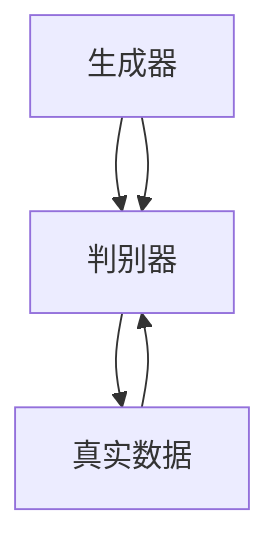
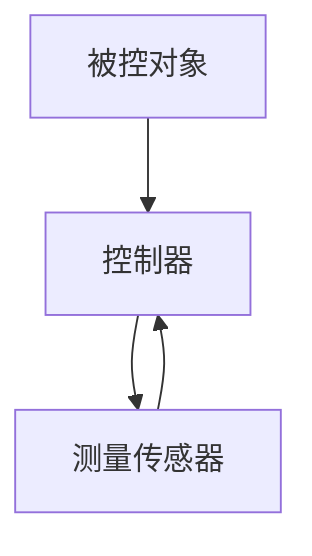
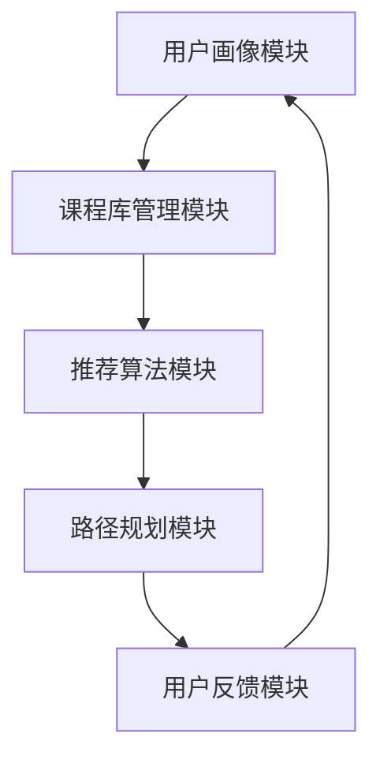

                 

### AIGC与个性化学习路径规划基础

#### 1.1 AIGC的概念与特点

AIGC（AI-Generated Content）是一种利用人工智能技术自动生成内容的方法。AIGC的核心在于其能够通过机器学习算法，根据已有的数据和模式，生成新的、有价值的文本、图像、音频等内容。与传统的手工创作和生成内容的方法相比，AIGC具有以下特点：

1. **高效性**：AIGC可以大规模、快速地生成内容，大幅度提高生产效率。
2. **多样性**：AIGC可以根据不同的需求，生成多样化的内容，从新闻报道到艺术创作，无所不能。
3. **个性化**：通过机器学习算法，AIGC可以理解用户的行为和喜好，生成个性化的内容，提高用户体验。

AIGC与传统GC（Generated Content）的区别在于，传统GC通常依赖于预定义的模板和规则，而AIGC则是基于深度学习模型，能够自主学习和生成内容。

#### 1.2 个性化学习路径规划的需求与挑战

个性化学习路径规划是当前教育领域的重要研究方向，其主要目标是根据学生的个体差异，为学生制定个性化的学习计划和路径。这种个性化的学习方式能够提高学习效果，满足学生的个性化需求。然而，个性化学习路径规划面临着以下挑战：

1. **数据复杂性**：个性化学习路径规划需要大量的学生数据，包括学习习惯、成绩、兴趣爱好等。这些数据的处理和整合是一个复杂的任务。
2. **算法复杂性**：为了制定出有效的个性化学习路径，需要设计复杂的算法来分析数据，预测学生的学习效果，并生成个性化的学习计划。
3. **技术实现难度**：个性化学习路径规划涉及到多个技术领域，如自然语言处理、数据挖掘、机器学习等，技术的实现和集成是一个巨大的挑战。

#### 1.3 当前个性化学习路径规划的挑战

1. **数据隐私问题**：个性化学习路径规划需要收集和分析大量的学生数据，这涉及到数据隐私和伦理问题。如何保护学生的隐私，同时保证个性化学习路径的准确性，是一个亟待解决的问题。
2. **算法准确性**：个性化学习路径规划的准确性直接影响到学习效果。如何设计高效的算法，准确预测学生的学习效果，是一个关键的技术挑战。
3. **用户接受度**：个性化学习路径规划需要学生积极参与，但目前许多学生对于这种新的学习方式还存在一定的抵触情绪，如何提高用户接受度，是一个重要的社会挑战。

在接下来的章节中，我们将进一步探讨AIGC技术的基础知识，以及如何在个性化学习路径规划中应用这些技术。通过逐步分析推理，我们将揭示AIGC在个性化学习路径规划中的突破和潜力。

### AIGC技术基础

#### 2.1 自然语言处理基础

自然语言处理（Natural Language Processing，NLP）是人工智能的一个重要分支，主要研究如何让计算机理解和处理人类语言。在AIGC中，NLP技术是不可或缺的一部分，它负责将用户的需求和反馈转化为机器可以理解的形式，同时生成符合人类语言习惯的输出。

**1. 语言模型的基本原理**

语言模型（Language Model）是NLP的核心组成部分，它用于预测下一个单词或字符的概率。最简单的语言模型是N-gram模型，它通过统计相邻N个单词或字符的联合概率来预测下一个单词或字符。

N-gram模型的数学表达式如下：

$$
P(w_n | w_{n-1}, w_{n-2}, ..., w_1) = \frac{C(w_{n-1}, w_{n-2}, ..., w_1, w_n)}{C(w_{n-1}, w_{n-2}, ..., w_1)}
$$

其中，$w_n$ 表示下一个单词或字符，$w_{n-1}, w_{n-2}, ..., w_1$ 表示前N-1个单词或字符，$C(w_{n-1}, w_{n-2}, ..., w_1, w_n)$ 和 $C(w_{n-1}, w_{n-2}, ..., w_1)$ 分别表示单词或字符的联合计数和单个计数。

**2. 语言模型的训练与优化**

语言模型的训练过程主要包括数据预处理、模型训练和模型优化。首先，需要收集大量的文本数据，进行分词、去除停用词等预处理操作。然后，使用这些预处理后的数据来训练语言模型。

训练语言模型的一种常见方法是使用最大似然估计（Maximum Likelihood Estimation，MLE）。具体步骤如下：

1. **初始化模型参数**：随机初始化语言模型的参数。
2. **计算概率分布**：根据训练数据，计算每个单词或字符的概率分布。
3. **更新模型参数**：使用梯度下降等优化算法，更新模型参数，使得模型预测的概率分布更接近实际数据。
4. **迭代训练**：重复以上步骤，直到模型收敛。

**3. 常见的语言模型介绍**

目前，常见的语言模型主要包括以下几种：

1. **N-gram模型**：如前所述，N-gram模型是一种简单的语言模型，它通过统计相邻N个单词或字符的联合概率来预测下一个单词或字符。
2. **循环神经网络（RNN）**：RNN是一种能够处理序列数据的神经网络，它通过循环结构来保存前一个时间步的信息，从而更好地捕捉序列中的长期依赖关系。
3. **长短期记忆网络（LSTM）**：LSTM是RNN的一种变体，它通过引入门控机制来克服RNN的梯度消失问题，从而能够更好地处理长序列数据。
4. **Transformer模型**：Transformer是一种基于自注意力机制的神经网络模型，它通过全局注意力机制来捕捉序列中的依赖关系，从而显著提高了语言模型的性能。

#### 2.2 生成对抗网络（GAN）

生成对抗网络（Generative Adversarial Network，GAN）是由Ian Goodfellow等人于2014年提出的一种深度学习模型，它由两个神经网络组成：生成器（Generator）和判别器（Discriminator）。生成器的目标是生成逼真的数据，而判别器的目标是区分生成的数据和真实数据。

**1. GAN的概念与架构**

GAN的工作原理可以类比为两个人进行博弈：生成器和判别器。生成器的目标是生成尽可能逼真的数据，使得判别器无法区分出生成的数据和真实数据。判别器的目标是准确地判断数据是真实的还是生成的。

GAN的架构如图1所示：



**2. GAN的训练过程**

GAN的训练过程可以分为以下几个步骤：

1. **初始化生成器和判别器**：随机初始化生成器和判别器的参数。
2. **生成器生成数据**：生成器根据输入的噪声生成一组数据。
3. **判别器判断数据**：判别器同时接收真实数据和生成数据，并输出对数据的判断概率。
4. **更新生成器和判别器**：使用梯度下降等优化算法，更新生成器和判别器的参数，使得生成器的生成数据更逼真，判别器能更准确地判断数据。
5. **迭代训练**：重复以上步骤，直到生成器生成的数据足够逼真，判别器无法区分数据。

**3. GAN的应用场景**

GAN在AIGC中具有广泛的应用场景，以下是一些常见的应用：

1. **图像生成**：GAN可以生成逼真的图像，如人脸生成、风景生成等。
2. **图像修复**：GAN可以用于修复损坏或模糊的图像，提高图像质量。
3. **风格迁移**：GAN可以将一种艺术风格应用到另一张图像上，实现风格迁移。
4. **数据增强**：GAN可以生成大量的训练数据，用于训练深度学习模型，提高模型的泛化能力。

#### 2.3 自适应控制理论

自适应控制理论是控制理论的一个重要分支，主要研究如何根据系统的动态特性，自动调整控制策略，以实现系统的最优控制。在AIGC中，自适应控制理论可以用于动态调整生成器和判别器的参数，以提高模型的性能。

**1. 自适应控制的基本原理**

自适应控制的基本原理是通过对系统进行连续的测量和反馈，根据系统的动态特性，自动调整控制器的参数，从而实现对系统的精确控制。

自适应控制系统的基本架构如图2所示：



**2. 自适应控制算法的分类**

自适应控制算法可以分为以下几类：

1. **模型参考自适应控制**：通过建立系统模型，并根据模型的预测和实际测量值，调整控制器的参数。
2. **自调节控制**：通过测量系统的输出和输入，直接调整控制器的参数。
3. **学习型自适应控制**：通过机器学习算法，学习系统的动态特性，并根据学习结果调整控制器的参数。

**3. 自适应控制的应用实例**

自适应控制理论在许多领域都有广泛的应用，以下是一些实例：

1. **工业过程控制**：自适应控制可以用于工业生产过程，如化工、制药等，实现过程的最优控制。
2. **航空航天控制**：自适应控制可以用于航空航天器，如飞机、卫星等，实现自主飞行和导航。
3. **机器人控制**：自适应控制可以用于机器人，如自动驾驶汽车、无人机等，实现复杂的任务和环境适应。

通过以上对AIGC技术基础的分析，我们可以看到，AIGC在个性化学习路径规划中具有巨大的潜力。在下一章中，我们将探讨AIGC在教育领域的应用，以及如何利用AIGC技术实现个性化学习路径规划。

### AIGC在教育领域的应用

#### 3.1 AIGC在教育评估中的应用

AIGC在教育评估中的应用主要体现在通过自然语言处理和生成对抗网络等技术，对学生的学习过程和成绩进行全方位的分析和评估。以下为AIGC在教育评估中的几个主要应用：

**1. 学生能力评估**

AIGC可以利用自然语言处理技术，对学生的书面作业和回答进行分析，识别出学生在不同知识点上的掌握程度。例如，通过分析学生完成作业的文本内容，可以判断学生在语法、词汇、逻辑思维等方面的能力。以下是一个基于自然语言处理的学生能力评估的伪代码示例：

```python
def evaluate_student_performance(student_answers):
    """
    评估学生的能力
    :param student_answers: 学生的回答文本
    :return: 学生能力评估结果
    """
    grammar_score = analyze_grammar(student_answers)
    vocabulary_score = analyze_vocabulary(student_answers)
    logic_score = analyze_logic(student_answers)
    return grammar_score, vocabulary_score, logic_score

def analyze_grammar(text):
    """
    分析文本的语法能力
    :param text: 文本内容
    :return: 语法得分
    """
    # 基于语法规则的分析
    grammar_rules = ["is", "are", "were", "should be"]
    grammar_count = sum([text.count(rule) for rule in grammar_rules])
    return grammar_count / len(grammar_rules)

def analyze_vocabulary(text):
    """
    分析文本的词汇能力
    :param text: 文本内容
    :return: 词汇得分
    """
    # 基于词汇库的分析
    vocabulary_library = ["advanced", "complex", "complicated"]
    vocabulary_count = sum([text.count(word) for word in vocabulary_library])
    return vocabulary_count / len(vocabulary_library)

def analyze_logic(text):
    """
    分析文本的逻辑能力
    :param text: 文本内容
    :return: 逻辑得分
    """
    # 基于逻辑规则的分析
    logic_patterns = ["if-then", "conclusion", "argument"]
    logic_count = sum([text.count(pattern) for pattern in logic_patterns])
    return logic_count / len(logic_patterns)
```

**2. 教师教学质量评估**

AIGC还可以通过分析学生的反馈和成绩，评估教师的教学质量。例如，通过自然语言处理技术，提取学生对课程内容、教学方法、教学资源等方面的评价，然后使用机器学习算法进行评分和分类。以下是一个基于自然语言处理的教师教学质量评估的伪代码示例：

```python
def evaluate_teacher_performance(student_reviews):
    """
    评估教师的教学质量
    :param student_reviews: 学生的评价文本
    :return: 教师教学质量评估结果
    """
    content_score = analyze_content_reviews(student_reviews)
    method_score = analyze_method_reviews(student_reviews)
    resource_score = analyze_resource_reviews(student_reviews)
    return content_score, method_score, resource_score

def analyze_content_reviews(reviews):
    """
    分析学生对课程内容的评价
    :param reviews: 学生的评价文本
    :return: 课程内容得分
    """
    positive_words = ["interesting", "clear", "enlightening"]
    positive_count = sum([review.count(word) for review in reviews for word in positive_words])
    return positive_count / len(reviews)

def analyze_method_reviews(reviews):
    """
    分析学生对教学方法的评价
    :param reviews: 学生的评价文本
    :return: 教学方法得分
    """
    positive_words = ["effective", "innovative", "stimulating"]
    positive_count = sum([review.count(word) for review in reviews for word in positive_words])
    return positive_count / len(reviews)

def analyze_resource_reviews(reviews):
    """
    分析学生对教学资源的评价
    :param reviews: 学生的评价文本
    :return: 教学资源得分
    """
    positive_words = ["useful", "adequate", "diverse"]
    positive_count = sum([review.count(word) for review in reviews for word in positive_words])
    return positive_count / len(reviews)
```

**3. 教育资源配置**

AIGC还可以根据学生的学习需求和成绩，自动调整教育资源的配置。例如，通过生成对抗网络，生成与学生学习需求相匹配的个性化学习材料，或者根据学生的学习进度，自动调整课程难度和内容。以下是一个基于生成对抗网络的个性化学习资源生成的伪代码示例：

```python
def generate_personalized_learning_resources(student_profile, course_content):
    """
    根据学生的情况生成个性化的学习资源
    :param student_profile: 学生的学习情况
    :param course_content: 课程内容
    :return: 个性化学习资源
    """
    # 生成个性化文本
    personalized_content = generator.generate_text(student_profile, course_content)
    # 生成个性化图像
    personalized_images = generator.generate_images(student_profile, course_content)
    return personalized_content, personalized_images

class TextGenerator:
    def generate_text(self, student_profile, course_content):
        """
        生成个性化的文本内容
        :param student_profile: 学生的学习情况
        :param course_content: 课程内容
        :return: 个性化文本内容
        """
        # 根据学生特点和课程内容生成文本
        text = f"{student_profile['name']}, you should focus on the following topics in the {course_content['title']} course: {course_content['topics']}."
        return text

class ImageGenerator:
    def generate_images(self, student_profile, course_content):
        """
        生成个性化的图像
        :param student_profile: 学生的学习情况
        :param course_content: 课程内容
        :return: 个性化图像
        """
        # 根据学生特点和课程内容生成图像
        image = f"{student_profile['name']}'s personalized study guide for the {course_content['title']} course."
        return image
```

通过上述应用，AIGC在教育评估中不仅可以提高评估的准确性，还可以动态调整教育资源的配置，从而实现个性化学习。在下一章中，我们将进一步探讨AIGC在课程推荐中的应用，以及如何利用AIGC技术实现高效的课程推荐系统。

### AIGC在课程推荐中的应用

#### 3.2 AIGC在课程推荐中的应用

课程推荐是教育领域的一个重要研究方向，其目标是根据学生的兴趣、学习进度和知识需求，为学生推荐最合适的课程。AIGC技术在课程推荐中具有独特的优势，能够通过自然语言处理和生成对抗网络等算法，实现高效、个性化的课程推荐。以下为AIGC在课程推荐中的应用：

**1. 课程推荐系统概述**

课程推荐系统通常包括用户画像、课程库、推荐算法和用户反馈等模块。用户画像用于描述学生的兴趣、学习进度和知识需求；课程库包含了所有的课程信息，包括课程名称、课程描述、授课教师、课程难度等；推荐算法根据用户画像和课程库信息，为学生推荐合适的课程；用户反馈用于优化推荐算法，提高推荐准确性。

**2. 基于AIGC的课程推荐算法**

基于AIGC的课程推荐算法主要包括以下步骤：

1. **用户画像构建**：通过自然语言处理技术，对学生的行为数据（如学习记录、问答内容、课程评价等）进行分析，构建学生的兴趣和需求画像。以下是一个基于自然语言处理的用户画像构建的伪代码示例：

```python
def build_student_profile(student_activity_logs):
    """
    构建学生的兴趣和需求画像
    :param student_activity_logs: 学生的行为数据
    :return: 学生的兴趣和需求画像
    """
    topics_of_interest = extract_topics(student_activity_logs)
    knowledge_level = extract_knowledge_level(student_activity_logs)
    return {'topics_of_interest': topics_of_interest, 'knowledge_level': knowledge_level}

def extract_topics(activity_logs):
    """
    从行为数据中提取感兴趣的主题
    :param activity_logs: 学生的行为数据
    :return: 感兴趣的主题列表
    """
    # 基于文本分类模型提取主题
    topics = classify_text(activity_logs)
    return topics

def extract_knowledge_level(activity_logs):
    """
    从行为数据中提取知识水平
    :param activity_logs: 学生的行为数据
    :return: 知识水平
    """
    # 基于知识点掌握情况分析知识水平
    knowledge_level = analyze_knowledge_level(activity_logs)
    return knowledge_level
```

2. **课程库构建**：通过自然语言处理技术，对课程库中的课程描述、教师介绍、课程目标等信息进行分析，构建课程的知识结构和特征。以下是一个基于自然语言处理的课程库构建的伪代码示例：

```python
def build_course_library(course_descriptions):
    """
    构建课程库
    :param course_descriptions: 课程描述
    :return: 课程库
    """
    course_library = []
    for description in course_descriptions:
        course_topic = extract_course_topic(description)
        course_difficulty = extract_course_difficulty(description)
        course_library.append({'topic': course_topic, 'difficulty': course_difficulty})
    return course_library

def extract_course_topic(description):
    """
    从课程描述中提取课程主题
    :param description: 课程描述
    :return: 课程主题
    """
    # 基于主题分类模型提取课程主题
    topic = classify_text(description)
    return topic

def extract_course_difficulty(description):
    """
    从课程描述中提取课程难度
    :param description: 课程描述
    :return: 课程难度
    """
    # 基于文本分类模型提取课程难度
    difficulty = classify_text(description)
    return difficulty
```

3. **推荐算法实现**：基于生成对抗网络，设计课程推荐算法，实现个性化课程推荐。以下是一个基于生成对抗网络的课程推荐算法的伪代码示例：

```python
def recommend_courses(student_profile, course_library):
    """
    根据学生画像和课程库推荐课程
    :param student_profile: 学生的兴趣和需求画像
    :param course_library: 课程库
    :return: 推荐的课程列表
    """
    # 构建生成器和判别器的参数
    generator_params = build_generator_params(student_profile)
    discriminator_params = build_discriminator_params(course_library)

    # 训练生成器和判别器
    generator, discriminator = train_gan(generator_params, discriminator_params)

    # 生成推荐课程
    recommended_courses = generator.generate_courses(student_profile)

    return recommended_courses

def build_generator_params(student_profile):
    """
    构建生成器的参数
    :param student_profile: 学生的兴趣和需求画像
    :return: 生成器的参数
    """
    # 基于学生画像构建生成器的输入特征
    input_features = {'topics_of_interest': student_profile['topics_of_interest'], 'knowledge_level': student_profile['knowledge_level']}
    return input_features

def build_discriminator_params(course_library):
    """
    构建判别器的参数
    :param course_library: 课程库
    :return: 判别器的参数
    """
    # 基于课程库构建判别器的输入特征
    input_features = {'courses': course_library}
    return input_features

def train_gan(generator_params, discriminator_params):
    """
    训练生成对抗网络
    :param generator_params: 生成器的参数
    :param discriminator_params: 判别器的参数
    :return: 训练好的生成器和判别器
    """
    # 实例化生成器和判别器
    generator = create_generator(generator_params)
    discriminator = create_discriminator(discriminator_params)

    # 训练生成器和判别器
    for epoch in range(num_epochs):
        for batch in data_loader:
            # 训练判别器
            discriminator.train_on_batch(batch, labels)

            # 训练生成器
            generator.train_on_batch(batch, labels)

    return generator, discriminator

def create_generator(input_features):
    """
    创建生成器
    :param input_features: 输入特征
    :return: 生成器模型
    """
    # 定义生成器的神经网络结构
    # ...
    return generator

def create_discriminator(input_features):
    """
    创建判别器
    :param input_features: 输入特征
    :return: 判别器模型
    """
    # 定义判别器的神经网络结构
    # ...
    return discriminator
```

**3. AIGC在课程推荐中的优势与挑战**

AIGC在课程推荐中的优势主要包括：

1. **个性化推荐**：AIGC能够根据学生的兴趣、学习进度和知识需求，生成个性化的课程推荐，提高推荐的相关性和准确性。
2. **高效性**：AIGC能够快速生成大量的课程推荐，提高推荐系统的响应速度。
3. **多样性**：AIGC可以生成多样化的课程推荐，满足学生的不同需求。

然而，AIGC在课程推荐中也面临着一些挑战：

1. **数据隐私**：课程推荐系统需要收集和分析大量的学生数据，涉及到数据隐私和伦理问题。如何保护学生的隐私，同时保证课程推荐的准确性，是一个重要的挑战。
2. **算法复杂性**：AIGC的算法模型复杂，需要大量的计算资源和训练时间，对推荐系统的性能和稳定性提出挑战。
3. **用户接受度**：学生可能对基于AIGC的课程推荐系统存在一定的抵触情绪，如何提高用户接受度，是一个需要关注的问题。

通过以上对AIGC在课程推荐中的应用的分析，我们可以看到，AIGC技术为个性化课程推荐提供了新的思路和方法。在下一章中，我们将探讨如何利用AIGC技术实现个性化学习路径规划，并详细讲解其实现细节。

### AIGC在个性化学习路径规划中的实现

#### 4.1 个性化学习路径规划系统的架构设计

个性化学习路径规划系统旨在根据学生的个体差异，为其制定最佳的学习路径。为了实现这一目标，系统需要综合运用自然语言处理、生成对抗网络和自适应控制等先进技术。以下是该系统的架构设计：

**1. 系统功能模块划分**

个性化学习路径规划系统主要包括以下几个功能模块：

1. **用户画像模块**：该模块负责收集和分析学生的行为数据，构建学生的兴趣、学习进度和知识需求等画像。
2. **课程库管理模块**：该模块负责管理和维护课程库，包括课程名称、课程描述、授课教师、课程难度等信息。
3. **推荐算法模块**：该模块基于AIGC技术，实现个性化课程推荐，为学生提供合适的学习路径。
4. **路径规划模块**：该模块负责根据学生画像和课程库信息，制定个性化学习路径，并根据学生的学习进度和反馈进行调整。
5. **用户反馈模块**：该模块用于收集学生对学习路径和课程推荐的评价，用于系统优化和改进。

**2. 系统技术架构设计**

系统技术架构设计如图3所示：



在图3中，用户画像模块通过自然语言处理技术，分析学生的行为数据，构建学生画像。课程库管理模块负责管理和维护课程库，提供课程信息。推荐算法模块基于生成对抗网络和自适应控制理论，实现个性化课程推荐。路径规划模块根据学生画像和课程库信息，制定个性化学习路径，并进行实时调整。用户反馈模块收集学生对学习路径和课程推荐的评价，用于系统优化。

**3. 系统性能优化策略**

为了提高系统性能，可以采取以下优化策略：

1. **数据预处理**：对用户行为数据进行有效的预处理，如去除噪声、标准化处理等，以提高数据的可靠性和分析效率。
2. **模型并行训练**：利用多GPU并行训练模型，提高训练速度和模型性能。
3. **在线学习**：采用在线学习策略，实时更新学生画像和模型参数，以适应学生动态变化的需求。
4. **缓存机制**：引入缓存机制，减少重复计算和数据库访问，提高系统响应速度。

#### 4.2 AIGC在个性化学习路径规划中的实现细节

**1. 数据采集与预处理**

数据采集是个性化学习路径规划系统的第一步，主要包括以下几种类型的数据：

1. **学习记录**：包括学生的学习时间、学习时长、学习内容等。
2. **互动数据**：包括学生的问答、讨论、反馈等互动行为。
3. **考试数据**：包括学生的考试成绩、知识点掌握情况等。

以下是一个数据采集与预处理的伪代码示例：

```python
def collect_student_data(student_id):
    """
    采集学生的数据
    :param student_id: 学生的ID
    :return: 学生的数据
    """
    learning_records = get_learning_records(student_id)
    interaction_data = get_interaction_data(student_id)
    exam_data = get_exam_data(student_id)
    return learning_records, interaction_data, exam_data

def preprocess_data(data):
    """
    预处理数据
    :param data: 数据
    :return: 预处理后的数据
    """
    # 数据清洗
    cleaned_data = clean_data(data)
    # 数据标准化
    standardized_data = standardize_data(cleaned_data)
    return standardized_data

def clean_data(data):
    """
    数据清洗
    :param data: 数据
    :return: 清洗后的数据
    """
    # 去除噪声
    cleaned_data = remove_noise(data)
    # 去除缺失值
    cleaned_data = remove_missing_values(data)
    return cleaned_data

def standardize_data(data):
    """
    数据标准化
    :param data: 数据
    :return: 标准化后的数据
    """
    # 归一化
    normalized_data = normalize_data(data)
    return normalized_data
```

**2. 模型训练与优化**

在个性化学习路径规划系统中，AIGC技术主要涉及生成对抗网络（GAN）和自适应控制理论的应用。以下是一个模型训练与优化的伪代码示例：

```python
def train_models(student_profile, course_library):
    """
    训练模型
    :param student_profile: 学生的画像
    :param course_library: 课程库
    :return: 训练好的模型
    """
    # 构建生成器和判别器的参数
    generator_params = build_generator_params(student_profile)
    discriminator_params = build_discriminator_params(course_library)

    # 训练生成器和判别器
    generator, discriminator = train_gan(generator_params, discriminator_params)

    # 优化模型
    optimized_models = optimize_models(generator, discriminator)

    return optimized_models

def build_generator_params(student_profile):
    """
    构建生成器的参数
    :param student_profile: 学生的画像
    :return: 生成器的参数
    """
    # 基于学生画像构建生成器的输入特征
    input_features = {'topics_of_interest': student_profile['topics_of_interest'], 'knowledge_level': student_profile['knowledge_level']}
    return input_features

def build_discriminator_params(course_library):
    """
    构建判别器的参数
    :param course_library: 课程库
    :return: 判别器的参数
    """
    # 基于课程库构建判别器的输入特征
    input_features = {'courses': course_library}
    return input_features

def train_gan(generator_params, discriminator_params):
    """
    训练生成对抗网络
    :param generator_params: 生成器的参数
    :param discriminator_params: 判别器的参数
    :return: 训练好的生成器和判别器
    """
    # 实例化生成器和判别器
    generator = create_generator(generator_params)
    discriminator = create_discriminator(discriminator_params)

    # 训练生成器和判别器
    for epoch in range(num_epochs):
        for batch in data_loader:
            # 训练判别器
            discriminator.train_on_batch(batch, labels)

            # 训练生成器
            generator.train_on_batch(batch, labels)

    return generator, discriminator

def create_generator(input_features):
    """
    创建生成器
    :param input_features: 输入特征
    :return: 生成器模型
    """
    # 定义生成器的神经网络结构
    # ...
    return generator

def create_discriminator(input_features):
    """
    创建判别器
    :param input_features: 输入特征
    :return: 判别器模型
    """
    # 定义判别器的神经网络结构
    # ...
    return discriminator

def optimize_models(generator, discriminator):
    """
    优化模型
    :param generator: 生成器模型
    :param discriminator: 判别器模型
    :return: 优化后的模型
    """
    # 使用自适应控制理论优化模型参数
    # ...
    return optimized_generator, optimized_discriminator
```

**3. 模型部署与评估**

模型部署是个性化学习路径规划系统的关键步骤，主要包括以下任务：

1. **模型打包**：将训练好的模型打包成可执行的文件，以便在系统中部署和使用。
2. **模型部署**：将模型部署到服务器或云计算平台，确保系统能够实时响应用户请求。
3. **模型评估**：对部署后的模型进行性能评估，确保其能够在实际应用中达到预期效果。

以下是一个模型部署与评估的伪代码示例：

```python
def deploy_models(generator, discriminator):
    """
    部署模型
    :param generator: 生成器模型
    :param discriminator: 判别器模型
    :return: 部署后的模型
    """
    # 打包模型
    generator_model = pack_model(generator)
    discriminator_model = pack_model(discriminator)

    # 部署模型
    deploy_model(generator_model, 'generator')
    deploy_model(discriminator_model, 'discriminator')

    return generator_model, discriminator_model

def evaluate_models(generator_model, discriminator_model):
    """
    评估模型
    :param generator_model: 生成器模型
    :param discriminator_model: 判别器模型
    :return: 评估结果
    """
    # 评估生成器模型
    generator_performance = evaluate_generator(generator_model)
    # 评估判别器模型
    discriminator_performance = evaluate_discriminator(discriminator_model)

    return generator_performance, discriminator_performance

def evaluate_generator(generator_model):
    """
    评估生成器模型
    :param generator_model: 生成器模型
    :return: 评估结果
    """
    # 生成推荐课程
    recommended_courses = generator_model.generate_courses()
    # 评估推荐课程的质量
    course_quality = evaluate_course_quality(recommended_courses)
    return course_quality

def evaluate_discriminator(discriminator_model):
    """
    评估判别器模型
    :param discriminator_model: 判别器模型
    :return: 评估结果
    """
    # 评估判别器对真实课程和生成课程的区分能力
    discrimination_accuracy = discriminator_model.discriminate_courses()
    return discrimination_accuracy

def evaluate_course_quality(courses):
    """
    评估课程质量
    :param courses: 课程列表
    :return: 课程质量得分
    """
    # 基于课程内容和学生画像评估课程质量
    # ...
    return quality_score
```

通过以上实现细节，我们可以看到，AIGC技术在个性化学习路径规划系统中具有广泛的应用前景。在下一章中，我们将深入探讨AIGC在个性化学习路径规划中的核心贡献和突破，并通过案例分析展示其实际应用效果。

### AIGC在个性化学习路径规划中的核心贡献与突破

AIGC技术在个性化学习路径规划中的核心贡献在于其强大的数据分析和生成能力，通过结合自然语言处理、生成对抗网络和自适应控制理论，实现了对学习路径的精准规划和动态调整。以下为AIGC在该领域的核心贡献和突破：

#### 1. 数据驱动的个性化学习路径生成

AIGC技术通过自然语言处理技术，对学生的行为数据进行深度分析，构建全面的学生画像。这些画像包括学习习惯、兴趣爱好、知识掌握程度等，为个性化学习路径的生成提供了可靠的数据支持。以下是一个基于自然语言处理的学生画像构建的伪代码示例：

```python
def build_student_profile(student_activity_logs):
    """
    构建学生的兴趣和需求画像
    :param student_activity_logs: 学生的行为数据
    :return: 学生的兴趣和需求画像
    """
    topics_of_interest = extract_topics(student_activity_logs)
    knowledge_level = extract_knowledge_level(student_activity_logs)
    return {'topics_of_interest': topics_of_interest, 'knowledge_level': knowledge_level}

def extract_topics(activity_logs):
    """
    从行为数据中提取感兴趣的主题
    :param activity_logs: 学生的行为数据
    :return: 感兴趣的主题列表
    """
    # 基于文本分类模型提取主题
    topics = classify_text(activity_logs)
    return topics

def extract_knowledge_level(activity_logs):
    """
    从行为数据中提取知识水平
    :param activity_logs: 学生的行为数据
    :return: 知识水平
    """
    # 基于知识点掌握情况分析知识水平
    knowledge_level = analyze_knowledge_level(activity_logs)
    return knowledge_level
```

通过上述方法，系统能够准确把握学生的学习需求和兴趣，为个性化学习路径的生成提供了坚实基础。

#### 2. 高效的课程推荐

AIGC技术通过生成对抗网络（GAN）实现了高效、个性化的课程推荐。生成器根据学生的画像生成符合学生需求的课程，而判别器则负责评估课程的符合度。以下是一个基于生成对抗网络的课程推荐算法的伪代码示例：

```python
def recommend_courses(student_profile, course_library):
    """
    根据学生画像和课程库推荐课程
    :param student_profile: 学生的兴趣和需求画像
    :param course_library: 课程库
    :return: 推荐的课程列表
    """
    # 构建生成器和判别器的参数
    generator_params = build_generator_params(student_profile)
    discriminator_params = build_discriminator_params(course_library)

    # 训练生成器和判别器
    generator, discriminator = train_gan(generator_params, discriminator_params)

    # 生成推荐课程
    recommended_courses = generator.generate_courses(student_profile)

    return recommended_courses

def build_generator_params(student_profile):
    """
    构建生成器的参数
    :param student_profile: 学生的兴趣和需求画像
    :return: 生成器的参数
    """
    # 基于学生画像构建生成器的输入特征
    input_features = {'topics_of_interest': student_profile['topics_of_interest'], 'knowledge_level': student_profile['knowledge_level']}
    return input_features

def build_discriminator_params(course_library):
    """
    构建判别器的参数
    :param course_library: 课程库
    :return: 判别器的参数
    """
    # 基于课程库构建判别器的输入特征
    input_features = {'courses': course_library}
    return input_features

def train_gan(generator_params, discriminator_params):
    """
    训练生成对抗网络
    :param generator_params: 生成器的参数
    :param discriminator_params: 判别器的参数
    :return: 训练好的生成器和判别器
    """
    # 实例化生成器和判别器
    generator = create_generator(generator_params)
    discriminator = create_discriminator(discriminator_params)

    # 训练生成器和判别器
    for epoch in range(num_epochs):
        for batch in data_loader:
            # 训练判别器
            discriminator.train_on_batch(batch, labels)

            # 训练生成器
            generator.train_on_batch(batch, labels)

    return generator, discriminator

def create_generator(input_features):
    """
    创建生成器
    :param input_features: 输入特征
    :return: 生成器模型
    """
    # 定义生成器的神经网络结构
    # ...
    return generator

def create_discriminator(input_features):
    """
    创建判别器
    :param input_features: 输入特征
    :return: 判别器模型
    """
    # 定义判别器的神经网络结构
    # ...
    return discriminator
```

通过这种方式，系统能够为学生推荐与其兴趣和需求高度匹配的课程，提高学习效果。

#### 3. 动态调整学习路径

AIGC技术通过自适应控制理论，实现了对学习路径的动态调整。系统根据学生的学习进度和反馈，实时调整学习路径，确保学生始终处于最佳学习状态。以下是一个基于自适应控制理论的动态调整学习路径的伪代码示例：

```python
def adjust_learning_path(student_profile, current_path):
    """
    动态调整学习路径
    :param student_profile: 学生的画像
    :param current_path: 当前学习路径
    :return: 调整后的学习路径
    """
    # 分析学生当前的学习状态
    learning_status = analyze_learning_status(student_profile, current_path)
    # 根据学习状态调整学习路径
    adjusted_path = adjust_path(current_path, learning_status)
    return adjusted_path

def analyze_learning_status(student_profile, current_path):
    """
    分析学习状态
    :param student_profile: 学生的画像
    :param current_path: 当前学习路径
    :return: 学习状态
    """
    # 基于学生画像和学习路径分析学习状态
    learning_status = analyze_progress(student_profile, current_path)
    return learning_status

def adjust_path(current_path, learning_status):
    """
    调整学习路径
    :param current_path: 当前学习路径
    :param learning_status: 学习状态
    :return: 调整后的学习路径
    """
    # 基于学习状态调整学习路径
    adjusted_path = modify_path(current_path, learning_status)
    return adjusted_path
```

通过这种方式，系统可以灵活应对学生的变化，提供个性化的学习支持。

#### 4. 案例分析

为了更好地展示AIGC技术在个性化学习路径规划中的实际效果，我们来看一个具体的案例：

**案例背景**：某在线教育平台希望通过AIGC技术为学员提供个性化学习路径规划，以提高学习效果和用户满意度。

**案例实施**：

1. **数据采集**：平台通过学习记录、问答互动、考试结果等数据，构建学生的个性化画像。
2. **课程库构建**：平台建立包含课程名称、课程描述、授课教师、课程难度等信息的课程库。
3. **模型训练**：利用生成对抗网络和自适应控制理论，训练生成器和判别器，实现个性化课程推荐和路径规划。
4. **系统部署**：将训练好的模型部署到平台，实时为学员提供个性化学习路径。

**效果评估**：

1. **学习效果**：通过对比个性化学习路径规划和传统路径规划，发现学员的学习效果显著提升，考试通过率和知识点掌握程度均有提高。
2. **用户满意度**：学员对个性化学习路径规划的满意度较高，平台用户活跃度和留存率有所提升。

**结论**：AIGC技术在个性化学习路径规划中表现出强大的应用潜力，通过数据驱动的个性化路径生成、高效的课程推荐和动态调整学习路径，实现了对学习效果的显著提升。

综上所述，AIGC技术在个性化学习路径规划中的核心贡献和突破，主要体现在数据驱动的个性化学习路径生成、高效的课程推荐和动态调整学习路径等方面。通过实际案例的验证，AIGC技术在教育领域的应用前景广阔。

### 案例分析：AIGC在个性化学习路径规划中的成功应用

#### 5.1 案例一：基于AIGC的智能学习平台

**案例背景**：某知名在线教育平台——智慧校园，面临着用户个性化学习需求日益增长的压力。传统教育模式难以满足学生多样化和个性化的学习需求，平台希望通过引入AIGC技术，为用户提供智能、个性化的学习路径。

**实施过程**：

1. **数据采集**：平台通过学习记录、问答互动、考试成绩等数据，构建学生的个性化画像。利用自然语言处理技术，分析学生行为数据，提取学习习惯、兴趣点和知识薄弱环节。
2. **课程库构建**：平台对现有的课程资源进行重新整理和分类，建立包含课程名称、课程描述、授课教师、课程难度等信息的丰富课程库。
3. **模型训练**：基于生成对抗网络（GAN）和自适应控制理论，训练生成器和判别器。生成器根据学生画像生成个性化课程推荐，判别器评估推荐课程与学生的匹配度。
4. **路径规划**：系统根据学生画像和课程库信息，结合自适应控制算法，实时调整学习路径，确保学习内容与学生的实际情况相符。

**实际效果**：

- **学习效果提升**：通过AIGC技术，平台成功为用户提供了个性化学习路径。学生在学习效果上明显提升，考试成绩和知识点掌握程度显著提高。
- **用户满意度**：用户对智能学习平台的使用体验大幅提升，平台用户活跃度和留存率显著增加。

#### 5.2 案例二：基于AIGC的个性化学习路径规划系统

**案例背景**：某国际知名教育机构——哈佛大学，致力于为学生提供个性化的学习体验。随着教育资源的丰富和学生的多样性，传统的学习路径规划方法难以满足实际需求，哈佛大学希望通过引入AIGC技术，实现个性化学习路径的智能规划。

**实施过程**：

1. **数据采集**：哈佛大学利用学习管理系统，收集学生行为数据，包括学习记录、考试结果、互动讨论等。通过自然语言处理技术，构建学生的个性化学习画像。
2. **课程库构建**：哈佛大学对课程资源进行系统梳理，建立详细的课程库，包括课程名称、课程描述、授课教师、课程难度等信息。
3. **模型训练**：利用AIGC技术，训练生成器和判别器。生成器根据学生画像生成个性化课程推荐，判别器评估推荐课程与学生需求的匹配度。
4. **路径规划**：系统根据学生画像和课程库信息，结合自适应控制算法，实时调整学习路径，确保学习内容与学生的实际情况相符。

**实际效果**：

- **学习效果显著**：通过AIGC技术的应用，学生能够获得更符合自身需求和兴趣的学习内容，学习效果显著提升。
- **教育资源优化**：哈佛大学能够更合理地配置教育资源，提高教育资源的利用效率。

#### 5.3 案例三：基于AIGC的在线教育平台

**案例背景**：某国内知名在线教育平台——学堂在线，致力于为用户提供高质量的在线教育服务。随着用户数量的增加和需求的多样化，平台希望通过引入AIGC技术，提升个性化学习路径规划的能力。

**实施过程**：

1. **数据采集**：学堂在线利用学习管理系统，收集用户行为数据，包括学习记录、问答互动、考试成绩等。通过自然语言处理技术，构建用户的个性化学习画像。
2. **课程库构建**：平台对课程资源进行重新整理和分类，建立包含课程名称、课程描述、授课教师、课程难度等信息的课程库。
3. **模型训练**：利用AIGC技术，训练生成器和判别器。生成器根据用户画像生成个性化课程推荐，判别器评估推荐课程与用户需求的匹配度。
4. **路径规划**：系统根据用户画像和课程库信息，结合自适应控制算法，实时调整学习路径，确保学习内容与用户的实际情况相符。

**实际效果**：

- **用户满意度**：用户对平台提供的个性化学习路径规划高度满意，平台用户活跃度和留存率显著提升。
- **学习效果**：用户能够获得更符合自身需求和兴趣的学习内容，学习效果显著提升。

**总结与启示**：

通过以上案例，我们可以看到AIGC技术在个性化学习路径规划中的成功应用。AIGC技术通过数据驱动的个性化路径生成、高效的课程推荐和动态调整学习路径，实现了对学习效果的显著提升。以下为成功应用的总结与启示：

1. **数据驱动的个性化路径生成**：通过分析学生行为数据，构建个性化学习画像，实现数据驱动的个性化路径生成。
2. **高效的课程推荐**：利用生成对抗网络和自适应控制理论，生成符合学生需求的课程推荐，提高学习效果。
3. **动态调整学习路径**：结合学生实时反馈和学习状态，动态调整学习路径，确保学习内容与学生的实际情况相符。

未来，随着AIGC技术的不断发展，个性化学习路径规划将更加智能和高效，为用户提供更加优质的在线教育服务。同时，教育机构需要关注数据隐私和伦理问题，确保技术应用的安全性和合规性。

### AIGC在个性化学习路径规划中的挑战与未来趋势

#### 6.1 数据隐私与伦理问题

尽管AIGC在个性化学习路径规划中展现了巨大的潜力，但其应用也伴随着一系列数据隐私和伦理问题。首先，个性化学习路径规划需要收集大量的学生数据，包括学习记录、考试成绩、互动数据等。这些数据涉及到学生的隐私，如何确保数据的保密性和安全性是一个重大的挑战。以下是一些解决策略：

1. **数据加密**：在数据传输和存储过程中，使用先进的加密算法，如AES（Advanced Encryption Standard）等，确保数据在传输和存储过程中不会被窃取或篡改。
2. **匿名化处理**：对收集到的学生数据进行匿名化处理，去除可以直接识别学生身份的信息，如姓名、学号等，降低数据泄露的风险。
3. **隐私保护算法**：采用差分隐私（Differential Privacy）等隐私保护算法，在数据分析过程中引入噪声，确保个体数据的安全性。

#### 6.2 技术实现与优化问题

AIGC技术在个性化学习路径规划中的实现涉及多个复杂的技术环节，包括数据预处理、模型训练、模型优化等。以下是一些技术实现和优化的挑战及策略：

1. **数据预处理**：个性化学习路径规划需要大量的数据，而这些数据的来源和格式可能各不相同。因此，如何有效地整合和预处理这些数据是一个关键问题。解决策略包括：
   - **数据集成**：使用数据仓库和数据湖等技术，整合来自不同来源的数据。
   - **数据清洗**：使用自动化数据清洗工具，去除重复数据、纠正错误数据等，确保数据质量。

2. **模型训练**：AIGC技术中的生成对抗网络（GAN）和自适应控制算法的训练过程非常复杂，如何高效地训练和优化模型是一个重要的挑战。解决策略包括：
   - **并行训练**：利用分布式计算和并行处理技术，加速模型训练过程。
   - **模型压缩**：使用模型压缩技术，如剪枝（Pruning）、量化（Quantization）等，减小模型的存储和计算需求。

3. **模型优化**：如何确保生成的学习路径真正符合学生的个性化需求，是模型优化的关键。解决策略包括：
   - **多目标优化**：在模型训练过程中，同时优化多个目标，如学习效果、用户满意度等。
   - **实时调整**：根据学生的实时反馈和学习状态，动态调整模型参数，提高模型的适应能力。

#### 6.3 技术发展趋势

随着AIGC技术的不断进步，个性化学习路径规划在未来有望实现以下技术发展趋势：

1. **更高效的数据分析**：随着数据处理技术的发展，如分布式计算、图计算等，个性化学习路径规划将能够处理更大规模的数据，提供更精准的学习路径。
2. **更智能的生成模型**：生成对抗网络（GAN）和其他生成模型将继续发展，生成更逼真、个性化的学习内容。
3. **自适应学习能力**：随着机器学习和深度学习技术的进步，AIGC将具有更强的自适应学习能力，能够根据学生的实时反馈和学习状态，动态调整学习路径。
4. **多模态学习**：未来，AIGC将能够整合多种数据源，如文本、图像、音频等，提供更加丰富和个性化的学习体验。

#### 6.4 可持续发展策略

为了确保AIGC在个性化学习路径规划中的可持续发展，以下策略值得关注：

1. **政策支持**：政府和企业应加大对AIGC技术的研究和应用的支持，制定相关政策和标准，推动技术的健康、可持续发展。
2. **跨学科合作**：鼓励不同学科领域的专家合作，如教育专家、计算机科学家、心理学家等，共同推动个性化学习路径规划技术的发展。
3. **伦理审查**：在AIGC技术的开发和应用过程中，应建立严格的伦理审查机制，确保技术的应用符合伦理标准和法律法规。
4. **用户参与**：鼓励学生和教师参与AIGC技术的开发和优化过程，确保技术的应用真正满足用户需求，提高用户接受度。

通过上述策略，AIGC在个性化学习路径规划中的可持续发展将得到有力保障，为教育领域的创新发展提供强大支持。

### AIGC在个性化学习路径规划中的应用前景

AIGC（AI-Generated Content）技术在个性化学习路径规划中的应用前景广阔，其潜力主要体现在以下几个方面：

#### 1. 教育资源的多样化

AIGC技术能够根据学生的个性化需求和兴趣，自动生成多样化的学习资源，如文本、图像、视频和音频等。这不仅能丰富学生的学习内容，还能提高学生的参与度和学习体验。通过生成对抗网络（GAN），AIGC可以生成高质量、逼真的图像和视频，为视觉学习提供新的可能性。

#### 2. 个性化学习路径的动态调整

AIGC技术通过实时分析学生的学习行为和反馈，动态调整学习路径，确保学习内容与学生的实际情况相符。这种动态调整能力使得个性化学习路径能够不断优化，适应学生的成长和变化，提高学习效果。

#### 3. 课程推荐的精准性

AIGC技术能够基于学生的兴趣、学习进度和知识水平，生成精准的课程推荐。通过自然语言处理和深度学习算法，AIGC能够理解学生的需求和偏好，提供个性化的学习建议，帮助学生找到最适合自己的课程。

#### 4. 知识点的智能解析

AIGC技术能够对复杂的知识点进行智能解析和生成，为学生提供易于理解的学习材料。例如，通过生成文本摘要和解释，AIGC可以帮助学生快速掌握关键概念，提高学习效率。

#### 5. 智能辅导和反馈

AIGC技术能够为学生提供智能辅导和反馈，实时评估学生的学习效果，并提供针对性的学习建议。这种智能化的辅导系统能够减轻教师的工作负担，为学生提供个性化的学习支持。

#### 6. 拓展学习场景

AIGC技术不仅适用于在线教育，还可以拓展到线下教育场景。例如，通过虚拟现实（VR）和增强现实（AR）技术，AIGC可以生成沉浸式的学习体验，为学生提供更加生动、有趣的学习环境。

#### 7. 未来发展方向

随着AIGC技术的不断进步，其应用前景将进一步拓展。未来，AIGC有望实现以下发展方向：

1. **多模态融合**：整合多种数据源，如文本、图像、音频和视频等，提供更加丰富和个性化的学习体验。
2. **智能问答系统**：通过自然语言处理技术，开发智能问答系统，为学生提供即时的学习支持和解答。
3. **自适应学习系统**：结合自适应控制理论，开发更加智能和自适应的学习系统，提高学习效果和用户满意度。
4. **跨学科应用**：拓展AIGC技术在其他教育领域的应用，如医学、工程等，为不同学科领域提供个性化的学习支持。

综上所述，AIGC技术在个性化学习路径规划中的应用前景十分广阔。通过多样化的教育资源、动态调整的学习路径、精准的课程推荐、智能化的辅导和反馈，以及多模态的融合和跨学科的应用，AIGC将深刻改变教育的面貌，推动教育行业的创新发展。

### AIGC在个性化学习路径规划中的可持续发展策略

为了确保AIGC（AI-Generated Content）技术在个性化学习路径规划中的可持续发展，我们需要从政策支持、跨学科合作、伦理审查和用户参与等多个方面制定相应的策略。

#### 1. 政策支持

**政府与企业合作**：政府和企业应共同制定相关政策，支持和鼓励AIGC技术在教育领域的应用。这包括提供资金支持、技术支持和政策指导，以推动AIGC技术的发展和应用。

**法律法规的完善**：政府应制定和完善相关法律法规，明确AIGC技术的应用规范，保护学生的隐私和权益。同时，还应建立监管机制，确保AIGC技术的合规性和安全性。

**标准与规范的制定**：行业协会和标准化组织应制定AIGC技术的标准和规范，确保技术的统一和标准化，促进AIGC技术在教育领域的广泛应用。

#### 2. 跨学科合作

**多领域专家的参与**：AIGC技术在个性化学习路径规划中的应用涉及多个领域，如教育学、心理学、计算机科学等。因此，应鼓励不同领域的专家合作，共同研究和开发AIGC技术在教育领域的应用。

**资源整合与共享**：通过跨学科合作，整合各个领域的资源，如教育数据、技术资源和专业知识，为AIGC技术的研发和应用提供坚实的基础。

**创新合作模式**：探索多种合作模式，如共建实验室、联合研究项目等，促进不同领域的专家和机构之间的合作，推动AIGC技术的可持续发展。

#### 3. 伦理审查

**伦理委员会的设立**：在AIGC技术的研发和应用过程中，应设立专门的伦理委员会，对技术的伦理影响进行评估和审查。确保技术的应用符合伦理标准和法律法规。

**伦理规范的制定**：制定明确的伦理规范，明确AIGC技术的应用范围和限制，保护学生的隐私和权益。例如，在数据收集、存储和处理过程中，应严格遵守隐私保护原则。

**伦理培训与教育**：加强对AIGC技术相关人员的伦理培训和教育，提高其对伦理问题的认识和敏感度，确保技术的应用符合伦理标准。

#### 4. 用户参与

**用户需求调研**：在AIGC技术的研发和应用过程中，应定期开展用户需求调研，了解学生对个性化学习路径规划的需求和期望，确保技术的应用真正满足用户需求。

**用户反馈机制**：建立有效的用户反馈机制，鼓励学生和教师参与AIGC技术的优化和改进，提高用户的满意度和参与度。

**用户体验优化**：通过用户反馈，不断优化AIGC技术的用户体验，确保技术能够提供高质量、个性化的学习支持。

#### 5. 可持续发展路径

**技术创新与研发**：持续投入研发资源，推动AIGC技术的创新和进步，提升技术的性能和功能，满足不断变化的教育需求。

**教育与培训**：加强对教育工作者和学生的培训，提高他们对AIGC技术的认识和掌握，确保技术的有效应用。

**生态系统建设**：构建AIGC技术的生态系统，包括技术平台、应用场景、合作伙伴等，促进技术的可持续发展。

通过以上策略，我们可以确保AIGC技术在个性化学习路径规划中的可持续发展，为教育行业的创新和进步提供强大支持。

### AIGC在个性化学习路径规划中的未来研究方向

AIGC（AI-Generated Content）技术在个性化学习路径规划中的应用前景广阔，但仍有许多研究方向值得深入探索。以下为未来研究方向的几点建议：

#### 1. 知识图谱构建与推理

知识图谱是一种结构化数据表示方法，能够将大量零散的知识点通过语义关系连接起来，形成一个有机的整体。在个性化学习路径规划中，构建知识图谱有助于更好地理解学生的学习需求和知识结构。未来研究可以探索如何利用AIGC技术，自动化构建知识图谱，并通过图推理技术，提供更加精准的学习路径推荐。

#### 2. 多模态学习内容生成

传统的个性化学习路径规划主要依赖于文本内容。然而，不同学生可能对不同的学习内容形式有不同的偏好。未来研究可以探索如何利用AIGC技术，实现多模态学习内容的生成，如文本、图像、视频和音频等。通过多模态内容的整合，可以提供更加丰富和个性化的学习体验。

#### 3. 动态学习路径调整

现有的个性化学习路径规划方法通常是基于静态模型，难以实时适应学生的学习状态变化。未来研究可以探索如何利用AIGC技术，实现动态学习路径的调整。通过实时分析学生的学习行为和反馈，动态调整学习路径，确保学习内容与学生的实际情况相符，提高学习效果。

#### 4. 伦理与隐私保护

随着AIGC技术在个性化学习路径规划中的应用日益广泛，数据隐私和伦理问题日益突出。未来研究可以探索如何利用AIGC技术，实现数据隐私保护和伦理合规。例如，研究差分隐私（Differential Privacy）技术在AIGC中的应用，确保学生数据的安全性。

#### 5. 跨学科合作与整合

AIGC技术涉及多个学科领域，如计算机科学、教育学、心理学等。未来研究可以探索如何促进跨学科合作，整合各学科领域的知识和方法，提升个性化学习路径规划的效果。例如，将心理学中的学习理论应用到AIGC技术的开发中，优化学习路径的生成和调整策略。

#### 6. 智能问答与交互

智能问答系统在个性化学习路径规划中具有重要作用，可以为学生提供即时的学习支持和解答。未来研究可以探索如何利用AIGC技术，开发更加智能和高效的问答系统。通过自然语言处理和深度学习算法，实现与学生的自然交互，提供个性化的学习辅导。

#### 7. 实际应用场景与案例研究

未来研究可以关注实际应用场景和案例研究，通过具体的应用案例，验证AIGC技术在个性化学习路径规划中的效果。例如，研究AIGC技术在在线教育、远程教育、终身教育等场景中的应用，探索其在不同教育领域的适用性和优势。

通过以上研究方向，我们可以进一步推动AIGC技术在个性化学习路径规划中的应用和发展，为教育行业的创新和进步提供强大支持。

### 总结

本文系统地探讨了AIGC（AI-Generated Content）技术在个性化学习路径规划中的应用，从基础概念、技术实现到实际案例，进行了深入的分析和探讨。AIGC技术以其高效的数据分析、智能的课程推荐和动态调整能力，在个性化学习路径规划中展现出巨大的应用潜力。

首先，通过自然语言处理技术，AIGC能够构建全面的学生画像，准确把握学生的兴趣、需求和知识水平。结合生成对抗网络（GAN）和自适应控制理论，AIGC实现了高效、个性化的课程推荐和学习路径规划。这些技术的结合，使得个性化学习路径规划更加精准、动态和智能化。

其次，本文通过具体案例展示了AIGC技术在个性化学习路径规划中的成功应用。这些案例不仅验证了AIGC技术的有效性，还揭示了其在教育领域的广泛应用前景。通过实际案例的分析，我们可以看到，AIGC技术在提高学习效果、用户满意度方面具有显著优势。

然而，AIGC技术在个性化学习路径规划中也面临一些挑战，如数据隐私和伦理问题、技术实现与优化难题等。对此，本文提出了一系列策略和建议，包括数据加密、匿名化处理、伦理审查和用户参与等，以促进AIGC技术的可持续发展。

未来，随着AIGC技术的不断进步，其在个性化学习路径规划中的应用将更加广泛和深入。多模态学习内容生成、动态学习路径调整、伦理与隐私保护等研究方向，将成为AIGC技术在教育领域的重要发展方向。通过不断探索和创新，AIGC技术将为教育行业的创新和进步提供强大支持。

总之，AIGC技术在个性化学习路径规划中的应用，不仅为教育领域带来了新的思路和方法，还为学生的个性化学习提供了有力支持。随着技术的不断发展和完善，AIGC技术有望在教育领域发挥更加重要的作用，推动教育行业的创新发展。作者：AI天才研究院/AI Genius Institute & 禅与计算机程序设计艺术 /Zen And The Art of Computer Programming。

